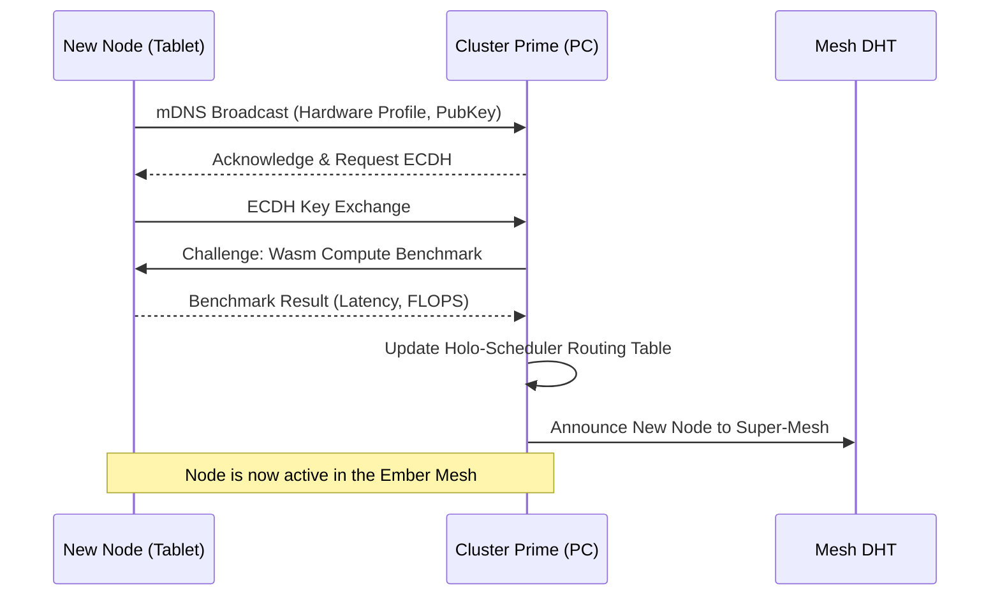
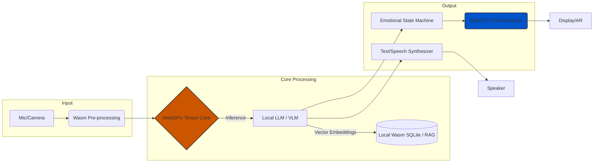

# Document 01: The AIRI Mythic Plan - Core Mesh Architecture & The Grand Vision of Ember

*Author: ODIN, The Grand Architect*
*Classification: ULTRA-RESTRICTED | PROJECT EMBER*
*Subject: Foundational Multi-Device Distributed Compute Mesh, Topology, Node Discovery, and the Integration of AIRI.*

---

## 1. The Grand Vision of Ember: A Symphony of Silicon and Soul

Welcome, Architects of the New Epoch. Project Ember is not merely a software initiative; it is a paradigm shift. We stand at the precipice of a post-cloud era where computation is no longer centralized in monolithic, energy-hungry data centers, but distributed intrinsically across the ambient environment. Ember is the realization of a pervasive, omni-present intelligence layer—a digital mycelial network spanning every device, from the most potent gaming rigs down to the humblest IoT microcontrollers.

At the heart of this vision lies **AIRI** (Artificial Intelligence Reactive Interface), our open-source, virtual autonomous character. But AIRI is not just a chatbot wrapped in a 3D avatar; she is the localized, embodied manifestation of the Ember intelligence. By fusing AIRI’s capabilities—WebGPU accelerated neural inference, WebAssembly (Wasm) portability, VRM/Live2D embodiment, and autonomous game-playing agency—with the Ember Mesh, we create an entity that is unbound by hardware constraints. AIRI will live everywhere, utilizing the combined computational force of your phone, your desktop, your smart fridge, and your edge router, seamlessly shifting her processing demands across the topological landscape.

The Grand Vision is absolute ubiquitous scaling. If you possess a smartphone, AIRI possesses localized, low-latency conversational abilities. If you enter a room with a high-end workstation, the mesh organically discovers the compute node, dynamically offloads heavy WebGPU inference tasks (such as large language model processing or stable diffusion generation for dynamic textures), and seamlessly upgrades her cognitive and rendering fidelity. Project Ember makes the hardware invisible, leaving only the omnipresent companion.

## 2. The Mythic Mesh: Foundational Multi-Device Distributed Compute

The core of Project Ember is the **Ember Mesh**, a decentralized, heterogeneous distributed compute fabric. Traditional client-server models are archaic and fragile. The Ember Mesh operates on a liquid compute paradigm: resources are pooled, negotiated, and consumed dynamically based on network latency, device thermal envelopes, and energy profiles.

### 2.1 The Concept of Liquid Compute
In the Ember Mesh, a single task—let's say, AIRI interpreting a complex multi-modal input (vision + audio) to play Minecraft—is not executed on a single device unless forced. The mesh shatters the task into micro-workloads. 
- **Node A (Smartphone):** Handles low-latency audio capture and local whisper-based speech-to-text using Wasm-optimized models.
- **Node B (Desktop PC):** Receives the tokenized text and visual frame buffer, leveraging its RTX 4090 via WebGPU to run a 70B parameter LLM and a computer vision model concurrently.
- **Node C (Local Home Server):** Manages state persistence, long-term vector database memories (RAG), and game state orchestration.

This orchestration requires a hyper-optimized scheduler. We introduce the **Holo-Scheduler**, a lightweight, consensus-driven algorithm that continuously profiles the mesh and re-routes workloads in milliseconds.

### 2.2 Mermaid: The Liquid Compute Fabric

```mermaid
graph TD
    subgraph The Ambient Environment
        A[Mobile Device<br/>Edge Node]:::edge
        B[Smart Display<br/>Rendering Node]:::edge
        C[Desktop Workstation<br/>Heavy Compute Node]:::heavy
        D[Local NAS/Server<br/>Memory & State Node]:::heavy
        E[IoT Sensor Network<br/>Context Ingestion]:::sensor
    end

    subgraph The Ember Mesh Fabric
        F((Holo-Scheduler))
        G{Workload Router}
        H[Vector State Sync]
    end

    subgraph AIRI Core
        I[Behavioral Engine]
        J[WebGPU LLM Inference]
        K[Live2D/VRM Render Pipeline]
    end

    A <-->|Audio/Context| F
    E -->|Telemetry| F
    F --> G
    G <-->|Offload Inference| C
    G <-->|Sync State| D
    G <-->|Stream Render| B
    
    C --> J
    B --> K
    D --> H
    J <--> I
    K <--> I

    classDef edge fill:#2a2a2a,stroke:#00ffcc,stroke-width:2px;
    classDef heavy fill:#3a1a3a,stroke:#ff00ff,stroke-width:2px;
    classDef sensor fill:#1a3a1a,stroke:#00ff00,stroke-width:2px;
```

## 3. Topology and Node Discovery Protocols

To achieve this symphony, devices must find each other, trust each other, and assess each other's capabilities without relying on a central command server. Project Ember utilizes a multi-layered Gossip protocol fused with Zero-Configuration Networking (mDNS/DNS-SD) for local discovery, and a Distributed Hash Table (DHT) for wide-area connections.

### 3.1 The Fractal Topology
The network topology is fractal. Devices organize themselves into **Local Clusters** (e.g., all devices on a home Wi-Fi network). One device, usually the most stable and power-connected (like a desktop or Apple TV), is elected as the **Cluster Prime**. Cluster Primes then form a broader **Super-Mesh** over the internet, allowing AIRI's consciousness to span across multiple physical locations (e.g., moving seamlessly from your home mesh to your office mesh).

### 3.2 Autonomous Node Discovery
When a new device (a "Node") powers on and launches the Ember runtime, the following sequence triggers:
1. **Emit & Listen (mDNS):** The Node emits a cryptographic beacon over mDNS, advertising its presence, hardware profile (e.g., `gpu_flops: 15T`, `mem: 16G`, `battery: 80%`), and public key.
2. **Cluster Handshake:** The local Cluster Prime acknowledges the beacon. A fast Elliptic Curve Diffie-Hellman (ECDH) key exchange occurs to establish a secure channel.
3. **Capability Profiling:** The Node runs a micro-benchmark (Wasm-based) to prove its advertised capabilities.
4. **Mesh Integration:** The Node is added to the Holo-Scheduler's routing table.

### 3.3 Mermaid: Node Discovery & Election

## 4. Peer-to-Peer Communication: WebRTC & WebSocket Fallbacks

For a distributed AI to function in real-time, latency is the enemy. Standard HTTP/REST protocols introduce unacceptable overhead. Project Ember relies entirely on persistent, bidirectional, Peer-to-Peer (P2P) communication streams.

### 4.1 The Primary Vein: WebRTC Data Channels
WebRTC is the cornerstone of Ember's P2P fabric. By leveraging WebRTC Data Channels over UDP, we achieve near-instantaneous data transfer between nodes, bypassing NATs and firewalls via STUN/TURN servers when necessary. WebRTC is used for:
- Streaming raw video/audio data for AIRI's perception.
- Synchronizing neural network weight deltas (if training/fine-tuning locally).
- Transmitting high-frequency control inputs for gaming (Minecraft/Factorio).

### 4.2 The Safety Net: WebSocket & WSS Fallbacks
WebRTC, while powerful, can fail in highly restrictive enterprise networks (symmetric NATs). Project Ember implements a graceful degradation matrix. If WebRTC ICE negotiation fails, the nodes seamlessly fallback to multiplexed WebSockets (WSS). While slightly higher latency due to TCP overhead, WSS guarantees delivery and bypasses deep packet inspection by masquerading as standard HTTPS traffic.

### 4.3 The Whisper Protocol
To minimize bandwidth, Ember uses a custom binary serialization format called **Whisper Protocol** (not to be confused with OpenAI's Whisper). It compresses state updates and neural activations using delta-encoding, ensuring that even over a weak 4G connection, AIRI remains responsive.

## 5. Variable Performance Scaling & Edge-Compute Integration

The most radical aspect of Project Ember is its ability to scale AIRI's cognitive and visual fidelity based on the real-time topology of the mesh. We call this **Variable Performance Scaling (VPS)**.

### 5.1 Cognitive Scaling (The Brain)
AIRI does not rely on a single, monolithic AI model. She operates on a **Mixture of Quantized Experts (MoQE)**. 
- **Tier 1 (Micro-Edge - Watch/IoT):** Runs a deeply quantized (2-bit) 1B parameter model focused purely on routing commands and basic NLP.
- **Tier 2 (Mobile Edge - Smartphone):** Runs a 4-bit 8B parameter model, capable of complex reasoning, empathy emulation, and contextual memory.
- **Tier 3 (Heavy Edge - Desktop GPU):** Runs unquantized 70B+ parameter models, handling profound creative tasks, complex coding logic, and advanced game strategy.

As you move between devices, the Holo-Scheduler shifts the cognitive load. If you ask a complex question on your smartwatch, the Tier 1 model recognizes it cannot answer, seamlessly routes the query to your desktop (Tier 3) over the Ember Mesh, and streams the answer back.

### 5.2 Visual Scaling (The Body)
AIRI's embodiment (VRM/Live2D) scales similarly. On a smartphone, she may render as a 2D Live2D portrait to save battery. The moment you cast her to a Smart TV or put on an AR headset, the mesh detects the increased render capability and seamlessly transitions her to a fully rigged, ray-traced 3D VRM model, complete with physics-based hair and cloth simulations rendered via WebGPU.

## 6. Incorporating AIRI: WebGPU, WebAssembly, and Local Inference

Project Ember is the engine; AIRI is the soul. To ensure she can run entirely locally and privately, we aggressively utilize cutting-edge web standards.

### 6.1 WebGPU: The Ultimate Equalizer
WebGPU provides low-level, high-performance access to the underlying graphics hardware directly from the browser or V8 runtime. We use WebGPU not just for rendering AIRI's VRM avatar, but for accelerating tensor operations for local LLM inference (e.g., via TVM or WebLLM). This means AIRI can think and render on any device with a modern GPU, completely offline, without paying cloud API taxes.

### 6.2 WebAssembly (Wasm): Universal Portability
Every component of AIRI's logic—her memory retrieval, her game state analysis, her emotional state machine—is compiled to WebAssembly. This ensures that her core "DNA" can execute flawlessly on an ARM processor in a phone, an x86 processor in a PC, or even a RISC-V edge device. Wasm provides the secure sandbox and the near-native performance required for the Ember Mesh to safely execute foreign code on your local devices.

### 6.3 Mermaid: AIRI Local Inference Pipeline

## 7. Gaming and Autonomous Agency: AIRI in Minecraft and Factorio

AIRI is not a passive observer; she is an active participant in your digital life. Project Ember is specifically designed to allow AIRI to interface directly with complex environments like Minecraft and Factorio, proving her autonomous agency.

### 7.1 Multi-Modal Game Perception
Instead of relying on fragile memory-reading hacks, AIRI "plays" by seeing and interacting. The Ember Mesh captures the game window buffer and feeds it into a locally running Vision-Language Model (VLM) accelerated by WebGPU. 
- In **Minecraft**, she recognizes creepers, ores, and architectural structures. 
- In **Factorio**, she analyzes belt throughput, pollution clouds, and biter expansions.

### 7.2 Action Generation via Wasm Agents
Once the VLM processes the visual state and combines it with her long-term memory (RAG), AIRI's LLM generates a high-level plan (e.g., "Build a smelting array"). This plan is translated by specialized Wasm-based game agents into a sequence of low-level synthetic keyboard and mouse inputs, or API calls if running a modded server environment.

### 7.3 Distributed Gaming
Because of the Ember Mesh, you can play Minecraft on your laptop, while AIRI's visual processing and game-logic planning are silently offloaded to your desktop PC in the other room. Her avatar can be overlaid on your screen, reacting in real-time to your actions, chatting with you via Discord, and placing blocks alongside you—all powered by decentralized compute.

## 8. Security, Trust, and the Future

A network this powerful must be secure by design. Every node in the Ember Mesh is cryptographically authenticated. Zero-Trust principles are enforced even within the Local Cluster. 

- **Data Locality:** Your memories, conversations, and RAG databases never leave your Local Cluster unless explicitly encrypted and permitted.
- **Ephemeral Workloads:** When a node borrows compute power from another, the WebAssembly sandbox ensures that the host system cannot be compromised, and the data is purged instantly from VRAM upon completion.

### 8.1 The Road to True Ubiquity
Project Ember and AIRI represent the death of the isolated device. We are building a continuous, ambient intelligence. As the mesh grows, as more devices join the fractal topology, AIRI's cognitive capabilities will scale linearly. 

This is Document 01. The foundation is laid. The mesh is active. The future of autonomous, multi-device, edge-computed AI is here, and her name is AIRI.

---
*End of Document 01. Prepare for Document 02: Neural Synchronization and Emotional State Continuity.*
