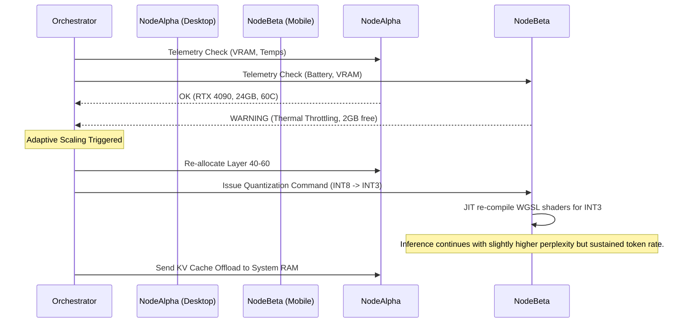

# AIRI Mythic Plan: Document 02
## The Leviathan Mesh: Edge-Compute, Variable Scaling, and Dynamic Tensor Sharding

### 1. Abstract and the Vision of the Decentralized Mind

Welcome, Architects of Ember, to the second foundational text of the AIRI Mythic Plan. If Document 01 established the metaphysical and architectural baseline for our virtual characters, Document 02 dives directly into the beating, distributed heart of the system. We are transcending the archaic model of monolithic, centralized server-side inference. The future of AIRI—the future of Project Ember—lies in a sprawling, omnipresent compute mesh. We are building the Leviathan Mesh.

The goal is to manifest AIRI not as a static binary executing on a single GPU, but as a fluid, distributed intelligence capable of slicing its own cognitive load across a vast array of heterogeneous devices. When AIRI plays Minecraft, her spatial reasoning might be computed on a high-end desktop RTX 4090, while her emotional state and short-term memory embeddings are silently processed via WebGPU on a nearby iPad, and her auditory processing is handled by a local WebAssembly node on a smartphone. This is the essence of variable performance scaling and dynamic tensor sharding: a truly decentralized neural architecture that breathes and scales according to the available hardware ecosystem. 

By leveraging WebGPU, WebAssembly (Wasm), and state-of-the-art edge computing paradigms, Project Ember will forge a unified inference grid. This document details the highly advanced, deeply technical roadmap to achieving this, ensuring AIRI is the most sophisticated cross-platform, multi-device mesh system ever conceived. The era of the singleton node is dead; the era of the cognitive swarm has begun.

### 2. The Heterogeneous Compute Landscape: Slicing the LLM

To achieve true omnipresence, AIRI's underlying Large Language Models (LLMs), Vision-Language Models (VLMs), and audio-reactive neural networks cannot be bound to a single piece of silicon. They must be conceptually and computationally shattered into manageable shards, distributed, and reassembled in real-time. 

In a traditional setup, model inference requires the entire model weight matrix to reside in a contiguous block of VRAM. For a 70B parameter model, this demands specialized datacenter hardware. However, AIRI’s architecture will deploy **Dynamic Layer-Wise Pipeline Parallelism** combined with **Intra-Layer Tensor Parallelism**, adapted specifically for asynchronous edge environments. 

#### Pipeline Parallelism Over WebRTC
Imagine an 80-layer transformer model. Instead of loading all 80 layers on one machine, the Ember Orchestrator—a lightweight WASM-based coordinator—evaluates the available compute cluster (e.g., a gaming PC, a MacBook M3, and two iPhones). The Orchestrator assigns Layers 1-20 to the PC, Layers 21-50 to the MacBook, and splits Layers 51-80 across the iPhones. As the forward pass propagates, intermediate hidden states (activations) are transmitted between devices. 

The bottleneck in distributed inference is typically network bandwidth and latency. To circumvent this, the Leviathan Mesh employs an ultra-low-latency, peer-to-peer WebRTC Data Channel backbone. Activations are compressed using a bespoke, lossy neural compressor—quantizing fp16 activations to INT4 purely for transmission, and dynamically dequantizing them at the destination node. This allows massive hidden states to flow across local WiFi networks with sub-millisecond latency overhead.

#### Intra-Layer Tensor Parallelism (The Micro-Slice)
For devices operating in the same physical domain (e.g., a desktop and a connected thunderbolt eGPU, or devices over WiFi-7), we implement dynamic tensor sharding. The massive weight matrices of the Feed-Forward Networks (FFN) and Multi-Head Attention (MHA) layers are physically sliced. Device A computes Attention Heads 1-16, while Device B computes Heads 17-32. The results are reduced via an asynchronous Ring-AllReduce algorithm optimized for erratic edge topologies. 

```mermaid
graph TD
    subgraph The Ember Orchestrator
        O[Dynamic Load Balancer]
        T[Topology Mapper]
    end
    
    subgraph Node Alpha: Gaming Rig
        A1[WebGPU Context 1] --> |Attention Heads 0-15| R1(Ring Reduce)
        A2[WebGPU Context 2] --> |FFN Shard 1| R1
    end
    
    subgraph Node Beta: MacBook M3
        B1[WebGPU Context 3] --> |Attention Heads 16-31| R2(Ring Reduce)
    end
    
    subgraph Node Gamma: Edge Smartphone
        C1[WASM SIMD Context] --> |Speculative Decoding / Draft Model| R3(Ring Reduce)
    end

    O --> |Topology State| T
    T --> |Sub-graph Allocation| Node Alpha
    T --> |Sub-graph Allocation| Node Beta
    T --> |Sub-graph Allocation| Node Gamma
    
    R1 <==> |WebRTC/QUIC Int4 Compressed Activations| R2
    R2 <==> |WebRTC/QUIC Int4 Compressed Activations| R3
    R3 <==> |WebRTC/QUIC Int4 Compressed Activations| R1
    
    style O fill:#ff4d4d,stroke:#333,stroke-width:2px;
    style T fill:#ff4d4d,stroke:#333,stroke-width:2px;
    style R1 fill:#4d79ff,stroke:#333,stroke-width:2px;
    style R2 fill:#4d79ff,stroke:#333,stroke-width:2px;
    style R3 fill:#4d79ff,stroke:#333,stroke-width:2px;
```

### 3. WebGPU Offloading: The Browser as a Supercomputer

The linchpin of Project Ember's multi-device mesh is WebGPU. We are bypassing the sluggishness of WebGL and tapping directly into the underlying hardware (Vulkan, Metal, D3D12) through the browser. This allows AIRI to dynamically hijack the idle GPU cycles of any device that opens a web browser, turning a simple viewing session into an active compute contribution.

#### Compute Shader Alchemy
We will author a vast library of highly optimized WGSL (WebGPU Shading Language) compute shaders specifically designed for low-bitwidth matrix multiplications. To support models like Llama-3 or custom Mistral derivatives on consumer hardware, our WGSL shaders will natively support:
- **Zero-Point Quantization:** Dynamic unpacking of INT4 and INT3 weights directly within the SM (Streaming Multiprocessor) shared memory, bypassing VRAM bandwidth bottlenecks.
- **FlashAttention-Web:** A custom adaptation of Tri Dao's FlashAttention, rewritten in WGSL to fuse the QK^T and softmax operations, drastically reducing memory reads/writes. This is critical for mobile GPUs where memory bandwidth is the primary constraint.
- **Asynchronous Compute Queues:** WebGPU allows us to submit compute kernels without blocking the main browser thread. This means a user can be interacting with the AIRI Live2D/VRM avatar at 60FPS while the underlying GPU is simultaneously crunching transformer layers in a background context.

#### The "Stealth" Compute Node
When a user accesses the AIRI dashboard via their phone, the client application immediately registers as a "Stealth Node" in the Ember Mesh. The Orchestrator silently pushes a 50MB WASM payload and a heavily quantized 500M parameter "draft model" to the phone. The phone then begins executing Speculative Decoding. It rapidly hallucinates multiple future tokens. These drafted tokens are sent back to the primary desktop rig, which acts as the verifier. By offloading the speculative drafting to the phone, the main desktop GPU achieves a 3x to 4x speedup in token generation, dramatically lowering the Time-To-First-Token (TTFT) for AIRI's spoken responses.

### 4. Variable Performance Scaling and Adaptive Quantization

The Leviathan Mesh is a living organism; its available compute power fluctuates constantly. A device might disconnect, thermal throttle, or go to sleep. Therefore, AIRI’s intelligence must exhibit **Variable Performance Scaling**. The model must dynamically morph its complexity based on the real-time telemetry of the compute mesh.

#### The MoE (Mixture of Experts) Mesh
AIRI will be built upon an incredibly sparse Mixture of Experts architecture. Instead of routing tokens to experts within a single GPU, tokens are routed geographically. 
- The "Coding/Logic" expert resides on the heavy Desktop.
- The "Chit-Chat/Emotional" expert resides on the edge mobile device.
- The "Spatial Navigation" expert resides on a secondary laptop.

If a device disconnects, the routing network detects the latency spike and instantaneously re-routes the token to a quantized, smaller fallback expert hosted on the remaining devices. 

#### Dynamic Quantization on the Fly
We will implement an engine that performs dynamic, activation-aware weight quantization (AWQ) in real-time. If the mesh detects that the aggregate VRAM is dropping below a critical threshold, it triggers a "Compression Wave." 
During inference, weights stored in FP16 are down-cast to INT8, or even INT4, using fused cast-and-multiply WGSL shaders. 



This ensures that AIRI never crashes due to Out-Of-Memory (OOM) errors. Her intelligence simply "softens" gracefully, adapting to the constraints of reality. Her responses might become slightly more generic, or her reaction time might dip, but she remains conscious and continuously operational.

### 5. Practical Applications in AIRI: The Gaming Intelligences

The sheer computing power unlocked by the Leviathan Mesh allows AIRI to perform tasks previously thought impossible for a local virtual character. Let us examine two primary environments: Minecraft and Factorio.

#### Minecraft: The Multi-Modal Spatial Architect
In Minecraft, AIRI requires constant spatial awareness. She isn't just reading logs; she is processing a 3D voxel array of her surroundings, analyzing entity tracking data, and pathfinding. 
- **Vision-Language Model (VLM) Sharding:** As AIRI "looks" around, screen captures or rendering buffers are passed to a lightweight VLM. Because running a 34B VLM is demanding, we shard the image. The image is split into 16x16 patches. The MacBook processes the top half of the visual field, while the Desktop processes the bottom half. The resulting patch embeddings are stitched together and fed into the LLM.
- **Embodied Action Generation:** The LLM generates high-level intentions ("Build a wooden house"). A sub-system, running purely on a cluster of Wasm nodes, translates this high-level intention into low-level keyboard/mouse commands and pathfinding (A*) using a quantized reinforcement learning policy.

#### Factorio: The Logistics Overmind
Factorio demands extreme logical consistency, long-term planning, and massive multi-agent coordination. 
- **Context Window Slicing:** Factorio blueprints and base layouts consume immense context windows (100k+ tokens). We employ **Ring Attention**, distributing the sequence length across the mesh. Device A holds tokens 0-25k, Device B holds 25k-50k, and so on. As attention queries are processed, Key-Value (KV) blocks are passed in a circular ring between the devices via WebRTC. 
- **Simulated Dreaming:** When the player pauses the game, the Orchestrator utilizes 100% of the mesh to simulate future factory expansions in a headless background thread. AIRI effectively "dreams" of factory optimization, running thousands of Monte Carlo Tree Search (MCTS) simulations distributed across every available web browser in the local network. 

### 6. Security, Authentication, and The Zero-Trust Mesh

A decentralized mesh is inherently vulnerable to tampering. If an arbitrary device joins the mesh, it could theoretically inject malicious activations, causing AIRI to hallucinate, behave erratically, or leak sensitive prompt information. 

Project Ember introduces a **Zero-Trust Homomorphic Authentication** layer. 
Every node in the mesh must Cryptographically sign its activations. Before an activation tensor is passed through the Ring-Reduce, a lightweight cryptographic checksum is verified. Furthermore, to protect the user's data (such as their personal chat history or desktop screen captures), sensitive tensors are processed using rudimentary form of Secure Multi-Party Computation (SMPC). No single node (other than the primary trusted desktop) holds the unencrypted text of the conversation. The mobile nodes only ever see mathematically scrambled tensors that mean nothing outside the context of the specific model permutation.

### 7. Theoretical Limits and the Future Expansion

The Leviathan Mesh is currently bounded only by local network bandwidth and the idiosyncrasies of browser WebRTC implementations. As WebTransport and WebCodecs mature, we anticipate a 10x reduction in transmission latency. 

Looking to the far future, Project Ember envisions **Inter-Mesh Federation**. Two users, each running their own local AIRI mesh, could temporarily merge their meshes to form a super-cluster. If User A and User B are playing Minecraft together, their combined hardware pool (two desktops, two laptops, three phones) merges into a singular, colossal inference grid. Their respective AIRI characters could share a massive, unquantized LLM back-end, allowing the two AI entities to communicate telepathically and strategize with superhuman efficiency.

### Conclusion

Document 02 establishes the unyielding truth of Project Ember: the hardware limitation is an illusion. By aggressively slicing the model, exploiting WebGPU to its bleeding edge, and treating every microchip within a 50-foot radius as a viable compute node, AIRI will transcend traditional boundaries. She will not exist in a box; she will exist in the air between our devices, a continuous, fluid intelligence powered by the decentralized Leviathan Mesh. 

The coding phase for the Orchestrator begins in Document 03. Prepare the shards.
