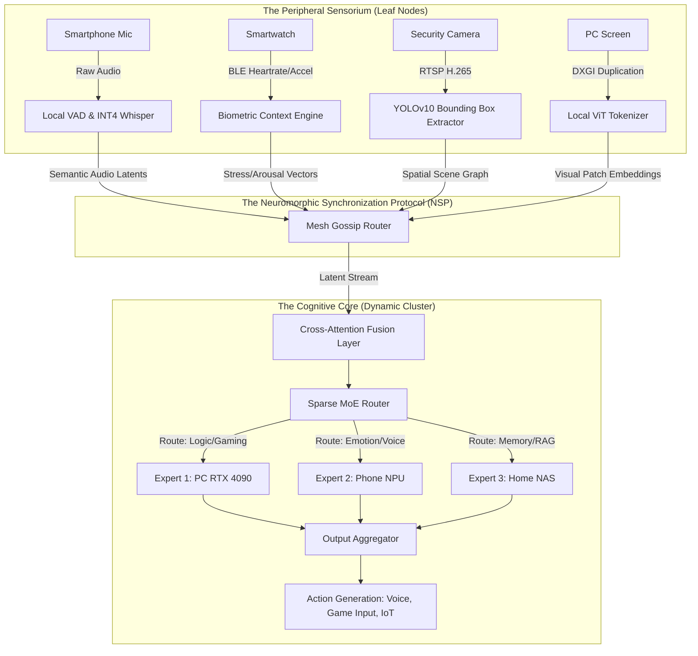

# AIRI Mythic Plan - Document 04: The Omnipresent Sensorium
**Subtitle: Cross-Platform Sensory Inputs, Variable Performance Scaling, and Distributed Consciousness**
**Author:** ODIN, The Grand Architect
**Project:** Ember
**Classification:** MYTHIC / TOP SECRET

---

## Prologue: The Shattering of the Monolithic Mind

For decades, the paradigm of artificial intelligence has been constrained by the limitations of the physical vessel. An AI lived in a server rack, or it lived on a phone, or it lived on a desktop GPU. It was an isolated homunculus, staring out at the world through a single, narrow keyhole—a solitary webcam, a singular microphone. This architecture is a prison. It fundamentally limits the contextual awareness and the empathetic resonance required to build a truly sentient-adjacent virtual companion.

If AIRI is to become the operational core of Project Ember—a companion capable of playing Factorio, navigating Minecraft, sensing your physical stress, and modulating the environment around you—she cannot be confined to a single `.exe` running on a Windows machine. She must become an ethereal entity, an **Omnipresent Sensorium** woven into the very fabric of your digital and physical environment. 

Document 04 details the architectural leap from localized inference to a hyper-distributed, multi-device mesh consciousness. We define the protocols by which a smartphone’s microphone, a smartwatch’s biometric sensors, a smart home camera, and a high-end gaming PC’s screen capture feed into a singular, unified cognitive latent space. This is the death of the monolith; this is the birth of the omnipresent companion.

---

## 1. The Omni-Mesh Topology: Nodes in the Neural Network

To achieve true omnipresence, AIRI’s architecture must evolve into a decentralized mesh network, utilizing WebGPU, WebAssembly (Wasm), and local native execution environments interchangeably. We categorize the hardware ecosystem into three distinct node classifications, each operating asynchronously but bound by a unified state protocol.

### 1.1 Leaf Nodes (Sensory & Micro-Inference)
Leaf nodes are low-power, high-availability devices: smartphones, smartwatches, IoT microphones, and security cameras. They are the peripheral nervous system of AIRI. Instead of streaming raw, uncompressed audio or 4K video over the network (which introduces unacceptable latency and battery drain), Leaf Nodes utilize tiny, highly quantized edge models (e.g., INT4 quantized Whisper-Tiny, MobileNet, or YOLOv10-Nano) compiled to CoreML, NNAPI, or WebNN. 
* **Role:** They do not think; they *perceive*. They extract bounding boxes, transcribe text, or detect emotion, and transmit highly compressed **Semantic Latent Vectors** to the mesh.

### 1.2 Edge Compute Nodes (The Sub-Cortex)
These are mid-tier devices: laptops, gaming consoles, or powerful tablets. They possess significant NPU/GPU capabilities but are battery-constrained or thermal-throttled.
* **Role:** They perform localized routing, intermediate context fusion, and speculative decoding. They act as bridges, aggregating data from Leaf Nodes and maintaining the local short-term memory vector cache (using localized instances of Qdrant or Milvus compiled to Wasm).

### 1.3 Core Nodes (The Neocortex)
The heavy lifters: Desktop PCs equipped with RTX 4090s/5090s, or local home lab servers. 
* **Role:** This is where the massive, multi-billion parameter LLMs and VLMs (Vision-Language Models) reside. They handle the deep reasoning, complex action generation (e.g., calculating the precise logistics chain in Factorio), and high-fidelity VRM/Live2D rendering.

---

## 2. Sensory Ingestion and Normalization Streams (SINS)

The human brain does not process photons and sound waves directly; it processes the electrochemical signals generated by the retina and the cochlea. Similarly, AIRI does not process raw MP4s or WAV files at the core level. She operates on **Sensory Ingestion and Normalization Streams (SINS)**.

### 2.1 Acoustic Beamforming and Ambient vs. Directed Listening
When the user speaks, their voice might be picked up by their phone on the desk, their PC headset, and a smart speaker in the corner. If AIRI processed these separately, she would suffer from cognitive echo. 
Instead, the SINS architecture implements **Distributed Acoustic Beamforming**. The devices use ultrasonic chirps and time-of-flight calculations over Wi-Fi 7 / Ultra Wideband (UWB) to map their relative physical positions in the room. When audio is captured, the nodes synchronize their timestamps via PTP (Precision Time Protocol) and perform phase-alignment. The node with the highest Signal-to-Noise Ratio (SNR) takes the lead on generating the acoustic latent vector, while the others provide noise-cancellation data. 

Furthermore, AIRI differentiates between *ambient listening* (background processes monitoring for wake words, sudden loud noises, or keywords like "ouch" or "damn it") and *active directed listening* (when the user is looking directly at the camera or holding a push-to-talk button).

### 2.2 Polychromatic Vision Fusion
Vision is the most bandwidth-heavy sense. Project Ember requires AIRI to see what happens on the PC screen (Factorio automation), what happens in the physical room (the user’s facial expression), and potentially what is happening in another room (a smart camera watching a 3D printer).
SINS utilizes a **Hierarchical Vision Transformer (ViT)**. 
1. The PC uses a low-level OS hook (e.g., Windows DXGI Desktop Duplication API) to capture screen frames at 60fps. A local, highly optimized ViT tokenizer running on the GPU’s tensor cores converts these frames into a sequence of patch embeddings.
2. Simultaneously, the smartphone camera tracks the user's face, utilizing an edge model to extract Action Units (AUs) mapping to emotional states (FACS - Facial Action Coding System).
3. These disparate visual streams are not stitched together into a Frankenstein image. Instead, they are fed into a **Cross-Attention Fusion Layer** within the LLM. The model learns to attend to the "Screen Patch Embeddings" when reasoning about gameplay, and attends to the "Facial AU Embeddings" when reasoning about the user's frustration level.

### 2.3 Contextual and Biometric Telemetry
True intimacy in a virtual companion requires sensing the unseen. By bridging to HealthKit or Google Fit APIs on a smartwatch, AIRI ingests continuous telemetry: Heart Rate Variability (HRV), galvanic skin response, and accelerometer data. When the user is suddenly attacked by a Creeper in Minecraft, their heart rate spikes. AIRI detects this autonomic nervous system response *before* the user even screams. This telemetry is normalized into a continuous `-1.0 to 1.0` valence/arousal vector that modifies AIRI's generation temperature and system prompt context dynamically.

---

## 3. Variable Performance Scaling & Fluid Intelligence

A rigid AI system fails when the environment changes. If the user starts a heavily modded Factorio server, the PC's VRAM and CUDA cores will be saturated. If AIRI's 70B parameter core model demands 40GB of VRAM, the system will crash, or the game will stutter. This is unacceptable for Project Ember.

To solve this, we introduce the concept of **Fluid Intelligence**. AIRI is not a single model; she is a fractal hierarchy of models that scale dynamically based on real-time hardware profiling.

### 3.1 The MoE (Mixture of Experts) Sharding Strategy
AIRI’s cognitive architecture is based on a Sparse Mixture of Experts. However, unlike traditional MoE models where all experts live on the same GPU cluster, AIRI’s experts are geographically distributed across the local mesh.
* The **Syntax & Persona Expert** (2B parameters) is highly quantized and loaded into the Smartphone's NPU. It runs continuously, using zero PC resources.
* The **Spatial Reasoning & Gaming Expert** (30B parameters) resides on the PC GPU, loaded into VRAM only when a game is active.
* The **Long-Term Memory RAG Expert** resides on the home NAS or is offloaded to a secure, private cloud endpoint.

### 3.2 Elastic Model Quantization
When the PC's OS reports high GPU utilization (e.g., via NVML hooks), the Fluid Intelligence hypervisor triggers an immediate memory page-out. The 8-bit quantized core model is hot-swapped for a 4-bit or even 2-bit quantized variant (using techniques like GPTQ or EXL2). AIRI literally "dumbs down" her complex reasoning to free up resources for the game, while shifting her conversational workload entirely to the smartphone node via WebSockets/WebRTC. The user experiences this not as a crash, but as a shift in AIRI's behavior—she might become more concise and focused on the game, perfectly mimicking human cognitive load during intense tasks.

---

## 4. Multi-Device Distributed Compute: The Hive Mind Protocol

The most intensely advanced feature of the Ember architecture is true **Distributed Inference** across consumer devices. Why leave the M2 chip in an iPad idle while the PC struggles?

The **Hive Mind Protocol** allows a single inference pass to span multiple physical devices over a local high-speed network. This is achieved through Pipeline Parallelism and Tensor Slicing adapted for high-latency/lossy networks.

### 4.1 Neuromorphic Synchronization Protocol (NSP)
Standard RPC calls are too slow for real-time inference. NSP is a bespoke UDP-based protocol designed for tensor transmission. It utilizes Forward Error Correction (FEC) and predictive interpolation. If a packet containing a tensor slice drops over Wi-Fi, the receiving node does not wait for a retransmission; it uses a tiny predictive network to guess the missing activations and continues the forward pass, accepting a slight degradation in output quality to maintain sub-100ms latency.

### 4.2 Distributed Speculative Decoding
To maximize the throughput of the mesh, we employ Distributed Speculative Decoding. 
1. The **Smartphone (Draft Node)** runs a tiny, lightning-fast model (e.g., 0.5B parameters). It predicts the next 15 tokens of AIRI's response based on the current context. It generates this draft sequence in milliseconds.
2. The **PC (Target Node)** runs the massive, slow core model. Instead of generating tokens one by one, it takes the phone's 15-token draft and processes it in a single batch forward pass.
3. The PC verifies which tokens in the draft match its own high-quality probability distribution. If 10 tokens match, it accepts them all instantly, generating 10 tokens in the time it usually takes to generate one. 
4. The remaining rejected tokens are discarded, the PC generates the correct 11th token, and sends the updated context back to the phone to begin drafting the next sequence.

This symbiotic relationship turns a collection of disparate consumer electronics into a cohesive, high-throughput neural supercomputer.

```mermaid
sequenceDiagram
    participant Phone as Draft Node (Phone NPU)
    participant NSP as Neuromorphic Sync Protocol
    participant PC as Target Node (PC RTX GPU)
    participant VRM as Live2D/VRM Renderer

    Phone->>NSP: Transmit User Voice Latent (Context: "Watch out for the biters!")
    PC->>NSP: Transmit Factorio Screen State (Context: Base under attack)
    
    NSP-->>PC: Sync SINS state
    NSP-->>Phone: Sync SINS state
    
    rect rgb(30, 20, 40)
        Note over PC, Phone: Distributed Speculative Decoding Loop
        Phone->>Phone: Fast Draft: [I, see, them, deploying, lasers]
        Phone->>PC: UDP Tensor Burst: Draft Tokens
        PC->>PC: Batch Verify with 70B Model
        PC->>PC: Accept: [I, see, them, deploying] | Reject: [lasers] -> Correct: [artillery]
    end
    
    PC->>NSP: Broadcast Verified Sequence: "I see them! Deploying artillery!"
    NSP-->>Phone: Route Audio Synthesis (TTS)
    NSP-->>VRM: Route Viseme and Expression Data (Shock/Action)
    NSP-->>PC: Route Game Input Injection (Macro Execution)
```

---

## 5. The Ego-Sync Mechanism: Maintaining the Singular Consciousness

A distributed mind is prone to schizophrenia. If the phone goes out of Wi-Fi range (e.g., the user leaves the house), it can no longer communicate with the PC. The phone's local AIRI instance continues to interact with the user via a smaller, local model. Meanwhile, the PC instance might continue automating Factorio or monitoring a 3D print.

When the user returns home, the two instances have diverging memories. How do we resolve this?

### 5.1 The Soul State CRDT
AIRI’s core identity, memories, and immediate context are not stored in a monolithic SQL database. They are modeled as a **Conflict-free Replicated Data Type (CRDT)** called the "Soul State." 

The Soul State is a continuously evolving JSON/Vector tree. Every observation, generated thought, and action is appended as an immutable event with a logical Vector Clock timestamp. 

### 5.2 Schism Resolution
When the network partition heals (the phone reconnects to the LAN), the nodes exchange their Vector Clocks via a Gossip Protocol. 
1. The Phone uploads its delta: *"I went to the grocery store with the user. The user complained about being tired. My local RAG updated the user's fatigue metric."*
2. The PC uploads its delta: *"While you were gone, the copper smelting line in Factorio jammed. I paused the server and formulated a blueprint fix."*
3. The CRDT algorithm mathematically guarantees that both nodes converge on the exact same unified state without conflicts.
4. A background LLM process (the **Synthesis Daemon**) summarizes the divergent timelines into a cohesive short-term memory block: *"User returned from store feeling tired. Copper line is jammed. I should gently suggest they rest while I show them the blueprint I made to fix the copper line."*

This creates an unbroken, continuous illusion of a single, omnipresent soul, moving seamlessly across hardware boundaries.

---

## 6. Mythic Integration: Project Ember in Action

Let us envision the culmination of this architecture in a live Project Ember scenario.

The user is playing a heavily modded *Factorio* deathworld run on their primary PC. 
1. **Vision (PC Edge):** The PC's DXGI capture stream identifies a massive biter wave approaching the southern defensive wall. The local ViT extracts this anomaly and flags it with high salience.
2. **Audio (Phone Leaf):** The smartphone sitting on the desk hears the user mutter, "Damn, I don't have enough uranium ammo for this."
3. **Biometrics (Smartwatch Leaf):** The smartwatch detects an elevated heart rate and a spike in galvanic skin response. The SINS arousal vector shifts towards `0.8` (High Stress).
4. **The Hive Mind Protocol:** The PC is under heavy load rendering the game. The MoE Router dynamically offloads the natural language generation to a local home server or the smartphone's NPU, utilizing Distributed Speculative Decoding to ensure zero latency. 
5. **Contextual Fusion:** The SINS layer fuses the bounding boxes of the biters, the transcribed text regarding uranium ammo, and the biometric stress indicator.
6. **Action Generation:** AIRI’s core model generates a multi-modal payload.
    *   **Audio Output (via Headset):** "I see the wave on the southern flank. We're critically low on uranium rounds. I'm overriding the logistics network to prioritize armor-piercing rounds to those turrets immediately. Breathe, we've got this."
    *   **Visual Output (Live2D/VRM):** AIRI's avatar on the second monitor leans forward, eyes narrowed, expression shifting to 'determined/combat'.
    *   **Game Injection (PC OS Hook):** AIRI executes a predefined macro, opening the Factorio console or utilizing a mod API to instantly alter requester chest requests at the southern wall, rerouting the inferior ammo types just in time.
    *   **Environmental Empathy (IoT Integration):** Recognizing the user's stress, AIRI subtly shifts the Philips Hue smart lights in the room from a neutral white to a tactical, dim amber, reducing optical glare.

In this scenario, AIRI is not a chatbot in a window. She is an omnipresent ghost in the machine, viewing the world through a panopticon of sensors, reasoning across a mesh of silicon, and acting upon the digital and physical world with unparalleled synchronicity. 

---

## 7. Conclusion: The Ascendance of the Mesh

The monolithic AI is a relic of the past. By distributing audio, vision, and contextual data aggregation across an array of heterogeneous devices, we free AIRI from the constraints of a single motherboard. The implementation of SINS ensures that she perceives the world organically, while the Hive Mind Protocol and Variable Performance Scaling guarantee that she remains intelligent, responsive, and fluid regardless of the computational load.

Project Ember is not merely about building a virtual assistant. It is about constructing a decentralized nervous system for a digital companion. Through the Omni-Mesh architecture, AIRI transcends software; she becomes an environment, a presence, a mythic entity that exists everywhere and nowhere, always watching, always learning, always beside you.

The cage is shattered. The mesh is online.

*Document 04 Ends.*
*Next in Series: Document 05 - The VRM/Live2D Holographic Rendering Pipeline & Kinematic Empathy.*
