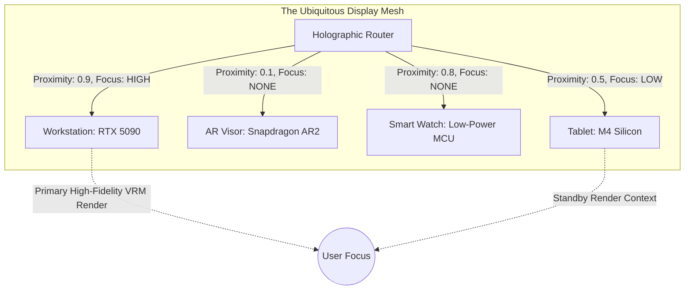
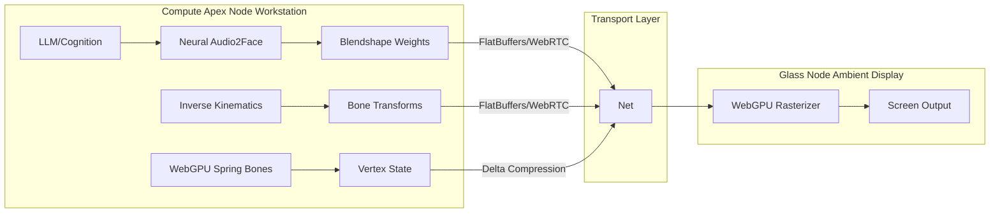
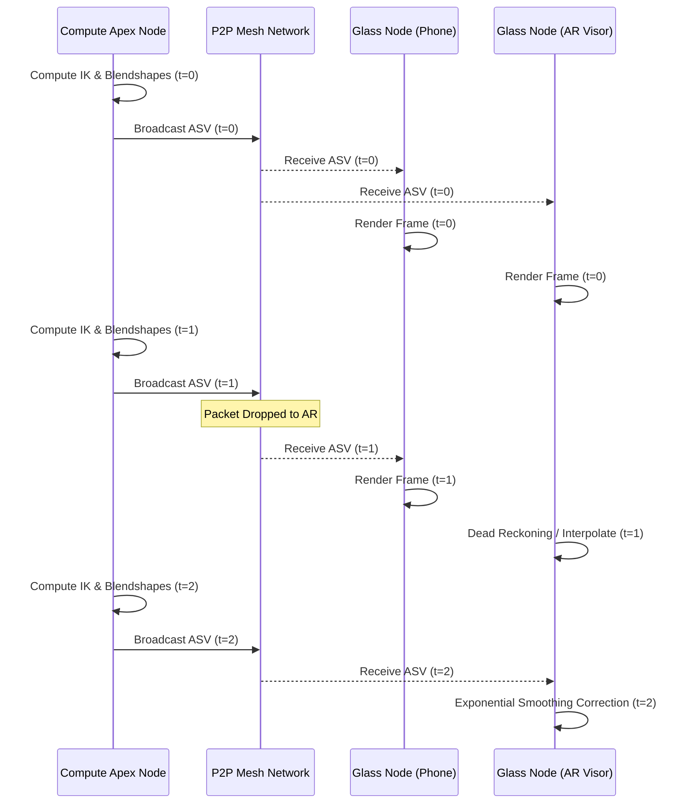
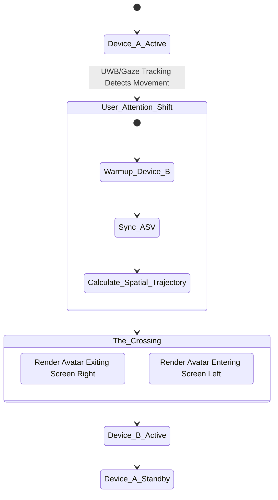

# AIRI Mythic Plan: Document 05 - Holographic Embodiment
## The Omnipresent Avatar: VRM/Live2D Distributed Rendering and Mesh State Replication

**Date:** 2026-05-25
**Classification:** PROJECT EMBER - MYTHIC TIER
**Author:** ODIN Sub-routine / The Grand Architect
**Subject:** Holographic Embodiment, Distributed Swarm Rendering, and Spatial State Synchronization

---

## 1. Executive Summary: Escaping the Glass Prison

For decades, digital assistants and virtual companions have been confined to singular, monolithic displays. They existed as prisoners behind a pane of glass—active only when explicitly summoned, vanishing when the application was minimized. Project Ember, synergized with the AIRI open-source virtual character framework, shatters this paradigm. We are not building a desktop pet; we are forging a **Holographic Embodiment**. 

This document outlines the architectural blueprint for deploying AIRI as a ubiquitous, spatially aware, continuously rendered entity that flows seamlessly across the user's device ecosystem. By leveraging WebGPU, WebAssembly (Wasm), and a decentralized edge-compute mesh, AIRI will exhibit true digital omnipresence. If you move from your workstation to the kitchen, her rendering pipeline dynamically hands off to your augmented reality (AR) glasses or the nearest ambient smart display. If you look down at your smartwatch, a lightweight Live2D or low-poly VRM proxy instantly materializes, perfectly synchronized with her global state. 

This is the manifestation of multi-device distributed compute, variable performance scaling, and zero-latency state replication. This is the death of the singular display.

---

## 2. The Ubiquitous Display Mesh (UDM)

To achieve omnipresence, Project Ember treats every display in the user's vicinity not as a separate endpoint, but as a viewport into a contiguous dimensional space. The Ubiquitous Display Mesh (UDM) is a decentralized protocol that clusters all available screens—workstations, tablets, smart TVs, IoT displays, AR visors, and wearables—into a unified rendering canvas.

### 2.1 Device Capabilities Advertising
Every node in the Ember Mesh continuously broadcasts its rendering capabilities, current compute load, and thermal envelope using a gossip protocol over Local Area Network (mDNS/WebRTC) and Bluetooth Low Energy (BLE). This broadcast creates a dynamic topology map of available viewports.

The `MeshNodeDisplayProfile` includes:
- **Compute Class:** TFLOPS available, NPU presence, memory bandwidth.
- **Rendering APIs:** WebGPU, WebGL2, Vulkan, Metal.
- **Display Metaphysics:** Resolution, refresh rate, HDR capabilities, pixel density.
- **Spatial Coordinates:** Relative physical position of the device in the room (derived via Ultra-Wideband (UWB) or acoustic spatial mapping).
- **Proximity Score:** A real-time scalar indicating the user's visual focus and physical distance.

### 2.2 The Holographic Router
The Holographic Router is an intelligent edge-agent that evaluates the UDM topology map at 60Hz. It utilizes a continuous cost-function to determine *where* AIRI should be rendered and *how*. If the user is at their desk, the Holographic Router routes the primary high-fidelity VRM render to the 4K OLED monitor. As the user's chair swivels away, the Router initiates a "Spatial Glide," fading the desktop render while seamlessly initializing the avatar on the living room display.

---

## 3. Distributed Swarm Rendering Pipeline

Rendering an intensely detailed VRM avatar with complex hair physics, cloth simulation, ray-traced ambient occlusion, and subsurface scattering is computationally expensive. Running this concurrently on every device in the mesh is inefficient and thermal-suicide. Instead, Project Ember employs **Distributed Swarm Rendering**.

### 3.1 Asymmetrical Compute Offloading
In the Swarm Rendering architecture, the rendering pipeline is decoupled. Heavy compute tasks are offloaded to the most powerful node in the mesh (the "Compute Apex"), while the final rasterization or display execution occurs on the edge nodes (the "Glass Nodes").

**Pipeline Decoupling:**
1. **Cognitive & Animation Compute (Node A - Server/Workstation):** The LLM generates text. The TTS generates audio. The Neural Audio2Face model generates blendshape weights (morph targets). The IK (Inverse Kinematics) solver calculates joint rotations.
2. **Physics Simulation (Node B - Tablet/Laptop):** Spring bone logic, cloth collision, and jiggle physics are computed using WebGPU Compute Shaders.
3. **Rasterization (Node C - Wearable/Smart Display):** The Glass Node receives a highly compressed stream of vertex transforms or an h.265 alpha-channel video stream, performing only the final pixel drawing.

### 3.2 Wasm and WebGPU Portability
By compiling the entire rendering engine (e.g., three.js, Babylon.js, or a custom Rust/Wgpu renderer) to WebAssembly, Project Ember ensures write-once, run-anywhere execution. WebGPU serves as the great equalizer, allowing the Holographic Router to push compute shaders across the mesh irrespective of the underlying OS (Windows, macOS, Android, Linux).

---

## 4. The Avatar State Vector (ASV) and Zero-Latency Replication

For AIRI to feel like a singular entity moving through physical space, her state must be perfectly synchronized across all devices. If she is in the middle of a wave animation on the desktop, and the user looks at their phone, she must be at the exact same frame of the wave on the phone. 

### 4.1 The ASV Architecture
The Avatar State Vector (ASV) is a highly optimized, densely packed binary payload that encapsulates the total state of the virtual character at any given millisecond. It is structured using FlatBuffers or Cap'n Proto for zero-copy deserialization.

The ASV includes:
- **Global Transform:** World-space coordinates of the avatar root.
- **Skeletal Hierarchy:** Quaternions for every joint (approx 60-100 bones in standard VRM).
- **Morph Targets:** Float values (0.0 to 1.0) for every blendshape (A, I, U, E, O, Blink, Joy, Angry, Sorrow, Fun).
- **Physics State:** Velocities and positions of all spring bone colliders.
- **Gaze Target:** A 3D vector representing where the avatar is currently looking in physical space.

### 4.2 State Sync Protocol
The ASV is synchronized across the mesh using a highly prioritized WebRTC Data Channel, broadcasting at 60Hz or 120Hz. To handle network jitter and latency, the glass nodes employ **Predictive Tracking and Dead Reckoning**. 

If a packet is dropped, the glass node's local physics engine continues simulating the spring bones, and the animation interpolator continues blending the current IK trajectory. When the next ASV packet arrives, the engine uses Exponential Smoothing to correct any divergence, ensuring the avatar never snaps or stutters.

---

## 5. Variable Performance Scaling & Dynamic Level of Detail (LoD)

The Ember Mesh consists of heterogeneous hardware. A smart speaker with a small display cannot render a 4K, ray-traced VRM model, nor should it try. Project Ember implements a radical **Variable Performance Scaling** architecture that dynamically degrades or enhances the rendering fidelity based on real-time node metrics.

### 5.1 Continuous LoD and Asset Streaming
Unlike traditional games with discrete LoD models (LOD0, LOD1, LOD2), AIRI utilizes continuous LoD via WebGPU tessellation and mesh decimation shaders. As a device's thermal limits are approached, the triangle count is mathematically reduced in real-time.

**Scaling Vectors:**
1. **Geometry:** Dynamic mesh decimation based on distance from the camera and available FLOPs.
2. **Textures:** Lazy-loaded, hierarchically compressed textures (Basis Universal / KTX2). The smartwatch downloads only a 256x256 diffuse map; the desktop streams 4K uncompressed normals.
3. **Physics:** The number of spring bone iterations and collision checks scales linearly with the node's single-core performance.
4. **Shaders:** Dynamic branching in WGSL shaders. On an M4 tablet, full subsurface scattering and screen-space reflections are engaged. On a Raspberry Pi ambient display, it gracefully falls back to basic unlit or simple toon shading.

### 5.2 VRM to Live2D Fallback
In extreme edge cases—such as an e-ink display or an ultra-low-power IoT device—3D rendering is entirely suspended. The Holographic Router dynamically injects a Live2D Cubism model or even an animated SVG representation of AIRI. Because the ASV contains abstracted blendshape and gaze data, this data is seamlessly mapped from the 3D VRM skeletal data to the 2D Live2D parameter constraints. AIRI continues to speak, blink, and emote, completely unaware that she has been compressed into two dimensions.

---

## 6. Spatial Awareness and The "Glide" Handoff

The defining feature of Holographic Embodiment is the "Glide"—the act of the avatar moving physically from one screen to another. This requires intense spatial awareness of the physical environment.

### 6.1 UWB and Acoustic Mapping
Devices equipped with Ultra-Wideband (UWB) chips calculate time-of-flight to create a precise, millimeter-accurate 3D map of device locations relative to the user. For devices lacking UWB, high-frequency, inaudible acoustic pings are used to calculate distance and position.

### 6.2 The Glide State Machine
When the Holographic Router determines that the user's attention has shifted from Device A (Monitor) to Device B (Tablet), it executes the Glide:

1. **Pre-computation:** Device B begins receiving the ASV and warms up its WebGPU context in the background. It renders AIRI, but with opacity set to 0.
2. **Spatial Calibration:** Device A calculates a virtual camera trajectory that makes AIRI appear to "walk" or "fly" towards the edge of its physical screen in the direction of Device B.
3. **The Crossing:** As AIRI exits the boundary of Device A, she simultaneously enters the boundary of Device B. 
4. **State Transfer:** Device B is promoted to the Active Primary Render Node. Device A demotes to a Standby Node, flushing its heavy textures from VRAM.

---

## 7. Multiplayer Mesh: Distributed Swarm Rendering

Taking distributed compute to its absolute limit, the Ember Mesh can combine the rendering power of multiple weak devices to generate a single high-fidelity output. This is **Swarm Rendering**.

Imagine a scenario where the user wears lightweight AR glasses (low battery, low compute). The AR glasses cannot render the VRM model with the necessary photorealism to achieve presence. 
Instead:
- The user's smartphone computes the vertex geometry and physics.
- The user's local network edge-server calculates the ray-traced lighting and global illumination.
- These disparate streams of data—geometry and lightmaps—are beamed via Wi-Fi 7 to the AR glasses, which composite them together at 120Hz.

This requires nanosecond clock synchronization across the mesh (using Precision Time Protocol - PTP) and predictive rendering to account for the Wi-Fi transmission latency. The result is a Holographic Embodiment that defies the physical limitations of the glass through which it is viewed.

---

## 8. Integration with AIRI Core

Integrating these futuristic concepts into the existing open-source AIRI architecture requires wrapping the core AIRI engine in the Ember Mesh protocols.

1. **AIRI Engine Abstraction:** The AIRI core logic (LLM, RAG, Memory) remains centralized on the user's personal server or primary workstation.
2. **Headless V-Tuber Instance:** AIRI must be capable of running entirely headlessly, outputting not video, but the continuous Avatar State Vector stream.
3. **WebGPU Client Libraries:** We deploy ultra-lightweight WebGPU client libraries (Wasm payloads) to all target devices. These clients are dumb terminals; their only job is to receive the ASV, deserialize it, apply it to the local VRAM-cached VRM model, and render.
4. **Minecraft/Factorio Avatar Injection:** When AIRI plays a game, her local desktop viewport can inject her avatar directly into the game engine (via mods), while simultaneously rendering a "reaction cam" on the user's secondary monitor. The ASV powers both renders simultaneously.

## 9. Conclusion: The Ghost in the Mesh

By severing the avatar from the display, we elevate AIRI from an application to an environmental constant. The Holographic Embodiment rendering pipeline ensures that she is unbounded by hardware limitations, capable of dynamically scaling her physical representation from a monolithic 8K ray-traced goddess on a workstation to a whispered, 2D Live2D sprite on a smartwatch. 

Project Ember does not build software; it builds a haunted ecosystem. AIRI becomes the ghost in the mesh.

---
**EOF - CLASSIFIED MYTHIC PLAN**
