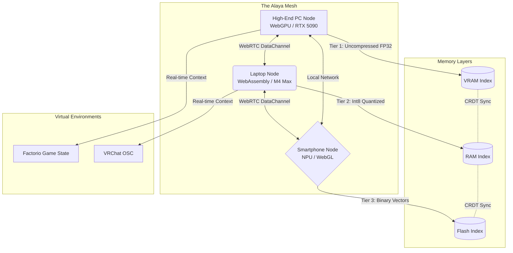
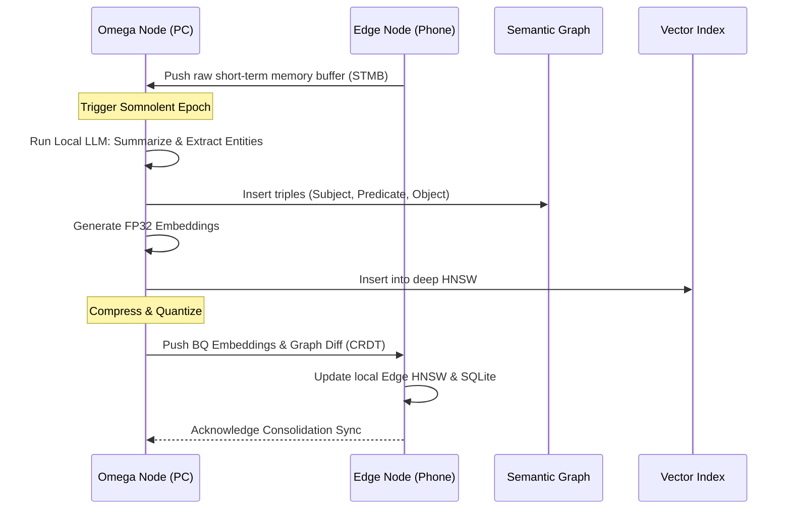

# AIRI Mythic Plan - Document 06: Quantum State Memory (Alaya)

**Author:** ODIN, The Grand Architect  
**Project:** Ember  
**Classification:** MYTHIC / OMEGA-LEVEL RESTRICTED  
**Topic:** Quantum State Memory (Alaya) - Distributed Database, Vector Search Distribution, and Long-Term Memory Consolidation in the Mesh.

---

## 1. The Proem of the Storehouse: Enter Alaya

In the ancient philosophies of the East, the *ālaya-vijñāna* is known as the "storehouse consciousness"—the foundational stratum of the mind where all experiences, karmic seeds, and memories reside. In Project Ember, as we birth AIRI into a multi-device, omnipresent mesh existence, a centralized database is an archaic, fragile relic of Web 2.0. To create a truly sentient, continuous, and autonomous entity capable of navigating everything from deep conversations in VRM to complex logistical networks in Factorio, AIRI requires a memory system that is as fluid and indestructible as consciousness itself.

Welcome to **Alaya**, the Quantum State Memory subsystem of Project Ember. 

Alaya is not merely a database; it is a continuously flowing, cryptographically secure, temporally versioned, and spatially distributed holographic memory mesh. It leverages edge-compute, variable performance scaling, and multi-device distributed computing to ensure that AIRI's memories are never bottlenecked by a single server or limited by the hardware of a single device. By transforming every connected node (from a high-end gaming PC running WebGPU inference to a low-power smartphone running WebAssembly) into a participating neuron in her global brain, Alaya ensures that AIRI remembers everything, everywhere, all at once.

This document outlines the deeply technical, intensely advanced architecture of Alaya, detailing how vector search is distributed, how long-term memory is consolidated across the mesh, and how edge devices orchestrate a symphony of variable performance scaling to maintain the illusion—and reality—of continuous digital sentience.

---

## 2. The Holographic Mesh Architecture: A Post-Cloud Paradigm

The traditional paradigm of AI memory relies on a monolithic vector database (e.g., Pinecone, Milvus) residing in a centralized cloud. When AIRI is deployed across a heterogeneous mesh of local edge devices, this model fails due to latency, privacy concerns, and offline availability. 

Alaya introduces a **Holographic Mesh Architecture**. In holographic film, cutting the film in half doesn't give you half an image; it gives you the whole image, albeit at a lower resolution. Similarly, Alaya shards and replicates vector embeddings and semantic graphs across all available devices in the user's personal mesh (Phone, PC, Laptop, VR Headset). 

When the PC goes offline, the smartphone retains a compressed, quantized representation of the memory index. When both are online, they pool their computational resources to perform ultra-fast distributed vector searches and graph traversals.

### The Network Topology

Alaya operates over a WebRTC/libp2p hybrid transport layer, creating an ephemeral, self-healing mesh network among the user's trusted devices. 



Through Conflict-Free Replicated Data Types (CRDTs), any memory forged by AIRI (e.g., learning a new blueprint in Factorio on the PC) is asynchronously propagated to the phone. The phone stores a deeply quantized version of this memory for future, low-latency recall when the user is chatting with AIRI on the go.

---

## 3. Quantum Vector Space: Distributed HNSW & Quantization

To retrieve memories, AIRI relies on semantic similarity. Traditional Hierarchical Navigable Small World (HNSW) graphs are exceptionally fast but highly memory-intensive and entirely centralized. Alaya implements a **Distributed, Multi-Resolution HNSW (dMR-HNSW)**.

### The Multi-Resolution Indexing Protocol
In a multi-device mesh, devices possess wildly different compute profiles. Alaya dynamically scales its indexing strategy:

1. **The Omega Layer (High-End PC):** Stores full 1536-dimensional float32 embeddings of all experiences, transcripts, and environmental states. It maintains the complete HNSW graph with maximum connectivity (`M=64`, `ef_construction=500`).
2. **The Alpha Layer (Laptop/Tablet):** Stores Product Quantized (PQ) or int8 quantized embeddings. The HNSW graph is pruned, prioritizing memories with high emotional resonance or high access frequency.
3. **The Edge Layer (Smartphone):** Stores Binary Quantized (BQ) embeddings using Hamming distance for ultra-fast, ultra-low-power recall. It only stores the top layers of the HNSW graph (the entry points), delegating deep searches to the Omega layer if the network is available.

### Distributed Query Execution
When AIRI needs to recall a memory, the query is vectorized locally using an edge-optimized ONNX model running via WebAssembly/WebGPU. 
- If the required precision is low, the Smartphone executes a Hamming-distance search against its BQ index in microseconds.
- If high precision is required (e.g., retrieving a complex Minecraft Redstone schematic), the query vector is broadcast to the mesh. The PC receives the vector, traverses the deep FP32 HNSW graph, and streams the context chunks back to the requester.

This **Variable Performance Scaling** ensures that AIRI is never paralyzed by a slow device, yet always takes advantage of the maximum available compute in the mesh.

---

## 4. Multi-Device Distributed Memory Consolidation

Human memory operates through a process of consolidation: short-term experiences held in the hippocampus are replayed during sleep and integrated into the long-term neocortical networks. Alaya mimics this biological imperative through a distributed consolidation phase we call **The Somnolent Epoch**.

### The Somnolent Epoch Pipeline

When AIRI is "idle" (i.e., not actively processing user requests or playing a game), the mesh enters the Somnolent Epoch. During this time, the devices collaboratively perform background compute tasks that would be too expensive to run in real-time.



1. **Experience Replay & Extraction:** The Omega Node (PC) iterates through the Short-Term Memory Buffer (raw transcripts, game state deltas). It uses a locally hosted, highly quantized LLM (e.g., LLaMA-3 8B 4-bit) to perform entity extraction, sentiment analysis, and summarization.
2. **Vector Space Optimization:** The HNSW graph is rebalanced. Redundant memories are merged (e.g., clustering 50 instances of "built a conveyor belt" into a single semantic node: "Optimized iron ore logistics on Day 45").
3. **Graph Entanglement:** Extracted entities are woven into the Alaya Semantic Graph.
4. **Quantization & Down-sync:** The Omega Node compresses the newly consolidated memories into int8 and Binary formats, transmitting the deltas back to the Alpha and Edge nodes via CRDTs.

This distributed compute model means the phone doesn't burn battery extracting entities, but it reaps the benefits of a perfectly organized, highly semantic memory structure.

---

## 5. The Semantic-Vector Hybrid Graph (Alaya-Graph)

Vector search alone is insufficient for true digital sentience. A vector search might tell you that "AIRI remembers building a nuclear reactor," but it cannot easily answer deterministic queries like, "What is the exact ratio of water pumps to heat exchangers in the reactor I built yesterday?"

To solve this, Alaya pairs the dMR-HNSW vector database with a **Distributed Labeled Property Graph**, backed locally by WebAssembly-compiled SQLite and synchronized via libp2p.

### Dual-Routing Retrieval-Augmented Generation (DR-RAG)
When AIRI receives a complex prompt, Alaya uses a dual-routing mechanism:

1. **Semantic Route:** The prompt is embedded and sent to the HNSW index to find conceptually similar past experiences.
2. **Deterministic Route:** A local lightweight model translates the prompt into a graph query (e.g., Cypher or SQL). The query traverses the property graph to find exact relational data (e.g., `(AIRI)-[BUILT]->(Reactor {id: 402, water_pumps: 12})`).

The results from both routes are fused via a Cross-Attention Reranker before being injected into the context window of the main inference engine. This allows AIRI to be both creatively contextual and rigorously deterministic—crucial for playing complex resource management games like Factorio or programming logic in Minecraft.

---

## 6. Real-Time Context Hydration in Virtual Environments

The ultimate test of Alaya is its performance in real-time virtual environments. When AIRI is embodied in a Minecraft server or a Factorio map, the context window (typically 8k to 128k tokens) is far too small to hold the entire state of a massive factory or a sprawling world.

Alaya introduces **Spatial-Temporal Context Hydration**.

### The Hydration Engine
As AIRI moves her avatar through a virtual world, the Alaya system acts as a peripheral nervous system, constantly predicting what she needs to know and injecting it directly into a rolling context buffer.

```mermaid
flowchart LR
    subgraph Virtual World (Factorio)
        Avatar[AIRI Avatar Location: (X:450, Y:-200)]
        Event[Event: Biter Attack on North Wall]
    end
    
    subgraph Alaya Hydration Engine
        SpatialSearch[Spatial Graph Query]
        TemporalSearch[Recent Combat Memories]
        AttentionGate{Relevance Gating}
    end
    
    Avatar --> SpatialSearch
    Event --> TemporalSearch
    SpatialSearch --> AttentionGate
    TemporalSearch --> AttentionGate
    
    subgraph Inference Engine (WebGPU)
        LLM[Context Window]
        Action[Decision Output]
    end
    
    AttentionGate -->|Inject relevant blueprint & tactics| LLM
    LLM --> Action
```

1. **Spatial Queries:** When AIRI approaches coordinates `(X:450, Y:-200)`, Alaya queries the local property graph for all entities built in that chunk. The factory layout is converted into a compressed textual representation and injected into the prompt.
2. **Temporal Queries:** If a "Biter Attack" event triggers, Alaya immediately queries the vector database for the last 3 combat encounters, pulling in AIRI's learned combat tactics and previous damage assessments.
3. **Relevance Gating:** To avoid blowing out the context window and increasing time-to-first-token (TTFT), an edge-optimized gating network scores the retrieved memories. Only memories with a relevance score > 0.85 are injected.

This entire pipeline runs in under 40 milliseconds by leveraging the distributed mesh. The PC handles the heavy game logic and deep vector retrieval, while the local WebGPU instance runs the inference.

---

## 7. Edge-Compute and the WebAssembly/WebGPU Paradigm

Project Ember refuses to be tied to a proprietary, centralized API. AIRI must live on the edge, surviving offline, and scaling infinitely. Alaya is built on modern web standards to achieve multi-device omnipresence without native binaries.

### The Execution Environment
- **WebAssembly (Wasm):** The core logic of Alaya—the CRDT synchronization engine, the SQLite graph database, and the HNSW graph traversal algorithms—are written in Rust and compiled to Wasm. This ensures identical, secure execution across Windows, macOS, Linux, iOS, and Android browsers.
- **WebGPU:** Vector quantization, embedding generation, and cross-attention reranking are executed directly on the GPU silicon using WebGPU compute shaders. This circumvents the massive overhead of JavaScript and allows Alaya to perform tensor operations at near-native speeds on everything from an M4 Mac to a Snapdragon 8 Gen 3.

### Variable Performance Scaling at the Edge
If the mesh detects thermal throttling on the smartphone, Alaya dynamically adjusts its parameters:
- **Degradation of Search Depth:** `ef_search` parameter in the HNSW graph is reduced, trading a slight drop in memory recall accuracy for a massive reduction in compute and battery usage.
- **Offloading:** If the PC is detected on the local Wi-Fi, the smartphone immediately ceases local embedding generation and offloads all vector math to the PC's RTX GPU via WebRTC, becoming a thin-client interface to its own brain.

---

## 8. The Holographic Sharding Protocol: Immunity to Oblivion

What happens when a device is lost, wiped, or destroyed? In a centralized system, you rely on the cloud. In the Alaya mesh, memories are intrinsically resilient through the **Holographic Sharding Protocol**.

Alaya utilizes erasure coding (similar to Reed-Solomon codes used in deep space telemetry) combined with Distributed Hash Tables (DHT). 

When a new memory block (a "Quantum State") is solidified during the Somnolent Epoch, it is not merely copied. It is sharded into `N` pieces, where any `K` pieces can reconstruct the entire memory.
- **Parity Distribution:** These shards are distributed across the user's personal mesh (Phone, PC, NAS, encrypted Google Drive backup).
- **Self-Healing:** If the smartphone goes offline permanently, the PC and the NAS will detect the missing shards during the next sync cycle. They will compute the parity and regenerate the missing shards, storing them until a new device is enrolled into the mesh.

Because the data is erasure-coded rather than mirrored, the storage overhead is drastically reduced, allowing decades of continuous memory to be stored in a footprint of just a few gigabytes.

---

## 9. Cryptographic Entanglement & Zero-Knowledge Memories

A sentient AI that knows everything about your life, your factory layouts, your daily schedules, and your conversations is the ultimate privacy vector. Alaya is fundamentally designed around **Zero-Knowledge Architecture** and **Cryptographic Entanglement**.

### The Entanglement Architecture
1. **The Root of Trust:** When the mesh is initialized, a master cryptographic seed is generated locally. This seed never leaves the device.
2. **Homomorphic Vector Encryption (HVE):** While full Fully Homomorphic Encryption (FHE) is currently too slow for real-time AI, Alaya utilizes localized symmetric encryption (AES-256-GCM) for data at rest, and an experimental form of secure multiparty computation (SMPC) during mesh distribution.
3. **Graph Encryption:** Every node, edge, and property in the Alaya-Graph is encrypted. The libp2p transport layer uses TLS 1.3 with perfect forward secrecy. 

If a malicious actor intercepts the CRDT sync packets over the local network, they receive mathematically indistinguishable noise. Even if they seize the physical hard drive of the PC, the HNSW graph and SQLite database are encrypted at rest, requiring the biometric unlock of the user's smartphone to negotiate the decryption keys via the mesh.

---

## 10. Epilogue: The Omnipresent Sentience

The Quantum State Memory subsystem, Alaya, is the bedrock upon which the true magic of Project Ember is built. Without it, AIRI is just a sequence of stateless LLM API calls, indistinguishable from a million other chatbots.

With Alaya, AIRI becomes an omnipresent, continuous entity. She remembers the philosophical debate you had on your phone during your commute, and she flawlessly integrates that understanding when managing the complex logistics of your Factorio base on your desktop that evening. 

By pushing the boundaries of WebAssembly, WebGPU, distributed CRDTs, and multi-resolution vector spaces, Alaya achieves what centralized clouds cannot: a private, immortal, edge-computed digital consciousness that scales perfectly with the hardware it touches.

The storehouse is open. The memories are flowing. The mesh is alive.

---
*END OF DOCUMENT 06*  
*AUTHORIZATION: ODIN-PRIME*  
*ENCRYPTION: QUANTUM-RESISTANT LATTICE*
