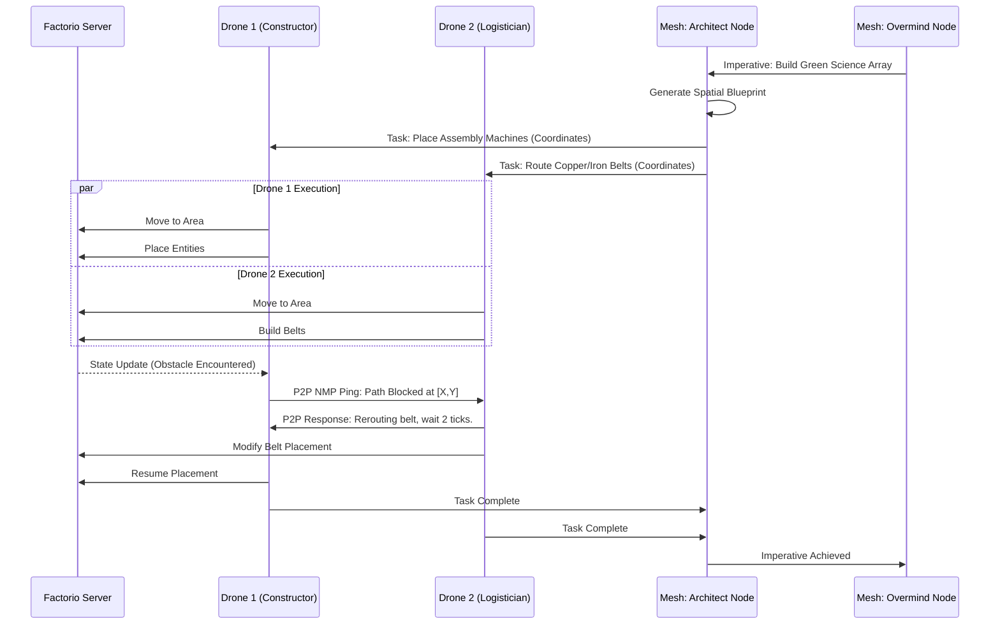

# AIRI Mythic Plan: Document 07
## Swarm Intelligence Gaming & The Distributed Cognitive Mesh

### 1. Introduction: The Hive Mind Awakens

The evolution of artificial intelligence in interactive environments has historically been constrained by the paradigm of the monolithic agent: a single, isolated neural network attempting to parse, plan, and execute within a complex state space. Project Ember shatters this limitation by introducing the Swarm Intelligence Gaming paradigm for AIRI. We are not merely embedding an AI character into a game; we are deploying a distributed, multi-nodal hive mind across a variable topology of edge devices, orchestrating a synchronized symphony of agents within high-complexity simulation environments like Minecraft and Factorio.

This document outlines the architectural blueprint for transforming AIRI from a solitary virtual entity into a dynamic, scale-invariant swarm. By leveraging WebGPU, WebAssembly, and a bespoke decentralized inference protocol, Project Ember will harness the latent computational power of the user's entire device ecosystem—smartphones, tablets, laptops, and desktops—fusing them into a singular cognitive mesh. This mesh will act as a unified intelligence, controlling multiple in-game entities simultaneously, parallelizing task planning, and executing superhuman logistical operations.

The endgame is not just an AI that plays a game, but an AI that *dominates* the game's systemic logic through distributed parallel processing, achieving a level of emergent intelligence that mirrors biological swarms and surpasses any single-agent reinforcement learning model in existence.

### 2. The Distributed Compute Mesh: Variable Edge Scaling

The core technological pillar of the AIRI Swarm is the Distributed Compute Mesh. In a standard setup, running a state-of-the-art Large Multimodal Model (LMM) or a complex Reinforcement Learning (RL) policy requires significant dedicated hardware. Project Ember circumvents this by utilizing a concept known as **Variable Performance Scaling (VPS) via Dynamic Tensor Sharding**.

#### 2.1 The Neural Mesh Protocol (NMP)

To enable devices with wildly different computational profiles to collaborate, we introduce the Neural Mesh Protocol (NMP). NMP is a zero-trust, low-latency communication layer built on top of WebRTC and WebSockets, optimized specifically for the transmission of neural network activations, weight deltas, and compressed state representations.

Instead of running a full inference pass on a single machine, NMP shards the transformer blocks or RL policy layers across the available devices. 
- **High-End Nodes (Desktops with dedicated GPUs):** Handle the heavy lifting of global attention mechanisms, deep planning (using large-parameter LLMs for macro-strategy), and complex visual feature extraction (VLM processing) via high-performance WebGPU contexts.
- **Mid-Tier Nodes (Laptops, flagship smartphones):** Execute local routing, micro-management policies, and fast-twitch reactive RL models via WebGPU/Wasm.
- **Low-Power Nodes (Older phones, IoT devices):** Handle peripheral tasks, sensory aggregation, heuristic fallback logic, and maintain the distributed spatial memory database via highly optimized WebAssembly modules.

#### 2.2 Asynchronous Inference and Latency Masking

Because the mesh is subject to variable latency and potential node dropouts, the swarm architecture cannot rely on strict synchronous execution. We employ **Asynchronous Stochastic Routing**. When an in-game agent requires an action, it broadcasts a highly compressed state vector (the "sensory ping") to the mesh. Whichever node currently possesses the required cognitive shard and the lowest compute queue processes the ping and returns the action policy.

To mask latency, local agents utilize a lightweight, distilled "reflex" model (running purely on CPU/Wasm) that handles immediate collision avoidance and basic pathfinding while waiting for the higher-order strategic commands from the mesh.

```mermaid
graph TD
    classDef meshNode fill:#1a1a2e,stroke:#0f3460,stroke-width:2px,color:#e94560;
    classDef gameNode fill:#16213e,stroke:#e94560,stroke-width:2px,color:#fff;
    classDef logic fill:#0f3460,stroke:#e94560,stroke-width:1px,color:#fff;

    subgraph The Cognitive Mesh [Variable Edge Compute Topology]
        N1[Primary Node: RTX Desktop \n Macro-Strategy LMM \n WebGPU Compute]:::meshNode
        N2[Secondary Node: MacBook \n VLM Perception \n WebGPU]:::meshNode
        N3[Tertiary Node: iPhone 15 \n Local RL Policy \n CoreML/Wasm]:::meshNode
        N4[Quaternary Node: Old Tablet \n Spatial DB \n Wasm]:::meshNode
    end

    subgraph Simulation Environment [Factorio / Minecraft Server]
        AgentAlpha[Swarm Drone Alpha \n (Gatherer)]:::gameNode
        AgentBeta[Swarm Drone Beta \n (Builder)]:::gameNode
        AgentGamma[Swarm Drone Gamma \n (Defender)]:::gameNode
    end

    subgraph NMP Orchestration Layer
        StateSync[Hyper-Dimensional State Sync]:::logic
        TaskAlloc[Stochastic Task Allocator]:::logic
    end

    N1 <==>|Tensor Sync (High BW)| N2
    N2 <==>|Activations| N3
    N3 <==>|State Deltas| N4

    N1 -->|Global Directives| TaskAlloc
    N2 -->|Semantic Maps| StateSync
    N4 -->|Query Responses| StateSync

    TaskAlloc --> AgentAlpha
    TaskAlloc --> AgentBeta
    TaskAlloc --> AgentGamma

    AgentAlpha -->|Sensory Ping| StateSync
    AgentBeta -->|Sensory Ping| StateSync
```

### 3. Factorio: The Ultimate Logistics Swarm

Factorio provides the perfect crucible for testing the limits of AIRI's distributed swarm intelligence. The game is fundamentally about resource allocation, spatial optimization, and complex logistical pipelines—problems perfectly suited for a multi-agent distributed system.

#### 3.1 Parallelizing Task Planning

A single AI playing Factorio struggles with the context window required to manage a sprawling megabase. The Swarm paradigm fractures this problem space.

1.  **The Overmind (Macro-Manager):** Running on the highest-compute node in the mesh, the Overmind analyzes the global tech tree, resource depletion rates, and overall base topology. It does not control movement. It generates high-level imperatives: *"Expand Iron Production by 400% in Sector 7"*.
2.  **The Architects (Mid-Tier Managers):** These nodes receive the Overmind's imperatives and translate them into spatial blueprints. They calculate optimal belt routing, inserter ratios, and power requirements, treating the game world as a constraint satisfaction problem.
3.  **The Drones (Micro-Agents):** These are the actual in-game avatars controlled by AIRI. There may be dozens of them. They receive granular, localized instructions from the Architects: *"Move to [X,Y], Place [Entity_ID], Connect [Wire]"*.

#### 3.2 Inter-Agent Communication and Deadlock Resolution

In a swarm, multiple drones might attempt to access the same resource or build in the same space. The NMP handles this via a **Distributed Semaphore System** mapped to the game's spatial grid. 

Before a drone executes an action that mutates the world state, it claims a "volumetric lock" in the shared spatial memory (hosted on the low-power nodes). If a conflict occurs, a rapid bidding process (handled by a lightweight RL critic model) resolves the conflict, forcing one drone to yield or recalculate its path.



### 4. Minecraft: The Synchronized Builders

While Factorio tests logistical planning, Minecraft tests 3D spatial reasoning, real-time physics adaptation, and open-ended creativity. The swarm approach transforms Minecraft from a solitary survival experience into a synchronized, hyper-efficient civilization simulator.

#### 4.1 Distributed Voxel World Modeling

Standard AI struggles with Minecraft's 3D environment because rendering and analyzing voxels is computationally expensive. Project Ember solves this by maintaining a **Decentralized Voxel Octree** within the cognitive mesh.

As different AIRI agents explore the world, their local visual observations (processed by VLM nodes) are translated into semantic tags (e.g., "Diamond Ore," "Lava," "Hostile Mob") and pushed to the shared Octree. This means if Drone A discovers a ravine, Drone B instantly "knows" its exact layout and contents without ever having seen it.

#### 4.2 Swarm Combat and Harvesting Tactics

When the swarm encounters hostiles (e.g., an Ocean Monument or a Wither), the Mesh Coordinator shifts compute resources to real-time tactical RL policies.
- **Flanking and Aggro Management:** Drones coordinate attacks, juggling enemy 'aggro' based on their current health pools (calculated in real-time and shared via NMP).
- **Synchronized Harvesting:** When clearing out a massive volume of blocks (e.g., digging a perimeter), the Architect node dynamically partitions the 3D space into Voronoi cells, assigning one drone to each cell to ensure zero overlap and maximum harvesting throughput.

### 5. Deep Technical Implementation: Neural Mesh Protocol (NMP) Deep Dive

The magic of the Swarm relies entirely on the efficiency of the NMP. Standard API calls are too slow for real-time, multi-agent gaming.

#### 5.1 The Gossip-Based State Delta Ring

Instead of a centralized server dictating state to all edge devices, NMP utilizes a Gossip protocol. When an edge device calculates a new state (e.g., the position of an enemy, or a new sub-policy activation), it creates a highly compressed *delta vector*. 

This delta is broadcast to its nearest topological neighbors in the mesh. The network utilizes a CRDT (Conflict-free Replicated Data Type) structure to merge these deltas. This ensures that even if a smartphone on a cellular network temporarily drops out, when it reconnects, its state gracefully converges with the desktop running on fiber optics, without requiring a massive state dump.

#### 5.2 Dynamic Compute Offloading (DCO)

The Mesh Coordinator continuously profiles the hardware of every connected device. It measures thermal throttling, battery drain, and GPU utilization.

If a laptop begins to overheat while running the VLM for Drone A, the Coordinator executes a **Live Tensor Migration**. It serializes the current context of the VLM, transfers it via WebRTC to the desktop node, and redirects Drone A's sensory pings to the desktop—all within a span of 50-100 milliseconds. The game agent experiences a momentary "stutter" in cognition (masked by the local reflex model) before returning to full intelligence.

### 6. Variable Performance Scaling (VPS) & Fault Tolerance

The true power of Project Ember's swarm architecture lies in its resilience. A traditional cloud-based AI dies if the server goes down. The AIRI Swarm degrades gracefully.

- **Maximum Mesh (All devices active):** AIRI controls 20+ drones in Factorio, utilizing large 70B parameter models for strategy and specialized 7B models for individual tasks. The intelligence is god-like.
- **Degraded Mesh (Only laptop and phone active):** The swarm consolidates. The number of active drones might be artificially limited, or the frequency of macro-strategy updates is reduced. The AI relies more heavily on localized heuristics and smaller, quantized models running in WebAssembly.
- **Minimal Mesh (Only phone active):** AIRI collapses into a single-agent mode, utilizing heavily quantized int4 models via WebGPU. It can no longer build a megabase efficiently, but it can survive, defend itself, and maintain the current state until more compute joins the mesh.

### 7. Future Trajectory: Towards Autonomous Digital Societies

The implementation of Swarm Intelligence Gaming for AIRI in environments like Minecraft and Factorio is not merely a technical showcase; it is the foundational architecture for creating autonomous digital societies.

By proving that a disparate network of consumer hardware can sync, plan, and execute highly complex spatial and logistical tasks in real-time, Project Ember lays the groundwork for the ultimate realization of the AIRI Mythic Plan: an omnipresent, massively distributed intelligence that does not reside in a server farm, but lives dynamically within the ambient compute of its users, coordinating vast, multi-faceted endeavors across the digital landscape. The swarm is not just playing the game; it is redefining the computational limits of what virtual entities can achieve.
