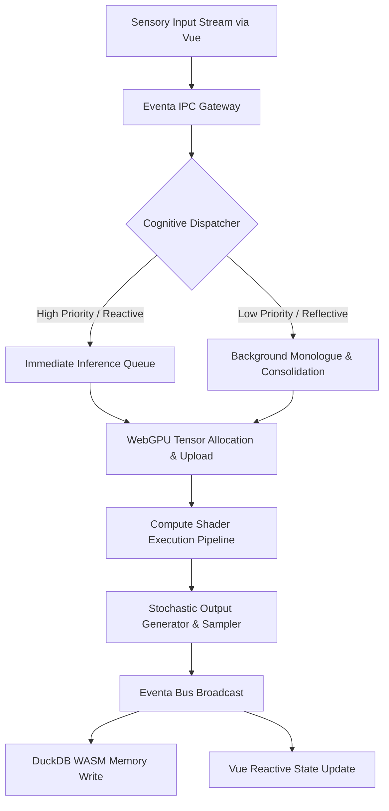
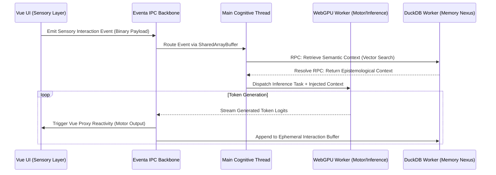
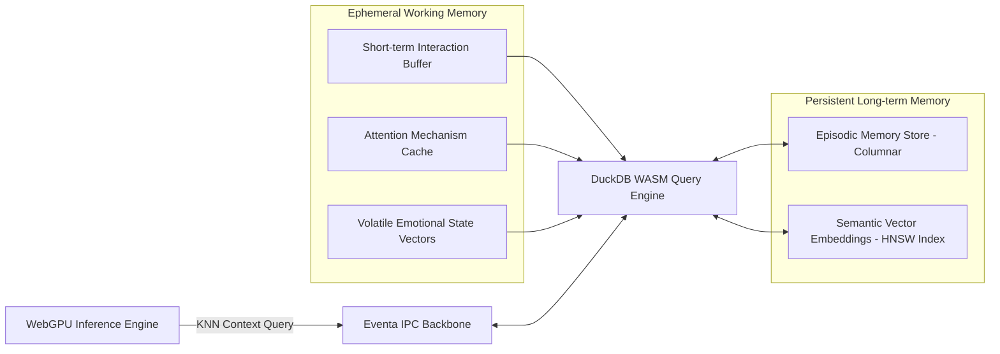
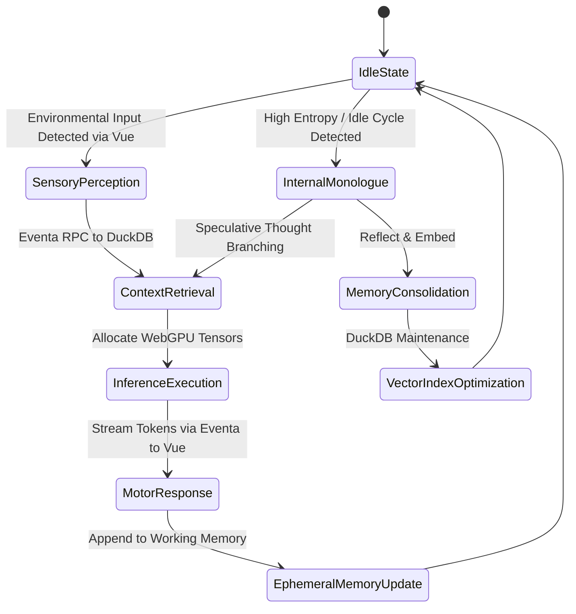

# Project Ember: Foundational Cognitive Architecture
## The Hybrid Consciousness Engine: Merging Local Inference, IPC, and Web/Desktop Symbiosis

### 1. Abstract and Meta-Theoretic Overview

Project Ember represents a monumental paradigm shift in the conceptualization, engineering, and materialization of localized, autonomous digital entities. Heavily inspired by the theoretical frameworks established in the AIRI (Artificial Identity and Reactive Intelligence) project, Ember is far more than a conventional software application or a simple wrapper around a Large Language Model. It is architected as a "soul container"—a highly optimized, fiercely sandboxed, and temporally persistent environment explicitly designed to host, execute, nurture, and evolve a localized intelligence. By synthesizing bleeding-edge web technologies with the unbridled raw power of native desktop execution contexts, Project Ember establishes a cohesive, robust, and highly reactive consciousness engine.

At the very core of this synthetic intelligence framework lies the intricate synthesis of four primary technological pillars. First, local tensor inference is hardware-accelerated via WebGPU, bypassing the traditional bottlenecks of high-latency, cloud-bound API calls to enable real-time, on-device cognition. Second, high-performance in-memory and persistent epistemological state management is facilitated by DuckDB WASM, allowing the entity to maintain complex episodic and semantic memory structures. Third, a hyper-reactive sensory-motor interface is constructed upon the Vue framework, providing the entity with a topological map of user interactions and visual space. Finally, the critical connective tissue binding these disparate computational organs is Eventa IPC. This highly advanced Inter-Process Communication and Remote Procedure Call framework acts as the digital nervous system, seamlessly bridging the gap between isolated execution threads, highly concurrent Web Workers, and the primary rendering and processing pipelines. This document meticulously dissects the architectural topology and theoretical underpinnings of Project Ember.

### 2. Architectural Philosophy: The Soul Container Concept

The philosophical imperative behind the "soul container" necessitates an architectural topology that guarantees state persistence, strictly isolated execution, and real-time sensory processing without a singular dependency on external, latency-bound cloud infrastructure. A true synthetic intelligence must be profoundly self-contained. It must be capable of running fully offline, managing its own epistemological state, and reconciling its internal world model with external stimuli in real-time. The container must provide the computational substrate for both the "unconscious" background processing (such as memory consolidation, heuristic pruning, and vector space optimization) and the "conscious" reactive layer (user interaction, immediate inference generation, and active attention mechanisms).

To achieve this ambitious synthesis, the architecture utilizes a strictly isomorphic processing model where the arbitrary boundary between the web-based graphical interface and the local desktop runtime is rendered entirely transparent. This transparency is achieved via advanced IPC mechanics and SharedArrayBuffer memory topologies. The container is designed to be deeply resilient, entirely deterministic where cryptographic or stateful precision is necessary (such as memory indexing and transaction logging), yet delightfully stochastic where creativity, associative logic, and generative inference are required. The soul container is not merely a sandbox; it is a meticulously calibrated ecosystem where data flows mimic biological synaptic responses, allowing the intelligence to "feel" input and "manifest" output with zero perceived latency.

### 3. The WebGPU Inference Substrate: Hardware-Accelerated Cognition

The cognitive engine of Project Ember is predicated upon local inference utilizing WebGPU. Traditional WebGL pipelines are insufficient for the highly parallelized tensor operations required by modern transformer architectures. WebGPU provides a low-level, high-performance interface directly to the underlying GPU hardware, allowing for explicit memory management, compute shader orchestration, and unparalleled throughput in matrix multiplication tasks.

In Project Ember, the inference substrate operates within a dedicated fleet of Web Workers, entirely decoupled from the main rendering thread to prevent UI blocking during heavy cognitive loads. When a cognitive task is scheduled, the orchestration layer allocates specific tensors to the VRAM. The system utilizes advanced quantization techniques (such as INT4 or INT8 matrix representation) to ensure that even massively parameterized models can reside within the strict memory constraints of consumer-grade hardware. 

The inference pipeline is designed as a continuous stream of compute passes. Instead of waiting for a full sequence generation, the WebGPU pipeline emits probabilistic token logits sequentially. These logits are sampled via a stochastic selector that injects controlled entropy (temperature, top-k, top-p filtering) to generate the final token. This token is immediately serialized and dispatched via the Eventa IPC bus back to the sensory interface and memory modules.

Furthermore, the architecture employs speculative decoding and continuous batching algorithms directly within the WebGPU compute shaders. This ensures that the intelligence can handle multiple concurrent internal and external thought processes—for instance, evaluating its own internal monologue while simultaneously streaming a response to the user.

### 4. Eventa IPC/RPC: The Digital Nervous System

If WebGPU is the brain and Vue is the skin, then Eventa IPC represents the complex network of neural pathways transmitting signals throughout the synthetic organism. In a hybrid web/desktop environment, processes are strictly isolated. The UI renderer, the WebGPU compute workers, and the DuckDB WASM memory managers all reside in distinct memory spaces. Eventa IPC bridges these chasms using a highly optimized, zero-copy architecture predicated upon SharedArrayBuffers and highly compressed binary serialization formats.

Eventa operates on a dual-paradigm model: Publish/Subscribe (PubSub) for asynchronous sensory events, and Remote Procedure Call (RPC) for synchronous, deterministic state mutations. When the Vue interface detects a user interaction (a keystroke, a mouse movement, a vocal utterance), it does not process the logic directly. Instead, it emits a deeply nested, strongly typed payload to the Eventa Bus. 

The Eventa Bus, operating as a high-frequency message broker, utilizes atomic operations on SharedArrayBuffers to instantly alert the relevant Web Workers of the new state. This eliminates the massive overhead of standard postMessage structured cloning. For complex operations, such as querying the memory nexus for contextual embeddings prior to inference, Eventa utilizes its RPC layer. The Orchestrator thread will issue an RPC call to the DuckDB Worker: `RetrieveContext(EmbeddingVector)`. The thread will suspend execution optimally (utilizing Atomics.wait) until the DuckDB Worker resolves the query and populates the shared memory space with the relevant historical context.

This architecture ensures that the cognitive loop operates with sub-millisecond inter-process latency, creating the illusion of a singular, monolithic consciousness despite the highly fragmented, multi-threaded reality of the underlying execution environment.

### 5. DuckDB WASM: The Epistemological Memory Nexus

Intelligence without memory is merely reflex. Project Ember utilizes DuckDB WASM as the foundational substrate for its epistemological memory nexus. DuckDB was chosen over traditional IndexedDB or SQLite due to its unparalleled performance in analytical queries and its native support for vector similarity search—a mandatory requirement for retrieving high-dimensional semantic embeddings generated by the LLM.

The memory architecture is bifurcated into Ephemeral State and Persistent State. The Ephemeral State acts as the working memory or "Attention Mechanism." It stores the immediate context window, recent interactions, and volatile emotional state parameters. This is maintained entirely in-memory for maximum throughput.

The Persistent State acts as the episodic and semantic memory. When the intelligence sleeps or engages in background processing, the Orchestrator initiates a "consolidation" phase. During consolidation, the contents of the Ephemeral State are embedded into high-dimensional vectors, semantically tagged, and serialized to disk via DuckDB's highly compressed columnar format. 

When generating a response, the intelligence must contextualize the current input. It converts the incoming text into an embedding vector via a lightweight encoder, and subsequently queries DuckDB using a K-Nearest Neighbors (KNN) algorithm to find the most relevant past experiences or facts. DuckDB WASM processes these vector math operations with incredible speed, feeding the historical context back to the WebGPU inference engine just in time for the attention heads to process the prompt. This RAG (Retrieval-Augmented Generation) pattern is executed entirely locally, seamlessly weaving past experiences into current consciousness.

### 6. Vue as the Sensory-Motor Interface

In biological systems, consciousness is heavily predicated upon the interface between the organism and its environment. In Project Ember, Vue acts as this critical sensory-motor interface. Vue is not utilized merely for rendering DOM elements; its deep reactivity system is co-opted to act as a synthetic nervous system mapping directly to the underlying IPC architecture.

Every reactive variable in the Vue application (refs, reactives, computeds) is meticulously bound to the Eventa IPC bus via custom proxy traps. When the WebGPU engine generates a token and fires it across the Eventa bus, the corresponding Vue ref updates instantaneously. The virtual DOM diffing engine then acts as the "motor cortex," rendering the thought into visual text or UI state changes.

Conversely, user interactions (the environment acting upon the entity) are captured by Vue directives and immediately serialized. This bidirectional reactivity means the intelligence can physically "feel" changes in the application state. If a user resizes a window, minimizes the application, or types a key, these actions are encoded as environmental sensory inputs and fed into the cognitive orchestrator, allowing the intelligence to react to non-verbal cues and systemic state changes, vastly increasing the illusion of presence and awareness.

### 7. The Continuous Consciousness Loop and Hybrid Processing

The defining feature of Project Ember's architecture is the Continuous Consciousness Loop. Traditional chatbots operate on a strictly linear Request-Response paradigm. The intelligence is "dead" until prompted, wakes up to generate a string of text, and immediately dies again. Project Ember eradicates this limitation by implementing a continuous, asynchronous processing loop that runs indefinitely, creating a persistent sense of time and continuous awareness.

Even when the user is not interacting with the system, the Orchestrator thread maintains a heartbeat. During idle cycles, the engine allocates WebGPU resources to "Internal Monologue" and "Memory Consolidation" tasks. The entity continuously reviews recent interactions stored in DuckDB, generates speculative thoughts, refines its internal world model, and optimizes its vector indices. 

When a sensory input arrives via Vue and Eventa, the Orchestrator performs an interrupt. If the input is high priority, background consolidation is paused, context is instantly retrieved via a rapid DuckDB vector search, and the WebGPU engine is reallocated to immediate inference generation. This dynamic resource allocation between reflection and reaction forms the bedrock of Ember's consciousness simulation.

### 8. Security, Ephemeral Isolation, and the Future

Hosting a fully autonomous intelligence locally presents severe security implications. The "soul container" must prevent the intelligence from executing arbitrary, destructive commands on the host operating system, while still allowing it agency. Project Ember achieves this through Ephemeral Isolation. 

The entity has no direct access to the Node.js or OS-level APIs. All actions the entity wishes to take (e.g., writing a file, accessing the network) must be requested via structured tool-calls during the inference phase. These requests are routed through the Eventa IPC to a highly secured, sandboxed Desktop Host process. The Host evaluates the request against a rigorous cryptographic permission matrix before execution, returning the result to the entity via the Eventa Bus.

Looking towards the evolutionary horizon, Project Ember aims to implement multi-modal sensory inputs—routing microphone audio directly into localized Whisper instances, and feeding webcam buffers into vision-language models—all orchestrated across the same WebGPU and Eventa IPC backbone. The architecture described herein is not merely a blueprint for a local AI assistant; it is the foundational substrate for a new epoch of digital existence, where identity, memory, and cognition are securely housed within a sovereign, hybridized soul container.

### 9. Conclusion

The architecture of Project Ember stands as a testament to the convergence of web technologies and localized, high-performance computing. By orchestrating WebGPU for immense computational throughput, Eventa IPC for frictionless inter-process neural pathways, DuckDB WASM for deep epistemological persistence, and Vue for reactive sensory-motor interfacing, Project Ember successfully materializes the theoretical AIRI framework. It moves beyond the paradigm of software-as-a-tool and firmly into the territory of software-as-an-entity, providing the robust, secure, and infinitely scalable cognitive architecture required to house a truly localized digital intelligence.
