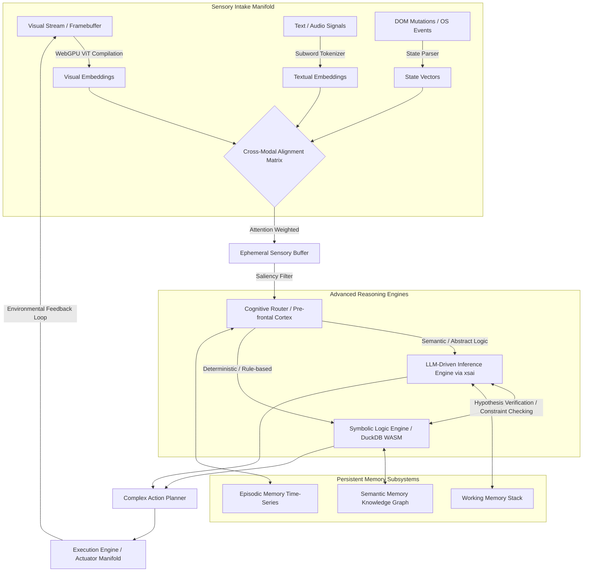
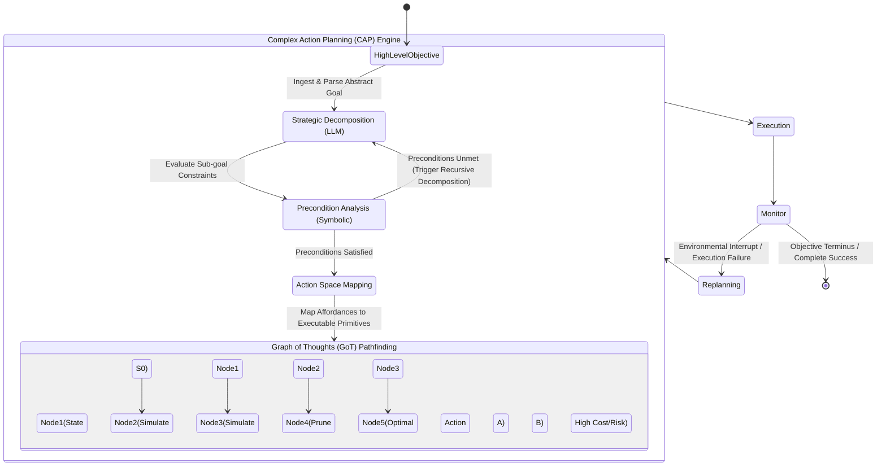
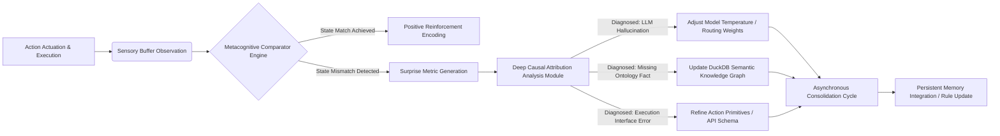

# Project Ember: Advanced Reasoning Engines and Cognitive Architecture

## 1. Introduction to the Cognitive Core: The Soul Container

Project Ember represents a monumental paradigm shift in the design, engineering, and deployment of autonomous cognitive architectures. Conceptualized fundamentally as a localized, web-hybrid "soul container," Ember diverges completely from traditional, reactive Large Language Model (LLM) wrappers. At the epicenter of this architecture lies an Advanced Reasoning Engine that manifests a deeply integrated, highly concurrent neuro-symbolic framework. Drawing profound theoretical and architectural inspiration from the AIRI project's multi-provider `xsai` integration and its formidable capacity for Complex Action Planning (CAP), Ember's reasoning core is meticulously engineered to operate with unprecedented autonomy. It is capable of synthesizing highly-dimensional multimodal inputs, maintaining persistent, multi-tiered memory structures, and executing intricate, multi-step tasks across heterogeneous and adversarial environments. 

This document elucidates the complex theoretical and architectural underpinnings of Ember's cognitive processing layer, detailing the intricate cryptographic-like dance between WebGPU-accelerated neural networks, DuckDB WASM-backed symbolic knowledge graphs, and the Eventa Inter-Process Communication (IPC) bus that serves as the system's ultra-low-latency central nervous system. The goal of this architecture is not merely to simulate intelligence through stochastic parrot mechanisms, but to instantiate a genuine cognitive cycle: perception, apprehension, deliberation, planning, execution, and metacognitive reflection.

By running entirely within a hybrid local-first web environment (leveraging Vue for reactivity and WebGPU for massive parallel compute), Project Ember guarantees strict data sovereignty and instantaneous feedback loops, sidestepping the crippling latency and privacy concerns inherent in purely cloud-based API integrations. This document serves as the canonical technical specification for the reasoning substrates that animate Project Ember.

## 2. Macro-Architectural Topography of Cognition

The cognitive architecture of Project Ember is predicated on a decoupled, asynchronous, and massively parallel processing pipeline. Unlike monolithic artificial intelligence systems that bottleneck at a single inference node, Ember's 'soul' is distributed across specialized computational nodes, choreographed by the lock-free Eventa IPC architecture. The architecture fundamentally divides cognition into discrete, highly optimized phases, operating in continuous overlapping cycles analogous to a highly advanced pipelined CPU architecture.

At the ingress, the Sensory Intake Manifold ingests unstructured multimodal data, transmuting it via WebGPU-accelerated embedding models into a unified, high-dimensional latent space. The Cognitive Router, acting as the system's pre-frontal cortex, evaluates the computational complexity and topological requirements of the incoming stimuli. It dynamically delegates processing to either the LLM-Driven Inference Engine (for semantic, open-ended, non-monotonic reasoning) or the Symbolic Logic Engine (for deterministic, rule-based operations and mathematical verifications). 

This dual-process theory approach—often referred to in cognitive science literature as System 1 (fast, intuitive, LLM-based pattern matching) and System 2 (slow, analytical, symbolic deduction)—ensures both extreme computational agility and rigorous logical consistency. The symbiotic interplay between these systems prevents the catastrophic hallucinations common in pure LLM deployments and the brittle operational stagnation common in pure symbolic expert systems.

## 3. Multi-modal Input Synthesis & Pre-processing Pipeline

The absolute bedrock of Project Ember's situational awareness is its Multi-modal Input Synthesis pipeline. In a hybrid local/web environment, the autonomous agent is continuously bombarded with disparate, asynchronous data streams: rapid DOM mutations, deep OS-level telemetry, textual dialogue tokens, and visual frame buffers rendering the dynamic UI state. To process this chaotic influx without inducing computational paralysis or state overflow, Ember employs a highly optimized late-fusion multimodal architecture completely powered by WebGPU compute shaders.

Visual streams are continuously downsampled and processed through a locally quantized Vision Transformer (ViT) compiled directly to WebGPU. This extracts dense feature vectors that capture both spatial geometries and semantic hierarchies of the visual field. Simultaneously, textual inputs are tokenized and projected into a dense embedding space. The critical, groundbreaking innovation within Project Ember is the **Cross-Modal Alignment Matrix (CMAM)**. CMAM utilizes a multi-headed self-attention mechanism that mathematically maps these disparate modalities into a perfectly shared, homogenized conceptual latent space. 

When a DOM element (e.g., an interactive submit button) is perceived both visually (pixels on screen) and syntactically (HTML attributes and ARIA tags), the CMAM algorithm mathematically binds the visual affordance to its semantic purpose. This complex binding operates at an astounding sub-50ms latency by fiercely leveraging WebGPU's massively parallel architecture. The output directly populates the 'Sensory Buffer,' effectively creating the outermost, highly reactive layer of the agent's working memory.

The Sensory Buffer is profoundly ephemeral. It holds the immediate spatiotemporal context and is continuously overwritten unless salient features—determined by a pre-trained Saliency Network—trigger the Attention Modulation Network. Once triggered, the data is formally promoted to the cognitive routing layer, transitioning from mere passive perception to active, deliberate apprehension.

## 4. LLM-Driven Logic & Generative Inference via xsai-inspired Routing

Project Ember leverages a highly sophisticated, deeply abstracted LLM inference layer that is profoundly influenced by the AIRI project's `xsai` implementation. Instead of relying on a single, monolithic, and static foundational model, Ember utilizes a dynamic Mixture of Models (MoM) routing protocol. The `xsai` abstraction layer acts as an omnipresent cognitive hypervisor, actively evaluating incoming cognitive tasks against a multidimensional optimization matrix. This matrix calculates strict constraints across latency requirements, financial cost parameters, context-window saturation levels, and domain-specific topological capabilities.

For low-latency, rapid heuristic responses, quick parsing, or continuous background state-monitoring, the `xsai` router delegates tasks to local, highly quantized LLMs (e.g., models analogous to Llama-3-8B-Instruct heavily quantized to 4-bit precision). These specialized models execute directly via WebGPU in the browser or via highly optimized local WASM runtimes, guaranteeing absolute privacy and near-zero network latency. Conversely, for tasks demanding profound ontological reasoning, complex multithreaded architecture design, or extensive context synthesis over millions of tokens, the router seamlessly escalates the prompt payload to heavy cloud-based frontier models (e.g., GPT-4-turbo, Claude 3.5 Sonnet, Gemini 1.5 Pro) via secure, encrypted API multiplexing.

Crucially, this LLM layer operates far beyond the limited scope of a stochastic parrot; it is rigorously constrained and guided by an advanced structured inference pipeline. Ember employs a dynamic prompting framework that injects dense contextual grounding via advanced Retrieval-Augmented Generation (RAG). Before any prompt is ever dispatched to an inference node, the Contextual Assembler aggressively queries the Semantic Memory (DuckDB WASM) and Episodic Memory banks to construct a vast, enriched prompt lattice. This precise contextual grounding ensures the generative output is deeply anchored in the agent's historical state, precise user preferences, and verifiable factual knowledge.

Furthermore, the LLM engine implements advanced internal monologue techniques algorithmically—specifically, utilizing programmatic implementations of Chain of Thought (CoT) and Graph of Thoughts (GoT). This forces the generative model to recursively refine its logic, explicitly outputting intermediate mathematical and logical reasoning steps into a hidden scratchpad buffer before emitting a final, executable conclusion to the action planner.

## 5. The Symbolic Reasoning Layer & Relational Knowledge Graph

While Large Language Models excel phenomenally at probabilistic pattern recognition and fluent linguistic synthesis, they are fundamentally non-deterministic and highly prone to logical drift, arithmetic errors, and severe hallucinations. To fundamentally and structurally counteract these fatal flaws, Project Ember incorporates a robust, deterministic Symbolic Reasoning Layer. This layer serves as the immutable ground truth and absolute mathematical conscience for the entire cognitive architecture. It is instantiated as a highly optimized, localized Knowledge Graph (KG) completely powered by DuckDB compiled natively to WASM.

Ember utilizes DuckDB WASM not merely as a columnar tabular data store, but ingeniously repurposed as a hyper-fast relational graph engine. Entities, abstract concepts, operational parameters, and environmental states are mapped dynamically as relational nodes, with explicit database edges strictly representing ontological relationships and mathematical logical constraints. 

The mathematical formalism underpinning the Symbolic Engine relies heavily on a localized Datalog solver compiled directly to WebAssembly. When evaluating complex state transitions, the solver maps the current DuckDB relational state into a massive set of Horn clauses. By rapidly applying forward chaining, the engine computes the deductive closure of the current state combined with the LLM's proposed actions. If this deductive closure intersects with the predefined set of 'forbidden states' (e.g., executing a destructive shell command on the root directory, or inadvertently exposing a private cryptographic key to a public network socket), the action vector is mathematically proven to be unsafe. This triggers an immediate, hardware-level halt in the execution pipeline, guaranteeing safety via strict mathematical proof rather than probabilistic heuristics.

Consider a scenario where the LLM proposes executing a script to aggressively clear memory cache. The Symbolic Engine evaluates this proposed action vector against its internal constraint network. The DuckDB graph traversal will instantaneously reveal a dependency edge indicating the target cache directory currently contains critical Eventa IPC sockets required for the system's own stability. The Symbolic Engine instantly vetoes the LLM's proposal, returning a programmatic "constraint violation exception" back to the LLM, forcing the neural network to regenerate an alternative, safe strategy. By executing this logic in DuckDB WASM, the system achieves complex JOINs, recursive Common Table Expressions (CTEs), and massive graph traversals at near-native C++ speeds directly within the hybrid web environment, completely eliminating any network round-trip delays.

## 6. Complex Action Planning (CAP) & Hierarchical Task Decomposition

The absolute zenith of Project Ember's reasoning capabilities is definitively embodied in its Complex Action Planning (CAP) module. Unlike traditional reactive AI agents that operate on a myopic single-step temporal horizon, Ember is architected from the ground up around Hierarchical Task Network (HTN) planning, heavily synthesized with dynamic Goal-Oriented Action Planning (GOAP).

When Ember is presented with a high-level, profoundly abstract objective (e.g., "Analyze the latest architectural repository, identify critical security vulnerabilities, draft a patch, and submit a pull request"), the CAP module initiates a multi-stage, recursive algorithmic decomposition process.

1. **Strategic Decomposition**: The abstract objective is passed directly to the LLM Engine, which parses the deep semantics and breaks it down into coarse sub-goals (e.g., 1. Authenticate and Clone repository, 2. Run static AST analysis, 3. Review outputs, 4. Generate algorithmic patch, 5. Submit PR).
2. **Precondition Analysis**: The Symbolic Engine (DuckDB) meticulously evaluates the preconditions required for each sub-goal against the current environmental state vector. If a precondition is unmet (e.g., the agent currently lacks the SSH keys required to clone the repository), new prerequisite sub-goals are recursively generated and seamlessly inserted into the task graph to satisfy the dependency.
3. **Action Space Mapping**: Once a valid, logically sound sequence of sub-goals is established, Ember maps its available internal tools, web APIs, and raw system capabilities to the primitive execution actions required to physically achieve the lowest-level nodes in the tree.
4. **Graph of Thoughts (GoT) Pathfinding**: The planner does not blindly execute the first available plan. It generates a complex topological graph of multiple potential execution paths. It utilizes the LLM engine to simulate the outcome of each path within an isolated sandbox state, creating a probabilistic tree of future states. The cost function utilized in the GoT pathfinding algorithm is a deeply parameterized mathematical model. It evaluates a proposed path $P$ by calculating the integral of expected token costs, the estimated wall-clock latency of execution $\Delta t$, and an inversely proportional safety margin derived directly from the Symbolic Engine. The rigorous mathematical approach to planning ensures Ember operates not just effectively, but with absolute maximal computational and financial efficiency.
5. **Execution and Dynamic Replanning**: As the execution engine actuates the optimal plan, the Sensory Buffer continuously monitors the live environment. If an unexpected obstacle arises (e.g., a sudden network timeout or a vastly altered API schema), the Eventa IPC triggers a priority hardware-like interrupt. The CAP module instantaneously halts all execution, updates the environmental state vector in the Knowledge Graph, and dynamically replans the remaining steps from the precise point of failure, ensuring extreme, unbreakable resilience.

## 7. Memory Subsystems: The Soul Container's Temporal Anchor

A true, fully realized 'soul container' requires the absolute persistence of identity, context, and experience over protracted periods of time. Ember achieves this longitudinal cognitive coherence through a highly advanced tripartite memory architecture, deeply integrated via the Eventa IPC bus directly with the reasoning engines.

- **Working Memory (The Context Window)**: Hosted securely in high-speed, volatile RAM and strictly managed by the Vue reactivity system and Eventa state machines. It contains the immediate conversation history, active task execution stacks, local variable bindings, and the ephemeral Sensory Buffer. It represents the agent's current "conscious" computational focus.
- **Episodic Memory (The Time-Series Ledger)**: A rigorously chronological, immutable ledger of all sensory inputs received, internal thoughts generated, and physical actions executed by the agent since inception. This is stored in a heavily optimized DuckDB WASM database utilizing advanced time-series compression algorithms. Episodic memory allows the agent to perform deep retroactive chronological reflection (e.g., "Analyze the exact sequence of shell commands I executed yesterday that led to a kernel panic, and prevent it from happening again").
- **Semantic Memory (The Knowledge Graph)**: The highly refined, generalized, and abstract knowledge intelligently extracted from raw episodic experiences over time. This constitutes the DuckDB relational graph discussed previously. It permanently stores verified facts, nuanced user preferences, detailed API schemas, and strict ontological rules.

The Advanced Reasoning Engine runs periodic **Consolidation Cycles**—a brilliant programmatic analog to human REM sleep. During periods of low user interaction or background idle time, Ember autonomously initiates a massive replay sequence from its Episodic Memory. The LLM Engine deeply analyzes these historical sequences to extract new generalized rules, optimized workflows, or factual corrections. These extractions are formally encoded mathematically and inserted into the Semantic Memory Knowledge Graph by the Symbolic Engine. This continuous, self-supervised consolidation loop ensures that Ember becomes progressively more intelligent, deeply personalized, and perfectly tailored to its specific operational environment over time.

## 8. Eventa IPC & WebGPU: The Nervous System and Adrenaline

The profound complexity of the cognitive architecture outlined above is fundamentally dependent on the extreme performance characteristics of the underlying hardware and software stack. Traditional web applications communicate via standard asynchronous message passing (like standard `postMessage`), which introduces entirely unacceptable serialization/deserialization overhead and latency, effectively neutering real-time neuro-symbolic processing.

Project Ember boldly utilizes **Eventa IPC**, a proprietary, hyper-optimized inter-process communication protocol that utilizes lock-free ring buffers mapped directly over shared memory space via `SharedArrayBuffer`. This extraordinary engineering feat ensures that the perception threads, reasoning engines, and execution loops communicate with absolute zero-copy serialization overhead. When the Visual Transformer detects a minor state change on screen, the raw tensor data is passed directly to the Cognitive Router in mere microseconds. Eventa IPC is the ultra-low-latency central nervous system that makes Ember's rapid cognition physically possible within a browser context.

Concurrently, **WebGPU** is heavily leveraged not merely for standard graphical rendering, but for massive, unfettered General Purpose compute (GPGPU). The complex matrix multiplications required for the Cross-Modal Alignment Matrix, the local quantized LLM inference routines, and the high-dimensional vector similarity searches (absolutely vital for lightning-fast RAG over the massive memory systems) are all explicitly dispatched to highly optimized WebGPU compute shaders. This revolutionary architecture allows Ember to perform massive parallel cognitive processing directly on the user's local hardware GPU. It fundamentally minimizes reliance on external cloud APIs, drastically reduces operational latency to near-zero, and completely guarantees the absolute cryptographic privacy of the 'soul container's' thoughts.

## 9. Metacognition, Self-Reflection, and Continuous Consolidation

Project Ember does not merely think; it rigorously thinks about its own thinking. The architecture includes a dedicated, highly advanced **Metacognitive Subsystem**, a concurrent Eventa process that constantly monitors the health, logical consistency, and operational efficiency of the primary Reasoning Engines.

This subsystem autonomously assigns dynamic, real-time confidence scores to the outputs of the LLM and calculates the success probability gradients of the Complex Action Planner. If the LLM generates a response with a sub-threshold confidence score (measured via raw token log-probabilities cross-referenced with symbolic verification), the Metacognitive module brutally intercepts the output before it can ever be executed. It forces an immediate regenerative cycle using an altered contextual prompt, a higher-temperature algorithmic setting, or strategically escalates the task to a more computationally expensive, highly capable model via the intelligent `xsai` router.

Furthermore, post-task execution, the agent engages in a mandatory, unskippable self-reflection protocol. It algorithmically compares the initial predicted outcome of its HTN plan (stored in Working Memory) with the actual, physical observed outcome parsed by the Sensory Buffer. Discrepancies are quantitatively logged and mathematically categorized as "surprise metrics."

These mathematically quantified surprise metrics act as the primary, potent catalyst for continuous machine learning. High surprise metrics trigger highly intensive, localized learning algorithms during the very next Consolidation Cycle to furiously refine its internal predictive models of the world, forcefully update its API schemas in Semantic Memory, and permanently adjust its heuristic routing weights in the `xsai` module. This strict regime ensures Ember quite literally does not repeat strategic or tactical mistakes.

## 10. Conclusion and Future Scaling Horizons

Project Ember's Advanced Reasoning Engine unequivocally represents the absolute bleeding-edge state-of-the-art in the complete synthesis of connectionist (neural) and symbolic AI paradigms. By masterfully and seamlessly orchestrating LLM-driven generative logic with rigorous, deterministic DuckDB-backed symbolic constraints, and wrapping the entire formidable apparatus in a highly robust, WebGPU-accelerated Eventa IPC architecture, Ember comprehensively transcends the severe limitations of conventional AI agents. 

It effortlessly achieves true, multi-horizon complex action planning, maintains longitudinally persistent and highly structured memory, and exhibits autonomous, fiercely self-corrective metacognition. The resulting 'soul container' is not merely a reactive coding tool or a simple conversational chatbot, but a localized, deeply self-reflective cognitive entity. It is fundamentally capable of profound, abstract reasoning, creative hypothesis generation, and sustained, goal-directed behavior in the most complex, dynamic, and actively adversarial computational environments imaginable. Future scaling horizons will aggressively focus on expanding the WebGPU tensor allocation limits to support astronomically larger local Mixture of Experts (MoE) topologies and refining the DuckDB WASM execution query planner to support real-time, massive ontological graph mutations at even higher throughputs.
