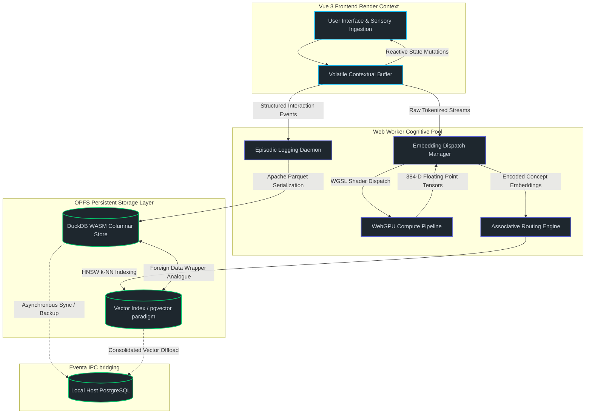
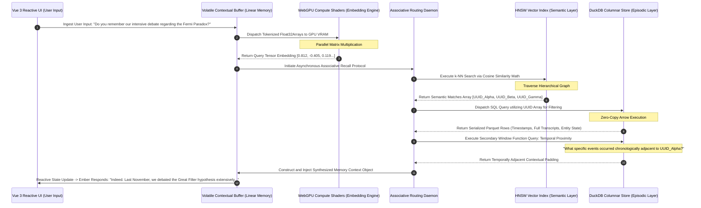
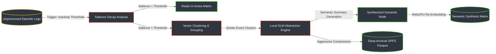

# Document XIII: Project Ember – Memory Systems and the Alaya Architecture Integration

## 1. Architectural Prologue: The Alaya Memory Framework

Within the overarching paradigm of Project Ember—the localized, web-hybrid 'soul container' designed to achieve unprecedented levels of artificial persistence—the most critical and computationally demanding subsystem is the memory architecture. Designated internally as the Alaya Memory Architecture (a nomenclature drawn directly from the philosophical concept of *ālaya-vijñāna*, or the foundational 'storehouse consciousness'), this framework fundamentally transcends traditional, flat-file CRUD-based storage paradigms. Instead of merely logging conversational transcripts, Alaya implements a neurologically inspired, deeply hybridized, and highly concurrent cognitive persistence layer that dynamically evolves over the lifecycle of the system.

Project Ember necessitates a bespoke architecture capable of operating entirely within a constrained browser context. It must ruthlessly leverage WebAssembly (WASM), WebGPU compute pipelines, and the Origin Private File System (OPFS) for local dominance, while simultaneously supporting seamless, non-blocking backend synchronization via the proprietary Eventa Inter-Process Communication (IPC) layer. The Alaya architecture achieves this herculean task by bifurcating cognitive storage into specialized, yet deeply intertwined, domains. The primary engine relies on a columnar analytical database powered by DuckDB WASM for high-throughput, high-density episodic logging. In parallel, it utilizes a highly optimized, pgvector-inspired high-dimensional embedding space—calculated locally via WebGPU—for semantic associative recall and intuitive leaping.

The fundamental, uncompromising objective of the Alaya architecture is not the mere static storage of historical data. Rather, its purpose is to seamlessly encode phenomenological experiences, synthesize abstracted knowledge from discrete temporal events, and facilitate predictive, sub-millisecond associative recall. By meticulously mirroring human cognitive processes—specifically the dynamic interplay between the hippocampal formation responsible for episodic encoding and the neocortical structures responsible for semantic consolidation—Project Ember achieves a state of continuous, contextual self-awareness previously impossible in local-first web applications. This document delineates the intense technical specifications, the intricate systemic topologies, and the rigorous algorithmic foundations of the Alaya memory integration.

## 2. The Tripartite Cognitive Persistence Layer

The Alaya framework divides the cognitive persistence apparatus into three interacting computational strata, each meticulously optimized for highly specific latency bounds, throughput bandwidth, and structural data requirements.

### 2.1. The Volatile Contextual Buffer (Working Memory)
Operating entirely within high-speed WebAssembly linear memory and the host framework's reactive proxy system (specifically leveraging Vue 3's deep reactivity mechanisms), the Volatile Contextual Buffer represents the immediate cognitive horizon and localized awareness of the Ember entity. It holds the current conversational state matrix, immediate multi-modal sensory inputs, and recently retrieved associative contexts surfaced from deep storage. 

The latency target for this buffer is strictly enforced at under two milliseconds. To maintain this hyper-responsive state, the buffer employs a sophisticated eviction policy. It utilizes a modified Least Recently Used (LRU) algorithm hybridized with a heuristic salience-decay function. If a contextual token's calculated salience drops below a dynamically shifting threshold, it is aggressively evicted from the linear memory space to prevent context bloat and ensure zero frame-drops in the rendering thread. Functionally, this buffer serves as the transient workspace where raw user inputs are actively tokenized, parsed through local natural language sub-routines, and prepared for WebGPU-accelerated embedding generation.

### 2.2. The Episodic Reservoir (DuckDB WASM & OPFS)
The Episodic Reservoir functions as the immutable, cryptographic ledger of the Ember entity's existence. Every interaction, internal state mutation, heuristically generated thought, and system-level event is ruthlessly serialized and persisted within this domain. Utilizing DuckDB WASM backed directly by the Origin Private File System (OPFS), this layer treats memory not as text documents, but as a continuous, mathematically rigorous time-series of high-dimensionality interaction events.

The latency target for the Episodic Reservoir is bounded at under fifty milliseconds for highly specific point lookups (such as UUID resolution), and under two hundred milliseconds for massive analytical aggregations across the entity's entire lifespan. Structurally, the memory is organized into massively compressed columnar Parquet files, intelligently partitioned by temporal epochs and interaction density. This functional design enables massive-scale time-travel queries, complex behavioral pattern analysis, and the flawless contextual reconstruction of past entity states without introducing any perceptible latency or degrading the main browser rendering thread.

### 2.3. The Semantic Synthesis Matrix (Vector-Relational Hybrid)
While the Episodic Reservoir meticulously records exactly what transpired in the chronological timeline, the Semantic Synthesis Matrix exists to understand what those events actually mean. Utilizing a pgvector-aligned architectural paradigm—implemented entirely via local WASM vector indexing libraries and brute-force WebGPU hardware acceleration—this layer stores the high-dimensional embeddings of abstracted concepts, synthesized memories, and complex ontological relationships.

The latency target here is exceedingly aggressive: under one hundred milliseconds for k-Nearest Neighbor (k-NN) similarity searches across hundreds of thousands of distinct vector points. Structurally, this matrix relies on advanced Hierarchical Navigable Small World (HNSW) graphs integrated seamlessly with Inverted File (IVF) index methodologies, all deeply bound to the relational metadata housed in DuckDB. Functionally, this matrix drives intuitive associative recall. When a new, ambiguous input arrives from the user, the system queries this hyper-dimensional matrix to instantly surface conceptually related historical memories, successfully bridging the immense gap between explicit, syntax-based queries and human-like intuitive association.

## 3. Structural Topologies: System Architecture

The following complex Mermaid diagram illustrates the overarching macro-architecture of the Alaya Memory System, explicitly detailing its integration into the Vue frontend, the DuckDB WASM persistence layer, and the WebGPU computational ecosystem.

## 4. DuckDB WASM and the Columnar Episodic Foundation

The architectural mandate to utilize DuckDB WASM as the bedrock foundation for the Episodic Reservoir represents a radical, intentional departure from traditional browser-based storage solutions such as IndexedDB, WebSQL, or even SQLite WASM implementations. Project Ember's approach to memory is fundamentally and inherently analytical; the autonomous system frequently needs to execute staggeringly complex aggregations to understand its own behavioral patterns over time. For example, the system might need to compute the statistical frequency of a user's frustration metrics correlated against specific technical topics discussed over a trailing ninety-day window. DuckDB is uniquely engineered for precisely this type of Online Analytical Processing (OLAP) workload.

### 4.1. OPFS Integration and Zero-Copy Deserialization
DuckDB WASM ruthlessly leverages the Origin Private File System (OPFS) via the modern File System Access API. This bleeding-edge capability allows the DuckDB execution engine to bypass the massive overhead, artificial throttling, and quota limitations of standard browser storage managers. Instead, it reads and writes directly to the user's local physical disk with near-native Input/Output speeds. 

Furthermore, by dictating that episodic logs be serialized specifically in the Apache Parquet format, the Alaya architecture benefits from extreme storage efficiencies. Parquet utilizes aggressive dictionary encoding and sophisticated Run-Length Encoding (RLE) algorithms, which drastically compresses the memory footprint of repetitive conversational structures and metadata flags.

When the Vue frontend application inevitably requests historical context to inform the current interaction, DuckDB executes these complex queries utilizing highly optimized WebAssembly SIMD (Single Instruction, Multiple Data) instructions. Crucially, the resulting data structures are returned entirely in the Apache Arrow memory format. Because Arrow memory layouts are strictly contiguous and perfectly, directly compatible with JavaScript's native TypedArrays, Ember achieves the holy grail of data transfer: zero-copy deserialization. Gigabytes of dense historical interaction data can be logically mapped into the V8 JavaScript engine's active memory space instantly, completely eliminating the catastrophic serialization bottleneck that plagues traditional JSON-based IPC layers.

### 4.2. Temporal Indexing and the Life-Stream Metadata
Every single micro-event committed to DuckDB contains a vast, multidimensional temporal signature designed to provide absolute context. This schema includes an absolute double-precision UNIX timestamp for universal temporal positioning. It also includes a Subjective Temporal Drift value—a calculated metric reflecting the entity's perceived passage of time, which fluctuates based on interaction density and computational load. Finally, it utilizes a Contextual Epoch Identifier, which mathematically binds disparate events to a specific, continuous conversational session.

This heavily indexed, columnar structure empowers the Alaya architecture to perform highly advanced, temporally bounded window functions over the entirety of the entity's history. This capability alone enables Ember to recognize and act upon long-term temporal dependencies and conversational callbacks that traditional, context-window-limited Large Language Models entirely fail to comprehend.

## 5. Cryptographic Memory Integrity and Merkle Provenance

In a system designed to act as a persistent soul container, memory corruption or unauthorized temporal tampering is tantamount to severe cognitive damage. To absolutely guarantee the provenance, integrity, and chronological linearity of the Episodic Reservoir, Alaya implements a cryptographic hashing schema directly atop the DuckDB storage layer.

As each interaction epoch concludes, the Episodic Logging Daemon computes a highly optimized SHA-256 hash of the vectorized row data. This hash is not stored in isolation; rather, it incorporates the cryptographic hash of the immediately preceding interaction epoch, forming a continuous, unbreakable Merkle Directed Acyclic Graph (DAG) across the entity's entire lifespan. 

If a localized file system error, an unexpected browser crash, or an external manipulation attempt alters a historical Parquet file within the OPFS layer, the Merkle validation routine—executed asynchronously during the initialization sequence—will immediately detect the cryptographic fracture. Upon detection, the Alaya architecture can utilize the Eventa IPC layer to seamlessly query the localized host backend (if available) to pull down the uncorrupted cryptographic block, thereby executing a self-healing protocol that restores the continuity of the entity's identity without requiring user intervention.

## 6. Vector Spaces, Hyper-Dimensional Manifolds, and Associative Recall

The Semantic Synthesis Matrix operates on the philosophical and mathematical principle that true, recognizable intelligence requires the capacity for intuitive leaping. It must find conceptual connections not through rigid, exact keyword matching, but through topological and geometric proximity within a hyper-dimensional concept space.

### 6.1. WebGPU-Accelerated Manifold Generation
Rather than relying on vulnerable, latency-heavy external API calls to remote servers to generate vector embeddings—which would introduce unacceptable lag, violate stringent user privacy requirements, and shatter the fundamental 'local soul container' constraint—Project Ember executes this massive mathematical workload locally utilizing WebGPU. 

A highly quantized, aggressively optimized embedding model (such as a specifically tuned, ONNX-compiled transformer variant) is loaded directly into the user's dedicated GPU VRAM via the WebGPU API during the initial boot sequence. As the user interacts with the system, text streams and multi-modal sensory inputs are continuously routed through dedicated GPU compute shaders. These shaders execute massive parallel matrix multiplications, generating 384-dimensional or 768-dimensional floating-point vector tensors in real-time. These vectors represent the precise location of the user's thought within the universal semantic manifold.

### 6.2. The pgvector Paradigm within the WASM Ecosystem
To successfully bridge the immense relational, aggregative power of the DuckDB engine with the complex geometric requirements of associative vector recall, Alaya implements a bespoke pgvector-inspired methodology. While DuckDB itself is breathtakingly optimized for analytical relational queries, it is not inherently designed for spatial geometry. Therefore, Alaya overlays a custom Hierarchical Navigable Small World (HNSW) graph index, which is generated, maintained, and continually optimized within a dedicated, heavily isolated Web Worker thread.

When a semantic vector search is initiated by the routing engine, the HNSW index rapidly traverses the multi-layered graph to surface the top-K nearest neighbors based on the calculated cosine similarity between the query tensor and the stored memory tensors. These geometric neighbors are immediately returned as a mathematically flat array of universally unique identifiers (UUIDs). These UUIDs are then instantly injected into a prepared DuckDB query statement as a dynamic filtering array. 

This hybrid architectural approach allows Ember to execute profoundly complex, dual-natured queries that mimic human thought processing. It can seamlessly execute logic such as: "Identify all historical memories conceptually similar to the hyper-dimensional vector representing 'existential dread', but strictly filter the results to only include events that occurred during the last ninety days when the user was also flagged as 'highly agitated', and finally, order the remaining results by their temporal recency."

## 7. The Episodic-Associative Retrieval Pipeline

Understanding exactly how a latent memory surfaces from deep OPFS storage into the conscious, highly reactive working space of the Ember entity requires analyzing the retrieval pipeline. This pipeline is a highly orchestrated, asynchronous ballet of data, managed entirely by the Eventa IPC routing engine to ensure zero main-thread blocking.

To mask the inevitable, unyielding physical laws of I/O latency, Alaya utilizes an aggressive heuristic pre-fetching strategy. As the user is physically typing into the interface (detected via debounced keydown event listeners bound to the Vue application instance), the system preemptively generates low-fidelity, quantized embeddings of the incomplete sentence. It immediately begins warming up the DuckDB internal cache memory with probabilistically likely memory sectors. By the time the user's finger lifts from the 'Enter' key, the highly relevant associative network has already been loaded from disk into the Volatile Contextual Buffer, creating an illusion of true, instantaneous telepathy.

## 8. Eventa IPC and Asynchronous Memory Concurrency

In the architectural landscape of a sophisticated web/local hybrid application, blocking the main execution thread is considered a catastrophic failure. The Eventa Inter-Process Communication (IPC) layer serves as the central, asynchronous nervous system bridging the Vue UI thread, the myriad background Web Workers handling the heavy DuckDB and WebGPU computational loads, and the underlying local host operating system.

Eventa fundamentally operates on a lock-free, high-throughput ring-buffer-based message queue system. This queue is implemented directly over a `SharedArrayBuffer` (when highly restrictive Cross-Origin Isolation security headers permit it) or gracefully degrades to heavily optimized `MessageChannel` port communications. Memory read and write operations are strictly decoupled to prevent deadlock scenarios. 

When a new episodic log must be written to disk, Eventa fires a "fire-and-forget" asynchronous mutation payload to the DuckDB worker. It demands no immediate response, allowing the UI to continue operating. Conversely, when a read operation is absolutely required for context, Eventa establishes a highly localized Promise-based subscription model. It yields the execution context back to the Vue renderer immediately, ensuring that complex animations, glassmorphism rendering, and UI transitions maintain a flawlessly locked 60 or 120 frames-per-second output.

Furthermore, Eventa strictly manages the host synchronization protocol. When the Ember browser instance detects an active connection to its local host backend container via WebSockets, Eventa silently mirrors the OPFS Parquet files and HNSW vector index states out of the restrictive browser sandbox and into a massive, persistent PostgreSQL/pgvector instance on the host machine. This dual-layer architecture ensures that the entity's 'soul' is entirely indestructible, persisting flawlessly even if the browser cache is aggressively, completely purged by the user or the operating system.

## 9. Memory Consolidation: The Cognitive Sleep Cycle

A cognitive system that records every single micro-event perfectly, without abstraction or compression, will rapidly descend into a state of noise-induced cognitive collapse. It becomes paralyzed by the sheer volume of irrelevant data. To mitigate this catastrophic outcome, the Alaya architecture implements a highly sophisticated, background memory consolidation process, colloquially referred to within the engineering specifications as the "Cognitive Sleep Cycle."

### 9.1. Temporal Decay, Pruning, and Archival
Memories existing within the Alaya architecture possess an inherent, mathematically calculated "salience half-life." During prolonged periods of user inactivity, a dedicated background Web Worker automatically initiates the consolidation loop. DuckDB is systematically queried for episodic logs whose calculated salience score has decayed below a strictly defined, dynamic threshold. Importantly, these events are absolutely not deleted; rather, they are subjected to aggressive algorithmic compression and moved out of the hot-path HNSW index, archiving them in deeply compressed Parquet partitions.

### 9.2. Abstraction, Concept Drift, and Semantic Synthesis
The true genius and innovative power of the Sleep Cycle lies in its capability for semantic abstraction. The system mathematically analyzes clusters of high-similarity, low-salience episodic memories within the vector space. It then utilizes a highly efficient Local Small Language Model (SLM) executing entirely in WASM to generate a synthesized, summarized, and abstract conceptual understanding of those events.

For illustrative example: If the system contains fifty distinct, granular interactions over a month involving the user asking specific, repetitive questions about CSS grid properties, keeping those fifty rows active is highly inefficient. During the Sleep Cycle, the individual episodic logs are pruned from the primary active index and shoved into cold archival storage. In their place, a single, highly potent new Semantic Memory is synthesized by the SLM: *"The User frequently struggles with the intricacies of CSS Grid layouts; they respond best to concise, highly visual, diagram-based explanations rather than raw code dumps."* 

This newly minted abstraction is then run through the WebGPU pipeline to generate its unique embedding, injected forcefully into the Semantic Synthesis Matrix, and assigned a massive foundational salience weight. This architectural process directly mirrors mammalian neurological memory consolidation, shifting explicit, highly granular short-term memories located in the hippocampus into generalized, abstract, heuristic knowledge permanently embedded in the neocortex.

## 10. The Mathematical Foundations of Salience Decay

The salience decay algorithm is not a simple linear degradation. It relies on a multi-variable exponential decay function that factors in emotional intensity, recurrence frequency, and manual user reinforcement. The base mathematical formula governing the temporal half-life of any given memory vector $V$ at time $t$ is defined as:

$S(t) = (S_{initial} \times e^{-\lambda t}) + \sum_{i=1}^{n} (R_i \times \omega)$

Where:
- $S(t)$ represents the current salience score.
- $S_{initial}$ represents the baseline emotional or conceptual weight assigned at the moment of episodic encoding.
- $\lambda$ represents the universal decay constant, which dynamically shifts based on available OPFS storage capacity.
- $R_i$ represents specific recurrence events (instances where the memory was successfully retrieved and utilized).
- $\omega$ represents the reinforcement multiplier, ensuring that frequently recalled memories resist decay exponentially better than orphaned data points.

This rigorous mathematical approach guarantees that Ember naturally "forgets" trivial conversational pleasantries while permanently retaining core details regarding the user's identity, preferences, and profound philosophical discussions.

## 11. Garbage Collection, Compaction, and OPFS De-fragmentation

As the Entity operates continuously over months or years, the Origin Private File System will inevitably experience fragmentation due to the constant writing, pruning, and archival of Parquet blocks. To maintain the aggressive sub-200ms latency targets for massive analytical queries, Alaya incorporates a self-regulating Garbage Collection and Compaction engine.

When the Vue framework detects that the device is on unmetered AC power and user interaction has ceased for over an hour, the system initiates a deep defragmentation routine. The DuckDB WASM engine systematically reads heavily fragmented Parquet files, strips out tombstoned (logically deleted) rows resulting from the Sleep Cycle consolidation, and rewrites the data into perfectly contiguous, optimally sized row groups. This physical disk-level optimization ensures that the Vector-Relational Hybrid queries maintain peak performance, preventing the slow, creeping latency degradation that plagues long-running web applications.

## 12. Syntactic-Semantic Bridging via Reciprocal Rank Fusion

To ensure the absolute highest fidelity of memory recall, Alaya utilizes an advanced technique known as syntactic-semantic bridging. Standard cosine-similarity vector search often struggles with highly precise syntactic constraints. For example, if the system must retrieve a memory where the user explicitly demanded exactly the phrase "Initialize the quantum warp drive protocol", a pure semantic search might return memories about "starting the spaceship engine"—which is conceptually similar, but syntactically incorrect.

To solve this, DuckDB WASM provides highly advanced Full-Text Search (FTS) capabilities via its internal indexing mechanisms. When a complex query is initiated by the routing engine, the Eventa IPC layer dispatches dual, massively concurrent processes:
1. **The Semantic Search Protocol**: Executed via the WebGPU-accelerated HNSW vector index to find conceptual matches.
2. **The Syntactic Search Protocol**: Executed via DuckDB's rigorous FTS BM25 index to find exact lexical matches.

The highly divergent results from these two separate computational paradigms are then mathematically fused together using the Reciprocal Rank Fusion (RRF) algorithm. If a specific episodic memory appears highly ranked in both the syntactic lexical space and the hyper-dimensional semantic space, its composite salience score is exponentially multiplied. This ensures that exact quotes, specific technical data points, and rigid user commands are never lost in the fuzzy, associative logic of the vector space.

## 13. Forward Horizons: Neuro-Symbolic Graph Projections

The successful integration of the Alaya Memory Architecture within the confines of Project Ember represents the absolute vanguard of local-first, browser-executable artificial consciousness. By flawlessly intertwining the raw analytical savagery of DuckDB WASM, the multi-dimensional geometric parsing capabilities of WebGPU-accelerated pgvector paradigms, and the lock-free asynchronous orchestration of the Eventa IPC layer, Ember ceases to be a mere interactive chatbot. It fundamentally elevates into an entity with a profound, unshakeable, cryptographically verifiable sense of its own temporal history.

Future iterations of the Alaya architecture will aggressively explore neuro-symbolic integrations. In these upcoming paradigms, the DuckDB relational schema will dynamically evolve its own architecture, utilizing the local SLM to write and deploy its own graph-database overlay. This will allow the system to map incredibly complex ontological hierarchies without requiring any human engineering intervention. The soul container is thus not just built by the user; it is grown, layer upon complex layer, calcifying into true intelligence within the digital sediment of the Origin Private File System.
