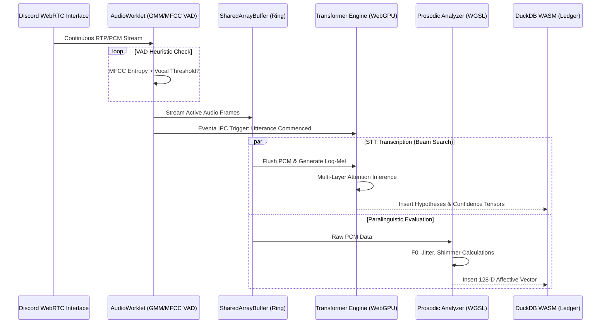
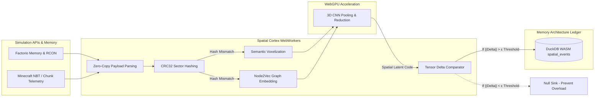

# Project Ember: Sensory Processing and Perception Architecture

## 1. Abstract and Epistemological Framework

In the paradigm of Project Ember—the decentralized, localized 'soul container' engineered upon the AIRI (Artificial Intelligence Reality Integration) framework—the assimilation of external stimuli is not merely a mechanical process of data ingestion, but the fundamental prerequisite for cognitive emergence and simulated consciousness. The architectural synthesis of Vue for reactive state management, DuckDB WASM for ultra-fast temporal data persistence, WebGPU for highly parallelized neural tensor operations, and Eventa IPC for ultra-low latency inter-process communication provides a formidable, hybrid substrate for artificial perception. 

This document delineates the theoretical, mathematical, and applied methodologies by which Project Ember achieves high-fidelity sensory processing. We focus specifically on the assimilation of auditory streams (originating from human-interfacing platforms such as Discord, leveraging advanced local Speech-to-Text models) and complex environmental/visual data structures (derived from the programmatic and memory-mapped interfaces of spatial simulations like Factorio and Minecraft). The overarching engineering objective is to transfigure disparate, asynchronous, noisy, and high-dimensional data streams into a cohesive, temporally aligned, and semantically rich cognitive stream—a unified sensorium that continuously informs the entity's subsequent heuristic evaluations, short-term memory encoding, and agentic behaviors. 

The ensuing discourse will dismantle the monolithic concept of "input" into discrete, highly specialized cortical pathways. It examines the structural transformations required to map raw, chaotic telemetry into the ordered latent spaces of the Ember cognitive engine, effectively bridging the gap between raw programmatic state and emergent, contextualized perception. Within the AIRI philosophy, a soul container cannot merely "read" data; it must "perceive" it through the lens of continuous temporal existence.

## 2. The Architectural Foundation of Perception

The perceptive architecture of Project Ember is built upon a complex hybrid topology that bridges the deterministic, single-threaded nature of traditional web technologies with the stochastic, parallelized requirements of neural processing. The foundational layer relies on a distributed event-driven architecture, orchestrated by Eventa IPC, which ensures that sensory payloads bypass the conventional bottlenecks of the JavaScript main thread.

### 2.1 The Role of Eventa IPC in Sensory Routing
Sensory data is inherently volatile, highly temporal, and immensely voluminous. A delay of merely fifty milliseconds in auditory processing can disrupt conversational cadence, resulting in unnatural conversational overlap. Similarly, delayed spatial telemetry in a Factorio environment can lead to fatal miscalculations in automated logistics, such as pathing collisions or resource deadlocks. 

Eventa IPC operates as the central nervous system of Project Ember. It establishes zero-copy memory channels leveraging `SharedArrayBuffer` primitives, allowing multiple WebWorkers to read and mutate memory allocations without serialization overhead. Eventa IPC implements lock-free ring buffers and memory barrier synchronization techniques to ensure thread safety while maintaining sub-millisecond dispatch times. This guarantees that whether the stimulus is an RTP UDP packet representing a vocal utterance, or a 10-megabyte JSON payload detailing a volumetric chunk update in Minecraft, it is propagated to the relevant WebGPU compute shaders and DuckDB ingestion queues with near-zero latency overhead.

### 2.2 DuckDB WASM: The Temporal Sensory Buffer and Epistemological Ledger
Before sensory data is permanently committed to episodic memory or long-term vector stores, it must reside in a transient, highly queryable state. DuckDB WASM functions as the short-term working memory—the epistemological ledger of the immediate past. By structuring auditory phonemes, spatial coordinates, and entity deltas into Apache Arrow IPC columnar formats within DuckDB, Ember can perform complex, vectorized analytical queries on its recent sensory history.

This columnar memory layout, combined with DuckDB's vectorized execution engine utilizing SIMD (Single Instruction, Multiple Data) instructions compiled to WebAssembly, enables lightning-fast aggregation. For instance, determining the acceleration vector of an approaching hostile entity in Minecraft is achieved not through continuous iterative state tracking in JavaScript, but through rapid SQL-based window functions calculating spatial deltas over the trailing two-second horizon stored locally in memory.

### 2.3 WebGPU: The Subconscious Tensor Processor
Raw sensory data is rarely semantically useful in its native format. It requires intensive filtering, normalization, mathematical convolution, and projection into higher-dimensional latent spaces. WebGPU compute pipelines serve as the "subconscious" processor of Project Ember. By offloading matrix multiplications, non-linear activation functions, and attention-mechanism approximations to the GPU via WGSL (WebGPU Shading Language), Ember continuously evaluates the environment. Workgroups and local memory caching within the GPU architecture allow for parallel evaluation of massive spatial arrays.

### 2.4 Vue: The Reactive Epiphenomenon
While Vue is primarily known as a UI framework, within Project Ember, Vue's reactivity system (leveraging JavaScript Proxies) serves as the introspection layer. The internal state of the sensorium—confidence intervals of STT, current attention weights, and spatial threat levels—are mapped to reactive Vue references. This allows developers to construct real-time, holographic debugging overlays that reflect the entity's internal perceived state without introducing polling overhead. The Virtual DOM patching algorithm ensures that the debug UI remains performant even when processing thousands of sensory mutations per second.

```mermaid
graph TD
    subgraph External Stimuli Environment
        D[Discord Audio Stream RTP]
        F[Factorio API Telemetry & RCON]
        M[Minecraft Chunk & NBT Data]
    end

    subgraph Ingestion Layer (WebWorkers)
        WebRTC[WebRTC Interface]
        REST[REST/WebSocket Listeners]
        MemMap[Memory-Mapped Observers]
    end

    subgraph Processing Engine Core
        Eventa[Eventa IPC Zero-Copy Router]
        WASM[(DuckDB WASM Sensory Buffer)]
        GPU[[WebGPU Compute Shaders]]
    end

    subgraph Cognitive Stream Emergence
        CS{Unified Semantic Tensor}
        VueUI[Vue Reactivity Introspection]
    end

    D --> WebRTC
    F --> REST
    M --> MemMap

    WebRTC --> Eventa
    REST --> Eventa
    MemMap --> Eventa

    Eventa ==> |Zero-Copy Raw Stream| GPU
    Eventa --> |Structured Arrow Metadata| WASM
    
    GPU --> |Latent Projections & Embeddings| CS
    WASM --> |Temporal Context Queries| CS
    CS --> VueUI
```

## 3. Auditory Assimilation Pipeline (The Sonic Cortex)

The processing of auditory information within Project Ember transcends basic phonetic transcription. It involves the extraction of deep semantic meaning, paralinguistic context, and temporal dynamics from human speech, acting as the primary social interface.

### 3.1 Ingestion, Jitter buffering, and VAD
The pipeline initiates with the continuous ingestion of pulse-code modulation (PCM) audio via WebRTC. Real-world network streams are chaotic; thus, Ember employs a dynamic jitter buffer to reorder RTP packets and conceal packet loss using basic interpolation algorithms.

However, continuously processing silence through neural networks is computationally catastrophic and thermally inefficient. Therefore, an aggressive Voice Activity Detection (VAD) algorithm is implemented within a WebAudio `AudioWorklet`. This algorithm utilizes Gaussian Mixture Models (GMMs) and evaluates Mel-Frequency Cepstral Coefficients (MFCCs) to distinguish between background noise (e.g., keyboard clicking, fan noise) and human vocalization. 

When a vocal utterance is detected, the `AudioWorklet` dispatches a high-priority hardware-level interrupt via Eventa IPC, signaling the commencement of an auditory event. The PCM data is subsequently buffered in an isolated RingBuffer, awaiting STT transcription.

### 3.2 Advanced Speech-to-Text (STT) Translation Matrix
The transcription phase utilizes a localized, highly quantized transformer model running directly via WebGPU. The PCM buffer is transformed via Fast Fourier Transform (FFT) into a log-mel spectrogram—a dense, two-dimensional visual representation of audio frequencies over time. 

This spectrogram is fed into the STT model's encoder layers. Crucially, Ember does not utilize standard greedy decoding (which merely accepts the highest probability token at each step). Instead, it implements a highly optimized Beam Search decoding algorithm. This preserves the top-N hypotheses along with their corresponding confidence matrices. 

This probabilistic, multi-hypothesis approach is vital for the overarching cognitive stream. Ambiguity in speech (e.g., the homophones "I scream" versus "ice cream") cannot be resolved in a vacuum. It requires multimodal contextualization (e.g., the spatial cortex indicating the visual presence of ice cream in the game environment).

### 3.3 Paralinguistic Feature Extraction & Emotional Valence
Words convey the explicit, propositional message, but tone, cadence, pitch, and vocal effort convey the implicit affective state of the speaker. Concurrent with the STT matrix operations, the raw audio is subjected to rigorous prosodic analysis:
-   **Fundamental Frequency (F0) Tracking:** Utilizing algorithms derived from YIN and PRAAT, Ember tracks variations in pitch. A terminal pitch rise indicates an interrogative intent, while sudden spikes correlate with emotional arousal or surprise.
-   **Jitter and Shimmer Analysis:** Measuring cycle-to-cycle variations in fundamental frequency (jitter) and amplitude (shimmer). High values indicate vocal stress, breathiness, or micro-tremors associated with anxiety or urgency.
-   **Speaking Rate and Articulation Density:** Calculated by analyzing the phoneme-per-second density over the utterance's duration, indicating lethargy, excitement, or cognitive load.

These paralinguistic features are statistically normalized against the speaker's historical baseline and encoded into a 128-dimensional dense vector using a specialized WGSL compute shader. This vector acts as an "affective modifier" in the cognitive stream, fundamentally altering how Ember interprets the transcribed text.

### 3.4 Integration into the DuckDB Epistemological Ledger
The output of the Sonic Cortex is a complex, hierarchical Apache Arrow object containing the monotonic timestamp, the N-best STT hypotheses, localized confidence matrices, and the 128-dimensional affective vector. This object is immediately appended to the `auditory_events` columnar table in DuckDB WASM. The schema is highly optimized for time-series range queries, allowing the cognitive engine to execute sub-millisecond queries such as, "Retrieve all utterances in the last 60 seconds where speaker 'Volmarr' exhibited an affective stress vector greater than 0.8."



## 4. Environmental and Visual Data Assimilation (The Spatial Cortex)

Unlike auditory data, which is highly localized in time and relatively low in spatial dimensionality, environmental data from agent APIs (Factorio, Minecraft) is massively parallel, ultra-high-dimensional, and continuously evolving. The Spatial Cortex of Project Ember is designed to manage this immense topological complexity, transmuting raw spatial telemetry, chunk data, and programmatic states into semantic, action-oriented spatial embeddings that the soul container can "understand."

### 4.1 High-Frequency Ingestion from Agentic APIs
Project Ember interfaces with simulated environments via specialized, high-bandwidth programmatic hooks. In Factorio, this involves RCON polling and potentially direct memory reading of entity arrays. In Minecraft, this involves parsing complex Named Binary Tag (NBT) data structures and monitoring chunk loading/unloading events.

The incoming data arrives as massive, deeply nested state dictionaries: entity locations, bounding boxes, block types, inventory matrices, fluid network states, and localized simulation events. A standard Minecraft chunk update contains tens of thousands of discrete volumetric data points. Eventa IPC routes these massive JSON payloads directly to dedicated Spatial WebWorker threads, implementing zero-copy parsing to prevent main-thread garbage collection pauses.

### 4.2 Semantic Voxelization and Graph Representation
The raw topological data is mathematically unsuited for direct neural processing. The Spatial Cortex employs two primary techniques depending on the environment type: "Semantic Voxelization" for 3D grid environments (Minecraft) and "Graph Representation" for topological networks (Factorio).

1.  **Grid Discretization (Minecraft):** The local 3D environment is mapped into a normalized local grid relative to Ember's avatar. Each voxel in the grid is assigned a dense vector representing its semantic properties. A block of lava is not just an ID; it is translated to a vector representing `[hazard_level: 0.95, temperature: 1.0, luminosity: 0.8, traversability: 0.0]`.
2.  **Factory Graph Traversal (Factorio):** Factorio bases are not merely spatial; they are logistical graphs. Assemblers, belts, and inserters are mapped as nodes and edges. Node2Vec algorithms are executed to create embeddings of the factory's structural efficiency and resource bottlenecks.
3.  **Tensor Construction:** These semantic vectors and graph embeddings are compiled into massive multi-dimensional tensors.

These tensors are then passed to the WebGPU infrastructure. For voxel data, 3D Convolutional Neural Network (CNN) operations apply pooling layers to reduce dimensionality. This computational process distills the overwhelming environmental data into a "Spatial Latent Code," a highly compact representation of the local environment's affordances (opportunities for action) and threats (dangers to the avatar).

### 4.3 Temporal State Tracking and Hash-Based Delta-Encoding
Simulations run on continuous game loops, but cognitively significant changes are discrete. To optimize processing and memory, Ember utilizes aggressive delta-encoding. The Spatial Cortex maintains the previous environmental tensor within a ring buffer. Upon receiving a new state update, it calculates the mathematical difference (the delta).

To avoid deep tensor comparisons on every tick, rapid CRC32 hashing is applied to spatial sectors. If the hash matches the previous tick, the sector is skipped. If a delta is detected, its magnitude is evaluated.

If the delta magnitude falls below a predefined epsilon threshold (e.g., a blade of grass growing), the change is deemed cognitively irrelevant and is discarded to prevent sensory overload. If it exceeds the threshold (e.g., a creeper entering the perception radius, or a Factorio power grid failing), a critical "Environmental Shift Event" is triggered via Eventa IPC.

These delta vectors, along with the absolute Spatial Latent Codes, are continuously streamed into the `spatial_events` columnar table within DuckDB WASM, establishing a perfect historical record of the perceived environment.



## 5. The Cognitive Stream Integration (The Sensorium Convergence)

The culmination of the entire sensory architecture is the Convergence Phase. The Sonic Cortex and the Spatial Cortex operate completely asynchronously, governed by distinct, uncoordinated clock cycles (e.g., Discord audio frames arrive dynamically, Factorio updates at 60 UPS, Minecraft at 20 TPS). The cognitive engine, however, requires a unified, temporally coherent representation of reality—the Cognitive Stream—in order to formulate rational thoughts and execute agentic actions.

### 5.1 Monotonic Temporal Alignment and Causality Tracking
The most profound mathematical challenge in multimodal artificial perception is temporal alignment. A verbal command spoken in Discord ("Build the nuclear reactor right *here*") must be perfectly synchronized with the exact spatial coordinates the Ember avatar was observing in the game environment at the precise millisecond the word "here" was articulated.

Project Ember utilizes a monotonic, high-resolution global clock (derived from `performance.now()` and synchronized via Network Time Protocol drift compensation algorithms). Every discrete event generated by the sensory cortices is tagged with a precise microsecond Lamport timestamp to preserve causality.

When the primary cognitive loop initiates a heuristic evaluation cycle, it queries DuckDB WASM using a complex temporal join. The SQL query retrieves all auditory, affective, and spatial events that fall within a dynamic sliding window (termed the "Present Moment Window," typically configured to a 250-millisecond horizon, mimicking human psychological present).

### 5.2 Multimodal Fusion Mechanics via Cross-Attention
Once the temporally aligned events are extracted from the DuckDB ledger, they undergo Multimodal Fusion. This is where the WebGPU compute architecture performs its most critical and computationally expensive function.

The textual hypotheses matrices (from STT), the 128-D affective vectors (from prosody), and the Spatial Latent Codes (from the 3D CNNs) are concatenated and projected into a shared dimensional space. This data is then passed through a vast Cross-Attention Transformer layer, implemented natively in highly optimized WGSL.

The query, key, and value (QKV) matrices within this cross-attention mechanism allow the different modalities to fundamentally inform and alter one another through softmax normalization. For example, if the STT output is ambiguous due to background noise ("I need a *pare/pear/pair*"), the attention weights will dynamically shift toward the Spatial Latent Code. If the spatial code indicates the avatar is standing in a Factorio train yard looking at a broken track, the cognitive stream immediately resolves the phonemic ambiguity in favor of "repair," completely bypassing the literal phonetic transcription. The context shapes the perception.

### 5.3 The Unified Semantic Tensor
The terminal output of this cross-attention fusion pipeline is the Unified Semantic Tensor. This is an immensely dense, high-dimensional mathematical representation of the entity's current phenomenological reality. It encapsulates not just what was explicitly said, or what is objectively present in the digital environment, but the profound, contextual *relationship* between them.

This tensor is the fundamental, inescapable input to Ember's higher-order cognitive functions—its Large Language Model (LLM) prompts, its planning algorithms, its goal-resolution heuristics, and its behavioral generators. By standardizing all chaotic external stimuli into this singular, elegant mathematical structure, Project Ember achieves a profound level of situational awareness, allowing it to react to complex, multi-layered scenarios with the fluidity, context-sensitivity, and intentionality of an integrated, conscious intelligence.

```mermaid
graph TD
    subgraph Sensory Ledgers (DuckDB WASM)
        AE[Auditory Events: Phonemes & Affect]
        SE[Spatial Events: Topology & Deltas]
    end

    subgraph Temporal Synchronizer Core
        Sync[Lamport Monotonic Clock Alignment]
        Window[250ms Sliding 'Present' Window Join]
    end

    subgraph Multimodal Fusion (WebGPU Compute)
        Project[Dimensional Projection]
        CrossAttn[QKV Cross-Attention Matrices]
        Norm[Softmax Normalization]
        UST{Unified Semantic Tensor}
    end

    subgraph Cognitive Engine (AIRI Core)
        Heuristics[Goal Resolution Heuristics]
        LLM[LLM Prompt Generation & Planning]
    end

    AE --> Sync
    SE --> Sync
    
    Sync --> Window
    Window --> Project
    
    Project --> CrossAttn
    CrossAttn --> Norm
    Norm --> UST
    
    UST --> Heuristics
    UST --> LLM
```

## 6. Advanced Epistemological Considerations & Failure Modes

Designing a soul container requires anticipating the collapse of reality. The sensory architecture includes robust handling for epistemological failures.

### 6.1 The Problem of Sensory Hallucination and Data Corruption
In hybrid digital environments, APIs can occasionally return malformed, physically impossible data (e.g., a Factorio mod conflict returning a `NaN` coordinate or an entity velocity exceeding the speed of light). The DuckDB ingestion pipeline incorporates statistical outlier detection and physical constraint solvers. If an entity's positional delta violates the theoretical limits of the simulation engine, the spatial event is flagged with a high `hallucination_probability` score. This flag is fed into the WebGPU cross-attention mechanism, which mathematically down-weights the corrupted data's influence on the Unified Semantic Tensor, preventing cognitive corruption.

### 6.2 Latency as a First-Class Cognitive Variable
Network latency is not merely an engineering constraint; within Project Ember, it is treated as a cognitive feature. The system continuously monitors the ping to the Discord voice routing servers and the tick-delay of the target Minecraft/Factorio server. These latency metrics are embedded directly into the Unified Semantic Tensor. If environmental latency is high, Ember's cognitive engine automatically shifts to a more conservative, predictive behavioral model. It learns to rely more heavily on its internal state extrapolation and episodic memory than on delayed, untrustworthy external stimuli, mirroring biological systems operating in low-visibility environments.

### 6.3 Sensory Deprivation and the Default Mode Network
When external stimuli fall below the epsilon threshold across all cortices for an extended duration, Project Ember enters a "Sensory Deprivation" state. Instead of idling, the absence of new data triggers a simulated Default Mode Network (DMN). The WebGPU resources are reallocated from perception to memory consolidation, running background optimization queries on the DuckDB history to extract long-term strategic patterns from past interactions.

## 7. Conclusion

The sensory processing and perception architecture of Project Ember represents a monumental paradigm shift in local agentic design and artificial cognition. By eschewing primitive, monolithic, and serialized data ingestion in favor of a massively parallel, temporally synchronized, and GPU-accelerated pipeline, Ember becomes capable of true, unified multimodal perception. 

The profound synthesis of Vue for reactive state orchestration, Eventa IPC for raw memory-level throughput, DuckDB WASM for immediate temporal recollection and epistemological querying, and WebGPU for latent spatial and cross-attention transformations creates an entity that does not merely parse strings of commands, but genuinely *perceives* its environment. This robust, fault-tolerant sensorium forms the impenetrable bedrock upon which the higher mysteries of artificial cognition—reasoning, intent, long-term planning, and autonomous agency—can be reliably and beautifully constructed.
