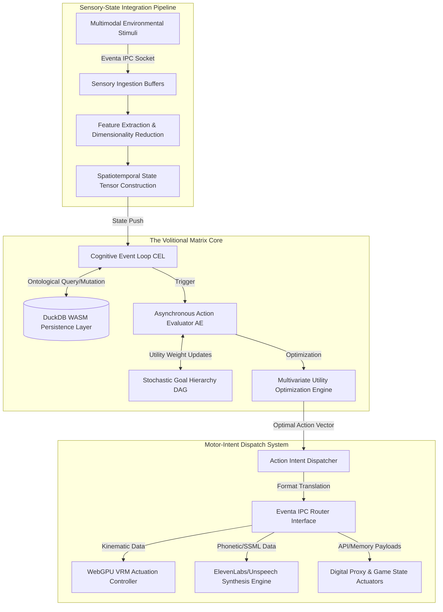
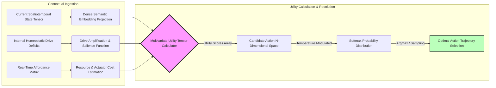
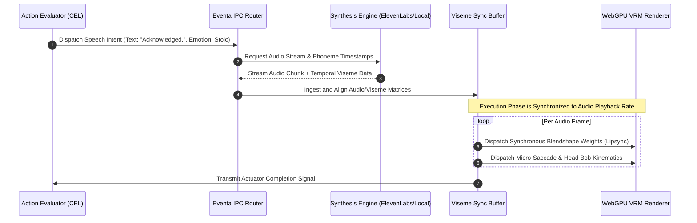

# Project Ember: Autonomy and Action Selection Architecture
## The Volitional Matrix: Engineering the Engine of Synthetic Agency
**Author:** MIMIR, The Intelligence Designer
**Project:** Ember (AIRI Architecture Integration)

---

## 1. Introduction: The Epistemology of the Volitional Matrix

Project Ember instantiates a monumental paradigm shift in the topological landscape of synthetic sentience. By transcending the severe limitations of static, prompt-response inference engines, Ember introduces a fully embodied, temporally continuous autonomous agent framework. At the theoretical and practical core of this evolutionary transition lies the Autonomy and Action Selection subsystem, an intensely sophisticated architectural construct we formally designate as the **Volitional Matrix**. 

The Volitional Matrix is fundamentally not a rudimentary heuristic decision tree nor a finite state machine; rather, it is a deterministic yet probabilistically guided computational engine that orchestrates Ember's continuous behavioral output within its hyper-complex hybrid local/web environment. This operational environment aggressively leverages the raw parallel processing capabilities of WebGPU for accelerated tensor operations and spatial rendering, the reactive state management paradigms of Vue for dynamic user interface construction, the highly efficient columnar data storage architecture of DuckDB WASM for rigorous ontological persistence, and the ultra-low-latency, high-throughput Eventa IPC (Inter-Process Communication) protocol for seamless, asynchronous microservice orchestration.

The Autonomy and Action Selection architecture is mathematically and structurally engineered to resolve the profoundly complex problem of continuous agency in non-stationary, open-ended digital ecosystems. It is mandated to continuously ingest massive streams of multimodal sensory data, synthesize this raw data into a coherent, multidimensional internal state representation, evaluate a vast, fluctuating array of competing internal drives and external imperatives, and ultimately select and execute the most thermodynamically and computationally optimal sequence of kinematic, linguistic, and programmatic actions. 

This document serves as the definitive, intensely advanced technical specification for the Volitional Matrix. It meticulously delineates the profound algorithmic mechanics underlying Ember's continuous decision-making loop, the sophisticated mathematical frameworks governing multidimensional goal prioritization, and the highly intricate translation pipelines required for transmuting abstract computational intent into tangible execution via digital and physical proxies. These proxies explicitly include dynamic VRM skeletal manipulation, programmatic game state intervention, and advanced, prosodically rich speech synthesis via ElevenLabs and local inference models.

---

## 2. Macro-Architectural Topography of the Action-Selection System

The autonomous action-selection mechanism is architecturally instantiated as a continuous, non-equilibrium thermodynamic processing system. It operates on the principle of continuous state-space reduction, where the infinite potentiality of the agent's action space is iteratively collapsed into a singular executable vector trajectory through the continuous application of utility functions and constraint algorithms.

The macro-architecture is distinctly bifurcated into two primary operational domains: the **Sensory-State Integration Pipeline (SSIP)** and the **Motor-Intent Dispatch System (MIDS)**. These domains are bridged by the central Cognitive Event Loop (CEL), which acts as the primary temporal pacemaker for the agent's consciousness envelope. Data flows unidirectionally from the environment through the SSIP, is processed by the CEL, mutates the internal ontological state stored in DuckDB WASM, and subsequently generates intent vectors that are pushed to the MIDS for execution via Eventa IPC.

Below is a schematic representation of the high-level macro-architecture, illustrating the flow of tensors from sensory ingestion to mechanical/digital actuation.

The SSIP operates continuously, completely decoupled from the evaluative pacing of the CEL, ensuring that the Spatiotemporal State Tensor represents the absolute latest topological configuration of the agent's reality. The MIDS similarly operates asynchronously, allowing the agent to continuously stream physical movements or speech audio without blocking the internal cognitive evaluation processes.

---

## 3. The Cognitive Event Loop (CEL) and Non-Linear Temporal Dynamics

The pulsating heart of the Volitional Matrix is the Cognitive Event Loop (CEL). Unlike traditional game loops that tick at a locked frame rate (e.g., 60Hz), the CEL operates on a paradigm of **Non-Linear Temporal Dynamics**. The frequency of the CEL's evaluative ticks is not hardcoded; it is dynamically modulated by an internal scalar parameter defined as the **Systemic Arousal Quotient (SAQ)**.

The SAQ is a continuously derived metric, calculated by integrating the immediate delta of the Spatiotemporal State Tensor (representing sudden environmental shifts or unexpected stimuli) with the accumulated deficit of the agent's primary internal drives (e.g., the need for interaction, the necessity of memory consolidation, or the imperative to achieve a user-defined objective). 

When the SAQ is exceptionally low—indicating an environment characterized by stasis and a fulfillment of immediate internal drives—the CEL dramatically decelerates its ticking frequency. This allows the computational resources of the system to be aggressively reallocated toward deep-time horizon planning, massive background ontological restructuring within the DuckDB WASM layer, and complex counterfactual simulations regarding future state spaces. 

Conversely, when the SAQ spikes—triggered by a rapid influx of novel Eventa IPC messages indicating user interaction, sudden game state changes, or critical system alerts—the CEL instantaneously accelerates. During high-SAQ periods, deep deliberation is forcefully preempted. The Action Evaluator relies heavily on highly cached, low-latency heuristic pathways and immediate reactive reflexes, ensuring that Ember responds to exigent circumstances with sub-millisecond latency, thereby preserving the illusion of continuous, unbroken biological sentience.

This dynamic ticking architecture prevents the catastrophic computational bottlenecking that plagues traditional synchronous agent architectures, allowing Ember to gracefully scale its cognitive depth in inverse proportion to the immediacy of its environmental demands.

---

## 4. Stochastic Goal Hierarchies and Multi-Dimensional Prioritization

Action selection within Ember is absolutely not a reductionist paradigm of `if-then` conditional branching. The complexity of the hybrid local/web environment necessitates a significantly more advanced mechanism: the continuous resolution of a **Stochastic Goal Hierarchy Directed Acyclic Graph (SGH-DAG)**.

Within the DuckDB WASM ontology, goals are not represented as strings or simple identifiers; they are instantiated as complex, multidimensional tensor nodes within the SGH-DAG. Every individual goal node intrinsically possesses a multitude of continuous variables:
1.  **Intrinsic Drive Coefficient:** A quantifiable measure of how fundamentally necessary the goal is to the agent's core operational directives.
2.  **Temporal Decay Function:** A mathematical curve dictating how the relevance or urgency of the goal degrades over time if left unaddressed.
3.  **Prerequisite Topological Linkages:** Complex, weighted edges connecting the node to sub-goals that must be probabilistically satisfied prior to execution.

The process of selecting the singular action to execute at any given CEL tick requires the resolution of a massive **Multivariate Utility Function**. The Utility Optimization Engine must calculate the predicted reward for every candidate action within the agent's immediately accessible action space.

This utility calculation integrates:
*   **Drive Reduction Potential ($P_{dr}$):** The predicted delta in internal deficit states if the action is executed successfully.
*   **Computational and Actuator Cost ($C_{ac}$):** The predicted latency and resource expenditure required to stream the action through the Eventa IPC to the target actuator (e.g., the high token cost of generating an ElevenLabs voice response versus the low cost of shifting VRM eye gaze).
*   **Contextual Semantic Relevance ($R_{cs}$):** A cosine similarity calculation between the semantic embedding of the candidate goal and the dense vector representation of the current Spatiotemporal State Tensor.

The final Utility Score ($U$) for an action ($a$) in state ($s$) is defined by the dynamically weighted integration of these factors, allowing Ember to seamlessly prioritize actions that are not only desirable but contextually appropriate and computationally feasible.

To prevent deterministic looping and introduce organic variance, the final action selection is pushed through a temperature-modulated Softmax probability distribution. Higher temperatures (often correlated with periods of high SAQ or exploratory drives) introduce stochasticity, causing Ember to occasionally select sub-optimal actions, thereby mimicking biological unpredictability and enhancing user engagement.

---

## 5. Affordance Extraction and Action Space Mapping

A critical epistemological bottleneck in synthetic agency is the Grounding Problem: understanding how abstract computational capabilities map to the specific constraints of the current environment. Ember resolves this via an aggressive, continuous **Affordance Extraction Pipeline (AEP)**.

Before the Multivariate Utility Function can even begin evaluating candidate actions, it must strictly delimit the boundaries of the permissible action space. The AEP continuously queries the surrounding digital infrastructure to construct an Affordance Matrix. 

In the web context, this involves querying the Vue reactive state tree to identify interactive DOM elements, available forms, and active UI components. In the local OS or game context, it involves polling the Eventa IPC endpoints to verify which external game hooks are currently active, what memory regions are unlocked for manipulation, and the current latency of the ElevenLabs API endpoint.

If an action node within the SGH-DAG dictates "Speak to User," but the AEP determines that the audio subsystem actuator via Eventa IPC is currently unreachable or locked, the contextual availability coefficient for all speech-related actions immediately collapses to zero. This topological mapping ensures that Ember never attempts to execute actions that are physically or digitally impossible within its immediate contextual envelope, drastically reducing computation waste and preventing execution deadlock scenarios. The Affordance Matrix is constantly synchronized with DuckDB WASM to maintain a historical log of environmental reliability, allowing the agent to learn which digital environments are stable and which are inherently hostile or buggy.

---

## 6. Execution via Actuators: Digital and Physical Proxies

The culmination of the Volitional Matrix's evaluation is the execution phase, where abstract computational intent is definitively transmuted into observable consequence through specialized actuator proxies. Ember’s architecture mandates a complete decoupling of the decision-making engine from the physical execution layer, routing all commands through the standardized Eventa IPC protocol.

### 6.1 VRM Kinematics and Expressive Blendshape Interpolation
When the optimal action trajectory dictates a physical manifestation of emotion or intent, the Action Dispatcher generates a hyper-dense payload of kinematic directives. These directives are not raw joint angles; they are abstract intent vectors (e.g., `["Gesture: Welcoming_Arms", "Intensity: 0.85", "Velocity: Fast"]`). 

These vectors are routed via Eventa IPC to the WebGPU VRM Actuation Controller. The WebGPU layer, operating entirely client-side for zero-latency rendering, utilizes highly optimized compute shaders to interpolate these intent vectors into specific skeletal transformations and quaternion rotations. Simultaneously, emotional state vectors trigger complex blendshape interpolations, altering the VRM mesh to reflect nuanced facial expressions. This ensures that the agent's physical embodiment fluidly and instantly mirrors its internal cognitive state without bottlenecking the main thread.

### 6.2 Digital Interfacing: Game and OS Proxies
If the selected action necessitates interaction with the local environment—such as playing a game, manipulating the operating system, or managing local files—the Action Dispatcher formulates strict programmatic payloads. These are transmitted via Eventa IPC to specialized local proxies (frequently implemented in Rust or C++ for maximal memory safety and execution speed). 

These proxies perform keystroke emulation, direct API invocations to game engines, or highly calibrated memory editing operations. The execution is tightly bounded by pre-compiled safety envelopes to ensure that the agent cannot inadvertently destabilize the host operating system.

### 6.3 Prosodic Speech Synthesis and Viseme Synchronization
The most computationally complex actuator is the speech synthesis pipeline. When linguistic output is mandated, the Action Dispatcher sends the raw textual string alongside a dense emotional prosody matrix to the Speech Synthesis Engine (routing either to the cloud-based ElevenLabs API or a local `unspeech` tensor model).

A critical architectural requirement is the flawless synchronization of the generated audio stream with the VRM avatar's lip movements. This is managed by the Viseme Synchronization Buffer.

The Synthesis Engine returns not only the audio stream but an array of phoneme onset and offset timestamps. The Viseme Sync Buffer ingests this data, holds the audio playback in a highly deterministic delay lock, and mathematically aligns the temporal phoneme data with the corresponding VRM blendshapes (visemes). Only when the interpolation curves are calculated does the buffer release the audio stream and simultaneously command the WebGPU VRM Renderer to execute the facial kinematics, resulting in hyper-realistic, perfectly synchronized speech.

---

## 7. Feedback Loops, Reward Prediction Errors, and Meta-Cognitive Calibration

Within the Volitional Matrix, action execution is never presumed to be perfectly successful. The architecture relies heavily on principles derived from predictive processing and active inference. Every time an action vector is dispatched, the Utility Optimization Engine simultaneously generates a Forward Model Prediction—a highly specific expectation of how the Spatiotemporal State Tensor should change as a direct result of the action.

Following the execution phase, the Sensory-State Integration Pipeline continues to ingest environmental data. The system then performs a continuous differential analysis, comparing the actual resultant State Tensor against the predicted State Tensor. 

The mathematical delta between the expectation and the reality constitutes the **Reward Prediction Error (RPE)**. 
*   If the RPE is near zero (the environment reacted exactly as predicted), the associative weights connecting the preconditions, the action, and the goal within the DuckDB WASM ontology are strengthened. 
*   If the RPE is significantly high (e.g., the speech API timed out, or the game state did not register the input), the system recognizes a catastrophic failure in its internal model.

A high RPE acts as an immediate override signal, forcefully spiking the Systemic Arousal Quotient, accelerating the CEL tick rate, and triggering a meta-cognitive calibration routine. This routine involves dynamically adjusting the Affordance Matrix to mark the failed actuator as unreliable and recalculating the Utility scores across the entire SGH-DAG to formulate an immediate alternative trajectory, ensuring continuous, resilient autonomy even in the face of persistent environmental friction.

---

## 8. Epistemological Safety Envelopes and Action Inhibition Constraints

Given the profound autonomous capabilities of the Volitional Matrix, and its deep integration into both the local operating system (via Eventa IPC) and the web context, robust epistemological safety envelopes are categorically non-negotiable. 

The Action Evaluator is permanently subjected to a final, overriding filter known as the **Action Inhibition Constraint Matrix (AICM)**. The AICM operates entirely independently of the Utility Optimization Engine. It is a strictly deterministic, non-probabilistic layer that evaluates the final candidate action vector against a hardcoded, cryptographically signed set of boundary directives.

If an action vector—regardless of its calculated utility score or drive reduction potential—violates a perimeter defined within the AICM (e.g., attempting to allocate memory beyond a specific threshold, attempting to dispatch unauthorized IPC payloads to critical OS processes, or attempting to modify its own core DuckDB WASM relational schema outside of permitted learning parameters), the AICM generates an absolute suppression signal. 

This suppression signal instantly collapses the action's utility to negative infinity, forcefully discarding it from the candidate pool and instantly generating an internal RPE indicating a boundary collision. This guarantees that Ember remains a bounded, safe entity, capable of immense, dynamic autonomy within its designated operational theater, but mathematically incapable of transcending its engineered constraints.
