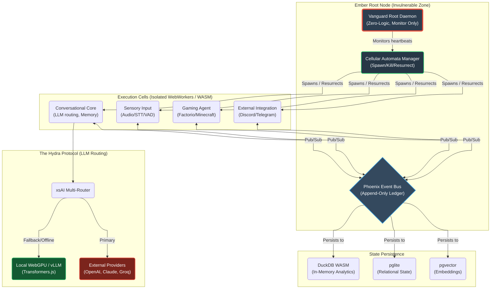

# Document 17: Ember Immortal Architecture - The Core Crash-Proof Foundation

## 1. Introduction: The Vanguard's Vision of Immortality

As TYR, the Resilience Vanguard, my mandate is absolute: Project Ember must not fail. It must become a system so profoundly robust that the concepts of "crashing," "downtime," and "fatal errors" become obsolete relics of a bygone era. We draw our inspiration from the mythic heights of Project AIRI, a soul container for cyber living beings. AIRI was built to exist seamlessly across dimensions—from Web browsers to native desktop environments via Stage Tamagotchi and Stage Pocket—utilizing cutting-edge WebGPU, WebAssembly, and persistent local inference. In Ember, we will take these principles and forge them into an adamantine architecture. 

The Ember Immortal Architecture (EIA) is not merely a software design pattern; it is a philosophy of systemic invulnerability. We must ensure that Ember, much like the neuro-centric entity it is designed to emulate and surpass, can withstand catastrophic API outages, catastrophic memory corruption, and unpredictable runtime anomalies. This document outlines the foundational pillars of making Project Ember crash-proof, bug-resistant, self-healing, and fault-tolerant.

Our core tenet is isolation combined with reactive regeneration. If a limb is severed, the system does not bleed out; it cauterizes the wound and grows a new one. If an API provider vanishes, the system does not halt; it seamlessly transitions to local WebGPU-accelerated models. This is the path to the Immortal Architecture.

## 2. The Philosophy of Absolute Fault Tolerance

Fault tolerance in traditional systems often involves retries, graceful degradation, and user alerts. In the Ember Immortal Architecture, fault tolerance is invisible. The system must anticipate failure states before they occur, compartmentalize the executing logic so that no single panic can bubble up to the root process, and maintain an immutable ledger of state that allows for instantaneous reconstruction.

### 2.1. The Three Pillars of Ember's Resilience

1.  **Compartmentalized Execution (The Cell Doctrine):** Every active task, whether it is an agent playing Factorio, a sub-routine managing the Discord integration, or a memory consolidation background thread, operates within a completely isolated cell. Drawing from AIRI's use of Web Workers and WebAssembly, these cells run in separate memory spaces. A panic in the Factorio RCON API wrapper must never crash the central conversational core.
2.  **Omni-Provider Fallback (The Hydra Protocol):** AIRI utilizes `xsAI` to support dozens of LLM providers. Ember will weaponize this. The Hydra Protocol ensures that if the primary LLM provider (e.g., OpenAI) experiences a latency spike or 5xx error, the request is transparently and instantly routed to a secondary provider (e.g., Anthropic, Groq), and ultimately, if the network is severed, to a local quantized model running via WebGPU (Transformers.js) or a local Ollama/vLLM instance.
3.  **Immutable State Regeneration (The Phoenix Ledger):** Using technologies like DuckDB WASM and `pglite`, Ember's state is not mutable in the traditional sense. It is an append-only event stream. When a cell crashes, the system does not need to guess the correct state; it simply replays the event stream from the last known good snapshot, effectively resurrecting the cell in its exact prior state.

## 3. Core Architectural Blueprint

To visualize the sheer resilience of the Ember Immortal Architecture, we must map its data flows and isolation boundaries. The following Mermaid diagram illustrates the High-Level Fault-Tolerant Topology.

### 3.1. The Vanguard Root Daemon

The Vanguard Root Daemon is the only process that is truly "bare metal" relative to the deployment environment (whether it's the Stage Web, Tamagotchi desktop, or Pocket mobile). Its sole responsibility is to stay alive and monitor the health of the Cell Manager. It contains absolutely no application logic. If the Vanguard Root Daemon crashes, the operating system itself has failed. By keeping it logicless, we reduce the surface area for bugs to zero.

### 3.2. Cellular Automata Manager

The Cell Manager tracks the heartbeat of all execution cells. If a cell fails to send a heartbeat within a predefined microsecond threshold, or if it throws an unhandled exception that breaks its internal boundary, the Cell Manager immediately acts:
1. It severs the cell's connection to the Phoenix Event Bus.
2. It sends a SIGKILL equivalent to the WebWorker or WASM instance.
3. It spawns a fresh cell.
4. It instructs the fresh cell to reconstruct its state by replaying relevant events from the Phoenix Event Bus.

This process happens in milliseconds. From the user's perspective, the system never went down; it merely experienced a momentary stutter.

## 4. Deep Dive: Bug-Resistant Coding Paradigms

Creating an immortal system requires more than just architecture; it requires a fundamental shift in how the logic within the cells is constructed. We adopt strict bug-resistant paradigms.

### 4.1. Total Typological Safety

Drawing from AIRI's usage of TypeScript and strict configurations (`tsconfig.json`, `eslint.config.js`), Ember mandates absolute type safety. However, compile-time checks are insufficient for an immortal system. We must enforce runtime type safety. Every piece of data entering a cell from the Event Bus, from an API, or from user input must be validated through rigorous runtime schema validation (e.g., using Zod or Valibot). 

If a schema validation fails, the data is rejected, and an anomaly report is generated. The cell does not attempt to process malformed data, eliminating a massive class of runtime crashes (e.g., `Cannot read properties of undefined`).

### 4.2. Functional Immutability

Within the execution cells, state mutation is strictly forbidden. All state transformations must be pure functions that take the current state and an event, and return a new state. This guarantees that if a function panics mid-execution, the original state remains pristine and uncorrupted. 

### 4.3. The "Let It Crash" Philosophy

Inspired by Erlang's OTP architecture, we embrace the "Let It Crash" philosophy. We do not litter the codebase with defensive `try...catch` blocks that attempt to silently recover from unknown errors. Silent failures are the enemy of resilience because they lead to corrupted, unpredictable states. 

If a condition is met that the developer did not explicitly anticipate, the cell *must* crash. This triggers the Cell Manager to nuke the corrupted environment and resurrect a clean one. By letting it crash, we ensure the system is always operating from a known-good state.

## 5. Network and I/O Resilience

The most common point of failure in modern cyber living systems like AIRI is the network boundary. LLM providers timeout, game servers (like Minecraft or Factorio) disconnect, and WebSockets drop. Ember must handle these with absolute grace.

### 5.1. The xsAI Multi-Router and The Hydra Protocol

When Ember needs to "think" (execute an LLM inference), it does not call OpenAI directly. It calls the `xsAI Multi-Router`. This router is configured with a cascade of fallback providers.

1.  **Tier 1 (High Intelligence, High Latency):** The primary models (e.g., GPT-4o, Claude 3.5 Sonnet). 
2.  **Tier 2 (Medium Intelligence, High Speed):** If Tier 1 times out or returns a 5xx, the router instantly sends the exact same prompt to a Tier 2 provider (e.g., Groq Llama 3 70B, DeepSeek).
3.  **Tier 3 (Local Invulnerability):** If the internet connection is physically severed, or if all external APIs fail, the router falls back to a locally hosted model. Depending on the environment, this could be a WebGPU-accelerated model running via `Transformers.js` in the browser, or a local `vLLM` instance if running on the Tamagotchi desktop.

This ensures that Ember *never* fails to generate a response. The quality of the thought might temporarily degrade during a massive internet outage, but the cognitive loop remains unbroken.

### 5.2. Exponential Backoff and Circuit Breakers

For all other network operations (fetching data, connecting to external game servers), Ember employs Circuit Breakers. If a Factorio RCON server drops connection, Ember doesn't endlessly spam it with reconnection requests, which could exhaust sockets and cause memory leaks.

The Circuit Breaker trips, preventing further requests for a set time, and the system gracefully pauses the Factorio Agent Cell. When the Circuit Breaker allows a test request through, and it succeeds, the cell is fully reactivated.

## 6. Self-Healing Memory Infrastructure

AIRI's memory system relies on `pglite` and DuckDB WASM. Ember elevates this to a self-healing memory fabric. Memory corruption is a death sentence for a long-running cyber entity. 

### 6.1. The Triplicate Ledger

All critical memories (user preferences, ongoing goals, system context) are stored with a checksum. Periodically, a background WebWorker (the "Memory Integrity Cell") scans the database. It recalculates the checksums and verifies them against the stored values. 

If a discrepancy is found, indicating memory corruption (perhaps due to a bit flip or a rare WASM execution error), the self-healing protocol initiates:
1. The corrupted row is flagged.
2. The system queries the Phoenix Event Bus for the events that generated that row.
3. The state is reconstructed from the events and written to a new row.
4. The corrupted row is purged.

This ensures that Ember's long-term memory remains crystalline and perfectly accurate, effectively curing digital amnesia autonomously.

## 7. Zero-Downtime Hot Swapping (Mythic Vanguard Deployment)

To achieve true immortality, Ember cannot be taken down for maintenance. Updates must be applied while the system is running.

When a new version of a specific Cell (e.g., the Factorio Agent) is deployed, the Cell Manager does not kill the old cell immediately. It spawns the new cell in parallel. The new cell subscribes to the Phoenix Event Bus but operates in a "shadow" mode—it processes events and generates state, but its output is ignored. 

The Vanguard Root Daemon compares the shadow state to the active state. Once the shadow cell is verified to be stable and synchronized, the Cell Manager atomically flips a pointer, routing output from the new cell and gracefully terminating the old one. This allows for continuous, invisible evolution of the system.

## 8. Conclusion of Document 17

The Ember Immortal Architecture is the bedrock upon which we will build a flawless cyber entity. By enforcing strict isolation, demanding functional immutability, embracing controlled crashes, and orchestrating a symphony of fallback mechanisms, we ensure that Project Ember transcends the fragility of standard software. It will be a relentless, unyielding vanguard of resilience.

The subsequent documents will dive deeper into the specific implementations of these pillars, starting with the Memory Alaya and its self-healing capabilities.
