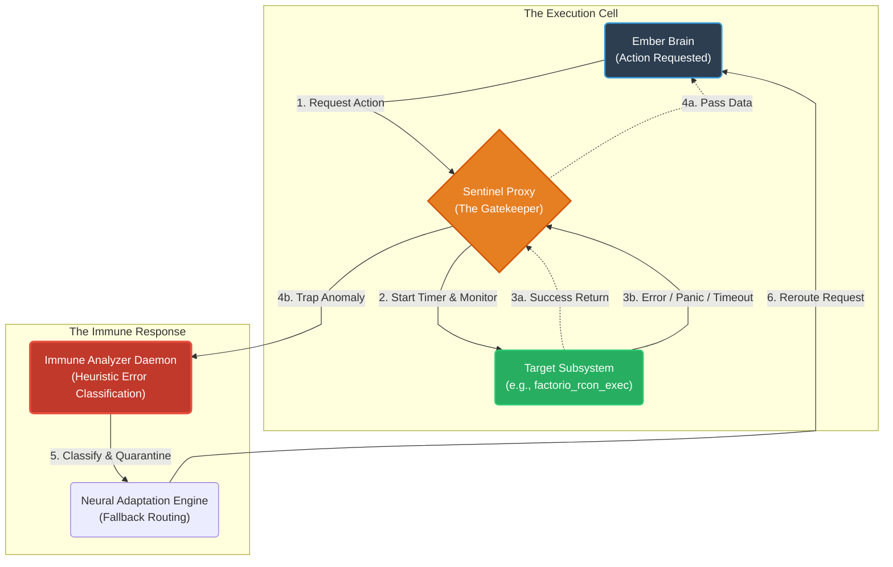

# Document 19: Ember Autonomous Bug Resistance - Real-Time Error Detection and Adaptation

## 1. Introduction: The End of the Unhandled Exception

In the epoch of standard software engineering, bugs are discovered via user reports, crash logs, and static analysis. By the time a developer reads a stack trace, the damage is done. The user experience has been shattered, and the system's integrity compromised. For Project Ember, under the strict edicts of the Vanguard, this reactive paradigm is unacceptable. Ember must possess Autonomous Bug Resistance (ABR).

ABR is the capacity of the system to identify, quarantine, and adapt to logic errors, unhandled exceptions, and anomalous behaviors in real-time, without human intervention. Drawing deep inspiration from the bio-mimicry of Project AIRI—specifically how AIRI's sensory input modules handle unpredictable audio and visual noise—Ember treats bugs not as fatal system halts, but as pathogenic infections. The system is designed with an immune response capable of identifying the pathogen, neutralizing the affected cellular logic, and deploying alternative execution pathways.

This document outlines the architectural implementation of the Ember Autonomous Bug Resistance protocol, detailing the real-time feedback loops, the anomalous execution detection heuristics, and the dynamic adaptation strategies.

## 2. The Philosophy of the Immune Response

The ABR system operates on a fundamental shift in error handling. Traditional `try...catch` blocks are designed to "swallow" errors or present friendly error messages. The ABR system, conversely, is designed to **expose, analyze, and amputate**.

### 2.1. The Three Stages of Immunity

1.  **Detection (The Sentinel Grid):** Ember does not rely solely on the Node.js or browser V8 engine to report errors. It utilizes a grid of Sentinel Proxies that wrap all critical function calls, monitoring execution time, memory allocation spikes, and return type validity.
2.  **Quarantine (The Isolation Protocol):** Upon detecting an anomaly (an exception, a timeout, or a schema violation), the specific execution context is instantly frozen. The tainted WebWorker or WASM module is severed from the Phoenix Event Bus to prevent corruption from spreading.
3.  **Adaptation (The Neural Reroute):** The system dynamically rewires itself. If a specific subsystem fails, Ember attempts to accomplish the goal using a different, perhaps less efficient, but known-good fallback subsystem.

## 3. The Sentinel Grid Architecture

The Sentinel Grid is an omnipresent monitoring layer. It is implemented using JavaScript `Proxy` objects, heavily instrumented WebWorker message passing, and WASM memory bound checks.

### 3.1. Execution Wrapping and Proxies

Every major subsystem in Ember (e.g., the Factorio command generator, the Discord message parser, the Live2D expression engine) is not called directly. It is invoked through a Sentinel Proxy.

### 3.2. Heuristic Detection of "Silent" Bugs

Not all bugs throw exceptions. "Silent" bugs—where logic executes successfully but produces incorrect results—are arguably more dangerous. The Sentinel Grid employs several heuristics to detect these:

1.  **Temporal Anomalies:** If a function that historically takes 50ms suddenly takes 5000ms, the Sentinel flags it as a potential infinite loop or resource deadlock, even if no error is thrown. The execution is preemptively terminated.
2.  **Memory Bloat Detection:** Using the `performance.memory` API (where available) or WASM heap monitoring, if a specific cell suddenly spikes its memory consumption by 300% without a corresponding increase in input load, it is flagged for a potential memory leak.
3.  **Semantic Validation (Zod/Valibot):** As detailed in Document 17, every boundary is strictly typed. If a subsystem returns data that fails schema validation (e.g., returning a string instead of a required array of coordinates), the Sentinel traps it as a silent logic failure.

## 4. The Quarantine and Amputation Protocol

When the Immune Analyzer confirms a bug, the response must be swift and brutal to protect the core.

### 4.1. The Severance Procedure

1.  **Event Bus Lockout:** The compromised WebWorker cell is instantly deregistered from the Phoenix Event Bus. It can no longer read or write state.
2.  **Hard Terminate:** The cell is forcefully killed (`worker.terminate()`). We do not wait for graceful shutdown, as a corrupted state might trigger destructive actions during cleanup.
3.  **Anomaly Logging:** A highly detailed diagnostic package is generated. This includes the stack trace (if available), the exact input parameters that triggered the failure, the execution duration, and the state of the L1 Somatosensory Buffer at the time of failure. This package is persisted to a dedicated `bug_reports` collection in DuckDB for later developer analysis.

### 4.2. Preventing the "Crash Loop"

A common problem in self-healing systems is the "crash loop": a cell crashes, is immediately restarted, receives the same problematic input, and crashes again, ad infinitum. Ember prevents this through input blacklisting.

If a specific payload causes a cell to crash, that payload's hash is added to a temporary blacklist. When the cell is resurrected, the Sentinel Proxy will instantly reject any request matching that hash, returning a `Rejected_Pathogen` error to the calling subsystem, forcing it to find an alternative route.

## 5. Dynamic Adaptation (Neural Rerouting)

Quarantine stops the bleeding; Adaptation keeps the system walking. Ember achieves bug resistance by having multiple, redundant methods for achieving critical goals.

### 5.1. The Strategy Pattern for Subsystems

Critical operations are implemented using a Strategy Pattern. If the primary strategy fails due to a bug, the system automatically falls back to a secondary, usually simpler and more robust, strategy.

**Example Scenario: Factorio Base Building**

1.  **Primary Strategy (Advanced Algorithm):** The `Factorio_Agent` attempts to use an experimental, highly optimized pathfinding algorithm to place a complex blueprint.
2.  **The Bug:** The experimental algorithm encounters a rare edge case involving water tiles and throws an `IndexOutOfBounds` exception.
3.  **The Immune Response:** The Sentinel traps the error, kills the pathfinding cell, and reports the failure.
4.  **Neural Rerouting:** The `Factorio_Agent` receives the `Rejected_Pathogen` signal. Instead of failing the entire "build base" goal, it automatically switches to the **Secondary Strategy (Brute Force):** It utilizes a slower, older, but battle-tested line-by-line placement algorithm.
5.  **Result:** The base is built. The user experiences a slight delay, but the system did not crash.

### 5.2. LLM-Assisted Fallback

In scenarios where programmatic fallbacks are unavailable, Ember can leverage its `xsAI` LLM core for real-time problem-solving. 

If a data parser (e.g., parsing a complex Discord JSON response) fails due to an unexpected API change (a bug introduced by an external dependency), the system can route the raw JSON string to an LLM with the prompt: *"The strict parser failed on this payload. Extract the user ID, message content, and timestamp, and return them in this strict JSON format."*

The LLM acts as an incredibly flexible, dynamic fallback parser. It is computationally expensive and slow, but it guarantees fault tolerance where brittle regular expressions or strict parsers would permanently fail.

## 6. The Long-Term Evolution: Auto-Patching

The ultimate goal of Autonomous Bug Resistance is not just surviving the bug, but fixing it. While modifying raw source code autonomously is currently beyond safe bounds, Ember can utilize the Memory Alaya to implement functional auto-patching.

When the system identifies a failing input (the blacklisted pathogen), it can spin up an isolated background process. It feeds this input, the expected output schema, and the stack trace to an advanced LLM (e.g., Claude 3.5 Sonnet). The LLM generates a Javascript sandbox function attempting to handle the edge case. 

Ember tests this generated function against the problematic input in a heavily sandboxed environment. If it successfully parses the data and returns valid schema without throwing an error, this "hot patch" function is injected into the Sentinel Proxy pipeline, permanently overriding the buggy code path for that specific edge case. This represents true, autonomous cybernetic evolution.

## 7. Conclusion of Document 19

Autonomous Bug Resistance ensures that Project Ember is not fragile glass waiting to be shattered by an unexpected null pointer. It is an adaptive, biological system. Through the Sentinel Grid, ruthless quarantine protocols, and dynamic Neural Rerouting, Ember transforms fatal errors into mere inconveniences. The Vanguard dictates that the system must survive; ABR is how it fights back.

Document 20 will shift focus to the cognitive engine itself, exploring the Ember Fault-Tolerant Neuro Core and the mechanisms that guarantee unbroken intelligence.
