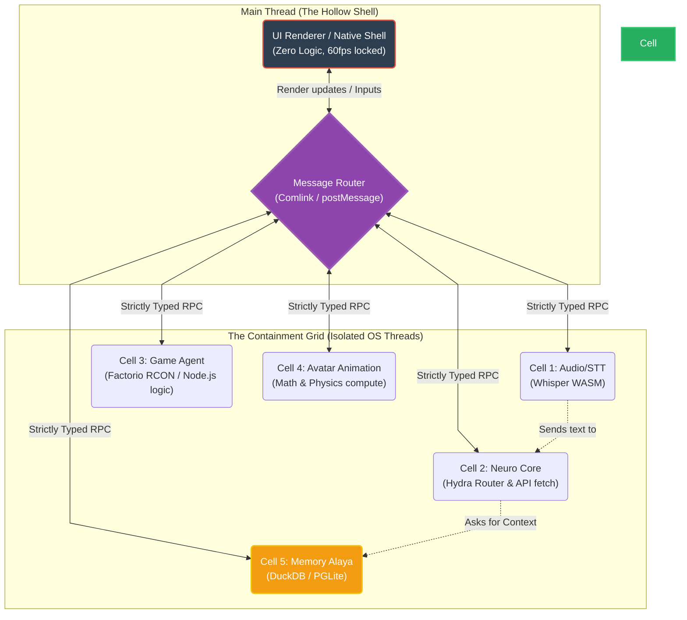

# Document 21: Ember WebWorker Isolation Protocol - The Cellular Containment Grid

## 1. Introduction: Monolithic Fragility vs. Cellular Resilience

In standard web and Node.js application architectures, the event loop is a single point of absolute failure. A computationally heavy task (like parsing a massive JSON payload or computing a complex pathfinding route) will block the main thread, causing the application to freeze, drop WebSockets, and become entirely unresponsive. Worse, an unhandled exception or memory leak in any single module will bring down the entire Node.js process or crash the browser tab.

For Project Ember, the Vanguard dictates that this monolithic fragility is a critical vulnerability. An autonomous cyber entity that freezes while "thinking" is functionally dead. Drawing from Project AIRI's extensive use of Web technologies, Ember implements the WebWorker Isolation Protocol (WIP). This protocol mandates a strict Cellular Containment Grid, where every discrete subsystem operates in a completely isolated memory space (a WebWorker or WebAssembly sandbox), communicating only via asynchronous, strongly-typed message passing.

This document details the architectural design of the WIP, the message passing infrastructure, the SharedArrayBuffer synchronization techniques, and the mechanisms that guarantee absolute containment of catastrophic failures.

## 2. The Cellular Containment Grid Architecture

The core concept is to treat the main execution thread (whether in the browser DOM or the main Node process in Stage Tamagotchi) strictly as a UI renderer and a very lightweight orchestrator. It contains zero application logic.

### 2.1. The Actor Model Implementation

Ember adopts a strict Actor Model pattern. Each subsystem is an "Actor" living inside a "Cell" (a WebWorker).

1.  **Isolation:** Actors do not share state. They cannot accidentally overwrite another actor's variables.
2.  **Concurrency:** Because they run in separate OS threads (via WebWorkers), an intense CPU load in the Factorio Pathfinding Cell will have absolutely zero impact on the Audio Transcription Cell.
3.  **Containment:** If an Actor encounters a fatal error and crashes its WebWorker, the blast radius is contained strictly to that cell. The main thread and all other cells remain completely unaffected.

### 2.2. Diagram: The Cellular Topology



## 3. The Message Passing Infrastructure

The fundamental challenge of a cellular architecture is communication. Standard `postMessage` serialization (Structured Clone Algorithm) is safe but can be incredibly slow for massive payloads (e.g., passing a 50MB audio buffer or a huge chunk of Factorio map data). Ember implements a multi-tiered communication protocol.

### 3.1. Zero-Copy Transfers (Transferable Objects)

Whenever large binary data is moved between cells, Ember strictly enforces the use of Transferable Objects (like `ArrayBuffer`, `MessagePort`, `ImageBitmap`). 

When Cell A sends an `ArrayBuffer` to Cell B using the transfer list, the ownership of the memory is atomically transferred at the OS level. The data is not copied. This results in zero-latency data transfer. However, Cell A instantly loses access to that memory. This perfectly enforces functional immutability and prevents race conditions.

### 3.2. Comlink and Strongly-Typed RPC

Writing raw `postMessage` handlers is error-prone and leads to spaghetti code. Ember utilizes a deeply customized version of Google's `Comlink` library. 

Comlink wraps the WebWorker boundary in ES6 Proxies. To the developer writing code in the Main Thread, calling a function in the Factorio Cell looks like a standard asynchronous function call.

```typescript
// Main Thread (or another cell via MessageChannel)
import { wrap } from 'comlink';
const factorioCell = wrap<FactorioAgentApi>(new Worker('./factorio-cell.js'));

// This looks like local async code, but actually serializes the request, 
// sends it to the isolated WebWorker, executes it there, and returns the result.
const nextMove = await factorioCell.calculateOptimalBeltPlacement(currentMapState);
```

This enforces strict TypeScript interfaces across the isolation boundary, ensuring that communication errors are caught at compile-time, further enhancing bug resistance.

## 4. Ultra-Low Latency Synchronization: SharedArrayBuffer

While message passing is excellent for events, some state must be read by multiple cells simultaneously with near-zero latency. For example, the Live2D Animation Cell needs to constantly read the current "emotion" state to interpolate mouth shapes, while the Neuro Core is simultaneously updating that emotion state based on LLM output.

For this, Ember deploys `SharedArrayBuffer` (SAB) combined with `Atomics`.

### 4.1. The Atomic State Vector

Ember allocates a small, fixed-size `SharedArrayBuffer` at boot. This buffer represents the "Atomic State Vector" of the entity (e.g., current X/Y coordinates in Minecraft, current emotional valence, speaking boolean). 

A reference to this SAB is passed to every cell upon creation. Because it is shared memory, any cell can read the bytes instantly without any `postMessage` overhead.

### 4.2. Safe Concurrency with Atomics

To prevent race conditions (e.g., two cells trying to write to the "emotion" byte simultaneously), Ember strictly uses the `Atomics` API. 

```javascript
// Inside a Cell: Updating the 'speaking' status
const offset = STATE_OFFSETS.IS_SPEAKING;
// Safely write the value '1' to the specific index, ensuring thread safety
Atomics.store(sharedStateView, offset, 1);
```

By constraining shared memory to a tiny, tightly controlled vector of primitives, and using Atomics for all mutations, Ember achieves the performance of shared-memory threading without the catastrophic thread-locking bugs that typically plague monolithic applications.

## 5. Containment Protocols: The Blast Radius

The core purpose of the WebWorker Isolation Protocol is containment. What happens when a cell inevitably encounters a fatal error, such as a stack overflow in a recursive pathfinding function, or an out-of-memory (OOM) error parsing a massive payload?

### 5.1. The "Worker Trapped" Signal

If a WebWorker crashes, the standard behavior is a silent failure or an `onerror` event fired on the worker object in the main thread. 

The Cellular Containment Grid's Message Router wraps every Worker instantiation. It listens for the `error` and `messageerror` events. If a worker dies, it does not bubble the error up to crash the main thread. Instead, it traps it.

### 5.2. The Clean Slate Resurrection

Upon trapping a crash, the Message Router performs the Clean Slate Resurrection (partially detailed in Document 17):

1.  **Orphaning:** The router immediately nullifies all Proxy references to the dead cell. Any pending Promises (e.g., a subsystem waiting for the pathfinding result) are forcefully rejected with a `Cell_Annihilated` error. This allows the calling subsystem to activate its Autonomous Bug Resistance fallback (Document 19).
2.  **Termination:** It calls `.terminate()` on the dead worker instance to ensure the OS aggressively reclaims any leaked memory.
3.  **Respawn:** A brand new, pristine WebWorker is instantiated from the source file.
4.  **Re-linking:** The new worker is injected with the SharedArrayBuffer and MessagePorts, hooking it back into the grid.
5.  **State Rehydration:** The cell queries the Memory Alaya for its last known valid state and rehydrates.

Because of the strict isolation, the memory corruption that caused the crash in the original cell cannot possibly exist in the new cell. The system has effectively amputated a necrotic limb and regrown a healthy one in milliseconds.

## 6. Advanced WebAssembly Sandboxing

For executing highly complex, potentially unsafe logic (like third-party plugins or experimental Rust-compiled parsers), standard WebWorkers still have access to network APIs (`fetch`) and some global state.

Ember utilizes WebAssembly (WASM) not just for performance, but as a secondary, extreme containment sandbox.

When untrusted code needs to run, it is compiled to WASM and instantiated within a WebWorker. The WASM module has its own entirely isolated linear memory heap. It cannot execute Javascript, it cannot access the network, and it cannot touch the DOM. It can only perform math on its own memory and return numbers. 

If the WASM module contains a memory leak or a segfault, it simply crashes its own tiny WASM instance. The wrapping WebWorker catches the exception, resets the WASM instance, and continues. This represents a dual-layer containment field: WASM sandboxing inside WebWorker isolation.

## 7. Conclusion of Document 21

The WebWorker Isolation Protocol is the physical architecture of Ember's immortality. By abandoning the monolithic single-thread paradigm and enforcing strict Cellular Containment, we guarantee that no single bug, however severe, can cascade into a total system failure. The Main Thread remains a pristine, ultra-responsive shell, while the isolated WebWorkers battle chaos in the trenches, dying and resurrecting as needed to protect the whole.

Document 22 will delve into the final major pillar of resilience: how the system maintains coherence when cells die and resurrect, utilizing Ember Reactive State Reconstruction.
