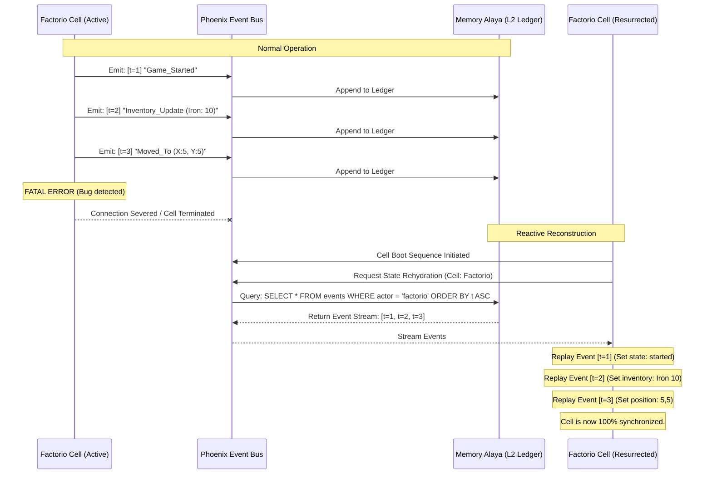

# Document 22: Ember Reactive State Reconstruction - Time Travel and Event Sourcing

## 1. Introduction: The Problem of Ephemeral State

In the architecture outlined in the previous documents, we have established a system where execution cells (WebWorkers) are disposable. They can be terminated and resurrected in milliseconds by the Cellular Containment Grid (Document 21) or quarantined by the Autonomous Bug Resistance system (Document 19). 

However, this constant cycle of death and rebirth introduces a profound challenge: State Coherence. If the Factorio Agent cell is calculating a complex factory layout and is suddenly terminated due to a bug, the new, resurrected cell spawns with amnesia. It has no idea what it was doing. If we rely on periodic snapshots (saving state to disk every 5 minutes), the new cell will resurrect 5 minutes in the past, leading to desynchronization with the real-time game server.

To achieve true immortality, Ember must be able to reconstruct the exact, millisecond-precise state of any cell at the exact moment of its termination. We accomplish this through the Ember Reactive State Reconstruction protocol, heavily utilizing Event Sourcing and the DuckDB WASM infrastructure of the Memory Alaya.

## 2. Event Sourcing: The Ledger of Truth

Traditional databases store the *current* state of an entity. Event Sourcing flips this paradigm. It does not store the state; it stores the sequence of events that *led* to the state. The state itself is merely a temporary projection derived by reducing the event stream.

### 2.1. The Phoenix Event Bus

Every cell in Ember communicates its intentions and observations to the Phoenix Event Bus. This bus is an ultra-high-speed, append-only message queue. 

When the Factorio cell receives an inventory update, it does not update a local `inventory` variable. It emits an event:
`{ type: "inventory_updated", payload: { iron: 50, copper: 10 } }`

When the Neuro Core decides to build an assembler, it emits:
`{ type: "intent_build_assembler", payload: { x: 10, y: -5 } }`

The Event Bus routes these events to other interested cells (pub/sub), but crucially, it immediately serializes and appends every single event to the L2 Episodic Ledger in the Memory Alaya (DuckDB).

### 2.2. Diagram: The Event Sourcing Paradigm

## 3. The Rehydration Protocol

When a cell is spawned (either initially or as a resurrection), it executes the Rehydration Protocol before it is allowed to interact with the outside world or generate new events.

### 3.1. The Reducer Function

Every cell must define a pure Reducer function. This is a concept borrowed from Redux and functional programming. The signature is strictly:

`function reduce(currentState, event) => newState`

Because this function is pure (no side effects, no API calls, no random numbers), replaying the exact same sequence of events will *always* result in the exact same final state.

### 3.2. Snapshotting for Performance (Time Dilation)

Replaying 50,000 events to reconstruct the state of a cell that has been running for 3 days would introduce unacceptable latency during resurrection. Ember utilizes Snapshotting to mitigate this.

1.  Periodically (e.g., every 1000 events), a background task takes the current, derived state of a cell and writes it to the database as a special `State_Snapshot` event.
2.  When Rehydration begins, the system queries DuckDB for the *most recent* `State_Snapshot` for that cell.
3.  The cell initializes its state to that snapshot.
4.  The system then queries DuckDB for all events that occurred *after* the timestamp of that snapshot, and replays only that small delta.

This guarantees that resurrection time remains constant (usually under 50ms), regardless of how long the system has been running.

## 4. Time Travel Debugging and Rollback

The most powerful consequence of Event Sourcing is not just fault tolerance, but the ability to manipulate time.

### 4.1. The "Undo" Heuristic for Bad Decisions

If the Autonomous Bug Resistance system (Document 19) detects that the system has entered a catastrophic logical loop (e.g., the Factorio agent keeps destroying and rebuilding the same belt in an infinite loop, but no actual code exception is thrown), simply resurrecting the cell will not fix it. The cell will rehydrate its state, look at the belt, and make the same bad decision again.

Ember handles this via Temporal Rollback.

1.  The Sentinel Proxy detects the infinite logic loop.
2.  It terminates the cell.
3.  Instead of normal Rehydration, it initiates Rehydration with a Temporal Offset.
4.  It instructs DuckDB to stream events, but to *stop* streaming 10 seconds before the loop was detected.
5.  The cell is resurrected in the exact state it was in 10 seconds ago.
6.  The system injects a synthetic `Negative_Reward_Feedback` event into the stream, discouraging the LLM or pathfinder from making the specific decision that led to the loop.
7.  The cell resumes execution, branching onto a new, uncorrupted timeline.

### 4.2. Developer Diagnostics (The Omniscient Replay)

For developers working on Project Ember, reproducing edge-case bugs in complex environments like Minecraft or Factorio is nearly impossible. With Event Sourcing, bug reports contain the exact event stream leading up to the crash.

A developer can load this event stream into a local, isolated instance of the cell. They can step through the events one by one, watching the state mutate exactly as it did in production, allowing for perfect, deterministic debugging of non-deterministic systems.

## 5. Handling External Side Effects

The primary challenge of Event Sourcing is handling interactions with the external world (Side Effects). If we replay events to reconstruct state, we must ensure we don't re-send the same API request or re-build the same Minecraft block during the replay.

### 5.1. The Idempotency Gateway

All outbound actions from a cell (e.g., calling the Factorio RCON API to place a belt) are routed through the Idempotency Gateway. 

1.  During normal operation, when a cell decides to act, it emits an `Intent_Action` event.
2.  The Gateway sees this event, executes the actual API call, and if successful, emits an `Action_Completed` event.
3.  During Rehydration (Replay), the cell is in a special `REPLAY_MODE` state.
4.  It still processes `Intent_Action` events to update its internal representation of what it *thinks* it did.
5.  However, the Idempotency Gateway detects that the cell is in `REPLAY_MODE` and completely suppresses the actual outbound API calls. 
6.  It waits to see the corresponding `Action_Completed` event in the replay stream to confirm the action was successful in the past, maintaining perfect synchronization without duplicating external effects.

## 6. Conclusion of Document 22

Ember Reactive State Reconstruction ensures that the physical death of an execution cell is entirely meaningless. By utilizing Event Sourcing, pure reducer functions, and DuckDB WASM analytics, Ember detaches its logical state from its physical execution environment. The state lives eternally in the Phoenix Event Bus. 

Cells can crash, be upgraded, be moved between threads, or be rolled back in time, all while maintaining perfect, mathematically verifiable coherence. This eliminates the concept of state corruption entirely.

The following documents will apply these foundational architectural pillars to specific, complex scenarios: Document 23 will cover Resilience in Gaming Agents (Minecraft/Factorio), and Document 24 will cover the Mythic Vanguard Deployment strategy.
