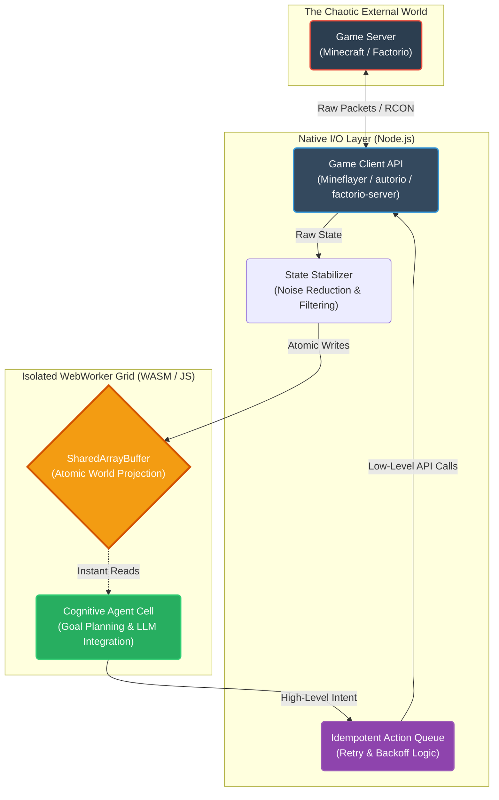

# Document 23: Ember Resilience in Gaming Agents - Mastering Chaos in Unpredictable Environments

## 1. Introduction: The Crucible of Unstructured Reality

The theoretical architectures of fault tolerance—Cellular Isolation (Doc 21), Reactive State Reconstruction (Doc 22), and Autonomous Bug Resistance (Doc 19)—are elegant in isolation. However, true resilience is only proven when the system interacts with chaotic, unpredictable, and inherently hostile external environments. For Project AIRI, and now Project Ember, the ultimate proving grounds are complex gaming environments like Minecraft and Factorio.

These environments are characterized by massive state spaces, non-deterministic physics, hostile entities (creepers, biters), and the inherent instability of network protocols (RCON, WebSocket streams, chunk rendering delays). A traditional bot executing a hardcoded script will fail instantly when a zombie unexpectedly blocks its path or a server lag spike drops an input command. 

Project Ember’s Gaming Agents are designed to be invulnerable to this chaos. This document details how Ember applies its mythic resilience protocols to ensure that its agents (like the Factorio Agent and Minecraft Agent) can survive server crashes, overcome unpredictable physical obstacles, and maintain goal coherence through extreme environmental noise.

## 2. The Agent Abstraction Layer: Severing the umbilical cord

The most critical mistake in designing game-playing AI is tightly coupling the cognitive logic (the LLM/brain) directly to the game's API (e.g., calling `mineflayer.bot.setControlState` directly from an LLM response parser). If the game server lags, the LLM parser blocks. If the bot is killed in-game, the cognitive state becomes hopelessly desynchronized.

### 2.1. The World-State Projection

Ember completely severs this connection. The Gaming Agent Cell (running in its isolated WebWorker) does not "see" the game. It sees a highly abstracted, stabilized "World-State Projection" provided by an intermediate layer.

1.  **The Sensory Collector (Native Node.js / Python):** This is a low-level process that connects directly to the game (e.g., via Mineflayer for Minecraft, or the Factorio RCON API). Its ONLY job is to ingest raw game data (blocks, entity positions, inventory) at high frequency.
2.  **The State Stabilizer:** The raw data is noisy. Entities flicker, chunks load slowly. The Stabilizer applies Kalman filters and debouncing to this data, creating a smooth, coherent representation of the environment.
3.  **The Projection Sync:** The stabilized state is synced to the WebWorker Grid via the `SharedArrayBuffer` (as detailed in Doc 21). 

The Agent Cell only reads from the `SharedArrayBuffer`. It never waits for a network response from the game server. This means the cognitive engine runs at a perfectly stable FPS, completely immune to game server lag or connection drops.

### 2.2. Diagram: The Decoupled Gaming Architecture

## 3. Handling Environmental Failure States

In a game, "failure" is the norm. Paths are blocked, resources run out, and enemies attack. Ember’s agents handle these not as exceptions, but as standard sensory input requiring goal recalculation.

### 3.1. The "Intent vs. Reality" Reconciliation Loop

When the Agent Cell decides to move from Point A to Point B, it emits an `Intent_Move` event. The Low-Level Client attempts to execute this.

However, a Creeper explodes, creating a massive crater in the path. 

1.  **Detection:** The Agent Cell continuously compares its `Intent` against the `World-State Projection` in the `SharedArrayBuffer`.
2.  **The Dissonance Trigger:** It notices that its X/Y coordinates have not changed towards the target for 3 seconds (or that its health dropped massively). The expected reality is dissonant with the projected reality.
3.  **The Interrupt:** The Agent Cell immediately aborts the `Intent_Move` sequence. It emits an `Anomaly_Detected` event.
4.  **Re-evaluation:** The Agent triggers the Neuro Core (LLM). It passes the *new* state (the crater, the missing health) and asks for a new plan. The LLM acts as the dynamic fallback for physical chaos, realizing it must now pathfind around the crater or heal.

This loop guarantees that the agent never gets "stuck" trying to walk into a wall or mindlessly executing a script that is no longer applicable to the physical reality of the game world.

### 3.2. Catastrophic Game Server Crashes

What happens if the Minecraft or Factorio server actually crashes or restarts?

1.  **Connection Loss:** The Low-Level Client throws a socket error.
2.  **Circuit Breaker:** The Action Queue trips its circuit breaker. Any further `Intent` commands from the Agent Cell are queued, not sent into the void.
3.  **State Freezing:** The State Stabilizer writes a specific flag to the `SharedArrayBuffer`: `WORLD_STATE_OFFLINE`.
4.  **Cognitive Hibernation:** The Agent Cell reads this flag. It stops requesting new LLM generations for game actions (saving API costs). It emits a `System_Hibernation` event and waits.
5.  **Reconnection:** The Low-Level Client constantly polls for reconnection (using exponential backoff). When the server comes back up, the `WORLD_STATE_OFFLINE` flag is cleared.
6.  **Context Re-anchoring:** The Agent Cell wakes up. It forces a complete refresh of the World-State Projection to ensure the server didn't rollback during the crash. It re-aligns its goals with the newly verified reality and resumes operation seamlessly.

## 4. The Factorio Paradigm: Dealing with Infinite Complexity

Factorio presents unique resilience challenges. The factory grows infinitely. The number of entities (belts, inserters, assemblers) scales into the millions. A monolithic state representation will crash any browser or Node process with Out-Of-Memory (OOM) errors.

### 4.1. Spatial Memory Chunking (The DuckDB Advantage)

Ember leverages the Memory Alaya (DuckDB WASM) to handle this massive scale. 

The Agent Cell does not keep the entire map in RAM. It relies on Spatial Chunking.
1.  The Low-Level Client streams map data into the L2 Episodic Ledger (Parquet files managed by DuckDB).
2.  When the Agent Cell needs to build a new smelting column, it queries DuckDB using spatial bounding boxes:
    `SELECT * FROM map_entities WHERE type = 'water' AND ST_Within(geometry, BoundingBox)`
3.  Because DuckDB is highly optimized for analytical queries over massive datasets, this query executes in milliseconds without loading the entire map into the V8 engine's heap memory.

This approach guarantees that the Ember agent can scale infinitely with the game world without ever crashing due to memory limits.

### 4.2. Blueprint Verification and Rollback

In Factorio, placing a complex blueprint can fail midway if the agent runs out of items or if a biter destroys a crucial power pole during construction.

Ember implements transactional building:
1.  **The Shadow Blueprint:** The agent plans the build in a local, isolated simulation matrix (a lightweight 2D array in WASM).
2.  **Execution:** It begins placing entities via the Action Queue.
3.  **Verification:** It constantly polls the `SharedArrayBuffer` to verify that the entities actually appear on the map.
4.  **Rollback:** If the build fails halfway (e.g., out of resources), the agent does not leave a half-finished, non-functional factory. It issues a massive "Deconstruct" command for the specific entities it just placed, rolling back the physical game world to its pristine pre-build state, and recalculates the resource requirements.

## 5. Conclusion of Document 23

Resilience in gaming is not about writing perfect pathfinding algorithms; it is about assuming that every algorithm will eventually fail due to external chaos. By strictly decoupling the cognitive cell from the game server, utilizing atomic state projections, and embracing continuous intent-reconciliation loops, Project Ember’s gaming agents achieve a level of robustness that transcends traditional bot programming. They do not merely survive the chaos of Minecraft or Factorio; they adapt to it in real-time, ensuring their goals are met regardless of the obstacles thrown their way.

Document 24, the final document, will synthesize all these architectures into the deployment strategy: The Mythic Vanguard Deployment.
