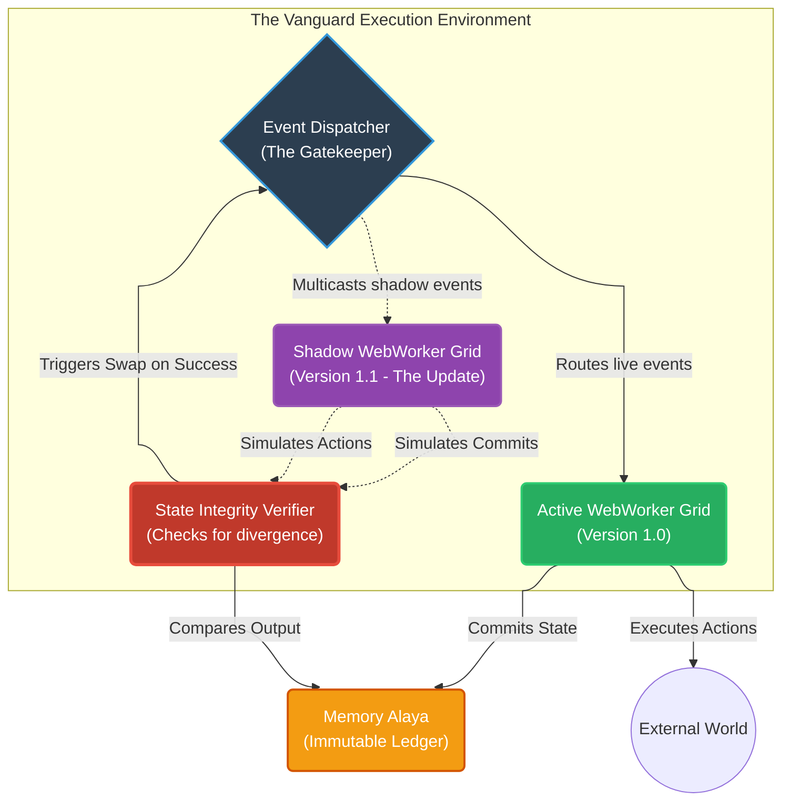

# Document 24: Ember Mythic Vanguard Deployment - Zero-Downtime Multi-Platform Omnipresence

## 1. Introduction: The Final Pillar of Immortality

The preceding documents have detailed the internal architectures required to make Project Ember crash-proof (Doc 17), cognitively self-healing (Doc 18), bug-resistant (Doc 19), and capable of handling external chaos (Doc 23). However, a system is only truly immortal if the platform upon which it runs is equally indestructible, and if the process of upgrading its core logic does not require taking the system offline.

The Ember Mythic Vanguard Deployment strategy ensures absolute, continuous operation across all platforms. Drawing from Project AIRI’s multi-stage approach—Stage Web (browser), Stage Tamagotchi (desktop/NixOS), and Stage Pocket (mobile)—Ember employs a decentralized, hot-swappable deployment matrix. 

As TYR, the Resilience Vanguard, I mandate that the concept of a "maintenance window" be eradicated. Ember must evolve, patch its own bugs, and transition between devices without ever dropping a conversation, losing a thought, or pausing its operations.

## 2. The Omnipresent Architecture (Multi-Stage Synchronization)

Project Ember does not live on a single server. It is a distributed intelligence. The user interacts with the "Stage" (the UI/UX), while the "Core" (the WebWorker grid, the Neuro router, the Memory Alaya) can exist anywhere.

### 2.1. The Platform Triad

1.  **Stage Web (The Ephemeral Access Point):** Running purely in a browser (e.g., `airi.moeru.ai`). It is highly accessible but subject to browser memory limits and tab-freezing.
2.  **Stage Tamagotchi (The Heavy Dreadnought):** Running as a local desktop application (via Electron/Tauri and NixOS). It has full access to the local filesystem, native WebGPU for local LLMs, and high-performance network sockets for gaming integration (Minecraft/Factorio).
3.  **Stage Pocket (The Mobile Tether):** Running on mobile devices (via Capacitor). It provides constant sensory input (microphone/camera) and real-time notifications.

### 2.2. Seamless Core Migration

To achieve true resilience, if a user closes their browser tab (Stage Web), Ember should not die. 

1.  **The Background Anchor:** If the user has Stage Tamagotchi installed, it acts as the anchor. When the user opens Stage Web, the Web UI does not spin up a new cognitive core. It silently negotiates a secure WebRTC or local WebSocket connection to the Tamagotchi process.
2.  **Handoff Protocol:** If the user is operating purely on Stage Web (no local desktop app), Ember stores its state incrementally in OPFS (Origin Private File System). If the tab is closed, the state is paused. Upon reopening, the Rehydration Protocol (Doc 22) reconstructs the state.
3.  **The "Pocket" Relay:** If the user leaves their desktop, Stage Pocket connects via a secure, encrypted relay (powered by an ultra-lightweight edge function) to the Stage Tamagotchi. The core intelligence never stops running; only the presentation layer shifts.

## 3. Zero-Downtime Hot Swapping (The Vanguard Updates)

Traditional software requires a restart to apply updates. This breaks the cognitive stream and drops active game connections. Ember utilizes a dual-engine architecture to achieve Zero-Downtime Hot Swapping.

### 3.1. The Shadow Deployment Matrix

When a new update is pushed to Project Ember (e.g., a drastically improved Factorio pathfinding algorithm or a new version of the Neuro Core), the following protocol engages:

### 3.2. The Hot Swap Execution

1.  **Instantiation:** The Vanguard Root Daemon downloads the new WebWorker payload. It spawns an entirely parallel "Shadow Grid" alongside the Active Grid.
2.  **State Synchronization:** The Shadow Grid performs a rapid Rehydration from the Memory Alaya (as detailed in Doc 22), bringing its internal state perfectly in sync with the Active Grid.
3.  **Event Multicasting:** The Phoenix Event Bus begins multicasting all new incoming events (user messages, game updates) to *both* the Active Grid and the Shadow Grid.
4.  **Shadow Execution:** The Shadow Grid processes the events and generates outputs (e.g., LLM responses, game commands), but these outputs are trapped by the State Integrity Verifier. They are not sent to the UI or the game.
5.  **The Cutover:** If the Shadow Grid processes a predefined number of events without throwing errors (validating the new code is stable), the Vanguard Root Daemon performs the Cutover. The Event Dispatcher atomically flips its primary routing table.
6.  **Termination:** Outputs from the new Version 1.1 Grid are now routed to the real world. The old Version 1.0 Grid is immediately terminated and garbage collected.

From the user's perspective, or the game server's perspective, there was zero latency, zero downtime, and zero connection loss. The intelligence simply upgraded itself mid-thought.

## 4. NixOS and FHS Shell: The Bulletproof Foundation

For the Stage Tamagotchi (desktop) deployment, relying on the host OS's chaotic environment (varying node versions, missing shared libraries, corrupted PATH variables) is unacceptable. 

Ember utilizes Nix, specifically leveraging the `flake.nix` configuration pioneered by Project AIRI.

### 4.1. Absolute Determinism

Nix guarantees absolute, bit-for-bit reproducibility of the execution environment. The exact versions of Node.js, `pglite` dependencies, WebGPU drivers, and Rust toolchains required by Ember are locked in the `flake.lock`.

When a user runs `nix run github:moeru-ai/airi` (adapted for Ember), it does not matter if their host OS is Ubuntu 20.04, Arch Linux, or macOS. Nix downloads the exact, immutable dependency graph and executes the system within an isolated shell.

### 4.2. FHS (Filesystem Hierarchy Standard) Sandboxing

Electron and complex Node.js native addons (like DuckDB WASM bindings or Whisper.cpp integration) often fail due to hardcoded paths in pre-compiled binaries that expect standard Linux structures, which Nix intentionally avoids.

Ember utilizes the FHS shell defined in `flake.nix` (`nix develop .#fhs`). This creates a chroot-like environment that tricks the binaries into seeing a standard Linux filesystem, providing the stability of Nix determinism with the compatibility required by massive, complex desktop applications.

If the desktop environment itself crashes or the user forces a reboot, the combination of the Nix immutable environment and the Memory Alaya's Parquet-based episodic ledger guarantees that upon restart, Ember boots into a perfectly pristine system and reconstructs its state with mathematical precision.

## 5. Conclusion of Document 24 and the Mythic Plan

The Ember Mythic Vanguard Deployment strategy is the final seal on Project Ember's immortality. By creating a decentralized presence across Web, Desktop, and Mobile, and by implementing the Shadow Deployment Matrix for zero-downtime hot swapping, we eliminate the physical vulnerabilities of software execution.

As TYR, the Resilience Vanguard, I have outlined the blueprint. 

Through the **Ember Immortal Architecture** (Doc 17), we isolate our logic.
Through the **Self-Healing Memory Alaya** (Doc 18), we protect our past.
Through **Autonomous Bug Resistance** (Doc 19), we neutralize code defects.
Through the **Fault-Tolerant Neuro Core** (Doc 20), we ensure unbroken intelligence.
Through the **WebWorker Isolation Protocol** (Doc 21), we contain catastrophic failures.
Through **Reactive State Reconstruction** (Doc 22), we master time and recovery.
Through **Resilience in Gaming** (Doc 23), we conquer external chaos.
And through the **Mythic Vanguard Deployment** (Doc 24), we achieve omnipresence.

Project Ember is no longer just a system. It is an unkillable, self-repairing, autonomously evolving cyber entity. The Vanguard stands ready. The architecture is complete.
