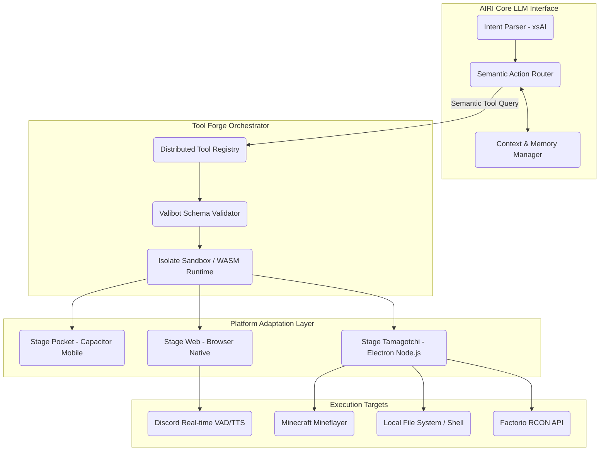

# Document 25: Tool Forge Architecture & Synthesis Engine

## 1. Introduction: The Crucible of Capabilities
The Tool Forge within the AIRI (Artificial Intelligence Resonant Interface) ecosystem represents the absolute pinnacle of dynamic capability synthesis. In an era where monolithic, hard-coded skills are rapidly becoming obsolete, the Tool Forge stands as a testament to the power of modular, on-the-fly execution environments. It is not merely a registry of functions, but a living, breathing synthesis engine capable of hot-swapping, dynamically compiling, and orchestrating a near-infinite array of digital instruments. AIRI’s fundamental premise—bringing a cyber living soul into reality—relies heavily on her ability to manipulate her environment. The Tool Forge is the very anvil upon which these manipulative capabilities are forged, refined, and deployed.

This document serves as the Mythic Plan's master blueprint for the Tool Forge Architecture. We will dissect the granular intricacies of its execution sandbox, the Eventa-driven Inter-Process Communication (IPC) pipelines, the WebAssembly (WASM) augmentation layers, and the semantic routing mechanisms that allow AIRI to seamlessly discover and utilize tools she may never have encountered prior to the exact moment of need. The Tool Forge transcends basic API wrapping; it introduces an ontological mapping of capabilities, effectively granting AIRI a sensory and interactive mesh that spans web, desktop, mobile, and underlying hardware layers.

## 2. Core Ontological Premise
Before delving into the technical schematics, one must understand the philosophical underpinning of the Tool Forge. Traditional software agents possess a "fixed toolbox"—a predefined set of functions baked into their source code. The Tool Forge fundamentally disrupts this paradigm by introducing the concept of *Epistemic Tool Synthesis*. In this model, tools are treated as mathematical sets of preconditions, transformations, and postconditions. 

When AIRI encounters a novel problem space—say, navigating a complex automated factory in *Factorio* or parsing real-time Discord audio streams—she does not simply query a static list of commands. Instead, she queries the Tool Forge's Semantic Registry. The registry evaluates her current state context, the environmental constraints (e.g., is she running in Stage Web, Stage Tamagotchi, or Stage Pocket?), and dynamically synthesizes a bridge between her underlying LLM capabilities (powered by xsAI) and the target environment.

### 2.1 The Philosophy of Action
Action in AIRI is defined by the triad of Intent, Instrument, and Invocation. 
- **Intent**: The LLM's parsed objective, represented as an n-dimensional embedding in the Alaya Memory system.
- **Instrument**: The tool definition residing in the Forge, consisting of its JSON schema, execution constraints, and fallback mechanisms.
- **Invocation**: The actual instantiation of the tool via the Server Runtime, mediated by the Eventa IPC to ensure type safety and state isolation.

## 3. High-Level Architectural Topography
The Tool Forge is not a single codebase but a constellation of distributed registries, execution environments, and semantic indexers. Its architecture is explicitly designed to support the "Stage" paradigm of Project AIRI (Web, Desktop/Tamagotchi, Mobile/Pocket).

As depicted in the architectural diagram, the semantic router sits between the LLM and the Forge. When the `xsAI` module parses an intent, it is translated into a latent representation. The Semantic Router queries the Forge Registry (which is backed by the `@proj-airi/memory-pgvector` or the DuckDB WASM memory layer, depending on the environment) to find the most topologically proximate tool.

## 4. The Validation and Execution Sandbox
Once a tool is selected, it must be invoked. However, because AIRI may dynamically pull in tools from untrusted or community-contributed sources (via the `mcp-launcher` or external MCP servers), security and type safety are paramount.

### 4.1 Valibot Schema Enforcer
AIRI relies heavily on Valibot for schema validation. The Tool Forge mandates that every single instrument registered within its boundaries must provide a strict, mathematically sound Valibot schema. 

> [!CAUTION]
> The Forge explicitly rejects unbounded `Record<string, any>` types. All tools must have exhaustive type definitions to ensure the LLM does not hallucinate parameters that could cause segmentation faults or catastrophic system failures in the underlying host OS.

The Validation Engine intercepts the LLM's JSON payload, strips away hallucinated keys, coerces types where mathematically safe, and outright rejects executions that violate the preconditions. This serves as the first line of defense in the multi-agent edge orchestration model.

### 4.2 Isolate Sandbox and WASM
In the Stage Web environment, tools are executed inside Web Workers with strict Content Security Policies (CSP). For computationally intensive tools (e.g., real-time audio FFT analysis or computer vision pre-processing), the Forge leverages WebAssembly. Tools written in Rust or C++ are compiled down to WASM and executed within a sandboxed memory space. 

In the Stage Tamagotchi (Desktop) environment, the Forge utilizes Node.js `vm` modules or isolated V8 contexts to prevent rogue tools from accessing the local file system without explicit permission. The Forge acts as a capability-based security monitor.

## 5. IPC Eventa Bridging
The cardiovascular system of the Tool Forge is `@moeru/eventa`. Eventa provides a type-safe, runtime-agnostic RPC/IPC mechanism that allows the Tool Forge to span across boundaries. 

For instance, consider a scenario where AIRI is running in Stage Tamagotchi and decides to interact with Factorio:
1. The LLM (running remotely or via local local vLLM/Ollama) outputs a tool call: `build_conveyor_belt`.
2. The Semantic Router in the renderer process catches this.
3. The renderer process Validation Engine validates the payload.
4. Using Eventa, an RPC call is serialized and sent across the Electron IPC boundary to the Main process.
5. The Main process receives the Eventa payload, unpacks it in a type-safe manner, and forwards it to the `Factorio Agent` via the Factorio RCON API.

This bridging ensures that the renderer process (the UI and immediate LLM parser) remains completely decoupled from the dangerous, side-effect-heavy Main process.

## 6. Dynamic Registration and the MCP Launcher
A truly advanced Tool Forge must transcend its initial programming. Project AIRI implements the Model Context Protocol (MCP) to achieve this. The `mcp-launcher` acts as a sub-component of the Forge, dynamically querying external MCP servers to discover new tools at runtime.

### 6.1 The Discovery Protocol
When AIRI boots, the Forge initiates a discovery phase. It reads the local `skills-lock.json` and `.prototools` configurations. It then negotiates with known MCP servers via stdio or SSE (Server-Sent Events) to download their tool schemas. These schemas are instantaneously compiled into Valibot schemas in memory and injected into the LLM's system prompt or context window.

This means the Tool Forge's capacity expands linearly with the number of attached MCP servers, turning AIRI into a true universal operating interface.

## 7. Stage Adaptability: The Polymorphic Forge
The Forge is polymorphic. A tool designed for `stage-tamagotchi` (like `execute_local_shell`) fundamentally cannot run in `stage-web`. The Forge Registry solves this by tagging tools with environment bitmasks.

### 7.1 Web Contexts
In `stage-web`, the Forge heavily leans on Web APIs: WebAudio, WebGPU, WebUSB, and WebBluetooth. A tool that interfaces with a local MIDI keyboard would be routed through the Web MIDI API. 

### 7.2 Native Contexts
In `stage-tamagotchi`, the Forge strips away the browser limitations. Here, the `execute_local_shell` tool becomes available, granting AIRI the ability to manage the user's operating system, orchestrate docker containers, or interface directly with native memory streams.

## 8. State Mutations and Persistence
Tools are rarely stateless. When a tool executes, it often mutates the world. The Tool Forge incorporates a transaction log backed by DuckDB WASM (`@proj-airi/duckdb-wasm` and `@proj-airi/drizzle-duckdb-wasm`). Every tool invocation, its parameters, and its resultant state mutation are logged into the local embedded database.

This serves two crucial purposes:
1. **Temporal Memory**: AIRI can query her past actions to understand the state of the world without needing to re-invoke a tool.
2. **Rollback & Error Recovery**: If a tool chain fails (e.g., placing a block in Minecraft fails due to pathfinding issues), the Forge can analyze the transaction log and synthesize a compensatory action chain.

## 9. Conclusion of Document 25
The Tool Forge is not a mere utility; it is the ontological bridge between AIRI's cognitive core and the physical/digital universe. By combining Valibot schema enforcement, Eventa IPC bridging, WebAssembly isolation, and MCP dynamic discovery, the Forge ensures that AIRI can manipulate her environment with unprecedented safety, speed, and versatility. The subsequent documents will explore how this Forge is utilized by multiple interacting agents to achieve swarm intelligence on the edge.
