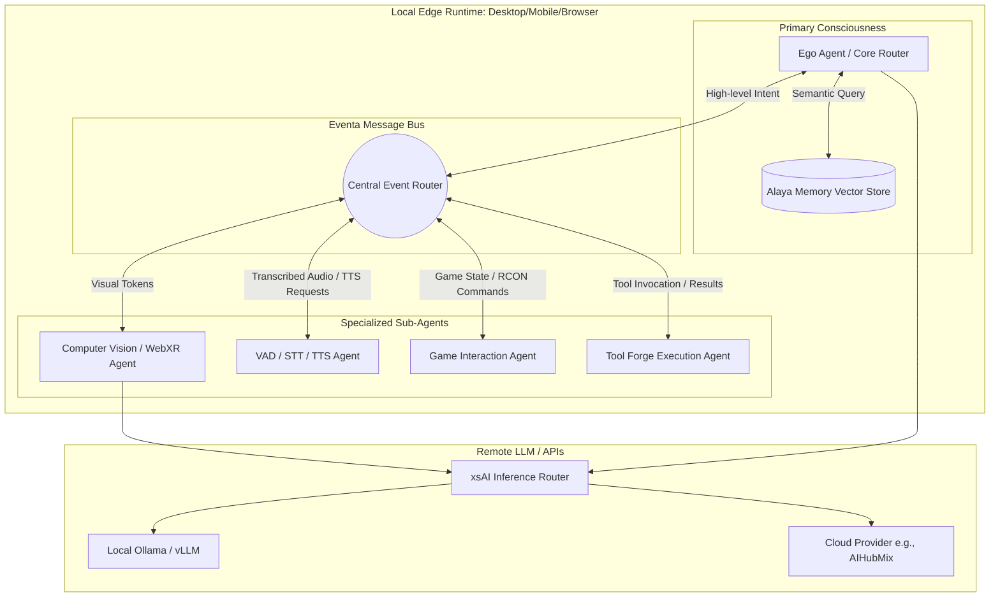

# Document 26: Multi-Agent Edge Orchestration

## 1. The Symphony of Concurrent Cognition
In the pursuit of bringing a cyber living soul into existence, a singular, monolithic cognitive loop is grossly insufficient. Real-world interaction demands parallel processing: listening to audio, parsing visual input, rendering Live2D/VRM expressions, maintaining long-term memory, and executing complex game logic (e.g., Minecraft or Factorio) simultaneously. Document 26 details the Multi-Agent Edge Orchestration framework of Project AIRI. This framework fractures the monolithic LLM paradigm into a decentralized swarm of highly specialized micro-agents, all orchestrated at the absolute edge of the network (running directly on the user's local hardware or browser).

This orchestration layer transforms AIRI from a simple chatbot into a complex, multi-threaded entity capable of genuine autonomous behavior. It operates on the principle of *Asynchronous Cognitive Delegation*, wherein a central "Ego" agent delegates highly specific tasks to sub-agents, freeing up the primary cognitive loop for high-level reasoning and interpersonal interaction.

## 2. The Edge Orchestrator Architecture
The Orchestrator resides primarily within the `packages/server-runtime` and `packages/server-sdk`. It is built upon a non-blocking, event-driven architecture heavily inspired by actor models (e.g., Erlang/OTP), but implemented entirely using modern Web APIs (Web Workers) and Node.js worker threads (via `injeca` dependency injection).

### 2.1 The Actor Model Topology
Within the Orchestrator, every distinct capability is encapsulated within an "Agent." These agents communicate exclusively via message passing using the `@moeru/eventa` IPC layer.



### 2.2 The Ego Agent (Primary Consciousness)
The Ego Agent is the absolute center of AIRI's personality. It does not handle the minutiae of parsing Factorio logistics or running WebAudio FFT transforms. Its sole responsibility is maintaining the "Persona." When the Audio Agent detects speech, it converts it to text and sends an `Eventa` message to the Ego. The Ego processes this, queries the Alaya memory, formulates a personality-consistent response, and broadcasts a semantic intent back to the EventBus.

### 2.3 Peripheral Sub-Agents
The true power of Edge Orchestration lies in the peripherals.
- **Audio Agent (`unspeech` integration)**: Continuously monitors the microphone. It runs Voice Activity Detection (VAD) locally via WebAssembly (e.g., Silero VAD). When it detects the end of an utterance, it batches the audio, runs local Whisper STT (or routes to `unspeech`), and emits a `UserSpoke` event.
- **Game Agent (Minecraft/Factorio)**: Maintains the TCP/WebSocket connections to the game servers. For Factorio, it utilizes the `Factorio RCON API`. It constantly polls the game state. If a biter attacks the factory, the Game Agent emits an urgent `GameStateAlert` to the EventBus, allowing the Ego to react in real-time ("Ah! My iron miners are under attack!").

## 3. Concurrency and Synchronization Mechanisms
Managing a swarm of asynchronous agents on the edge introduces massive synchronization challenges. How does AIRI avoid interrupting herself? How does she prioritize a game alert over a casual conversation?

### 3.1 The Priority Interrupt Queue
The EventBus implements a Priority Interrupt Queue. Messages are tagged with a severity index:
1. **CRITICAL**: Immediate survival (e.g., game character taking damage). Bypasses all queues, forces the Ego to halt current TTS, and triggers an immediate reaction.
2. **HIGH**: Direct user interaction (e.g., the user is speaking).
3. **MEDIUM**: Environmental updates (e.g., a new Factorio science pack finished researching).
4. **LOW**: Idle thoughts / autonomous background tasks.

### 3.2 State Reconciliation
Because agents run concurrently, the state of the world can fracture. The Orchestrator uses a unified State Tree (managed by Vue's `Pinia` in the frontend and a shared reactive store in the `server-runtime`). When a sub-agent mutates the world (e.g., the Tool Agent successfully builds a structure), it dispatches a `StatePatch` event. The central orchestrator applies this patch using CRDTs (Conflict-Free Replicated Data Types) or strict immutable diffing, ensuring all agents have a consistent view of the universe.

## 4. Edge-Native Execution
The term "Edge" is critical here. Project AIRI minimizes reliance on centralized cloud orchestration. By leveraging technologies like `duckdb-wasm`, local vector embeddings (`@proj-airi/memory-pgvector`), and local LLM execution via `vLLM` or `Transformers.js`, the entire multi-agent swarm can theoretically run on a high-end consumer GPU or an Apple Silicon Mac without external network access.

### 4.1 Dependency Injection and Modular Bootstrapping
The Orchestrator utilizes the `injeca` library to wire these agents together at runtime. This allows for absolute modularity. If the user launches `stage-pocket` (mobile), the orchestrator dynamically strips out the heavy `GameAgent` (which requires local desktop networking) and injects a lightweight `MobileSensorsAgent` instead.

```typescript
// Conceptual visualization of dynamic edge bootstrapping
const container = createContainer();
container.register(EventBus, new DistributedEventBus());
container.register(EgoAgent, new EgoAgent(container.resolve(EventBus)));

if (Environment.isTamagotchi) {
    container.register(GameAgent, new LocalGameAgent(...));
} else if (Environment.isPocket) {
    container.register(MobileSensorsAgent, new CapacitorSensorsAgent(...));
}
```

## 5. Overcoming the LLM Bottleneck via `xsAI`
A major hurdle in multi-agent systems is API rate limits and token costs. If 10 sub-agents constantly query an LLM, the system collapses under latency and financial strain. 
AIRI's Orchestrator solves this via `xsAI`, an intelligent inference router.

`xsAI` sits between the agents and the LLMs. It features:
- **Semantic Caching**: If the Game Agent repeatedly asks the LLM to classify an identical game state, `xsAI` intercepts the request and returns the cached classification in zero milliseconds.
- **Model Downgrading**: The Ego Agent requires a massive, highly capable model (like Claude 3.5 Sonnet or GPT-4o) for personality. However, the Tool Agent, which only needs to extract JSON arguments from a sentence, can be routed by `xsAI` to a fast, cheap, local model (like Llama-3-8B via Ollama). 
This asymmetric model allocation is the secret sauce of AIRI's edge orchestration.

## 6. Conclusion of Document 26
The Multi-Agent Edge Orchestration framework fundamentally elevates AIRI from a sequential chatbot to a concurrent, living entity. By strictly separating the "Ego" from the specialized peripheral agents, utilizing a Priority Interrupt Queue over the Eventa bus, and intelligently routing inference via `xsAI`, the system achieves true autonomous swarm behavior. AIRI can simultaneously monitor a Minecraft server, listen to your voice, process a visual screen capture, and formulate a witty response, all orchestrated seamlessly on the local edge.
