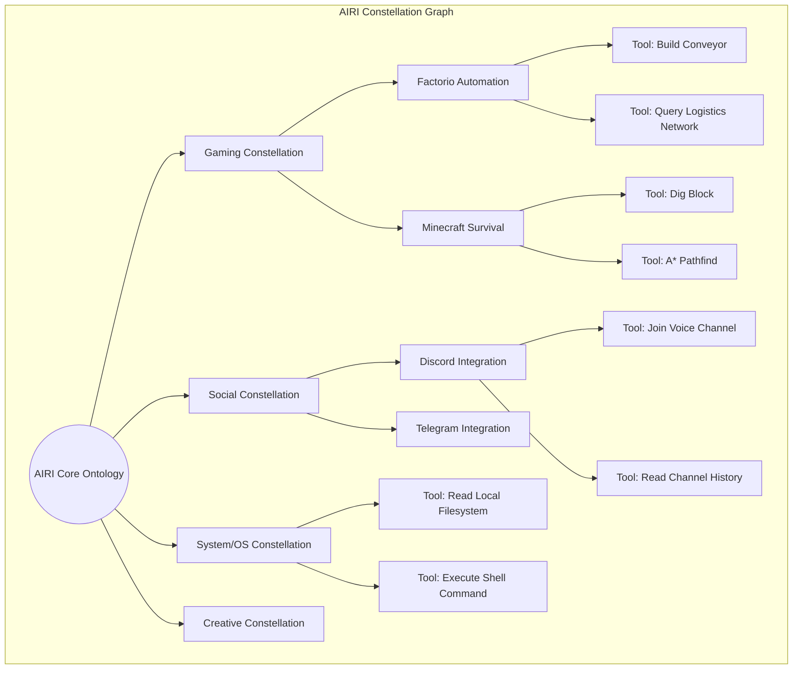

# Document 27: Skill Constellations and Dynamic Grouping

## 1. Introduction: The Ontology of Cybernetic Abilities
In the architecture of Project AIRI, a "tool" or a "skill" is not an isolated function. To construct a cyber living soul, capabilities must be contextualized, interrelated, and dynamically grouped based on the environmental requirements. A soul does not randomly possess the ability to "query PostgreSQL" while playing Minecraft; abilities are clustered into coherent mental models. We define these clustered models as **Skill Constellations**.

Document 27 maps the conceptual and technical implementation of Skill Constellations within the AIRI Mythic Plan. It details how the Tool Forge groups related abilities, how these constellations are loaded dynamically to fit within LLM context windows, and the ontological graphing that allows AIRI to intuitively "know" which constellation to activate.

## 2. The Context Window Constraint
The fundamental limitation of modern LLMs is the context window. While models like Claude offer 200K+ tokens, stuffing every possible tool (Factorio RCON API, Minecraft Mineflayer, WebSearch, File I/O, Discord Audio, etc.) into the system prompt simultaneously is highly inefficient. It dilutes the model's attention, increases latency, and skyrockets inference costs.

Skill Constellations solve this. A Constellation is a semantic grouping of tightly coupled tools. AIRI's Ego Agent maintains a "macro-awareness" of available Constellations but only loads the micro-tools into the immediate context window when a Constellation is actively "equipped."

### 2.1 The Metaphor of the Toolbelt
Imagine a human mechanic. They know they own a wrench, a blowtorch, and a multimeter (macro-awareness). However, they only carry the wrench in their physical hand (immediate context) when working on a pipe. If they switch to electrical work, they put the wrench away and equip the multimeter.

In AIRI:
- **Macro-Awareness**: A lightweight list of available Constellations (e.g., `["Gaming:Factorio", "Social:Discord", "System:FileIO"]`).
- **Immediate Context**: The exhaustive Valibot JSON schemas of the specific tools inside the currently equipped Constellation.

## 3. Topography of the Constellations
The Tool Forge organizes skills into several primary Constellations. Each Constellation is defined by a `plugin.json` or managed dynamically via the MCP (Model Context Protocol).

## 4. The Activation and Deactivation Lifecycle
How does AIRI know when to switch Constellations? The semantic routing engine manages this lifecycle.

1. **Environmental Triggers**: When `stage-tamagotchi` detects that the process `factorio.exe` has launched, the Orchestrator emits an `EnvironmentChange` event. The Semantic Router immediately pre-loads the `Gaming:Factorio` Constellation.
2. **LLM Intent Triggers**: If a user says, "Can you check my downloads folder?", the Ego Agent recognizes it lacks the required tools in its current context. It emits a meta-tool call: `equip_constellation("System:FileIO")`. The Orchestrator halts the inference, modifies the system prompt to inject the `System:FileIO` JSON schemas, and resumes inference.
3. **Garbage Collection**: To prevent context bloat, Constellations have an LRU (Least Recently Used) cache mechanism. If AIRI has not interacted with Factorio for 30 minutes, the Constellation is gracefully unloaded from the immediate prompt.

## 5. Ontological Mapping and the Vector Database
Skill Constellations are not rigid, hardcoded lists. They are stored in the `Memory Alaya` using `@proj-airi/memory-pgvector` (or `duckdb-wasm`). Every tool possesses a dense vector embedding of its description and purpose.

When a highly ambiguous request is made—e.g., "Help me automate the extraction of copper"—the Semantic Router performs a k-NN (k-Nearest Neighbors) search against the Tool Forge. It might discover that the `Tool_BuildBelt` from Factorio and `Tool_ReadFS` from the System Constellation are mathematically close to the intent. It then synthesizes a *Bespoke Constellation* on the fly, tailoring the exact toolset to the immediate micro-task.

## 6. Community and MCP Expansion
The true beauty of the Constellation system lies in its extensibility. Through the `mcp-launcher`, community developers can build entirely new Constellations. If a developer creates a "Web3 Crypto Trading" MCP server, it is ingested into the Tool Forge not as a chaotic pile of functions, but as a neatly packaged `Finance:Web3` Constellation. 

By grouping skills hierarchically and dynamically injecting them via semantic vector search, AIRI achieves boundless capability expansion without collapsing under the weight of LLM context limits.
