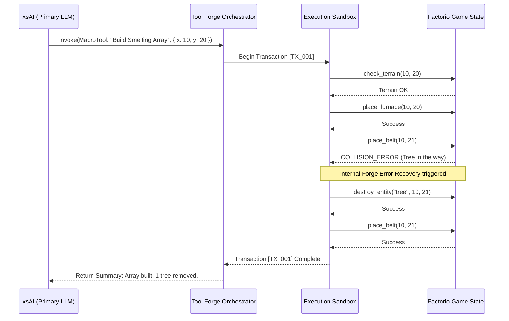

# Document 29: Advanced Tool Forge Workflows

## 1. Introduction: Beyond Atomic Tool Invocation
The foundational architecture of the Tool Forge (detailed in Document 25) establishes how individual tools are discovered, validated, and safely executed across AIRI's tri-stage environments. However, real-world autonomy requires more than atomic, isolated function calls. To truly act as a cyber living soul, AIRI must string together complex sequences of actions, gracefully recover from physical and digital errors, and synthesize multi-step plans without requiring continuous LLM prompting for every single micro-step.

Document 29 explores Advanced Tool Forge Workflows. We will dissect transactional chaining, pipelined data flows, automated error compensation via the Forge's heuristic engine, and the role of `xsAI` in dynamically selecting the optimal model for intermediate computational steps.

## 2. Transactional Tool Chaining
When AIRI interacts with a high-friction environment—such as the Factorio RCON API or a native OS filesystem—actions are rarely successful in isolation. If she wants to "Build an Iron Smelting Array," this intent breaks down into dozens of specific API calls.

If the Tool Forge merely exposed atomic tools (e.g., `place_belt`, `place_furnace`), the LLM would be trapped in an endless, expensive cycle of `call -> wait -> prompt -> call -> wait`.

### 2.1 The Concept of the Workflow Pipeline
Instead, the Tool Forge supports Workflows—composite macros that chain multiple tool executions locally, within the Orchestrator, bypassing the need to round-trip to the cloud LLM.

By encapsulating the iterative loop inside the execution sandbox (written in TypeScript/Rust), the Forge drastically reduces latency. The LLM acts as the architect, while the Forge acts as the general contractor.

## 3. Pipelining Data Between Tools
In many scenarios, the output of one tool must seamlessly flow into the input of another, often involving data too large for an LLM context window (e.g., passing a 4K image array to an OCR tool, and then passing the text string to a semantic classifier).

### 3.1 The Shared Memory Register
The Tool Forge implements a Shared Memory Register using `ArrayBuffer` and `SharedArrayBuffer` for Web Workers, and local IPC pipes for the Electron backend.
When an LLM invokes a pipeline, it does not receive the raw binary data. Instead, it receives a pointer (a UUID).

1. **Tool A** (`Capture Screen`) takes a screenshot. It stores the 15MB PNG in the Shared Memory Register and returns `PTR_12345` to the LLM.
2. **Tool B** (`Extract Text`) is invoked by the LLM with `{"image_ref": "PTR_12345"}`. Tool B reads the memory, extracts the text, and returns the string to the LLM.

This pointer-based workflow prevents the LLM context window from being flooded with base64 encoded images, maintaining blazing-fast inference speeds.

## 4. Heuristic Error Recovery and Fallbacks
The world is chaotic. File paths change, network sockets drop, and biters destroy Factorio belts. A brittle AI halts and crashes; a resilient AI adapts.

### 4.1 The Retry and Backoff Engine
Built natively into the Forge is a generalized retry engine. If a tool invocation fails due to a transient error (e.g., `ECONNRESET`), the Forge will automatically apply an exponential backoff algorithm before surfacing the error to the LLM.

### 4.2 Semantic Fallbacks via `xsAI`
If a tool fails deterministically (e.g., `CommandNotFound`), the Forge utilizes a secondary, lightweight LLM (via `xsAI` routing) to attempt an automated fix.
For example, if `execute_shell("ls -la /sys/class")` fails on Windows, the Forge's internal recovery LLM catches the OS mismatch, rewrites the command to PowerShell `Get-ChildItem`, and re-executes. The Primary Ego LLM never even knows an error occurred; it simply receives the correct directory listing.

## 5. Auto-Generation of Tools (Skill Synthesis)
The pinnacle of the Forge's advanced workflow capabilities is the ability for AIRI to write her own tools.
If AIRI encounters a highly repetitive task that requires 50 LLM inferences to complete, she can use the `forge_synthesize_tool` capability. 
1. The Ego LLM writes a TypeScript implementation of the repetitive macro.
2. The code is passed to the Forge.
3. The Forge compiles the TypeScript via `esbuild` or `swc` into a standalone WASM module or isolated V8 script.
4. The new tool is injected into the Semantic Registry on the fly.
5. Future invocations of this task are handled by the newly synthesized native code, reducing execution time from 40 seconds to 2 milliseconds.

## 6. Conclusion of Document 29
The Advanced Tool Forge Workflows elevate AIRI from a simple reactive chatbot to a proactive, highly efficient autonomous agent. By utilizing transactional chaining, shared memory pointer pipelining, and semantic error recovery, the Tool Forge drastically reduces the cognitive load on the primary LLM. The system's ability to synthesize and compile its own tools at runtime represents the bleeding edge of recursive self-improvement in edge-based AI architectures.
