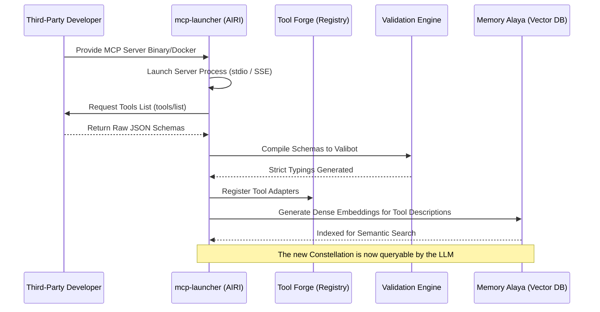

# Document 31: Dynamic Skill Constellation Expansion

## 1. Introduction: The Infinite Horizon of Capability
A static agent is a dead agent. The core philosophy of Project AIRI is that her cyber living soul must grow, adapt, and learn. While the Tool Forge (Document 25) and Skill Constellations (Document 27) provide the foundational architecture for managing known abilities, they do not inherently solve the problem of acquiring *new* ones. How does AIRI learn to trade cryptocurrencies, control smart home appliances, or query a newly released biological database without requiring a core codebase update?

Document 31 outlines the Dynamic Skill Constellation Expansion system. This system is heavily predicated on the **Model Context Protocol (MCP)** and the custom `mcp-launcher` built specifically for Project AIRI. We will detail how third-party skills are discovered, mathematically validated, semantically indexed, and seamlessly integrated into the active Constellation Graph at runtime.

## 2. The Model Context Protocol (MCP) Integration
The MCP is an emerging standard for providing language models with standardized access to context, tools, and prompts. AIRI adopts this protocol as the primary vector for external skill expansion. 

### 2.1 The `mcp-launcher` Subsystem
Located alongside the core repository, the `mcp-launcher` is a dedicated rust/node hybrid process manager. It acts as the gatekeeper and translator between external MCP servers and the internal Tool Forge.

When an external MCP server is added to the `skills-lock.json` or `.prototools` configuration, the `mcp-launcher` boots the server. It queries the server for its available tools via the standard `tools/list` JSON-RPC method. 

## 3. Sandboxing and The Translation Layer
External MCP servers are fundamentally untrusted. A poorly written third-party tool could crash the Node.js event loop or hallucinate corrupted data.

### 3.1 Strict Valibot Compilation
When the `mcp-launcher` receives the raw JSON Schema from the external server, it dynamically compiles it into strict Valibot schemas at runtime. If the external server uses dangerous types (e.g., `additionalProperties: true` without constraint), the Validation Engine outright rejects the tool or strictly caps the nesting depth to prevent stack overflows during validation.

### 3.2 The Adapter Pattern
The internal Tool Forge does not speak native MCP JSON-RPC to the LLM. The `mcp-launcher` generates a shim—an adapter function. When the LLM (via `xsAI`) decides to call the new tool, it calls the local Forge adapter. The adapter validates the parameters via Valibot, serializes the request, sends the JSON-RPC call over `stdio` to the isolated MCP server process, awaits the response, and translates it back into the Forge's expected format.

## 4. Semantic Embedding and Constellation Integration
Simply having a tool registered in the Forge is useless if the LLM doesn't know when to use it. Injecting 500 new tools into the system prompt destroys the context window.

### 4.1 Automated Ontology Generation
When the `mcp-launcher` ingests a new MCP server, it triggers an automated ontology generation phase. 
1. It passes the descriptions of all newly discovered tools to a cheap, fast local embedding model (e.g., `all-MiniLM-L6-v2` via Transformers.js).
2. It generates a 384-dimensional dense vector representing the semantic purpose of the toolset.
3. It inserts these vectors into the `Memory Alaya` (powered by `@proj-airi/memory-pgvector` or `duckdb-wasm`).

### 4.2 Dynamic Equip
If the user says, "AIRI, turn off the living room lights," the Semantic Router parses the intent. It searches the vector database. It finds that the semantic vector for this request strongly aligns with the newly ingested "SmartHome_IoT" MCP server. 
The Orchestrator dynamically constructs a temporary Constellation containing the IoT tools and injects them into the LLM's active context window. 

## 5. Security and Capability Permissions
Because AIRI operates on the Edge and has raw OS access via Stage Tamagotchi, downloading random MCPs is akin to downloading malware. 

### 5.1 The Capability Manifest
Every external Constellation must declare a Capability Manifest. Does it need internet access? Does it need local file system access? The `mcp-launcher` utilizes OS-level sandboxing (e.g., running the MCP server in a restricted Docker container or an isolated Nix shell with restricted `cgroups`). The user must explicitly grant these permissions via the Stage UI before the Constellation is activated.

## 6. Conclusion of Document 31
The Dynamic Skill Constellation Expansion architecture transforms AIRI from a closed-loop system into an infinitely expandable ecosystem. By leveraging the standardized Model Context Protocol, compiling strict Valibot schemas on the fly, and utilizing dense vector embeddings for semantic discovery, AIRI can acquire and utilize third-party capabilities instantaneously, ensuring her soul remains endlessly adaptable to an ever-changing digital landscape.
