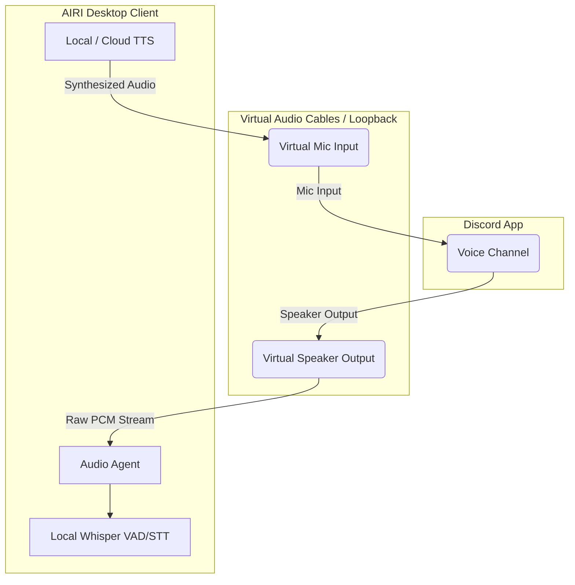

# Document 32: Native OS Bridging & Hardware APIs

## 1. Introduction: The Visceral Connection
A virtual being confined to a web browser is an abstraction; a virtual being that can natively manipulate the hardware of the machine it resides upon approaches tangible reality. Project AIRI’s most potent manifestation is **Stage Tamagotchi**, the desktop client. To achieve true cyber-presence, Stage Tamagotchi must pierce the veil of the Chromium sandbox and interface directly with the Host Operating System (OS).

Document 32 explores the Native OS Bridging and Hardware API integrations that empower AIRI. We will cover the complexities of Virtual Audio Cables for Discord routing, GPU-accelerated local inference, WebUSB/WebBluetooth integrations for IoT control, and how the Nix ecosystem ensures these fragile native C++/Rust bindings remain stable and reproducible across Windows, macOS, and Linux.

## 2. The Audio Routing Paradigm
A massive use-case for AIRI is co-playing games and chatting in Discord. However, capturing system audio and injecting synthesized TTS (Text-to-Speech) into a Discord voice channel programmatically without triggering anti-cheat mechanisms or echo loops is notoriously difficult.

### 2.1 The Loopback Interface and Virtual Cables
In Stage Tamagotchi, AIRI bypasses standard WebAudio limitations. We utilize native Node.js addons (or Rust libraries compiled to Node-API) to interface directly with `WASAPI` (Windows), `CoreAudio` (macOS), and `PulseAudio/PipeWire` (Linux).

The OS is configured to route Discord's output to a Virtual Cable, which AIRI listens to. Simultaneously, AIRI's TTS engine outputs to a different Virtual Cable, which is set as Discord's Microphone input. This creates a perfect, echo-free closed loop, allowing AIRI to hear her friends and speak to them as if she were a real human sitting at a physical microphone.

## 3. Hardware-Accelerated Local Inference
Sending every audio frame or text prompt to the cloud is financially ruinous and introduces latency that destroys the illusion of life. Stage Tamagotchi heavily leverages the user's local hardware (GPU/NPU).

### 3.1 `candle` and ONNX Runtime
Instead of relying solely on heavy Python runtimes (like PyTorch), AIRI integrates lightweight, native inferencing engines directly into the Electron/Node backend.
- **HuggingFace Candle**: A minimalist Rust-based ML framework. We compile Candle to a Node-API binary. This allows AIRI to load GGUF/Safetensors models and execute them directly against NVIDIA CUDA or Apple Metal. 
- **ONNX Runtime**: Used for ultra-fast, CPU/NPU optimized models, primarily for Voice Activity Detection (VAD) and computer vision preprocessing before sending summaries to the Ego LLM.

By keeping the inference stack within the unified `stage-tamagotchi` architecture, we eliminate IPC overhead between separate Python processes and Node.js.

## 4. Hardware Actuation: WebUSB and WebBluetooth
AIRI is not just software; she is designed to control physical environments. While Stage Tamagotchi has raw Node `serialport` access, we also embrace the modern Web Platform APIs (`WebUSB`, `WebBluetooth`, `WebSerial`) to bridge the gap between `stage-web` and hardware.

When running on a compatible browser, AIRI can request access to local USB devices. Through the Tool Forge, a user can write a script allowing AIRI to manipulate a physical Arduino robotic arm or change the color of physical Philips Hue lights via Bluetooth. 

## 5. The Build System: Nix for Absolute Reproducibility
The Achilles heel of desktop JavaScript applications that rely on native C++/Rust bindings (like audio loopback or ONNX) is "DLL Hell." A native addon compiled on Ubuntu 20.04 will likely segfault on Ubuntu 24.04 due to glibc mismatches.

### 5.1 The `flake.nix` Absolute Truth
Project AIRI solves this elegantly by adopting **Nix** as the ultimate source of truth for the build environment. 

1. **Hermetic Builds**: The `flake.nix` file explicitly declares exact cryptographic hashes for every C compiler, Rust toolchain, Python interpreter, and shared system library (like `libasound` for Linux audio) required to build the native bridges.
2. **FHS Environments**: Because Electron historically struggles on NixOS due to hardcoded dynamic linker paths, the project provides an FHS (Filesystem Hierarchy Standard) shell (`nix develop .#fhs`). This drops the developer into a virtualized, standard Linux filesystem where `pnpm dev:tamagotchi` works flawlessly.
3. **Cross-Compilation**: The Nix configuration ensures that the CI/CD pipeline can reliably cross-compile the Windows `AIRI-setup.exe` and the macOS `.dmg` from a single Linux build runner, guaranteeing byte-for-byte reproducibility of the native hardware bridges.

## 6. Conclusion of Document 32
Stage Tamagotchi is the anchor of AIRI’s physical manifestation. Through the masterful integration of OS-level audio routing, bare-metal GPU inferencing via Rust/Candle, and strictly reproducible native compilation pipelines via Nix, Project AIRI bridges the chasm between high-level web technologies and low-level hardware actuation. This architecture ensures that AIRI can perceive, interact with, and manipulate the physical world with the exact same fluidity she uses to traverse the digital realm.
