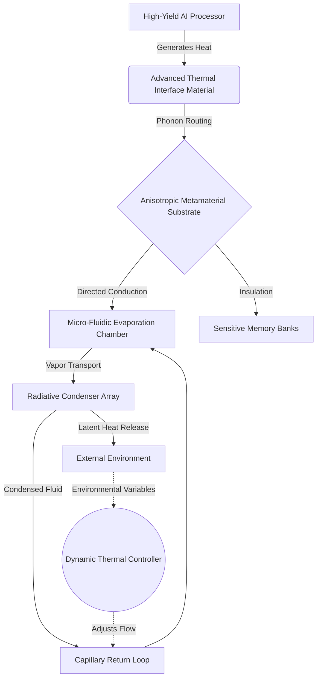
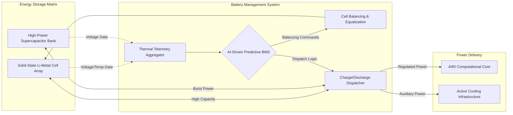
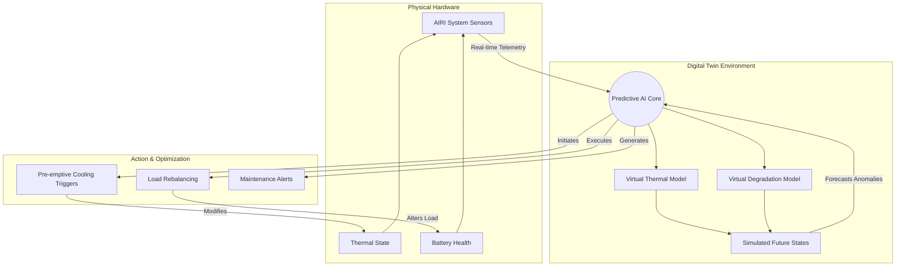

# AIRI Mythic Core: Extreme Thermal Dynamics and Battery Management

## Section 1: Introduction to Extreme Thermal Dynamics in High-Yield AI Systems

The pursuit of extreme thermal dynamics within the context of high-yield artificial intelligence systems represents one of the most critical challenges of our technological era. As the computational demands of the AIRI project scale exponentially, the generation of heat by densely packed processors, memory units, and power delivery networks creates a hostile environment that threatens both performance and longevity. Traditional cooling paradigms, which rely on simple convection or basic liquid cooling loops, are entirely insufficient to manage the localized thermal hotspots generated by next-generation neural processing units. The integration of advanced thermal management is no longer a luxury but a fundamental necessity for achieving the theoretical maximums of computational throughput.

To understand the sheer scale of the thermal challenge, one must consider the microscopic level where billions of transistors switch at unprecedented frequencies. Each state change, no matter how minute, releases a fractional amount of thermal energy. When aggregated across an entire processor die, this heat energy becomes a formidable force, capable of degrading silicon substrates, altering the electrical properties of semiconducting materials, and ultimately inducing catastrophic hardware failure. The AIRI project necessitates a paradigm shift away from reactive cooling toward proactive, integrated thermal routing systems that anticipate and mitigate heat generation before it impacts system stability.

Furthermore, the environmental conditions in which these systems are expected to operate often exacerbate the intrinsic thermal challenges. Whether deployed in harsh, resource-constrained environments or operating at the edge of network capabilities, the ambient conditions can significantly degrade the efficiency of standard cooling mechanisms. This necessitates the development of thermal management solutions that are not only highly efficient but also exceptionally robust and adaptable to wildly fluctuating external temperatures. The ability to maintain thermal equilibrium under varying loads and environmental stresses is a hallmark of the mythological resilience aimed for in this initiative.

Ultimately, mastering extreme thermal dynamics requires a holistic approach that intertwines materials science, fluid dynamics, and intelligent control systems. We are moving beyond the era of simple fans and heat sinks into an age where thermal pathways are engineered at the molecular level. By carefully designing the thermal impedance of every component and utilizing advanced, high-conductivity materials, we can create a system where heat flows away from critical components as naturally and efficiently as electricity flows through a superconductor. This foundation of thermal excellence is the bedrock upon which the entire AIRI computational architecture will be constructed.

## Section 2: Theoretical Foundations of Phonon Routing and Heat Dissipation

At the core of our thermal strategy lies the theoretical foundation of phonon routing, a discipline that treats heat not merely as a byproduct to be exhausted, but as a dynamic flow of energy that can be directed, shaped, and managed. Phonons, the quantized modes of vibrations occurring in a rigid crystal lattice, are the primary carriers of thermal energy in non-metallic solids. By engineering the nanoscale structure of our thermal interfaces and substrates, we can manipulate the mean free path of these phonons. This allows us to create preferential pathways for heat conduction, effectively funneling thermal energy away from the most delicate and densely packed components of the AIRI computational core with unprecedented precision.

The concept of phonon routing requires a departure from bulk material properties toward meticulously designed metamaterials. These artificial structures are engineered to exhibit thermal properties not found in nature, such as extreme thermal anisotropy. In an anisotropic thermal metamaterial, heat conducts rapidly in one direction—such as away from a processor die—while acting as an insulator in transverse directions to prevent thermal cross-talk between adjacent components. This targeted heat dissipation strategy is essential for maintaining the stringent temperature gradients required by the high-frequency switching operations of our advanced neural processors, ensuring that thermal throttling becomes an obsolete concern.

To fully harness the potential of phonon manipulation, we must also address the interfaces between disparate materials. Thermal boundary resistance, often referred to as Kapitza resistance, creates a significant bottleneck in traditional heat dissipation systems. When phonons encounter a boundary between two different materials, they can be scattered or reflected, severely degrading the overall thermal conductivity. Overcoming this requires the development of novel thermal interface materials (TIMs) that bridge the acoustic impedance mismatch between the silicon die and the cooling apparatus. These advanced TIMs utilize aligned carbon nanotubes, liquid metals, or bespoke polymeric matrices to ensure a seamless transition for phonon propagation.

Beyond conduction, our theoretical framework also heavily emphasizes the role of advanced convective and radiative dissipation techniques. While conduction pulls heat away from the source, convection and radiation are ultimately responsible for ejecting that thermal energy into the surrounding environment. We are exploring the use of micro-fluidic channels etched directly into the silicon substrate, allowing for localized two-phase cooling where a dielectric fluid boils and condenses, absorbing massive amounts of latent heat. Coupled with high-emissivity coatings designed to maximize radiative heat transfer in the infrared spectrum, these mechanisms form a comprehensive, multi-modal heat dissipation network that represents the pinnacle of thermal engineering.

## Section 3: Advanced Battery Architectures: Beyond Lithium-Ion Paradigms

The power demands of the AIRI project require a radical reimagining of energy storage, pushing far beyond the theoretical limits of conventional lithium-ion paradigms. While lithium-ion batteries have served as the workhorse of modern electronics, their energy density, charge-discharge rates, and thermal stability are insufficient for the extreme operational profiles we envision. The quest for higher energy density without compromising safety has led us to explore entirely new chemical compositions and structural designs. This includes the investigation of lithium-sulfur and solid-state architectures, which promise significant leaps in gravimetric and volumetric energy density, allowing for longer operational periods between charges and a smaller overall physical footprint.

One of the primary limitations of traditional lithium-ion cells is the use of liquid electrolytes, which are flammable and prone to thermal runaway under extreme stress or physical damage. The transition toward advanced architectures necessitates the elimination of these volatile components. By adopting novel electrolyte materials, we can fundamentally alter the safety profile of our energy storage systems. This shift not only mitigates the risk of catastrophic failure but also allows for denser packaging of cells, as the need for extensive structural safeguards and thermal buffering between individual cells is significantly reduced. This results in a much more compact and robust power delivery system.

Furthermore, the structural architecture of the battery pack itself is undergoing a complete overhaul. Instead of treating the battery as a separate, monolithic block bolted onto the system, we are pioneering the concept of structural energy storage. In this paradigm, the battery casing and the cells themselves bear mechanical loads and serve as integral components of the device's chassis. This dual-use functionality drastically reduces the passive weight of the system, improving overall efficiency. The integration of energy storage into the structural framework requires advanced composite materials that can simultaneously conduct ions and resist profound mechanical stresses, representing a significant leap forward in materials engineering.

Equally critical is the ability of these advanced architectures to handle extreme charge and discharge rates without suffering from rapid capacity degradation. The pulsed power requirements of high-intensity AI computations demand a power source capable of delivering massive surges of current instantaneously. To achieve this, we are integrating hybrid energy storage systems that pair high-capacity battery cells with supercapacitors. The supercapacitors handle the rapid, high-power transients, buffering the battery cells from extreme stress and significantly extending their operational lifespan. This synergistic approach ensures that the AIRI project always has access to both deep energy reserves and instantaneous power delivery.

## Section 4: The Role of Solid-State Electrolytes in High-Temperature Operating Ranges

Solid-state electrolytes represent the holy grail of modern battery technology, particularly for systems expected to operate within high-temperature ranges that would cause traditional liquid electrolytes to boil, vent, or combust. By replacing the liquid organic solvents with a solid, ion-conducting material—such as a ceramic, glass, or solid polymer—we fundamentally change the thermal boundaries of the energy storage system. These solid-state materials are inherently non-flammable and possess exceptional thermal stability, allowing the battery to operate safely at temperatures exceeding 100 degrees Celsius. This elevated operating window drastically simplifies the thermal management overhead, as less energy must be expended on active cooling to keep the battery within a narrow, safe temperature band.

The transition to solid-state electrolytes also enables the use of metallic lithium anodes, which is the key to unlocking unprecedented energy densities. In traditional liquid-based batteries, the use of metallic lithium is hindered by the formation of dendrites—microscopic, needle-like structures that grow across the electrolyte during charging and eventually cause internal short circuits. Solid-state electrolytes, particularly rigid ceramics like LLZO (Lithium Lanthanum Zirconium Oxide), present a physical barrier that is exceptionally resistant to dendrite penetration. This suppression of dendrite growth allows us to harness the immense capacity of lithium metal safely, resulting in batteries that can store vastly more energy in a given volume compared to state-of-the-art lithium-ion cells.

However, the implementation of solid-state electrolytes at high temperatures is not without significant engineering challenges. One of the primary obstacles is managing the interfacial resistance between the solid electrolyte and the solid electrodes. Unlike liquid electrolytes, which seamlessly wet the surfaces of porous electrodes, solid materials often suffer from poor physical contact, leading to high electrical resistance and sluggish ion transport. To overcome this, we are employing advanced manufacturing techniques, such as atomic layer deposition and specialized sintering processes, to create atomically intimate interfaces. Additionally, operating at elevated temperatures actually serves to improve the ionic conductivity of many solid electrolytes, turning a potential environmental hazard into an operational advantage.

The robust nature of solid-state electrolytes also profoundly impacts the mechanical durability of the energy storage system. Because they do not rely on a liquid medium, solid-state batteries are highly resistant to leakage, even when the outer casing is compromised by extreme physical trauma. This intrinsic durability is crucial for the AIRI project, where the system may be subjected to shock, vibration, or high-pressure environments. By engineering a battery that is both thermally unyielding and mechanically resilient, we are creating a power source that is perfectly suited for the rigorous, uncompromising demands of next-generation artificial intelligence applications.

## Section 5: Predictive Thermal Modeling Using Predictive AI and Digital Twins

In the realm of extreme thermal dynamics, reactive cooling strategies—where fans spool up or pumps increase flow only after a temperature threshold is breached—are hopelessly inadequate. The AIRI project leverages predictive thermal modeling powered by its own advanced AI capabilities, utilizing comprehensive digital twins to anticipate thermal loads before they physically manifest. A digital twin is a highly detailed, real-time virtual replica of the physical hardware, encompassing every component, thermal pathway, and fluid dynamic property. By feeding real-time telemetry data into this virtual model, the system can simulate thousands of potential future states in milliseconds, accurately predicting where and when thermal bottlenecks will occur based on the upcoming computational workload.

This predictive capability fundamentally alters the thermal management paradigm. Instead of reacting to a spike in temperature, the system proactively initiates cooling measures seconds before the processor even begins executing the intensive task. If the digital twin forecasts that a specific neural network layer will cause a massive thermal transient in a localized area of the die, the intelligent controller can pre-emptively increase the flow of liquid metal coolant to that precise micro-channel. This "pre-cooling" strategy ensures that the hardware remains within an optimal temperature band at all times, completely eliminating the thermal throttling that plagues reactive systems and guaranteeing sustained peak performance.

The integration of AI into the thermal modeling process also allows for continuous learning and adaptation. As the physical hardware ages, its thermal properties inevitably change; thermal paste degrades, micro-channels may experience slight fouling, and ambient environmental conditions fluctuate. The AI continuously analyzes the discrepancies between the predicted behavior of the digital twin and the actual sensor data from the physical device. Using advanced machine learning algorithms, it constantly updates and refines the digital twin's parameters, ensuring that the predictive model remains perfectly calibrated throughout the entire lifecycle of the system. This self-healing, self-optimizing thermal control loop is a hallmark of the project's mythological resilience.

Furthermore, predictive thermal modeling enables highly sophisticated workload scheduling. If the digital twin determines that the current thermal dissipation capacity is insufficient to handle a particularly massive burst of computation without exceeding safety limits, the system can dynamically distribute the workload across different physical regions of the processor or delay non-critical tasks by fractions of a second. This "thermal-aware scheduling" ensures that the computational throughput is maximized given the strict thermal constraints, balancing the need for speed with the absolute requirement for hardware preservation and system stability under the most extreme conditions.

## Section 6: Active Cooling Mechanisms: Liquid-Metal Loops and Phase Change Materials

While elegant theoretical designs are essential, the physical removal of extreme heat requires immensely powerful active cooling mechanisms. For the AIRI project, we have bypassed traditional water-based coolants in favor of closed-loop liquid-metal systems. Gallium-based alloys, liquid at room temperature, offer thermal conductivities that are orders of magnitude higher than water or standard dielectric fluids. When circulated through micro-machined channels directly above the silicon die, these liquid metals can absorb and transport heat at astonishing rates. The pumps driving these systems utilize electromagnetic propulsion, containing no moving parts, which drastically increases reliability and eliminates the acoustic noise and mechanical failure points associated with traditional impellers.

To handle sudden, massive spikes in thermal output that even liquid-metal loops cannot immediately whisk away, we rely on the strategic deployment of advanced Phase Change Materials (PCMs). PCMs are substances that absorb immense amounts of latent heat as they transition from a solid to a liquid state. By embedding carefully selected PCMs—often high-temperature paraffin waxes or specialized metallic salts—into the thermal reservoirs surrounding the processors, we create a massive thermal buffer. When a sudden computational burst generates a localized heat spike, the PCM melts, absorbing the excess energy and maintaining a stable temperature plateau, buying precious time for the active liquid-metal loop to transport the heat away to the main radiators.

The synergy between liquid-metal loops and Phase Change Materials provides a dual-tiered defense against thermal overload. The liquid-metal loop handles the continuous, steady-state heat dissipation required for sustained operations, while the PCMs act as a shock absorber for intense, unpredictable thermal transients. Once the computational burst subsides and the system returns to a lower thermal output state, the liquid metal loop continues to draw heat away, allowing the PCM to slowly solidify and recharge its latent heat absorption capacity. This dynamic interplay ensures that the delicate silicon components are never exposed to temperatures that could cause degradation or failure.

Moreover, the physical integration of these active cooling mechanisms requires extraordinary precision engineering. The micro-channels that carry the liquid metal must be designed to minimize pressure drops and prevent fluid stagnation, utilizing fractal-like branching patterns inspired by biological circulatory systems to ensure even coolant distribution across the entire die. The containment vessels for the Phase Change Materials must accommodate the volumetric expansion that occurs during melting without rupturing or leaking. The seamless integration of these exotic materials and complex fluid dynamics represents a monumental achievement in mechanical engineering, forming the robust physical layer of our extreme thermal management strategy.

## Section 7: Micro-Scale Thermoelectric Generators for Energy Reclamation

In the pursuit of maximum efficiency, the immense heat generated by the AIRI computational core should not be viewed merely as waste to be discarded, but as a secondary energy source waiting to be reclaimed. To achieve this, we are embedding micro-scale Thermoelectric Generators (TEGs) throughout the thermal dissipation pathways. TEGs operate on the Seebeck effect, converting a temperature gradient directly into electrical energy. By strategically placing these semiconductor devices between the extreme heat of the processor die and the cooler surfaces of the heat exchangers, we can harvest a significant portion of the thermal energy that would otherwise be lost to the environment, feeding it directly back into the system's power grid.

The deployment of TEGs in this context requires the use of advanced, high-performance thermoelectric materials capable of operating efficiently at elevated temperatures. Traditional bismuth telluride alloys are often insufficient for the extreme gradients found in our systems. Instead, we are exploring nanostructured materials, half-Heusler compounds, and complex chalcogenides. By engineering the nanostructure of these materials, we can independently manipulate their electrical and thermal conductivities—a concept known as breaking the Wiedemann-Franz law. This allows us to create TEGs that possess high electrical conductivity to minimize internal resistance, while maintaining low thermal conductivity to maximize the temperature difference across the device, thereby achieving unprecedented conversion efficiencies.

The energy reclaimed by these micro-scale TEGs serves multiple crucial functions. Primarily, it acts as a persistent, background power source that can trickle-charge the backup energy reserves, ensuring that the system always maintains a critical minimum power level for essential operations. Furthermore, during periods of peak load, the reclaimed electricity can be routed directly to the active cooling systems, such as the electromagnetic pumps driving the liquid-metal loops. This creates an elegant, self-sustaining feedback loop where the heat generated by the processors directly powers the mechanisms required to cool them, significantly reducing the overall parasitic power draw of the thermal management infrastructure.

Implementing TEGs at the micro-scale also presents unique integration challenges. These devices must be seamlessly woven into the thermal interface layers without introducing significant thermal resistance that would impede the primary cooling pathways. We are utilizing advanced micro-fabrication techniques to grow thermoelectric thin films directly onto the heat spreaders, creating an intimate atomic bond that ensures efficient heat transfer. This deep integration transforms the entire thermal management architecture from a passive drain on system resources into an active, energy-harvesting network, dramatically elevating the overall energetic efficiency and resilience of the AIRI platform.

## Section 8: Holistic Battery Management Systems (BMS) for Mission-Critical Reliability

The sophisticated energy storage architectures detailed previously are entirely dependent on an equally advanced, holistic Battery Management System (BMS) to function safely and efficiently. In the AIRI project, the BMS is not a simple supervisory circuit; it is an intelligent, AI-driven command center tasked with orchestrating the flow of energy with microscopic precision. The BMS continuously monitors the voltage, current, and temperature of every individual cell within the massive solid-state array. This granular visibility is essential for detecting microscopic anomalies—such as a slight increase in internal resistance—long before they escalate into significant performance degradation or catastrophic failure.

One of the most critical functions of this advanced BMS is active cell balancing. Due to minute manufacturing variances and uneven thermal exposure, individual cells within a large battery pack will charge and discharge at slightly different rates. Over time, these imbalances can lead to some cells being overcharged while others are deeply depleted, drastically reducing the overall capacity and lifespan of the pack. Our BMS employs highly efficient, non-dissipative active balancing techniques. Instead of merely burning off excess energy from highly charged cells as heat, it uses specialized DC-DC converters to shuttle energy directly from the strongest cells to the weakest, ensuring uniform degradation and maximizing the total usable capacity of the energy storage matrix.

Furthermore, the BMS acts as the primary safety gatekeeper, implementing complex algorithms to manage the extreme charge and discharge rates demanded by the computational core. When the system requires a massive surge of power, the BMS orchestrates the rapid discharge of the supercapacitor banks while simultaneously ramping up the output from the solid-state cells to replenish the capacitors. This intricate ballet ensures that power is delivered instantaneously without ever pushing the battery cells beyond their safe operating limits. If thermal sensors detect an unsafe temperature rise during this process, the BMS can instantly throttle the power output, seamlessly prioritizing hardware preservation over absolute computational speed.

Crucially, the BMS is tightly integrated with the broader predictive AI and digital twin infrastructure. By analyzing historical performance data, current environmental conditions, and the anticipated computational workload, the BMS can predict future energy demands and preemptively optimize the state of charge. For example, if the AI forecasts a period of intense, sustained computation in exactly ten minutes, the BMS can initiate a rapid, thermally optimized charging cycle immediately, ensuring the energy reserves are at absolute maximum capacity right when they are needed most. This profound level of systemic foresight is what transforms a collection of high-tech batteries into a truly mission-critical power plant.

## Section 9: Integration of Thermal and Power Systems in Extreme Environments

The true test of the AIRI project's design philosophy lies in the seamless integration of thermal management and power delivery when subjected to extreme, unforgiving environments. These are not pristine server rooms; the system may face blistering ambient heat, cryogenic cold, high radiation, or profound mechanical shock. In such conditions, treating cooling and power as separate, isolated domains is a recipe for failure. We are engineering a deeply coupled architecture where thermal dynamics and battery management are inextricably linked, sharing telemetry, physical structures, and operational logic to create a unified defense against environmental hostility.

In extreme cold environments, the challenge flips from dissipating heat to preserving it. Solid-state batteries, while robust against high temperatures, often suffer from severe loss of ionic conductivity in sub-zero conditions. Here, the integration of systems proves vital. The BMS can intentionally direct the computational core to run complex, low-priority diagnostic routines, purposefully generating heat. The thermal routing system, rather than expelling this heat outward, reroutes it internally, directing the liquid metal flow to warm the solid-state battery array. This "active self-warming" ensures the electrolytes remain highly conductive, allowing the battery to function flawlessly in temperatures that would freeze conventional energy storage systems solid.

Conversely, in environments with extreme ambient heat, the system's ability to reject thermal energy is severely compromised. The temperature delta between the radiators and the outside air shrinks, slashing the efficiency of convective cooling. Under these conditions, the predictive digital twin aggressively throttles non-essential processes to minimize heat generation. Simultaneously, the BMS relies heavily on the supercapacitor banks to handle necessary power spikes, as drawing heavy current from the main battery array generates its own internal heat, which the system can ill afford. The Phase Change Materials become the primary line of defense, soaking up the thermal load until ambient conditions improve or the workload can be safely paused.

This integrated approach also extends to the physical packaging of the systems. By utilizing structural energy storage, the battery casing acts as a colossal thermal mass and a primary heat sink for the entire system. The micro-fluidic cooling channels are woven directly through the battery pack matrix, ensuring that the cells remain at a perfectly uniform temperature while simultaneously cooling the surrounding structural elements. This deep physical symbiosis eliminates redundant components, saves critical space and weight, and creates a monolithic resilience that allows the AIRI hardware to survive and thrive in conditions that would instantly destroy conventional technology.

## Section 10: Future Horizons: Quantum Thermal Management and Next-Gen Energy Storage

While the current implementations of extreme thermal dynamics and solid-state battery management are groundbreaking, the AIRI project's vision demands that we continuously peer into the future horizons of technological possibility. We are already laying the theoretical groundwork for quantum thermal management. At the nanoscale, heat transfer is governed by quantum mechanical principles. By engineering quantum dots and superlattices, we aim to manipulate the wave-like properties of phonons, utilizing constructive and destructive interference to create perfect thermal insulators or superconductors at will. This level of control would allow us to route heat with the same instantaneous precision that we currently route electronic data, effectively eliminating thermal resistance as a limiting factor in computation.

In parallel, we are exploring next-generation energy storage paradigms that push beyond the limits of solid-state lithium. Concepts such as high-density metallic air batteries, which "breathe" oxygen from the atmosphere to facilitate chemical reactions, offer theoretical energy densities that rival fossil fuels. For environments lacking atmosphere, we are researching exotic chemistry involving fluoride-ion or multivalent ion systems (such as magnesium or aluminum), which transfer multiple electrons per ion, promising massive leaps in capacity. The ultimate goal is an energy storage medium so dense and stable that the concept of "battery life" becomes a negligible concern, allowing the AIRI system to operate autonomously for years without intervention.

Furthermore, the convergence of these future technologies points toward the development of fully unified "computational matter." In this distant horizon, the distinctions between processor, memory, battery, and cooling system dissolve. The material itself computes, stores energy within its chemical bonds, and dissipates heat through inherent quantum properties. We are researching programmable matter that can dynamically alter its physical structure and thermal conductivity in real-time, adapting its physical form to perfectly suit the immediate computational and environmental demands. This represents the absolute pinnacle of engineering, where the hardware itself becomes as fluid, adaptable, and intelligent as the software it runs.

The journey toward extreme thermal dynamics and advanced battery management is not merely an engineering exercise; it is an absolute prerequisite for unlocking the mythological potential of the AIRI project. By relentlessly pushing the boundaries of materials science, fluid dynamics, and artificial intelligence, we are creating a foundation of resilience and power that will support the next era of high-yield computation. The solutions detailed in this document represent the vanguard of our efforts, but they are only the beginning. As we continue to innovate and integrate, we move closer to creating a system that is not only powerful but truly invincible in the face of the universe's most extreme challenges.

