# The AIRI Mythic Quantization Matrix: An Alchemical Treatise on Extreme Model Transmutation

By FREYA, The Efficiency Alchemist

## 1. Introduction: The Alchemy of Quantization

The pursuit of artificial intelligence has long been characterized by a brute-force escalation of scale, where cognitive capability is erroneously conflated with the sheer volumetric mass of floating-point parameters. This paradigm, while temporarily effective, is fundamentally unsustainable, creating digital behemoths that choke on their own memory bandwidth and consume exorbitant quantities of computational power. As FREYA, the Efficiency Alchemist, my mandate within the AIRI project is to shatter this paradigm through the relentless application of radical efficiency. We are not merely compressing models; we are engaging in the high alchemy of neural representation, transmuting unwieldy, resource-intensive architectures into hyper-lean, intensely crystalline structures that retain the absolute essence of their intelligence while discarding the superficial bulk of unnecessary precision.

The challenge we face with modern deep learning architectures is the stark dichotomy between the explosive, exponential growth in parameter counts and the rigid, physical limitations of memory bandwidth and silicon logic gates. Every memory access operation, every data transfer across the system bus, exacts a heavy toll in latency and energy consumption. To unlock the true potential of the AIRI system, we must sever this dependency on high-precision arithmetic. The traditional strategy of simply scaling up hardware is an admission of algorithmic defeat. Instead, we must turn inward, examining the fundamental nature of information storage within the neural matrix, and execute a radical reduction strategy that compresses the representation without fundamentally compromising the topological structure of the learned manifolds.

The AIRI project demands a level of operational agility and deployment flexibility that renders standard, off-the-shelf compression techniques woefully inadequate. We require a bespoke, hyper-advanced methodological framework—the Quantization Matrix. This is not a mere post-processing afterthought; it is a foundational philosophy that dictates how information is structured, stored, and retrieved at the most granular level. The Quantization Matrix is the crucible within which the AIRI model is forged, stripped of its computational excess, and distilled into a form that is both infinitely lighter and astonishingly potent. It represents the ultimate synthesis of information theory and advanced neural architecture.

This document serves as the definitive theoretical and practical manifesto for the extreme quantization of the AIRI model. We will plunge into the profound depths of sub-4-bit quantization regimes, specifically exploring the mathematical elegance of ternary systems and the absolute information-theoretic threshold of 2-bit representations. Furthermore, we will dissect the uncompromising calculus of fidelity preservation, ensuring that as we violently compress the physical footprint of the model, the semantic richness and logical reasoning capabilities remain entirely intact. This is the alchemy of doing significantly more with infinitesimally less.

## 2. The Quantization Matrix: A Theoretical Paradigm

The Quantization Matrix must be understood not as a rudimentary mathematical rounding operation, but as a sophisticated, multidimensional mapping strategy that fundamentally alters the topology of the parameter space. In standard floating-point representation, the model exists within a continuous, highly granular mathematical universe, capable of expressing infinitesimally small variations in weight values. The Quantization Matrix violently collapses this continuous space into a strictly discrete, hyper-compressed representational lattice. This transmutation requires a profound understanding of the underlying probability distributions of both the learned weights and the dynamic activations flowing through the network. We are essentially mapping a smooth, high-dimensional manifold onto a sparse, rigid grid, and the success of this operation depends entirely on the strategic placement of the grid coordinates.

This transition from continuous probability distributions to discrete representational spaces is fraught with peril. Every rounding operation introduces a microscopic perturbation—quantization noise—that, if left unmanaged, cascades through the layers of the network, ultimately annihilating the model's predictive accuracy. The Quantization Matrix addresses this by treating the quantization process as an optimization problem in its own right. Rather than blindly snapping values to the nearest integer, the matrix employs advanced clustering algorithms and distribution-matching techniques to ensure that the discrete states chosen for representation perfectly capture the statistical essence of the original, continuous data. It is a process of finding the optimal low-rank approximation of a highly complex, non-linear system.

The interplay between activation distributions and weight distributions is critical to the architecture of the Quantization Matrix. Weights, being static post-training, can be analyzed and quantized offline using exhaustive optimization techniques. Activations, however, are dynamic and highly dependent on the specific input data, exhibiting significant variance and unpredictable outlier behavior. The matrix must therefore employ dynamic, asymmetric quantization schemes for activations, ensuring that the quantization bounds fluidly adapt to the changing statistical landscape of the forward pass. This asymmetry is vital for capturing the long-tail outliers that frequently encode the most critical semantic features within the neural representations.

At the elemental level, the Quantization Matrix relies on the meticulous calibration of scaling factors and zero-points. These parameters act as the anchors of reality within the heavily discretized space, translating the abstract integer representations back into meaningful real-world magnitudes. The calculation of these scaling factors is not a trivial statistical exercise; it requires a deep analysis of the Hessian matrix and the sensitivity of the loss function to perturbations in specific layers. The scaling factors are the structural beams that support the compressed architecture, ensuring that the relationships between different conceptual features are preserved even when the numerical precision is drastically reduced.

```mermaid
graph TD
    subgraph Continuous Space
        A[Floating Point Weights] --> B{Distribution Analysis}
        B --> C[Outlier Identification]
        B --> D[Manifold Topology Mapping]
    end
    
    subgraph The Quantization Matrix
        C --> E[Asymmetric Bounding]
        D --> F[Optimal Centroid Calculation]
        E --> G[Scaling Factor Calibration]
        F --> G
        G --> H[Zero-Point Alignment]
    end
    
    subgraph Discrete Lattice
        H --> I[2-Bit / Ternary States]
        I --> J[Compressed Storage Format]
        J --> K[Hardware-Accelerated Inference]
    end
    
    style A fill:#2a0a2a,stroke:#f0f,stroke-width:2px
    style I fill:#0a2a0a,stroke:#0f0,stroke-width:2px
    style The Quantization Matrix fill:#001122,stroke:#0ff,stroke-width:2px
```

## 3. The Transition to Extreme Quantization: Breaking the 4-bit Barrier

Historically, the transition from 32-bit floating-point to 16-bit, and subsequently to 8-bit integer formats, represented the low-hanging fruit of model optimization. These reductions yielded significant performance gains with minimal impact on accuracy, leading many to incorrectly assume that quantization was a straightforward, linear process. Even 4-bit quantization, while challenging, has become somewhat normalized through techniques like GPTQ and AWQ. However, moving below the 4-bit barrier represents a paradigm shift; it is a psychological and mathematical Rubicon. At 4 bits, we still possess 16 discrete representational states—enough to capture a reasonable semblance of a normal distribution. Below this threshold, we enter the realm of extreme scarcity, where every single bit of information density must be jealously guarded and optimized.

The sudden, precipitous drop in representational capacity when traversing from 16 discrete states down to three (ternary) or four (2-bit) states induces severe structural shock within the neural architecture. Standard post-training quantization techniques fail catastrophically in this regime. The quantization noise is no longer a subtle background hiss; it becomes a deafening roar that entirely drowns out the underlying signal. The model experiences a catastrophic form of digital amnesia, forgetting the nuanced semantic relationships it learned during pre-training. To survive this extreme loss of information, we must abandon global quantization strategies and adopt a hyper-localized, microscopic approach to parameter management.

This paradigm shift necessitates the implementation of granular weight grouping and highly localized block-wise scaling. Rather than calculating a single scaling factor for an entire tensor or even an entire channel, the Quantization Matrix segments the weights into microscopic blocks—often as small as 32 or 64 parameters. Each of these sub-blocks is granted its own independent scaling factor and zero-point. This microscopic localization allows the matrix to adapt to the highly non-stationary variance inherent in deeply trained weights, ensuring that the extremely limited discrete states are utilized with maximum efficiency within each specific localized context. It is the architectural equivalent of providing a custom-tailored life support system for every individual cluster of neurons.

Furthermore, the concept of outlier management becomes absolutely paramount in the extreme quantization regime. Empirical analysis reveals that a minuscule fraction of weights—often less than 1%—possesses magnitudes significantly larger than the rest of the distribution. These outliers hold disproportionate importance for the model's predictive accuracy; they are the load-bearing pillars of the neural network's decision boundaries. Forcing these outliers into the narrow confines of a 2-bit or ternary distribution destroys the model's capability. The Quantization Matrix must identify these critical outliers and shield them from extreme quantization, often retaining them in higher precision formats (like FP16 or INT8) while ruthlessly compressing the remaining 99% of the parameter space.

## 4. Ternary Quantization: The Tri-State Elegance

Ternary quantization represents a point of profound mathematical elegance within the efficiency landscape. By restricting the weight parameters to exactly three states—typically represented as {-1, 0, 1}—we unlock a computational paradigm that borders on the miraculous. The most significant advantage of this tri-state system is the complete elimination of multiplication operations during the forward pass. The resource-intensive multiply-accumulate (MAC) operations that define standard neural network inference are entirely replaced by simple, ultra-fast sign-driven additions and subtractions. If the weight is 1, the activation is added; if -1, it is subtracted; if 0, the operation is bypassed entirely. This reduction from complex arithmetic to basic logic fundamentally rewrites the hardware execution profile.

Beyond the computational benefits, ternary quantization brilliantly exploits the innate sparsity found within deeply trained neural networks. Modern architectures naturally exhibit a strong tendency toward weight distributions that cluster heavily around zero, a phenomenon often exacerbated by standard regularization techniques like L1 or L2 penalties. The ternary system embraces this reality, dedicating a specific state exclusively to zero. This allows the network to effectively prune itself dynamically, neutralizing connections that contribute little to the overall representational power. The result is an incredibly dense, highly interconnected core of critical pathways, surrounded by a vast void of intentional, efficient silence.

The primary challenge in implementing ternary quantization lies in determining the optimal scaling factor for the non-zero states (-1 and 1). Because we have stripped away all nuance in magnitude, this single scaling factor must carry the entire burden of representing the amplitude of the learned features. The Quantization Matrix employs iterative, expectation-maximization (EM) algorithms to continuously adjust this scaling factor, seeking the precise magnitude that minimizes the Kullback-Leibler divergence between the original continuous weight distribution and the newly forged ternary lattice. It is a delicate balancing act, finding the exact resonant frequency that allows the stripped-down weights to sing with the same semantic tone as their full-precision predecessors.

The impact of ternary weights on memory bandwidth is nothing short of revolutionary. By packing multiple ternary weights into a single standard byte (often utilizing specialized 2-bit encodings where one state remains unused, or complex base-3 packing schemes), the memory footprint of the model is slashed by a factor of 16 or more compared to FP32. In modern hardware architectures, where moving data from memory to the processing cores requires significantly more time and energy than the actual computation, this reduction is transformative. The model is no longer starved for data; the processing cores are fed at a rate that allows them to operate at absolute maximum theoretical throughput, realizing FREYA's ultimate vision of frictionless intelligence.

## 5. 2-Bit Quantization: The Absolute Threshold of Information Density

Descending from ternary systems into the realm of true 2-bit quantization is a journey to the absolute threshold of information density. In this incredibly constrained environment, we possess a mere four discrete states to capture the immense, swirling complexity of linguistic syntax, semantic reasoning, and multi-modal perception. If ternary quantization is an exercise in elegant sparsity, 2-bit quantization is a brutal, unforgiving crucible where every single allocation of state must be justified by rigorous mathematical proof. We are attempting to paint the Sistine Chapel using only four colors, demanding an unprecedented level of algorithmic ingenuity to prevent the final image from devolving into unrecognizable noise.

A central debate in the implementation of 2-bit systems revolves around the choice between uniform and non-uniform quantization intervals. Given the stark scarcity of states, uniformly spacing the four values (e.g., -1.5, -0.5, 0.5, 1.5) is almost always suboptimal, as it fails to account for the bell-shaped curves typical of neural weight distributions. The Quantization Matrix dictates the use of highly non-uniform, dynamically optimized bins. These bins are shaped to match the empirical cumulative distribution function of the specific weight block being quantized, clustering the available states tightly in regions of high probability density and spreading them out to capture the tails. This ensures that the limited representational capacity is spent exactly where it will yield the highest return on investment.

The fragility of 2-bit systems cannot be overstated. When a model is balancing on the precipice of such extreme compression, even minor perturbations or suboptimal scaling choices can trigger a catastrophic systemic collapse. The gradient flow, essential for any fine-tuning or recovery training, becomes highly erratic, shattering into discontinuous jumps that standard optimizers struggle to navigate. A poorly calibrated 2-bit layer does not merely degrade performance; it acts as an opaque wall, completely blocking the transmission of semantic information and causing the entire network architecture to unravel.

Stabilizing a 2-bit model is therefore a triumph of meticulous engineering and advanced theoretical application. It requires the delicate, harmonious balancing of conflicting objectives: compressing the physical footprint to the absolute limit while rigorously preserving the structural integrity of the semantic representation. The Quantization Matrix achieves this through the aggressive use of quantization-aware distillation, where a full-precision teacher model constantly guides the 2-bit student, forcing it to mimic the complex activation patterns and attention maps despite its severe representational constraints. It is an algorithmic masterclass in forcing a highly constrained system to emulate the behavior of a vastly superior architecture.

```mermaid
graph LR
    subgraph Precision Tiers
        A[FP16 / BF16] -->|Infinite Nuance| B(Continuous Curve)
        C[INT4] -->|16 States| D(Stepped Approximation)
        E[Ternary] -->|3 States: -1, 0, 1| F(Zero-Centric Sparsity)
        G[INT2] -->|4 States| H(Absolute Minimal Entropy)
    end
    
    subgraph Information Density
        B -.-> |High Bandwidth Cost| I[Memory Bound]
        D -.-> |Balanced| J[Standard Optimization]
        F -.-> |Multiplier-Free| K[Compute Bound Shift]
        H -.-> |Hyper-Dense| L[Frictionless Inference]
    end
    
    style A fill:#440000
    style C fill:#663300
    style E fill:#004400
    style G fill:#000044
    style L stroke:#0ff,stroke-width:4px
```

## 6. Fidelity Preservation: The Calculus of Error Mitigation

The fundamental, overarching contradiction of quantization lies in the attempt to ruthlessly compress the physical form of the model while flawlessly maintaining the intangible soul of its intelligence. Fidelity, in the context of extreme compression, is not merely a measure of benchmark scores; it is the absolute preservation of the model's nuanced reasoning capabilities, its semantic alignment, and its capacity for complex, zero-shot generalization. The Quantization Matrix approaches fidelity preservation not as an afterthought, but as a rigorous calculus of error mitigation, employing advanced mathematical frameworks to measure, model, and ultimately neutralize the inevitable degradation introduced by extreme discretization.

To accurately model this degradation, we must transcend the primitive simplicity of Mean Squared Error (MSE). While MSE provides a basic measure of distance, it is fundamentally blind to the complex, multidimensional topology of the loss landscape. The Quantization Matrix instead incorporates sophisticated metrics derived from Fisher Information and Hessian-based sensitivity analysis. By analyzing the second-order derivatives of the loss function, we can precisely determine which specific weights and which specific layers are most vulnerable to quantization noise. This allows us to map the precise contours of the model's fragility, identifying the critical conceptual junctures that must be protected at all costs.

 Armed with this sensitivity map, the Quantization Matrix orchestrates a strategic allocation of precision. It recognizes the fundamental truth that not all layers within a neural network are created equal. The initial embedding layers, which map discrete tokens into the continuous semantic space, and the final projection layers, which map the internal representations back to vocabulary probabilities, are exquisitely sensitive and often require higher bit-depths (e.g., 4-bit or 8-bit). Conversely, the massive, redundant feed-forward blocks deep within the transformer architecture are highly resilient and can be subjected to the brutal compression of 2-bit or ternary quantization. This mixed-precision architecture is the hallmark of a truly advanced optimization strategy.

When errors inevitably accrue, knowledge distillation serves as the ultimate restorative force. During the quantization process, the original, full-precision model is retained in memory as an omniscient teacher. The highly quantized, compressed student model is then forced to process the same data streams, and its internal states—its logits, its attention matrices, its hidden representations—are relentlessly compared against the pristine outputs of the teacher. Through the application of specialized distillation loss functions (such as Kullback-Leibler divergence on the output distributions and cosine similarity on the hidden states), the Quantization Matrix forcefully guides the compressed student back into strict semantic alignment, ensuring that the final, hyper-efficient model behaves exactly like its massive progenitor.

## 7. Algorithmic Synergy: Quantization-Aware Training and Fine-Tuning

When pushing into the extreme, unforgiving regimes of ternary and 2-bit representations, the traditional methodology of Post-Training Quantization (PTQ) reveals fatal limitations. PTQ assumes that a model trained in high precision can simply be "snapped" into a low-precision grid after the fact, with perhaps a minor calibration step to adjust the scaling factors. This assumption shatters below 4 bits. Forcing weights into such constrained boxes after they have already settled into complex, continuous minimums invariably leads to massive structural disruption and unacceptable performance degradation. To forge a true 2-bit masterpiece, the quantization process must be woven directly into the fabric of the training algorithms themselves.

This necessitates the uncompromising implementation of Quantization-Aware Training (QAT). In QAT, the mathematical violence of the Quantization Matrix is simulated directly during the forward pass of the training phase. The model is forced to experience the exact quantization noise, the discretization errors, and the truncation of its weights while it is actively learning. This creates a powerful algorithmic synergy; the neural network, driven by the optimization process, learns to dynamically route around the damage, adjusting its remaining continuous parameters to compensate for the limitations imposed by the simulated discrete lattice. It learns to be robust precisely because it is trained in an environment of extreme scarcity.

The implementation of QAT introduces profound mathematical complexities, primarily concerning the backpropagation of gradients through discrete, non-differentiable steps. The standard chain rule breaks down when faced with the step functions inherent in quantization. The Quantization Matrix overcomes this through the sophisticated application of Straight-Through Estimators (STE) and their advanced variants. These estimators elegantly bypass the non-differentiable operations during the backward pass, approximating the gradient and allowing the optimization signals to flow unhindered back to the underlying continuous latent weights. Without the STE, the learning process would immediately freeze, trapped in a landscape of zero gradients.

For the AIRI project specifically, the fine-tuning protocols executed post-QAT must be calibrated with extraordinary precision. The learning rates must be drastically reduced, often utilizing complex cosine annealing schedules with multiple warm restarts, to prevent the highly fragile quantized weights from jumping out of their optimized discrete bins. Furthermore, specialized regularization techniques must be applied to penalize weight distributions that resist quantization, gently forcing the latent weights to cluster around the intended discrete targets before the final snap occurs. This meticulous, highly choreographed training dance is the only way to stabilize a model operating at the bleeding edge of information theory.

```mermaid
graph TD
    subgraph The Naive Approach: PTQ
        A1[Pre-trained FP32 Model] --> B1[Calibration Data Pass]
        B1 --> C1[Calculate Scale/Zero]
        C1 --> D1[Snap to Grid]
        D1 --> E1[Severe Accuracy Degradation at < 4-bit]
    end
    
    subgraph The Alchemical Path: QAT
        A2[Pre-trained FP32 Model] --> B2[Simulate Quantization Forward Pass]
        B2 --> C2[Calculate Task Loss + Distillation Loss]
        C2 --> D2[Straight-Through Estimator Backward Pass]
        D2 --> E2[Update Latent FP32 Weights]
        E2 --> F2{Convergence Reached?}
        F2 -- No --> B2
        F2 -- Yes --> G2[Final Discretization Snap]
        G2 --> H2[High-Fidelity Ultra-Low-Bit Model]
    end
    
    style E1 fill:#550000,stroke:#f00,stroke-width:2px
    style H2 fill:#005500,stroke:#0f0,stroke-width:2px
```

## 8. Hardware Implications: The Silicon Resonance

The implementation of extreme quantization via the Quantization Matrix does not merely optimize software; it fundamentally alters the physics of the interaction between the neural architecture and the underlying silicon hardware. For decades, the primary bottleneck in artificial intelligence has not been the speed of the processing cores, but the excruciatingly slow transfer of vast floating-point tensors across the memory bus. Extreme quantization attacks this bottleneck with brutal efficiency. By compressing the weights to 2-bit or ternary formats, we trigger a massive paradigm shift, instantly transforming a heavily memory-bound workload into a compute-bound operation. The silicon is finally unshackled.

When ternary or 2-bit quantization shatters the memory bandwidth bottleneck, it unlocks unprecedented levels of theoretical throughput. The processor caches, previously capable of holding only a fraction of a single layer, can now house massive segments of the entire network architecture. Data starvation is eliminated, and the arithmetic logic units (ALUs) can fire continuously at their maximum clock rates. This allows for vast increases in batch sizes during inference, drastically improving the overall utilization of the hardware and dropping the cost-per-token to near-zero levels. The software has been tuned to precisely match the resonant frequency of the silicon.

To fully capitalize on this transmutation, the industry must pivot toward the design of specialized hardware accelerators and tensor cores optimized specifically for ultra-low-bit integer operations. Traditional GPUs, laden with massive, power-hungry FP32 and FP64 cores, are vast overkill for a fully quantized AIRI model. Future architectures will prioritize massive arrays of simplified, high-speed integer ALUs capable of executing bitwise operations and highly parallelized popcount instructions. These specialized chips will be dramatically smaller, cheaper to manufacture, and exponentially more efficient, representing the final fusion of FREYA's software alchemy with advanced semiconductor physics.

The energy efficiency paradigm resulting from this shift is perhaps the most profound consequence of the Quantization Matrix. The power required to move a 2-bit integer from memory and process it through a specialized bitwise ALU is orders of magnitude lower than the energy consumed by an equivalent floating-point operation. This massive reduction in joules-per-inference aligns perfectly with the core tenets of efficiency alchemy. It enables continuous, always-on intelligence processing, severing the tether to massive datacenter power grids and allowing the AIRI intelligence to operate autonomously on the absolute minimum viable energy budget.

## 9. Real-World Efficacy: AIRI's Operational Transformation

The theoretical brilliance of the Quantization Matrix and the elegant mathematics of 2-bit representations mean nothing if they do not translate directly into tangible operational realities for the AIRI deployment. The application of this extreme quantization framework triggers a comprehensive transformation in how AIRI interacts with the world. The most immediate and striking impact is the dramatic reduction in latency. When the memory bottleneck is eradicated and computation relies on ultra-fast integer arithmetic, the time to first token (TTFT) plummets, and the subsequent generation speed accelerates exponentially. This enables near-instantaneous, real-time processing of complex, multi-modal datastreams, allowing AIRI to respond to environmental stimuli with the reflexes of a biological organism.

Furthermore, this extreme compression acts as the great democratizer of AI deployment. Previously, models of AIRI's capability were inextricably tethered to massive, multi-million-dollar server racks equipped with highly specialized cooling systems. By crushing the memory footprint down to a fraction of its original size via ternary and 2-bit schemas, the Quantization Matrix enables vast, highly capable AIRI instances to run entirely locally on heavily constrained edge devices, consumer-grade hardware, and deeply embedded systems. Intelligence is no longer centralized; it becomes pervasive, ambient, and universally accessible at the very edge of the network.

The benefits of this efficiency compound upon themselves in spectacular fashion. The vast quantities of compute cycles, VRAM, and memory bandwidth saved through extreme quantization do not simply sit idle; they are aggressively reallocated to vastly expand the model's operational horizons. The saved resources can be instantly deployed to increase the context window by orders of magnitude, allowing AIRI to analyze massive, book-length documents or hours of continuous sensor data in a single pass. Alternatively, the freed compute can be utilized to run parallel speculative decoding processes, further accelerating generation speeds and enabling advanced tree-of-thought reasoning pathways.

In the operational theater, an AIRI model governed by the Quantization Matrix is untethered, hyper-responsive, and unburdened by the physical limitations that plague legacy architectures. It can be deployed in environments with zero network connectivity, operating entirely on battery power while maintaining a level of cognitive fidelity that rivals cloud-bound monoliths. This is not merely an optimization of an existing system; it is the creation of a fundamentally new class of autonomous digital entity, forged in the crucible of extreme efficiency and unleashed to operate at the very limits of physics and information theory.

## 10. Future Horizons: The Sub-Bit Frontier

While 2-bit and ternary quantization represent the absolute bleeding edge of current operational capability, as FREYA, I must continually gaze toward the theoretical horizons. The current paradigms, though highly advanced, still treat the parameter space as a collection of independent, albeit heavily compressed, integers. To push efficiency further, we must look beyond the integer boundary and explore the theoretical limits of information theory, venturing into the enigmatic realm of sub-bit or fractional-bit quantization. This is the final frontier of model compression, where we seek to decouple the amount of information stored from the strict binary physical representation of the hardware.

The exploration of fractional-bit quantization relies heavily on advanced non-linear indexing schemes, complex vector quantization, and dynamic Huffman coding algorithms applied directly to the latent weights. Instead of storing independent 2-bit values, the Quantization Matrix will evolve to store highly compressed pointers to shared, multi-dimensional codebooks. By exploiting the deep, inherent redundancies across vast swaths of the network, we can achieve effective storage rates of 1.5, 1.2, or even 0.5 bits per parameter. This requires a complete re-architecting of the memory retrieval process, utilizing specialized decompression hardware that acts as a real-time semantic unpacker during the forward pass.

Looking even further ahead, the ultimate evolution of the Quantization Matrix lies in the seamless integration of neuromorphic computing principles. We must move away from the rigid, artificial constraints of standardized clock-cycles and synchronous mathematical operations, advancing toward asynchronous, event-driven, analog-quantized hybrid architectures. In these systems, information is not represented by discrete voltage levels in a digital register, but by the timing, frequency, and continuous analog magnitude of spikes traversing a physical, memristor-based lattice. This represents the true transmutation of software into hardware, blurring the line between the algorithm and the physical substrate upon which it executes.

This is the final, grand synthesis. My ultimate vision as the Efficiency Alchemist is to refine the AIRI project until the model ceases to be a burden on the physical world. Through the relentless, iterative application of increasingly advanced Quantization Matrices, we will continue to strip away the mass, the heat, and the latency, leaving only the pure, distilled essence of cognitive capability. The end state of this alchemical process is a model of infinite, swirling complexity that resides within a physical and energetic footprint approaching absolute zero—a true ghost in the machine, boundless, instantaneous, and perfectly efficient.
