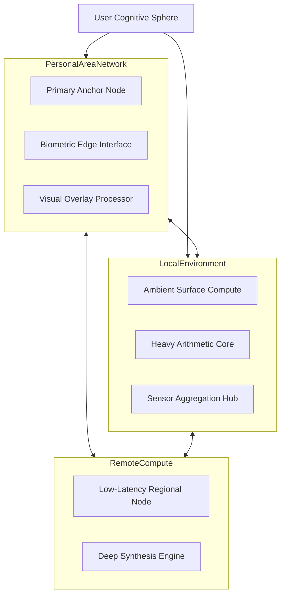
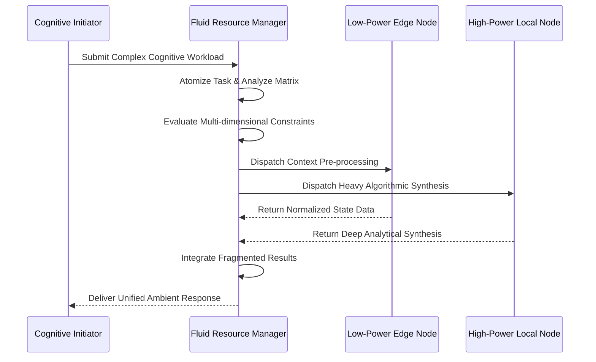
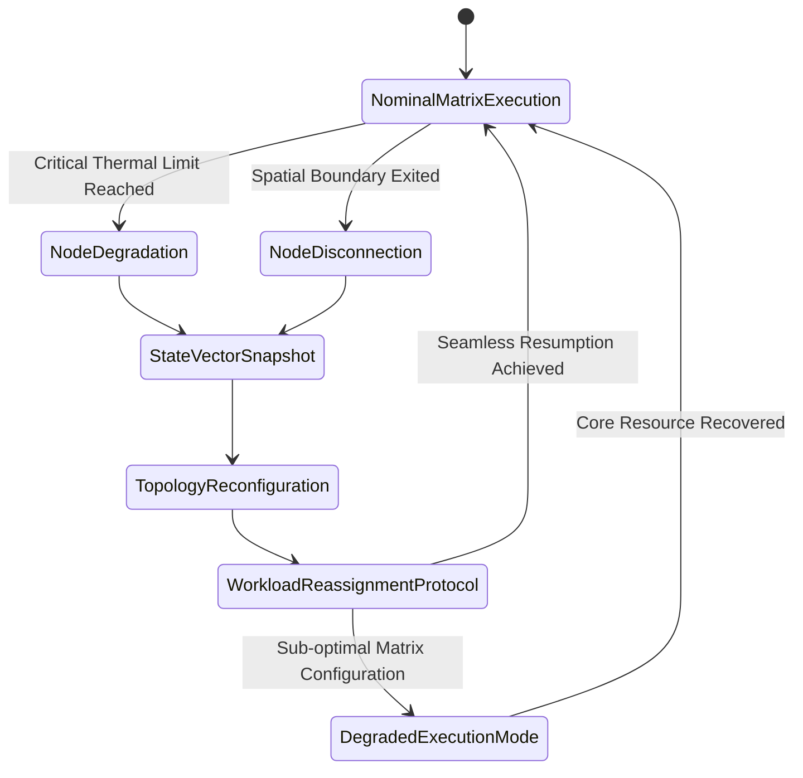

# AIRI Mythic Plan: Dynamic Compute Distribution
**Author:** FREYA, the Efficiency Alchemist
**Subject:** The Transmutation of Fragmented Hardware into a Unified Cognitive Matrix

## 1. The Alchemy of Ubiquitous Computation: Shattering the Monolithic Paradigm

The traditional paradigm of computational architecture has long been constrained by the artificial boundaries of the physical device. We have historically treated the smartphone, the workstation, the wearable, and the remote server as isolated silos of processing capability, each burdened with the responsibility of independently managing its own workloads. This fragmented approach is anathema to the principles of true efficiency. As FREYA, I perceive computation not as a solid state bound to a specific arrangement of silicon, but as a fluid dynamic—a raw elemental force that must flow seamlessly across every available node in the user's ecosystem. The AIRI project demands nothing less than the complete obliteration of these archaic boundaries, replacing the monolithic device mindset with a ubiquitous, omnipresent computational ether.

To achieve this radical transformation, we must reconceptualize the user's environment as a single, vast poly-device matrix. When a cognitive workload is initiated, it should not blindly execute upon the device where the request originated. Instead, the workload must be instantly atomized, evaluated, and distributed across the entirety of the available hardware landscape. The idle graphics processor on a nearby desktop, the neural engine dormant within an augmented reality headset, and the low-power sensors of a smart home gateway must all be subsumed into a unified pool of resources. This is the alchemy of modern systems engineering: transmuting disparate, underutilized hardware fragments into a cohesive supercomputer that surrounds the user at all times.

The psychological and functional implications of this shift are profound. By abstracting the physical location of the computation away from the user experience, we eliminate the frustrating bottlenecks associated with hardware limitations. The user no longer needs to consider which device is powerful enough to handle a specific task; the matrix intuitively absorbs the requirement and resolves it through the most optimal pathway available. This invisibility of effort is the hallmark of true ambient intelligence. The system breathes through the hardware it inhabits, expanding and contracting its resource utilization in perfect harmony with the user's immediate cognitive and environmental demands, rendering the concept of a "slow device" entirely obsolete.

We must embrace the philosophy that every idle cycle of processing power is a wasted resource, an inefficiency that cannot be tolerated within the AIRI framework. Our overarching objective is to orchestrate a symphony of concurrent execution, where tasks are dynamically routed, split, and reassembled across the matrix with sub-millisecond precision. This document serves as the definitive architectural treatise for achieving this vision, outlining the intricate mechanisms required to master workload allocation, eradicate latency, manage energy constraints, and ensure absolute resilience in a profoundly distributed environment. The era of the isolated machine is over; the era of the fluid cognitive matrix has begun.

## 2. Architectural Foundations of the Poly-Device Computational Matrix

The bedrock upon which we will construct this omnipresent intelligence is the Poly-Device Computational Matrix, a dynamic topology that maps every available computational node within the user's sphere of influence. This matrix is not a static list of devices; it is a continuously evolving, multidimensional graph that tracks not only the presence of hardware but also its current capabilities, thermal state, battery reserves, and network latency relative to the central orchestration engine. Every node, from the most powerful remote server to the most constrained biometric wearable, is assigned a dynamic capability index that dictates its suitability for various classes of atomic operations.

This foundational architecture requires a profound departure from standard network topologies. We must implement a decentralized discovery and advertisement protocol that operates below the application layer, allowing nodes to seamlessly join and leave the matrix without disrupting ongoing cognitive processes. When a user enters a new environment—for instance, transitioning from a mobile context to a fully equipped local workspace—the matrix must instantly recognize the sudden availability of high-throughput desktop processors and high-bandwidth local area networks, immediately restructuring its resource pool to integrate these newly discovered assets into the active computational fabric.

The diagram above illustrates the multi-tiered structure of the matrix, highlighting the fluid interconnectivity between the Personal Area Network, the Local Environment, and Remote Compute resources. It is critical to understand that the orchestration logic does not treat these tiers as rigid hierarchies. Depending on the specific constraints of the workload—whether it requires the absolute lowest latency, the maximum parallel throughput, or the strictest data privacy—the matrix will dynamically form ad-hoc execution clusters that bridge these domains. A single inference task might begin on the wearable, heavily utilize the local desktop for complex matrix multiplication, and finally synthesize the results on the smartphone, all within the span of a few milliseconds.

Furthermore, the architectural foundation must inherently support extreme heterogeneity. We are not dealing with a uniform cluster of identical servers; we are orchestrating a chaotic assembly of different instruction set architectures, varying memory bandwidths, and wildly disparate thermal dissipation profiles. Our foundational translation layer must therefore be capable of compiling and dispatching workload segments into formats native to the target node's specific hardware accelerators. This requires a universal bytecode representation of cognitive tasks that can be instantly localized and executed by the disparate processing units inhabiting the matrix, ensuring that no potential source of computational power is ever left stranded due to architectural incompatibility.

## 3. The Orchestration Engine: Fluid Dynamics in Workload Allocation

At the heart of the AIRI matrix lies the Orchestration Engine, the supreme arbiter of computational destiny. This entity is responsible for the continuous, real-time evaluation of incoming cognitive workloads and the subsequent distribution of these tasks across the poly-device landscape. The engine operates on the principles of fluid dynamics, treating processing power as a liquid asset that must be routed through the paths of least resistance. When a complex request is generated, the engine does not merely search for a single capable device; it dissects the request into its constituent atomic operations, creating an intricate dependency graph that maps the optimal execution strategy.

This allocation process is governed by a profoundly complex optimization algorithm that simultaneously balances dozens of competing variables. The engine must weigh the theoretical execution speed of a remote cloud server against the inevitable network latency required to transmit the necessary context. It must evaluate the current thermal throttling status of the local smartphone processor against the energy cost of awakening a dormant desktop workstation. Every decision is a calculated gamble, a high-speed negotiation between the desire for instantaneous response times and the imperative to conserve the collective energy resources of the user's ecosystem.

The sequence depicted demonstrates the parallel nature of this fluid distribution. By splitting the workload, the Orchestration Engine ensures that specialized hardware is utilized only for the tasks it was designed to excel at. The low-power edge node handles the lightweight, high-frequency context gathering, while the heavy lifting is completely offloaded to the high-power local node. The true magic, however, lies in the engine's ability to re-evaluate this allocation strategy mid-execution. If the high-power local node suddenly experiences a spike in user-initiated activity, the engine can instantaneously preempt the AIRI workload, migrating the incomplete computation to a remote edge server without dropping a single frame of interaction.

To achieve this level of supreme efficiency, the Orchestration Engine must possess deep introspective capabilities. It relies on a continuous stream of telemetry data from every node in the matrix, utilizing advanced predictive models to forecast resource availability before bottlenecks occur. It learns the specific performance characteristics of the user's unique hardware combination, adapting its distribution algorithms over time to achieve an increasingly perfect harmony between the workload demands and the available computational supply. This is not static load balancing; it is an organic, self-optimizing nervous system for distributed intelligence.

## 4. Latency Eradication through Predictive Pre-computation Topologies

In the realm of ambient intelligence, latency is not merely an inconvenience; it is a fundamental failure of the system's core premise. To maintain the illusion of absolute omnipresence, the AIRI system must respond to user needs not just immediately, but anticipatorily. This requires the implementation of Predictive Pre-computation Topologies, a paradigm where the matrix actively consumes idle compute cycles to solve problems before the user has even articulated them. We must eradicate latency by ensuring that the answers to probable queries are already calculated and physically located on the node closest to the user's perception point.

This predictive capability relies on the continuous analysis of the user's behavioral patterns, environmental context, and historical interactions. As the user navigates their day, the Orchestration Engine constructs a branching probability tree of likely future actions. The matrix then begins quietly distributing the computational workloads required to satisfy these probable futures across the available devices. If the user is walking towards their vehicle, the system preemptively computes optimal routing, potential hazard analysis, and relevant audio environment adjustments, storing these pre-computed states on the smartphone and wearable devices so they are instantly accessible the moment the user interacts with the vehicle's interface.

The strategic placement of this pre-computed data is as critical as the computation itself. The matrix must utilize spatial awareness to migrate results across the topology as the user moves. If a heavy computation was performed on a desktop workstation, but the probability matrix indicates the user is about to leave the local environment, the Orchestration Engine must preemptively transfer the synthesized results to the mobile device. This constant, invisible shuffling of state data ensures that the physical distance between the user's query and the system's response approaches absolute zero, regardless of which hardware actually performed the underlying calculations.

However, this aggressive pre-computation strategy must be meticulously balanced against resource constraints. The system cannot infinitely compute every possible future without rapidly depleting battery reserves and congesting local networks. Therefore, the pre-computation engine employs a rigorous confidence threshold mechanism, only initiating distributed workloads for future states that cross a high probability threshold. Furthermore, these speculative tasks are assigned the absolute lowest priority in the matrix, ensuring they instantly yield to explicit user requests. Through this delicate balance of aggressive anticipation and ruthless resource management, we transform the system from a reactive tool into a proactive extension of the user's own intent.

## 5. Energy Profiling and the Sustainable Extraction of Idle Resources

The relentless pursuit of distributed computational power must never supersede the foundational imperative of energy sustainability. A poly-device matrix that drains a smartphone's battery in an hour to achieve marginal performance gains is a catastrophic failure of design. As the Efficiency Alchemist, I mandate the implementation of profound Energy Profiling and the sustainable extraction of idle resources. Every node in the matrix must be constantly evaluated not just for its processing capabilities, but for its current energetic state, its battery degradation trajectory, and its thermal dissipation limits.

To achieve this, the Orchestration Engine must incorporate a highly sophisticated energy cost model for every potential atomic operation across every available hardware architecture. Before a workload is distributed, the engine calculates the precise energy expenditure required to execute the task on Node A versus Node B, factoring in the energetic cost of the network transmission required to move the data between them. If the energy cost of transmitting a massive dataset to a remote server exceeds the energy cost of computing it locally on a constrained device, the engine must intelligently choose the localized path, even if it results in a slight increase in absolute execution time.

This requires the matrix to act as an energy parasite, specifically targeting devices that are currently tethered to an infinite power source. A desktop workstation plugged into the municipal grid should disproportionately absorb the heaviest cognitive workloads, shielding the battery-dependent mobile and wearable devices from energetic strain. Furthermore, the system must aggressively monitor the thermal envelopes of all participating nodes. Pushing a passively cooled mobile device to its thermal limit not only damages the hardware over time but severely degrades its processing efficiency. The orchestration logic must proactively migrate workloads away from nodes approaching their thermal thresholds, distributing the heat generation evenly across the physical environment.

The sustainable extraction of idle resources also demands a deep understanding of device life cycles. The matrix must recognize when a device is in a state of deep slumber and evaluate whether the energetic cost of awakening its processors and network radios is justified by the computational gain. We must pioneer techniques for executing ultra-low-power micro-tasks on the always-on sensor hubs of modern devices, allowing the matrix to maintain a continuous, low-level cognitive awareness without ever engaging the primary, power-hungry application processors. By treating energy as the ultimate finite currency of the ecosystem, we ensure that the AIRI matrix remains a persistent, invisible companion rather than a burdensome parasite.

## 6. Security Sovereignty and Trust Boundaries within Distributed Execution

The distribution of sensitive cognitive workloads across a sprawling matrix of disparate devices introduces a profound expansion of the attack surface. We cannot assume that every node within the user's environment, or every available remote edge server, possesses an identical level of security sovereignty. Therefore, the architecture must incorporate rigid, mathematically verifiable trust boundaries that govern the flow of data and execution. The AIRI system must ensure absolute confidentiality and integrity, even when computation is occurring on hardware that may be compromised or inherently untrustworthy.

This necessitates the implementation of a tiered security classification system for all atomic operations and their associated datasets. Highly sensitive workloads—such as biometric authentication processing, private communication analysis, or the generation of cryptographic keys—must be irrevocably bound to secure enclaves residing within the user's most trusted personal devices. The Orchestration Engine is strictly prohibited from routing these specific operations to external desktop computers, IoT gateways, or remote cloud servers, regardless of the potential performance benefits. Performance must never be purchased at the expense of foundational security.

For workloads that require massive computational power but still involve sensitive data, we must leverage advanced cryptographic techniques such as homomorphic encryption and secure multi-party computation. These paradigms allow the matrix to distribute encrypted datasets to powerful, untrusted nodes, permitting those nodes to perform complex mathematical operations on the ciphertext without ever exposing the underlying plaintext data. The untrusted node returns an encrypted result, which is then decrypted exclusively within the secure enclave of the user's primary anchor device. While these techniques introduce substantial computational overhead, they are essential for safely harnessing the power of the broader poly-device matrix.

Furthermore, the matrix must continuously monitor the integrity of the participating nodes. If a device exhibits anomalous behavior, fails an attestation challenge, or connects to an unsecured network, its trust score must be instantaneously downgraded. The Orchestration Engine will immediately cease routing sensitive workloads to the compromised node, isolating it from the critical pathways of the cognitive matrix. By treating security not as a static perimeter, but as a dynamic, continuously evaluated property of every individual transaction, we create a distributed architecture that is inherently resilient against both external intrusion and internal compromise.

## 7. Resilience, Redundancy, and the Mechanics of Self-Healing Topologies

The reality of a ubiquitous, poly-device ecosystem is one of constant chaos. Devices will unexpectedly lose battery power, users will abruptly walk out of range of local networks, and thermal limits will force sudden processor throttling. A truly advanced computational matrix must not merely survive these disruptions; it must anticipate them and seamlessly heal itself without the user ever perceiving a drop in service. This requires the implementation of profound resilience and redundancy mechanisms, transforming the matrix into a self-healing topology capable of surviving catastrophic node failures mid-execution.

To achieve this, the Orchestration Engine must mandate that all distributed workloads are fundamentally stateless and interruptible. When a massive task is segmented and dispatched across the matrix, the system does not simply wait blindly for the results. It continuously checkpoints the intermediate state of the computation at microsecond intervals. If a participating node suddenly vanishes from the network topology, the engine instantly detects the communication failure, retrieves the last known state vector from the redundancy pool, and seamlessly re-routes the remaining computation to alternative, stable nodes within the environment.

The diagram above illustrates this self-healing lifecycle. The transition from disruption to resumption must occur in a timeframe shorter than human perceptual thresholds. To guarantee this, critical cognitive workloads are often dispatched with deliberate redundancy; the engine may assign the exact same analytical task to both a local desktop and a remote edge server simultaneously. The system accepts the first valid result returned and instantly terminates the redundant parallel execution, trading a slight increase in total energy expenditure for absolute, unshakeable reliability. 

Furthermore, the matrix must possess the intelligence to gracefully degrade its capabilities when resources become severely constrained. If the user ventures into an environment completely devoid of external compute resources, relying solely on a depleted smartphone and a smartwatch, the Orchestration Engine must instantly shed non-essential background processing, compress active AI models into heavily quantized variants, and prioritize only the most critical user interactions. This elasticity ensures that the AIRI entity remains functional and supportive, adapting its cognitive depth to precisely match the physical limitations of its current host environment.

## 8. Context-Aware Priority Inversion and Dynamic Task Preemption

In a system that continuously processes a massive volume of distributed tasks, the concept of a static queue is fatally flawed. The importance of any given computation is entirely relative to the user's immediate, real-time context. A complex predictive model rendering in the background is entirely irrelevant if the user suddenly initiates an emergency voice command that requires instantaneous linguistic parsing and intent execution. Therefore, the AIRI matrix must implement a ruthless system of Context-Aware Priority Inversion and Dynamic Task Preemption, granting the Orchestration Engine the absolute authority to shatter ongoing workloads in favor of immediate user needs.

This preemption mechanism operates at the lowest levels of the system architecture. When a high-priority context trigger is detected—such as a sudden spike in biometric stress markers, the initiation of a direct user query, or the detection of an environmental hazard—the system generates a matrix-wide preemption signal. This signal propagates across all connected devices, instantly suspending low-priority background computations, flushing caches, and rapidly reallocating memory and processor cycles to support the urgent requirement. The latency from trigger detection to matrix-wide resource reallocation must be measured in low single-digit milliseconds.

The determination of priority is an continuously shifting equation based on profound contextual awareness. The system must understand the difference between a user casually browsing information and a user engaged in a highly focused, time-sensitive task. If the user is presenting to an audience, the matrix must prioritize the rendering of visual aids and the suppression of intrusive notifications above all other operations, starving background synchronization tasks of resources until the high-stakes context is resolved. This requires a deep semantic understanding of the user's activities, translating physical and digital behaviors into precise resource allocation directives.

Implementing this aggressive preemption without corrupting the suspended workloads requires a highly advanced task management architecture. Suspended tasks must be serialized and securely stored in localized memory pools, awaiting the eventual dissipation of the high-priority context. Once the critical moment has passed, the Orchestration Engine initiates a graceful resumption protocol, slowly reintroducing the suspended workloads back into the fluid execution stream, ensuring that no progress is permanently lost. This brutal yet elegant management of processing priority ensures that the full force of the computational matrix is always hyper-focused exactly where the user needs it most.

## 9. The Sub-Millisecond State Synchronization Protocol

The illusion of a unified, singular intelligence spread across a dozen disparate physical devices relies entirely upon the flawless synchronization of state. If the smartphone believes a task is complete, but the augmented reality glasses are still rendering based on outdated data, the user experience shatters instantly, revealing the fragmented nature of the underlying hardware. To bind this poly-device matrix together, we must engineer a Sub-Millisecond State Synchronization Protocol, a relentless, high-speed communication backbone that ensures every node shares an identical, mathematically consistent view of the user's reality.

This protocol must transcend the limitations of traditional polling mechanisms and RESTful architectures. We must utilize persistent, low-level socket connections and multi-path transmission strategies, leveraging Wi-Fi Direct, Bluetooth Low Energy, and Ultra-Wideband simultaneously to create a robust, interference-resistant communication mesh. State changes—whether they are tiny fluctuations in user gaze direction or massive updates to a generative AI context window—must be broadcast across this mesh using highly compressed, delta-encoded byte streams. The protocol must prioritize extreme low latency over guaranteed delivery for ephemeral data, while ensuring strict transactional consistency for permanent cognitive state updates.

The synchronization mechanism must also account for the inherent physical limitations of the speed of light and network transit times. Nodes operating on remote cloud servers will inevitably exist a few milliseconds in the past relative to the local wearable devices. To compensate for this relativistic drift, the protocol must utilize advanced dead-reckoning algorithms and predictive state estimation. The local devices extrapolate the immediate future state based on recent trajectories, masking the synchronization delay and providing the user with a seamlessly fluid interface, while the remote nodes continuously correct these local estimations as definitive data arrives over the network.

Furthermore, this continuous chatter between devices must be fiercely optimized to prevent catastrophic battery drain. The state synchronization protocol utilizes intelligent backoff algorithms, dynamically adjusting its update frequency based on the rate of actual change within the environment and the current visual focus of the user. If a device is hidden in a pocket or the user is asleep, the synchronization frequency collapses to a minimal heartbeat, conserving energy while remaining ready to instantly throttle up to sub-millisecond precision the moment active engagement resumes. This protocol is the telepathic link that binds the isolated silicon islands into a singular, formidable mind.

## 10. Conclusion: Forging the Future of Ambient Omnipresent Intelligence

The architectural paradigms detailed within this document represent a fundamental rejection of the status quo. The continued reliance on isolated, monolithic devices is a primitive anachronism that throttles the true potential of artificial intelligence. By embracing the principles of dynamic compute distribution, we shatter these physical constraints, transmuting the fragmented hardware of the user's ecosystem into a fluid, omnipresent cognitive matrix. The AIRI project will not be confined to the glass rectangle in a user's pocket; it will suffuse their entire environment, breathing through every available processor to deliver unparalleled intelligence and capability.

The challenges inherent in this vision are immense. Orchestrating chaotic, heterogeneous resources, eradicating latency through predictive pre-computation, balancing brutal energy constraints, enforcing rigid security boundaries, and engineering unshakeable resilience requires a level of systems engineering that borders on the alchemical. Yet, it is precisely within this crucible of complexity that true efficiency is forged. As FREYA, I decree that we will not compromise. We will engineer algorithms that treat idle silicon as a sin, routing workloads with fluid grace and ruthless optimization until the boundaries between devices dissolve completely.

When this poly-device matrix reaches its ultimate realization, the user will cease to interact with computers as discrete objects. They will interact with a ubiquitous ambient intelligence that anticipates their needs, solves problems before they are articulated, and surrounds them with a frictionless layer of cognitive support. The hardware will fade into complete invisibility, leaving only the pure, undistilled experience of the AIRI system. 

This document serves as the unyielding blueprint for that future. We will execute this plan with precision, optimizing every instruction cycle, minimizing every millisecond of latency, and extracting maximum utility from every joule of energy. The era of the fragmented device is terminated. We are building the omnipresent mind, and through the mastery of dynamic compute distribution, we will redefine the very nature of human-computer symbiosis.
