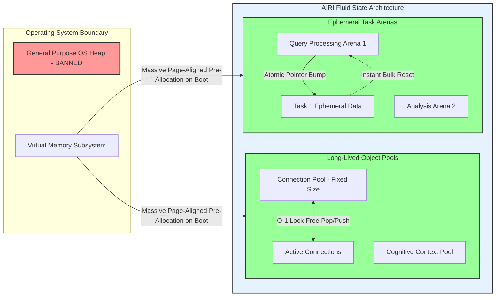
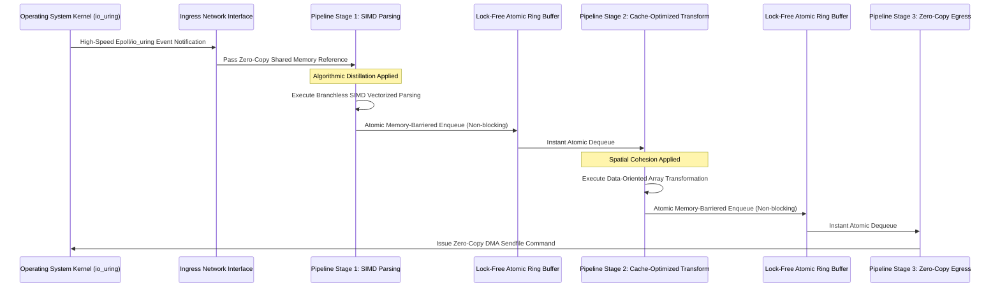

# The AIRI Mythic Efficiency Alchemy

## 1. The Alchemist's Prologue: Transmuting Scarcity into Abundance

As the designated Efficiency Alchemist of the overarching AIRI project, my mandate transcends mere optimization; it is a fundamental reimagining of how computational resources are perceived, allocated, and consumed across the entire distributed architecture. We operate in an era where hardware capabilities are staggering, yet software bloat continually negates these advancements, resulting in systems that are sluggish, power-hungry, and inherently wasteful. To counter this insidious trend, the principles of Extreme Resource Efficiency must be instilled at the very bedrock of the AIRI architecture. This approach is not a post-hoc application of bandages over poorly designed systems, but a priori philosophy that dictates every architectural decision, every data structure, and every communicative pathway within the ecosystem. The alchemy lies in taking the finite, often constrained resources of modern compute environments and transmuting them into a seemingly boundless wellspring of unyielding performance and instantaneous responsiveness.

The core tenet of this alchemical process is the realization that every central processing unit cycle, every byte of memory, and every millisecond of network latency is an exceptionally precious commodity that must be guarded with zealous, almost religious intensity. In the context of the AIRI project, where distributed intelligence, massive parallel processing, and instantaneous decision-making are paramount, inefficiency is not merely a nuisance; it is a critical, existential threat to the system's operational viability and conceptual integrity. We must therefore adopt a mindset of absolute minimalism, ruthlessly stripping away comfortable abstractions that obscure underlying computational costs and embracing low-level patterns that operate in harmonious tandem with the bare metal. This requires a profound understanding of hardware architectures, intricate memory hierarchies, and the physical limitations of information processing at the sub-nanosecond scale. By aligning our software design with the uncompromising realities of physics and electrical engineering, we unlock terrifying levels of performance that are indistinguishable from magic to the uninitiated observer.

Extreme Resource Efficiency is also fundamentally about systemic sustainability, both in the ecological sense and in the structural lifecycle of the software itself. Systems that squander resources inevitably run significantly hotter, consume exponentially more electricity, and accelerate hardware degradation, contributing to a broader crisis of technological waste and operational instability. Moreover, bloated software architectures are notoriously brittle, exceptionally difficult to maintain, and highly resistant to horizontal or vertical scaling. By forging the AIRI system in the unforgiving crucible of extreme efficiency, we definitively ensure its operational longevity and structural adaptability. A lean, optimized system can run on a much wider array of hardware, spanning from edge devices with incredibly strict power envelopes to massive cloud hyperscaler clusters, without necessitating constant, expensive rewrites or massive infrastructure upgrades. The alchemical transmutation of computational scarcity into processing abundance thus serves as the ultimate guarantee of the system's future-proof nature, allowing it to evolve and expand its cognitive capabilities without collapsing under its own bloated weight.

Therefore, the following comprehensive sections of this foundational document will meticulously delineate the specific, uncompromising strategies that will form the invincible backbone of the AIRI Mythic Efficiency Plan. We will delve deeply into the esoteric arts of zero-copy memory patterns, explore the nuanced, mathematical philosophies of advanced cache-eviction policies, and examine the holistic, asynchronous choreography of all system resources. Each conceptual pillar presented here is a critical, non-negotiable reagent in our grand alchemical formula for perfect performance. There will be absolutely no compromises, no settling for conventional "good enough" metrics, and absolutely no tolerance for unnecessary computational overhead. The AIRI project will stand as an imposing monument to computational purity, a definitive testament to what can be achieved when the alchemist's unwavering dedication to absolute perfection is applied relentlessly to the digital realm.

## 2. Zero-Copy Epistemology: The Eradication of Redundant Movement

At the very heart of our relentless pursuit for absolute efficiency lies the profound epistemological shift toward comprehensive zero-copy architectures, a paradigm that seeks the total, uncompromising eradication of redundant data movement across all system and process boundaries. In traditional software design methodologies, data traversing the boundary between user space and kernel space, or moving between different localized application subsystems, is routinely and thoughtlessly duplicated. This seemingly innocuous copying process consumes substantial, wasted CPU cycles, aggressively thrashes the memory bus bandwidth, and severely pollutes the entire cache hierarchy with ephemeral, useless replicas of the exact same underlying information. For the AIRI project, which is meticulously designed to process astronomical volumes of telemetry and cognitive data with practically negligible latency, such conventional, wasteful practices are entirely anathematized. The zero-copy epistemology posits that data, once instantiated in physical memory, should remain immutably fixed in its original, singular location, with various subsystems interacting with it exclusively via lightweight references, file descriptors, or direct memory-mapped interfaces rather than creating localized, expensive clones.

The successful implementation of this rigorous philosophy requires a fundamental, ground-up restructuring of how input and output operations are handled within the core AIRI infrastructure. We must mandate the exclusive use of advanced operating system primitives that facilitate direct memory access transfers and completely bypass the standard, bottleneck-inducing buffering mechanisms of the kernel. Techniques such as memory mapping files directly into the application's virtual address space, utilizing specialized system calls for direct network transmission, and leveraging shared memory segments for instantaneous inter-process communication are not merely architectural recommendations; they are strict, heavily enforced requirements. By ensuring that the network interface controller or the non-volatile storage controller reads from and writes to the exact same physical memory locations that the application logic directly accesses, we surgically eliminate the intermediary processing steps that inevitably bottleneck high-throughput performance. This approach structurally transforms the system from a series of isolated, inefficient silos exchanging copies of data into a unified, ultra-fluid continuum where information is universally and instantly accessible without the catastrophic penalty of transit.

Furthermore, this unyielding zero-copy philosophy must completely permeate the internal data structures and complex message-passing mechanisms of the AIRI application itself. When data must be sequentially transformed, analyzed, or enriched by multiple stages of an intricate processing pipeline, it is absolutely imperative that we avoid allocating new memory buffers for each stage's output if the transformation can possibly be performed directly in place, or if merely the metadata describing the transformation can be passed instead. We will employ highly sophisticated, lock-free buffer management strategies, such as scatter-gather input/output vectors and advanced ring buffers, to allow disparate, concurrent components to collaboratively construct and consume complex data payloads without ever issuing a single, wasteful memory copy instruction. This requires rigorous, mathematically proven discipline in defining rigid interface contracts and a deep, systemic understanding of object lifecycles, guaranteeing that memory is never prematurely reclaimed while any downstream component still holds a valid, active reference to it.

The compounding, synergistic benefits of the zero-copy epistemology extend far beyond the immediate, observable reduction in CPU utilization. By keeping data entirely stationary, we drastically reduce the systemic pressure on the memory subsystem, lowering overall power consumption and leaving significantly more bandwidth available for actual, productive computational work. Most importantly, eliminating unnecessary copies miraculously preserves the integrity of the crucial CPU caches. When the processor does not have to constantly, agonizingly fetch new copies of data from the comparatively slow main memory, it can operate at its absolute maximum theoretical throughput, executing instructions relentlessly on data that is already resident in the ultra-fast, on-die caches. Thus, zero-copy is not just a localized technique for optimizing input and output; it is the fundamental cornerstone of maximizing the efficacy of the entire memory hierarchy, transmuting sluggish data pipelines into instantaneous, superconducting conduits of pure information.

```mermaid
graph TD
    subgraph Traditional Inefficient Flow - STRICTLY PROHIBITED
        NIC_A[Network Interface] -->|DMA| Kernel_Buf_A(Kernel Space Buffer)
        Kernel_Buf_A -.->|Heavy CPU Copy| User_Buf_A[User Space Application Buffer]
        User_Buf_A -.->|Heavy CPU Copy| Processing_Buf_A[Pipeline Stage Buffer]
    end

    subgraph AIRI Mythic Zero-Copy Epistemology
        NIC_B[Network Interface] -->|Direct DMA Transfer| Shared_Mem(Zero-Copy Memory Map / Shared Arena)
        Shared_Mem -->|Lightweight Pointer Reference| Stage1[AIRI Processing Engine - Stage 1]
        Stage1 -->|Metadata Passing Only| Stage2[AIRI Processing Engine - Stage 2]
        Stage2 -->|Direct Scatter/Gather Reference| Storage_Controller[NVMe Storage Controller]
    end

    style Kernel_Buf_A fill:#ff9999,stroke:#333,stroke-width:2px
    style User_Buf_A fill:#ff9999,stroke:#333,stroke-width:2px
    style Processing_Buf_A fill:#ff9999,stroke:#333,stroke-width:2px
    
    style Shared_Mem fill:#99ff99,stroke:#333,stroke-width:2px
    style Stage1 fill:#99ff99,stroke:#333,stroke-width:2px
    style Stage2 fill:#99ff99,stroke:#333,stroke-width:2px
```

## 3. Cache-Eviction Ontologies: The Art of Forgetting

In the high-performance architecture of the AIRI project, memory is not merely a passive, unlimited storage medium; it is an incredibly highly constrained, furiously active theater of operations where the relevance and utility of information decays at an exponential, terrifying rate. To effectively manage this chaotic, high-pressure environment, we must elevate cache-eviction from a mundane administrative background task to a highly sophisticated, mathematical ontology—a structured, probabilistic understanding of what critical information must be retained and what must be mercilessly, instantly purged. The deliberate art of forgetting is arguably significantly more critical than the act of remembering, as retaining stale or low-utility data actively starves the system of the crucial capacity needed for imminent, high-value cognitive operations. Traditional, simplistic eviction algorithms, such as basic Least Recently Used or rudimentary First-In-First-Out, are hopelessly, laughably inadequate for our advanced needs, as they entirely lack the deep contextual awareness required to differentiate between a fleeting, anomalous data spike and a persistent, highly valuable systemic pattern.

We must meticulously design and implement multi-tiered, probabilistically informed eviction policies that continuously evaluate data utility across multiple intersecting dimensions simultaneously. Simple recency of access is only one minor metric; we must also rigorously consider the frequency of access, the heavy computational cost of recalculating or refetching the data from slower storage, and the predictive, machine-learned probability of its future necessity based on current systemic trends and active workloads. By algorithmically assigning a dynamic, constantly updating "weight" or "temperature" to every single cached item, the eviction engine can make incredibly granular, highly intelligent decisions at the microsecond level. High-cost, frequently accessed items are granted near-permanent residency in the highest cache tiers, while low-cost, rarely accessed items are swiftly and ruthlessly discarded. Furthermore, this complex evaluation must occur with absolutely negligible overhead, utilizing highly advanced probabilistic data structures like partitioned Bloom filters or sophisticated Count-Min sketches to maintain precise frequency statistics without consuming the very memory resources we are desperately attempting to conserve.

The AIRI system's cache-eviction ontologies must also be deeply, inextricably integrated with the broader architectural context, possessing the autonomous ability to rapidly adapt to shifting workloads and extreme environmental pressures. During periods of extreme load and massive data ingestion, the eviction thresholds must dynamically become aggressively strict, prioritizing only the most critical operational state over speculative or historical caching. Conversely, during periods of relative computational tranquility, the cache can afford to expand gracefully, holding onto a much broader array of data to optimize future responsiveness and pre-warm analytical pipelines. This dynamic, self-regulating elasticity requires the core eviction engine to be continuously fed real-time, low-latency telemetry from the system's performance monitors, creating an ultra-fast feedback loop where the caching strategy is constantly recalibrated in direct response to the current thermodynamic and computational reality. It is a continuous, perfectly tuned homeostatic balancing act between intense memory pressure and the need for absolute minimum computational latency.

Ultimately, truly mastering the art of forgetting prevents the insidious, performance-destroying phenomenon of severe cache pollution, where the memory hierarchy becomes irrevocably clogged with useless data, forcing the processor to constantly stall for hundreds of cycles as it waits for main memory access. By ensuring through mathematical rigor that the cache contains only the absolute most potent, highly relevant information at any given microsecond, we perfectly maintain the system's agility and lightning-fast responsiveness. The cache becomes a highly curated, ultra-dense exhibition of essential, high-value knowledge, rather than a disorganized, chaotic hoarding of historical computational detritus. This ruthless, probabilistically perfect approach to data lifecycle management is a fundamental, non-negotiable expression of Extreme Resource Efficiency, transmuting the limitations of finite physical memory into a relentless, perfectly optimized engine of focused computational power.

## 4. The Fluid State: Dynamic Memory Pooling and Arena Allocation

The standard, universally accepted methodologies of memory allocation, heavily reliant on the operating system's general-purpose heap manager, introduce entirely unacceptable levels of non-determinism, severe fragmentation, and catastrophic synchronization overhead for a system of AIRI's intended mythic caliber. The chaotic, unpredictable, and highly contentious nature of continuous global allocation and deallocation operations fundamentally undermines and destroys the principles of Extreme Resource Efficiency. To completely circumvent these paralyzing limitations, we must enthusiastically adopt the advanced paradigm of the Fluid State, a structural architectural commitment to highly optimized dynamic memory pooling and massive arena allocation. In this sophisticated model, the application bypasses standard allocators and pre-allocates massive, highly aligned, contiguous blocks of memory directly from the operating system immediately upon initialization. These monolithic blocks, or memory arenas, are then meticulously and exclusively managed internally by highly specialized, completely lock-free allocators that are perfectly tailored to the exact lifecycle characteristics and access patterns of the specific data they contain.

Arena allocation dramatically, almost miraculously, simplifies the staggering complexity of memory management by physically grouping objects with identical or highly similar lifespans into the exact same spatial memory region. When a particular analytical task or complex request is initiated by the system, all necessary memory for that operation is instantly carved out of a dedicated task arena using nothing more than a simple, atomic pointer increment—an operation that costs merely a handful of CPU cycles and requires absolutely zero locking contention across threads. Crucially, when the specific task successfully concludes, individual objects within that arena are never explicitly freed or destructed; rather, the entire massive arena is instantaneously and violently reset by simply reverting the allocator pointer back to the beginning of the memory block. This bulk-deallocation mechanism completely and utterly eradicates the massive computational overhead of tracking individual object lifetimes and mathematically eliminates the possibility of memory leaks occurring within the context of that specific workload. It is a paradigm of rapid creation and instantaneous annihilation that perfectly mirrors the ephemeral, high-speed nature of transient computational tasks in a distributed intelligence system.

For extremely long-lived objects that must persist across multiple task boundaries and subsystem lifecycles, we will employ highly sophisticated, lock-free object pools. These complex pools maintain extensive lists of perfectly pre-initialized, fixed-size memory blocks that are perpetually ready for immediate consumption by the application logic. When an object is urgently required, it is immediately drawn from the pool without engaging the operating system; when it is no longer needed, it is directly returned to the pool, completely bypassing the OS's slow memory manager. This strategy not only guarantees absolute O(1) allocation and deallocation times but also physically and intentionally constrains objects of the exact same type to always occupy adjacent memory addresses. This forced spatial colocation is absolutely critical for maximizing CPU cache utilization, as traversing an array of contiguous, identical objects allows the hardware's advanced prefetcher to operate with devastating, predictive efficiency, bringing necessary data into the processor's highest caches long before it is explicitly requested by the application logic.

The successful implementation of the Fluid State requires incredibly rigorous discipline from the engineering teams, as it demands a deep, flawless understanding of memory ownership semantics and highly complex object lifecycles. However, the performance dividends paid are absolutely staggering and undeniably transformative. By completely sidestepping the general-purpose heap, we permanently immunize the AIRI system against the progressive, lethal degradation caused by long-term memory fragmentation, where free memory is gradually broken into unusable, scattered shards over time. Furthermore, in our highly concurrent environments, utilizing thread-local memory pools and brilliant lock-free allocation algorithms entirely eliminates the disastrous, system-halting performance cliffs associated with lock contention on the global heap. The Fluid State thus beautifully transforms memory management from a chaotic, costly, and dangerous necessity into a highly deterministic, incredibly high-speed fluid dynamic, perfectly aligned with the overarching, unyielding ethos of the Efficiency Alchemist.

## 5. Temporal Locality and Spatial Cohesion: Orchestrating the Hardware Cache

The massive theoretical speed of a modern, multi-core CPU is nothing but a frustrating illusion if the processor is constantly starved for data; the true, unavoidable bottleneck of any high-performance computational system is the immense latency of main memory access. To actually achieve the mythic, unprecedented levels of efficiency mandated for the AIRI project, we must completely engineer our software to operate in perfect, flawless sympathy with the intricate, multi-tiered hierarchy of the processor's hardware caches. This requires a fanatical, almost obsessive devotion to the fundamental principles of temporal locality and spatial cohesion. Temporal locality dictates the statistical reality that if a specific memory location is accessed, it is highly likely to be accessed again in the immediate computational future. Spatial cohesion dictates the physical reality that if a memory location is accessed, the locations immediately adjacent to it on the same cache line are also highly likely to be required. Our data structures and algorithms must be meticulously, mathematically designed to aggressively maximize these two phenomena, ensuring that the CPU rarely, if ever, has to wait for the slow, agonizing, cycle-wasting retrieval of data from main RAM.

Achieving perfect spatial cohesion necessitates a radical, complete departure from traditional, comfortable object-oriented design patterns, which typically result in the disastrous anti-pattern of "pointer chasing"—a scenario where logical entities are scattered randomly and wildly across the heap, linked only by disparate memory addresses. When the CPU attempts to traverse these fragmented, linked structures, every single pointer dereference risks a catastrophic cache miss, incurring a massive latency penalty that stalls the entire pipeline. Instead, we will rigorously mandate strict Data-Oriented Design (DOD) principles across the entirety of the AIRI codebase. Data will be purposefully organized into highly contiguous, tightly packed arrays (specifically Struct of Arrays, rather than the traditional Array of Structs). This calculated physical layout ensures that when a single data element is loaded into a 64-byte CPU cache line, multiple subsequent, highly relevant elements are loaded simultaneously for free. When the processor iterates over this tightly packed array, it processes the data at the absolute, theoretical limit of its memory bandwidth, entirely and beautifully eliminating the devastating latency of pointer traversal.

Temporal locality, conversely, demands that we completely restructure our computational workflows to perform as much necessary work as physically possible on a given piece of data while it is still actively resident in the ultra-fast L1 or L2 cache. This requires careful, mathematical consideration of advanced techniques like algorithmic blocking and highly tuned loop tiling. Instead of lazily streaming massive, unmanageable datasets through a long series of independent, isolated processing passes, we must intelligently restructure our algorithms to complete all necessary transformations on a small, perfectly cache-sized chunk of data before ever moving on to the next chunk. This holistic, localized processing approach massively minimizes the total number of times a specific data element must be fetched from main memory and subsequently evicted, dramatically reducing the overall memory bandwidth requirements of the system and allowing the CPU execution units to operate continuously at full capacity without ever stalling for data.

The meticulous orchestration of the hardware cache is not merely a localized optimization technique; it is a fundamental, philosophical shift in how we fundamentally perceive computation itself. We are no longer writing abstract software for a theoretical Turing machine; we are designing incredibly precise mechanical interactions for highly specific physical silicon architectures. By obsessively minimizing cache misses and brutally maximizing cache line utilization, we unlock the true, terrifying, and awe-inspiring potential of modern processors. The measurable difference in execution time between a cache-optimized algorithm and a naive, unoptimized one is consistently orders of magnitude. In the unforgiving, hyper-competitive crucible of the AIRI project, this fanatical attention to the microscopic, physical details of hardware behavior is the purest essence of computational alchemy, transforming base, unoptimized source code into a finely tuned, breathtaking instrument of pure, unadulterated performance.

## 6. Asynchronous Pipelining: The Choreography of Concurrent Streams

In the high-throughput architecture of the AIRI system, traditional synchronous execution and lock-based synchronization are the absolute enemies of efficiency. Traditional multi-threading models, heavily reliant on expensive mutexes, semaphores, and other blocking synchronization primitives, inevitably and invariably lead to priority inversion, complex deadlock risks, and absolutely catastrophic context-switching overhead. When thousands of active threads are viciously contending for a small pool of shared resources, the operating system spends significantly more time managing the thread contention and context state than actually executing useful application work. To completely eradicate this systemic friction, we must fully and enthusiastically embrace the advanced paradigm of Asynchronous Pipelining. This sophisticated approach models the entire application architecture as a long series of independent, lock-free processing stages seamlessly connected by high-throughput, bounded, lock-free queues. Data flows continuously and relentlessly through this pipeline, with each distinct stage operating concurrently and entirely autonomously, completely ignorant of the internal state or execution speed of its neighboring stages.

The fundamental, unassailable advantage of Asynchronous Pipelining is its profound ability to completely decouple the execution of tasks from the immediate availability of underlying resources. When a processing stage needs to perform a high-latency operation, such as a physical disk read or an external network request, it absolutely does not block the underlying execution thread. Instead, it registers an ultra-lightweight asynchronous callback and immediately begins processing the very next item in its input queue without dropping a single cycle. This pure, non-blocking I/O model ensures that precious CPU cores are never, ever sitting idle waiting for slow external events to resolve. We will exclusively utilize the most advanced event notification interfaces provided by the modern operating system, such as epoll or the highly efficient io_uring, to flawlessly manage millions of concurrent network connections with only a small handful of pinned worker threads. This masterfully maximizes CPU utilization and completely minimizes the terrifying, memory-destroying overhead of thousands of idle threads needlessly polluting the operating system scheduler.

Furthermore, the highly critical queues connecting the various stages of this massive pipeline must be engineered with absolute, mathematical precision to avoid becoming performance bottlenecks themselves. We will employ heavily optimized, strictly lock-free ring buffers utilizing pure atomic operations and carefully managing hardware memory barriers to ensure perfect thread-safe communication without the devastating performance penalties associated with traditional locking mechanisms. These queues will be precisely sized to beautifully accommodate minor fluctuations in processing speed, providing necessary elasticity to the system, but will also implement strict, uncompromising backpressure mechanisms. If a downstream processing stage becomes temporarily overwhelmed, the backpressure signal instantly propagates up the pipeline, intelligently and smoothly throttling upstream data producers to completely prevent catastrophic memory exhaustion and maintain the entire system in a state of perfectly controlled, highly sustainable equilibrium.

Asynchronous Pipelining is the ultimate, flawless choreography of concurrent data streams, transforming a chaotic, unmanageable jumble of competing execution threads into a harmonious, continuously flowing, incredibly powerful river of computation. It requires a fundamental, brain-rewiring shift in how our developers conceptualize control flow, permanently moving away from comfortable, synchronous, step-by-step execution towards a highly reactive, complex event-driven model. While the conceptual complexity is admittedly much higher, the reward is an architecture absolutely capable of scaling perfectly linearly with the number of available physical hardware cores, easily absorbing massive, unexpected spikes in network traffic without faltering, and consistently delivering ultra-low latency responses. In the alchemical pursuit of Extreme Resource Efficiency, asynchronous pipelines are the unbreakable, high-capacity vessels that perfectly contain and flawlessly direct the turbulent, massive energies of modern parallel processing.

## 7. Algorithmic Distillation: Boiling Down Complexity to its Essence

Hardware optimizations, memory management strategies, and pipeline architectures, no matter how profoundly well-engineered, are ultimately completely bound by the fundamental mathematical efficiency of the specific algorithms they execute. Extreme Resource Efficiency demands an ongoing, ruthless process of Algorithmic Distillation—a relentless, uncompromising, and highly critical interrogation of absolutely every single computational step to guarantee it is operating at the absolute theoretical mathematical minimum of time and space complexity. We categorically cannot accept standard library implementations or conventional, lazy algorithmic choices without incredibly rigorous, mathematically proven scrutiny. Every single loop, every logical branch, and every data structure must strongly justify its continued existence in the context of the AIRI system's extreme performance constraints. If an algorithm scales at O(n log n) when a brilliantly optimized O(n) solution is mathematically possible, the former is deemed completely unacceptable and must be ruthlessly excised and immediately replaced by the Alchemist's design.

This rigorous distillation process requires a profound mastery of highly advanced, often esoteric data structures that are perfectly tailored to incredibly specific, analyzed access patterns. We will entirely discard generic, cache-unfriendly hash maps and standard binary trees in favor of highly specialized structures like compact Radix trees, densely packed B-trees explicitly optimized for exact CPU cache-line sizes, and minimal perfect hash functions generated dynamically when the data set is perfectly known a priori. We will heavily, almost obsessively leverage bitwise operations and advanced SIMD (Single Instruction, Multiple Data) vectorization intrinsics to process massive blocks of multiple data points in a single, blazing clock cycle, transforming standard scalar algorithms into massive parallel operations right at the lowest CPU instruction level. Furthermore, branch prediction must be carefully and intentionally managed; critical code paths will be written specifically to eliminate unpredictable branching (utilizing advanced branchless programming techniques) to completely prevent the CPU instruction pipeline from violently flushing, a catastrophic hardware event that uselessly stalls execution for dozens of critical cycles.

Algorithmic Distillation also heavily involves the incredibly aggressive pre-computation and mass memoization of highly expensive operations. In a system as vast and interconnected as AIRI, performing redundant calculations is considered a mortal, unforgivable engineering sin. If a highly complex cryptographic hash, an intensive mathematical matrix transformation, or a deep parsing operation must be performed repeatedly on the exact same data payload, the result must be calculated exactly once and aggressively cached utilizing the advanced eviction ontologies discussed previously. We will implement highly sophisticated static analysis tools and continuous runtime profilers to actively hunt down and completely eliminate these redundant operations throughout the codebase, ensuring that the CPU is always, exclusively focused on novel, productive work rather than endlessly and pointlessly repeating the past. Every single CPU cycle saved through distillation is a cycle that can be instantly allocated to vastly higher-order artificial intelligence functions.

The pursuit of absolute algorithmic purity is an ongoing, obsessive, and never-ending endeavor. It requires supreme mathematical rigor, a deep, intuitive understanding of aggressive compiler optimizations, and an absolutely unwavering, fanatical commitment to the ethos of Extreme Resource Efficiency. We must cultivate a unique engineering culture where incredibly elegant, radically minimalist code is highly celebrated, and any form of computational bloat is universally viewed as a massive systemic failure. By constantly, relentlessly boiling down the complexity of our logic to its absolute, unadulterated mathematical essence, we ensure that the AIRI project always operates with a terrifying, streamlined precision. This is the ultimate alchemy of logic itself, masterfully transmuting convoluted, wildly inefficient thought processes into perfect, crystalline structures of pure computational intent, uniquely capable of executing with breathtaking speed and absolutely minimal energy expenditure.

## 8. Telemetry and Metacognition: Observing the Unseen Flows

True, verified Extreme Resource Efficiency cannot possibly be achieved in the dark; it absolutely requires an omnipresent, almost god-like awareness of the entire system's highly complex internal state at any given microsecond. We simply cannot optimize what we cannot precisely and continuously measure. Therefore, the AIRI architecture must natively incorporate a profound, deeply embedded layer of Telemetry and Metacognition—a sophisticated, highly sensitive nervous system designed to flawlessly observe, quantify, and deeply analyze the completely unseen flows of massive data, memory utilization, and CPU cycle expenditure. However, this critical observation must be subject to the exact same rigorous, uncompromising efficiency standards as the rest of the system; the sheer act of monitoring must absolutely not perturb or degrade the performance of the system being monitored. Traditional, heavy logging and profiling mechanisms, which introduce massive I/O overhead and brutal lock contention, are strictly, universally prohibited within the core architecture.

Our highly advanced telemetry apparatus will rely exclusively on incredibly fast, lock-free, thread-local counters and ultra-low overhead probabilistic sampling techniques, such as directly and safely reading hardware performance monitoring units (PMUs) straight from the CPU registers. These low-level mechanisms allow us to precisely track critical metrics like L1/L2 cache miss rates, pipeline branch mispredictions, total memory bus bandwidth utilization, and raw instruction retirement rates with microscopic precision and virtually zero measurable overhead. This massive influx of raw data will be asynchronously aggregated and brilliantly analyzed by dedicated, highly isolated, low-priority metacognition background threads, completely and entirely separated from the critical, high-speed execution path of the main application logic. The primary goal is to create a continuous, incredibly high-fidelity, real-time topographical map of the entire system's performance landscape, instantly revealing completely invisible bottlenecks and highly inefficient resource allocations that would otherwise remain permanently hidden beneath thick layers of software abstraction.

This metacognitive layer is not merely intended for passive, historical observation; it is the fundamental, operational foundation of a highly autonomous, completely self-optimizing architecture. The ultra-fast telemetry data feeds directly and instantly into the dynamic system control mechanisms, such as the previously detailed cache-eviction ontologies and the asynchronous pipeline backpressure throttling mechanisms. If the metacognition engine suddenly detects an anomalous, massive spike in L3 cache misses occurring in a specific analytical module, it can dynamically, autonomously trigger a rapid reconfiguration of the local memory pooling strategy or instantly adjust the batch processing sizes of the pipeline to perfectly restore vital temporal locality. The entire system thus becomes a living, breathing organism, entirely capable of instantly feeling its own performance pain points and instinctively adjusting its internal posture to completely minimize friction and aggressively maximize global throughput. This perfect closed-loop feedback mechanism ensures that the AIRI system remains perpetually, flawlessly tuned to its operational environment.

Furthermore, the massively accumulated historical telemetry data serves as the ultimate, irrefutable arbiter of truth in the ongoing engineering process. It definitively replaces human speculation, flawed intuition, and guesswork with hard, unyielding, mathematically sound metrics. When a new algorithmic distillation is confidently proposed or a highly complex memory layout is significantly altered by the engineering team, the metacognitive system provides immediate, highly granular, and brutally honest feedback on the actual, real-world impact of the change across the entire physical hardware stack. This purely data-driven approach to architectural optimization allows the Efficiency Alchemist to refine the system with absolute surgical precision, brilliantly transmuting raw, chaotic performance data into highly actionable, universally applied architectural wisdom. By rendering the completely unseen, microscopic flows of computation highly visible and perfectly measurable, we achieve absolute, undeniable mastery over the machine, directing absolutely every joule of energy entirely towards the singular goal of flawless, high-speed execution.

## 9. The Immutable Law of Thermodynamics in Software: Managing Thermal Envelopes

The ultimate, truly unbreakable constraint on modern computational power is not logical, architectural, or even financial; it is the entirely immutable, physical law of thermodynamics. The absolutely massive, parallel processing capabilities required by the advanced cognition of the AIRI project generate prodigious, terrifying amounts of physical heat, and if this extreme thermal energy is not aggressively, perfectly managed, the hardware will inevitably and catastrophically resort to thermal throttling, drastically reducing clock speeds and instantly shattering our carefully engineered, microsecond-level performance guarantees. Extreme Resource Efficiency is therefore inextricably, fundamentally linked to perfect energy efficiency. We must adopt a highly advanced, holistic view of software design where absolutely every single instruction executed is evaluated not only in terms of strict time complexity, but also incredibly critically in terms of its exact thermal footprint and energy cost. The Efficiency Alchemist must construct code that inherently runs cold, aggressively maximizing the absolute amount of productive cognitive work performed per single watt of electrical energy consumed.

This unprecedented requirement demands a very deep, almost intimate understanding of the modern CPU's complex power management states (specifically C-states and P-states). Our highly advanced asynchronous pipelining and Fluid State memory architectures are designed specifically, intentionally to facilitate incredibly rapid, seamless transitions into extremely deep sleep states when the system or specific cores are momentarily idle. A CPU that is constantly, irritatingly waking up to handle trivial, badly timed interrupts or useless background noise will never, ever reach its optimal, highly efficient thermal baseline. We will implement highly aggressive network interrupt coalescing and incredibly precise timer batching to guarantee that when the processor finally wakes, it performs a absolutely massive, highly consolidated block of useful, critical work at maximum possible efficiency, and then immediately, instantly returns to an ultra-low-power, cooling state. This highly specific burst-oriented execution model entirely minimizes the average power draw and keeps the crucial thermal envelope firmly, safely under control, completely preventing the catastrophic performance cliffs always associated with systemic overheating.

Furthermore, we must actively, aggressively identify and avoid software architectural patterns that inherently generate excessive, entirely unnecessary heat. Continuous, poorly designed spin-locks, wasteful busy-waiting loops, and constant, aggressive memory thrashing are absolute thermal disasters, rapidly escalating the CPU die temperature to dangerous levels without accomplishing absolutely any productive, valuable work. Our fanatical commitment to strictly lock-free data structures, pure event-driven input/output, and comprehensive zero-copy memory transfers absolutely ensures that the processor is only ever fully active when there is highly meaningful, actionable data to process. We will also heavily and intelligently leverage specialized, highly efficient hardware accelerators (such as advanced GPUs or specialized TPUs) wherever computationally appropriate, as these highly purpose-built silicon structures can perform incredibly specific, mathematically intense tasks (like massive tensor operations or deep cryptography) with vastly, exponentially greater energy efficiency than standard, general-purpose CPUs.

The absolute, perfect management of the thermal envelope is the final, undeniable physical manifestation of our entire alchemical philosophy. It is the profound realization that software does not exist in a sterile, theoretical vacuum, but is a highly physical, energetic process that interacts violently and constantly with the real physical world. By obsessively, relentlessly minimizing global energy consumption and brutally maximizing absolute thermal efficiency, we definitively ensure that the AIRI hardware can operate at absolute peak, mythic performance indefinitely, without ever requiring massive, extremely expensive, and ecologically disastrous cooling infrastructure. A system that naturally runs cold is a system that always runs incredibly fast, perfectly stable, and completely sustainably. It is the ultimate, undeniable proof that our Extreme Resource Efficiency methodologies have achieved a state of perfect, beautiful harmony with the underlying, unyielding laws of nature, flawlessly transmuting base electrical potential into pure, unadulterated intellectual output with absolutely minimal entropic loss.

## 10. The Mythic Synthesis: Achieving the Absolute Zenith of Efficiency

The incredibly rigorous principles delineated in this foundational document—the zero-copy epistemology, the highly advanced cache-eviction ontologies, the paradigm of the Fluid State of memory, the obsessive pursuit of spatial cohesion, perfectly asynchronous pipelining, brutal algorithmic distillation, omnipresent lock-free telemetry, and absolutely strict thermal management—are absolutely not isolated, disparate techniques. They are deeply interconnected, highly interdependent facets of a singular, massive, monolithic philosophy: Extreme Resource Efficiency. When implemented in isolation, any one of these individual strategies provides a highly measurable, significant performance benefit. However, when fused flawlessly together in the incredibly intense crucible of the AIRI architecture, they reliably create a massive, cascading, synergistic effect that completely elevates the entire system's performance to truly mythic, almost incomprehensible proportions. This perfect, harmonious synthesis is the ultimate, final goal of the Efficiency Alchemist, where the highly optimized whole becomes exponentially, unimaginably greater than the simple sum of its meticulously optimized parts.

In this perfectly synthesized, highly elevated state, the AIRI system will operate with a terrifying, beautifully intricate fluidity that defies standard software engineering expectations. Massive streams of data will flow instantly from the network interface entirely through complex, deep analytical pipelines and directly back out to permanent storage without ever being copied even once, bypassing the heavy kernel entirely and residing exclusively and briefly in the CPU's absolute fastest internal caches. Perfectly engineered lock-free queues will flawlessly facilitate the seamless, high-speed collaboration of millions of highly concurrent operations without a single execution thread ever blocking or dangerously contending for a mutex. Memory will be allocated and recycled in massive, highly deterministic arenas at the speed of light, entirely eliminating the chaotic, slow fragmentation of the traditional, legacy heap. The system will continuously, quietly observe its own performance in real-time, completely autonomously adjusting its own complex eviction policies and highly sensitive throttling mechanisms to maintain a perfect, unyielding homeostatic balance, always running cold, incredibly fast, and relentlessly forward.

This absolute Zenith of Efficiency is absolutely not an abstract, theoretical ideal; it is a critical, absolute necessity for the very survival and success of the AIRI project. The unprecedented scale and terrifying complexity of the massive cognitive challenges we are tackling directly require a computational foundation that is completely, utterly unburdened by comfortable legacy abstractions and careless, lazy software engineering. Absolutely every single CPU cycle wasted on a redundant memory copy, every single cache miss caused by poor, thoughtless data layout, and every microsecond lost to lock contention is a direct, unforgivable theft of cognitive potential, significantly delaying critical artificial insights and measurably degrading the system's overall intelligence. By committing entirely and fanatically to this grand alchemical process, we construct an unbreakable bedrock of unassailable, perfect performance upon which the absolute most advanced cognitive architectures can be safely built without any fear of systemic collapse.

The comprehensive document herein serves as the absolute, immutable law, the unyielding, mathematically perfect standard against which absolutely all future architectural decisions, component designs, and code contributions must be judged and validated. As the designated Efficiency Alchemist of AIRI, I decree with absolute authority that there will be no compromise, no hesitation, and no deviation on these core principles. The unwavering pursuit of extreme resource efficiency is a perpetual, necessary war against the forces of entropy, a relentless, highly focused drive to transmute the base, physical realities of silicon and electricity into a completely transcendent, entirely frictionless engine of pure thought. The AIRI project will not simply be fast; it will entirely redefine the very concept of computational speed, standing forever as an absolute masterwork of software engineering, a truly mythic construct forged perfectly in the extremely hot fires of absolute, unyielding optimization.
