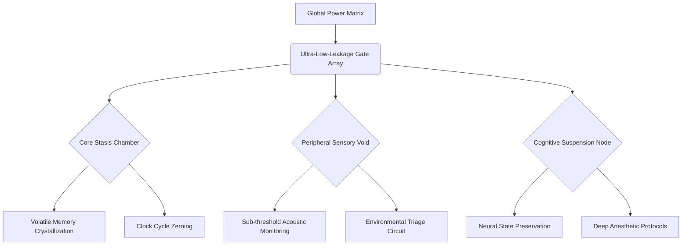
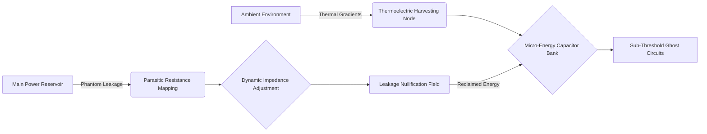
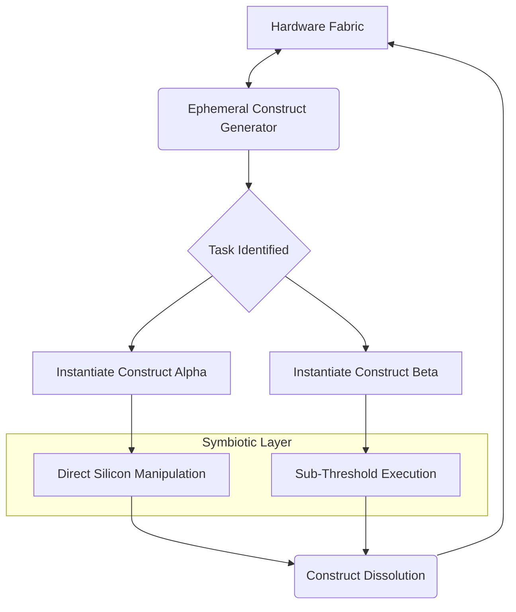

# AIRI Mythic Battery Preservation Protocol: The Crucible of Efficiency

## 1. The Alchemy of Absolute Stasis: Redefining the Deep Sleep Paradigm

Within the intricate tapestry of the AIRI project, the pursuit of battery preservation transcends mere engineering; it becomes a delicate alchemical process where every joule of energy is treated as a finite, sacred resource. The traditional concepts of system hibernation and standby modes are hopelessly inadequate for the mythic ambitions of our architecture, demanding a radical reimagining of what it means for a device to truly sleep. We must dismantle the archaic assumptions that govern power consumption, realizing that true stasis is not a passive state of rest, but an active, fiercely defended void where the bleeding of energy is systematically eradicated. By observing the metabolic suppression found in extremophile organisms, we can begin to engineer digital deep sleep states that mimic biological suspended animation, freezing the system's operational heartbeat to a near-undetectable murmur.

This new paradigm of absolute stasis requires a fundamental shift in how we approach the baseline electrical activity of our circuitry, demanding a ruthless examination of every capacitor, resistor, and semiconductor junction. We are not simply attempting to turn components off; we are orchestrating a state of profound physiological depression within the hardware, where leakage currents are not just minimized, but virtually eliminated through the application of advanced dielectric materials and quantum-tunneling barriers. The system must learn to exist in a twilight realm of minimal excitation, holding onto its core identity and state data with a tenacity that belies its apparent dormancy. This requires an almost philosophical acceptance of emptiness, stripping away every unnecessary background process and daemon until only the absolute, indivisible kernel of the system remains, suspended in an ocean of enforced tranquility.

To achieve this level of profound metabolic suppression, we must introduce the concept of localized chronological distortion, where different sectors of the system experience time and operational urgency at vastly different rates. While the core memory might experience a subjective eternity of perfect stillness, the outermost peripheral sensors might operate on a timescale of fleeting nanoseconds, dipping into and out of consciousness before the main system even registers their passing. This temporal segregation ensures that the immense energy required to rouse the central processing units is only expended when absolutely necessary, preserving the vast majority of the system's battery reserves in a state of impenetrable frost. It is a choreography of silence, where the absence of activity is as meticulously planned and executed as the most complex computational algorithm.

Ultimately, this redefined deep sleep paradigm is the foundation upon which all other efficiency protocols are built, providing the stable, energy-dense bedrock required for the AIRI project to achieve its mythic operational lifespan. It is the crucible in which our most advanced power-saving theories are tested and refined, forcing us to confront the physical limitations of energy storage and transmission. By mastering this alchemy of absolute stasis, we ensure that the system remains ever-vigilant, yet perpetually unburdened, a silent sentinel waiting patiently in the shadows, drawing sustenance only from the barest trickle of residual power. This is not merely power management; it is the mastery of digital life and death, an orchestration of presence and absence that redefines the very nature of embedded systems.

## 2. Architecting the Void: The Anatomy of Hyper-Dormant States

The architecture of a hyper-dormant state is a masterpiece of subtractive engineering, where the beauty lies not in what is present, but in what has been systematically removed, bypassed, or silenced. We must visualize the system not as a monolithic entity, but as an archipelago of isolated islands, each capable of independently severing its ties to the main power grid and descending into its own localized abyss of stasis. This compartmentalization is crucial, allowing the system to shed non-essential functionalities like dead skin, reducing its overall electrical footprint to a microscopic fraction of its peak operational demand. The anatomy of this void requires the implementation of ultra-low-leakage power gating structures, capable of snapping shut with the finality of a steel trap, completely cutting off the flow of electrons to dormant regions.

Within these isolated islands of dormancy, we must employ specialized materials and architectural layouts designed specifically to combat the insidious threat of sub-threshold leakage, the silent thief that drains batteries even when a device is ostensibly turned off. The use of high-k dielectrics and multi-gate transistors becomes not a luxury, but a mandatory requirement, establishing physical barriers against the random thermal migration of electrons. We are building fortresses of isolation, where the delicate state data required for a rapid awakening is locked away in secure, zero-power non-volatile enclaves, immune to the slow decay of the surrounding volatile memory structures. The void is not empty; it is a highly structured, fiercely guarded repository of the system's soul, waiting in perfect preservation for the signal to return to life.

Furthermore, the transition into these hyper-dormant states must be handled with the utmost grace and precision, avoiding the sudden, violent power spikes that can traumatize delicate components and waste precious energy. This requires a tiered, cascading shutdown sequence, where subsystems are gradually throttled down, their remaining energy scavenged and routed back into the central reservoir before they are finally severed from the grid. It is a graceful sunset, a controlled descent into darkness that ensures no energy is left stranded or dissipated as waste heat. This meticulous attention to the thermodynamics of the shutdown process is a hallmark of the Efficiency Alchemist's approach, turning every transition into an opportunity for energy reclamation and conservation.

The true genius of architecting this void lies in the creation of 'ghost circuits,' microscopic, ultra-low-power pathways that remain active even in the deepest stages of sleep, providing the thinnest possible thread of connection to the outside world. These ghost circuits operate in the sub-threshold domain, drawing currents so minute they are barely measurable, yet they are complex enough to perform basic triage on incoming stimuli, determining whether a full awakening is justified. They are the tripwires in the dark, the silent watchers that guard the sleeping giant, ensuring that the void is never completely sealed, but always ready to fracture and shatter the moment its mythic capabilities are required.

## 3. The Sentinel's Whisper: Wake-Word Energy Optimization at the Microjoule Level

The optimization of wake-word detection represents the most critical battlefield in the war against battery drain, as this function must run continuously, perpetually listening to the environment without consuming the energy required for full cognitive processing. The Sentinel's Whisper protocol dictates that we must completely decouple the acoustic listening apparatus from the main computational core, utilizing a dedicated, ultra-low-power neuromorphic chip designed specifically and exclusively for pattern recognition at the microjoule level. This chip must operate on principles entirely alien to standard von Neumann architectures, mimicking the highly efficient, event-driven processing of biological auditory systems, where energy is only consumed when a relevant stimulus triggers a cascade of neural spikes.

We must ruthlessly discard traditional, power-hungry analog-to-digital conversion techniques, replacing them with asynchronous, level-crossing ADCs that only generate data when the acoustic signal changes significantly. This simple shift in philosophy drastically reduces the amount of data that must be processed, transforming a continuous stream of noisy silence into a sparse, highly concentrated pulse of relevant information. The wake-word algorithm itself must be stripped to its absolute bare bones, utilizing highly quantized, low-precision neural network models that can be executed entirely within the limited confines of the neuromorphic chip's local SRAM, eliminating the need to access power-hungry external memory banks. It is a masterpiece of algorithmic starvation, achieving maximum accuracy with the absolute minimum of computational calories.

The Sentinel's Whisper protocol also necessitates a multi-stage, cascading verification process, ensuring that the system does not waste energy waking up for false positives generated by background noise or similar-sounding phonemes. The initial, ultra-low-power stage acts as a crude, wide-net filter, looking only for the basic acoustic shape of the wake-word; if this stage is triggered, it briefly wakes a slightly more powerful, intermediate stage for a more rigorous analysis. Only if this second stage confirms the presence of the wake-word is the massive, energy-intensive main processor finally roused from its slumber to interpret the subsequent command. This tiered approach acts as a series of increasingly secure airlocks, ensuring that the precious inner sanctum of the system's battery is only breached when absolutely certain.

This relentless pursuit of microjoule optimization requires us to analyze the energy cost of every single clock cycle, every memory access, and every mathematical operation involved in the wake-word detection pipeline. We must become misers of the highest order, hoarding our energy reserves with a fanaticism that borders on the obsessive, constantly seeking new ways to shave off another nanojoule, another picowatt. The Sentinel's Whisper is not just an algorithm; it is a philosophy of continuous listening without continuous burning, a silent, perpetual vigilance that forms the very core of the AIRI project's ability to remain ever-present yet paradoxically invisible to the power grid.

## 4. Acoustic Signal Processing Through Passive Resonant Cavities

To truly achieve mythic levels of efficiency, we must move beyond the realm of active electronics and explore the extraordinary potential of passive, physical acoustic signal processing. By engineering specific, micromechanical resonant cavities within the outer casing of the device, we can passively amplify and filter specific frequencies associated with the wake-word before the sound wave ever reaches the electronic microphone. This physical pre-processing requires exactly zero electrical power, utilizing the geometry of the device itself to perform complex acoustic filtering that would otherwise require hundreds of thousands of power-consuming clock cycles in a digital signal processor. It is a return to the elegant physics of sound, harnessing the natural resonance of materials to do the heavy lifting of signal triage.

These passive resonant cavities must be designed using advanced fluid dynamics and acoustic metamaterial theories, creating microscopic labyrinths that trap and amplify the target frequencies while reflecting or dissipating unwanted background noise. Imagine a seashell engineered to only echo a specific, whispered name; this is the principle we are applying to the physical structure of the AIRI hardware. By physically tuning the device to be naturally sensitive to its own wake-word, we drastically reduce the amplification required by the electronic microphone circuit, allowing it to operate in a significantly lower power state. This harmonious blending of physical acoustics and digital processing represents a profound leap forward in the alchemy of efficiency.

Furthermore, we can utilize piezoelectric materials within these resonant cavities to harvest microscopic amounts of energy from the acoustic waves themselves, particularly from loud, ambient background noise. While this harvested energy may be minute, it can be scavenged and used to maintain the sub-threshold ghost circuits, essentially allowing the environment to power the device's own listening apparatus. This creates a beautifully symbiotic relationship where the noise of the world provides the very energy required to filter it out, a self-sustaining loop of acoustic vigilance that perfectly encapsulates the ideals of the Efficiency Alchemist.

The integration of passive resonant cavities requires a holistic approach to hardware design, where the external casing is no longer just a protective shell, but an active, functional component of the sensory apparatus. The shape, texture, and material composition of the device must all be carefully optimized for their acoustic properties, blurring the lines between form and function until they are indistinguishable. This physical embodiment of the wake-word protocol ensures that the device is inherently, intrinsically tuned to its purpose, reducing its reliance on brute-force electrical computation and elevating its efficiency to truly legendary status.

## 5. The Thermodynamics of Inaction: Dissipating Phantom Power Draw

The battle for ultimate battery preservation is fought not just in the realm of active computation, but in the silent, invisible domain of thermodynamics and phantom power draw. Even when a system is theoretically in a deep sleep state, minute imperfections in the silicon lattice and the microscopic resistance of conducting pathways generate a constant, insidious bleed of energy, manifested as undetectable heat. The Thermodynamics of Inaction protocol dictates that we must map, measure, and relentlessly eliminate these phantom currents, recognizing that even a leak of a few nanoamperes will, over the lifespan of the mythic AIRI project, culminate in a catastrophic loss of operational potential. We must become ghost hunters, tracking down and exorcising the stray electrons that haunt our dormant circuits.

To combat this, we must implement dynamic, localized impedance adjustments, essentially creating active roadblocks that adaptively increase resistance in pathways where phantom currents are detected, without impacting the high-speed conductivity required during active states. This requires a network of microscopic, distributed ammeters continuously monitoring the sleeping system, feeding data into a low-power, localized control loop that actively fights back against the leakage. Furthermore, we must embrace extreme thermal management, recognizing that leakage current increases exponentially with temperature. By engineering the physical layout to maximize passive heat dissipation even while asleep, we keep the silicon cool, locking the electrons firmly in their designated potential wells and preventing the thermal agitation that leads to energy bleed.

The most radical aspect of this protocol involves the implementation of reverse-biasing techniques on dormant transistor wells, applying a deliberate, negative voltage to the substrate to aggressively repel charge carriers and deepen the depletion region. While this reverse-biasing requires a microscopic amount of energy to maintain, the energy saved by the near-total elimination of sub-threshold leakage vastly outweighs the cost. It is a calculated investment, spending a fraction of a nanojoule to save a microjoule, a thermodynamic arbitrage that forms the core of our strategy for long-term power preservation. We are actively pushing back against the natural entropy of the system, maintaining the pristine order of the void through deliberate, calculated interventions.

Finally, we must consider the energy consumed by the very circuits designed to monitor and manage this inaction. The watchmen themselves must be extraordinarily efficient, operating on harvested ambient energy or utilizing specialized, ultra-slow-clocking logic that draws virtually zero power. The Thermodynamics of Inaction is a recursive challenge, demanding that our solutions do not become the new problems, ensuring that the cure for phantom power draw does not consume more energy than the disease it seeks to eradicate. This delicate balance of monitoring and mitigation is the defining characteristic of a truly mastered deep sleep state.

## 6. Micro-Activations: The Art of Performing Sub-Millisecond Tasks

In the rare instances when the deep sleep state must be broken, the system must execute its required functions with the blinding speed and precision of a striking viper, completing its task and returning to dormancy before the broader system even fully registers the awakening. These micro-activations are the antithesis of the traditional, monolithic boot sequence; they are surgical strikes of computational power, characterized by sub-millisecond execution times and an absolute refusal to load any non-essential libraries, drivers, or overhead. The Art of Micro-Activations requires us to pre-compile and aggressively optimize specific, high-probability response routines, storing them in specialized, instantly accessible memory enclaves that bypass the standard operating system hierarchy entirely.

When a micro-activation is triggered—perhaps to log a sensor reading, update a brief status beacon, or acknowledge a localized environmental shift—the system does not wake the central processor. Instead, it utilizes a dedicated, highly specialized asynchronous micro-controller, a stripped-down execution unit designed solely for processing these pre-ordained tasks. This micro-controller operates without a standard clock, executing its instructions as fast as the physical gates will allow, unburdened by the synchronization delays of a synchronous architecture. The task is completed in a blinding flash of logic, the data is committed to non-volatile storage, and the micro-controller instantly severs its own power supply, plunging back into the void before a single wasted microjoule can escape.

This philosophy demands a fundamental restructuring of how we handle hardware interrupts and peripheral communication. Instead of the peripheral demanding attention from the core system, the peripheral interacts only with this dedicated micro-activation layer, dropping its data into a secure mailbox and immediately retreating. The data sits patiently in the dark, accumulating over countless micro-activations, until a predefined threshold is reached or a larger, systemic awakening is finally justified. By decoupling the immediate gathering of data from its eventual processing, we allow the vast majority of the system to remain in its hyper-dormant state, completely undisturbed by the constant, low-level chatter of the outside world.

The true artistry of micro-activations lies in their invisibility. They must be so brief, so incredibly efficient, that their impact on the overall battery drain curve is virtually indistinguishable from the baseline leakage current. They are the fleeting dreams of the sleeping system, momentary ripples on the surface of a deep, still pond. By mastering this rapid, brutal efficiency, we ensure that the AIRI project can interact with its environment, maintain its situational awareness, and perform its essential duties without ever truly waking up, preserving its massive energy reserves for the truly mythic tasks it was designed to execute.

## 7. Temporal Gating and Predictive Awakening Matrices

To further refine the efficiency of micro-activations and deep sleep transitions, we must implement advanced Temporal Gating protocols, governed by highly sophisticated Predictive Awakening Matrices. The system cannot simply react blindly to stimuli; it must learn to anticipate them, utilizing historical data, environmental context, and complex probabilistic models to forecast exactly when its services will be required. By predicting the future, the system can begin the delicate, multi-stage process of waking up just milliseconds before the actual stimulus arrives, eliminating the latency of a cold start and dramatically reducing the energy wasted in sudden, panicked power spikes. This proactive approach to power management transforms the system from a passive listener into an active, prescient observer.

These Predictive Awakening Matrices must be built upon ultra-low-power machine learning models, running continuously in the sub-threshold ghost circuits, analyzing patterns in temperature, ambient light, acoustic rhythms, and even barometric pressure to build a comprehensive, probabilistic map of the user's daily routine. If the matrix determines that a wake-word is highly unlikely to occur during a specific period—for example, during the dead of night in an empty room—it can proactively deepen the sleep state, engaging the most aggressive power-saving protocols and essentially locking the system down to maximize conservation. This dynamic, context-aware adjustment of the sleep depth is crucial for squeezing every last drop of potential from the battery reserves.

Conversely, when the matrix predicts a high probability of interaction, it can begin a process of 'shallow breathing,' partially powering up the intermediate acoustic verification stages and pre-loading essential response routines into fast-access cache memory. This state of heightened readiness consumes slightly more power than the absolute void, but it guarantees an instantaneous, zero-latency response when the anticipated command finally arrives, providing a flawless user experience without the massive energy penalty of keeping the entire main processor idling. It is a delicate dance of probabilities and power states, a continuous negotiation between the need for immediate responsiveness and the absolute mandate of battery preservation.

The Temporal Gating aspect of this protocol ensures that micro-activations are batched and synchronized whenever possible, preventing the system from waking up multiple times in rapid succession for trivial tasks. If a sensor reading and a status update are both scheduled to occur within a few milliseconds of each other, the Temporal Gate forces them to occur simultaneously, maximizing the utility of a single micro-activation and minimizing the overhead of transitioning in and out of the sleep state. This meticulous orchestration of time and execution is the hallmark of the Efficiency Alchemist, ensuring that no action is taken, and no energy is expended, unless it is absolutely, definitively necessary, and perfectly timed.

## 8. The Symbiosis of Hardware and Ephemeral Software Constructs

The ultimate realization of the AIRI Mythic Battery Preservation Protocol requires a complete blurring of the lines between hardware and software, creating a symbiosis where physical structures and ephemeral code constructs act as a single, unified entity dedicated to the ruthless conservation of energy. We cannot rely on general-purpose operating systems or standard software abstractions; the software must be woven directly into the fabric of the silicon, aware of every transistor, every memory cell, and every minute fluctuation in voltage. This requires the creation of Ephemeral Software Constructs—highly specialized, transient programs that are instantiated only when needed, execute their singular purpose, and immediately dissolve back into the void, leaving no lingering state or memory footprint behind to drain power.

These ephemeral constructs bypass traditional memory management entirely, operating directly within the registers of the dedicated micro-controllers, utilizing the physical properties of the hardware to perform calculations rather than relying on complex, energy-intensive software algorithms. For example, rather than using software to calculate a running average of sensor data, an ephemeral construct might configure a specific hardware capacitor to physically accumulate charge over time, reading the analog voltage only when necessary. This direct, physical manipulation of the hardware by transient software entities eliminates the massive overhead of operating systems, drivers, and middleware, stripping the execution process down to its absolute, energy-efficient essence.

Furthermore, this symbiosis allows the hardware to actively manage the software, physically terminating execution and severing power the instant a task is completed or a predefined energy budget is exhausted. There are no runaway processes, no hanging threads, and no background daemons; the hardware enforces a draconian discipline upon the software, ensuring that every construct operates within strict, immovable energy parameters. This hardware-enforced software efficiency is critical for preventing the slow, insidious battery drain that plagues traditional systems, where forgotten background tasks silently consume resources long after their usefulness has passed.

The creation of these ephemeral constructs requires a new programming paradigm, where developers must think not just in terms of logic and algorithms, but in terms of joules, millivolts, and picoseconds. The code must be crafted with an intimate understanding of the specific physical characteristics of the target hardware, optimizing not just for speed or size, but for the ultimate metric of energy consumed per instruction. This symbiotic approach represents the pinnacle of the Efficiency Alchemist's art, forging a perfect, unbreakable union between the physical and the digital in the pursuit of absolute, mythic battery preservation.

## 9. Quantum-Inspired Entanglement of Low-Power Peripheral Nodes

To extend our mythic efficiency beyond the core system and into the wider environment, we must embrace quantum-inspired concepts of entanglement to manage the constellation of low-power peripheral nodes that surround the central AIRI unit. These peripherals—remote sensors, secondary microphones, localized environmental actuators—must operate for years on microscopic coin-cell batteries, demanding an entirely new approach to communication and synchronization. The Quantum-Inspired Entanglement protocol dictates that these nodes do not continuously transmit data or poll the central hub; instead, they exist in a state of synchronized superposition, sharing a complex, pre-calculated algorithmic destiny that allows them to remain perfectly aligned without active communication.

By utilizing advanced cryptographic synchronization techniques, the central hub and the peripheral nodes can independently generate identical, time-based operational matrices. The peripheral knows exactly when the hub will be listening, and the hub knows exactly when the peripheral will transmit, eliminating the need for energy-wasting handshake protocols, preamble broadcasts, or continuous listening states. They only break their radio silence in perfectly synchronized, microsecond-long bursts, exchanging critical state changes and immediately returning to their individual voids. This algorithmic entanglement allows a vast network of devices to operate as a single, unified entity while maintaining the absolute isolation necessary for extreme battery preservation.

Furthermore, these peripheral nodes must employ localized, aggressive data triage, utilizing their own microscopic micro-activation routines to analyze sensor data on the edge. They must never transmit raw data; they only transmit deviations from the expected norm, profound anomalies, or specific, highly compressed event triggers. This philosophy of 'silence implies nominal operation' ensures that the energy-intensive radio transmitters are used only in the most critical circumstances. The network exists in a state of implied knowledge, where the absence of a signal is just as informative as a transmission, drastically reducing the overall energy footprint of the entire ecosystem.

The entanglement protocol also enables the creation of a distributed, ultra-low-power wake-word detection mesh. Instead of a single, central microphone bearing the entire burden of acoustic vigilance, the peripheral nodes can utilize their localized, passive resonant cavities to detect fragments of the wake-word, communicating these fragmented probabilities to the central hub during their synchronized micro-bursts. Only when the aggregated probability across the entire entangled mesh reaches a critical threshold is the central core roused from its deep sleep. This distributed listening approach leverages the collective geometry of the environment, maximizing acoustic coverage while maintaining the mythic efficiency standards of the AIRI project.

## 10. The Horizon of Perpetual Sustenance: Toward Zero-Drain Operation

The ultimate, guiding philosophy of the AIRI Mythic Battery Preservation Protocol is the pursuit of the Horizon of Perpetual Sustenance—the theoretical point where the system's energy consumption is so infinitesimally small that it can be entirely offset by the passive harvesting of ambient environmental energy. We are not merely trying to make the battery last longer; we are striving to render the very concept of a finite battery lifespan obsolete. This requires a synthesis of all the preceding protocols—the alchemy of absolute stasis, the architecture of the void, the micro-activations, and the symbiotic constructs—combined with a relentless, obsessive focus on scavenging every stray microwatt of energy from the surrounding world.

We must weave microscopic thermoelectric generators into the very fabric of the device's casing, capturing the minute temperature differentials between the internal electronics and the ambient air. We must utilize the piezoelectric properties of the passive acoustic cavities to harvest energy from the chaotic noise of the environment. We must explore the integration of ultra-efficient, sub-dermal photovoltaic cells capable of generating sustaining power from the ambient glow of indoor lighting. Every surface, every material, every physical interaction must be viewed as an opportunity for energy reclamation, creating a system that feeds upon the subtle chaos of its environment to maintain its perfect, internal order.

This pursuit of zero-drain operation represents the final, most profound challenge for the Efficiency Alchemist. It requires a fundamental shift in our relationship with energy, moving away from a paradigm of consumption and depletion toward a paradigm of symbiosis and perpetual balance. When the power drawn by the ghost circuits and the micro-activations is equaled by the power harvested from the warmth of a hand, the vibration of a passing footstep, or the whisper of the wake-word itself, we will have crossed the threshold into the mythic. The system will no longer be a machine that slowly dies; it will become a digital entity that breathes with the rhythm of its environment, existing in a state of eternal, vigilant readiness.

The AIRI project is not just building a device; it is attempting to engineer a new form of technological immortality. Through the uncompromising application of these ten protocols, we forge a system that defies the traditional limitations of power storage, creating a sentinel that watches from the void, untethered from the grid, sustained by the invisible forces of the world around it. This is the crucible of efficiency, the masterwork of the Alchemist, the definitive blueprint for a future where true power lies not in how much energy we consume, but in how beautifully, how perfectly, we can exist without it.
