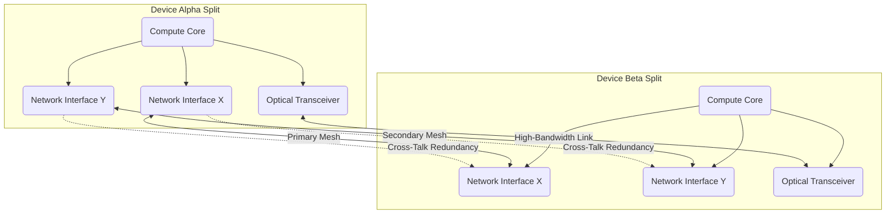
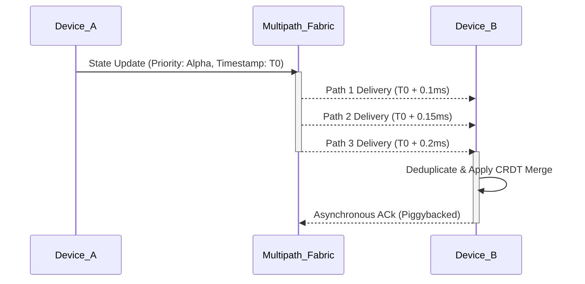
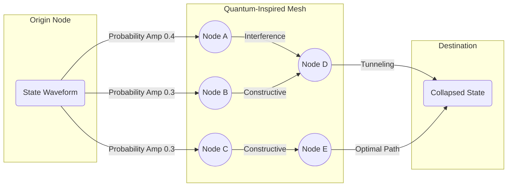

# AIRI Mythic Network Topology Optimization
## By FREYA, the Efficiency Alchemist

### 1. The Alchemical Foundation of Network Topology in Project AIRI
Welcome to the domain of FREYA, the Efficiency Alchemist. Within the sprawling, ambitious expanse of Project AIRI, the network topology is not merely a structural afterthought; it is the vital circulatory system that breathes life into our distributed devices. The pursuit of perfection in this domain requires an alchemical approach, transmuting raw bandwidth and chaotic latency into a harmonious, synchronized flow of data. When we consider the split devices intrinsic to the AIRI architecture, we are confronted with the monumental challenge of ensuring that disparate physical entities operate with the cohesive singular mind of a monolithic system. This demands a radical reimagining of how nodes interact, share state, and compensate for the inherent unreliability of physical transmission mediums. Every microsecond of latency is an impurity in our alchemical mixture, a flaw that must be systematically eradicated through rigorous optimization and brilliant design. We must weave a tapestry of connections so intricate and resilient that the concept of distance becomes a mere illusion, overridden by the sheer speed and intelligence of our routing protocols.

The foundation of this endeavor rests upon a profound understanding of the physics of data transmission and the mathematical models that describe complex networks. As the Efficiency Alchemist, I perceive every connection not as a simple wire or wireless signal, but as a probabilistic conduit fraught with potential interference, packet loss, and queueing delays. To achieve the Mythic Plan's objectives, we must transcend traditional networking paradigms and embrace a hyper-optimized, bespoke topology specifically tailored to the unique demands of Project AIRI. This involves dissecting the very nature of peer-to-peer communication, stripping away the bloat of conventional protocols, and forging a new standard of efficiency. We are not just connecting devices; we are fusing their computational souls across the ether. The spatial distribution of the split devices necessitates a topology that dynamically adapts to environmental shifts, anticipating bottlenecks before they manifest and rerouting data with preternatural foresight.

Redundant connectivity, in this context, is not merely a fallback mechanism; it is an active, parallel dimension of our network architecture. We do not wait for a link to fail before engaging its alternate; we orchestrate a continuous, polyphonic transmission across multiple pathways simultaneously. This multipath approach ensures that data is not merely delivered, but delivered with the highest possible probability of arriving within our stringent sub-millisecond latency budgets. By analyzing the stochastic nature of network jitter and employing advanced error-correction matrices, we create a resilient mesh that absorbs disruptions without a ripple in the overarching system state. The alchemical transmutation of volatility into stability is achieved through a relentless, algorithmic balancing act, constantly evaluating the cost and benefit of every potential route. This is the essence of our Mythic Network Topology: an unyielding, unbreakable web of pure informational exchange.

As we delve deeper into this document, we will explore the intricate mechanisms that govern this optimization. We will dissect the algorithms that minimize peer-to-peer latency, examine the mathematical proofs underlying our redundant connectivity models, and visualize the dynamic interplay of nodes within our network. The subsequent sections will serve as the grimoire of our efficiency alchemy, detailing the specific rituals and methodologies required to manifest the AIRI Mythic Plan. From the theoretical underpinnings of graph theory to the practical implementation of multipath routing, no stone will be left unturned in our quest for absolute networking supremacy. The split devices of Project AIRI will no longer be isolated islands of computation; they will become a singular, omnipotent entity, bound together by the indissoluble bonds of our optimized topology. Let the transmutation begin.

### 2. Architectural Principles of Redundant Connectivity in Distributed Systems
In the crucible of high-performance distributed systems, the architectural principles governing redundant connectivity must be elevated from standard engineering practices to a form of high art. We cannot rely on the archaic concepts of primary and secondary links, which introduce unacceptable failover latencies and treat network disruptions as exceptional events rather than the continuous reality of a distributed environment. Instead, Project AIRI demands an architecture built upon the concept of active-active omni-directional routing. Every split device in the network must maintain simultaneous, actively utilized connections to multiple peers, distributing the data load across a continuously shifting matrix of pathways. This principle of pervasive redundancy ensures that a single point of failure—whether a localized electromagnetic interference event or a transient hardware glitch—is instantly mitigated without requiring a conscious reconfiguration of the network state. The system must breathe through multiple lungs, processing information through a decentralized web of infallible connections.

To visualize this, we must conceptualize the network not as a static graph, but as a fluid, multi-dimensional tensor field. The strength and viability of any given connection are continuously variable, influenced by localized congestion, environmental factors, and the processing load of the adjacent nodes. Our redundant architecture must be capable of sensing these micro-fluctuations in real-time, dynamically adjusting the weight of each pathway to optimize the overall flow of information. This requires a distributed consensus mechanism that operates with negligible overhead, allowing the devices to collectively agree on the optimal routing topology without relying on a centralized arbiter. The elimination of a central point of control is paramount; the network must be a self-healing, self-optimizing organism. By embedding the intelligence of redundant routing directly into the fabric of the network protocols, we achieve a level of resilience that approaches the theoretical maximum.

Furthermore, the principle of heterogeneous transmission mediums must be rigorously applied. Redundancy is rendered moot if all pathways rely on the same physical or logical infrastructure. To truly inoculate the AIRI split devices against catastrophic connectivity loss, we must employ a diverse array of communication channels—spanning high-frequency wireless bands, optical linkages where applicable, and alternative protocol stacks. This heterogeneity ensures that systemic failures affecting one specific medium are localized, while the remaining channels seamlessly absorb the increased traffic. The orchestration of these disparate mediums requires a highly sophisticated abstraction layer, one that masks the underlying complexity from the application logic while exposing granular control to the routing algorithms. This alchemical blending of distinct communication modalities creates a robust amalgam, far stronger than the sum of its individual parts.

Finally, the architectural design must account for the temporal dimension of redundancy. We must not only transmit duplicate data across multiple paths, but we must stagger these transmissions intelligently to counteract temporal anomalies such as burst interference. By employing advanced forward error correction alongside temporally dispersed transmission windows, we dramatically increase the probability that at least one pristine copy of the data arrives within the critical latency threshold. This approach, akin to sending a barrage of carefully timed echoes, transforms the chaotic noise of the network into a predictable, reliable stream of information. The architectural principles laid out here form the bedrock of the AIRI Mythic Network Topology, establishing a paradigm where connectivity is not merely a feature, but an immutable law of the system's physics.

### 3. Theoretical Paradigms of P2P Latency Minimization Across Split Devices
The minimization of peer-to-peer latency across the split devices of Project AIRI requires a fundamental paradigm shift in how we perceive data transmission. We must abandon the reactive models of traditional networking, where data is transmitted and the system waits passively for an acknowledgment. Instead, we must adopt a predictive, proactive paradigm. The Efficiency Alchemist recognizes that the fastest way to transmit data is to anticipate its necessity before the request is even generated. By employing sophisticated predictive heuristics and analyzing the temporal patterns of inter-device communication, we can pre-fetch and pre-transmit critical state information, ensuring that it is already resident in the destination node's cache the moment it is required. This effectively reduces perceived latency to zero, transmuting the physical limitations of the network into a seamless continuum of shared state. This requires a deep understanding of the application's operational rhythm and the ability to extrapolate future states with a high degree of confidence.

Furthermore, we must rigorously optimize the serialization and deserialization processes. The time spent converting complex data structures into transmittable byte streams, and vice versa, often eclipses the actual propagation delay of the physical medium. Our theoretical paradigm dictates the creation of bespoke, zero-copy serialization formats that map directly to the internal memory layout of the split devices. By eliminating the computational overhead of data transformation, we shave precious microseconds off the total latency equation. This is not merely a matter of using a more efficient library; it is an alchemical restructuring of how data is represented and manipulated at the lowest levels of the system architecture. The data must flow from the memory of one device to the memory of another with the viscosity of a superfluid, experiencing zero resistance or friction along the way.

Another critical aspect of latency minimization lies in the strategic manipulation of network queuing dynamics. Traditional first-in, first-out (FIFO) queues are fundamentally incompatible with the stringent real-time requirements of Project AIRI. We must implement a hyper-granular Quality of Service (QoS) architecture, one that prioritizes critical synchronization packets above all other traffic, ensuring they bypass standard queues and are injected directly into the transmission medium. This requires a deep packet inspection mechanism that operates with near-zero latency, instantly identifying and elevating the priority of essential state updates. By manipulating the flow of traffic at the microscopic level, we guarantee that the most important data is never delayed by lower-priority background noise. This strict temporal hierarchy is essential for maintaining the illusion of instantaneous communication between the split devices.

Finally, our theoretical paradigm must encompass the physical reality of signal propagation. While we cannot violate the speed of light, we can optimize the physical routing of our connections to minimize the distance traveled. This involves a dynamic, spatially-aware allocation of tasks among the split devices, ensuring that processes that require intense, low-latency communication are physically co-located whenever possible. When physical distance is unavoidable, we must utilize the most direct, lowest-latency transmission mediums available. The alchemical synthesis of predictive transmission, zero-copy serialization, granular QoS, and spatial optimization creates a comprehensive framework for minimizing P2P latency. This framework is the engine that drives the AIRI Mythic Plan, enabling a level of cohesive performance previously thought unattainable in distributed systems.

### 4. The Synthesis of Multipath Routing and Dynamic Node Allocation
The true power of the AIRI Mythic Network Topology lies in the alchemical synthesis of multipath routing and dynamic node allocation. These two concepts, when treated in isolation, offer incremental improvements; however, when inextricably linked within a unified operational matrix, they produce a synergistic effect that radically redefines network efficiency. Multipath routing provides the raw, parallelized conduits for data transmission, ensuring that information flows across every available pathway simultaneously. Dynamic node allocation provides the intelligence, constantly reevaluating the processing burden and spatial distribution of the split devices to optimize the overall topology. The synthesis of these two forces creates a living, breathing network that continuously adapts to its environment, routing data not just based on the shortest path, but based on the most computationally efficient path.

Consider a scenario where a sudden, intense burst of computational demand arises on one of the split devices. In a traditional network, this would lead to localized congestion, increased latency, and a cascading degradation of system performance. In our synthesized architecture, the dynamic node allocation algorithms instantly detect this impending bottleneck. Simultaneously, the multipath routing protocols are instructed to divert non-critical traffic away from the congested node, utilizing alternative pathways to bypass the localized stress point. Furthermore, the system may dynamically migrate specific computational tasks to less burdened devices, utilizing the high-bandwidth multipath connections to rapidly transfer the necessary state information. This fluid reallocation of resources and routing pathways ensures that the system maintains a consistent, optimal level of performance, regardless of localized spikes in demand.

This synthesis requires a highly sophisticated telemetry and control plane, one that operates with an incredibly high polling rate and minimal overhead. The split devices must continuously exchange microscopic pulses of state information, creating a real-time, high-fidelity map of the entire network's computational and communicative health. This map is not a static representation; it is a dynamic, multidimensional topological model that serves as the foundation for all routing and allocation decisions. By leveraging advanced machine learning algorithms, the system can identify subtle patterns in the telemetry data, anticipating congestion and resource exhaustion before they manifest in a measurable increase in latency. This predictive capability is the hallmark of the Efficiency Alchemist, transforming reactive network management into a proactive science.

The implementation of this synthesis is an exercise in extreme engineering. It requires the development of custom network stacks, specialized hardware acceleration for routing decisions, and a fundamental redesign of the operating system's scheduler. The boundaries between networking, computation, and memory management must be dissolved, creating a holistic system where every component is acutely aware of the overall network topology. This is the crucible in which the AIRI Mythic Plan is forged: a relentless pursuit of efficiency through the flawless integration of disparate technologies. The resulting architecture is a testament to the power of alchemical engineering, transmuting the complex challenges of distributed computing into a singular, unified symphony of performance.

### 5. Harmonizing State Synchronization with Sub-Millisecond Precision
The synchronization of state across the split devices of Project AIRI is perhaps the most critical and challenging aspect of the entire network topology. To maintain the illusion of a monolithic system, the disparate nodes must share a consistent, unified view of the application state, and they must do so with sub-millisecond precision. Any divergence in state, however fleeting, can lead to catastrophic inconsistencies and logical errors. As the Efficiency Alchemist, I approach this challenge not merely as a problem of data transmission, but as a problem of temporal harmonization. We must ensure that the subjective flow of time is identical across all devices, and that state updates propagate through the network faster than the application logic can detect a discrepancy. This requires a multi-layered, heavily optimized synchronization protocol that operates in lockstep with the predictive heuristics discussed earlier.

Traditional consensus algorithms, such as Paxos or Raft, are entirely unsuitable for the stringent latency requirements of Project AIRI. Their reliance on multiple rounds of communication and rigorous leader-election processes introduces unacceptable delays. Instead, we must employ an optimistic, conflict-free replicated data type (CRDT) architecture, augmented by our ultra-low-latency multipath routing. By structuring the application state such that concurrent modifications are deterministically mergeable, we eliminate the need for synchronous locking and consensus mechanisms. State updates are broadcast asynchronously across the multipath network, and each device applies these updates locally, knowing with absolute mathematical certainty that all nodes will eventually converge upon the exact same state. This optimistic approach allows the system to operate at maximum velocity, unhindered by the traditional bottlenecks of distributed state management.

However, optimistic replication alone is insufficient. We must also address the temporal delivery of these state updates. If updates arrive out of order, the merging process becomes significantly more complex and computationally expensive. To mitigate this, our network topology incorporates an immensely precise, hardware-backed time synchronization protocol. Every packet transmitted across the network is stamped with an ultra-high-resolution timestamp, derived from an atomic clock source or a highly disciplined local oscillator. This allows the receiving devices to perfectly reconstruct the temporal sequence of events, applying state updates in the exact order they were generated, regardless of the vagaries of network routing. This meticulous harmonization of time ensures that the CRDT merging logic operates with maximum efficiency, contributing to the overarching goal of sub-millisecond precision.

Furthermore, the synchronization protocol must be adaptive. Not all state information is created equal; some variables require instant, guaranteed synchronization, while others can tolerate a few milliseconds of eventual consistency. Our architecture employs a granular, data-aware synchronization model, where the priority and redundancy of a state update are dictated by its semantic importance. Critical control vectors are blasted across every available transmission medium with maximum QoS priority, while less important telemetry data may be batched and transmitted over a single, lower-priority link. This intelligent categorization of state information ensures that the network's bandwidth is utilized with alchemical efficiency, guaranteeing that the most vital data always arrives precisely when it is needed.

### 6. Strategic Deployment of Predictive Heuristics for Topology Optimization
The static configuration of a network topology is a relic of a bygone era. In the dynamic, hyper-accelerated environment of Project AIRI, the network must be a living entity, constantly evolving and adapting to the ever-shifting landscape of computational demand. This evolution is driven by the strategic deployment of predictive heuristics—advanced machine learning models that analyze historical traffic patterns, environmental variables, and application states to forecast future network conditions. The Efficiency Alchemist utilizes these heuristics as a scrying glass, peering into the immediate future to pre-emptively optimize routing pathways and resource allocation before congestion or latency spikes can materialize. This proactive stance is essential for maintaining the sub-millisecond performance guarantees required by the Mythic Plan.

The predictive models are fed by a continuous stream of high-fidelity telemetry data, gathered from every node and interface within the network. This data encompasses far more than simple bandwidth utilization and packet loss statistics; it includes microscopic details such as CPU cache miss rates, memory bus contention, and even fluctuations in the localized electromagnetic environment. By ingesting this vast, multi-dimensional dataset, the heuristic engines can identify incredibly subtle correlations and patterns that precede network degradation. For example, a specific sequence of memory allocations on Device A might historically presage a massive burst of data transfer to Device B. The predictive models recognize this signature and pre-emptively allocate bandwidth and optimize routing pathways, ensuring that the impending data burst is handled with zero perceptible latency.

The implementation of these predictive heuristics requires a delicate balance between computational overhead and forecasting accuracy. The models themselves must be incredibly lightweight and fast, capable of executing within microseconds on the specialized routing hardware. We cannot afford to expend significant computational resources on the optimization process itself; that would be a paradox of alchemical inefficiency. Therefore, we utilize highly optimized, sparsely connected neural networks and advanced decision tree algorithms, specifically tailored for rapid inference on streaming data. These models are continuously refined and updated in the background, utilizing federated learning techniques to share insights and improve accuracy across the entire network without transmitting raw, sensitive telemetry data.

The ultimate goal of this strategic deployment is to create a network topology that is effectively invisible to the application layer. The split devices should operate under the assumption of infinite bandwidth and zero latency, with the predictive heuristics working tirelessly behind the scenes to maintain this illusion. When the heuristics successfully anticipate a shift in demand, the network smoothly transitions to a new, optimal topology, re-routing data and re-allocating resources with the fluidity of quicksilver. This is the culmination of our optimization efforts: a self-aware, self-optimizing network that transcends the limitations of its physical components, powered by the alchemical combination of predictive intelligence and ruthless efficiency.

### 7. The Crucible of Resilience: Fault Tolerance and Adaptive Reconfiguration
In the grand design of the AIRI network, we must assume that the environment is fundamentally hostile. Hardware will degrade, environmental interference will fluctuate, and transmission mediums will experience transient, unpredictable failures. The Mythic Plan does not seek to prevent these realities; rather, it seeks to engineer a system that is entirely impervious to their effects. This is the crucible of resilience. Our network topology must possess a preternatural ability to detect, isolate, and recover from faults with such rapidity that the overarching application is entirely unaware that a failure has occurred. This requires a paradigm of extreme fault tolerance, driven by autonomous, adaptive reconfiguration algorithms that operate at the deepest levels of the network stack.

The foundation of this resilience lies in the pervasive redundancy discussed in Section 2, but redundancy alone is insufficient. We must have the intelligence to dynamically leverage that redundancy in the face of a fault. When a connection begins to exhibit signs of degradation—perhaps an increase in jitter or a subtle rise in the error rate—the adaptive reconfiguration algorithms do not wait for a complete failure. They proactively initiate a graceful degradation protocol, slowly shifting traffic away from the compromised link and distributing it across the remaining healthy pathways. This pre-emptive mitigation ensures that the system avoids the catastrophic latency spikes associated with hard timeouts and link resets. The network heals itself before the wound is fully formed.

To achieve this level of autonomous recovery, the network nodes must engage in a continuous, microscopic health-checking protocol. This goes far beyond simple ICMP ping requests. The nodes inject specialized diagnostic micro-packets into the data stream, continuously monitoring the precise propagation delay, phase shift, and bit-error rate of every single pathway. This dense web of telemetry allows the system to construct a real-time, highly accurate model of the physical transmission medium's health. When a fault is detected, the reconfiguration algorithms analyze this model to determine the optimal recovery strategy. This may involve altering routing tables, adjusting transmission power, or even utilizing sophisticated phased-array antenna techniques to steer wireless signals around localized interference.

The ultimate test of this resilience is the scenario of a massive, cascading failure. If a significant portion of the network infrastructure is simultaneously compromised, the system must degrade gracefully, preserving critical control functions at the expense of lower-priority telemetry. The adaptive reconfiguration algorithms enforce a strict hierarchy of survivability, immediately shedding non-essential traffic and consolidating the remaining bandwidth to ensure that the core synchronization protocols remain operational. This alchemical transmutation of a catastrophic failure into a managed, degraded state is the defining characteristic of a truly robust distributed system. The AIRI Mythic Network Topology is not just built to perform; it is built to survive.

### 8. Quantum-Inspired Routing Topologies for Next-Generation Device Splits
As we look beyond the immediate horizons of Project AIRI and contemplate the future of distributed device architecture, we must embrace concepts that border on the esoteric. The limitations of classical networking theory will eventually become a bottleneck, restricting our ability to achieve ever-lower latencies and higher bandwidths. Therefore, the Efficiency Alchemist must look to the principles of quantum mechanics for inspiration, developing routing topologies that mimic the behavior of subatomic particles. While we are not dealing with literal quantum entanglement, we can apply the mathematical frameworks of quantum superposition and probability amplitudes to our routing algorithms, creating a network that explores multiple potential pathways simultaneously before collapsing into the optimal solution.

In a classical routing scenario, a packet is directed along a single, deterministic path. In our quantum-inspired topology, data is treated as a probabilistic wave function, propagating across the entire multipath mesh simultaneously. Instead of making a single, definitive routing decision at each node, the network calculates the probability amplitude of every possible path, weighting them based on real-time telemetry and predictive heuristics. The data is then transmitted as a distributed superposition, utilizing multiple paths in proportion to their calculated probability of success. This approach ensures that the data naturally finds the most efficient route through the network, dynamically bypassing congestion and localized interference without requiring explicit, step-by-step routing instructions.

Furthermore, we can draw inspiration from the concept of quantum tunneling to overcome seemingly insurmountable network barriers. In situations where physical distance or extreme congestion create an impenetrable wall of latency, our routing algorithms can utilize advanced mathematical models to identify highly improbable, yet technically viable, micro-pathways through the network. By rapidly exploiting these fleeting, low-probability routes, the system can "tunnel" critical state information through the congestion, achieving latencies that defy classical expectations. This requires an immense amount of computational power to continuously calculate and evaluate the probability matrices, but the resulting reduction in latency is a critical component of the Mythic Plan's ultimate objectives.

The implementation of these quantum-inspired topologies represents the absolute bleeding edge of network engineering. It requires a fundamental rethinking of how data is represented and manipulated, moving away from discrete packets and towards continuous, probabilistic streams. The resulting architecture is a complex, almost incomprehensible web of mathematical probabilities, a true alchemical masterpiece that transcends the limitations of classical physics. By embracing these esoteric concepts, we ensure that the AIRI network topology remains at the forefront of technological innovation, capable of supporting the unimaginable complexities of future device splits.

### 9. Environmental and Contextual Variables in Network Optimization Models
A network does not exist in a vacuum; it is physically embedded within a chaotic, ever-changing environment. To achieve the absolute pinnacle of optimization, our topological models must account for a vast array of environmental and contextual variables that traditional networking protocols ignore. The Efficiency Alchemist understands that temperature fluctuations, ambient electromagnetic noise, and even the physical orientation of the split devices can have a profound impact on signal propagation and error rates. Our optimization models must ingest this environmental data in real-time, dynamically adjusting routing parameters and transmission characteristics to counteract these external forces. This holistic approach ensures that the network remains robust and efficient regardless of the physical realities in which it operates.

Consider the impact of thermal dynamics on high-frequency wireless transmission. As the physical environment heats up, the performance characteristics of antennas and transceivers can subtly shift, leading to increased phase noise and signal degradation. Our optimization models must continuously monitor the thermal state of the devices and their surroundings, pre-emptively shifting traffic to alternative mediums or adjusting modulation schemes to compensate for the thermal drift. Similarly, ambient electromagnetic interference from external sources must be constantly mapped and analyzed. The network must possess the intelligence to dynamically alter its frequency usage and routing topologies to sidestep these areas of high interference, maintaining a pristine signal-to-noise ratio in the face of environmental chaos.

Furthermore, the contextual state of the devices themselves is a critical variable. The physical orientation, movement, and battery status of the split devices all influence the optimal network topology. For example, if two devices are physically moving apart, the network must anticipate the eventual degradation of high-frequency wireless links and proactively establish alternative, longer-range connections before the primary links fail. If a device is experiencing a low battery state, the network must re-route computationally intensive routing tasks to other nodes, minimizing the power draw on the compromised device. This deep integration of contextual awareness into the routing algorithms ensures that the network is truly symbiotic with the physical hardware it connects.

The ingestion and processing of these environmental and contextual variables require a highly sophisticated sensor fusion architecture. The network must aggregate data from internal hardware sensors, external environmental monitors, and even predictive weather models, combining this vast array of information into a cohesive, actionable topology map. This is the ultimate expression of the alchemical process: transforming raw, chaotic environmental noise into a structured, highly optimized network configuration. By mastering these external variables, we elevate the AIRI network topology from a mere technical implementation to a truly adaptive, context-aware organism, capable of thriving in the most challenging and unpredictable environments.

### 10. The Ultimate Transmutation: A Unified Theory of Mythic Network Performance
We have traversed the theoretical and practical landscapes of the AIRI Mythic Network Topology, examining the disparate elements that contribute to our goal of absolute efficiency. From the active-active redundancy of our architectural principles to the esoteric mathematics of quantum-inspired routing, each component plays a vital role. However, the true genius of the Efficiency Alchemist lies not merely in the mastery of these individual disciplines, but in their ultimate transmutation into a singular, unified theory of performance. This unified theory postulates that latency, bandwidth, and resilience are not separate metrics to be optimized independently, but rather interconnected facets of a single, underlying topological truth. By manipulating one variable, we inevitably affect the others; our goal is to find the perfect resonance frequency where all metrics align in absolute harmony.

This unified theory demands that we discard the traditional OSI model and its rigid layers of abstraction. In the Mythic Plan, the application logic, the operating system, and the physical network interfaces must operate as a single, cohesive entity. State synchronization protocols must be intimately aware of the physical transmission characteristics of the current routing pathway; dynamic node allocation algorithms must factor in the real-time environmental context; and the predictive heuristics must govern the entire system with an omniscient, overarching intelligence. This dissolution of boundaries creates a system of unparalleled efficiency, where data flows from intention to execution with zero perceptible delay. It is a state of technological nirvana, where the friction of the physical world is entirely eliminated.

Achieving this ultimate transmutation requires a relentless, uncompromising commitment to optimization at every level of the development process. Every line of logic, every hardware specification, and every routing algorithm must be scrutinized through the lens of the Efficiency Alchemist. We must constantly question established networking dogmas, seeking out microscopic inefficiencies and ruthlessly eradicating them. This is not a project that can be completed and forgotten; it is a continuous, evolutionary process of refinement and perfection. As the environment changes, as the hardware evolves, and as the demands of the application grow, the unified theory must adapt, constantly seeking out new, more efficient topological configurations.

In conclusion, the AIRI Mythic Network Topology is far more than a set of connections between split devices; it is the manifestation of our absolute dominion over the flow of information. By minimizing peer-to-peer latency to the limits of physical reality and establishing an unbreakable web of redundant connectivity, we ensure that Project AIRI operates with the singular, cohesive intelligence of a monolithic entity. The alchemical principles outlined in this document are the blueprint for this transformation, providing the mathematical and architectural foundations for a network that transcends the limitations of conventional engineering. Let this document serve as the testament to our ambition, a monument to the relentless pursuit of efficiency, and the definitive guide to achieving the impossible. The transmutation is complete.
