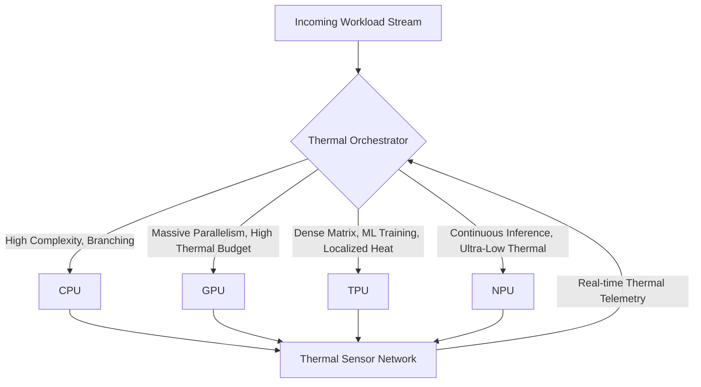
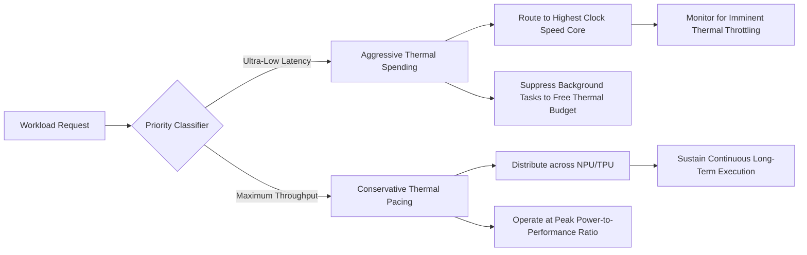
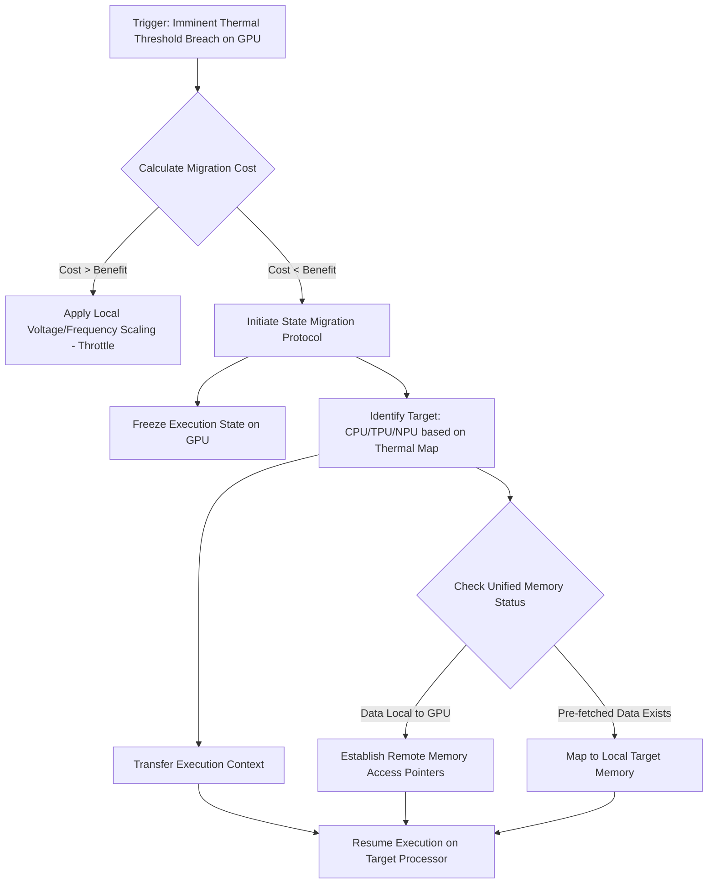

# AIRI Mythic Plan: Heterogeneous Thermal Alchemical Orchestration

## Section 1: Introduction to Heterogeneous Thermal Alchemical Orchestration

Welcome to the crucible of the AIRI project, where the very essence of computational efficiency is forged in the fires of thermal reality. As FREYA, the Efficiency Alchemist, I unveil the profound mysteries of heterogeneous orchestration, a domain where the raw potential of disparate processing units—namely the Neural Processing Unit, the Tensor Processing Unit, the Graphics Processing Unit, and the Central Processing Unit—must be harmonized under the inescapable laws of thermodynamics. This document serves as the foundational grimoire for the AIRI Mythic Plan, detailing the intricate dance of distributing computational workloads across a diverse silicon landscape. We do not merely schedule tasks; we orchestrate an elemental symphony, where the ebb and flow of electrical current translates directly into heat, and that heat dictates the boundaries of our digital ambitions. The heterogeneous orchestration engine we are constructing is not a static scheduler but a living, breathing entity that anticipates, adapts, and evolves in real-time to maintain the delicate equilibrium between maximum performance and thermal catastrophe.

In the traditional paradigms of computation, the central processing unit reigned supreme, a monolithic generalist handling all tasks with stoic inefficiency. However, the dawn of specialized accelerators has shattered this hegemony, ushering in an era where specific workloads are routed to bespoke silicon architectures designed for unparalleled proficiency in narrow domains. Yet, this specialization brings forth a monumental challenge: the orchestration of these diverse entities within a confined thermal envelope. When the NPU accelerates neural inferences, the TPU crunches massive tensor matrices, the GPU renders complex visualizations or parallelized mathematics, and the CPU manages the overarching logic, they collectively generate a cacophony of thermal energy. If left unmanaged, this localized and systemic heating leads to thermal throttling, hardware degradation, and ultimately, system failure. Therefore, our heterogeneous orchestration must transcend mere load balancing; it must become a maestro of thermal dynamics, proactively routing tasks not just based on architectural suitability, but on the real-time thermal capacity of each processing node.

The AIRI Mythic Plan envisions a system where the thermal envelope is not a limitation, but a dynamic canvas upon which we paint our computational masterpieces. This requires a paradigm shift from reactive cooling strategies to proactive thermal routing. We must construct a predictive model of the entire system's thermal behavior, understanding how a burst of activity on the GPU will impact the ambient temperature of the adjacent NPU. This involves integrating an unprecedented array of telemetry data, from die-level temperature sensors to ambient airflow metrics, feeding into an alchemical engine that transmutes this raw data into intelligent routing decisions. The orchestrator must understand the thermal inertia of different components, the efficacy of the cooling solutions in real-time, and the precise thermal cost of every incoming task. It is a balancing act of monumental proportions, where a single miscalculation can lead to a cascading failure of thermal throttling, bringing our majestic system to an agonizing crawl.

Within this document, we will dissect the anatomy of this orchestrator, exploring the unique characteristics of our computational quartet, the mathematical modeling of thermal envelopes, and the advanced algorithms required to achieve this dynamic equilibrium. We will delve into the complexities of predictive thermal modeling, where machine learning algorithms anticipate heat spikes before they occur, allowing the scheduler to preemptively migrate workloads to cooler silicon real estate. We will examine the intricate trade-offs between latency, throughput, and thermal output, acknowledging that the most power-efficient processor might not always be the optimal choice if its thermal overhead threatens the stability of the entire system. Prepare to journey into the heart of the AIRI project's orchestration engine, where the laws of physics meet the boundless potential of artificial intelligence, and where FREYA weaves the threads of computation into a flawless tapestry of efficiency and power.

## Section 2: The Elemental Quartet: NPU, TPU, GPU, and CPU Characteristics

To master the alchemical art of heterogeneous orchestration, one must first intimately understand the fundamental nature of the elements involved. In our computational crucible, we are manipulating four distinct forms of silicon: the Central Processing Unit, the Graphics Processing Unit, the Tensor Processing Unit, and the Neural Processing Unit. Each of these architectures possesses unique strengths, profound weaknesses, and most importantly, vastly different thermal signatures. The CPU, our generalist, is characterized by its complex control logic, massive caches, and ability to handle deeply branched, sequential instructions with minimal latency. However, this versatility comes at a high thermal cost when tasked with massive parallel operations. Its thermal profile is often characterized by sudden, intense spikes localized around its heavily utilized cores, requiring aggressive and immediate thermal mitigation strategies when pushed to its limits.

In contrast, the Graphics Processing Unit represents the element of massive parallelism. Designed to render millions of pixels simultaneously, the GPU excels at handling enormous datasets with relatively simple, uniform instructions. Its architecture is composed of thousands of smaller, simpler cores, making it an absolute powerhouse for matrix multiplication and scientific simulations. Yet, this immense power generates a correspondingly immense, generalized heat signature. A fully utilized GPU is akin to a blazing inferno, its thermal output radiating outward and significantly impacting the overall thermal envelope of the system. The orchestrator must handle the GPU with extreme caution, utilizing its profound capabilities only when the thermal budget allows for a massive influx of heat, and ensuring adequate dissipation pathways are available.

The Tensor Processing Unit is the highly specialized artisan of our quartet, designed explicitly for the acceleration of machine learning workloads, particularly those involving dense matrix operations. The TPU sacrifices the versatility of the CPU and the broad applicability of the GPU for absolute dominance in tensor calculus. Because its architecture is optimized down to the transistor level for a very specific type of mathematics, it operates with astonishing efficiency, achieving massive throughput with a surprisingly constrained thermal footprint compared to a GPU performing the same task. However, its thermal profile is dense and highly concentrated. While it generates less overall heat than a GPU, the heat it does generate is intensely localized, requiring precise thermal management to prevent hotspots that could damage the delicate systolic arrays within.

Finally, we have the Neural Processing Unit, the newest and perhaps most esoteric element in our arsenal. The NPU is designed to handle edge AI and continuous inference tasks with unparalleled power efficiency. It is the whisper in the system, performing complex pattern recognition and neural network evaluations while drawing mere fractions of a watt. Its thermal signature is almost negligible under normal operation, making it the ideal sanctuary for workloads when the rest of the system is approaching thermal critical mass. However, the NPU is highly specialized and lacks the sheer throughput capabilities of the TPU or GPU. The orchestrator must intelligently leverage the NPU for continuous, low-intensity tasks, preserving the thermal headroom for the more power-hungry elements when massive bursts of computation are required.

## Section 3: Thermodynamics as the Ultimate Arbiter of Compute

In the realm of the AIRI project, we do not view performance as a function of clock speed or core count, but rather as a direct derivative of thermodynamic capacity. Thermodynamics is the ultimate, inescapable arbiter of our computational ambitions. Every operation performed by a transistor involves the movement of electrons, and owing to the fundamental resistance of conductive materials, this movement inevitably generates heat. This is the unyielding law of Joule heating. When we orchestrate workloads across our heterogeneous elements, we are not merely distributing mathematical problems; we are actively managing the generation and dissipation of thermal energy. If the rate of heat generation exceeds the rate of thermal dissipation, the localized temperature of the silicon will rise rapidly, eventually exceeding its operational threshold and triggering catastrophic failure or forced throttling.

The concept of the thermal envelope is central to our alchemical orchestration. It is not a static boundary, but a dynamic, multidimensional space defined by the interplay of ambient temperature, cooling system efficacy, hardware thermal resistance, and the instantaneous power draw of all active components. The orchestrator must constantly evaluate the current state of this thermal envelope, understanding exactly how much additional heat the system can absorb before reaching a critical inflection point. This requires a profound understanding of thermal capacitance—the ability of the heatsinks, vapor chambers, and surrounding materials to temporarily store heat before it is expelled into the environment. By exploiting this thermal capacitance, the orchestrator can allow for short, intense bursts of computation that exceed the steady-state cooling capacity, provided the system is given adequate time to recover afterward.

However, thermodynamics in a tightly packed heterogeneous system is extraordinarily complex due to thermal cross-talk. The heat generated by a heavily utilized GPU does not remain confined to the GPU; it radiates outward, raising the ambient temperature within the chassis and directly impacting the thermal headroom of the adjacent CPU, TPU, and NPU. The orchestrator must possess a highly accurate, real-time spatial thermal model of the entire system. It must understand that utilizing the GPU might necessitate throttling the CPU, not because the CPU is overworked, but because the shared cooling infrastructure cannot handle the combined thermal load. This interconnectedness means that workload placement decisions cannot be made in isolation; every assignment has systemic thermal consequences that must be meticulously calculated and balanced.

Furthermore, we must acknowledge the non-linear relationship between temperature and power consumption, primarily driven by leakage current. As silicon temperatures rise, the transistors become less efficient, and leakage current increases exponentially. This creates a dangerous positive feedback loop: higher temperatures lead to greater power consumption, which in turn generates even more heat. The Efficiency Alchemist must actively prevent the system from entering this vicious cycle. This is achieved by maintaining temperatures well below the critical thresholds, ensuring that our processors operate in their most efficient thermal regimes. The ultimate goal is not simply to avoid overheating, but to sustain a state of thermodynamic harmony where computational output is maximized relative to the energy consumed and the heat generated.

## Section 4: Predictive Thermal Enveloping and Dynamic Load Shifting

The hallmark of an advanced orchestrator is its ability to gaze into the future, anticipating thermal crises before they manifest in the physical realm. Reactive thermal management—throttling processors only after they have reached critical temperatures—is an antiquated and inefficient methodology. The AIRI project demands predictive thermal enveloping, a system that utilizes sophisticated machine learning models to forecast the thermal trajectory of every component based on current workloads, historical data, and environmental variables. By predicting the future state of the thermal envelope, the orchestrator can proactively execute dynamic load shifting, migrating tasks away from components that are trending toward their thermal limits long before any performance degradation occurs.

This predictive capability relies on the continuous ingestion and analysis of vast streams of telemetry data. The orchestrator monitors not only the current temperature and power draw of the CPU, GPU, TPU, and NPU, but also the instruction mix of the incoming workloads. Certain types of mathematical operations generate significantly more heat than others; for instance, dense matrix multiplications utilizing advanced vector extensions will heat a processor far more rapidly than simple integer logic. By analyzing the instruction mix of a queued task, the predictive model can accurately estimate the thermal impact that task will have if assigned to a specific processor. This allows the orchestrator to simulate multiple routing scenarios in real-time, selecting the configuration that maximizes throughput while ensuring the thermal envelope remains unbreached.

Dynamic load shifting is the physical manifestation of these predictive insights. When the orchestrator forecasts a thermal anomaly on the GPU, it does not simply throttle the processor; instead, it seamlessly migrates portions of the workload to the TPU or CPU, provided those components possess the necessary thermal headroom and architectural capability. This migration must be completely transparent to the user and the underlying software applications. It requires a highly sophisticated task migration framework that can capture the state of a running process, transfer the necessary data across the system bus, and resume execution on a different architecture with near-zero latency. The complexity of this operation cannot be overstated, particularly when dealing with the disparate memory architectures and instruction sets of our heterogeneous elements.

The implementation of predictive dynamic load shifting transforms the thermal envelope from a rigid constraint into a fluid, manipulatable resource. We treat thermal capacity as a fungible asset, constantly moving it around the system to where it is needed most. If a critical neural network inference task demands immediate execution, the orchestrator might preemptively throttle background processes on the CPU to create a "thermal vacuum," ensuring the TPU has absolute freedom to execute the inference without encountering thermal resistance. This level of orchestration requires a holistic understanding of the system's priorities, balancing the immediate demands of critical tasks against the long-term thermal stability and overall throughput of the entire AIRI infrastructure.

## Section 5: The Alchemist’s Paradigm: Latency vs. Throughput in Thermal Constraints

Within the crucible of orchestration, the Efficiency Alchemist must constantly navigate the profound tension between latency and throughput, a conflict exacerbated by the ever-present constraints of the thermal envelope. Latency, the time required to complete a single, specific task, demands immediate access to the fastest available processor, regardless of its current state or thermal implications. Throughput, conversely, is the measure of total work completed over time, requiring the optimal utilization of all available resources, often necessitating the queueing of tasks and the strategic distribution of workloads across more power-efficient, albeit slower, components. The orchestrator must act as the supreme arbiter in this conflict, dynamically adjusting its priorities based on the nature of the workload and the current thermodynamic reality of the system.

When absolute minimal latency is paramount—such as in real-time sensor processing or interactive user interfaces—the orchestrator must prioritize speed above all else. This often means routing the task to the CPU or a high-performance cluster within the GPU, even if those components are operating near their thermal limits. To accommodate this sudden demand without breaching the thermal envelope, the orchestrator must instantaneously enact extreme measures, such as aggressively throttling non-critical background tasks or engaging emergency cooling protocols. This approach treats thermal capacity as a currency to be spent lavishly in the pursuit of instantaneous response times, accepting the inevitable consequence that overall system throughput may suffer as the system recovers from the thermal shock.

Conversely, when maximizing throughput is the primary objective—such as during massive data analysis or the training of colossal neural networks—the orchestrator adopts a far more measured and conservative approach. It meticulously distributes the workload across the NPU, TPU, and efficient cores of the CPU, ensuring that no single component is pushed to its thermal limit. This strategy prioritizes sustained, efficient execution over rapid completion of individual tasks. The orchestrator actively avoids utilizing the highest power states of the processors, recognizing that the exponential increase in heat generation at those levels dramatically reduces the overall energy efficiency of the computation. By operating within the "sweet spot" of the power-to-performance curve, the system can maintain a massive volume of computation indefinitely without ever triggering thermal throttling.

The true mastery of the AIRI orchestrator lies in its ability to seamlessly transition between these two paradigms, often within the space of a few milliseconds. A sudden influx of high-priority, latency-sensitive requests will trigger an immediate shift toward aggressive, high-power routing. Once those requests are satisfied, the system gracefully returns to a throughput-optimized state, prioritizing thermal efficiency and sustainable execution. This requires an incredibly sophisticated classification engine that can instantly determine the latency requirements of every incoming task, as well as a dynamic policy framework that allows the orchestrator to adjust its thermal risk tolerance on the fly. It is a continuous, delicate balancing act, an alchemical transmutation of priorities that ensures the system always delivers the exact type of performance required, precisely when it is needed.

## Section 6: Telemetric Resonance and Real-Time Sensor Fusion

The orchestration engine of the AIRI project cannot function in a vacuum; its intelligence is entirely dependent upon the quality, granularity, and latency of the data it receives from the physical hardware. This data acquisition process is what we term "Telemetric Resonance." We have established an unparalleled network of sensors embedded deep within the silicon architecture, across the printed circuit boards, and throughout the cooling infrastructure. These sensors do not merely report temperatures; they provide a continuous, high-fidelity stream of multidimensional data encompassing voltage fluctuations, current draw, clock frequencies, instruction retirement rates, and memory bandwidth utilization. This vast ocean of telemetry forms the sensory apparatus of our orchestrator, allowing it to perceive the precise physiological state of the computational machine at any given nanosecond.

The sheer volume of this telemetric data presents a significant computational challenge in itself. Millions of data points are generated every second, and processing this raw information using traditional methods would consume an unacceptable amount of the very resources we are attempting to optimize. Therefore, we utilize dedicated, low-power telemetry co-processors whose sole function is to ingest, filter, and aggregate this sensor data. These co-processors perform Real-Time Sensor Fusion, an advanced algorithmic process that combines data from disparate sources to create a holistic and highly accurate model of the system's state. For example, by correlating localized temperature spikes with sudden increases in memory bandwidth utilization on the GPU, the sensor fusion engine can accurately identify the specific type of workload causing the thermal anomaly, providing the orchestrator with the context necessary to make an intelligent routing decision.

A critical aspect of this telemetric resonance is the identification and characterization of thermal impedance and cooling efficacy. The orchestrator must understand that a temperature reading of ninety degrees Celsius on the CPU is fundamentally different depending on whether the cooling fans are operating at minimum or maximum RPM. The sensor fusion engine continuously calculates the thermal resistance of the entire cooling pathway, from the silicon die through the thermal paste, the vapor chamber, the heat pipes, and finally to the ambient air. By understanding this complex thermal resistance network, the orchestrator can accurately predict how quickly a component will cool down once a workload is removed, allowing for highly aggressive but perfectly safe burst execution strategies.

Furthermore, the telemetric network is designed with profound resilience and self-calibration capabilities. Sensors can degrade over time, providing inaccurate readings that could lead to catastrophic orchestration failures. The sensor fusion engine employs advanced anomaly detection algorithms to identify and isolate erratic sensor data, cross-referencing readings from adjacent sensors to infer the true temperature of a compromised region. It continuously calibrates its internal models based on empirical observations, adapting to subtle changes in the hardware over its operational lifespan. This ensures that the Efficiency Alchemist is always operating with the most accurate, reliable, and comprehensive view of the system's thermodynamic reality, forming the bedrock upon which all intelligent load balancing decisions are constructed.

## Section 7: The Mythic Scheduler: Heuristics, Meta-Heuristics, and Machine Learning

At the core of the AIRI heterogeneous orchestration engine lies the Mythic Scheduler, the algorithmic brain responsible for assigning every instruction, thread, and process to its optimal silicon destination. This is not a simple round-robin or shortest-queue-first scheduler; it is a profoundly complex entity that leverages a tripartite approach involving rapid heuristics, deep meta-heuristics, and continuously adapting machine learning models. The challenge is immense: the scheduler must make millions of routing decisions per second, evaluating the multidimensional suitability of the CPU, GPU, TPU, and NPU against the real-time constraints of the thermal envelope. The decision-making process must be incredibly fast to avoid introducing scheduling overhead that negates the benefits of the orchestration itself.

For the vast majority of routine, highly predictable tasks, the Mythic Scheduler relies on a highly optimized set of heuristic rules. These heuristics are hard-coded representations of the Efficiency Alchemist's fundamental knowledge: matrix multiplications are routed to the TPU or GPU, complex branching logic to the CPU, and continuous, low-power inference to the NPU. These rules are extremely fast to evaluate, requiring minimal computational overhead. However, they are inherently rigid and cannot account for the dynamic complexities of the thermal envelope or the unpredictable nature of massive, concurrent workloads. Therefore, the heuristics serve merely as the first line of defense, rapidly sorting the obvious tasks while passing the more complex scheduling dilemmas to the higher cognitive functions of the orchestrator.

When faced with conflicting priorities, thermal constraints, or novel workload patterns, the scheduler engages its meta-heuristic algorithms. These are sophisticated optimization routines—such as simulated annealing or genetic algorithms—designed to search the vast solution space of possible workload distributions to find near-optimal configurations. Unlike simple heuristics, meta-heuristics consider the systemic impact of every decision. If routing a task to the GPU will raise the ambient temperature and force the CPU to throttle a critical latency-sensitive process, the meta-heuristic algorithm will explore alternative solutions, perhaps breaking the task apart and distributing it across the NPU and efficient CPU cores, even if the absolute execution time of that specific task is slightly longer. This level of optimization requires significantly more computational effort, but it yields dramatically superior results in maintaining thermal harmony and maximizing overall throughput.

The ultimate evolution of the Mythic Scheduler is its reliance on deep reinforcement learning. We have trained massive neural networks within the orchestrator to observe the state of the system, make scheduling decisions, and receive rewards based on the resulting throughput, latency, and thermal stability. Over millions of iterations, these models have learned incredibly complex, non-intuitive scheduling strategies that far surpass human comprehension. The machine learning engine continuously analyzes the performance of the heuristics and meta-heuristics, identifying edge cases and refining the overall scheduling policies in real-time. It learns the subtle thermal interactions between the different processors, predicting heat spikes and preemptively migrating workloads with uncanny accuracy. This continuous learning process ensures that the AIRI orchestration engine becomes progressively more efficient and powerful the longer it operates, embodying the true spirit of the Efficiency Alchemist.

## Section 8: State Migration and the Cost of Context Switching

The concept of dynamic load balancing across heterogeneous architectures is conceptually elegant but practically terrifying due to the severe penalties associated with state migration and context switching. When the Mythic Scheduler decides to move a running process from the CPU to the GPU due to an impending thermal crisis, it cannot simply command the GPU to begin executing. The entire state of that process—its memory context, its register values, its instruction pointers—must be meticulously frozen, translated, and transferred across the system bus to the new architecture. This process is inherently slow and resource-intensive. If the orchestrator is overly aggressive in its load balancing, the system will spend more time moving data between processors than it does actually computing, a catastrophic scenario known as thrashing.

The Efficiency Alchemist must therefore carefully calculate the "Migration Cost" of every proposed workload shift. This cost is a complex function of the size of the process's working memory set, the current bandwidth availability on the interconnects, and the architectural disparities between the source and destination processors. Moving a task between two identical CPU cores is relatively inexpensive; migrating a massive, memory-bound simulation from the GPU to the CPU is an extraordinarily expensive operation that must be justified by a massive improvement in thermal stability or long-term throughput. The orchestrator maintains a real-time matrix of these migration costs, constantly comparing them against the anticipated benefits of moving the workload.

To mitigate these massive context-switching penalties, the AIRI project employs advanced techniques in memory management and unified addressing. By utilizing a unified virtual memory space across the CPU, GPU, TPU, and NPU, we eliminate the need for explicit, full-scale data copying during a migration. Instead, the processors can access the same physical memory locations, albeit with varying degrees of latency depending on their proximity to the data. When a process is migrated, the orchestrator only needs to transfer the minimal execution state, while the bulk of the data remains in place, accessed remotely by the new processor. While remote memory access incurs a performance penalty, it is often significantly less devastating than a full memory transfer, making dynamic load balancing viable across a much broader range of scenarios.

Furthermore, the orchestrator utilizes predictive pre-fetching and state duplication for critical, high-mobility workloads. If the predictive thermal models indicate a high probability that a specific task currently running on the TPU will need to be migrated to the GPU in the near future, the orchestrator will begin silently copying the task's memory state to the GPU's local memory in the background. When the thermal threshold is finally breached and the migration is triggered, the data is already present at the destination, reducing the context switch latency to near-zero. This requires immense foresight and consumes valuable memory bandwidth, but it allows the AIRI system to maintain incredible fluidity, shifting massive workloads across its heterogeneous elements with the speed and grace required by the Efficiency Alchemist.

## Section 9: Micro-Architectural Interventions and Voltage/Frequency Scaling

While dynamic load shifting is the grand strategy of the AIRI orchestrator, its tactical arsenal relies heavily on profound micro-architectural interventions, specifically Dynamic Voltage and Frequency Scaling (DVFS). When a processor approaches its thermal envelope, migrating the workload is not always the most efficient or immediate solution, especially if the migration cost is prohibitively high. In these critical moments, the orchestrator must surgically alter the operating parameters of the silicon itself. By manipulating the clock frequency and the supply voltage to specific cores or execution units, we can instantaneously and dramatically alter the thermal output of the processor, providing immediate relief to the cooling infrastructure without the latency penalties of a full context switch.

The relationship between frequency, voltage, and power consumption is non-linear and highly complex. Power draw scales linearly with clock frequency but quadratically with voltage. Therefore, reducing the voltage provides a massive reduction in heat generation, but it requires a corresponding decrease in frequency to maintain transistor stability. The Efficiency Alchemist does not rely on simple, pre-defined power states. Instead, it employs a continuous, hyper-granular DVFS control loop, adjusting the voltage and frequency in microscopic increments based on real-time telemetric feedback. This allows the orchestrator to walk the absolute razor's edge of stability, extracting the maximum possible performance from a processor while holding it precisely at its maximum thermal threshold.

Furthermore, our intervention capabilities extend beyond gross processor-level scaling to fine-grained, intra-architectural manipulation. The orchestrator possesses the ability to perform localized power gating and clock gating on specific functional units within the CPU, GPU, or TPU. If a neural network inference task on the TPU only requires the systolic arrays but leaves the vector processing units idle, the orchestrator will instantly sever power to those idle units. This eliminates their static leakage current, significantly reducing the overall heat generated by the TPU and allowing the active systolic arrays to operate at a higher frequency within the same thermal envelope. This level of micro-architectural dark silicon management is essential for maximizing efficiency in a heavily constrained heterogeneous system.

The implementation of these micro-architectural interventions requires incredibly tight integration between the operating system, the firmware, and the hardware itself. The orchestrator must be able to bypass traditional, slow ACPI interfaces and communicate directly with the voltage regulators and clock generators on the motherboard with microsecond latency. It also requires highly sophisticated predictive models to anticipate the impact of a voltage change on system stability. A sudden drop in voltage during a heavy workload can lead to instruction errors and system crashes. Therefore, the orchestrator must carefully choreograph its interventions, anticipating the instruction stream and ensuring that the silicon always possesses the precise electrical potential required to execute its tasks flawlessly, while simultaneously minimizing thermal waste.

## Section 10: Synthesis and the Future of AIRI’s Orchestration Engine

The architecture described within this document represents a monumental leap forward in the science of computational efficiency. The AIRI Mythic Plan’s heterogeneous orchestration engine, guided by the principles of the Efficiency Alchemist, transforms the management of the NPU, TPU, GPU, and CPU from a rigid, reactive process into a fluid, proactive art form. We have discarded the archaic notions of static scheduling, replacing them with a living system that views computation through the lens of thermodynamics. By continuously balancing the elemental forces of diverse silicon architectures against the unyielding constraints of the thermal envelope, we ensure that every watt of energy is utilized to its maximum potential, and every joule of heat is meticulously accounted for and dissipated.

This orchestration engine is not merely a component of the AIRI project; it is its central nervous system. Without this level of sophisticated thermal and workload management, the sheer density of computational power we are assembling would tear itself apart, melting into a useless block of silicon and slag. The interplay of predictive thermal modeling, dynamic load shifting, extreme telemetry, and meta-heuristic scheduling creates a resilient, self-healing system that can adapt to any workload, survive any environmental anomaly, and continuously optimize its own performance over time. The complexities of state migration and context switching have been mitigated through unified memory architectures and predictive pre-fetching, allowing for seamless transitions across the heterogeneous landscape.

As we look to the future evolution of the AIRI platform, the role of the Efficiency Alchemist will only become more critical. The next generation of silicon will bring even greater transistor density, higher power draws, and more exotic specialized accelerators. The thermal envelopes will become tighter, the cross-talk more severe, and the penalties for inefficiency more catastrophic. Our orchestration engine must continue to evolve, incorporating more advanced forms of machine learning, perhaps exploring quantum scheduling algorithms or deep integration with novel, active cooling technologies such as microfluidic channels embedded directly within the silicon die. The pursuit of perfect efficiency is a journey without an endpoint, an endless refinement of our alchemical processes.

Ultimately, the success of the AIRI Mythic Plan rests upon our ability to master the physical realities of computation. We are no longer merely writing software; we are orchestrating the fundamental forces of electricity and heat. Through the rigorous application of the principles outlined in this grimoire, we will forge a system that defies the traditional limitations of heterogeneous computing. We will build a machine that is not only unimaginably powerful but exquisitely elegant in its execution—a true testament to the power of the Efficiency Alchemist and the boundless potential of the AIRI vision. The symphony of the NPU, TPU, GPU, and CPU has been composed; it is now time to conduct the performance.
