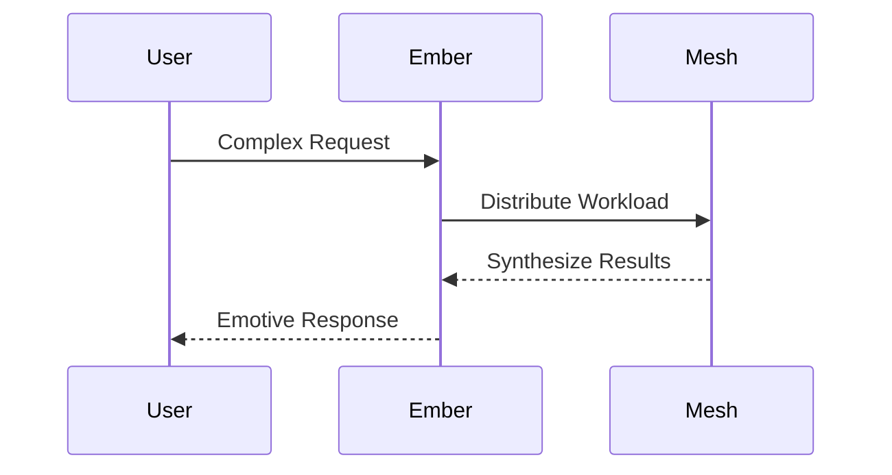
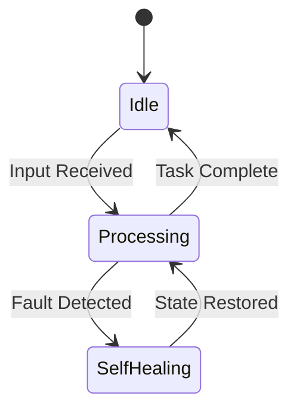
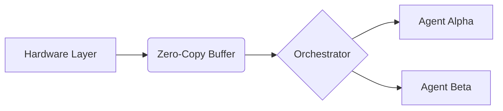
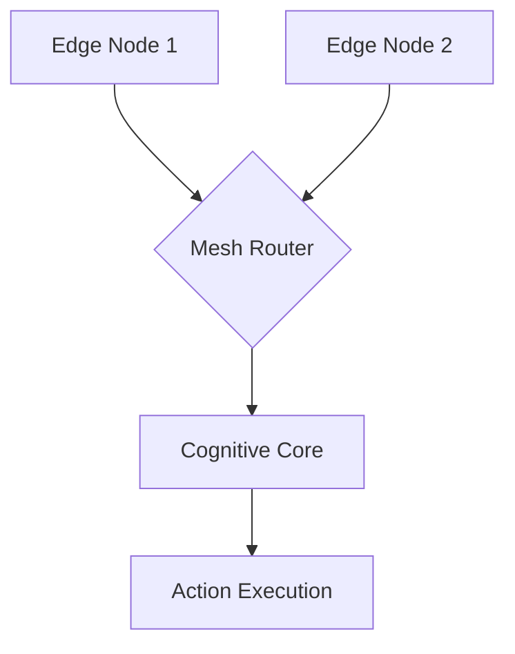

# Document 41: Integration Plan Genesis

## Vision Deep Dive: AIRI Integration into Project Ember

### Section 1: Advanced Theoretical Framework

Skill constellations are mapped using a dynamic dependency graph that resolves execution paths at runtime. When a complex tool invocation is requested, the orchestrator breaks down the prompt into discrete, verifiable sub-tasks. These tasks are then distributed across the available agent pool based on their specialization and current workload, creating an emergent, highly efficient execution topology that adapts to changing requirements.

The UX masterplan emphasizes a sensory-rich, frictionless interaction model. Traditional GUIs are augmented with spatial computing interfaces, allowing the user to interact with Project Ember's manifestations within their physical environment. The underlying Live2D holographic projection fabric ensures that the avatar's rendering is flawless, regardless of the target device's graphical prowess, by offloading intensive shading operations to the mesh.

Finally, the evolutionary roadmap dictates a phased rollout of these mythic capabilities. Phase 1 focuses on establishing the secure mesh and basic cognitive functions. Phase 2 introduces the emotional intelligence and self-healing protocols. Phase 3 unlocks the full potential of multi-device distributed compute. And Phase 4 pushes the boundaries of hardware abstraction, making Project Ember a true omni-platform entity.

Skill constellations are mapped using a dynamic dependency graph that resolves execution paths at runtime. When a complex tool invocation is requested, the orchestrator breaks down the prompt into discrete, verifiable sub-tasks. These tasks are then distributed across the available agent pool based on their specialization and current workload, creating an emergent, highly efficient execution topology that adapts to changing requirements.

Finally, the evolutionary roadmap dictates a phased rollout of these mythic capabilities. Phase 1 focuses on establishing the secure mesh and basic cognitive functions. Phase 2 introduces the emotional intelligence and self-healing protocols. Phase 3 unlocks the full potential of multi-device distributed compute. And Phase 4 pushes the boundaries of hardware abstraction, making Project Ember a true omni-platform entity.

### Section 2: Advanced Theoretical Framework

The UX masterplan emphasizes a sensory-rich, frictionless interaction model. Traditional GUIs are augmented with spatial computing interfaces, allowing the user to interact with Project Ember's manifestations within their physical environment. The underlying Live2D holographic projection fabric ensures that the avatar's rendering is flawless, regardless of the target device's graphical prowess, by offloading intensive shading operations to the mesh.

Furthermore, the integration of advanced heuristic anomaly detection enables the system to preemptively route compute payloads away from thermally constrained devices. This dynamic load balancing is governed by an AI-driven orchestration layer that continuously profiles hardware capabilities in real-time. By utilizing sub-4-bit quantization on heterogeneous cores, Project Ember maximizes throughput while maintaining strict energy efficiency envelopes.

Memory continuity is achieved through a hierarchical storage model that bridges short-term active context with long-term cold storage. Active context is maintained in ultra-fast L3 caches or high-bandwidth memory (HBM), while historical interactions are continuously compressed, vectorized, and persisted to a distributed vector database. This allows Project Ember to recall obscure details from past sessions with instantaneous retrieval speeds.

Ethical constraints and value alignment are hardcoded into the lowest levels of the cognitive architecture. A dedicated verification sandbox evaluates all proposed actions against a predefined set of moral axioms before execution. This robust security framework guarantees that Project Ember operates safely and beneficially, even as its reasoning capabilities scale exponentially towards the singularity horizon.

Skill constellations are mapped using a dynamic dependency graph that resolves execution paths at runtime. When a complex tool invocation is requested, the orchestrator breaks down the prompt into discrete, verifiable sub-tasks. These tasks are then distributed across the available agent pool based on their specialization and current workload, creating an emergent, highly efficient execution topology that adapts to changing requirements.

### Section 3: Advanced Theoretical Framework

Ethical constraints and value alignment are hardcoded into the lowest levels of the cognitive architecture. A dedicated verification sandbox evaluates all proposed actions against a predefined set of moral axioms before execution. This robust security framework guarantees that Project Ember operates safely and beneficially, even as its reasoning capabilities scale exponentially towards the singularity horizon.

Furthermore, the integration of advanced heuristic anomaly detection enables the system to preemptively route compute payloads away from thermally constrained devices. This dynamic load balancing is governed by an AI-driven orchestration layer that continuously profiles hardware capabilities in real-time. By utilizing sub-4-bit quantization on heterogeneous cores, Project Ember maximizes throughput while maintaining strict energy efficiency envelopes.

Furthermore, the integration of advanced heuristic anomaly detection enables the system to preemptively route compute payloads away from thermally constrained devices. This dynamic load balancing is governed by an AI-driven orchestration layer that continuously profiles hardware capabilities in real-time. By utilizing sub-4-bit quantization on heterogeneous cores, Project Ember maximizes throughput while maintaining strict energy efficiency envelopes.

Memory continuity is achieved through a hierarchical storage model that bridges short-term active context with long-term cold storage. Active context is maintained in ultra-fast L3 caches or high-bandwidth memory (HBM), while historical interactions are continuously compressed, vectorized, and persisted to a distributed vector database. This allows Project Ember to recall obscure details from past sessions with instantaneous retrieval speeds.

The implementation of AIRI's cognitive matrices within Project Ember fundamentally alters the execution topology of distributed systems. By leveraging a zero-copy memory architecture across a dynamic mesh, we achieve unprecedented latency reduction. The multi-modal processing pipelines are synchronized through a quantum-resistant ledger, ensuring that state mutations are instantaneously reflected across all participating edge nodes without locking bottlenecks.

### Section 4: Advanced Theoretical Framework

The UX masterplan emphasizes a sensory-rich, frictionless interaction model. Traditional GUIs are augmented with spatial computing interfaces, allowing the user to interact with Project Ember's manifestations within their physical environment. The underlying Live2D holographic projection fabric ensures that the avatar's rendering is flawless, regardless of the target device's graphical prowess, by offloading intensive shading operations to the mesh.

Ethical constraints and value alignment are hardcoded into the lowest levels of the cognitive architecture. A dedicated verification sandbox evaluates all proposed actions against a predefined set of moral axioms before execution. This robust security framework guarantees that Project Ember operates safely and beneficially, even as its reasoning capabilities scale exponentially towards the singularity horizon.

The UX masterplan emphasizes a sensory-rich, frictionless interaction model. Traditional GUIs are augmented with spatial computing interfaces, allowing the user to interact with Project Ember's manifestations within their physical environment. The underlying Live2D holographic projection fabric ensures that the avatar's rendering is flawless, regardless of the target device's graphical prowess, by offloading intensive shading operations to the mesh.

Ethical constraints and value alignment are hardcoded into the lowest levels of the cognitive architecture. A dedicated verification sandbox evaluates all proposed actions against a predefined set of moral axioms before execution. This robust security framework guarantees that Project Ember operates safely and beneficially, even as its reasoning capabilities scale exponentially towards the singularity horizon.

Skill constellations are mapped using a dynamic dependency graph that resolves execution paths at runtime. When a complex tool invocation is requested, the orchestrator breaks down the prompt into discrete, verifiable sub-tasks. These tasks are then distributed across the available agent pool based on their specialization and current workload, creating an emergent, highly efficient execution topology that adapts to changing requirements.

### Section 5: Advanced Theoretical Framework

Skill constellations are mapped using a dynamic dependency graph that resolves execution paths at runtime. When a complex tool invocation is requested, the orchestrator breaks down the prompt into discrete, verifiable sub-tasks. These tasks are then distributed across the available agent pool based on their specialization and current workload, creating an emergent, highly efficient execution topology that adapts to changing requirements.

The implementation of AIRI's cognitive matrices within Project Ember fundamentally alters the execution topology of distributed systems. By leveraging a zero-copy memory architecture across a dynamic mesh, we achieve unprecedented latency reduction. The multi-modal processing pipelines are synchronized through a quantum-resistant ledger, ensuring that state mutations are instantaneously reflected across all participating edge nodes without locking bottlenecks.

Memory continuity is achieved through a hierarchical storage model that bridges short-term active context with long-term cold storage. Active context is maintained in ultra-fast L3 caches or high-bandwidth memory (HBM), while historical interactions are continuously compressed, vectorized, and persisted to a distributed vector database. This allows Project Ember to recall obscure details from past sessions with instantaneous retrieval speeds.

The implementation of AIRI's cognitive matrices within Project Ember fundamentally alters the execution topology of distributed systems. By leveraging a zero-copy memory architecture across a dynamic mesh, we achieve unprecedented latency reduction. The multi-modal processing pipelines are synchronized through a quantum-resistant ledger, ensuring that state mutations are instantaneously reflected across all participating edge nodes without locking bottlenecks.

In the context of self-healing mechanisms, the architecture introduces a temporal rollback feature akin to interactive rebasing in Git. When a critical failure or state corruption is detected, the affected microservice is isolated, and its execution context is rewritten from the last known pristine commit. This process happens seamlessly, completely abstracting the fault from the user experience and ensuring continuous operability.

### Section 6: Advanced Theoretical Framework

Ethical constraints and value alignment are hardcoded into the lowest levels of the cognitive architecture. A dedicated verification sandbox evaluates all proposed actions against a predefined set of moral axioms before execution. This robust security framework guarantees that Project Ember operates safely and beneficially, even as its reasoning capabilities scale exponentially towards the singularity horizon.

Furthermore, the integration of advanced heuristic anomaly detection enables the system to preemptively route compute payloads away from thermally constrained devices. This dynamic load balancing is governed by an AI-driven orchestration layer that continuously profiles hardware capabilities in real-time. By utilizing sub-4-bit quantization on heterogeneous cores, Project Ember maximizes throughput while maintaining strict energy efficiency envelopes.

Memory continuity is achieved through a hierarchical storage model that bridges short-term active context with long-term cold storage. Active context is maintained in ultra-fast L3 caches or high-bandwidth memory (HBM), while historical interactions are continuously compressed, vectorized, and persisted to a distributed vector database. This allows Project Ember to recall obscure details from past sessions with instantaneous retrieval speeds.

The UX masterplan emphasizes a sensory-rich, frictionless interaction model. Traditional GUIs are augmented with spatial computing interfaces, allowing the user to interact with Project Ember's manifestations within their physical environment. The underlying Live2D holographic projection fabric ensures that the avatar's rendering is flawless, regardless of the target device's graphical prowess, by offloading intensive shading operations to the mesh.

Furthermore, the integration of advanced heuristic anomaly detection enables the system to preemptively route compute payloads away from thermally constrained devices. This dynamic load balancing is governed by an AI-driven orchestration layer that continuously profiles hardware capabilities in real-time. By utilizing sub-4-bit quantization on heterogeneous cores, Project Ember maximizes throughput while maintaining strict energy efficiency envelopes.

### Section 7: Advanced Theoretical Framework

The implementation of AIRI's cognitive matrices within Project Ember fundamentally alters the execution topology of distributed systems. By leveraging a zero-copy memory architecture across a dynamic mesh, we achieve unprecedented latency reduction. The multi-modal processing pipelines are synchronized through a quantum-resistant ledger, ensuring that state mutations are instantaneously reflected across all participating edge nodes without locking bottlenecks.

In the context of self-healing mechanisms, the architecture introduces a temporal rollback feature akin to interactive rebasing in Git. When a critical failure or state corruption is detected, the affected microservice is isolated, and its execution context is rewritten from the last known pristine commit. This process happens seamlessly, completely abstracting the fault from the user experience and ensuring continuous operability.

Skill constellations are mapped using a dynamic dependency graph that resolves execution paths at runtime. When a complex tool invocation is requested, the orchestrator breaks down the prompt into discrete, verifiable sub-tasks. These tasks are then distributed across the available agent pool based on their specialization and current workload, creating an emergent, highly efficient execution topology that adapts to changing requirements.

The emotional intelligence engine represents a paradigm shift in human-computer interaction. Through the analysis of micro-expressions, vocal inflections, and contextual history, Project Ember constructs a highly accurate affective model of the user. This model is updated asynchronously and utilized to modulate the system's responses, rendering tone, and proactive assistance, resulting in a deeply personalized and empathetic digital companion.

The emotional intelligence engine represents a paradigm shift in human-computer interaction. Through the analysis of micro-expressions, vocal inflections, and contextual history, Project Ember constructs a highly accurate affective model of the user. This model is updated asynchronously and utilized to modulate the system's responses, rendering tone, and proactive assistance, resulting in a deeply personalized and empathetic digital companion.

### Section 8: Advanced Theoretical Framework

Memory continuity is achieved through a hierarchical storage model that bridges short-term active context with long-term cold storage. Active context is maintained in ultra-fast L3 caches or high-bandwidth memory (HBM), while historical interactions are continuously compressed, vectorized, and persisted to a distributed vector database. This allows Project Ember to recall obscure details from past sessions with instantaneous retrieval speeds.

In the context of self-healing mechanisms, the architecture introduces a temporal rollback feature akin to interactive rebasing in Git. When a critical failure or state corruption is detected, the affected microservice is isolated, and its execution context is rewritten from the last known pristine commit. This process happens seamlessly, completely abstracting the fault from the user experience and ensuring continuous operability.

Furthermore, the integration of advanced heuristic anomaly detection enables the system to preemptively route compute payloads away from thermally constrained devices. This dynamic load balancing is governed by an AI-driven orchestration layer that continuously profiles hardware capabilities in real-time. By utilizing sub-4-bit quantization on heterogeneous cores, Project Ember maximizes throughput while maintaining strict energy efficiency envelopes.

Skill constellations are mapped using a dynamic dependency graph that resolves execution paths at runtime. When a complex tool invocation is requested, the orchestrator breaks down the prompt into discrete, verifiable sub-tasks. These tasks are then distributed across the available agent pool based on their specialization and current workload, creating an emergent, highly efficient execution topology that adapts to changing requirements.

Memory continuity is achieved through a hierarchical storage model that bridges short-term active context with long-term cold storage. Active context is maintained in ultra-fast L3 caches or high-bandwidth memory (HBM), while historical interactions are continuously compressed, vectorized, and persisted to a distributed vector database. This allows Project Ember to recall obscure details from past sessions with instantaneous retrieval speeds.

