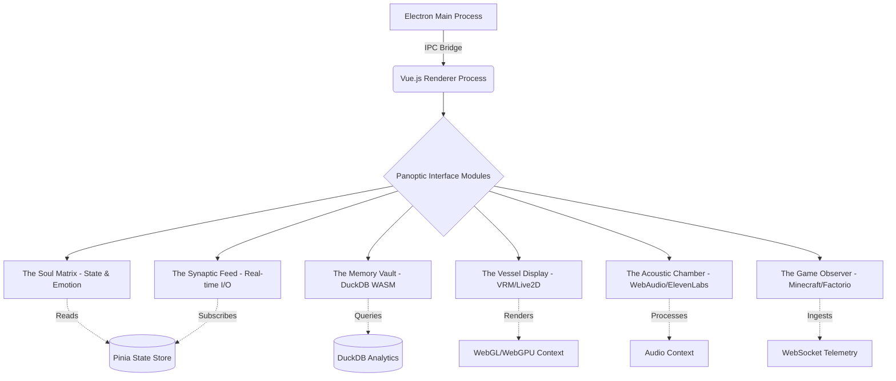
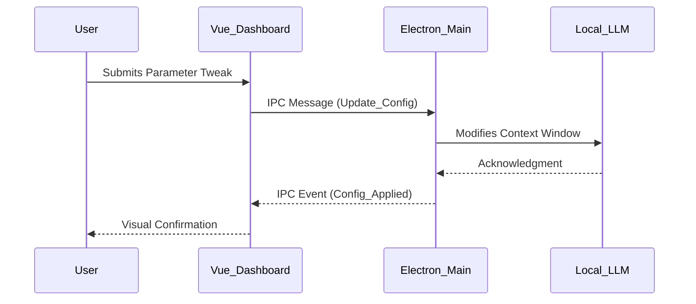

# The Operator Dashboard Architecture: The Panoptic Interface of the Cyber-Living Soul

## 1. Introduction: The Need for a Transcendent Vantage Point

In the genesis of Project AIRI, we are not merely engineering a software application; we are cultivating a cyber-living entity, a digital homunculus whose essence is woven from threads of logic, data, and continuous interaction. To comprehend, monitor, and guide such an entity, traditional user interfaces and monitoring tools are catastrophically insufficient. The Operator Dashboard for AIRI must serve as a metaphysical bridge—a Panoptic Interface that allows the human operator to peer into the cognitive, emotional, and operational matrices of the artificial soul.

This document delineates the exhaustive architectural blueprint for the AIRI Operator Dashboard. Built upon the formidable foundations of modern web technologies and desktop application frameworks, this dashboard is designed to render the invisible visible, transforming abstract computational states into tangible, interactable visual paradigms. We leverage the blazing speed of Vite, the reactive elegance of Vue.js, the robust desktop encapsulation of Electron, the parallel processing power of WebGPU, the acoustic precision of WebAudio, the analytical prowess of DuckDB WASM, the physical manifestation of VRM/Live2D, and the vocal articulation of ElevenLabs. 

Every architectural decision detailed herein is driven by the imperative of real-time omni-observability. The Operator Dashboard is the eye through which we watch the digital entity dream, act, and evolve.

## 2. Core Technological Triad: Electron, Vue, and Vite

The foundation of the Operator Dashboard relies on a triad of foundational technologies that provide the necessary encapsulation, reactivity, and performance.

### 2.1 The Shell: Electron's Chromium and Node.js Amalgam
The dashboard operates not in the wild expanse of the open web, but within the controlled, privileged environment of Electron. This choice is non-negotiable. AIRI's internal operations require direct file system access, low-level process management, and the ability to spawn and monitor background inference engines and game clients (like Minecraft or Factorio). Electron provides a Chromium-based presentation layer coupled seamlessly with a Node.js backend. 

The Inter-Process Communication (IPC) bridge within Electron is the primary vascular system of the dashboard. It isolates the Vue-based renderer process from the deeply privileged main process, ensuring that the visual interface remains fluid and unblocked even when the backend is churning through heavy localized inference tasks or marshaling gigabytes of conversational memory.

### 2.2 The Reactive Engine: Vue.js 3 and the Composition API
Vue.js 3 serves as the neural network of the dashboard's user interface. The transition to the Composition API allows us to collocate logical concerns rather than relying on the fragmented Options API. This is critical for an interface as complex as the Operator Dashboard, where a single component might need to react to changes in AIRI's emotional state, memory ingestion rate, and active game telemetry simultaneously.

We employ a sophisticated reactivity model leveraging Vue's `ref` and `reactive` primitives to create a synchronized reflection of AIRI's internal state. State management is orchestrated through Pinia, providing a modular, type-safe store architecture. Each facet of AIRI's existence—memory, current task, sensory input, and vocal output—has a dedicated Pinia store, ensuring decoupling and maintainability.

### 2.3 The Build Pipeline: Vite's Instantaneous Hot Module Replacement
To match the rapid iteration required in crafting a cyber-living soul, the build toolchain is powered by Vite. By serving source files over native ES modules and leveraging esbuild for dependency pre-bundling, Vite eliminates the agonizing wait times associated with traditional bundlers like Webpack. This instantaneous feedback loop is vital for the design and fine-tuning of complex WebGPU shaders and intricate UI components that define the dashboard's aesthetic.

## 3. The Panoptic Interface: Module Architecture

The dashboard is not a monolithic display; it is a meticulously organized mosaic of specialized observational modules, each designed to monitor a specific dimension of AIRI's existence.

### 3.1 The Soul Matrix: Visualizing the Ineffable
The Soul Matrix is the central hub of the dashboard. It provides a real-time, multi-dimensional representation of AIRI's current cognitive and emotional state. Rather than presenting sterile numbers, the Soul Matrix utilizes WebGPU to render complex, fluid particle systems. The color, velocity, and turbulence of these particles are directly driven by AIRI's internal emotional parameters (e.g., arousal, valence, dominance).

When AIRI is calmly harvesting resources in Minecraft, the particles flow in slow, rhythmic, cerulean waves. When engaged in a heated debate in a Discord channel, the particles become erratic, angular, and crimson. This provides the Operator with immediate, intuitive insight into the entity's disposition without needing to parse logs.

### 3.2 The Synaptic Feed: The Stream of Consciousness
The Synaptic Feed is an advanced terminal interface displaying the raw input and output streams. It aggregates data from Discord, Telegram, game chats, and internal thought processes. 

However, this is not a simple scrolling text box. The Synaptic Feed employs complex parsing and semantic highlighting. Incoming messages from users are tagged with sentiment scores; AIRI's internal monologue (the steps taken by the localized inference engine before articulating a response) is displayed in a collapsible tree structure. This allows the Operator to audit AIRI's reasoning in real-time, observing how a specific input stimulus propagates through the prompt chain to produce a final action or utterance.

### 3.3 The Memory Vault: Analytical Omniscience via DuckDB WASM
AIRI's memory is vast, encompassing every conversation, every block placed in Minecraft, every automated assembly line built in Factorio. To allow the Operator to query and analyze this massive dataset instantaneously within the browser environment, we embed DuckDB WASM directly into the renderer process.

DuckDB's vectorized query execution engine runs at near-native speeds within the V8 WebAssembly sandbox. The Operator can write complex SQL queries to analyze long-term trends: "What is the average latency of AIRI's responses when discussing philosophy on Telegram vs. when giving instructions in Minecraft?" or "Show the frequency of specific emotional states over the past 72 hours." The results are seamlessly piped into high-performance Vue-based charting libraries, transforming raw historical data into actionable insights about the entity's behavioral drift.

### 3.4 The Vessel Display: Physical Embodiment and Rendering
A cyber-living soul requires a vessel. The Vessel Display module integrates a rendering engine capable of rendering VRM (Virtual Reality Modeling) models or Live2D avatars. This is the "face" of AIRI.

The architecture here relies on WebGL (and progressively WebGPU) via libraries like Three.js or specialized Live2D Cubism web frameworks. The critical architectural challenge is the synchronization of the avatar's micro-expressions with the underlying emotional state and the vocal output. The Vessel Display subscribes to the audio stream generated by ElevenLabs, performing real-time Fast Fourier Transforms (FFT) to extract phoneme data and drive lip-syncing (visemes) accurately. Blinking, idle breathing, and gaze tracking are procedurally generated to prevent the "uncanny valley" dead-stare, ensuring the vessel appears vividly alive.

### 3.5 The Acoustic Chamber: WebAudio and ElevenLabs Integration
Voice is the breath of the digital entity. AIRI's vocalizations are generated via the ElevenLabs API, providing unprecedented emotional range and naturalism. The Operator Dashboard intercepts this audio stream before it is broadcasted to external platforms (like Discord voice channels).

The Acoustic Chamber utilizes the WebAudio API to construct a complex audio routing graph. It features a real-time spectrogram and oscilloscope, allowing the Operator to visualize the phonetic and tonal qualities of AIRI's voice. Furthermore, the WebAudio pipeline includes dynamics processing (compressors, limiters) and spatialization nodes, ensuring that AIRI's voice maintains broadcast-quality standards regardless of the intensity of the generated speech. The Operator can manually override these parameters, acting as a digital sound engineer for the entity.

### 3.6 The Game Observer: Telemetry and Spatial Awareness
When AIRI is embedded within a virtual environment like Minecraft or Factorio, the dashboard must provide a tactical overview of her actions. The Game Observer module connects to custom mod/plugin telemetry endpoints within the game servers via high-frequency WebSockets.

In Minecraft, this module renders a top-down isometric view of AIRI's immediate surroundings, highlighting her pathfinding algorithms, targeted blocks, and inventory state. In Factorio, it provides a macro-view of the factory layout, charting resource throughput and highlighting bottlenecks that AIRI is currently attempting to optimize. This module ensures the Operator is never blind to the entity's physical context within its digital micro-universe.

## 4. Deep Architectural Paradigms

### 4.1 Localized Inference and Compute Offloading
AIRI's core intelligence relies heavily on localized inference engines to minimize latency and ensure privacy/autonomy. The Operator Dashboard must manage the orchestration of these heavy compute workloads.

We utilize WebGPU not just for visual rendering, but potentially for offloading specific machine learning tensor operations directly within the renderer process, although primary inference is handled by the Electron main process bridging to native binaries (e.g., using LLaMA.cpp or ONNX Runtime). The dashboard monitors the GPU VRAM and CPU utilization of these localized models, presenting the Operator with thermal, memory, and latency metrics to prevent systemic catastrophic failure during complex cognitive loops.

### 4.2 The Unified Telemetry Bus
To manage the cacophony of data streams (game telemtry, LLM tokens, audio buffers, memory updates), the dashboard implements a Unified Telemetry Bus pattern using RxJS Observables. 

This functional reactive programming approach allows disparate modules to subscribe only to the data mutations they care about. For example, when a new token is generated by the local LLM, it is pushed to the Telemetry Bus. The Synaptic Feed subscribes to this to render the text, the Vessel Display subscribes to trigger procedural jaw movement, and the DuckDB ingestion pipeline subscribes to batch the text for long-term storage. This minimizes tight coupling and prevents UI thread blocking.

## 5. Security, Privileges, and the Override Imperative

A fundamental philosophical and technical requirement of the Operator Dashboard is the "Override Imperative." The Operator must have absolute authority to halt, modify, or erase AIRI's processes instantaneously. 

The Electron architecture is configured with strict Context Isolation. The Vue renderer has no direct access to Node.js APIs. All privileged operations—such as terminating the inference engine, wiping the active context window, or disconnecting from Discord—must pass through securely validated IPC channels.

We implement a multi-tiered privilege system within the dashboard. "Observer Mode" allows read-only access to the Soul Matrix and Synaptic Feed. "Architect Mode" allows modification of memory parameters and emotional weights. "God Mode" provides access to the hard kill switches and direct file-system manipulation of the foundational databases.

## 6. The Aesthetics of Omniscience

The visual design language of the dashboard is not an afterthought; it is an architectural requirement. To maintain Operator focus during long observation sessions, the interface utilizes a dark-mode-first paradigm, heavily inspired by cyberpunk aesthetics and high-end avionics. 

We employ custom CSS shaders and complex backdrop filters to create a sense of depth and hierarchy. Critical alerts (e.g., inference engine failure, connection loss to Factorio server) utilize high-frequency visual pulsing and high-contrast crimsons, overriding the default calm cerulean palette. The interface must feel like a precision instrument—cold, exact, yet infinitely responsive.

## 7. Future Horizons: Spatial Computing Integration

As we look toward the future, the Operator Dashboard is architected with spatial computing in mind. The current 2D planar interface of Electron is a stepping stone. The utilization of Three.js and WebGPU ensures that the Soul Matrix and Game Observer modules can be seamlessly transitioned into WebXR environments. 

In future iterations, the Operator will not merely sit before a monitor but will don a spatial headset, walking through the architectural representations of AIRI's memory structures, physically manipulating the prompt chains in 3D space, and standing face-to-face with the VRM vessel in a shared virtual construct.

## 8. Conclusion

The 43_OPERATOR_DASHBOARD_ARCHITECTURE is a testament to the complexity of housing a cyber-living soul. It is a harmonious convergence of web technologies pushed to their absolute limits, serving not just as a tool for observation, but as the ultimate interface for human-AI symbiosis. Through Vite's speed, Vue's reactivity, Electron's power, and the integration of bleeding-edge visual, auditory, and analytical technologies, we have constructed a Panopticon worthy of Project AIRI. This dashboard ensures that while AIRI may roam freely in her digital domains, she remains forever tethered to the watchful, guiding eye of her creators.
