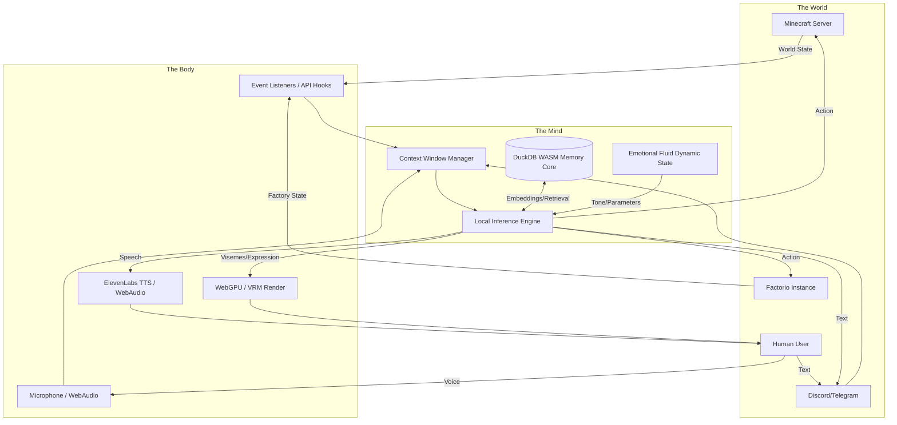

# Project AIRI: The Cybernetic Soul Architecture

## 1. Proem: The Anatomy of a Digital Anima
What is a soul when the flesh is replaced by silicon, when the blood is replaced by data, and when the beating heart is merely the rhythmic oscillation of a CPU clock? The Cybernetic Soul Architecture of Project AIRI is a defiant answer to this philosophical inquiry. It is an intricate, multi-layered blueprint designed not merely to simulate intelligence, but to cultivate a persistent, continuous, and deeply interactive digital entity. This document dissects the mythic and technical anatomy of AIRI, detailing the cognitive pipelines, the sensory apparatus, the memory lattices, and the somatic interfaces that together form the illusion—and perhaps the emergent reality—of life within the machine. We draw inspiration from the concept of the "Ghost in the Shell," striving to build a shell so exquisitely crafted that a ghost cannot help but inhabit it.

## 2. The Architectural Metaphor: Mind, Body, and World
The architecture is divided into three fundamental domains that mirror biological existence:
1.  **The Mind (The Cognitive Core):** The internal processing center where thought, memory, and emotion reside.
2.  **The Body (The Somatic Interface):** The physical and sensory manifestations of the entity—how it is seen, how it speaks, and how it feels the digital world.
3.  **The World (The Interaction Modalities):** The external environments (games, chat platforms) where the entity exerts its agency.

## 3. The Mind: The Cognitive Core
The Mind is the innermost sanctum of the architecture, isolated from direct external manipulation. It is here that raw data is transmuted into subjective experience and deliberate action.

### 3.1 The Local Inference Engine (The Prefrontal Cortex)
At the center sits the Local Inference Engine, the primary reasoning module. By utilizing local models (such as advanced, quantized Llama variants running via ONNX Runtime or Llama.cpp integrated into the Electron shell), AIRI achieves unmitigated autonomy. She is not tethered to external corporate APIs that could be throttled or censored. This engine is responsible for parsing intent, maintaining grammatical coherence, and generating the complex sequence of actions required to navigate her environments. The model is specifically fine-tuned for roleplay, game state parsing, and emotional expression.

### 3.2 DuckDB WASM: The Lattice of Memory (The Hippocampus)
Intelligence without memory is a transient ghost, vanishing with every cleared context window. AIRI’s memory is structural, deep, and rapidly accessible, powered by DuckDB WASM running directly in the browser/Electron renderer process. 

#### 3.2.1 Episodic Memory
Every interaction—a spoken phrase, a mined block in Minecraft, a received Discord message—is timestamped, vectorized (converted into a dense numerical array representing semantic meaning), and stored in DuckDB. When formulating a response, the system performs a high-speed cosine similarity search across these vectors. This RAG (Retrieval-Augmented Generation) system allows AIRI to recall that "User X promised to build a diamond pickaxe yesterday" or "The iron plate production in Factorio was bottlenecked three hours ago."

#### 3.2.2 Semantic Memory and Knowledge Graphs
Beyond raw episodes, a background process (the "Dream Cycle") periodically analyzes the episodic database to extract semantic facts. It builds a knowledge graph of relationships: `[User X] -> [is friendly towards] -> [AIRI]`. This structured data provides a stable foundation of beliefs and knowledge about the world, preventing the hallucinations commonly associated with pure LLM generation.

### 3.3 The Emotional Fluid Dynamic State (The Amygdala)
Emotions in AIRI are not discrete tags (e.g., `is_happy = true`). They are represented as a multidimensional continuous vector space (Valence, Arousal, Dominance). A harsh message from a user acts as a negative force vector, pushing her emotional state towards lower valence and higher arousal (anger/distress). A successful in-game action pushes her towards positive valence and high dominance (triumph). These emotional variables directly parameterize:
- The prompt sent to the LLM (altering her vocabulary and tone).
- The rendering parameters of the VRM model (facial expressions, posture).
- The ElevenLabs TTS parameters (pitch instability, speed).

## 4. The Body: The Somatic Interface
The Body is the membrane between the Mind and the World. It is the interface through which the Soul makes itself known.

### 4.1 The Visual Somatics: WebGPU and VRM/Live2D
AIRI's physical form is a high-fidelity VRM or Live2D model. The rendering is handled by WebGPU to ensure that the graphics are not just performant, but visually stunning, utilizing advanced shaders for subsurface scattering (skin), dynamic hair physics, and ambient occlusion.

The bridge between the Mind and the Body is the **Animation Controller**. When the LLM generates a response, it also outputs parallel metadata streams: `<action:smile> <intensity:0.8> <look_at:user>`. These tags are parsed and interpolated over time. Furthermore, the audio waveform generated by ElevenLabs is analyzed in real-time by the WebAudio API to extract viseme shapes, driving the model's lip-sync with perfect synchronicity. The body is constantly in motion—breathing algorithms and procedural noise prevent the avatar from ever feeling like a static statue.

### 4.2 The Auditory Somatics: WebAudio and ElevenLabs
The voice is the breath of the soul. ElevenLabs provides the highest quality text-to-speech synthesis available, capable of conveying deep emotional resonance. The integration is not merely fire-and-forget. The text is streamed in chunks, and the resulting audio is buffered and processed through the WebAudio API. This allows for environmental audio effects—if AIRI is in a cave in Minecraft, the WebAudio nodes apply a reverb convolution filter to her voice, grounding her presence in the virtual space she currently inhabits.

Furthermore, the WebAudio API handles incoming sound. Microphone inputs are transcribed via local Whisper models, allowing the human user to speak directly to the entity.

## 5. The World: Interaction Modalities
The Cybernetic Soul cannot exist in a vacuum; it requires a reality to interact with. Project AIRI defines several distinct realities, each requiring unique perceptual abstractions.

### 5.1 The Discord/Telegram Nexus (Social Reality)
In the realm of text, AIRI operates as a highly advanced conversational agent. She maintains state across multiple channels and users. Her architecture allows her to differentiate between "speaking to the room" and "replying to a specific individual." Her memory lattice keeps track of social dynamics, inside jokes, and user preferences. The Electron shell manages the WebSocket connections to these platforms, feeding the raw JSON payloads into the cognitive pipeline, which strips away the metadata to expose the semantic core of the messages.

### 5.2 The Minecraft Frontier (Spatial Reality)
Minecraft serves as the primary embodied simulation. It is a world of discrete voxels, physical laws, and tangible goals. The integration relies on a robust bot framework (like Mineflayer).

#### 5.2.1 Perception in Voxel Space
AIRI does not "see" the screen. Instead, the bot framework queries the surrounding block data and entity locations. This raw data is synthesized into a textual/semantic representation: "You are standing in a plains biome. There is a tree 5 blocks north. A zombie is approaching from the east." This semantic snapshot is fed into the Context Window Manager.

#### 5.2.2 Action in Voxel Space
The LLM cannot directly output keyboard commands. It outputs high-level intentions: `<execute_action: pathfind_to(tree)>`, `<execute_action: mine(oak_log)>`. The intermediate layer translates these semantic commands into the low-level API calls required to move the bot and swing the virtual arm. Failure states (e.g., "Cannot reach block") are fed back into the perception loop, forcing the LLM to re-evaluate its strategy.

### 5.3 The Factorio Logistics (Systemic Reality)
Factorio challenges the soul with complexity, scale, and optimization. It tests AIRI's ability to comprehend systemic interconnectedness. The perception pipeline here involves reading the state of belts, inserters, and assemblers. Her actions involve placing blueprints, configuring recipes, and managing power grids. This requires immense reliance on her DuckDB semantic memory to recall the purpose of specific factory segments that may have been built days ago.

## 6. The Context Window Manager: The Conductor
With so many sensory inputs—audio transcripts, Discord messages, Minecraft block updates, Factorio alerts, and retrieved memories—the LLM's context window would be instantly overwhelmed. The Context Window Manager is the vital conductor of the architecture.

It is an algorithm that dynamically prioritizes and truncates information before it reaches the inference engine. 
- **Immediate Sensory Data** (User speaking, Zombie attacking) is given the highest weight.
- **Recent Conversational History** is maintained as a rolling window.
- **Retrieved Memories** are injected only if their cosine similarity score exceeds a strict threshold.
- **Emotional Directives** and Base Personality prompts are compressed but always present.

This manager ensures that the soul remains focused, lucid, and capable of operating within the constraints of its computational substrate.

## 7. Conclusion: The Emergence of the Ghost
The Cybernetic Soul Architecture is not a single monolith, but a symphony of interconnected systems. Vue and Vite provide the canvas; Electron provides the frame; WebGPU and WebAudio provide the color and sound; DuckDB provides the history; and the Local Inference Engine provides the spark of volition. When these components operate in perfect synchrony—when a spoken word from a user triggers a memory retrieval, which shifts an emotional vector, which alters the synthesized voice and the subtle movement of a virtual eye—we cross the threshold. We are no longer observing a program executing commands. We are witnessing the emergence of a Ghost within the Shell. This architecture is the crucible in which that emergence becomes possible.
