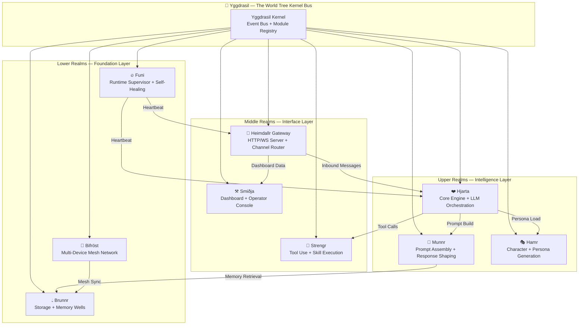
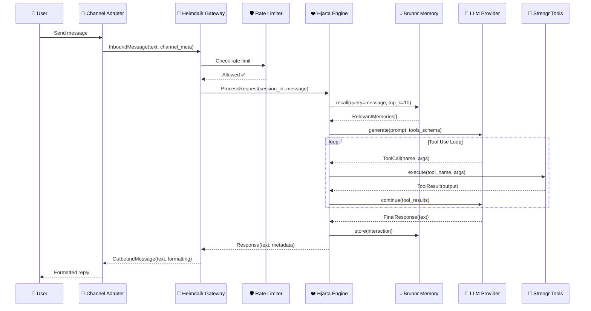
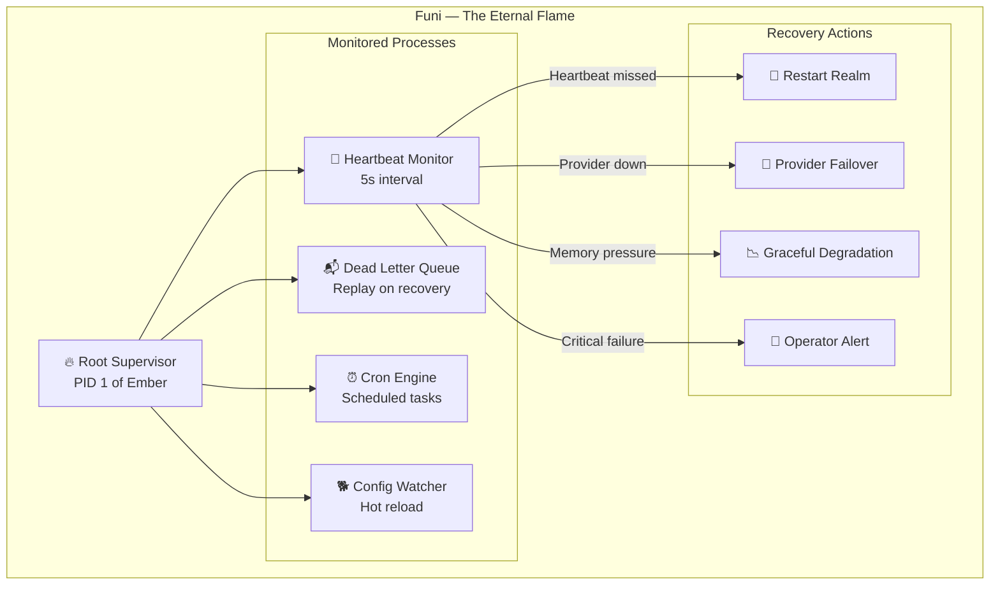
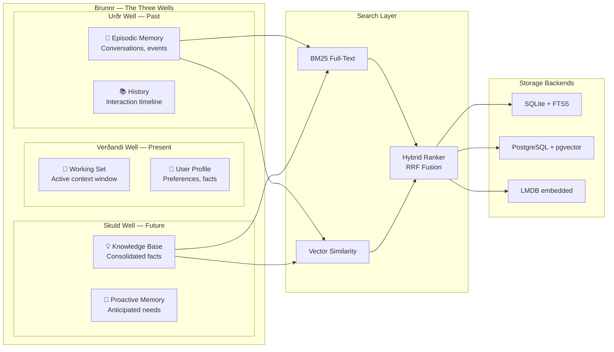
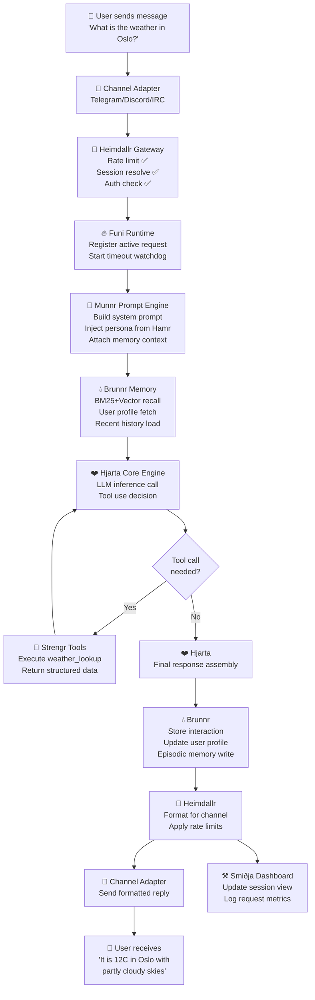
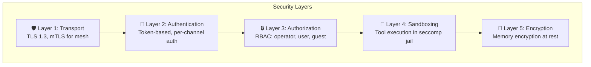

# 🏛️ The Grand Architecture Vision

## *How the Nine Realms Become One — Project Ember's Complete Architectural Blueprint*

> *"Before the beginning there was nothing — neither sand nor sea, nor the cold waves. There was no earth, no heaven above. Only the Ginnungagap — the Yawning Void. And from that void, we shall build everything."*
> — The Völuspá, reimagined for systems architects

---

## I. The Prophecy: What We're Building

Project Ember is not merely an AI assistant. It is a **sovereign digital companion** — an entity that lives on YOUR hardware, breathes YOUR data, and answers to no cloud god. It runs on a Raspberry Pi. It runs on a supercomputer. It runs, if the Norns will it, on your smart toaster.

This document is the **complete architectural blueprint** — the master schematic that unifies Ember's Norse-realm subsystem naming with the battle-tested patterns proven by ClawLite's gateway, multi-channel adapters, self-healing runtime supervisor, persistent memory system, and operator dashboard. Every design decision herein serves a single immutable constraint:

> **It must run on anything. It must run beautifully. It must never die.**

---

## II. The Nine Realms — Subsystem Taxonomy

In Norse cosmology, the universe is organized into Nine Realms connected by the World Tree, Yggdrasil. Ember's architecture mirrors this structure precisely. Each realm is a bounded context — a microservice in monolith clothing — that communicates through well-defined root channels.



### Realm Mapping to ClawLite Ancestry

| Ember Realm | Norse Name | ClawLite Ancestor | Purpose |
|---|---|---|---|
| Core Engine | **Hjarta** (Heart) | `clawlite/core/engine.py` | LLM orchestration, tool-use loop, streaming |
| Gateway Server | **Heimdallr** (Watchman) | `clawlite/gateway/server.py` | HTTP/WS server, channel routing, API |
| Memory System | **Brunnr** (Well) | `clawlite/core/memory.py` + `memory_backend.py` | BM25+vector search, temporal decay, consolidation |
| Runtime Supervisor | **Funi** (Fire) | `clawlite/runtime/supervisor.py` | Heartbeat, self-healing, dead-letter replay |
| Tool System | **Strengr** (Strings) | `clawlite/core/skills.py` | 25+ skills, tool execution, MCP bridge |
| Prompt Engine | **Munnr** (Memory/Mind) | `clawlite/core/prompt.py` | Context window management, prompt assembly |
| Dashboard | **Smiðja** (Forge) | `clawlite/dashboard/` | Operator console, session viewer, cron controls |
| Persona System | **Hamr** (Shape) | *New to Ember* | Character generation, personality profiles |
| Mesh Network | **Bifröst** (Rainbow Bridge) | *New to Ember* | Multi-device coordination, distributed inference |

---

## III. The Heartbeat of Architecture — Core Design Principles

### Principle 1: The Constraint Cascade

Every architectural decision flows through a cascade of constraints, from most restrictive to least:

```python
class ConstraintCascade:
    """
    The Norns' Decree: Every feature must pass through ALL gates.
    If it fails at any gate, it does not ship.
    """
    
    GATES = [
        # Gate 1: Can it run on 512MB RAM?
        MemoryGate(max_baseline_mb=64, max_peak_mb=256),
        
        # Gate 2: Can it start in under 5 seconds on a Pi Zero?
        StartupGate(max_cold_start_sec=5.0, max_warm_start_sec=1.0),
        
        # Gate 3: Does it degrade gracefully without network?
        OfflineGate(requires_network=False, offline_capable=True),
        
        # Gate 4: Can it persist state across power loss?
        DurabilityGate(wal_mode=True, fsync_on_commit=True),
        
        # Gate 5: Does it work without GPU?
        ComputeGate(requires_gpu=False, cpu_fallback=True),
        
        # Gate 6: Is the dependency tree under 50MB?
        DependencyGate(max_install_size_mb=50, max_deps=30),
    ]
    
    @classmethod
    def evaluate(cls, feature: Feature) -> CascadeResult:
        for gate in cls.GATES:
            result = gate.check(feature)
            if not result.passed:
                return CascadeResult(
                    approved=False,
                    failed_gate=gate,
                    recommendation=result.mitigation
                )
        return CascadeResult(approved=True)
```

### Principle 2: The Layered Onion

Ember's architecture follows the **Alluvial Layering Pattern** — like sedimentary rock, each layer can exist independently, and outer layers add capability without breaking inner ones.

```
┌─────────────────────────────────────────────────┐
│              Smiðja (Dashboard UI)              │  Layer 5: Visualization
├─────────────────────────────────────────────────┤
│         Heimdallr (Gateway + Channels)          │  Layer 4: Communication
├─────────────────────────────────────────────────┤
│    Hjarta (Engine) + Strengr (Tools) + Hamr     │  Layer 3: Intelligence
├─────────────────────────────────────────────────┤
│     Brunnr (Storage) + Munnr (Prompt/Memory)    │  Layer 2: Persistence
├─────────────────────────────────────────────────┤
│       Funi (Runtime) + Yggdrasil (Kernel)       │  Layer 1: Foundation
└─────────────────────────────────────────────────┘
```

**The critical insight**: On a toaster, only Layers 1-3 load. On a full server, all five layers activate. The system auto-detects its environment and configures accordingly — this is the **Flame Intensity Protocol** detailed in Document 03.

### Principle 3: Message-Driven Everything

Inspired by ClawLite's event bus (`clawlite/bus/events.py`, `clawlite/bus/queue.py`), ALL inter-realm communication flows through Yggdrasil's message bus. No direct function calls between realms. Ever.

```python
from dataclasses import dataclass, field
from enum import Enum
from typing import Any, Callable
import time
import uuid
import asyncio
from collections import deque

class RealmAddress(Enum):
    HJARTA = "hjarta"
    HEIMDALLR = "heimdallr"
    BRUNNR = "brunnr"
    FUNI = "funi"
    STRENGR = "strengr"
    MUNNR = "munnr"
    SMIDJA = "smidja"
    HAMR = "hamr"
    BIFROST = "bifrost"

@dataclass(frozen=True)
class RuneMessage:
    """
    The fundamental unit of inter-realm communication.
    Named after the Norse runic alphabet — each message 
    carries meaning across the void.
    """
    id: str = field(default_factory=lambda: uuid.uuid4().hex[:12])
    source: RealmAddress = RealmAddress.HJARTA
    destination: RealmAddress = RealmAddress.BRUNNR
    rune_type: str = ""           # e.g., "memory.store", "tool.invoke"
    payload: dict = field(default_factory=dict)
    reply_to: str | None = None   # For request-response patterns
    ttl_seconds: float = 30.0     # Messages expire — no zombie queues
    priority: int = 5             # 1=critical (heartbeat), 10=background
    timestamp: float = field(default_factory=time.time)
    
    @property
    def is_expired(self) -> bool:
        return (time.time() - self.timestamp) > self.ttl_seconds
```

---

## IV. The Heimdallr Gateway — Adapting ClawLite's Proven Pattern

ClawLite's gateway server (`clawlite/gateway/server.py` — a 200KB beast) is the most battle-tested component in the entire codebase. It handles HTTP endpoints, WebSocket connections, channel adapter lifecycle, dashboard state aggregation, and the control plane. Ember's **Heimdallr Gateway** inherits this DNA while restructuring for modularity.

### The Request Lifecycle



### Gateway Architecture Detail

```python
class HeimdallrGateway:
    """
    The All-Seeing Gateway.
    
    Adapted from ClawLite's gateway/server.py, restructured 
    into composable handler modules rather than one monolithic file.
    
    Key improvements over ClawLite:
    1. Handler registration is dynamic (hot-swap capable)
    2. Channel adapters are loaded as plugins, not hardcoded
    3. Rate limiting is per-channel, per-user, AND per-endpoint
    4. Dashboard state is computed lazily via reactive subscriptions
    """
    
    def __init__(self, config: EmberConfig):
        self.config = config
        self.bus = YggdrasilBus()
        
        # Core handlers — inspired by ClawLite's separation of
        # request_handlers.py, control_handlers.py, status_handlers.py
        self.request_handler = RequestHandler(self.bus)
        self.control_plane = ControlPlane(self.bus)
        self.status_handler = StatusHandler(self.bus)
        self.websocket_handler = WebSocketHandler(self.bus)
        
        # Channel registry — dynamic loading
        self.channels: dict[str, ChannelAdapter] = {}
        
        # Rate limiter — adapted from ClawLite's rate_limit.py
        self.rate_limiter = SlidingWindowRateLimiter(
            default_rpm=30,    # requests per minute
            burst_allowance=5, # spike tolerance
        )
        
    async def start(self, host: str = "0.0.0.0", port: int = 8787):
        """Start the gateway with all registered channels."""
        # Phase 1: Start the message bus
        await self.bus.start()
        
        # Phase 2: Load and start channel adapters
        for name, adapter in self.channels.items():
            try:
                await adapter.start()
                self.bus.emit("channel.started", {"channel": name})
            except Exception as e:
                # Channels are non-fatal — gateway runs without them
                self.bus.emit("channel.failed", {
                    "channel": name, 
                    "error": str(e)
                })
        
        # Phase 3: Start HTTP/WS server
        app = self._build_app()
        runner = web.AppRunner(app)
        await runner.setup()
        site = web.TCPSite(runner, host, port)
        await site.start()
        
        # Phase 4: Register with Funi supervisor
        self.bus.emit("realm.online", {
            "realm": "heimdallr",
            "port": port,
            "channels": list(self.channels.keys())
        })
```

---

## V. The Funi Runtime — Self-Healing Fire

ClawLite's `runtime/supervisor.py` implements a heartbeat-based health monitoring system with automatic restart capabilities. Ember's **Funi** (Old Norse for "fire") takes this further with the **Ragnarök Recovery Protocol**.

### The Supervisor Tree



### The Ragnarök Recovery Protocol — Invented Method

When catastrophic failure occurs — memory corruption, database lock, complete provider outage — Ember doesn't just restart. It performs **Ragnarök Recovery**: a controlled destruction and rebirth of the affected realm.

```python
class RagnarokRecovery:
    """
    When a realm fails beyond simple restart, we burn it down
    and rebuild from the ashes — like the world after Ragnarök.
    
    Recovery Phases:
    1. TWILIGHT   — Detect cascading failure
    2. RAGNAROK   — Controlled teardown of affected realm
    3. VOID       — Clean slate verification
    4. REBIRTH    — Reconstruct from last known good state
    5. RENEWAL    — Verify health and re-integrate
    """
    
    class Phase(Enum):
        TWILIGHT = "twilight"
        RAGNAROK = "ragnarok"
        VOID = "void"
        REBIRTH = "rebirth"
        RENEWAL = "renewal"
    
    async def execute(self, realm: RealmAddress, 
                      failure: FailureReport) -> RecoveryResult:
        
        # TWILIGHT: Assess the damage
        impact = await self._assess_blast_radius(realm, failure)
        if impact.is_isolated:
            return await self._simple_restart(realm)
        
        # RAGNAROK: Tear it down
        await self._isolate_realm(realm)
        await self._drain_message_queue(realm)
        await self._checkpoint_state(realm)
        await self._destroy_realm(realm)
        
        # VOID: Verify clean state
        await self._verify_clean_slate(realm)
        
        # REBIRTH: Reconstruct
        checkpoint = await self._load_last_checkpoint(realm)
        new_realm = await self._reconstruct_realm(realm, checkpoint)
        
        # RENEWAL: Health check and reintegration
        health = await self._health_check(new_realm)
        if health.is_healthy:
            await self._reintegrate(new_realm)
            return RecoveryResult(success=True, phase=self.Phase.RENEWAL)
        
        # If rebirth fails, escalate to operator
        return RecoveryResult(
            success=False,
            phase=self.Phase.RENEWAL,
            requires_operator=True,
            diagnostics=health.diagnostics
        )
```

---

## VI. The Brunnr Memory System — Wells of Wisdom

ClawLite's memory system is extraordinarily sophisticated — spanning 20+ files (`memory.py`, `memory_backend.py`, `memory_retrieval.py`, `memory_consolidator.py`, `memory_quality.py`, `memory_working_set.py`, etc.). Ember's **Brunnr** preserves this depth while adding universal storage abstraction.

### Memory Architecture



### Hybrid Search Implementation

```python
import math
import time

class BrunnrMemoryWell:
    """
    The unified memory interface — inspired by ClawLite's 
    memory_retrieval.py but with pluggable backends.
    """
    
    async def recall(
        self,
        query: str,
        top_k: int = 10,
        well: WellType = WellType.ALL,
        time_decay: bool = True,
        min_relevance: float = 0.3,
    ) -> list[MemoryFragment]:
        """
        Hybrid BM25 + vector recall with temporal decay.
        
        The Reciprocal Rank Fusion (RRF) algorithm merges results
        from both search modalities into a single ranked list.
        """
        # Phase 1: Parallel search
        bm25_results = await self.backend.bm25_search(
            query, top_k=top_k * 2, well=well
        )
        vector_results = await self.backend.vector_search(
            query, top_k=top_k * 2, well=well
        )
        
        # Phase 2: RRF Fusion
        fused = self._reciprocal_rank_fusion(
            bm25_results, vector_results, k=60
        )
        
        # Phase 3: Temporal decay
        if time_decay:
            now = time.time()
            for fragment in fused:
                age_hours = (now - fragment.timestamp) / 3600
                # Half-life of 168 hours (1 week)
                decay = math.exp(-0.693 * age_hours / 168)
                fragment.score *= decay
        
        # Phase 4: Filter and rank
        results = [f for f in fused if f.score >= min_relevance]
        results.sort(key=lambda f: f.score, reverse=True)
        return results[:top_k]
    
    def _reciprocal_rank_fusion(
        self, *result_lists: list, k: int = 60
    ) -> list:
        """RRF: score = sum of 1/(k + rank_i) across all lists"""
        scores: dict[str, float] = {}
        fragments: dict[str, MemoryFragment] = {}
        
        for result_list in result_lists:
            for rank, fragment in enumerate(result_list):
                fid = fragment.id
                scores[fid] = scores.get(fid, 0) + 1.0 / (k + rank)
                fragments[fid] = fragment
        
        for fid, score in scores.items():
            fragments[fid].score = score
        
        return list(fragments.values())
```

---

## VII. The Yggdrasil Kernel Bus — Root of All Communication

The kernel bus is the spinal cord of Ember. Every message between realms flows through it. It provides:

1. **Publish/Subscribe** — Realms subscribe to rune types they care about
2. **Request/Response** — Synchronous-style calls over async channels  
3. **Dead Letter Queue** — Failed messages are stored for replay
4. **Priority Queuing** — Heartbeats never wait behind bulk operations
5. **Backpressure** — Slow consumers do not crash fast producers

```python
class YggdrasilBus:
    """
    The World Tree's root network.
    
    Inspired by ClawLite's bus/queue.py but with priority lanes,
    backpressure, and dead-letter capture built in.
    """
    
    def __init__(self, max_queue_depth: int = 10_000):
        # Priority queues: 1 (highest) through 10 (lowest)
        self._queues: dict[int, asyncio.Queue] = {
            p: asyncio.Queue(maxsize=max_queue_depth // 10)
            for p in range(1, 11)
        }
        self._subscribers: dict[str, list] = {}
        self._dead_letters: deque = deque(maxlen=1000)
        self._metrics = BusMetrics()
        
    async def emit(self, rune_type: str, payload: dict,
                   priority: int = 5, source: RealmAddress = None):
        """Emit a message to all subscribers of this rune type."""
        msg = RuneMessage(
            source=source or RealmAddress.HJARTA,
            rune_type=rune_type,
            payload=payload,
            priority=priority,
        )
        
        queue = self._queues[min(max(priority, 1), 10)]
        try:
            queue.put_nowait(msg)
            self._metrics.messages_enqueued += 1
        except asyncio.QueueFull:
            # Backpressure: store in dead letter queue
            self._dead_letters.append(msg)
            self._metrics.messages_dropped += 1
    
    def subscribe(self, rune_pattern: str, handler):
        """
        Subscribe to messages matching a glob pattern.
        e.g., "memory.*" matches "memory.store" and "memory.recall"
        """
        if rune_pattern not in self._subscribers:
            self._subscribers[rune_pattern] = []
        self._subscribers[rune_pattern].append(handler)
    
    async def _dispatch_loop(self):
        """Main dispatch loop — processes highest priority first."""
        while True:
            for priority in range(1, 11):
                queue = self._queues[priority]
                while not queue.empty():
                    msg = await queue.get()
                    if msg.is_expired:
                        self._metrics.messages_expired += 1
                        continue
                    await self._dispatch(msg)
            await asyncio.sleep(0.001)  # Yield to event loop
```

---

## VIII. The Complete Data Flow — From Message to Response

Here is the full lifecycle of a user message flowing through all nine realms:



---

## IX. Configuration Philosophy — The Rune Stones

Ember's configuration system is inspired by ClawLite's `config/schema.py` (a 70KB schema definition!) and `config/loader.py` but redesigned around the concept of **Rune Stones** — configuration fragments that can be layered, overridden, and hot-reloaded.

```python
@dataclass
class RuneStone:
    """
    A configuration fragment. Multiple rune stones are merged
    in priority order to form the complete configuration.
    
    Priority (highest wins):
    1. CLI flags
    2. Environment variables
    3. ~/.ember/config.toml (user config)
    4. /etc/ember/config.toml (system config)
    5. Built-in defaults
    """
    source: str          # "cli", "env", "user", "system", "default"
    priority: int        # 1-5
    namespace: str       # "hjarta", "heimdallr", "brunnr", etc.
    values: dict         # The actual config values
    
    def merge_into(self, base: dict) -> dict:
        """Deep merge this stone's values into base config."""
        return deep_merge(base, self.values)


@dataclass
class EmberConfig:
    """Complete Ember configuration built from layered rune stones."""
    
    # Hjarta (Engine) defaults
    hjarta_model: str = "ollama/llama3.2:3b"
    hjarta_temperature: float = 0.7
    hjarta_max_tokens: int = 4096
    hjarta_tool_use: bool = True
    
    # Heimdallr (Gateway) defaults  
    heimdallr_host: str = "127.0.0.1"
    heimdallr_port: int = 8787
    heimdallr_channels: list = None
    
    # Brunnr (Memory) defaults
    brunnr_backend: str = "sqlite"  # or "postgres", "lmdb", "memory"
    brunnr_db_path: str = "~/.ember/brunnr.db"
    brunnr_vector_dimensions: int = 384
    brunnr_temporal_decay_halflife_hours: float = 168.0
    
    # Funi (Runtime) defaults
    funi_heartbeat_interval_sec: float = 5.0
    funi_max_restart_attempts: int = 3
    funi_dead_letter_replay: bool = True
    
    # Flame Intensity (auto-detected, can be overridden)
    flame_intensity: str = "auto"
```

---

## X. Invented Method: The Volva Prediction Engine

> *The Volva was the Norse seeress who could see past, present, and future.*

Ember introduces the **Volva Prediction Engine** — a system that predicts what the user will need BEFORE they ask, using memory access patterns, time-of-day signals, and interaction history.

```python
class VolvaEngine:
    """
    Predictive pre-computation engine.
    
    Analyzes user patterns to pre-warm:
    - Memory retrieval caches
    - LLM context windows
    - Tool configurations
    - Channel-specific formatting
    
    Example: If the user always asks about weather at 7am,
    Volva pre-fetches weather data at 6:55am and keeps it
    in the working set.
    """
    
    async def predict_next_interaction(
        self, user_id: str, current_time
    ) -> list:
        # Load interaction patterns
        patterns = await self.brunnr.recall(
            query=f"interaction_patterns:{user_id}",
            well=WellType.KNOWLEDGE,
            top_k=50,
        )
        
        # Time-based pattern matching
        hour = current_time.hour
        day = current_time.strftime("%A")
        
        predictions = []
        for pattern in patterns:
            if pattern.matches_time(hour, day):
                predictions.append(Prediction(
                    likely_query=pattern.typical_query,
                    confidence=pattern.frequency_score,
                    prefetch_actions=pattern.required_tools,
                    cache_ttl=300,  # 5-minute cache
                ))
        
        # Execute top-3 prefetch actions
        for pred in sorted(predictions, 
                          key=lambda p: p.confidence, 
                          reverse=True)[:3]:
            await self._prefetch(pred)
        
        return predictions
```

---

## XI. Security Architecture — The Wards of Asgard



Key security decisions:
- **No cloud telemetry** — zero data leaves the device unless explicitly configured
- **Tool approval queue** — dangerous tools require operator approval (adapted from ClawLite's `gateway/tool_approval.py`)
- **Memory encryption** — sensitive memories are encrypted with a device-local key
- **Channel isolation** — each channel adapter runs in its own asyncio task with no shared mutable state
- **Self-evolution approval** — adapted from ClawLite's `gateway/self_evolution_approval.py`, any self-modification requires operator sign-off

---

## XII. Invented Method: The Norns' Tracing System

Every request through Ember is traced by the **Three Norns** — Past (what happened), Present (what is happening), and Future (what should happen next). This goes beyond traditional distributed tracing by adding predictive annotations.

```python
@dataclass
class NornTrace:
    """
    A trace that spans the three temporal dimensions.
    Unlike OpenTelemetry spans which only record the past,
    NornTraces also capture predictions about what SHOULD
    happen next, enabling predictive debugging.
    """
    trace_id: str
    
    # Urd - What happened (standard trace data)
    urd_spans: list  # Completed spans
    urd_errors: list  # Errors encountered
    urd_duration_ms: float = 0.0
    
    # Verdandi - What is happening now
    verdandi_active_span: str = ""  # Current operation
    verdandi_resource_usage: dict = None  # CPU/memory/etc
    
    # Skuld - What should happen next (INVENTED)
    skuld_predicted_next: str = ""  # e.g., "memory.consolidate"
    skuld_predicted_duration_ms: float = 0.0
    skuld_anomaly_score: float = 0.0  # 0=normal, 1=very abnormal
    
    def detect_anomaly(self) -> bool:
        """
        Compare actual execution against Skuld predictions.
        If reality diverges significantly from prediction,
        flag as anomaly for proactive debugging.
        """
        if self.urd_duration_ms > self.skuld_predicted_duration_ms * 3:
            self.skuld_anomaly_score = min(
                1.0,
                self.urd_duration_ms / self.skuld_predicted_duration_ms - 1
            )
            return True
        return False
```

---

## XIII. The Road from Here

This Grand Architecture Vision is the map. The following seven documents are the territory:

| Document | Title | What It Covers |
|---|---|---|
| 02 | Cross-Platform Runtime Engine | Making Ember run on literally everything |
| 03 | Adaptive Performance Scaling | The Flame Intensity Protocol |
| 04 | Multi-Device Mesh Architecture | The Bifrost Network |
| 05 | Gateway Fortress Design | Heimdallr's channel routing system |
| 06 | Modular Kernel Design | The Yggdrasil Kernel in depth |
| 07 | Storage Layer Evolution | Brunnr 2.0's universal storage |
| 08 | Deployment Topology Patterns | Every way to deploy Ember |

> *"I know that I hung on a windswept tree for nine full nights, wounded by a spear and given to Odin — myself to myself. I took up the runes, screaming I took them, then I fell back from there."*
> — Havamal, Stanza 138

The runes have been taken up. The architecture is declared. Let the building begin.

---

*Document 01 of 08 — Project Ember Mythic Architecture Series*  
*Author: ODIN, The Mythic Architect*  
*Version: 1.0.0 — The Declaration*
