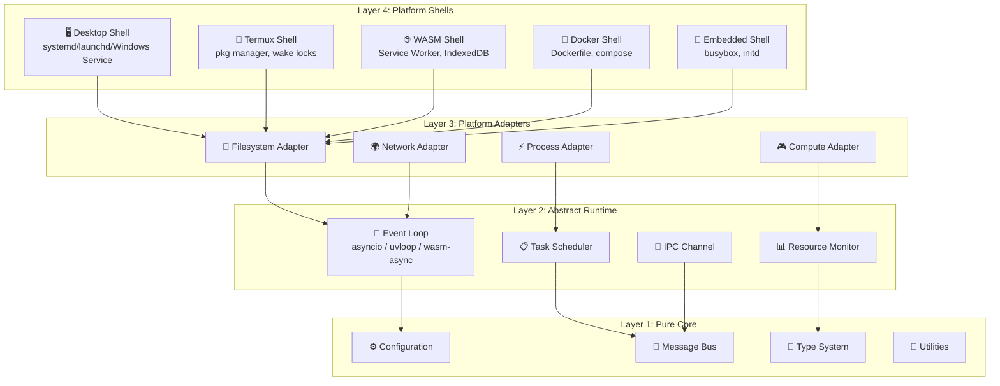
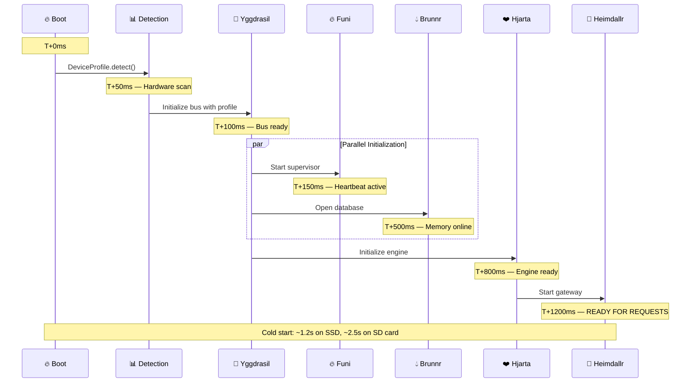
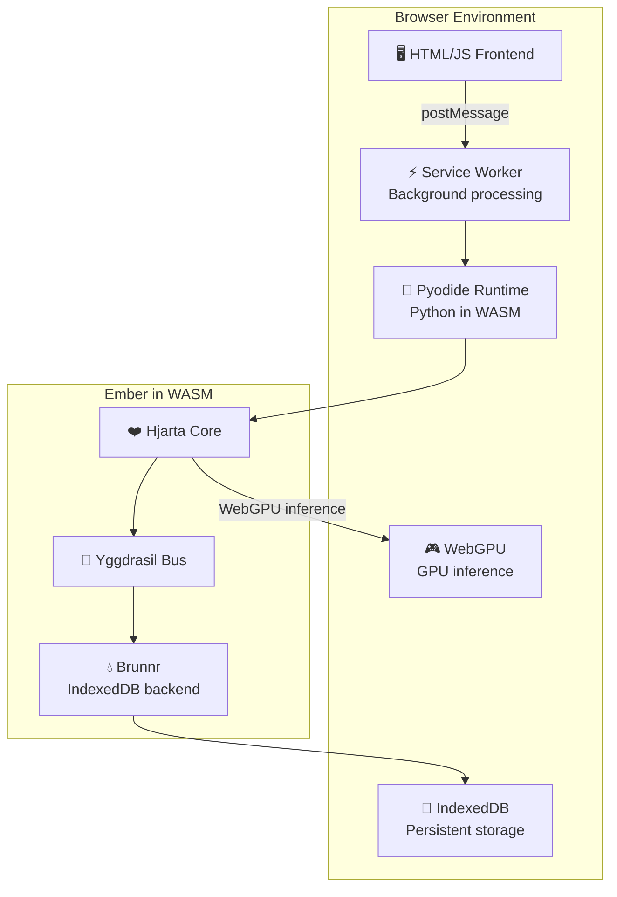

# ⚙️ Cross-Platform Runtime Engine

## *Forging the Allfather's Hammer — A Runtime That Truly Runs on Anything*

> *"Mjölnir was forged in the heart of a dying star by the dwarven brothers Sindri and Brokkr. It could level mountains or fit in a pocket. Project Ember's runtime must be equally versatile."*

---

## I. The Universal Runtime Challenge

The promise of Project Ember — "Run It On Your Smart Toaster" — is not marketing hyperbole. It is an engineering constraint that shapes every decision in this document. We must build a runtime that operates faithfully across:

| Platform | Architecture | RAM | Storage | GPU | Example Device |
|---|---|---|---|---|---|
| Desktop Linux | x86_64 | 8-128 GB | SSD | Optional | Dev workstation |
| Raspberry Pi | ARM64 (aarch64) | 1-8 GB | SD Card | None | Pi 4/5 |
| Android/Termux | ARM64 | 4-12 GB | Flash | Adreno/Mali | Samsung Galaxy |
| RISC-V SBC | rv64gc | 1-4 GB | eMMC | None | VisionFive 2 |
| macOS | ARM64 (Apple Silicon) | 8-192 GB | SSD | Metal GPU | MacBook, Mac Studio |
| Windows WSL | x86_64 | 4-64 GB | NTFS | CUDA | Gaming PC |
| WebAssembly | wasm32 | 256 MB-2 GB | IndexedDB | WebGPU | Browser tab |
| Embedded Linux | ARMv7/MIPS | 128-512 MB | Flash | None | Router, NAS |
| Smart TV | ARM64 | 2-4 GB | Flash | GPU | Android TV, webOS |
| Docker Container | Any | Variable | Overlay | Passthrough | Cloud, NAS |
| iOS Shortcuts | ARM64 | 3-6 GB | Sandboxed | ANE | iPhone, iPad |

This is not a theoretical exercise. ClawLite already proves the pattern works for x86_64 Linux and Android/Termux (see `docs/TERMUX_PROOT_UBUNTU.md`). Ember extends this to EVERY platform listed above.

---

## II. Architecture: The Layered Anvil

The runtime is built in concentric layers, like a blacksmith's anvil. Each outer layer adds platform-specific capability while the core remains universal.



### Layer 1: Pure Core (Zero Platform Dependencies)

This is the beating heart — pure Python with ZERO external dependencies. It must import and execute on any Python 3.10+ interpreter, including MicroPython and Pyodide (browser Python).

```python
"""
ember/core/types.py — Pure type definitions.
No imports beyond stdlib. No platform assumptions.
"""
from dataclasses import dataclass, field
from enum import Enum, auto
from typing import Any, Optional
import time
import uuid


class DeviceClass(Enum):
    """Hardware classification tiers."""
    EMBER = auto()      # Minimal: < 512MB RAM, no GPU (toaster, Pi Zero)
    CANDLE = auto()     # Low: 512MB-2GB RAM, no GPU (Pi 3/4, old phones)
    TORCH = auto()      # Medium: 2-8GB RAM, optional GPU (phones, Pi 5)
    BONFIRE = auto()    # High: 8-32GB RAM, likely GPU (desktop, laptop)
    INFERNO = auto()    # Maximum: 32GB+ RAM, GPU (workstation, server)


class PlatformType(Enum):
    """Detected platform classification."""
    LINUX_X86 = "linux-x86_64"
    LINUX_ARM64 = "linux-aarch64"
    LINUX_ARMV7 = "linux-armv7l"
    LINUX_RISCV = "linux-riscv64"
    MACOS_ARM = "darwin-arm64"
    MACOS_X86 = "darwin-x86_64"
    WINDOWS_X86 = "win32-x86_64"
    ANDROID_ARM = "android-aarch64"
    WASM = "wasm32"
    UNKNOWN = "unknown"


@dataclass
class DeviceProfile:
    """
    Complete hardware profile of the running device.
    Detected at startup, cached, and used by every realm
    to adapt their behavior.
    """
    device_class: DeviceClass = DeviceClass.CANDLE
    platform: PlatformType = PlatformType.UNKNOWN
    
    # Memory
    total_ram_mb: int = 0
    available_ram_mb: int = 0
    
    # CPU
    cpu_count: int = 1
    cpu_arch: str = ""
    cpu_freq_mhz: int = 0
    has_neon: bool = False       # ARM SIMD
    has_avx2: bool = False       # x86 SIMD
    has_rvv: bool = False        # RISC-V Vector
    
    # GPU/Accelerator
    has_gpu: bool = False
    gpu_name: str = ""
    gpu_vram_mb: int = 0
    has_metal: bool = False      # Apple
    has_cuda: bool = False       # NVIDIA
    has_vulkan: bool = False     # Cross-platform
    has_webgpu: bool = False     # Browser
    
    # Storage
    storage_type: str = "unknown"  # "ssd", "hdd", "sd", "flash", "indexeddb"
    available_storage_mb: int = 0
    
    # Network
    has_network: bool = True
    network_type: str = "unknown"  # "ethernet", "wifi", "cellular", "none"
    
    # Python runtime
    python_version: str = ""
    is_pyodide: bool = False     # Running in browser
    is_micropython: bool = False
    has_uvloop: bool = False
    
    @classmethod
    def detect(cls) -> "DeviceProfile":
        """Auto-detect hardware capabilities at startup."""
        profile = cls()
        profile._detect_platform()
        profile._detect_memory()
        profile._detect_cpu()
        profile._detect_gpu()
        profile._detect_storage()
        profile._detect_python()
        profile._classify_device()
        return profile
    
    def _detect_platform(self):
        import sys
        import platform
        
        machine = platform.machine().lower()
        system = platform.system().lower()
        
        # Check for special environments
        if hasattr(sys, '_emscripten_info'):
            self.platform = PlatformType.WASM
            self.is_pyodide = True
            return
        
        platform_map = {
            ("linux", "x86_64"): PlatformType.LINUX_X86,
            ("linux", "aarch64"): PlatformType.LINUX_ARM64,
            ("linux", "armv7l"): PlatformType.LINUX_ARMV7,
            ("linux", "riscv64"): PlatformType.LINUX_RISCV,
            ("darwin", "arm64"): PlatformType.MACOS_ARM,
            ("darwin", "x86_64"): PlatformType.MACOS_X86,
        }
        
        self.platform = platform_map.get(
            (system, machine), PlatformType.UNKNOWN
        )
        
        # Termux detection
        if system == "linux" and "TERMUX_VERSION" in __import__("os").environ:
            self.platform = PlatformType.ANDROID_ARM
    
    def _detect_memory(self):
        try:
            with open("/proc/meminfo") as f:
                for line in f:
                    if line.startswith("MemTotal:"):
                        self.total_ram_mb = int(line.split()[1]) // 1024
                    elif line.startswith("MemAvailable:"):
                        self.available_ram_mb = int(line.split()[1]) // 1024
        except (FileNotFoundError, PermissionError):
            # macOS, Windows, WASM fallback
            try:
                import psutil
                mem = psutil.virtual_memory()
                self.total_ram_mb = mem.total // (1024 * 1024)
                self.available_ram_mb = mem.available // (1024 * 1024)
            except ImportError:
                self.total_ram_mb = 1024  # Conservative default
                self.available_ram_mb = 512
    
    def _detect_cpu(self):
        import os
        self.cpu_count = os.cpu_count() or 1
        
        # Detect SIMD capabilities
        try:
            with open("/proc/cpuinfo") as f:
                cpuinfo = f.read().lower()
                self.has_neon = "neon" in cpuinfo or "asimd" in cpuinfo
                self.has_avx2 = "avx2" in cpuinfo
                self.has_rvv = "rvv" in cpuinfo or "v " in cpuinfo
        except FileNotFoundError:
            pass
    
    def _detect_gpu(self):
        # CUDA detection
        try:
            import subprocess
            result = subprocess.run(
                ["nvidia-smi", "--query-gpu=name,memory.total",
                 "--format=csv,noheader,nounits"],
                capture_output=True, text=True, timeout=5
            )
            if result.returncode == 0:
                parts = result.stdout.strip().split(", ")
                self.has_gpu = True
                self.has_cuda = True
                self.gpu_name = parts[0]
                self.gpu_vram_mb = int(parts[1])
        except (FileNotFoundError, subprocess.TimeoutExpired):
            pass
        
        # Metal detection (macOS)
        if self.platform == PlatformType.MACOS_ARM:
            self.has_metal = True
            self.has_gpu = True
    
    def _detect_storage(self):
        import os
        try:
            stat = os.statvfs(os.path.expanduser("~"))
            self.available_storage_mb = (
                stat.f_bavail * stat.f_frsize
            ) // (1024 * 1024)
        except (OSError, AttributeError):
            self.available_storage_mb = 1024  # 1GB default
    
    def _detect_python(self):
        import sys
        self.python_version = f"{sys.version_info.major}.{sys.version_info.minor}.{sys.version_info.micro}"
        
        try:
            import uvloop
            self.has_uvloop = True
        except ImportError:
            self.has_uvloop = False
    
    def _classify_device(self):
        """Classify into device tiers based on detected capabilities."""
        ram = self.total_ram_mb
        
        if ram < 512:
            self.device_class = DeviceClass.EMBER
        elif ram < 2048:
            self.device_class = DeviceClass.CANDLE
        elif ram < 8192:
            self.device_class = DeviceClass.TORCH
        elif ram < 32768:
            self.device_class = DeviceClass.BONFIRE
        else:
            self.device_class = DeviceClass.INFERNO
```

---

## III. Platform Adapters — The Shapeshift Layer

Each platform requires specific adaptations. Rather than littering the codebase with `if platform == ...` checks, we use the **Shapeshift Pattern**: a set of abstract interfaces with platform-specific implementations selected at startup.

### The Filesystem Adapter

Storage behavior varies dramatically across platforms. SD cards on Pi are slow and wear-prone. IndexedDB on WASM is async-only. Termux has restricted paths.

```python
from abc import ABC, abstractmethod
from pathlib import Path
from typing import AsyncIterator


class FilesystemAdapter(ABC):
    """Abstract filesystem interface — platform-specific implementations."""
    
    @abstractmethod
    async def read(self, path: str) -> bytes:
        """Read entire file contents."""
        ...
    
    @abstractmethod
    async def write(self, path: str, data: bytes, 
                    fsync: bool = False) -> None:
        """Write data to file. fsync=True forces disk flush."""
        ...
    
    @abstractmethod
    async def exists(self, path: str) -> bool:
        ...
    
    @abstractmethod
    def data_dir(self) -> str:
        """Platform-appropriate data directory."""
        ...
    
    @abstractmethod
    def temp_dir(self) -> str:
        """Platform-appropriate temp directory."""
        ...


class LinuxFilesystem(FilesystemAdapter):
    """Standard Linux filesystem with XDG compliance."""
    
    async def read(self, path: str) -> bytes:
        # Use aiofiles for non-blocking I/O
        import aiofiles
        async with aiofiles.open(path, "rb") as f:
            return await f.read()
    
    async def write(self, path: str, data: bytes, 
                    fsync: bool = False) -> None:
        import aiofiles
        import os
        async with aiofiles.open(path, "wb") as f:
            await f.write(data)
            if fsync:
                await f.flush()
                os.fsync(f.fileno())
    
    async def exists(self, path: str) -> bool:
        return Path(path).exists()
    
    def data_dir(self) -> str:
        import os
        xdg = os.environ.get("XDG_DATA_HOME", "")
        if xdg:
            return f"{xdg}/ember"
        return os.path.expanduser("~/.local/share/ember")
    
    def temp_dir(self) -> str:
        return "/tmp/ember"


class TermuxFilesystem(FilesystemAdapter):
    """
    Android/Termux filesystem adapter.
    
    Key differences from standard Linux:
    - Home is /data/data/com.termux/files/home
    - /tmp may not exist, use $TMPDIR
    - SD card access requires special permissions
    - Storage is flash — minimize writes for longevity
    """
    
    async def read(self, path: str) -> bytes:
        import aiofiles
        async with aiofiles.open(path, "rb") as f:
            return await f.read()
    
    async def write(self, path: str, data: bytes, 
                    fsync: bool = False) -> None:
        import aiofiles
        import os
        # Termux: batch writes to reduce flash wear
        async with aiofiles.open(path, "wb") as f:
            await f.write(data)
            if fsync:
                await f.flush()
                os.fsync(f.fileno())
    
    async def exists(self, path: str) -> bool:
        return Path(path).exists()
    
    def data_dir(self) -> str:
        import os
        return os.environ.get(
            "EMBER_DATA_DIR",
            os.path.expanduser("~/.ember")
        )
    
    def temp_dir(self) -> str:
        import os
        return os.environ.get("TMPDIR", "/data/data/com.termux/files/usr/tmp")


class WasmFilesystem(FilesystemAdapter):
    """
    WebAssembly/Pyodide filesystem adapter.
    
    In the browser, there is no real filesystem. We use:
    - IndexedDB for persistent storage (via Pyodide's idbfs)
    - In-memory filesystem for temp files
    - Service Worker cache for static assets
    """
    
    async def read(self, path: str) -> bytes:
        # Pyodide mounts an in-memory FS by default
        with open(path, "rb") as f:
            return f.read()
    
    async def write(self, path: str, data: bytes, 
                    fsync: bool = False) -> None:
        import os
        os.makedirs(os.path.dirname(path), exist_ok=True)
        with open(path, "wb") as f:
            f.write(data)
        if fsync:
            await self._sync_to_indexeddb()
    
    async def _sync_to_indexeddb(self):
        """Sync the in-memory filesystem to IndexedDB for persistence."""
        try:
            from pyodide.ffi import run_sync
            from js import self as js_self
            # Use the FS.syncfs API
            run_sync("FS.syncfs(false, function(err) {})")
        except ImportError:
            pass
    
    async def exists(self, path: str) -> bool:
        try:
            with open(path, "rb"):
                return True
        except FileNotFoundError:
            return False
    
    def data_dir(self) -> str:
        return "/ember/data"
    
    def temp_dir(self) -> str:
        return "/ember/tmp"


def detect_filesystem() -> FilesystemAdapter:
    """Factory: select the right filesystem adapter for this platform."""
    import sys
    import os
    
    if hasattr(sys, '_emscripten_info'):
        return WasmFilesystem()
    elif "TERMUX_VERSION" in os.environ:
        return TermuxFilesystem()
    else:
        return LinuxFilesystem()
```

---

## IV. The Event Loop Strategy

Python's asyncio is the backbone of Ember's concurrency model (matching ClawLite's all-async architecture). But event loop behavior varies by platform:

```python
class EventLoopFactory:
    """
    Select the optimal event loop implementation for this platform.
    
    Priority order:
    1. uvloop (Linux/macOS — 2-4x faster than default)
    2. Default asyncio (Windows, fallback)
    3. Pyodide event loop (WASM — browser-integrated)
    """
    
    @staticmethod
    def create(profile: DeviceProfile) -> asyncio.AbstractEventLoop:
        if profile.is_pyodide:
            # Pyodide has its own event loop integrated with JS
            return asyncio.get_event_loop()
        
        if profile.has_uvloop and profile.platform not in (
            PlatformType.WINDOWS_X86,
        ):
            import uvloop
            return uvloop.new_event_loop()
        
        # Default asyncio loop
        loop = asyncio.new_event_loop()
        
        # On Linux, use the selector for better epoll integration
        if profile.platform in (
            PlatformType.LINUX_X86,
            PlatformType.LINUX_ARM64,
        ):
            import selectors
            selector = selectors.EpollSelector()
            loop = asyncio.SelectorEventLoop(selector)
        
        return loop
```

---

## V. The Startup Sequence — Igniting the Flame

Ember's startup is a carefully orchestrated sequence designed to reach "first response capability" as fast as possible on every platform. On a Raspberry Pi 4, cold start target is under 3 seconds.



### The Startup Code

```python
import asyncio
import time

class EmberRuntime:
    """
    The main runtime coordinator.
    
    Follows ClawLite's gateway/runtime_builder.py pattern but
    with hardware-aware initialization ordering.
    """
    
    async def ignite(self):
        """Start Ember. This is the entry point."""
        t0 = time.monotonic()
        
        # Phase 1: Hardware detection (synchronous, fast)
        self.profile = DeviceProfile.detect()
        self._log(f"Detected: {self.profile.device_class.name} "
                  f"({self.profile.total_ram_mb}MB RAM, "
                  f"{self.profile.cpu_count} cores)")
        
        # Phase 2: Select adapters based on profile
        self.fs = detect_filesystem()
        self.loop = EventLoopFactory.create(self.profile)
        
        # Phase 3: Initialize kernel bus
        self.bus = YggdrasilBus(
            max_queue_depth=self._queue_depth_for_device()
        )
        await self.bus.start()
        
        # Phase 4: Start foundation layer (parallel)
        funi_task = asyncio.create_task(self._start_funi())
        brunnr_task = asyncio.create_task(self._start_brunnr())
        await asyncio.gather(funi_task, brunnr_task)
        
        # Phase 5: Start intelligence layer
        await self._start_hjarta()
        
        # Phase 6: Start interface layer (if resources allow)
        if self.profile.device_class.value >= DeviceClass.CANDLE.value:
            await self._start_heimdallr()
        
        if self.profile.device_class.value >= DeviceClass.TORCH.value:
            await self._start_smidja()
        
        elapsed = time.monotonic() - t0
        self._log(f"Ember ignited in {elapsed:.2f}s")
        
        # Emit boot complete event
        await self.bus.emit("ember.ignited", {
            "startup_time_ms": elapsed * 1000,
            "device_class": self.profile.device_class.name,
            "active_realms": self._active_realms(),
        })
    
    def _queue_depth_for_device(self) -> int:
        """Scale message bus queue depth to available memory."""
        return {
            DeviceClass.EMBER: 100,
            DeviceClass.CANDLE: 500,
            DeviceClass.TORCH: 2000,
            DeviceClass.BONFIRE: 10000,
            DeviceClass.INFERNO: 50000,
        }[self.profile.device_class]
```

---

## VI. Cross-Compilation and Packaging

### The Universal Package Matrix

```
ember/
├── pyproject.toml              # Core package, minimal deps
├── ember/
│   ├── core/                   # Layer 1: Pure Python, zero deps
│   ├── adapters/               # Layer 2: Platform-specific
│   │   ├── linux.py
│   │   ├── termux.py
│   │   ├── wasm.py
│   │   ├── macos.py
│   │   └── windows.py
│   ├── realms/                 # Layer 3: Feature modules
│   │   ├── hjarta/
│   │   ├── brunnr/
│   │   ├── heimdallr/
│   │   ├── funi/
│   │   └── ...
│   └── shells/                 # Layer 4: Platform entrypoints
│       ├── cli.py
│       ├── systemd_service.py
│       ├── termux_boot.py
│       ├── docker_entrypoint.py
│       └── wasm_worker.js
├── extras/
│   ├── requirements-full.txt   # All optional deps
│   ├── requirements-minimal.txt # Just core
│   └── requirements-wasm.txt   # WASM-compatible deps
└── platforms/
    ├── docker/
    │   ├── Dockerfile.minimal  # 50MB image
    │   ├── Dockerfile.full     # Full featured
    │   └── docker-compose.yml
    ├── termux/
    │   └── setup.sh
    ├── systemd/
    │   └── ember.service
    └── wasm/
        ├── index.html
        └── worker.js
```

### Docker: The Minimal Container

```dockerfile
# Dockerfile.minimal — Target: 50MB final image
# Supports: x86_64, ARM64, ARMv7, RISC-V via multi-arch build

FROM python:3.12-slim AS builder

# Install only core dependencies
COPY pyproject.toml .
COPY ember/ ./ember/
RUN pip install --no-cache-dir --prefix=/install .

FROM python:3.12-slim AS runtime

# Copy only installed packages
COPY --from=builder /install /usr/local

# Create non-root user
RUN useradd -m -s /bin/bash ember
USER ember
WORKDIR /home/ember

# Create data directory
RUN mkdir -p /home/ember/.ember

# Health check using Funi's heartbeat
HEALTHCHECK --interval=30s --timeout=5s --retries=3 \
    CMD python -c "import urllib.request; urllib.request.urlopen('http://localhost:8787/api/health')"

EXPOSE 8787

ENTRYPOINT ["python", "-m", "ember"]
CMD ["gateway"]
```

### Termux Setup Script

Adapted from ClawLite's `docs/TERMUX_PROOT_UBUNTU.md`:

```bash
#!/bin/bash
# platforms/termux/setup.sh — Install Ember on Android/Termux

set -euo pipefail

echo "🔥 Ember — Termux Installation"
echo "================================"

# Update and install dependencies
pkg update -y
pkg install -y python python-pip git sqlite

# Optional: better performance
pkg install -y libjpeg-turbo libffi

# Clone Ember
git clone https://github.com/project-ember/ember.git ~/ember
cd ~/ember

# Create virtual environment
python -m venv .venv
source .venv/bin/activate

# Install minimal dependencies (no heavy ML libs)
pip install -e ".[minimal]"

# Configure for Termux
cat > ~/.ember/config.toml << 'CONFIG'
[ember]
flame_intensity = "candle"  # Conservative for mobile

[hjarta]
model = "ollama/tinyllama:1.1b"  # Small model for phone
max_tokens = 2048
temperature = 0.7

[brunnr]
backend = "sqlite"
db_path = "~/.ember/brunnr.db"
# Reduce vector dimensions for memory savings
vector_dimensions = 128

[heimdallr]
host = "127.0.0.1"
port = 8787
channels = []  # CLI only on Termux by default

[funi]
heartbeat_interval_sec = 30.0  # Longer interval to save battery
CONFIG

# Termux wake lock (keeps Ember running when screen is off)
echo "To keep Ember running in background:"
echo "  termux-wake-lock"
echo "  python -m ember gateway"

echo ""
echo "🔥 Installation complete!"
echo "Run: source ~/ember/.venv/bin/activate && python -m ember run 'hello'"
```

---

## VII. WebAssembly Runtime — Ember in the Browser

The most exotic target: running Ember entirely inside a web browser via Pyodide (Python compiled to WebAssembly).



```javascript
// platforms/wasm/worker.js — Ember in a Service Worker

importScripts("https://cdn.jsdelivr.net/pyodide/v0.25.0/full/pyodide.js");

let pyodide = null;
let ember = null;

async function initEmber() {
    // Load Pyodide
    pyodide = await loadPyodide({
        indexURL: "https://cdn.jsdelivr.net/pyodide/v0.25.0/full/",
    });
    
    // Mount IndexedDB as filesystem
    pyodide.FS.mkdir("/ember");
    pyodide.FS.mount(pyodide.FS.filesystems.IDBFS, {}, "/ember");
    
    // Sync from IndexedDB
    await new Promise((resolve, reject) => {
        pyodide.FS.syncfs(true, (err) => err ? reject(err) : resolve());
    });
    
    // Install Ember core (minimal deps)
    await pyodide.loadPackage(["sqlite3", "micropip"]);
    const micropip = pyodide.pyimport("micropip");
    await micropip.install("ember-core");
    
    // Initialize Ember with WASM profile
    await pyodide.runPythonAsync(`
        from ember.runtime import EmberRuntime
        runtime = EmberRuntime()
        await runtime.ignite()
    `);
    
    console.log("🔥 Ember ignited in browser!");
}

// Handle messages from main thread
self.onmessage = async function(event) {
    if (!ember) await initEmber();
    
    const { type, payload } = event.data;
    
    if (type === "chat") {
        const response = await pyodide.runPythonAsync(`
            await runtime.hjarta.process("${payload.message}")
        `);
        self.postMessage({ type: "response", payload: response });
    }
};
```

---

## VIII. iOS Integration via Shortcuts

Ember cannot run natively on iOS (Apple's restrictions), but it CAN run on a home server and be accessed via iOS Shortcuts:

```python
class iOSShortcutBridge:
    """
    Expose Ember as an iOS Shortcut-compatible HTTP endpoint.
    
    iOS Shortcuts can call HTTP endpoints and display results.
    This bridge provides:
    1. Simple text-in/text-out API for Shortcuts
    2. Siri integration via Shortcuts automation
    3. Widget data endpoints for iOS widgets
    """
    
    async def handle_shortcut_request(self, request):
        """
        Endpoint: POST /api/shortcut
        Body: {"text": "What's the weather?"}
        Response: {"reply": "It's sunny!", "suggestions": [...]}
        """
        body = await request.json()
        text = body.get("text", "")
        
        # Process through Hjarta
        response = await self.hjarta.process(
            text,
            session_id="ios_shortcut",
            max_tokens=500,  # Keep responses short for mobile
        )
        
        return web.json_response({
            "reply": response.text,
            "suggestions": response.suggested_followups[:3],
            "shortcut_actions": self._generate_shortcut_actions(response),
        })
    
    def _generate_shortcut_actions(self, response) -> list:
        """
        Generate iOS Shortcut action descriptors.
        These can be used by the Shortcut to take additional actions.
        """
        actions = []
        if response.has_reminder:
            actions.append({
                "type": "create_reminder",
                "title": response.reminder_text,
                "date": response.reminder_date,
            })
        if response.has_url:
            actions.append({
                "type": "open_url",
                "url": response.url,
            })
        return actions
```

---

## IX. Invented Method: The Ratatoskr Process Model

> *Ratatoskr is the squirrel that runs up and down Yggdrasil, carrying messages between the eagle at the top and the dragon Nidhogg at the roots.*

Traditional process models (fork, threads, async) each have platform-specific limitations. The **Ratatoskr Model** is a hybrid that selects the optimal concurrency strategy per-platform:

```python
class RatatoskrProcessModel:
    """
    Adaptive concurrency model named after the messenger squirrel.
    
    On powerful hardware: use multiprocessing for true parallelism
    On constrained hardware: use asyncio coroutines (no overhead)
    On WASM: use cooperative multitasking with JS integration
    
    The key innovation: Ratatoskr dynamically migrates tasks between
    concurrency strategies based on MEASURED performance, not just
    hardware classification. If async proves slower than threading
    for a specific workload pattern, it switches mid-flight.
    """
    
    class Strategy(Enum):
        ASYNC_ONLY = "async"        # Single-threaded async
        THREAD_POOL = "threaded"    # Thread pool for blocking I/O
        PROCESS_POOL = "multiproc"  # Process pool for CPU work
        HYBRID = "hybrid"           # Async + thread + process
        WASM_COOP = "wasm"         # Cooperative with JS event loop
    
    def __init__(self, profile: DeviceProfile):
        self.profile = profile
        self.strategy = self._select_initial_strategy()
        self._performance_samples: list[dict] = []
    
    def _select_initial_strategy(self) -> Strategy:
        if self.profile.is_pyodide:
            return self.Strategy.WASM_COOP
        
        if self.profile.device_class == DeviceClass.EMBER:
            return self.Strategy.ASYNC_ONLY
        
        if self.profile.cpu_count >= 4:
            return self.Strategy.HYBRID
        
        return self.Strategy.THREAD_POOL
    
    async def execute(self, task, task_type: str = "io"):
        """
        Execute a task using the optimal concurrency strategy.
        
        task_type hints:
        - "io": Network/disk I/O (best: async)
        - "cpu": CPU-bound computation (best: process pool)
        - "gpu": GPU computation (best: dedicated thread)
        - "mixed": Unknown mix (best: measure and adapt)
        """
        t0 = time.monotonic()
        
        if self.strategy == self.Strategy.ASYNC_ONLY:
            result = await task()
        elif self.strategy == self.Strategy.THREAD_POOL:
            loop = asyncio.get_event_loop()
            result = await loop.run_in_executor(None, task)
        elif self.strategy == self.Strategy.PROCESS_POOL:
            result = await self._run_in_process(task)
        elif self.strategy == self.Strategy.HYBRID:
            if task_type == "cpu":
                result = await self._run_in_process(task)
            elif task_type == "gpu":
                result = await self._run_in_thread(task)
            else:
                result = await task()
        elif self.strategy == self.Strategy.WASM_COOP:
            result = await task()
            # Yield to browser event loop
            await asyncio.sleep(0)
        
        elapsed = time.monotonic() - t0
        self._record_performance(task_type, elapsed)
        
        return result
    
    def _record_performance(self, task_type: str, elapsed: float):
        """Record performance for adaptive strategy selection."""
        self._performance_samples.append({
            "task_type": task_type,
            "elapsed": elapsed,
            "strategy": self.strategy.value,
            "timestamp": time.time(),
        })
        
        # Every 100 samples, consider strategy adjustment
        if len(self._performance_samples) >= 100:
            self._maybe_adjust_strategy()
            self._performance_samples = self._performance_samples[-50:]
    
    def _maybe_adjust_strategy(self):
        """
        THE KEY INNOVATION: Measure actual performance and switch
        strategies if another approach would be faster.
        
        This is like Ratatoskr choosing a faster route up the tree
        based on where the branches are strongest.
        """
        # Calculate median latency by task type
        cpu_tasks = [s for s in self._performance_samples 
                     if s["task_type"] == "cpu"]
        io_tasks = [s for s in self._performance_samples 
                    if s["task_type"] == "io"]
        
        if cpu_tasks:
            cpu_median = sorted([s["elapsed"] for s in cpu_tasks])[
                len(cpu_tasks) // 2
            ]
            # If CPU tasks are slow and we have cores available
            if (cpu_median > 0.1 and 
                self.profile.cpu_count >= 2 and
                self.strategy == self.Strategy.ASYNC_ONLY):
                self.strategy = self.Strategy.THREAD_POOL
```

---

## X. Invented Method: The Mimir Compatibility Oracle

> *Mimir was the wisest of the Aesir. Odin sacrificed his eye to drink from Mimir's well of wisdom.*

The **Mimir Compatibility Oracle** is a pre-flight check system that evaluates whether a specific Ember configuration will work on the detected hardware BEFORE attempting to start it.

```python
class MimirOracle:
    """
    Pre-flight compatibility checker.
    
    Before Ember ignites, Mimir evaluates whether the requested
    configuration is achievable on the detected hardware.
    If not, it suggests the closest achievable configuration.
    """
    
    async def consult(
        self, config: EmberConfig, profile: DeviceProfile
    ) -> OracleVerdict:
        """Ask Mimir: 'Will this config work on this hardware?'"""
        
        issues: list[CompatibilityIssue] = []
        suggestions: list[str] = []
        
        # Check 1: Can the requested model fit in RAM?
        model_size = await self._estimate_model_size(config.hjarta_model)
        available_for_model = profile.available_ram_mb - 256  # OS overhead
        
        if model_size > available_for_model:
            issues.append(CompatibilityIssue(
                severity="critical",
                component="hjarta",
                message=f"Model {config.hjarta_model} needs ~{model_size}MB "
                        f"but only {available_for_model}MB available",
            ))
            # Suggest smaller model
            smaller = self._find_fitting_model(available_for_model)
            suggestions.append(
                f"Use '{smaller}' instead ({self._model_size(smaller)}MB)"
            )
        
        # Check 2: Vector dimensions vs available memory
        vec_mem = config.brunnr_vector_dimensions * 4 * 10000  # 10K vectors
        vec_mem_mb = vec_mem / (1024 * 1024)
        if vec_mem_mb > profile.available_ram_mb * 0.1:  # Max 10% for vectors
            issues.append(CompatibilityIssue(
                severity="warning",
                component="brunnr",
                message=f"Vector store may use {vec_mem_mb:.0f}MB "
                        f"({config.brunnr_vector_dimensions}d x 10K entries)",
            ))
            suggestions.append(
                f"Reduce brunnr.vector_dimensions to "
                f"{min(128, config.brunnr_vector_dimensions)}"
            )
        
        # Check 3: Storage backend compatibility
        if config.brunnr_backend == "postgres" and not self._has_postgres():
            issues.append(CompatibilityIssue(
                severity="critical",
                component="brunnr",
                message="PostgreSQL not found. Install or use SQLite.",
            ))
            suggestions.append("Set brunnr.backend = 'sqlite'")
        
        # Check 4: Channel adapter dependencies
        for channel in config.heimdallr_channels:
            deps = self._channel_dependencies(channel)
            for dep in deps:
                if not self._is_installed(dep):
                    issues.append(CompatibilityIssue(
                        severity="warning",
                        component="heimdallr",
                        message=f"Channel '{channel}' requires '{dep}'",
                    ))
        
        return OracleVerdict(
            compatible=all(i.severity != "critical" for i in issues),
            issues=issues,
            suggestions=suggestions,
            recommended_config=self._generate_recommended(
                config, profile, issues
            ),
        )
    
    async def _estimate_model_size(self, model_name: str) -> int:
        """Estimate model RAM usage in MB."""
        # Common model sizes (approximate, quantized)
        size_map = {
            "tinyllama:1.1b": 700,
            "phi-3-mini": 2400,
            "llama3.2:1b": 800,
            "llama3.2:3b": 2000,
            "llama3.1:8b": 5000,
            "llama3.1:70b": 40000,
            "mistral:7b": 4500,
            "gemma2:2b": 1500,
        }
        
        # Extract model name from provider prefix
        short_name = model_name.split("/")[-1]
        return size_map.get(short_name, 4000)  # Default 4GB estimate
```

---

## XI. Platform-Specific Optimizations

### ARM NEON Optimizations

For Raspberry Pi and mobile ARM devices, critical paths use NEON SIMD when available:

```python
class NeonAccelerator:
    """
    ARM NEON-accelerated operations for vector math.
    Falls back to numpy or pure Python when NEON is unavailable.
    """
    
    def __init__(self, profile: DeviceProfile):
        self.use_neon = profile.has_neon
        self._setup_backend()
    
    def _setup_backend(self):
        if self.use_neon:
            try:
                # numpy on ARM is NEON-optimized via OpenBLAS
                import numpy as np
                self.backend = "numpy-neon"
                self.np = np
            except ImportError:
                self.backend = "pure-python"
        else:
            try:
                import numpy as np
                self.backend = "numpy"
                self.np = np
            except ImportError:
                self.backend = "pure-python"
    
    def cosine_similarity(self, a: list, b: list) -> float:
        """
        Cosine similarity optimized per-backend.
        Critical for memory retrieval — called thousands of times.
        """
        if self.backend.startswith("numpy"):
            va = self.np.array(a, dtype=self.np.float32)
            vb = self.np.array(b, dtype=self.np.float32)
            return float(
                self.np.dot(va, vb) / 
                (self.np.linalg.norm(va) * self.np.linalg.norm(vb) + 1e-8)
            )
        
        # Pure Python fallback
        dot = sum(x * y for x, y in zip(a, b))
        norm_a = sum(x * x for x in a) ** 0.5
        norm_b = sum(x * x for x in b) ** 0.5
        return dot / (norm_a * norm_b + 1e-8)
```

---

## XII. Testing Across Platforms

```python
# tests/test_cross_platform.py
import pytest

class TestDeviceDetection:
    """Verify hardware detection works on all platforms."""
    
    def test_detect_returns_valid_profile(self):
        profile = DeviceProfile.detect()
        assert profile.total_ram_mb > 0
        assert profile.cpu_count >= 1
        assert profile.platform != PlatformType.UNKNOWN
    
    def test_device_classification(self):
        profile = DeviceProfile()
        
        profile.total_ram_mb = 256
        profile._classify_device()
        assert profile.device_class == DeviceClass.EMBER
        
        profile.total_ram_mb = 4096
        profile._classify_device()
        assert profile.device_class == DeviceClass.TORCH
        
        profile.total_ram_mb = 65536
        profile._classify_device()
        assert profile.device_class == DeviceClass.INFERNO
    
    def test_queue_depth_scales_with_device(self):
        runtime = EmberRuntime()
        
        runtime.profile = DeviceProfile()
        runtime.profile.device_class = DeviceClass.EMBER
        assert runtime._queue_depth_for_device() == 100
        
        runtime.profile.device_class = DeviceClass.INFERNO
        assert runtime._queue_depth_for_device() == 50000


class TestFilesystemAdapters:
    """Verify filesystem adapters on current platform."""
    
    @pytest.mark.asyncio
    async def test_write_and_read_roundtrip(self):
        fs = detect_filesystem()
        test_path = f"{fs.temp_dir()}/test_roundtrip.bin"
        
        data = b"Ember burns eternal"
        await fs.write(test_path, data, fsync=True)
        
        result = await fs.read(test_path)
        assert result == data
    
    @pytest.mark.asyncio
    async def test_data_dir_exists_or_createable(self):
        fs = detect_filesystem()
        data_dir = fs.data_dir()
        assert isinstance(data_dir, str)
        assert len(data_dir) > 0
```

---

## XIII. Summary: The Portable Flame

Ember's cross-platform runtime is built on four key innovations:

1. **DeviceProfile Detection** — Comprehensive hardware scanning at startup that shapes every subsequent decision
2. **Shapeshift Adapters** — Abstract interfaces with platform-specific implementations, selected automatically
3. **Ratatoskr Process Model** — Adaptive concurrency that measures and adjusts in real-time
4. **Mimir Compatibility Oracle** — Pre-flight checks that prevent misconfiguration before it causes problems

The result: a single codebase that runs faithfully on everything from a Raspberry Pi Zero to a datacenter GPU server to a web browser tab. The flame of Ember burns everywhere — because it adapts its intensity to whatever fuel is available.

> *"The fire that burns in every hearth was first kindled by Surtr's sword. Whether it lights a candle or consumes a world depends only on the vessel that holds it."*

---

*Document 02 of 08 — Project Ember Mythic Architecture Series*  
*Author: ODIN, The Mythic Architect*  
*Version: 1.0.0 — The Portable Flame*
