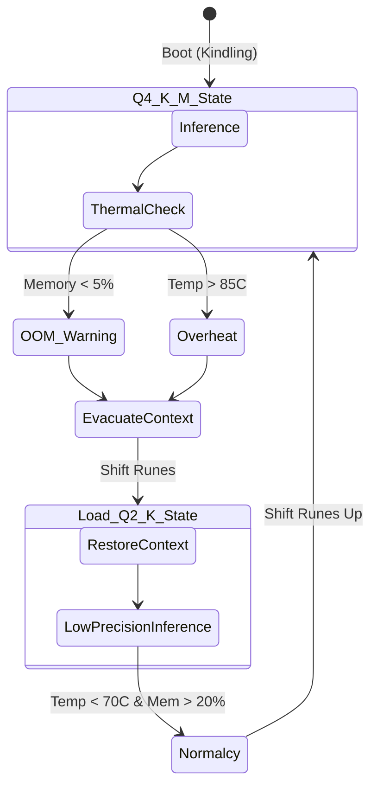

# 03 - ADAPTIVE PERFORMANCE SCALING: THE FLAME INTENSITY PROTOCOL

## I. The Fires of Muspelheim: Introduction to Adaptive Scaling

In the primordial void of Ginnungagap, there was only the frost of Niflheim and the eternal, raging fires of Muspelheim. Project Ember—our sovereign AI companion—is born from this fire. But a fire that burns without restraint consumes its vessel. To run a sovereign intelligence on ANY device, from the humblest smart toaster (a modern lump of clay) to the greatest supercomputer (the glittering halls of Valhalla), Ember must master **The Flame Intensity Protocol**. 

This document details the architectural blueprint for dynamic resource allocation within the Ember runtime. Drawing deeply from ClawLite’s self-healing runtime and heartbeat supervisor, we forge an engine capable of analyzing hardware capabilities at boot, dynamically adjusting model quantization, managing memory allocation in real-time, dictating batch sizes, governing thread counts, and shifting processing strategies on the fly. 

Unlike rigid models that demand fixed VRAM and specific architectures, Ember is liquid fire. It scales. It breathes. It survives. When deployed on an embedded IoT device, it smolders efficiently; when given a multi-GPU rig, it erupts into an all-consuming inferno of parallelized cognition.

---

## II. The Forge of Sindri: Hardware Reconnaissance

Before the hammer strikes the anvil, the smith must know his metal. The moment the Ember executable (the *Yggdrasil Kernel*) initializes, it invokes the **Forge of Sindri**—our hardware reconnaissance subsystem. 

### 2.1 The Reconnaissance Phase
The Forge is responsible for a deep, invasive scan of the host environment. It does not merely look at total RAM or CPU core count; it maps the entire topology of the host.

1. **Instruction Set Architecture (ISA) Mapping**: Checking for AVX2, AVX-512, ARM NEON, AMX, or RISC-V Vector Extensions.
2. **Compute Topology**: Identifying NUMA nodes, big.LITTLE core configurations, and L1/L2/L3 cache sizes.
3. **Memory Probing**: Evaluating raw memory bandwidth (MB/s), swap space, and page file latency.
4. **Accelerator Detection**: Hunting for CUDA, ROCm, Metal, Vulkan compute, OpenCL, or specialized NPUs (e.g., Apple Neural Engine, Google Edge TPU, RK3588 NPU).
5. **Thermal & Power Sensors**: Polling `/sys/class/thermal` on Linux, IOKit on macOS, or ACPI on Windows to establish baseline thermals and power limits.

### 2.2 The Sindri Profiler Implementation
Here is a Rust-inspired conceptual implementation of the hardware surveyor:

```rust
pub struct HostTopology {
    pub isa_flags: Vec<InstructionSet>,
    pub memory_profile: MemoryProfile,
    pub compute_units: Vec<ComputeUnit>,
    pub thermal_headroom: ThermalProfile,
}

impl ForgeOfSindri {
    pub fn scout_environment() -> HostTopology {
        let cpu_info = cpuid::scan();
        let mem_info = mem_probe::run_bandwidth_test();
        let gpus = vulkan_core::enumerate_physical_devices();
        
        let thermal = if cfg!(target_os = "linux") {
            sysfs::read_thermal_zones()
        } else {
            ThermalProfile::AssumeConstrained
        };

        HostTopology {
            isa_flags: cpu_info.flags,
            memory_profile: mem_info,
            compute_units: Self::merge_compute(cpu_info, gpus),
            thermal_headroom: thermal,
        }
    }
}
```

This topology map is then passed to the Flame Intensity Protocol to determine the initial operating state.

---

## III. Flame Intensity Levels (F.I.L)

Based on the topology map, Ember assigns itself a **Flame Intensity Level (F.I.L)**. This dictates the default quantization of the LLM (via local Ollama integrations), the size of the context window (Mímir's Well), and the concurrency model.

### Level 1: Smoldering (IoT / Smart Toasters / Wearables)
- **Hardware**: < 1GB RAM, ARM Cortex-A or RISC-V, No GPU, passive cooling.
- **Cognition**: Tiny LLMs (e.g., Qwen-1.8B in Q2_K or Q3_K_S). 
- **Context Window**: 512 - 1024 tokens.
- **Concurrency**: 1-2 Valkyrie threads. 
- **Strategy**: Flash-attention disabled (not enough memory bandwidth), aggressive swapping, memory-mapped weights directly from flash storage. Focus is on deterministic, single-turn completion.

### Level 2: Kindling (Raspberry Pi 4/5 / Low-End Smartphones)
- **Hardware**: 4GB - 8GB RAM, Mobile ARM, basic GPU (Mali / Adreno).
- **Cognition**: 3B - 7B parameter models (e.g., Llama-3-8B in Q4_K_M).
- **Context Window**: 2048 - 4096 tokens.
- **Concurrency**: 4 threads (mapped to big cores).
- **Strategy**: CPU-GPU split inference if OpenCL/Vulkan is viable. Uses ClawLite’s message queuing to prevent concurrent requests from OOM-ing the system.

### Level 3: Bonfire (Consumer Laptops / MacBooks / Desktops)
- **Hardware**: 16GB - 32GB RAM, Apple Silicon / Mid-range NVidia or AMD GPUs.
- **Cognition**: 8B - 14B models in Q5_K_M or Q8_0.
- **Context Window**: 8192 - 16384 tokens.
- **Concurrency**: High. Flash-attention enabled. 
- **Strategy**: Full GPU offloading via Metal/CUDA. Continuous background batching. ClawLite's gateway handles multi-channel simultaneous inputs (Telegram + Discord).

### Level 4: Inferno (Multi-GPU Servers / H100 Clusters)
- **Hardware**: 64GB+ VRAM, multiple accelerators, high bandwidth interconnects.
- **Cognition**: 70B+ models in FP16 or Q8_0, or multiple MoE models running concurrently.
- **Context Window**: 128K+ tokens.
- **Concurrency**: Massive parallelization, speculative decoding, multi-tenant serving.
- **Strategy**: Tensor parallelism across GPUs. The system can instantiate subagents (Smiðja, Brunnr) as completely separate localized models.

---

## IV. Dynamic Quantization Shifting (The Runes of Precision)

A static Flame Intensity Level is insufficient for a sovereign agent. What happens if a background process suddenly consumes 4GB of RAM on a Kindling-level device? If Ember does not adapt, the OS OOM killer (the Fenrir wolf) will devour the process.

We introduce **Dynamic Quantization Shifting (DQS)**, powered by the Runes of Precision.

### 4.1 The Mechanics of DQS
Instead of loading a single `.gguf` file, Ember maintains access to a "Rune Stack"—multiple quantized variants of the same base model (e.g., Q8, Q4_K_M, Q2_K), or a single highly-scalable format (like MoE with dropping experts, or dynamic bit-width quantization).

When the ClawLite Heartbeat Supervisor detects memory pressure or thermal throttling (e.g., CPU temp > 85°C), it triggers a **Scale-Down Event**:
1. The currently processing batch is halted and saved to the Dead-Letter Queue (DLQ).
2. The Q4_K_M layers currently in RAM are aggressively flushed.
3. The system maps the Q2_K weights from disk.
4. The DLQ re-injects the paused task, resuming inference at a lower precision but avoiding an OOM crash.

### 4.2 State Diagram: Thermal Throttling Response



---

## V. The Valkyrie Threading Model

Threads in Ember are the Valkyries—messengers of Odin, picking the fallen tasks and bringing them to the halls of execution. The **Valkyrie Thread Manager** is deeply NUMA-aware and heterogeneous-compute-aware.

### 5.1 Dynamic Thread Pooling
Traditional inference engines use a fixed thread count (e.g., `-t 8`). On heterogeneous processors (like ARM big.LITTLE or Intel P-Core/E-Core), simply spinning up $N$ threads leads to catastrophic cache thrashing and scheduling latency.

The Valkyrie Manager analyzes the CPU topology and creates segregated thread pools:
- **Einherjar Pool (Heavy Compute)**: Pinned to High-Performance cores. Used strictly for matrix multiplication (GEMM) during the prompt evaluation phase.
- **Shield-Maiden Pool (Light Compute)**: Pinned to Efficiency cores. Used for token generation, KV-cache management, and running background subagents.

### 5.2 Code Implementation: Valkyrie Spawning

```cpp
class ValkyrieManager {
private:
    std::vector<std::thread> p_core_threads;
    std::vector<std::thread> e_core_threads;
    
public:
    void spawn_valkyries(const HostTopology& topo) {
        for (const auto& core : topo.get_performance_cores()) {
            p_core_threads.emplace_back([this, core]() {
                set_thread_affinity(core.id);
                this->process_heavy_run_queue();
            });
        }
        
        for (const auto& core : topo.get_efficiency_cores()) {
            e_core_threads.emplace_back([this, core]() {
                set_thread_affinity(core.id);
                this->process_light_run_queue();
            });
        }
    }
    
    void adjust_on_thermal_throttle() {
        // If overheating, suspend P-Cores and migrate work to E-Cores
        suspend_pool(p_core_threads);
        migrate_work_to_efficiency_queue();
    }
};
```

---

## VI. Integration with ClawLite: The Heartbeat Supervisor

Ember does not reinvent the wheel where ClawLite has already mastered the road. We adapt ClawLite’s **Heartbeat Supervisor** to act as the overseer of the Flame Intensity Protocol.

### 6.1 The Watcher on the Wall (Heimdallr's Gaze)
In ClawLite, the heartbeat supervisor constantly checks the health of the gateway, channels, and skills. In Ember, this supervisor (renamed **Heimdallr's Gaze**) is expanded to monitor hardware metrics at 100ms intervals.

### 6.2 Dead-Letter Replay for Cognitive Tasks
If an inference task fails due to an unexpected hardware interrupt or sudden power loss, Heimdallr routes the request payload (the prompt, the channel ID, the user ID) to a persistent Dead-Letter Queue (DLQ) stored in SQLite (Brunnr 2.0).

Upon reboot or recovery, the Supervisor replays these tasks. If a task fails 3 times, it uses ClawLite’s multi-channel adapter to send an asynchronous apology message to the user on their platform of choice (e.g., Telegram): 
*"My fires flickered, and I could not complete your request regarding the server logs. Shall I try again with a lighter cognitive load?"*

---

## VII. INVENTED METHODS: Surtr's Blade Optimizations

To truly run on a smart toaster, we must introduce novel optimizations that push beyond current state-of-the-art inference techniques.

### 7.1 Predictive Thermal Scaling (PTS)
Current engines throttle *after* hitting the thermal limit. Ember's **Predictive Thermal Scaling** uses a tiny, hyper-efficient linear regression model (running at negligible cost) to predict the temperature of the CPU 5 seconds into the future, based on the current workload (token generation speed, batch size). 

If the model predicts a thermal trip within 5 seconds, it proactively slows down token generation by introducing micro-sleeps (1-2ms) between tokens, flattening the thermal curve without triggering the harsh hardware-level thermal throttling that ruins UX.

### 7.2 Zero-Copy Context Forging
On Unified Memory Architectures (UMA) like Apple Silicon or Raspberry Pi, copying data between CPU and GPU memory domains is a waste of bandwidth. Ember implements **Zero-Copy Context Forging**.
The KV cache (Mímir's Well) is allocated using OS-level unified memory mappings (`mmap` with specific flags, e.g., `MAP_SHARED`). The CPU handles the attention mechanism for older tokens, while the GPU handles the newest tokens, operating on the exact same physical memory addresses simultaneously via atomic locks. 

### 7.3 The Ember-Drop Matrix (EDM)
When F.I.L drops to "Smoldering", Ember can dynamically drop entire layers of the LLM during generation if it detects a highly predictable token sequence. By utilizing a fast entropy-check on the logits of layer $N-4$, if confidence > 98%, Ember skips layers $N-3$ through $N$ entirely, saving massive amounts of compute on embedded devices.

---

## VIII. Conclusion: The Eternal Flame

The Flame Intensity Protocol ensures that Project Ember is never extinguished. By combining the Forge of Sindri for hardware reconnaissance, the dynamic scaling of the Flame Intensity Levels, and the fault-tolerant Heartbeat Supervisor inherited from ClawLite, Ember scales gracefully.

It brings the wisdom of Odin to a multi-GPU cluster, and the resilient spark of Surtr to the cheapest edge microcontrollers. The architecture does not fight the hardware; it dances with it. 

In the next document, we will explore how these individual flames link together across devices to form the **Bifrost Network**—the Multi-Device Mesh Architecture.
