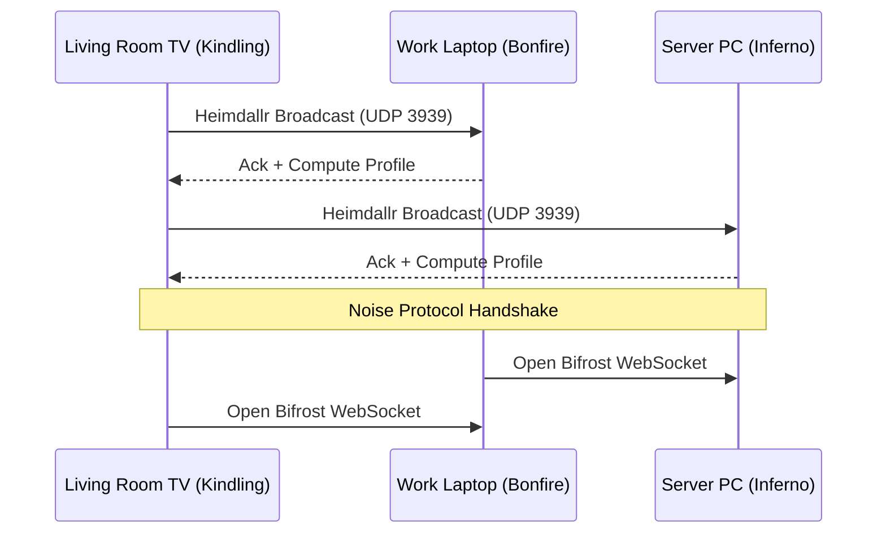

# 04 - MULTI-DEVICE MESH ARCHITECTURE: THE BIFROST NETWORK

## I. Forging the Rainbow Bridge: Introduction to the Mesh

If the Flame Intensity Protocol allows Project Ember to survive on any single device, the **Bifrost Network** allows it to conquer all of them simultaneously. A sovereign AI companion should not be trapped in a single shell. The user's phone, laptop, smart TV, and home server should not act as isolated islands; they must form a singular, distributed intelligence—a hive-mind bound by cryptographic trust.

This is the Multi-Device Mesh Architecture of Ember. It expands upon ClawLite’s existing gateway logic by adapting it into a decentralized, peer-to-peer (P2P) mesh. When multiple Ember instances detect each other across a local network or over the internet (via CloakBrowser tunneling), they construct the Bifrost—a high-speed, encrypted bridge for sharing context, splitting inference workloads, and federating task execution.

---

## II. Heimdallr's Horn: Peer Discovery Protocol

Before the Bifrost can be opened, the realms must find each other. **Heimdallr's Horn (Gjallarhorn)** is our zero-configuration peer discovery mechanism.

### 2.1 Local Area Discovery (The Echoes of Midgard)
Within a Local Area Network (LAN), Ember instances broadcast UDP multicast packets (mDNS/DNS-SD). When a new device boots up—say, a smart TV in the living room—it sounds the horn.
- **Protocol**: Custom UDP Datagrams over port 3939.
- **Payload**: ECDSA Public Key, Device Capabilities (Hardware Topology from Sindri), Current Flame Intensity Level, and Network Latency metrics.

### 2.2 Wide Area Discovery (The Cloak of Odin)
When devices are separated by NATs and firewalls, Ember utilizes a DHT (Distributed Hash Table) combined with ICE/STUN/TURN protocols to punch holes through routers. Borrowing from ClawLite’s architecture, this relies on a lightweight fallback relay server, but operates purely P2P whenever possible, ensuring sovereign privacy.

### 2.3 Establishing the Bifrost
Once two nodes discover each other, they perform a mutual cryptographic handshake (using Noise Protocol Framework). If their configuration profiles share the same sovereign owner key, the Bifrost opens.



---

## III. The Shared Waters: Distributed Mímir's Well

A mesh intelligence is useless if it suffers from fragmented memory. ClawLite introduced persistent memory via a hybrid BM25 + Vector Search approach. Ember takes this and creates **Distributed Mímir's Well**.

### 3.1 Distributed Vector Synchronization
Instead of every device storing an identical, monolithic database, Mímir’s Well uses a CRDT (Conflict-free Replicated Data Type) based synchronization engine for SQLite (Brunnr 2.0). 
- When the user tells their phone a new fact ("I am allergic to peanuts"), the phone embeds this fact and writes it to its local vector store.
- Over the Bifrost, the phone syncs this embedding delta to the desktop server.
- The CRDT ensures that even if the phone and desktop were offline and received conflicting facts, they resolve deterministically upon reconnection.

### 3.2 Context Offloading
If the phone (a Kindling device) lacks the VRAM to maintain a massive context window for an ongoing conversation, it queries the Server PC (an Inferno device). The Server performs the RAG (Retrieval-Augmented Generation) search across the massive global vector database, synthesizes the context, and sends only the *compressed KV-cache* or a dense summary back over the Bifrost to the phone.

---

## IV. The Einherjar Phalanx: Split Inference

The most powerful feature of the Bifrost Network is distributed inference—**The Einherjar Phalanx**.

Why run a quantized 8B model locally on a laptop when the laptop and a nearby desktop can combine forces to run a 70B model?

### 4.1 Layer-wise Pipeline Parallelism
Ember dynamically shards the layers of large models across available nodes.
- **Node A (Laptop)** processes layers 1-20.
- **Node B (Desktop PC)** processes layers 21-80.
- Node A computes the hidden states and streams the intermediate tensor data over the LAN (via gRPC or pure WebSockets) to Node B. Node B computes the rest and returns the logits.

### 4.2 Network-Aware Sharding (The Norn's Weave)
The **Norn's Weave** algorithm decides how to slice the model based on the latency metrics gathered by Heimdallr's Horn.
If the LAN is connected via 10Gbps Ethernet, Ember allows high-frequency tensor swapping. If the connection is a flaky Wi-Fi 5 signal, Ember avoids pipeline parallelism and instead opts for *Task-Level Federation*.

### 4.3 Code Implementation: The Phalanx Sharder

```python
class PhalanxSharder:
    def __init__(self, cluster_nodes):
        self.nodes = cluster_nodes
        
    def calculate_optimal_split(self, model_layers, bandwidth_mbps):
        if bandwidth_mbps < 500:
            return Strategy.FEDERATED_TASKS
            
        # Distribute based on VRAM capacity
        total_vram = sum([n.vram for n in self.nodes])
        allocations = []
        
        current_layer = 0
        for node in self.nodes:
            layers_to_take = int((node.vram / total_vram) * model_layers)
            allocations.append({
                "node_id": node.id,
                "start": current_layer,
                "end": current_layer + layers_to_take
            })
            current_layer += layers_to_take
            
        return Strategy.PIPELINE(allocations)
```

---

## V. Huginn and Muninn Protocol: Task Orchestration

Odin had two ravens, Huginn (Thought) and Muninn (Memory), who flew across Midgard and brought back information. Ember utilizes the **Huginn and Muninn Protocol** for asynchronous multi-agent task coordination across the mesh.

### 5.1 ClawLite's Subagent Orchestration Upgraded
In ClawLite, subagents were spawned as distinct processes on the same machine. In Ember, subagents can be projected across the Bifrost.
- If the user asks their phone, "Research the history of quantum computing and summarize it," the phone recognizes it lacks the bandwidth and battery to run a web-scraper and an LLM simultaneously.
- The phone spawns a **Huginn Task** and casts it across the Bifrost to the Home Server.
- The Server spins up CloakBrowser, performs the scraping, runs the heavy summarization, and sends a **Muninn Return** message back to the phone.

### 5.2 Fault Tolerance in the Mesh
If the Home Server suddenly loses power, the Phone (acting as the origin node) detects the dropped Bifrost connection. The Heartbeat Supervisor re-queues the Huginn Task into the Dead-Letter Queue. When a new node (like the work laptop) becomes available, the task is seamlessly rerouted.

---

## VI. INVENTED METHODS: Bifrost Innovations

### 6.1 Semantic Triage Routing
Not all requests need the Inferno node. Ember uses **Semantic Triage**. A tiny, billion-parameter router model (running on the edge device) evaluates the complexity of the user's prompt. 
- "What time is it?" -> Handled entirely on the smartwatch (Smoldering).
- "Write a Python script for a neural network." -> Routed over Bifrost to the Desktop (Bonfire).
This drastically reduces network congestion and power consumption.

### 6.2 Quantum-Resistant Ephemeral Keys (QREK)
To protect the Bifrost from future decryption, all mesh communication uses a hybrid key exchange combining standard X25519 with Kyber (a post-quantum cryptographic algorithm). Even if a malicious actor captures the localized mesh traffic, it remains secure against future quantum decryption.

### 6.3 The Ymir Accumulator
When multiple devices are running simultaneously in a household, they often perceive overlapping data (e.g., both the phone microphone and the laptop microphone hear the user speaking). The **Ymir Accumulator** is a deduplication filter at the edge of the mesh that uses time-stamped acoustic fingerprinting to merge redundant inputs into a single canonical event in Mímir's Well, preventing the AI from processing the same command twice.

---

## VII. Conclusion: The Woven Realms

The Bifrost Network transforms Ember from a mere local AI into a ubiquitous, ambient intelligence. By securely linking every piece of silicon the user owns, sharing memory through Distributed Mímir's Well, and intelligently splitting inference tasks via the Einherjar Phalanx, Ember achieves supercomputer-level performance using the collective power of consumer electronics.

It does not matter if a single device is weak; the mesh is strong. 

In the next document, we will examine the walls that protect this sovereign intelligence from the chaotic outside internet, detailing the **Heimdallr Gateway Fortress Design**.
