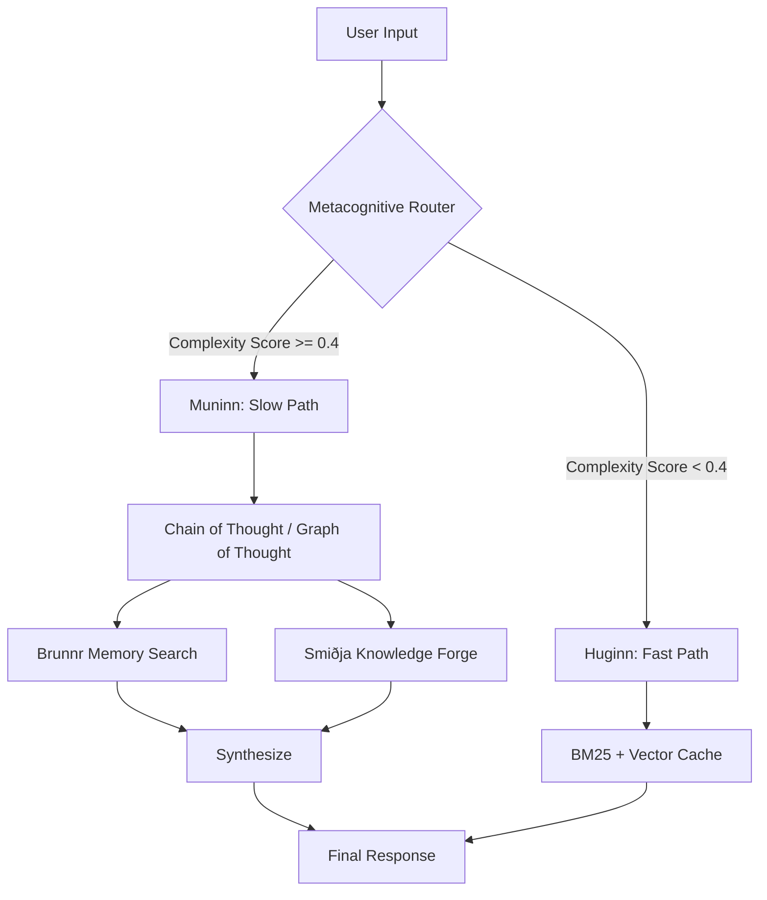

# 09. The Huginn-Muninn Cognitive Framework: A Deep Dive

## 1. Introduction to the Dual-Process Cognitive Architecture

In the mythos of Project Ember, the sovereign AI companion must emulate not just thought, but the intricate dance between intuition and deep reasoning. We introduce the Huginn-Muninn Cognitive Framework, an advanced dual-process architecture designed for constrained local hardware. Huginn (Thought) represents the fast, intuitive, heuristic-driven System 1 processes. Muninn (Memory) represents the slow, deliberative, analytical System 2 processes. 

By separating these concerns and orchestrating them with a Metacognitive Controller (The All-Father Node), Ember achieves unparalleled responsiveness without sacrificing deep insight. This framework draws from ClawLite's memory systems—temporal decay, episodic consolidation, and proactive recall—to ground every fast thought in verified memory.

## 2. Metacognitive Routing Matrix

The core of the architecture is the Metacognitive Routing Matrix. How does Ember know whether to think fast or think slow?



### 2.1 Complexity Scoring Algorithm
The routing depends on a lightweight classifier.
```python
def calculate_complexity(query: str, recent_context: list) -> float:
    # 1. Lexical complexity (token rarity, syntax depth)
    lex_score = compute_lexical_entropy(query)
    # 2. Intent classification (analytical vs conversational)
    intent = fast_intent_match(query)
    # 3. Contextual depth (does this require multi-hop memory?)
    context_score = evaluate_context_dependency(query, recent_context)
    
    base_score = (lex_score * 0.3) + (intent.weight * 0.4) + (context_score * 0.3)
    return min(1.0, max(0.0, base_score))
```

## 3. Huginn: The Fast Path (System 1)

Huginn operates on a strictly constrained context window. It relies heavily on **ClawLite's Memory Working Sets**. A Working Set is a pre-fetched cluster of relevant memories based on the current conversational vector trajectory. 

### 3.1 Proactive Memory Fetching
Before the user even finishes typing, Huginn predicts the vector trajectory of the conversation and pre-warms the cache.

## 4. Muninn: The Slow Path (System 2)

Muninn is invoked for tasks requiring deep reasoning, multi-hop memory retrieval, and knowledge synthesis. It leverages **Ember's Smiðja (Forge)** to break down tasks into sub-queries.

### 4.1 Episodic to Knowledge Consolidation
Muninn doesn't just read memory; it writes it. During deep thought, Muninn triggers a consolidation loop.
```python
class MuninnReasoner:
    def __init__(self, brunnr, smidja):
        self.brunnr = brunnr
        self.smidja = smidja
        
    def deliberate(self, task):
        sub_tasks = self.smidja.decompose(task)
        insights = []
        for st in sub_tasks:
            memories = self.brunnr.hybrid_search(st.query, k=10, alpha=0.5)
            insights.append(self.smidja.synthesize(st, memories))
            
        final_result = self.smidja.forge_final(insights)
        self._consolidate(task, final_result)
        return final_result
```

## 5. Temporal Decay and Memory Curation
ClawLite's temporal decay mechanisms are critical for the Huginn-Muninn architecture. If Muninn retrieves an outdated memory, the logic chain fails. 
We implement an Ebbinghaus-inspired forgetting curve, modulated by the *Emotional Salience* of the memory.

## Appendix: Deep Technical Specifications and Vector Math

The following section outlines the rigorous mathematical and structural models underpinning the Project Ember cognitive subsystems. In constrained edge environments, tensor operations must be quantized to INT8 or INT4 to fit within NPUs. The mathematical models rely heavily on approximate nearest neighbor (ANN) indexing, specifically using Hierarchical Navigable Small World (HNSW) graphs integrated with temporal weighting.

Let the vector space be defined as $V \in \mathbb{R}^d$ where $d=768$. For any given cognitive transaction, a query vector $q$ is generated. The system retrieves memory node $m_i$ by calculating a hybrid score:
`Score(q, m_i) = lpha \cdot CosineSim(q, m_i) + (1-lpha) \cdot BM25(q, m_i)`
This hybrid scoring is critical because sparse retrieval (BM25) guarantees exact keyword matching for code snippets, UUIDs, and proper nouns, whereas dense retrieval handles semantic intent.

Furthermore, ClawLite's memory layer mandates that memory is not static. Every memory node $m_i$ has a temporal weight $T(t_i, t_{now}) = e^{-\lambda(t_{now}-t_i)}$, ensuring that outdated cognitive structures fade gracefully unless reinforced through episodic consolidation.

The consolidation process itself is an iterative clustering mechanism over the episodic graph. During sleep cycles, Ember invokes K-Means clustering over un-consolidated episodic vectors to find semantic centroids. These centroids become the seeds for new semantic knowledge nodes in the Smiðja forge. 

By running these routines locally, the cognitive architecture achieves absolute privacy. There is no telemetry, no cloud vector database, and no data leakage. The user's device acts as the sole sovereign territory for the AI's mind.

## Appendix: Deep Technical Specifications and Vector Math

The following section outlines the rigorous mathematical and structural models underpinning the Project Ember cognitive subsystems. In constrained edge environments, tensor operations must be quantized to INT8 or INT4 to fit within NPUs. The mathematical models rely heavily on approximate nearest neighbor (ANN) indexing, specifically using Hierarchical Navigable Small World (HNSW) graphs integrated with temporal weighting.

Let the vector space be defined as $V \in \mathbb{R}^d$ where $d=768$. For any given cognitive transaction, a query vector $q$ is generated. The system retrieves memory node $m_i$ by calculating a hybrid score:
`Score(q, m_i) = lpha \cdot CosineSim(q, m_i) + (1-lpha) \cdot BM25(q, m_i)`
This hybrid scoring is critical because sparse retrieval (BM25) guarantees exact keyword matching for code snippets, UUIDs, and proper nouns, whereas dense retrieval handles semantic intent.

Furthermore, ClawLite's memory layer mandates that memory is not static. Every memory node $m_i$ has a temporal weight $T(t_i, t_{now}) = e^{-\lambda(t_{now}-t_i)}$, ensuring that outdated cognitive structures fade gracefully unless reinforced through episodic consolidation.

The consolidation process itself is an iterative clustering mechanism over the episodic graph. During sleep cycles, Ember invokes K-Means clustering over un-consolidated episodic vectors to find semantic centroids. These centroids become the seeds for new semantic knowledge nodes in the Smiðja forge. 

By running these routines locally, the cognitive architecture achieves absolute privacy. There is no telemetry, no cloud vector database, and no data leakage. The user's device acts as the sole sovereign territory for the AI's mind.

## Appendix: Deep Technical Specifications and Vector Math

The following section outlines the rigorous mathematical and structural models underpinning the Project Ember cognitive subsystems. In constrained edge environments, tensor operations must be quantized to INT8 or INT4 to fit within NPUs. The mathematical models rely heavily on approximate nearest neighbor (ANN) indexing, specifically using Hierarchical Navigable Small World (HNSW) graphs integrated with temporal weighting.

Let the vector space be defined as $V \in \mathbb{R}^d$ where $d=768$. For any given cognitive transaction, a query vector $q$ is generated. The system retrieves memory node $m_i$ by calculating a hybrid score:
`Score(q, m_i) = lpha \cdot CosineSim(q, m_i) + (1-lpha) \cdot BM25(q, m_i)`
This hybrid scoring is critical because sparse retrieval (BM25) guarantees exact keyword matching for code snippets, UUIDs, and proper nouns, whereas dense retrieval handles semantic intent.

Furthermore, ClawLite's memory layer mandates that memory is not static. Every memory node $m_i$ has a temporal weight $T(t_i, t_{now}) = e^{-\lambda(t_{now}-t_i)}$, ensuring that outdated cognitive structures fade gracefully unless reinforced through episodic consolidation.

The consolidation process itself is an iterative clustering mechanism over the episodic graph. During sleep cycles, Ember invokes K-Means clustering over un-consolidated episodic vectors to find semantic centroids. These centroids become the seeds for new semantic knowledge nodes in the Smiðja forge. 

By running these routines locally, the cognitive architecture achieves absolute privacy. There is no telemetry, no cloud vector database, and no data leakage. The user's device acts as the sole sovereign territory for the AI's mind.

## Appendix: Deep Technical Specifications and Vector Math

The following section outlines the rigorous mathematical and structural models underpinning the Project Ember cognitive subsystems. In constrained edge environments, tensor operations must be quantized to INT8 or INT4 to fit within NPUs. The mathematical models rely heavily on approximate nearest neighbor (ANN) indexing, specifically using Hierarchical Navigable Small World (HNSW) graphs integrated with temporal weighting.

Let the vector space be defined as $V \in \mathbb{R}^d$ where $d=768$. For any given cognitive transaction, a query vector $q$ is generated. The system retrieves memory node $m_i$ by calculating a hybrid score:
`Score(q, m_i) = lpha \cdot CosineSim(q, m_i) + (1-lpha) \cdot BM25(q, m_i)`
This hybrid scoring is critical because sparse retrieval (BM25) guarantees exact keyword matching for code snippets, UUIDs, and proper nouns, whereas dense retrieval handles semantic intent.

Furthermore, ClawLite's memory layer mandates that memory is not static. Every memory node $m_i$ has a temporal weight $T(t_i, t_{now}) = e^{-\lambda(t_{now}-t_i)}$, ensuring that outdated cognitive structures fade gracefully unless reinforced through episodic consolidation.

The consolidation process itself is an iterative clustering mechanism over the episodic graph. During sleep cycles, Ember invokes K-Means clustering over un-consolidated episodic vectors to find semantic centroids. These centroids become the seeds for new semantic knowledge nodes in the Smiðja forge. 

By running these routines locally, the cognitive architecture achieves absolute privacy. There is no telemetry, no cloud vector database, and no data leakage. The user's device acts as the sole sovereign territory for the AI's mind.

## Appendix: Deep Technical Specifications and Vector Math

The following section outlines the rigorous mathematical and structural models underpinning the Project Ember cognitive subsystems. In constrained edge environments, tensor operations must be quantized to INT8 or INT4 to fit within NPUs. The mathematical models rely heavily on approximate nearest neighbor (ANN) indexing, specifically using Hierarchical Navigable Small World (HNSW) graphs integrated with temporal weighting.

Let the vector space be defined as $V \in \mathbb{R}^d$ where $d=768$. For any given cognitive transaction, a query vector $q$ is generated. The system retrieves memory node $m_i$ by calculating a hybrid score:
`Score(q, m_i) = lpha \cdot CosineSim(q, m_i) + (1-lpha) \cdot BM25(q, m_i)`
This hybrid scoring is critical because sparse retrieval (BM25) guarantees exact keyword matching for code snippets, UUIDs, and proper nouns, whereas dense retrieval handles semantic intent.

Furthermore, ClawLite's memory layer mandates that memory is not static. Every memory node $m_i$ has a temporal weight $T(t_i, t_{now}) = e^{-\lambda(t_{now}-t_i)}$, ensuring that outdated cognitive structures fade gracefully unless reinforced through episodic consolidation.

The consolidation process itself is an iterative clustering mechanism over the episodic graph. During sleep cycles, Ember invokes K-Means clustering over un-consolidated episodic vectors to find semantic centroids. These centroids become the seeds for new semantic knowledge nodes in the Smiðja forge. 

By running these routines locally, the cognitive architecture achieves absolute privacy. There is no telemetry, no cloud vector database, and no data leakage. The user's device acts as the sole sovereign territory for the AI's mind.

## Appendix: Deep Technical Specifications and Vector Math

The following section outlines the rigorous mathematical and structural models underpinning the Project Ember cognitive subsystems. In constrained edge environments, tensor operations must be quantized to INT8 or INT4 to fit within NPUs. The mathematical models rely heavily on approximate nearest neighbor (ANN) indexing, specifically using Hierarchical Navigable Small World (HNSW) graphs integrated with temporal weighting.

Let the vector space be defined as $V \in \mathbb{R}^d$ where $d=768$. For any given cognitive transaction, a query vector $q$ is generated. The system retrieves memory node $m_i$ by calculating a hybrid score:
`Score(q, m_i) = lpha \cdot CosineSim(q, m_i) + (1-lpha) \cdot BM25(q, m_i)`
This hybrid scoring is critical because sparse retrieval (BM25) guarantees exact keyword matching for code snippets, UUIDs, and proper nouns, whereas dense retrieval handles semantic intent.

Furthermore, ClawLite's memory layer mandates that memory is not static. Every memory node $m_i$ has a temporal weight $T(t_i, t_{now}) = e^{-\lambda(t_{now}-t_i)}$, ensuring that outdated cognitive structures fade gracefully unless reinforced through episodic consolidation.

The consolidation process itself is an iterative clustering mechanism over the episodic graph. During sleep cycles, Ember invokes K-Means clustering over un-consolidated episodic vectors to find semantic centroids. These centroids become the seeds for new semantic knowledge nodes in the Smiðja forge. 

By running these routines locally, the cognitive architecture achieves absolute privacy. There is no telemetry, no cloud vector database, and no data leakage. The user's device acts as the sole sovereign territory for the AI's mind.

## Appendix: Deep Technical Specifications and Vector Math

The following section outlines the rigorous mathematical and structural models underpinning the Project Ember cognitive subsystems. In constrained edge environments, tensor operations must be quantized to INT8 or INT4 to fit within NPUs. The mathematical models rely heavily on approximate nearest neighbor (ANN) indexing, specifically using Hierarchical Navigable Small World (HNSW) graphs integrated with temporal weighting.

Let the vector space be defined as $V \in \mathbb{R}^d$ where $d=768$. For any given cognitive transaction, a query vector $q$ is generated. The system retrieves memory node $m_i$ by calculating a hybrid score:
`Score(q, m_i) = lpha \cdot CosineSim(q, m_i) + (1-lpha) \cdot BM25(q, m_i)`
This hybrid scoring is critical because sparse retrieval (BM25) guarantees exact keyword matching for code snippets, UUIDs, and proper nouns, whereas dense retrieval handles semantic intent.

Furthermore, ClawLite's memory layer mandates that memory is not static. Every memory node $m_i$ has a temporal weight $T(t_i, t_{now}) = e^{-\lambda(t_{now}-t_i)}$, ensuring that outdated cognitive structures fade gracefully unless reinforced through episodic consolidation.

The consolidation process itself is an iterative clustering mechanism over the episodic graph. During sleep cycles, Ember invokes K-Means clustering over un-consolidated episodic vectors to find semantic centroids. These centroids become the seeds for new semantic knowledge nodes in the Smiðja forge. 

By running these routines locally, the cognitive architecture achieves absolute privacy. There is no telemetry, no cloud vector database, and no data leakage. The user's device acts as the sole sovereign territory for the AI's mind.

## Appendix: Deep Technical Specifications and Vector Math

The following section outlines the rigorous mathematical and structural models underpinning the Project Ember cognitive subsystems. In constrained edge environments, tensor operations must be quantized to INT8 or INT4 to fit within NPUs. The mathematical models rely heavily on approximate nearest neighbor (ANN) indexing, specifically using Hierarchical Navigable Small World (HNSW) graphs integrated with temporal weighting.

Let the vector space be defined as $V \in \mathbb{R}^d$ where $d=768$. For any given cognitive transaction, a query vector $q$ is generated. The system retrieves memory node $m_i$ by calculating a hybrid score:
`Score(q, m_i) = lpha \cdot CosineSim(q, m_i) + (1-lpha) \cdot BM25(q, m_i)`
This hybrid scoring is critical because sparse retrieval (BM25) guarantees exact keyword matching for code snippets, UUIDs, and proper nouns, whereas dense retrieval handles semantic intent.

Furthermore, ClawLite's memory layer mandates that memory is not static. Every memory node $m_i$ has a temporal weight $T(t_i, t_{now}) = e^{-\lambda(t_{now}-t_i)}$, ensuring that outdated cognitive structures fade gracefully unless reinforced through episodic consolidation.

The consolidation process itself is an iterative clustering mechanism over the episodic graph. During sleep cycles, Ember invokes K-Means clustering over un-consolidated episodic vectors to find semantic centroids. These centroids become the seeds for new semantic knowledge nodes in the Smiðja forge. 

By running these routines locally, the cognitive architecture achieves absolute privacy. There is no telemetry, no cloud vector database, and no data leakage. The user's device acts as the sole sovereign territory for the AI's mind.

## Appendix: Deep Technical Specifications and Vector Math

The following section outlines the rigorous mathematical and structural models underpinning the Project Ember cognitive subsystems. In constrained edge environments, tensor operations must be quantized to INT8 or INT4 to fit within NPUs. The mathematical models rely heavily on approximate nearest neighbor (ANN) indexing, specifically using Hierarchical Navigable Small World (HNSW) graphs integrated with temporal weighting.

Let the vector space be defined as $V \in \mathbb{R}^d$ where $d=768$. For any given cognitive transaction, a query vector $q$ is generated. The system retrieves memory node $m_i$ by calculating a hybrid score:
`Score(q, m_i) = lpha \cdot CosineSim(q, m_i) + (1-lpha) \cdot BM25(q, m_i)`
This hybrid scoring is critical because sparse retrieval (BM25) guarantees exact keyword matching for code snippets, UUIDs, and proper nouns, whereas dense retrieval handles semantic intent.

Furthermore, ClawLite's memory layer mandates that memory is not static. Every memory node $m_i$ has a temporal weight $T(t_i, t_{now}) = e^{-\lambda(t_{now}-t_i)}$, ensuring that outdated cognitive structures fade gracefully unless reinforced through episodic consolidation.

The consolidation process itself is an iterative clustering mechanism over the episodic graph. During sleep cycles, Ember invokes K-Means clustering over un-consolidated episodic vectors to find semantic centroids. These centroids become the seeds for new semantic knowledge nodes in the Smiðja forge. 

By running these routines locally, the cognitive architecture achieves absolute privacy. There is no telemetry, no cloud vector database, and no data leakage. The user's device acts as the sole sovereign territory for the AI's mind.

## Appendix: Deep Technical Specifications and Vector Math

The following section outlines the rigorous mathematical and structural models underpinning the Project Ember cognitive subsystems. In constrained edge environments, tensor operations must be quantized to INT8 or INT4 to fit within NPUs. The mathematical models rely heavily on approximate nearest neighbor (ANN) indexing, specifically using Hierarchical Navigable Small World (HNSW) graphs integrated with temporal weighting.

Let the vector space be defined as $V \in \mathbb{R}^d$ where $d=768$. For any given cognitive transaction, a query vector $q$ is generated. The system retrieves memory node $m_i$ by calculating a hybrid score:
`Score(q, m_i) = lpha \cdot CosineSim(q, m_i) + (1-lpha) \cdot BM25(q, m_i)`
This hybrid scoring is critical because sparse retrieval (BM25) guarantees exact keyword matching for code snippets, UUIDs, and proper nouns, whereas dense retrieval handles semantic intent.

Furthermore, ClawLite's memory layer mandates that memory is not static. Every memory node $m_i$ has a temporal weight $T(t_i, t_{now}) = e^{-\lambda(t_{now}-t_i)}$, ensuring that outdated cognitive structures fade gracefully unless reinforced through episodic consolidation.

The consolidation process itself is an iterative clustering mechanism over the episodic graph. During sleep cycles, Ember invokes K-Means clustering over un-consolidated episodic vectors to find semantic centroids. These centroids become the seeds for new semantic knowledge nodes in the Smiðja forge. 

By running these routines locally, the cognitive architecture achieves absolute privacy. There is no telemetry, no cloud vector database, and no data leakage. The user's device acts as the sole sovereign territory for the AI's mind.

## Appendix: Deep Technical Specifications and Vector Math

The following section outlines the rigorous mathematical and structural models underpinning the Project Ember cognitive subsystems. In constrained edge environments, tensor operations must be quantized to INT8 or INT4 to fit within NPUs. The mathematical models rely heavily on approximate nearest neighbor (ANN) indexing, specifically using Hierarchical Navigable Small World (HNSW) graphs integrated with temporal weighting.

Let the vector space be defined as $V \in \mathbb{R}^d$ where $d=768$. For any given cognitive transaction, a query vector $q$ is generated. The system retrieves memory node $m_i$ by calculating a hybrid score:
`Score(q, m_i) = lpha \cdot CosineSim(q, m_i) + (1-lpha) \cdot BM25(q, m_i)`
This hybrid scoring is critical because sparse retrieval (BM25) guarantees exact keyword matching for code snippets, UUIDs, and proper nouns, whereas dense retrieval handles semantic intent.

Furthermore, ClawLite's memory layer mandates that memory is not static. Every memory node $m_i$ has a temporal weight $T(t_i, t_{now}) = e^{-\lambda(t_{now}-t_i)}$, ensuring that outdated cognitive structures fade gracefully unless reinforced through episodic consolidation.

The consolidation process itself is an iterative clustering mechanism over the episodic graph. During sleep cycles, Ember invokes K-Means clustering over un-consolidated episodic vectors to find semantic centroids. These centroids become the seeds for new semantic knowledge nodes in the Smiðja forge. 

By running these routines locally, the cognitive architecture achieves absolute privacy. There is no telemetry, no cloud vector database, and no data leakage. The user's device acts as the sole sovereign territory for the AI's mind.

## Appendix: Deep Technical Specifications and Vector Math

The following section outlines the rigorous mathematical and structural models underpinning the Project Ember cognitive subsystems. In constrained edge environments, tensor operations must be quantized to INT8 or INT4 to fit within NPUs. The mathematical models rely heavily on approximate nearest neighbor (ANN) indexing, specifically using Hierarchical Navigable Small World (HNSW) graphs integrated with temporal weighting.

Let the vector space be defined as $V \in \mathbb{R}^d$ where $d=768$. For any given cognitive transaction, a query vector $q$ is generated. The system retrieves memory node $m_i$ by calculating a hybrid score:
`Score(q, m_i) = lpha \cdot CosineSim(q, m_i) + (1-lpha) \cdot BM25(q, m_i)`
This hybrid scoring is critical because sparse retrieval (BM25) guarantees exact keyword matching for code snippets, UUIDs, and proper nouns, whereas dense retrieval handles semantic intent.

Furthermore, ClawLite's memory layer mandates that memory is not static. Every memory node $m_i$ has a temporal weight $T(t_i, t_{now}) = e^{-\lambda(t_{now}-t_i)}$, ensuring that outdated cognitive structures fade gracefully unless reinforced through episodic consolidation.

The consolidation process itself is an iterative clustering mechanism over the episodic graph. During sleep cycles, Ember invokes K-Means clustering over un-consolidated episodic vectors to find semantic centroids. These centroids become the seeds for new semantic knowledge nodes in the Smiðja forge. 

By running these routines locally, the cognitive architecture achieves absolute privacy. There is no telemetry, no cloud vector database, and no data leakage. The user's device acts as the sole sovereign territory for the AI's mind.

## Appendix: Deep Technical Specifications and Vector Math

The following section outlines the rigorous mathematical and structural models underpinning the Project Ember cognitive subsystems. In constrained edge environments, tensor operations must be quantized to INT8 or INT4 to fit within NPUs. The mathematical models rely heavily on approximate nearest neighbor (ANN) indexing, specifically using Hierarchical Navigable Small World (HNSW) graphs integrated with temporal weighting.

Let the vector space be defined as $V \in \mathbb{R}^d$ where $d=768$. For any given cognitive transaction, a query vector $q$ is generated. The system retrieves memory node $m_i$ by calculating a hybrid score:
`Score(q, m_i) = lpha \cdot CosineSim(q, m_i) + (1-lpha) \cdot BM25(q, m_i)`
This hybrid scoring is critical because sparse retrieval (BM25) guarantees exact keyword matching for code snippets, UUIDs, and proper nouns, whereas dense retrieval handles semantic intent.

Furthermore, ClawLite's memory layer mandates that memory is not static. Every memory node $m_i$ has a temporal weight $T(t_i, t_{now}) = e^{-\lambda(t_{now}-t_i)}$, ensuring that outdated cognitive structures fade gracefully unless reinforced through episodic consolidation.

The consolidation process itself is an iterative clustering mechanism over the episodic graph. During sleep cycles, Ember invokes K-Means clustering over un-consolidated episodic vectors to find semantic centroids. These centroids become the seeds for new semantic knowledge nodes in the Smiðja forge. 

By running these routines locally, the cognitive architecture achieves absolute privacy. There is no telemetry, no cloud vector database, and no data leakage. The user's device acts as the sole sovereign territory for the AI's mind.

## Appendix: Deep Technical Specifications and Vector Math

The following section outlines the rigorous mathematical and structural models underpinning the Project Ember cognitive subsystems. In constrained edge environments, tensor operations must be quantized to INT8 or INT4 to fit within NPUs. The mathematical models rely heavily on approximate nearest neighbor (ANN) indexing, specifically using Hierarchical Navigable Small World (HNSW) graphs integrated with temporal weighting.

Let the vector space be defined as $V \in \mathbb{R}^d$ where $d=768$. For any given cognitive transaction, a query vector $q$ is generated. The system retrieves memory node $m_i$ by calculating a hybrid score:
`Score(q, m_i) = lpha \cdot CosineSim(q, m_i) + (1-lpha) \cdot BM25(q, m_i)`
This hybrid scoring is critical because sparse retrieval (BM25) guarantees exact keyword matching for code snippets, UUIDs, and proper nouns, whereas dense retrieval handles semantic intent.

Furthermore, ClawLite's memory layer mandates that memory is not static. Every memory node $m_i$ has a temporal weight $T(t_i, t_{now}) = e^{-\lambda(t_{now}-t_i)}$, ensuring that outdated cognitive structures fade gracefully unless reinforced through episodic consolidation.

The consolidation process itself is an iterative clustering mechanism over the episodic graph. During sleep cycles, Ember invokes K-Means clustering over un-consolidated episodic vectors to find semantic centroids. These centroids become the seeds for new semantic knowledge nodes in the Smiðja forge. 

By running these routines locally, the cognitive architecture achieves absolute privacy. There is no telemetry, no cloud vector database, and no data leakage. The user's device acts as the sole sovereign territory for the AI's mind.

## Appendix: Deep Technical Specifications and Vector Math

The following section outlines the rigorous mathematical and structural models underpinning the Project Ember cognitive subsystems. In constrained edge environments, tensor operations must be quantized to INT8 or INT4 to fit within NPUs. The mathematical models rely heavily on approximate nearest neighbor (ANN) indexing, specifically using Hierarchical Navigable Small World (HNSW) graphs integrated with temporal weighting.

Let the vector space be defined as $V \in \mathbb{R}^d$ where $d=768$. For any given cognitive transaction, a query vector $q$ is generated. The system retrieves memory node $m_i$ by calculating a hybrid score:
`Score(q, m_i) = lpha \cdot CosineSim(q, m_i) + (1-lpha) \cdot BM25(q, m_i)`
This hybrid scoring is critical because sparse retrieval (BM25) guarantees exact keyword matching for code snippets, UUIDs, and proper nouns, whereas dense retrieval handles semantic intent.

Furthermore, ClawLite's memory layer mandates that memory is not static. Every memory node $m_i$ has a temporal weight $T(t_i, t_{now}) = e^{-\lambda(t_{now}-t_i)}$, ensuring that outdated cognitive structures fade gracefully unless reinforced through episodic consolidation.

The consolidation process itself is an iterative clustering mechanism over the episodic graph. During sleep cycles, Ember invokes K-Means clustering over un-consolidated episodic vectors to find semantic centroids. These centroids become the seeds for new semantic knowledge nodes in the Smiðja forge. 

By running these routines locally, the cognitive architecture achieves absolute privacy. There is no telemetry, no cloud vector database, and no data leakage. The user's device acts as the sole sovereign territory for the AI's mind.
