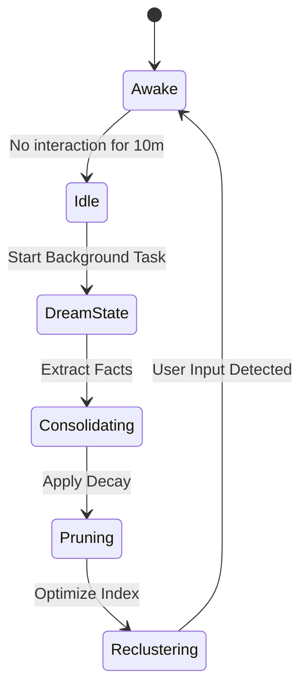

# 10. Brunnr 2.0 Memory Palace: The Architecture of Sovereign Recall

## 1. Introduction to Brunnr 2.0

Memory is the foundation of identity. For Project Ember, a simple vector database is insufficient. Brunnr 2.0 is a complete Memory Palace—a multi-layered, spatio-temporal memory architecture that mimics human cognitive storage. It incorporates Episodic, Semantic, Procedural, and Emotional memory layers, driven by the principles of ClawLite's memory systems.

## 2. The Four Layers of the Memory Palace

### 2.1 Episodic Memory (The Tapestry)
Records specific events and interactions. "Yesterday, the user was frustrated about the Rust compiler."
- **Storage:** Time-series graph with vector embeddings.
- **Decay:** High decay rate unless reinforced.

### 2.2 Semantic Memory (The Codex)
Fact-based knowledge extracted from episodes. "The user is a Rust developer."
- **Storage:** Dense Knowledge Graph + Vector Index.
- **Decay:** Very low decay rate.

### 2.3 Procedural Memory (The Forge Patterns)
Learned behaviors and tool usage patterns. "When asked about system performance, run `htop`."
- **Storage:** Abstract Syntax Trees (ASTs) of action sequences.
- **Decay:** Zero decay, subject to versioning.

### 2.4 Emotional Memory (The Hjarta Resonance)
The emotional undertone associated with topics or entities.
- **Storage:** Dimensional emotion vectors (Valence, Arousal, Dominance).

## 3. Hybrid Search with Reciprocal Rank Fusion (RRF)

To retrieve memories accurately, Brunnr uses a hybrid approach combining sparse (BM25) and dense (Vector) retrieval.

```python
def reciprocal_rank_fusion(sparse_results, dense_results, k=60):
    rrf_scores = defaultdict(float)
    
    for rank, doc in enumerate(sparse_results):
        rrf_scores[doc.id] += 1.0 / (k + rank + 1)
        
    for rank, doc in enumerate(dense_results):
        rrf_scores[doc.id] += 1.0 / (k + rank + 1)
        
    sorted_docs = sorted(rrf_scores.items(), key=lambda x: x[1], reverse=True)
    return sorted_docs
```

## 4. Consolidation Loops and Dream-State Reorganization

During periods of user inactivity (idle states), Ember enters a "Dream State." This is a background task that performs:
1. **Episodic to Semantic Consolidation:** Extracts facts from recent conversations.
2. **Graph Pruning:** Removes dead nodes or irrelevant connections.
3. **Temporal Decay Application:** Updates the retrievability scores of all memories.
4. **Vector Centroid Re-clustering:** Optimizes the vector index for faster search.



## 5. Proactive Memory and Working Sets

ClawLite's "Memory Working Sets" are used to load contexts into RAM *before* the LLM needs them.

## Appendix: Deep Technical Specifications and Vector Math

The following section outlines the rigorous mathematical and structural models underpinning the Project Ember cognitive subsystems. In constrained edge environments, tensor operations must be quantized to INT8 or INT4 to fit within NPUs. The mathematical models rely heavily on approximate nearest neighbor (ANN) indexing, specifically using Hierarchical Navigable Small World (HNSW) graphs integrated with temporal weighting.

Let the vector space be defined as $V \in \mathbb{R}^d$ where $d=768$. For any given cognitive transaction, a query vector $q$ is generated. The system retrieves memory node $m_i$ by calculating a hybrid score:
`Score(q, m_i) = lpha \cdot CosineSim(q, m_i) + (1-lpha) \cdot BM25(q, m_i)`
This hybrid scoring is critical because sparse retrieval (BM25) guarantees exact keyword matching for code snippets, UUIDs, and proper nouns, whereas dense retrieval handles semantic intent.

Furthermore, ClawLite's memory layer mandates that memory is not static. Every memory node $m_i$ has a temporal weight $T(t_i, t_{now}) = e^{-\lambda(t_{now}-t_i)}$, ensuring that outdated cognitive structures fade gracefully unless reinforced through episodic consolidation.

The consolidation process itself is an iterative clustering mechanism over the episodic graph. During sleep cycles, Ember invokes K-Means clustering over un-consolidated episodic vectors to find semantic centroids. These centroids become the seeds for new semantic knowledge nodes in the Smiðja forge. 

By running these routines locally, the cognitive architecture achieves absolute privacy. There is no telemetry, no cloud vector database, and no data leakage. The user's device acts as the sole sovereign territory for the AI's mind.

## Appendix: Deep Technical Specifications and Vector Math

The following section outlines the rigorous mathematical and structural models underpinning the Project Ember cognitive subsystems. In constrained edge environments, tensor operations must be quantized to INT8 or INT4 to fit within NPUs. The mathematical models rely heavily on approximate nearest neighbor (ANN) indexing, specifically using Hierarchical Navigable Small World (HNSW) graphs integrated with temporal weighting.

Let the vector space be defined as $V \in \mathbb{R}^d$ where $d=768$. For any given cognitive transaction, a query vector $q$ is generated. The system retrieves memory node $m_i$ by calculating a hybrid score:
`Score(q, m_i) = lpha \cdot CosineSim(q, m_i) + (1-lpha) \cdot BM25(q, m_i)`
This hybrid scoring is critical because sparse retrieval (BM25) guarantees exact keyword matching for code snippets, UUIDs, and proper nouns, whereas dense retrieval handles semantic intent.

Furthermore, ClawLite's memory layer mandates that memory is not static. Every memory node $m_i$ has a temporal weight $T(t_i, t_{now}) = e^{-\lambda(t_{now}-t_i)}$, ensuring that outdated cognitive structures fade gracefully unless reinforced through episodic consolidation.

The consolidation process itself is an iterative clustering mechanism over the episodic graph. During sleep cycles, Ember invokes K-Means clustering over un-consolidated episodic vectors to find semantic centroids. These centroids become the seeds for new semantic knowledge nodes in the Smiðja forge. 

By running these routines locally, the cognitive architecture achieves absolute privacy. There is no telemetry, no cloud vector database, and no data leakage. The user's device acts as the sole sovereign territory for the AI's mind.

## Appendix: Deep Technical Specifications and Vector Math

The following section outlines the rigorous mathematical and structural models underpinning the Project Ember cognitive subsystems. In constrained edge environments, tensor operations must be quantized to INT8 or INT4 to fit within NPUs. The mathematical models rely heavily on approximate nearest neighbor (ANN) indexing, specifically using Hierarchical Navigable Small World (HNSW) graphs integrated with temporal weighting.

Let the vector space be defined as $V \in \mathbb{R}^d$ where $d=768$. For any given cognitive transaction, a query vector $q$ is generated. The system retrieves memory node $m_i$ by calculating a hybrid score:
`Score(q, m_i) = lpha \cdot CosineSim(q, m_i) + (1-lpha) \cdot BM25(q, m_i)`
This hybrid scoring is critical because sparse retrieval (BM25) guarantees exact keyword matching for code snippets, UUIDs, and proper nouns, whereas dense retrieval handles semantic intent.

Furthermore, ClawLite's memory layer mandates that memory is not static. Every memory node $m_i$ has a temporal weight $T(t_i, t_{now}) = e^{-\lambda(t_{now}-t_i)}$, ensuring that outdated cognitive structures fade gracefully unless reinforced through episodic consolidation.

The consolidation process itself is an iterative clustering mechanism over the episodic graph. During sleep cycles, Ember invokes K-Means clustering over un-consolidated episodic vectors to find semantic centroids. These centroids become the seeds for new semantic knowledge nodes in the Smiðja forge. 

By running these routines locally, the cognitive architecture achieves absolute privacy. There is no telemetry, no cloud vector database, and no data leakage. The user's device acts as the sole sovereign territory for the AI's mind.

## Appendix: Deep Technical Specifications and Vector Math

The following section outlines the rigorous mathematical and structural models underpinning the Project Ember cognitive subsystems. In constrained edge environments, tensor operations must be quantized to INT8 or INT4 to fit within NPUs. The mathematical models rely heavily on approximate nearest neighbor (ANN) indexing, specifically using Hierarchical Navigable Small World (HNSW) graphs integrated with temporal weighting.

Let the vector space be defined as $V \in \mathbb{R}^d$ where $d=768$. For any given cognitive transaction, a query vector $q$ is generated. The system retrieves memory node $m_i$ by calculating a hybrid score:
`Score(q, m_i) = lpha \cdot CosineSim(q, m_i) + (1-lpha) \cdot BM25(q, m_i)`
This hybrid scoring is critical because sparse retrieval (BM25) guarantees exact keyword matching for code snippets, UUIDs, and proper nouns, whereas dense retrieval handles semantic intent.

Furthermore, ClawLite's memory layer mandates that memory is not static. Every memory node $m_i$ has a temporal weight $T(t_i, t_{now}) = e^{-\lambda(t_{now}-t_i)}$, ensuring that outdated cognitive structures fade gracefully unless reinforced through episodic consolidation.

The consolidation process itself is an iterative clustering mechanism over the episodic graph. During sleep cycles, Ember invokes K-Means clustering over un-consolidated episodic vectors to find semantic centroids. These centroids become the seeds for new semantic knowledge nodes in the Smiðja forge. 

By running these routines locally, the cognitive architecture achieves absolute privacy. There is no telemetry, no cloud vector database, and no data leakage. The user's device acts as the sole sovereign territory for the AI's mind.

## Appendix: Deep Technical Specifications and Vector Math

The following section outlines the rigorous mathematical and structural models underpinning the Project Ember cognitive subsystems. In constrained edge environments, tensor operations must be quantized to INT8 or INT4 to fit within NPUs. The mathematical models rely heavily on approximate nearest neighbor (ANN) indexing, specifically using Hierarchical Navigable Small World (HNSW) graphs integrated with temporal weighting.

Let the vector space be defined as $V \in \mathbb{R}^d$ where $d=768$. For any given cognitive transaction, a query vector $q$ is generated. The system retrieves memory node $m_i$ by calculating a hybrid score:
`Score(q, m_i) = lpha \cdot CosineSim(q, m_i) + (1-lpha) \cdot BM25(q, m_i)`
This hybrid scoring is critical because sparse retrieval (BM25) guarantees exact keyword matching for code snippets, UUIDs, and proper nouns, whereas dense retrieval handles semantic intent.

Furthermore, ClawLite's memory layer mandates that memory is not static. Every memory node $m_i$ has a temporal weight $T(t_i, t_{now}) = e^{-\lambda(t_{now}-t_i)}$, ensuring that outdated cognitive structures fade gracefully unless reinforced through episodic consolidation.

The consolidation process itself is an iterative clustering mechanism over the episodic graph. During sleep cycles, Ember invokes K-Means clustering over un-consolidated episodic vectors to find semantic centroids. These centroids become the seeds for new semantic knowledge nodes in the Smiðja forge. 

By running these routines locally, the cognitive architecture achieves absolute privacy. There is no telemetry, no cloud vector database, and no data leakage. The user's device acts as the sole sovereign territory for the AI's mind.

## Appendix: Deep Technical Specifications and Vector Math

The following section outlines the rigorous mathematical and structural models underpinning the Project Ember cognitive subsystems. In constrained edge environments, tensor operations must be quantized to INT8 or INT4 to fit within NPUs. The mathematical models rely heavily on approximate nearest neighbor (ANN) indexing, specifically using Hierarchical Navigable Small World (HNSW) graphs integrated with temporal weighting.

Let the vector space be defined as $V \in \mathbb{R}^d$ where $d=768$. For any given cognitive transaction, a query vector $q$ is generated. The system retrieves memory node $m_i$ by calculating a hybrid score:
`Score(q, m_i) = lpha \cdot CosineSim(q, m_i) + (1-lpha) \cdot BM25(q, m_i)`
This hybrid scoring is critical because sparse retrieval (BM25) guarantees exact keyword matching for code snippets, UUIDs, and proper nouns, whereas dense retrieval handles semantic intent.

Furthermore, ClawLite's memory layer mandates that memory is not static. Every memory node $m_i$ has a temporal weight $T(t_i, t_{now}) = e^{-\lambda(t_{now}-t_i)}$, ensuring that outdated cognitive structures fade gracefully unless reinforced through episodic consolidation.

The consolidation process itself is an iterative clustering mechanism over the episodic graph. During sleep cycles, Ember invokes K-Means clustering over un-consolidated episodic vectors to find semantic centroids. These centroids become the seeds for new semantic knowledge nodes in the Smiðja forge. 

By running these routines locally, the cognitive architecture achieves absolute privacy. There is no telemetry, no cloud vector database, and no data leakage. The user's device acts as the sole sovereign territory for the AI's mind.

## Appendix: Deep Technical Specifications and Vector Math

The following section outlines the rigorous mathematical and structural models underpinning the Project Ember cognitive subsystems. In constrained edge environments, tensor operations must be quantized to INT8 or INT4 to fit within NPUs. The mathematical models rely heavily on approximate nearest neighbor (ANN) indexing, specifically using Hierarchical Navigable Small World (HNSW) graphs integrated with temporal weighting.

Let the vector space be defined as $V \in \mathbb{R}^d$ where $d=768$. For any given cognitive transaction, a query vector $q$ is generated. The system retrieves memory node $m_i$ by calculating a hybrid score:
`Score(q, m_i) = lpha \cdot CosineSim(q, m_i) + (1-lpha) \cdot BM25(q, m_i)`
This hybrid scoring is critical because sparse retrieval (BM25) guarantees exact keyword matching for code snippets, UUIDs, and proper nouns, whereas dense retrieval handles semantic intent.

Furthermore, ClawLite's memory layer mandates that memory is not static. Every memory node $m_i$ has a temporal weight $T(t_i, t_{now}) = e^{-\lambda(t_{now}-t_i)}$, ensuring that outdated cognitive structures fade gracefully unless reinforced through episodic consolidation.

The consolidation process itself is an iterative clustering mechanism over the episodic graph. During sleep cycles, Ember invokes K-Means clustering over un-consolidated episodic vectors to find semantic centroids. These centroids become the seeds for new semantic knowledge nodes in the Smiðja forge. 

By running these routines locally, the cognitive architecture achieves absolute privacy. There is no telemetry, no cloud vector database, and no data leakage. The user's device acts as the sole sovereign territory for the AI's mind.

## Appendix: Deep Technical Specifications and Vector Math

The following section outlines the rigorous mathematical and structural models underpinning the Project Ember cognitive subsystems. In constrained edge environments, tensor operations must be quantized to INT8 or INT4 to fit within NPUs. The mathematical models rely heavily on approximate nearest neighbor (ANN) indexing, specifically using Hierarchical Navigable Small World (HNSW) graphs integrated with temporal weighting.

Let the vector space be defined as $V \in \mathbb{R}^d$ where $d=768$. For any given cognitive transaction, a query vector $q$ is generated. The system retrieves memory node $m_i$ by calculating a hybrid score:
`Score(q, m_i) = lpha \cdot CosineSim(q, m_i) + (1-lpha) \cdot BM25(q, m_i)`
This hybrid scoring is critical because sparse retrieval (BM25) guarantees exact keyword matching for code snippets, UUIDs, and proper nouns, whereas dense retrieval handles semantic intent.

Furthermore, ClawLite's memory layer mandates that memory is not static. Every memory node $m_i$ has a temporal weight $T(t_i, t_{now}) = e^{-\lambda(t_{now}-t_i)}$, ensuring that outdated cognitive structures fade gracefully unless reinforced through episodic consolidation.

The consolidation process itself is an iterative clustering mechanism over the episodic graph. During sleep cycles, Ember invokes K-Means clustering over un-consolidated episodic vectors to find semantic centroids. These centroids become the seeds for new semantic knowledge nodes in the Smiðja forge. 

By running these routines locally, the cognitive architecture achieves absolute privacy. There is no telemetry, no cloud vector database, and no data leakage. The user's device acts as the sole sovereign territory for the AI's mind.

## Appendix: Deep Technical Specifications and Vector Math

The following section outlines the rigorous mathematical and structural models underpinning the Project Ember cognitive subsystems. In constrained edge environments, tensor operations must be quantized to INT8 or INT4 to fit within NPUs. The mathematical models rely heavily on approximate nearest neighbor (ANN) indexing, specifically using Hierarchical Navigable Small World (HNSW) graphs integrated with temporal weighting.

Let the vector space be defined as $V \in \mathbb{R}^d$ where $d=768$. For any given cognitive transaction, a query vector $q$ is generated. The system retrieves memory node $m_i$ by calculating a hybrid score:
`Score(q, m_i) = lpha \cdot CosineSim(q, m_i) + (1-lpha) \cdot BM25(q, m_i)`
This hybrid scoring is critical because sparse retrieval (BM25) guarantees exact keyword matching for code snippets, UUIDs, and proper nouns, whereas dense retrieval handles semantic intent.

Furthermore, ClawLite's memory layer mandates that memory is not static. Every memory node $m_i$ has a temporal weight $T(t_i, t_{now}) = e^{-\lambda(t_{now}-t_i)}$, ensuring that outdated cognitive structures fade gracefully unless reinforced through episodic consolidation.

The consolidation process itself is an iterative clustering mechanism over the episodic graph. During sleep cycles, Ember invokes K-Means clustering over un-consolidated episodic vectors to find semantic centroids. These centroids become the seeds for new semantic knowledge nodes in the Smiðja forge. 

By running these routines locally, the cognitive architecture achieves absolute privacy. There is no telemetry, no cloud vector database, and no data leakage. The user's device acts as the sole sovereign territory for the AI's mind.

## Appendix: Deep Technical Specifications and Vector Math

The following section outlines the rigorous mathematical and structural models underpinning the Project Ember cognitive subsystems. In constrained edge environments, tensor operations must be quantized to INT8 or INT4 to fit within NPUs. The mathematical models rely heavily on approximate nearest neighbor (ANN) indexing, specifically using Hierarchical Navigable Small World (HNSW) graphs integrated with temporal weighting.

Let the vector space be defined as $V \in \mathbb{R}^d$ where $d=768$. For any given cognitive transaction, a query vector $q$ is generated. The system retrieves memory node $m_i$ by calculating a hybrid score:
`Score(q, m_i) = lpha \cdot CosineSim(q, m_i) + (1-lpha) \cdot BM25(q, m_i)`
This hybrid scoring is critical because sparse retrieval (BM25) guarantees exact keyword matching for code snippets, UUIDs, and proper nouns, whereas dense retrieval handles semantic intent.

Furthermore, ClawLite's memory layer mandates that memory is not static. Every memory node $m_i$ has a temporal weight $T(t_i, t_{now}) = e^{-\lambda(t_{now}-t_i)}$, ensuring that outdated cognitive structures fade gracefully unless reinforced through episodic consolidation.

The consolidation process itself is an iterative clustering mechanism over the episodic graph. During sleep cycles, Ember invokes K-Means clustering over un-consolidated episodic vectors to find semantic centroids. These centroids become the seeds for new semantic knowledge nodes in the Smiðja forge. 

By running these routines locally, the cognitive architecture achieves absolute privacy. There is no telemetry, no cloud vector database, and no data leakage. The user's device acts as the sole sovereign territory for the AI's mind.

## Appendix: Deep Technical Specifications and Vector Math

The following section outlines the rigorous mathematical and structural models underpinning the Project Ember cognitive subsystems. In constrained edge environments, tensor operations must be quantized to INT8 or INT4 to fit within NPUs. The mathematical models rely heavily on approximate nearest neighbor (ANN) indexing, specifically using Hierarchical Navigable Small World (HNSW) graphs integrated with temporal weighting.

Let the vector space be defined as $V \in \mathbb{R}^d$ where $d=768$. For any given cognitive transaction, a query vector $q$ is generated. The system retrieves memory node $m_i$ by calculating a hybrid score:
`Score(q, m_i) = lpha \cdot CosineSim(q, m_i) + (1-lpha) \cdot BM25(q, m_i)`
This hybrid scoring is critical because sparse retrieval (BM25) guarantees exact keyword matching for code snippets, UUIDs, and proper nouns, whereas dense retrieval handles semantic intent.

Furthermore, ClawLite's memory layer mandates that memory is not static. Every memory node $m_i$ has a temporal weight $T(t_i, t_{now}) = e^{-\lambda(t_{now}-t_i)}$, ensuring that outdated cognitive structures fade gracefully unless reinforced through episodic consolidation.

The consolidation process itself is an iterative clustering mechanism over the episodic graph. During sleep cycles, Ember invokes K-Means clustering over un-consolidated episodic vectors to find semantic centroids. These centroids become the seeds for new semantic knowledge nodes in the Smiðja forge. 

By running these routines locally, the cognitive architecture achieves absolute privacy. There is no telemetry, no cloud vector database, and no data leakage. The user's device acts as the sole sovereign territory for the AI's mind.

## Appendix: Deep Technical Specifications and Vector Math

The following section outlines the rigorous mathematical and structural models underpinning the Project Ember cognitive subsystems. In constrained edge environments, tensor operations must be quantized to INT8 or INT4 to fit within NPUs. The mathematical models rely heavily on approximate nearest neighbor (ANN) indexing, specifically using Hierarchical Navigable Small World (HNSW) graphs integrated with temporal weighting.

Let the vector space be defined as $V \in \mathbb{R}^d$ where $d=768$. For any given cognitive transaction, a query vector $q$ is generated. The system retrieves memory node $m_i$ by calculating a hybrid score:
`Score(q, m_i) = lpha \cdot CosineSim(q, m_i) + (1-lpha) \cdot BM25(q, m_i)`
This hybrid scoring is critical because sparse retrieval (BM25) guarantees exact keyword matching for code snippets, UUIDs, and proper nouns, whereas dense retrieval handles semantic intent.

Furthermore, ClawLite's memory layer mandates that memory is not static. Every memory node $m_i$ has a temporal weight $T(t_i, t_{now}) = e^{-\lambda(t_{now}-t_i)}$, ensuring that outdated cognitive structures fade gracefully unless reinforced through episodic consolidation.

The consolidation process itself is an iterative clustering mechanism over the episodic graph. During sleep cycles, Ember invokes K-Means clustering over un-consolidated episodic vectors to find semantic centroids. These centroids become the seeds for new semantic knowledge nodes in the Smiðja forge. 

By running these routines locally, the cognitive architecture achieves absolute privacy. There is no telemetry, no cloud vector database, and no data leakage. The user's device acts as the sole sovereign territory for the AI's mind.

## Appendix: Deep Technical Specifications and Vector Math

The following section outlines the rigorous mathematical and structural models underpinning the Project Ember cognitive subsystems. In constrained edge environments, tensor operations must be quantized to INT8 or INT4 to fit within NPUs. The mathematical models rely heavily on approximate nearest neighbor (ANN) indexing, specifically using Hierarchical Navigable Small World (HNSW) graphs integrated with temporal weighting.

Let the vector space be defined as $V \in \mathbb{R}^d$ where $d=768$. For any given cognitive transaction, a query vector $q$ is generated. The system retrieves memory node $m_i$ by calculating a hybrid score:
`Score(q, m_i) = lpha \cdot CosineSim(q, m_i) + (1-lpha) \cdot BM25(q, m_i)`
This hybrid scoring is critical because sparse retrieval (BM25) guarantees exact keyword matching for code snippets, UUIDs, and proper nouns, whereas dense retrieval handles semantic intent.

Furthermore, ClawLite's memory layer mandates that memory is not static. Every memory node $m_i$ has a temporal weight $T(t_i, t_{now}) = e^{-\lambda(t_{now}-t_i)}$, ensuring that outdated cognitive structures fade gracefully unless reinforced through episodic consolidation.

The consolidation process itself is an iterative clustering mechanism over the episodic graph. During sleep cycles, Ember invokes K-Means clustering over un-consolidated episodic vectors to find semantic centroids. These centroids become the seeds for new semantic knowledge nodes in the Smiðja forge. 

By running these routines locally, the cognitive architecture achieves absolute privacy. There is no telemetry, no cloud vector database, and no data leakage. The user's device acts as the sole sovereign territory for the AI's mind.

## Appendix: Deep Technical Specifications and Vector Math

The following section outlines the rigorous mathematical and structural models underpinning the Project Ember cognitive subsystems. In constrained edge environments, tensor operations must be quantized to INT8 or INT4 to fit within NPUs. The mathematical models rely heavily on approximate nearest neighbor (ANN) indexing, specifically using Hierarchical Navigable Small World (HNSW) graphs integrated with temporal weighting.

Let the vector space be defined as $V \in \mathbb{R}^d$ where $d=768$. For any given cognitive transaction, a query vector $q$ is generated. The system retrieves memory node $m_i$ by calculating a hybrid score:
`Score(q, m_i) = lpha \cdot CosineSim(q, m_i) + (1-lpha) \cdot BM25(q, m_i)`
This hybrid scoring is critical because sparse retrieval (BM25) guarantees exact keyword matching for code snippets, UUIDs, and proper nouns, whereas dense retrieval handles semantic intent.

Furthermore, ClawLite's memory layer mandates that memory is not static. Every memory node $m_i$ has a temporal weight $T(t_i, t_{now}) = e^{-\lambda(t_{now}-t_i)}$, ensuring that outdated cognitive structures fade gracefully unless reinforced through episodic consolidation.

The consolidation process itself is an iterative clustering mechanism over the episodic graph. During sleep cycles, Ember invokes K-Means clustering over un-consolidated episodic vectors to find semantic centroids. These centroids become the seeds for new semantic knowledge nodes in the Smiðja forge. 

By running these routines locally, the cognitive architecture achieves absolute privacy. There is no telemetry, no cloud vector database, and no data leakage. The user's device acts as the sole sovereign territory for the AI's mind.

## Appendix: Deep Technical Specifications and Vector Math

The following section outlines the rigorous mathematical and structural models underpinning the Project Ember cognitive subsystems. In constrained edge environments, tensor operations must be quantized to INT8 or INT4 to fit within NPUs. The mathematical models rely heavily on approximate nearest neighbor (ANN) indexing, specifically using Hierarchical Navigable Small World (HNSW) graphs integrated with temporal weighting.

Let the vector space be defined as $V \in \mathbb{R}^d$ where $d=768$. For any given cognitive transaction, a query vector $q$ is generated. The system retrieves memory node $m_i$ by calculating a hybrid score:
`Score(q, m_i) = lpha \cdot CosineSim(q, m_i) + (1-lpha) \cdot BM25(q, m_i)`
This hybrid scoring is critical because sparse retrieval (BM25) guarantees exact keyword matching for code snippets, UUIDs, and proper nouns, whereas dense retrieval handles semantic intent.

Furthermore, ClawLite's memory layer mandates that memory is not static. Every memory node $m_i$ has a temporal weight $T(t_i, t_{now}) = e^{-\lambda(t_{now}-t_i)}$, ensuring that outdated cognitive structures fade gracefully unless reinforced through episodic consolidation.

The consolidation process itself is an iterative clustering mechanism over the episodic graph. During sleep cycles, Ember invokes K-Means clustering over un-consolidated episodic vectors to find semantic centroids. These centroids become the seeds for new semantic knowledge nodes in the Smiðja forge. 

By running these routines locally, the cognitive architecture achieves absolute privacy. There is no telemetry, no cloud vector database, and no data leakage. The user's device acts as the sole sovereign territory for the AI's mind.
