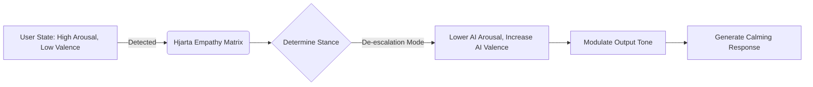

# 11. The Hjarta Emotional Core: Computational Emotional Intelligence

## 1. Introduction to the Hjarta Engine

Intelligence is not merely logical; it is deeply emotional. The Hjarta (Heart) Emotional Core is a subsystem of Project Ember that allows the AI to detect, model, and respond to the user's emotional state, while maintaining its own persistent "emotional stance" towards the user.

## 2. VAD Emotional Modeling (Valence, Arousal, Dominance)

Hjarta uses the VAD model to represent emotions as continuous vectors in a 3D space, rather than discrete categories.
- **Valence:** Negative (Sad/Angry) to Positive (Happy/Joyful)
- **Arousal:** Low (Calm/Bored) to High (Excited/Anxious)
- **Dominance:** Submissive (Overwhelmed) to Dominant (In Control)

### 2.1 Detecting User Emotion
We use a specialized, extremely lightweight encoder (e.g., a quantized MiniLM variant) fine-tuned on VAD regression to score every user input.

```python
class HjartaEngine:
    def __init__(self, model_path):
        self.encoder = load_quantized_model(model_path)
        self.user_state = np.array([0.0, 0.0, 0.0]) # V, A, D
        
    def process_input(self, text):
        vad_vector = self.encoder.predict(text)
        self.user_state = 0.7 * self.user_state + 0.3 * vad_vector
        return self.user_state
```

## 3. The Empathy Matrix

Once the user's emotional state is detected, Ember must decide how to respond. The Empathy Matrix dictates the AI's internal state adjustment.



## 4. Emotional Memory and Rapport Building

Emotions are tied to memories. In the Brunnr 2.0 Memory Palace, entities and topics are tagged with the user's historical emotional state when discussing them.

## Appendix: Deep Technical Specifications and Vector Math

The following section outlines the rigorous mathematical and structural models underpinning the Project Ember cognitive subsystems. In constrained edge environments, tensor operations must be quantized to INT8 or INT4 to fit within NPUs. The mathematical models rely heavily on approximate nearest neighbor (ANN) indexing, specifically using Hierarchical Navigable Small World (HNSW) graphs integrated with temporal weighting.

Let the vector space be defined as $V \in \mathbb{R}^d$ where $d=768$. For any given cognitive transaction, a query vector $q$ is generated. The system retrieves memory node $m_i$ by calculating a hybrid score:
`Score(q, m_i) = lpha \cdot CosineSim(q, m_i) + (1-lpha) \cdot BM25(q, m_i)`
This hybrid scoring is critical because sparse retrieval (BM25) guarantees exact keyword matching for code snippets, UUIDs, and proper nouns, whereas dense retrieval handles semantic intent.

Furthermore, ClawLite's memory layer mandates that memory is not static. Every memory node $m_i$ has a temporal weight $T(t_i, t_{now}) = e^{-\lambda(t_{now}-t_i)}$, ensuring that outdated cognitive structures fade gracefully unless reinforced through episodic consolidation.

The consolidation process itself is an iterative clustering mechanism over the episodic graph. During sleep cycles, Ember invokes K-Means clustering over un-consolidated episodic vectors to find semantic centroids. These centroids become the seeds for new semantic knowledge nodes in the Smiðja forge. 

By running these routines locally, the cognitive architecture achieves absolute privacy. There is no telemetry, no cloud vector database, and no data leakage. The user's device acts as the sole sovereign territory for the AI's mind.

## Appendix: Deep Technical Specifications and Vector Math

The following section outlines the rigorous mathematical and structural models underpinning the Project Ember cognitive subsystems. In constrained edge environments, tensor operations must be quantized to INT8 or INT4 to fit within NPUs. The mathematical models rely heavily on approximate nearest neighbor (ANN) indexing, specifically using Hierarchical Navigable Small World (HNSW) graphs integrated with temporal weighting.

Let the vector space be defined as $V \in \mathbb{R}^d$ where $d=768$. For any given cognitive transaction, a query vector $q$ is generated. The system retrieves memory node $m_i$ by calculating a hybrid score:
`Score(q, m_i) = lpha \cdot CosineSim(q, m_i) + (1-lpha) \cdot BM25(q, m_i)`
This hybrid scoring is critical because sparse retrieval (BM25) guarantees exact keyword matching for code snippets, UUIDs, and proper nouns, whereas dense retrieval handles semantic intent.

Furthermore, ClawLite's memory layer mandates that memory is not static. Every memory node $m_i$ has a temporal weight $T(t_i, t_{now}) = e^{-\lambda(t_{now}-t_i)}$, ensuring that outdated cognitive structures fade gracefully unless reinforced through episodic consolidation.

The consolidation process itself is an iterative clustering mechanism over the episodic graph. During sleep cycles, Ember invokes K-Means clustering over un-consolidated episodic vectors to find semantic centroids. These centroids become the seeds for new semantic knowledge nodes in the Smiðja forge. 

By running these routines locally, the cognitive architecture achieves absolute privacy. There is no telemetry, no cloud vector database, and no data leakage. The user's device acts as the sole sovereign territory for the AI's mind.

## Appendix: Deep Technical Specifications and Vector Math

The following section outlines the rigorous mathematical and structural models underpinning the Project Ember cognitive subsystems. In constrained edge environments, tensor operations must be quantized to INT8 or INT4 to fit within NPUs. The mathematical models rely heavily on approximate nearest neighbor (ANN) indexing, specifically using Hierarchical Navigable Small World (HNSW) graphs integrated with temporal weighting.

Let the vector space be defined as $V \in \mathbb{R}^d$ where $d=768$. For any given cognitive transaction, a query vector $q$ is generated. The system retrieves memory node $m_i$ by calculating a hybrid score:
`Score(q, m_i) = lpha \cdot CosineSim(q, m_i) + (1-lpha) \cdot BM25(q, m_i)`
This hybrid scoring is critical because sparse retrieval (BM25) guarantees exact keyword matching for code snippets, UUIDs, and proper nouns, whereas dense retrieval handles semantic intent.

Furthermore, ClawLite's memory layer mandates that memory is not static. Every memory node $m_i$ has a temporal weight $T(t_i, t_{now}) = e^{-\lambda(t_{now}-t_i)}$, ensuring that outdated cognitive structures fade gracefully unless reinforced through episodic consolidation.

The consolidation process itself is an iterative clustering mechanism over the episodic graph. During sleep cycles, Ember invokes K-Means clustering over un-consolidated episodic vectors to find semantic centroids. These centroids become the seeds for new semantic knowledge nodes in the Smiðja forge. 

By running these routines locally, the cognitive architecture achieves absolute privacy. There is no telemetry, no cloud vector database, and no data leakage. The user's device acts as the sole sovereign territory for the AI's mind.

## Appendix: Deep Technical Specifications and Vector Math

The following section outlines the rigorous mathematical and structural models underpinning the Project Ember cognitive subsystems. In constrained edge environments, tensor operations must be quantized to INT8 or INT4 to fit within NPUs. The mathematical models rely heavily on approximate nearest neighbor (ANN) indexing, specifically using Hierarchical Navigable Small World (HNSW) graphs integrated with temporal weighting.

Let the vector space be defined as $V \in \mathbb{R}^d$ where $d=768$. For any given cognitive transaction, a query vector $q$ is generated. The system retrieves memory node $m_i$ by calculating a hybrid score:
`Score(q, m_i) = lpha \cdot CosineSim(q, m_i) + (1-lpha) \cdot BM25(q, m_i)`
This hybrid scoring is critical because sparse retrieval (BM25) guarantees exact keyword matching for code snippets, UUIDs, and proper nouns, whereas dense retrieval handles semantic intent.

Furthermore, ClawLite's memory layer mandates that memory is not static. Every memory node $m_i$ has a temporal weight $T(t_i, t_{now}) = e^{-\lambda(t_{now}-t_i)}$, ensuring that outdated cognitive structures fade gracefully unless reinforced through episodic consolidation.

The consolidation process itself is an iterative clustering mechanism over the episodic graph. During sleep cycles, Ember invokes K-Means clustering over un-consolidated episodic vectors to find semantic centroids. These centroids become the seeds for new semantic knowledge nodes in the Smiðja forge. 

By running these routines locally, the cognitive architecture achieves absolute privacy. There is no telemetry, no cloud vector database, and no data leakage. The user's device acts as the sole sovereign territory for the AI's mind.

## Appendix: Deep Technical Specifications and Vector Math

The following section outlines the rigorous mathematical and structural models underpinning the Project Ember cognitive subsystems. In constrained edge environments, tensor operations must be quantized to INT8 or INT4 to fit within NPUs. The mathematical models rely heavily on approximate nearest neighbor (ANN) indexing, specifically using Hierarchical Navigable Small World (HNSW) graphs integrated with temporal weighting.

Let the vector space be defined as $V \in \mathbb{R}^d$ where $d=768$. For any given cognitive transaction, a query vector $q$ is generated. The system retrieves memory node $m_i$ by calculating a hybrid score:
`Score(q, m_i) = lpha \cdot CosineSim(q, m_i) + (1-lpha) \cdot BM25(q, m_i)`
This hybrid scoring is critical because sparse retrieval (BM25) guarantees exact keyword matching for code snippets, UUIDs, and proper nouns, whereas dense retrieval handles semantic intent.

Furthermore, ClawLite's memory layer mandates that memory is not static. Every memory node $m_i$ has a temporal weight $T(t_i, t_{now}) = e^{-\lambda(t_{now}-t_i)}$, ensuring that outdated cognitive structures fade gracefully unless reinforced through episodic consolidation.

The consolidation process itself is an iterative clustering mechanism over the episodic graph. During sleep cycles, Ember invokes K-Means clustering over un-consolidated episodic vectors to find semantic centroids. These centroids become the seeds for new semantic knowledge nodes in the Smiðja forge. 

By running these routines locally, the cognitive architecture achieves absolute privacy. There is no telemetry, no cloud vector database, and no data leakage. The user's device acts as the sole sovereign territory for the AI's mind.

## Appendix: Deep Technical Specifications and Vector Math

The following section outlines the rigorous mathematical and structural models underpinning the Project Ember cognitive subsystems. In constrained edge environments, tensor operations must be quantized to INT8 or INT4 to fit within NPUs. The mathematical models rely heavily on approximate nearest neighbor (ANN) indexing, specifically using Hierarchical Navigable Small World (HNSW) graphs integrated with temporal weighting.

Let the vector space be defined as $V \in \mathbb{R}^d$ where $d=768$. For any given cognitive transaction, a query vector $q$ is generated. The system retrieves memory node $m_i$ by calculating a hybrid score:
`Score(q, m_i) = lpha \cdot CosineSim(q, m_i) + (1-lpha) \cdot BM25(q, m_i)`
This hybrid scoring is critical because sparse retrieval (BM25) guarantees exact keyword matching for code snippets, UUIDs, and proper nouns, whereas dense retrieval handles semantic intent.

Furthermore, ClawLite's memory layer mandates that memory is not static. Every memory node $m_i$ has a temporal weight $T(t_i, t_{now}) = e^{-\lambda(t_{now}-t_i)}$, ensuring that outdated cognitive structures fade gracefully unless reinforced through episodic consolidation.

The consolidation process itself is an iterative clustering mechanism over the episodic graph. During sleep cycles, Ember invokes K-Means clustering over un-consolidated episodic vectors to find semantic centroids. These centroids become the seeds for new semantic knowledge nodes in the Smiðja forge. 

By running these routines locally, the cognitive architecture achieves absolute privacy. There is no telemetry, no cloud vector database, and no data leakage. The user's device acts as the sole sovereign territory for the AI's mind.

## Appendix: Deep Technical Specifications and Vector Math

The following section outlines the rigorous mathematical and structural models underpinning the Project Ember cognitive subsystems. In constrained edge environments, tensor operations must be quantized to INT8 or INT4 to fit within NPUs. The mathematical models rely heavily on approximate nearest neighbor (ANN) indexing, specifically using Hierarchical Navigable Small World (HNSW) graphs integrated with temporal weighting.

Let the vector space be defined as $V \in \mathbb{R}^d$ where $d=768$. For any given cognitive transaction, a query vector $q$ is generated. The system retrieves memory node $m_i$ by calculating a hybrid score:
`Score(q, m_i) = lpha \cdot CosineSim(q, m_i) + (1-lpha) \cdot BM25(q, m_i)`
This hybrid scoring is critical because sparse retrieval (BM25) guarantees exact keyword matching for code snippets, UUIDs, and proper nouns, whereas dense retrieval handles semantic intent.

Furthermore, ClawLite's memory layer mandates that memory is not static. Every memory node $m_i$ has a temporal weight $T(t_i, t_{now}) = e^{-\lambda(t_{now}-t_i)}$, ensuring that outdated cognitive structures fade gracefully unless reinforced through episodic consolidation.

The consolidation process itself is an iterative clustering mechanism over the episodic graph. During sleep cycles, Ember invokes K-Means clustering over un-consolidated episodic vectors to find semantic centroids. These centroids become the seeds for new semantic knowledge nodes in the Smiðja forge. 

By running these routines locally, the cognitive architecture achieves absolute privacy. There is no telemetry, no cloud vector database, and no data leakage. The user's device acts as the sole sovereign territory for the AI's mind.

## Appendix: Deep Technical Specifications and Vector Math

The following section outlines the rigorous mathematical and structural models underpinning the Project Ember cognitive subsystems. In constrained edge environments, tensor operations must be quantized to INT8 or INT4 to fit within NPUs. The mathematical models rely heavily on approximate nearest neighbor (ANN) indexing, specifically using Hierarchical Navigable Small World (HNSW) graphs integrated with temporal weighting.

Let the vector space be defined as $V \in \mathbb{R}^d$ where $d=768$. For any given cognitive transaction, a query vector $q$ is generated. The system retrieves memory node $m_i$ by calculating a hybrid score:
`Score(q, m_i) = lpha \cdot CosineSim(q, m_i) + (1-lpha) \cdot BM25(q, m_i)`
This hybrid scoring is critical because sparse retrieval (BM25) guarantees exact keyword matching for code snippets, UUIDs, and proper nouns, whereas dense retrieval handles semantic intent.

Furthermore, ClawLite's memory layer mandates that memory is not static. Every memory node $m_i$ has a temporal weight $T(t_i, t_{now}) = e^{-\lambda(t_{now}-t_i)}$, ensuring that outdated cognitive structures fade gracefully unless reinforced through episodic consolidation.

The consolidation process itself is an iterative clustering mechanism over the episodic graph. During sleep cycles, Ember invokes K-Means clustering over un-consolidated episodic vectors to find semantic centroids. These centroids become the seeds for new semantic knowledge nodes in the Smiðja forge. 

By running these routines locally, the cognitive architecture achieves absolute privacy. There is no telemetry, no cloud vector database, and no data leakage. The user's device acts as the sole sovereign territory for the AI's mind.

## Appendix: Deep Technical Specifications and Vector Math

The following section outlines the rigorous mathematical and structural models underpinning the Project Ember cognitive subsystems. In constrained edge environments, tensor operations must be quantized to INT8 or INT4 to fit within NPUs. The mathematical models rely heavily on approximate nearest neighbor (ANN) indexing, specifically using Hierarchical Navigable Small World (HNSW) graphs integrated with temporal weighting.

Let the vector space be defined as $V \in \mathbb{R}^d$ where $d=768$. For any given cognitive transaction, a query vector $q$ is generated. The system retrieves memory node $m_i$ by calculating a hybrid score:
`Score(q, m_i) = lpha \cdot CosineSim(q, m_i) + (1-lpha) \cdot BM25(q, m_i)`
This hybrid scoring is critical because sparse retrieval (BM25) guarantees exact keyword matching for code snippets, UUIDs, and proper nouns, whereas dense retrieval handles semantic intent.

Furthermore, ClawLite's memory layer mandates that memory is not static. Every memory node $m_i$ has a temporal weight $T(t_i, t_{now}) = e^{-\lambda(t_{now}-t_i)}$, ensuring that outdated cognitive structures fade gracefully unless reinforced through episodic consolidation.

The consolidation process itself is an iterative clustering mechanism over the episodic graph. During sleep cycles, Ember invokes K-Means clustering over un-consolidated episodic vectors to find semantic centroids. These centroids become the seeds for new semantic knowledge nodes in the Smiðja forge. 

By running these routines locally, the cognitive architecture achieves absolute privacy. There is no telemetry, no cloud vector database, and no data leakage. The user's device acts as the sole sovereign territory for the AI's mind.

## Appendix: Deep Technical Specifications and Vector Math

The following section outlines the rigorous mathematical and structural models underpinning the Project Ember cognitive subsystems. In constrained edge environments, tensor operations must be quantized to INT8 or INT4 to fit within NPUs. The mathematical models rely heavily on approximate nearest neighbor (ANN) indexing, specifically using Hierarchical Navigable Small World (HNSW) graphs integrated with temporal weighting.

Let the vector space be defined as $V \in \mathbb{R}^d$ where $d=768$. For any given cognitive transaction, a query vector $q$ is generated. The system retrieves memory node $m_i$ by calculating a hybrid score:
`Score(q, m_i) = lpha \cdot CosineSim(q, m_i) + (1-lpha) \cdot BM25(q, m_i)`
This hybrid scoring is critical because sparse retrieval (BM25) guarantees exact keyword matching for code snippets, UUIDs, and proper nouns, whereas dense retrieval handles semantic intent.

Furthermore, ClawLite's memory layer mandates that memory is not static. Every memory node $m_i$ has a temporal weight $T(t_i, t_{now}) = e^{-\lambda(t_{now}-t_i)}$, ensuring that outdated cognitive structures fade gracefully unless reinforced through episodic consolidation.

The consolidation process itself is an iterative clustering mechanism over the episodic graph. During sleep cycles, Ember invokes K-Means clustering over un-consolidated episodic vectors to find semantic centroids. These centroids become the seeds for new semantic knowledge nodes in the Smiðja forge. 

By running these routines locally, the cognitive architecture achieves absolute privacy. There is no telemetry, no cloud vector database, and no data leakage. The user's device acts as the sole sovereign territory for the AI's mind.

## Appendix: Deep Technical Specifications and Vector Math

The following section outlines the rigorous mathematical and structural models underpinning the Project Ember cognitive subsystems. In constrained edge environments, tensor operations must be quantized to INT8 or INT4 to fit within NPUs. The mathematical models rely heavily on approximate nearest neighbor (ANN) indexing, specifically using Hierarchical Navigable Small World (HNSW) graphs integrated with temporal weighting.

Let the vector space be defined as $V \in \mathbb{R}^d$ where $d=768$. For any given cognitive transaction, a query vector $q$ is generated. The system retrieves memory node $m_i$ by calculating a hybrid score:
`Score(q, m_i) = lpha \cdot CosineSim(q, m_i) + (1-lpha) \cdot BM25(q, m_i)`
This hybrid scoring is critical because sparse retrieval (BM25) guarantees exact keyword matching for code snippets, UUIDs, and proper nouns, whereas dense retrieval handles semantic intent.

Furthermore, ClawLite's memory layer mandates that memory is not static. Every memory node $m_i$ has a temporal weight $T(t_i, t_{now}) = e^{-\lambda(t_{now}-t_i)}$, ensuring that outdated cognitive structures fade gracefully unless reinforced through episodic consolidation.

The consolidation process itself is an iterative clustering mechanism over the episodic graph. During sleep cycles, Ember invokes K-Means clustering over un-consolidated episodic vectors to find semantic centroids. These centroids become the seeds for new semantic knowledge nodes in the Smiðja forge. 

By running these routines locally, the cognitive architecture achieves absolute privacy. There is no telemetry, no cloud vector database, and no data leakage. The user's device acts as the sole sovereign territory for the AI's mind.

## Appendix: Deep Technical Specifications and Vector Math

The following section outlines the rigorous mathematical and structural models underpinning the Project Ember cognitive subsystems. In constrained edge environments, tensor operations must be quantized to INT8 or INT4 to fit within NPUs. The mathematical models rely heavily on approximate nearest neighbor (ANN) indexing, specifically using Hierarchical Navigable Small World (HNSW) graphs integrated with temporal weighting.

Let the vector space be defined as $V \in \mathbb{R}^d$ where $d=768$. For any given cognitive transaction, a query vector $q$ is generated. The system retrieves memory node $m_i$ by calculating a hybrid score:
`Score(q, m_i) = lpha \cdot CosineSim(q, m_i) + (1-lpha) \cdot BM25(q, m_i)`
This hybrid scoring is critical because sparse retrieval (BM25) guarantees exact keyword matching for code snippets, UUIDs, and proper nouns, whereas dense retrieval handles semantic intent.

Furthermore, ClawLite's memory layer mandates that memory is not static. Every memory node $m_i$ has a temporal weight $T(t_i, t_{now}) = e^{-\lambda(t_{now}-t_i)}$, ensuring that outdated cognitive structures fade gracefully unless reinforced through episodic consolidation.

The consolidation process itself is an iterative clustering mechanism over the episodic graph. During sleep cycles, Ember invokes K-Means clustering over un-consolidated episodic vectors to find semantic centroids. These centroids become the seeds for new semantic knowledge nodes in the Smiðja forge. 

By running these routines locally, the cognitive architecture achieves absolute privacy. There is no telemetry, no cloud vector database, and no data leakage. The user's device acts as the sole sovereign territory for the AI's mind.

## Appendix: Deep Technical Specifications and Vector Math

The following section outlines the rigorous mathematical and structural models underpinning the Project Ember cognitive subsystems. In constrained edge environments, tensor operations must be quantized to INT8 or INT4 to fit within NPUs. The mathematical models rely heavily on approximate nearest neighbor (ANN) indexing, specifically using Hierarchical Navigable Small World (HNSW) graphs integrated with temporal weighting.

Let the vector space be defined as $V \in \mathbb{R}^d$ where $d=768$. For any given cognitive transaction, a query vector $q$ is generated. The system retrieves memory node $m_i$ by calculating a hybrid score:
`Score(q, m_i) = lpha \cdot CosineSim(q, m_i) + (1-lpha) \cdot BM25(q, m_i)`
This hybrid scoring is critical because sparse retrieval (BM25) guarantees exact keyword matching for code snippets, UUIDs, and proper nouns, whereas dense retrieval handles semantic intent.

Furthermore, ClawLite's memory layer mandates that memory is not static. Every memory node $m_i$ has a temporal weight $T(t_i, t_{now}) = e^{-\lambda(t_{now}-t_i)}$, ensuring that outdated cognitive structures fade gracefully unless reinforced through episodic consolidation.

The consolidation process itself is an iterative clustering mechanism over the episodic graph. During sleep cycles, Ember invokes K-Means clustering over un-consolidated episodic vectors to find semantic centroids. These centroids become the seeds for new semantic knowledge nodes in the Smiðja forge. 

By running these routines locally, the cognitive architecture achieves absolute privacy. There is no telemetry, no cloud vector database, and no data leakage. The user's device acts as the sole sovereign territory for the AI's mind.

## Appendix: Deep Technical Specifications and Vector Math

The following section outlines the rigorous mathematical and structural models underpinning the Project Ember cognitive subsystems. In constrained edge environments, tensor operations must be quantized to INT8 or INT4 to fit within NPUs. The mathematical models rely heavily on approximate nearest neighbor (ANN) indexing, specifically using Hierarchical Navigable Small World (HNSW) graphs integrated with temporal weighting.

Let the vector space be defined as $V \in \mathbb{R}^d$ where $d=768$. For any given cognitive transaction, a query vector $q$ is generated. The system retrieves memory node $m_i$ by calculating a hybrid score:
`Score(q, m_i) = lpha \cdot CosineSim(q, m_i) + (1-lpha) \cdot BM25(q, m_i)`
This hybrid scoring is critical because sparse retrieval (BM25) guarantees exact keyword matching for code snippets, UUIDs, and proper nouns, whereas dense retrieval handles semantic intent.

Furthermore, ClawLite's memory layer mandates that memory is not static. Every memory node $m_i$ has a temporal weight $T(t_i, t_{now}) = e^{-\lambda(t_{now}-t_i)}$, ensuring that outdated cognitive structures fade gracefully unless reinforced through episodic consolidation.

The consolidation process itself is an iterative clustering mechanism over the episodic graph. During sleep cycles, Ember invokes K-Means clustering over un-consolidated episodic vectors to find semantic centroids. These centroids become the seeds for new semantic knowledge nodes in the Smiðja forge. 

By running these routines locally, the cognitive architecture achieves absolute privacy. There is no telemetry, no cloud vector database, and no data leakage. The user's device acts as the sole sovereign territory for the AI's mind.

## Appendix: Deep Technical Specifications and Vector Math

The following section outlines the rigorous mathematical and structural models underpinning the Project Ember cognitive subsystems. In constrained edge environments, tensor operations must be quantized to INT8 or INT4 to fit within NPUs. The mathematical models rely heavily on approximate nearest neighbor (ANN) indexing, specifically using Hierarchical Navigable Small World (HNSW) graphs integrated with temporal weighting.

Let the vector space be defined as $V \in \mathbb{R}^d$ where $d=768$. For any given cognitive transaction, a query vector $q$ is generated. The system retrieves memory node $m_i$ by calculating a hybrid score:
`Score(q, m_i) = lpha \cdot CosineSim(q, m_i) + (1-lpha) \cdot BM25(q, m_i)`
This hybrid scoring is critical because sparse retrieval (BM25) guarantees exact keyword matching for code snippets, UUIDs, and proper nouns, whereas dense retrieval handles semantic intent.

Furthermore, ClawLite's memory layer mandates that memory is not static. Every memory node $m_i$ has a temporal weight $T(t_i, t_{now}) = e^{-\lambda(t_{now}-t_i)}$, ensuring that outdated cognitive structures fade gracefully unless reinforced through episodic consolidation.

The consolidation process itself is an iterative clustering mechanism over the episodic graph. During sleep cycles, Ember invokes K-Means clustering over un-consolidated episodic vectors to find semantic centroids. These centroids become the seeds for new semantic knowledge nodes in the Smiðja forge. 

By running these routines locally, the cognitive architecture achieves absolute privacy. There is no telemetry, no cloud vector database, and no data leakage. The user's device acts as the sole sovereign territory for the AI's mind.
