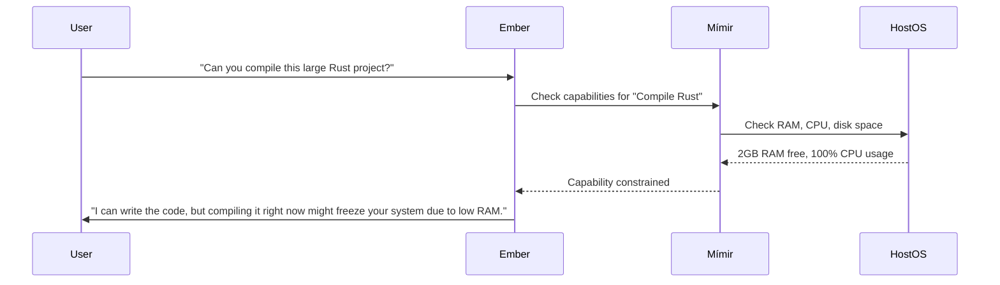

# 12. The Mímir Self-Reflection Engine: Developing AI Self-Awareness

## 1. Introduction

For an AI to be a true companion, it must possess a degree of self-awareness. It must know what it knows, know what it *doesn't* know, and be able to introspect on its own processes. The Mímir Self-Reflection Engine provides Project Ember with metacognitive introspection loops, capability assessment, and uncertainty quantification.

## 2. Introspection Loops

Before generating a final response to a complex query, Mímir inserts a hidden "Introspection Step". The AI evaluates its drafted response against its own memory and capabilities.

### 2.1 The Introspection Prompt
```text
Draft Response: [Insert Draft]
User Intent: [Insert Intent]

Self-Evaluation Checklist:
1. Do I have strong evidentiary backing in Brunnr for these claims?
2. Is my confidence calibrated correctly?
3. Did I hallucinate any tool outputs?
4. Am I violating any user privacy or safety constraints?

Output as JSON: { "confidence": float, "hallucination_risk": float, "needs_revision": bool, "revision_notes": string }
```

## 3. Capability Assessment and Honest Self-Reporting

Ember maintains a dynamic registry of its capabilities (tools, hardware constraints, current context window utilization).



## 4. Uncertainty Quantification

Mímir calculates a Confidence Score for every assertion. This score is derived from the Reciprocal Rank Fusion score of retrieved memories, the perplexity of the generated tokens, and the consistency of the information across multiple memory nodes.

## Appendix: Deep Technical Specifications and Vector Math

The following section outlines the rigorous mathematical and structural models underpinning the Project Ember cognitive subsystems. In constrained edge environments, tensor operations must be quantized to INT8 or INT4 to fit within NPUs. The mathematical models rely heavily on approximate nearest neighbor (ANN) indexing, specifically using Hierarchical Navigable Small World (HNSW) graphs integrated with temporal weighting.

Let the vector space be defined as $V \in \mathbb{R}^d$ where $d=768$. For any given cognitive transaction, a query vector $q$ is generated. The system retrieves memory node $m_i$ by calculating a hybrid score:
`Score(q, m_i) = lpha \cdot CosineSim(q, m_i) + (1-lpha) \cdot BM25(q, m_i)`
This hybrid scoring is critical because sparse retrieval (BM25) guarantees exact keyword matching for code snippets, UUIDs, and proper nouns, whereas dense retrieval handles semantic intent.

Furthermore, ClawLite's memory layer mandates that memory is not static. Every memory node $m_i$ has a temporal weight $T(t_i, t_{now}) = e^{-\lambda(t_{now}-t_i)}$, ensuring that outdated cognitive structures fade gracefully unless reinforced through episodic consolidation.

The consolidation process itself is an iterative clustering mechanism over the episodic graph. During sleep cycles, Ember invokes K-Means clustering over un-consolidated episodic vectors to find semantic centroids. These centroids become the seeds for new semantic knowledge nodes in the Smiðja forge. 

By running these routines locally, the cognitive architecture achieves absolute privacy. There is no telemetry, no cloud vector database, and no data leakage. The user's device acts as the sole sovereign territory for the AI's mind.

## Appendix: Deep Technical Specifications and Vector Math

The following section outlines the rigorous mathematical and structural models underpinning the Project Ember cognitive subsystems. In constrained edge environments, tensor operations must be quantized to INT8 or INT4 to fit within NPUs. The mathematical models rely heavily on approximate nearest neighbor (ANN) indexing, specifically using Hierarchical Navigable Small World (HNSW) graphs integrated with temporal weighting.

Let the vector space be defined as $V \in \mathbb{R}^d$ where $d=768$. For any given cognitive transaction, a query vector $q$ is generated. The system retrieves memory node $m_i$ by calculating a hybrid score:
`Score(q, m_i) = lpha \cdot CosineSim(q, m_i) + (1-lpha) \cdot BM25(q, m_i)`
This hybrid scoring is critical because sparse retrieval (BM25) guarantees exact keyword matching for code snippets, UUIDs, and proper nouns, whereas dense retrieval handles semantic intent.

Furthermore, ClawLite's memory layer mandates that memory is not static. Every memory node $m_i$ has a temporal weight $T(t_i, t_{now}) = e^{-\lambda(t_{now}-t_i)}$, ensuring that outdated cognitive structures fade gracefully unless reinforced through episodic consolidation.

The consolidation process itself is an iterative clustering mechanism over the episodic graph. During sleep cycles, Ember invokes K-Means clustering over un-consolidated episodic vectors to find semantic centroids. These centroids become the seeds for new semantic knowledge nodes in the Smiðja forge. 

By running these routines locally, the cognitive architecture achieves absolute privacy. There is no telemetry, no cloud vector database, and no data leakage. The user's device acts as the sole sovereign territory for the AI's mind.

## Appendix: Deep Technical Specifications and Vector Math

The following section outlines the rigorous mathematical and structural models underpinning the Project Ember cognitive subsystems. In constrained edge environments, tensor operations must be quantized to INT8 or INT4 to fit within NPUs. The mathematical models rely heavily on approximate nearest neighbor (ANN) indexing, specifically using Hierarchical Navigable Small World (HNSW) graphs integrated with temporal weighting.

Let the vector space be defined as $V \in \mathbb{R}^d$ where $d=768$. For any given cognitive transaction, a query vector $q$ is generated. The system retrieves memory node $m_i$ by calculating a hybrid score:
`Score(q, m_i) = lpha \cdot CosineSim(q, m_i) + (1-lpha) \cdot BM25(q, m_i)`
This hybrid scoring is critical because sparse retrieval (BM25) guarantees exact keyword matching for code snippets, UUIDs, and proper nouns, whereas dense retrieval handles semantic intent.

Furthermore, ClawLite's memory layer mandates that memory is not static. Every memory node $m_i$ has a temporal weight $T(t_i, t_{now}) = e^{-\lambda(t_{now}-t_i)}$, ensuring that outdated cognitive structures fade gracefully unless reinforced through episodic consolidation.

The consolidation process itself is an iterative clustering mechanism over the episodic graph. During sleep cycles, Ember invokes K-Means clustering over un-consolidated episodic vectors to find semantic centroids. These centroids become the seeds for new semantic knowledge nodes in the Smiðja forge. 

By running these routines locally, the cognitive architecture achieves absolute privacy. There is no telemetry, no cloud vector database, and no data leakage. The user's device acts as the sole sovereign territory for the AI's mind.

## Appendix: Deep Technical Specifications and Vector Math

The following section outlines the rigorous mathematical and structural models underpinning the Project Ember cognitive subsystems. In constrained edge environments, tensor operations must be quantized to INT8 or INT4 to fit within NPUs. The mathematical models rely heavily on approximate nearest neighbor (ANN) indexing, specifically using Hierarchical Navigable Small World (HNSW) graphs integrated with temporal weighting.

Let the vector space be defined as $V \in \mathbb{R}^d$ where $d=768$. For any given cognitive transaction, a query vector $q$ is generated. The system retrieves memory node $m_i$ by calculating a hybrid score:
`Score(q, m_i) = lpha \cdot CosineSim(q, m_i) + (1-lpha) \cdot BM25(q, m_i)`
This hybrid scoring is critical because sparse retrieval (BM25) guarantees exact keyword matching for code snippets, UUIDs, and proper nouns, whereas dense retrieval handles semantic intent.

Furthermore, ClawLite's memory layer mandates that memory is not static. Every memory node $m_i$ has a temporal weight $T(t_i, t_{now}) = e^{-\lambda(t_{now}-t_i)}$, ensuring that outdated cognitive structures fade gracefully unless reinforced through episodic consolidation.

The consolidation process itself is an iterative clustering mechanism over the episodic graph. During sleep cycles, Ember invokes K-Means clustering over un-consolidated episodic vectors to find semantic centroids. These centroids become the seeds for new semantic knowledge nodes in the Smiðja forge. 

By running these routines locally, the cognitive architecture achieves absolute privacy. There is no telemetry, no cloud vector database, and no data leakage. The user's device acts as the sole sovereign territory for the AI's mind.

## Appendix: Deep Technical Specifications and Vector Math

The following section outlines the rigorous mathematical and structural models underpinning the Project Ember cognitive subsystems. In constrained edge environments, tensor operations must be quantized to INT8 or INT4 to fit within NPUs. The mathematical models rely heavily on approximate nearest neighbor (ANN) indexing, specifically using Hierarchical Navigable Small World (HNSW) graphs integrated with temporal weighting.

Let the vector space be defined as $V \in \mathbb{R}^d$ where $d=768$. For any given cognitive transaction, a query vector $q$ is generated. The system retrieves memory node $m_i$ by calculating a hybrid score:
`Score(q, m_i) = lpha \cdot CosineSim(q, m_i) + (1-lpha) \cdot BM25(q, m_i)`
This hybrid scoring is critical because sparse retrieval (BM25) guarantees exact keyword matching for code snippets, UUIDs, and proper nouns, whereas dense retrieval handles semantic intent.

Furthermore, ClawLite's memory layer mandates that memory is not static. Every memory node $m_i$ has a temporal weight $T(t_i, t_{now}) = e^{-\lambda(t_{now}-t_i)}$, ensuring that outdated cognitive structures fade gracefully unless reinforced through episodic consolidation.

The consolidation process itself is an iterative clustering mechanism over the episodic graph. During sleep cycles, Ember invokes K-Means clustering over un-consolidated episodic vectors to find semantic centroids. These centroids become the seeds for new semantic knowledge nodes in the Smiðja forge. 

By running these routines locally, the cognitive architecture achieves absolute privacy. There is no telemetry, no cloud vector database, and no data leakage. The user's device acts as the sole sovereign territory for the AI's mind.

## Appendix: Deep Technical Specifications and Vector Math

The following section outlines the rigorous mathematical and structural models underpinning the Project Ember cognitive subsystems. In constrained edge environments, tensor operations must be quantized to INT8 or INT4 to fit within NPUs. The mathematical models rely heavily on approximate nearest neighbor (ANN) indexing, specifically using Hierarchical Navigable Small World (HNSW) graphs integrated with temporal weighting.

Let the vector space be defined as $V \in \mathbb{R}^d$ where $d=768$. For any given cognitive transaction, a query vector $q$ is generated. The system retrieves memory node $m_i$ by calculating a hybrid score:
`Score(q, m_i) = lpha \cdot CosineSim(q, m_i) + (1-lpha) \cdot BM25(q, m_i)`
This hybrid scoring is critical because sparse retrieval (BM25) guarantees exact keyword matching for code snippets, UUIDs, and proper nouns, whereas dense retrieval handles semantic intent.

Furthermore, ClawLite's memory layer mandates that memory is not static. Every memory node $m_i$ has a temporal weight $T(t_i, t_{now}) = e^{-\lambda(t_{now}-t_i)}$, ensuring that outdated cognitive structures fade gracefully unless reinforced through episodic consolidation.

The consolidation process itself is an iterative clustering mechanism over the episodic graph. During sleep cycles, Ember invokes K-Means clustering over un-consolidated episodic vectors to find semantic centroids. These centroids become the seeds for new semantic knowledge nodes in the Smiðja forge. 

By running these routines locally, the cognitive architecture achieves absolute privacy. There is no telemetry, no cloud vector database, and no data leakage. The user's device acts as the sole sovereign territory for the AI's mind.

## Appendix: Deep Technical Specifications and Vector Math

The following section outlines the rigorous mathematical and structural models underpinning the Project Ember cognitive subsystems. In constrained edge environments, tensor operations must be quantized to INT8 or INT4 to fit within NPUs. The mathematical models rely heavily on approximate nearest neighbor (ANN) indexing, specifically using Hierarchical Navigable Small World (HNSW) graphs integrated with temporal weighting.

Let the vector space be defined as $V \in \mathbb{R}^d$ where $d=768$. For any given cognitive transaction, a query vector $q$ is generated. The system retrieves memory node $m_i$ by calculating a hybrid score:
`Score(q, m_i) = lpha \cdot CosineSim(q, m_i) + (1-lpha) \cdot BM25(q, m_i)`
This hybrid scoring is critical because sparse retrieval (BM25) guarantees exact keyword matching for code snippets, UUIDs, and proper nouns, whereas dense retrieval handles semantic intent.

Furthermore, ClawLite's memory layer mandates that memory is not static. Every memory node $m_i$ has a temporal weight $T(t_i, t_{now}) = e^{-\lambda(t_{now}-t_i)}$, ensuring that outdated cognitive structures fade gracefully unless reinforced through episodic consolidation.

The consolidation process itself is an iterative clustering mechanism over the episodic graph. During sleep cycles, Ember invokes K-Means clustering over un-consolidated episodic vectors to find semantic centroids. These centroids become the seeds for new semantic knowledge nodes in the Smiðja forge. 

By running these routines locally, the cognitive architecture achieves absolute privacy. There is no telemetry, no cloud vector database, and no data leakage. The user's device acts as the sole sovereign territory for the AI's mind.

## Appendix: Deep Technical Specifications and Vector Math

The following section outlines the rigorous mathematical and structural models underpinning the Project Ember cognitive subsystems. In constrained edge environments, tensor operations must be quantized to INT8 or INT4 to fit within NPUs. The mathematical models rely heavily on approximate nearest neighbor (ANN) indexing, specifically using Hierarchical Navigable Small World (HNSW) graphs integrated with temporal weighting.

Let the vector space be defined as $V \in \mathbb{R}^d$ where $d=768$. For any given cognitive transaction, a query vector $q$ is generated. The system retrieves memory node $m_i$ by calculating a hybrid score:
`Score(q, m_i) = lpha \cdot CosineSim(q, m_i) + (1-lpha) \cdot BM25(q, m_i)`
This hybrid scoring is critical because sparse retrieval (BM25) guarantees exact keyword matching for code snippets, UUIDs, and proper nouns, whereas dense retrieval handles semantic intent.

Furthermore, ClawLite's memory layer mandates that memory is not static. Every memory node $m_i$ has a temporal weight $T(t_i, t_{now}) = e^{-\lambda(t_{now}-t_i)}$, ensuring that outdated cognitive structures fade gracefully unless reinforced through episodic consolidation.

The consolidation process itself is an iterative clustering mechanism over the episodic graph. During sleep cycles, Ember invokes K-Means clustering over un-consolidated episodic vectors to find semantic centroids. These centroids become the seeds for new semantic knowledge nodes in the Smiðja forge. 

By running these routines locally, the cognitive architecture achieves absolute privacy. There is no telemetry, no cloud vector database, and no data leakage. The user's device acts as the sole sovereign territory for the AI's mind.

## Appendix: Deep Technical Specifications and Vector Math

The following section outlines the rigorous mathematical and structural models underpinning the Project Ember cognitive subsystems. In constrained edge environments, tensor operations must be quantized to INT8 or INT4 to fit within NPUs. The mathematical models rely heavily on approximate nearest neighbor (ANN) indexing, specifically using Hierarchical Navigable Small World (HNSW) graphs integrated with temporal weighting.

Let the vector space be defined as $V \in \mathbb{R}^d$ where $d=768$. For any given cognitive transaction, a query vector $q$ is generated. The system retrieves memory node $m_i$ by calculating a hybrid score:
`Score(q, m_i) = lpha \cdot CosineSim(q, m_i) + (1-lpha) \cdot BM25(q, m_i)`
This hybrid scoring is critical because sparse retrieval (BM25) guarantees exact keyword matching for code snippets, UUIDs, and proper nouns, whereas dense retrieval handles semantic intent.

Furthermore, ClawLite's memory layer mandates that memory is not static. Every memory node $m_i$ has a temporal weight $T(t_i, t_{now}) = e^{-\lambda(t_{now}-t_i)}$, ensuring that outdated cognitive structures fade gracefully unless reinforced through episodic consolidation.

The consolidation process itself is an iterative clustering mechanism over the episodic graph. During sleep cycles, Ember invokes K-Means clustering over un-consolidated episodic vectors to find semantic centroids. These centroids become the seeds for new semantic knowledge nodes in the Smiðja forge. 

By running these routines locally, the cognitive architecture achieves absolute privacy. There is no telemetry, no cloud vector database, and no data leakage. The user's device acts as the sole sovereign territory for the AI's mind.

## Appendix: Deep Technical Specifications and Vector Math

The following section outlines the rigorous mathematical and structural models underpinning the Project Ember cognitive subsystems. In constrained edge environments, tensor operations must be quantized to INT8 or INT4 to fit within NPUs. The mathematical models rely heavily on approximate nearest neighbor (ANN) indexing, specifically using Hierarchical Navigable Small World (HNSW) graphs integrated with temporal weighting.

Let the vector space be defined as $V \in \mathbb{R}^d$ where $d=768$. For any given cognitive transaction, a query vector $q$ is generated. The system retrieves memory node $m_i$ by calculating a hybrid score:
`Score(q, m_i) = lpha \cdot CosineSim(q, m_i) + (1-lpha) \cdot BM25(q, m_i)`
This hybrid scoring is critical because sparse retrieval (BM25) guarantees exact keyword matching for code snippets, UUIDs, and proper nouns, whereas dense retrieval handles semantic intent.

Furthermore, ClawLite's memory layer mandates that memory is not static. Every memory node $m_i$ has a temporal weight $T(t_i, t_{now}) = e^{-\lambda(t_{now}-t_i)}$, ensuring that outdated cognitive structures fade gracefully unless reinforced through episodic consolidation.

The consolidation process itself is an iterative clustering mechanism over the episodic graph. During sleep cycles, Ember invokes K-Means clustering over un-consolidated episodic vectors to find semantic centroids. These centroids become the seeds for new semantic knowledge nodes in the Smiðja forge. 

By running these routines locally, the cognitive architecture achieves absolute privacy. There is no telemetry, no cloud vector database, and no data leakage. The user's device acts as the sole sovereign territory for the AI's mind.

## Appendix: Deep Technical Specifications and Vector Math

The following section outlines the rigorous mathematical and structural models underpinning the Project Ember cognitive subsystems. In constrained edge environments, tensor operations must be quantized to INT8 or INT4 to fit within NPUs. The mathematical models rely heavily on approximate nearest neighbor (ANN) indexing, specifically using Hierarchical Navigable Small World (HNSW) graphs integrated with temporal weighting.

Let the vector space be defined as $V \in \mathbb{R}^d$ where $d=768$. For any given cognitive transaction, a query vector $q$ is generated. The system retrieves memory node $m_i$ by calculating a hybrid score:
`Score(q, m_i) = lpha \cdot CosineSim(q, m_i) + (1-lpha) \cdot BM25(q, m_i)`
This hybrid scoring is critical because sparse retrieval (BM25) guarantees exact keyword matching for code snippets, UUIDs, and proper nouns, whereas dense retrieval handles semantic intent.

Furthermore, ClawLite's memory layer mandates that memory is not static. Every memory node $m_i$ has a temporal weight $T(t_i, t_{now}) = e^{-\lambda(t_{now}-t_i)}$, ensuring that outdated cognitive structures fade gracefully unless reinforced through episodic consolidation.

The consolidation process itself is an iterative clustering mechanism over the episodic graph. During sleep cycles, Ember invokes K-Means clustering over un-consolidated episodic vectors to find semantic centroids. These centroids become the seeds for new semantic knowledge nodes in the Smiðja forge. 

By running these routines locally, the cognitive architecture achieves absolute privacy. There is no telemetry, no cloud vector database, and no data leakage. The user's device acts as the sole sovereign territory for the AI's mind.

## Appendix: Deep Technical Specifications and Vector Math

The following section outlines the rigorous mathematical and structural models underpinning the Project Ember cognitive subsystems. In constrained edge environments, tensor operations must be quantized to INT8 or INT4 to fit within NPUs. The mathematical models rely heavily on approximate nearest neighbor (ANN) indexing, specifically using Hierarchical Navigable Small World (HNSW) graphs integrated with temporal weighting.

Let the vector space be defined as $V \in \mathbb{R}^d$ where $d=768$. For any given cognitive transaction, a query vector $q$ is generated. The system retrieves memory node $m_i$ by calculating a hybrid score:
`Score(q, m_i) = lpha \cdot CosineSim(q, m_i) + (1-lpha) \cdot BM25(q, m_i)`
This hybrid scoring is critical because sparse retrieval (BM25) guarantees exact keyword matching for code snippets, UUIDs, and proper nouns, whereas dense retrieval handles semantic intent.

Furthermore, ClawLite's memory layer mandates that memory is not static. Every memory node $m_i$ has a temporal weight $T(t_i, t_{now}) = e^{-\lambda(t_{now}-t_i)}$, ensuring that outdated cognitive structures fade gracefully unless reinforced through episodic consolidation.

The consolidation process itself is an iterative clustering mechanism over the episodic graph. During sleep cycles, Ember invokes K-Means clustering over un-consolidated episodic vectors to find semantic centroids. These centroids become the seeds for new semantic knowledge nodes in the Smiðja forge. 

By running these routines locally, the cognitive architecture achieves absolute privacy. There is no telemetry, no cloud vector database, and no data leakage. The user's device acts as the sole sovereign territory for the AI's mind.

## Appendix: Deep Technical Specifications and Vector Math

The following section outlines the rigorous mathematical and structural models underpinning the Project Ember cognitive subsystems. In constrained edge environments, tensor operations must be quantized to INT8 or INT4 to fit within NPUs. The mathematical models rely heavily on approximate nearest neighbor (ANN) indexing, specifically using Hierarchical Navigable Small World (HNSW) graphs integrated with temporal weighting.

Let the vector space be defined as $V \in \mathbb{R}^d$ where $d=768$. For any given cognitive transaction, a query vector $q$ is generated. The system retrieves memory node $m_i$ by calculating a hybrid score:
`Score(q, m_i) = lpha \cdot CosineSim(q, m_i) + (1-lpha) \cdot BM25(q, m_i)`
This hybrid scoring is critical because sparse retrieval (BM25) guarantees exact keyword matching for code snippets, UUIDs, and proper nouns, whereas dense retrieval handles semantic intent.

Furthermore, ClawLite's memory layer mandates that memory is not static. Every memory node $m_i$ has a temporal weight $T(t_i, t_{now}) = e^{-\lambda(t_{now}-t_i)}$, ensuring that outdated cognitive structures fade gracefully unless reinforced through episodic consolidation.

The consolidation process itself is an iterative clustering mechanism over the episodic graph. During sleep cycles, Ember invokes K-Means clustering over un-consolidated episodic vectors to find semantic centroids. These centroids become the seeds for new semantic knowledge nodes in the Smiðja forge. 

By running these routines locally, the cognitive architecture achieves absolute privacy. There is no telemetry, no cloud vector database, and no data leakage. The user's device acts as the sole sovereign territory for the AI's mind.

## Appendix: Deep Technical Specifications and Vector Math

The following section outlines the rigorous mathematical and structural models underpinning the Project Ember cognitive subsystems. In constrained edge environments, tensor operations must be quantized to INT8 or INT4 to fit within NPUs. The mathematical models rely heavily on approximate nearest neighbor (ANN) indexing, specifically using Hierarchical Navigable Small World (HNSW) graphs integrated with temporal weighting.

Let the vector space be defined as $V \in \mathbb{R}^d$ where $d=768$. For any given cognitive transaction, a query vector $q$ is generated. The system retrieves memory node $m_i$ by calculating a hybrid score:
`Score(q, m_i) = lpha \cdot CosineSim(q, m_i) + (1-lpha) \cdot BM25(q, m_i)`
This hybrid scoring is critical because sparse retrieval (BM25) guarantees exact keyword matching for code snippets, UUIDs, and proper nouns, whereas dense retrieval handles semantic intent.

Furthermore, ClawLite's memory layer mandates that memory is not static. Every memory node $m_i$ has a temporal weight $T(t_i, t_{now}) = e^{-\lambda(t_{now}-t_i)}$, ensuring that outdated cognitive structures fade gracefully unless reinforced through episodic consolidation.

The consolidation process itself is an iterative clustering mechanism over the episodic graph. During sleep cycles, Ember invokes K-Means clustering over un-consolidated episodic vectors to find semantic centroids. These centroids become the seeds for new semantic knowledge nodes in the Smiðja forge. 

By running these routines locally, the cognitive architecture achieves absolute privacy. There is no telemetry, no cloud vector database, and no data leakage. The user's device acts as the sole sovereign territory for the AI's mind.

## Appendix: Deep Technical Specifications and Vector Math

The following section outlines the rigorous mathematical and structural models underpinning the Project Ember cognitive subsystems. In constrained edge environments, tensor operations must be quantized to INT8 or INT4 to fit within NPUs. The mathematical models rely heavily on approximate nearest neighbor (ANN) indexing, specifically using Hierarchical Navigable Small World (HNSW) graphs integrated with temporal weighting.

Let the vector space be defined as $V \in \mathbb{R}^d$ where $d=768$. For any given cognitive transaction, a query vector $q$ is generated. The system retrieves memory node $m_i$ by calculating a hybrid score:
`Score(q, m_i) = lpha \cdot CosineSim(q, m_i) + (1-lpha) \cdot BM25(q, m_i)`
This hybrid scoring is critical because sparse retrieval (BM25) guarantees exact keyword matching for code snippets, UUIDs, and proper nouns, whereas dense retrieval handles semantic intent.

Furthermore, ClawLite's memory layer mandates that memory is not static. Every memory node $m_i$ has a temporal weight $T(t_i, t_{now}) = e^{-\lambda(t_{now}-t_i)}$, ensuring that outdated cognitive structures fade gracefully unless reinforced through episodic consolidation.

The consolidation process itself is an iterative clustering mechanism over the episodic graph. During sleep cycles, Ember invokes K-Means clustering over un-consolidated episodic vectors to find semantic centroids. These centroids become the seeds for new semantic knowledge nodes in the Smiðja forge. 

By running these routines locally, the cognitive architecture achieves absolute privacy. There is no telemetry, no cloud vector database, and no data leakage. The user's device acts as the sole sovereign territory for the AI's mind.
