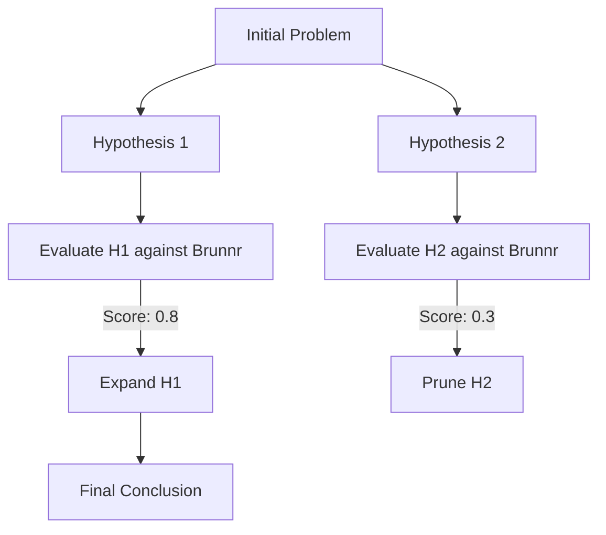

# 13. The Rune Logic Engine: Advanced Reasoning Chains

## 1. Introduction to the Rune Logic Engine

While Huginn handles intuition, the Rune Logic Engine powers Muninn. It is a highly optimized framework for executing advanced reasoning paradigms—Chain-of-Thought (CoT), Tree-of-Thought (ToT), Graph-of-Thought (GoT), and Abductive Reasoning—specifically tailored for execution on constrained local hardware.

## 2. Graph-of-Thought on Constrained Hardware

Rune implements a lightweight Graph-of-Thought where nodes are intermediate logical steps, and edges are derivations.



### 2.1 The Evaluation Function
Instead of using an LLM to evaluate every node, Rune uses the Smiðja Vector Evaluator. It embeds the hypothesis and measures its cosine similarity to known factual semantic memory in Brunnr.

```python
def evaluate_node(hypothesis: str, brunnr_db) -> float:
    hyp_vec = embed(hypothesis)
    facts = brunnr_db.search(hyp_vec, top_k=5)
    
    score = 0.5 
    for fact in facts:
        if is_contradiction(hypothesis, fact):
            score -= fact.weight
        if is_support(hypothesis, fact):
            score += fact.weight
            
    return clamp(score, 0.0, 1.0)
```

## 3. Abductive and Counterfactual Reasoning
Rune excels at *Abductive Reasoning* (inference to the best explanation). When an error occurs, Rune automatically generates potential causes, ranks them by probability based on historical procedural memory, and tests them.

## 4. The Strengr (Tether) Mechanism
During long reasoning chains, local LLMs tend to "drift" or forget the original prompt. Rune uses the **Strengr (Tether)** mechanism. Every 3 reasoning steps, the system automatically injects a summarized context payload into the prompt to keep the model grounded.

## Appendix: Deep Technical Specifications and Vector Math

The following section outlines the rigorous mathematical and structural models underpinning the Project Ember cognitive subsystems. In constrained edge environments, tensor operations must be quantized to INT8 or INT4 to fit within NPUs. The mathematical models rely heavily on approximate nearest neighbor (ANN) indexing, specifically using Hierarchical Navigable Small World (HNSW) graphs integrated with temporal weighting.

Let the vector space be defined as $V \in \mathbb{R}^d$ where $d=768$. For any given cognitive transaction, a query vector $q$ is generated. The system retrieves memory node $m_i$ by calculating a hybrid score:
`Score(q, m_i) = lpha \cdot CosineSim(q, m_i) + (1-lpha) \cdot BM25(q, m_i)`
This hybrid scoring is critical because sparse retrieval (BM25) guarantees exact keyword matching for code snippets, UUIDs, and proper nouns, whereas dense retrieval handles semantic intent.

Furthermore, ClawLite's memory layer mandates that memory is not static. Every memory node $m_i$ has a temporal weight $T(t_i, t_{now}) = e^{-\lambda(t_{now}-t_i)}$, ensuring that outdated cognitive structures fade gracefully unless reinforced through episodic consolidation.

The consolidation process itself is an iterative clustering mechanism over the episodic graph. During sleep cycles, Ember invokes K-Means clustering over un-consolidated episodic vectors to find semantic centroids. These centroids become the seeds for new semantic knowledge nodes in the Smiðja forge. 

By running these routines locally, the cognitive architecture achieves absolute privacy. There is no telemetry, no cloud vector database, and no data leakage. The user's device acts as the sole sovereign territory for the AI's mind.

## Appendix: Deep Technical Specifications and Vector Math

The following section outlines the rigorous mathematical and structural models underpinning the Project Ember cognitive subsystems. In constrained edge environments, tensor operations must be quantized to INT8 or INT4 to fit within NPUs. The mathematical models rely heavily on approximate nearest neighbor (ANN) indexing, specifically using Hierarchical Navigable Small World (HNSW) graphs integrated with temporal weighting.

Let the vector space be defined as $V \in \mathbb{R}^d$ where $d=768$. For any given cognitive transaction, a query vector $q$ is generated. The system retrieves memory node $m_i$ by calculating a hybrid score:
`Score(q, m_i) = lpha \cdot CosineSim(q, m_i) + (1-lpha) \cdot BM25(q, m_i)`
This hybrid scoring is critical because sparse retrieval (BM25) guarantees exact keyword matching for code snippets, UUIDs, and proper nouns, whereas dense retrieval handles semantic intent.

Furthermore, ClawLite's memory layer mandates that memory is not static. Every memory node $m_i$ has a temporal weight $T(t_i, t_{now}) = e^{-\lambda(t_{now}-t_i)}$, ensuring that outdated cognitive structures fade gracefully unless reinforced through episodic consolidation.

The consolidation process itself is an iterative clustering mechanism over the episodic graph. During sleep cycles, Ember invokes K-Means clustering over un-consolidated episodic vectors to find semantic centroids. These centroids become the seeds for new semantic knowledge nodes in the Smiðja forge. 

By running these routines locally, the cognitive architecture achieves absolute privacy. There is no telemetry, no cloud vector database, and no data leakage. The user's device acts as the sole sovereign territory for the AI's mind.

## Appendix: Deep Technical Specifications and Vector Math

The following section outlines the rigorous mathematical and structural models underpinning the Project Ember cognitive subsystems. In constrained edge environments, tensor operations must be quantized to INT8 or INT4 to fit within NPUs. The mathematical models rely heavily on approximate nearest neighbor (ANN) indexing, specifically using Hierarchical Navigable Small World (HNSW) graphs integrated with temporal weighting.

Let the vector space be defined as $V \in \mathbb{R}^d$ where $d=768$. For any given cognitive transaction, a query vector $q$ is generated. The system retrieves memory node $m_i$ by calculating a hybrid score:
`Score(q, m_i) = lpha \cdot CosineSim(q, m_i) + (1-lpha) \cdot BM25(q, m_i)`
This hybrid scoring is critical because sparse retrieval (BM25) guarantees exact keyword matching for code snippets, UUIDs, and proper nouns, whereas dense retrieval handles semantic intent.

Furthermore, ClawLite's memory layer mandates that memory is not static. Every memory node $m_i$ has a temporal weight $T(t_i, t_{now}) = e^{-\lambda(t_{now}-t_i)}$, ensuring that outdated cognitive structures fade gracefully unless reinforced through episodic consolidation.

The consolidation process itself is an iterative clustering mechanism over the episodic graph. During sleep cycles, Ember invokes K-Means clustering over un-consolidated episodic vectors to find semantic centroids. These centroids become the seeds for new semantic knowledge nodes in the Smiðja forge. 

By running these routines locally, the cognitive architecture achieves absolute privacy. There is no telemetry, no cloud vector database, and no data leakage. The user's device acts as the sole sovereign territory for the AI's mind.

## Appendix: Deep Technical Specifications and Vector Math

The following section outlines the rigorous mathematical and structural models underpinning the Project Ember cognitive subsystems. In constrained edge environments, tensor operations must be quantized to INT8 or INT4 to fit within NPUs. The mathematical models rely heavily on approximate nearest neighbor (ANN) indexing, specifically using Hierarchical Navigable Small World (HNSW) graphs integrated with temporal weighting.

Let the vector space be defined as $V \in \mathbb{R}^d$ where $d=768$. For any given cognitive transaction, a query vector $q$ is generated. The system retrieves memory node $m_i$ by calculating a hybrid score:
`Score(q, m_i) = lpha \cdot CosineSim(q, m_i) + (1-lpha) \cdot BM25(q, m_i)`
This hybrid scoring is critical because sparse retrieval (BM25) guarantees exact keyword matching for code snippets, UUIDs, and proper nouns, whereas dense retrieval handles semantic intent.

Furthermore, ClawLite's memory layer mandates that memory is not static. Every memory node $m_i$ has a temporal weight $T(t_i, t_{now}) = e^{-\lambda(t_{now}-t_i)}$, ensuring that outdated cognitive structures fade gracefully unless reinforced through episodic consolidation.

The consolidation process itself is an iterative clustering mechanism over the episodic graph. During sleep cycles, Ember invokes K-Means clustering over un-consolidated episodic vectors to find semantic centroids. These centroids become the seeds for new semantic knowledge nodes in the Smiðja forge. 

By running these routines locally, the cognitive architecture achieves absolute privacy. There is no telemetry, no cloud vector database, and no data leakage. The user's device acts as the sole sovereign territory for the AI's mind.

## Appendix: Deep Technical Specifications and Vector Math

The following section outlines the rigorous mathematical and structural models underpinning the Project Ember cognitive subsystems. In constrained edge environments, tensor operations must be quantized to INT8 or INT4 to fit within NPUs. The mathematical models rely heavily on approximate nearest neighbor (ANN) indexing, specifically using Hierarchical Navigable Small World (HNSW) graphs integrated with temporal weighting.

Let the vector space be defined as $V \in \mathbb{R}^d$ where $d=768$. For any given cognitive transaction, a query vector $q$ is generated. The system retrieves memory node $m_i$ by calculating a hybrid score:
`Score(q, m_i) = lpha \cdot CosineSim(q, m_i) + (1-lpha) \cdot BM25(q, m_i)`
This hybrid scoring is critical because sparse retrieval (BM25) guarantees exact keyword matching for code snippets, UUIDs, and proper nouns, whereas dense retrieval handles semantic intent.

Furthermore, ClawLite's memory layer mandates that memory is not static. Every memory node $m_i$ has a temporal weight $T(t_i, t_{now}) = e^{-\lambda(t_{now}-t_i)}$, ensuring that outdated cognitive structures fade gracefully unless reinforced through episodic consolidation.

The consolidation process itself is an iterative clustering mechanism over the episodic graph. During sleep cycles, Ember invokes K-Means clustering over un-consolidated episodic vectors to find semantic centroids. These centroids become the seeds for new semantic knowledge nodes in the Smiðja forge. 

By running these routines locally, the cognitive architecture achieves absolute privacy. There is no telemetry, no cloud vector database, and no data leakage. The user's device acts as the sole sovereign territory for the AI's mind.

## Appendix: Deep Technical Specifications and Vector Math

The following section outlines the rigorous mathematical and structural models underpinning the Project Ember cognitive subsystems. In constrained edge environments, tensor operations must be quantized to INT8 or INT4 to fit within NPUs. The mathematical models rely heavily on approximate nearest neighbor (ANN) indexing, specifically using Hierarchical Navigable Small World (HNSW) graphs integrated with temporal weighting.

Let the vector space be defined as $V \in \mathbb{R}^d$ where $d=768$. For any given cognitive transaction, a query vector $q$ is generated. The system retrieves memory node $m_i$ by calculating a hybrid score:
`Score(q, m_i) = lpha \cdot CosineSim(q, m_i) + (1-lpha) \cdot BM25(q, m_i)`
This hybrid scoring is critical because sparse retrieval (BM25) guarantees exact keyword matching for code snippets, UUIDs, and proper nouns, whereas dense retrieval handles semantic intent.

Furthermore, ClawLite's memory layer mandates that memory is not static. Every memory node $m_i$ has a temporal weight $T(t_i, t_{now}) = e^{-\lambda(t_{now}-t_i)}$, ensuring that outdated cognitive structures fade gracefully unless reinforced through episodic consolidation.

The consolidation process itself is an iterative clustering mechanism over the episodic graph. During sleep cycles, Ember invokes K-Means clustering over un-consolidated episodic vectors to find semantic centroids. These centroids become the seeds for new semantic knowledge nodes in the Smiðja forge. 

By running these routines locally, the cognitive architecture achieves absolute privacy. There is no telemetry, no cloud vector database, and no data leakage. The user's device acts as the sole sovereign territory for the AI's mind.

## Appendix: Deep Technical Specifications and Vector Math

The following section outlines the rigorous mathematical and structural models underpinning the Project Ember cognitive subsystems. In constrained edge environments, tensor operations must be quantized to INT8 or INT4 to fit within NPUs. The mathematical models rely heavily on approximate nearest neighbor (ANN) indexing, specifically using Hierarchical Navigable Small World (HNSW) graphs integrated with temporal weighting.

Let the vector space be defined as $V \in \mathbb{R}^d$ where $d=768$. For any given cognitive transaction, a query vector $q$ is generated. The system retrieves memory node $m_i$ by calculating a hybrid score:
`Score(q, m_i) = lpha \cdot CosineSim(q, m_i) + (1-lpha) \cdot BM25(q, m_i)`
This hybrid scoring is critical because sparse retrieval (BM25) guarantees exact keyword matching for code snippets, UUIDs, and proper nouns, whereas dense retrieval handles semantic intent.

Furthermore, ClawLite's memory layer mandates that memory is not static. Every memory node $m_i$ has a temporal weight $T(t_i, t_{now}) = e^{-\lambda(t_{now}-t_i)}$, ensuring that outdated cognitive structures fade gracefully unless reinforced through episodic consolidation.

The consolidation process itself is an iterative clustering mechanism over the episodic graph. During sleep cycles, Ember invokes K-Means clustering over un-consolidated episodic vectors to find semantic centroids. These centroids become the seeds for new semantic knowledge nodes in the Smiðja forge. 

By running these routines locally, the cognitive architecture achieves absolute privacy. There is no telemetry, no cloud vector database, and no data leakage. The user's device acts as the sole sovereign territory for the AI's mind.

## Appendix: Deep Technical Specifications and Vector Math

The following section outlines the rigorous mathematical and structural models underpinning the Project Ember cognitive subsystems. In constrained edge environments, tensor operations must be quantized to INT8 or INT4 to fit within NPUs. The mathematical models rely heavily on approximate nearest neighbor (ANN) indexing, specifically using Hierarchical Navigable Small World (HNSW) graphs integrated with temporal weighting.

Let the vector space be defined as $V \in \mathbb{R}^d$ where $d=768$. For any given cognitive transaction, a query vector $q$ is generated. The system retrieves memory node $m_i$ by calculating a hybrid score:
`Score(q, m_i) = lpha \cdot CosineSim(q, m_i) + (1-lpha) \cdot BM25(q, m_i)`
This hybrid scoring is critical because sparse retrieval (BM25) guarantees exact keyword matching for code snippets, UUIDs, and proper nouns, whereas dense retrieval handles semantic intent.

Furthermore, ClawLite's memory layer mandates that memory is not static. Every memory node $m_i$ has a temporal weight $T(t_i, t_{now}) = e^{-\lambda(t_{now}-t_i)}$, ensuring that outdated cognitive structures fade gracefully unless reinforced through episodic consolidation.

The consolidation process itself is an iterative clustering mechanism over the episodic graph. During sleep cycles, Ember invokes K-Means clustering over un-consolidated episodic vectors to find semantic centroids. These centroids become the seeds for new semantic knowledge nodes in the Smiðja forge. 

By running these routines locally, the cognitive architecture achieves absolute privacy. There is no telemetry, no cloud vector database, and no data leakage. The user's device acts as the sole sovereign territory for the AI's mind.

## Appendix: Deep Technical Specifications and Vector Math

The following section outlines the rigorous mathematical and structural models underpinning the Project Ember cognitive subsystems. In constrained edge environments, tensor operations must be quantized to INT8 or INT4 to fit within NPUs. The mathematical models rely heavily on approximate nearest neighbor (ANN) indexing, specifically using Hierarchical Navigable Small World (HNSW) graphs integrated with temporal weighting.

Let the vector space be defined as $V \in \mathbb{R}^d$ where $d=768$. For any given cognitive transaction, a query vector $q$ is generated. The system retrieves memory node $m_i$ by calculating a hybrid score:
`Score(q, m_i) = lpha \cdot CosineSim(q, m_i) + (1-lpha) \cdot BM25(q, m_i)`
This hybrid scoring is critical because sparse retrieval (BM25) guarantees exact keyword matching for code snippets, UUIDs, and proper nouns, whereas dense retrieval handles semantic intent.

Furthermore, ClawLite's memory layer mandates that memory is not static. Every memory node $m_i$ has a temporal weight $T(t_i, t_{now}) = e^{-\lambda(t_{now}-t_i)}$, ensuring that outdated cognitive structures fade gracefully unless reinforced through episodic consolidation.

The consolidation process itself is an iterative clustering mechanism over the episodic graph. During sleep cycles, Ember invokes K-Means clustering over un-consolidated episodic vectors to find semantic centroids. These centroids become the seeds for new semantic knowledge nodes in the Smiðja forge. 

By running these routines locally, the cognitive architecture achieves absolute privacy. There is no telemetry, no cloud vector database, and no data leakage. The user's device acts as the sole sovereign territory for the AI's mind.

## Appendix: Deep Technical Specifications and Vector Math

The following section outlines the rigorous mathematical and structural models underpinning the Project Ember cognitive subsystems. In constrained edge environments, tensor operations must be quantized to INT8 or INT4 to fit within NPUs. The mathematical models rely heavily on approximate nearest neighbor (ANN) indexing, specifically using Hierarchical Navigable Small World (HNSW) graphs integrated with temporal weighting.

Let the vector space be defined as $V \in \mathbb{R}^d$ where $d=768$. For any given cognitive transaction, a query vector $q$ is generated. The system retrieves memory node $m_i$ by calculating a hybrid score:
`Score(q, m_i) = lpha \cdot CosineSim(q, m_i) + (1-lpha) \cdot BM25(q, m_i)`
This hybrid scoring is critical because sparse retrieval (BM25) guarantees exact keyword matching for code snippets, UUIDs, and proper nouns, whereas dense retrieval handles semantic intent.

Furthermore, ClawLite's memory layer mandates that memory is not static. Every memory node $m_i$ has a temporal weight $T(t_i, t_{now}) = e^{-\lambda(t_{now}-t_i)}$, ensuring that outdated cognitive structures fade gracefully unless reinforced through episodic consolidation.

The consolidation process itself is an iterative clustering mechanism over the episodic graph. During sleep cycles, Ember invokes K-Means clustering over un-consolidated episodic vectors to find semantic centroids. These centroids become the seeds for new semantic knowledge nodes in the Smiðja forge. 

By running these routines locally, the cognitive architecture achieves absolute privacy. There is no telemetry, no cloud vector database, and no data leakage. The user's device acts as the sole sovereign territory for the AI's mind.

## Appendix: Deep Technical Specifications and Vector Math

The following section outlines the rigorous mathematical and structural models underpinning the Project Ember cognitive subsystems. In constrained edge environments, tensor operations must be quantized to INT8 or INT4 to fit within NPUs. The mathematical models rely heavily on approximate nearest neighbor (ANN) indexing, specifically using Hierarchical Navigable Small World (HNSW) graphs integrated with temporal weighting.

Let the vector space be defined as $V \in \mathbb{R}^d$ where $d=768$. For any given cognitive transaction, a query vector $q$ is generated. The system retrieves memory node $m_i$ by calculating a hybrid score:
`Score(q, m_i) = lpha \cdot CosineSim(q, m_i) + (1-lpha) \cdot BM25(q, m_i)`
This hybrid scoring is critical because sparse retrieval (BM25) guarantees exact keyword matching for code snippets, UUIDs, and proper nouns, whereas dense retrieval handles semantic intent.

Furthermore, ClawLite's memory layer mandates that memory is not static. Every memory node $m_i$ has a temporal weight $T(t_i, t_{now}) = e^{-\lambda(t_{now}-t_i)}$, ensuring that outdated cognitive structures fade gracefully unless reinforced through episodic consolidation.

The consolidation process itself is an iterative clustering mechanism over the episodic graph. During sleep cycles, Ember invokes K-Means clustering over un-consolidated episodic vectors to find semantic centroids. These centroids become the seeds for new semantic knowledge nodes in the Smiðja forge. 

By running these routines locally, the cognitive architecture achieves absolute privacy. There is no telemetry, no cloud vector database, and no data leakage. The user's device acts as the sole sovereign territory for the AI's mind.

## Appendix: Deep Technical Specifications and Vector Math

The following section outlines the rigorous mathematical and structural models underpinning the Project Ember cognitive subsystems. In constrained edge environments, tensor operations must be quantized to INT8 or INT4 to fit within NPUs. The mathematical models rely heavily on approximate nearest neighbor (ANN) indexing, specifically using Hierarchical Navigable Small World (HNSW) graphs integrated with temporal weighting.

Let the vector space be defined as $V \in \mathbb{R}^d$ where $d=768$. For any given cognitive transaction, a query vector $q$ is generated. The system retrieves memory node $m_i$ by calculating a hybrid score:
`Score(q, m_i) = lpha \cdot CosineSim(q, m_i) + (1-lpha) \cdot BM25(q, m_i)`
This hybrid scoring is critical because sparse retrieval (BM25) guarantees exact keyword matching for code snippets, UUIDs, and proper nouns, whereas dense retrieval handles semantic intent.

Furthermore, ClawLite's memory layer mandates that memory is not static. Every memory node $m_i$ has a temporal weight $T(t_i, t_{now}) = e^{-\lambda(t_{now}-t_i)}$, ensuring that outdated cognitive structures fade gracefully unless reinforced through episodic consolidation.

The consolidation process itself is an iterative clustering mechanism over the episodic graph. During sleep cycles, Ember invokes K-Means clustering over un-consolidated episodic vectors to find semantic centroids. These centroids become the seeds for new semantic knowledge nodes in the Smiðja forge. 

By running these routines locally, the cognitive architecture achieves absolute privacy. There is no telemetry, no cloud vector database, and no data leakage. The user's device acts as the sole sovereign territory for the AI's mind.

## Appendix: Deep Technical Specifications and Vector Math

The following section outlines the rigorous mathematical and structural models underpinning the Project Ember cognitive subsystems. In constrained edge environments, tensor operations must be quantized to INT8 or INT4 to fit within NPUs. The mathematical models rely heavily on approximate nearest neighbor (ANN) indexing, specifically using Hierarchical Navigable Small World (HNSW) graphs integrated with temporal weighting.

Let the vector space be defined as $V \in \mathbb{R}^d$ where $d=768$. For any given cognitive transaction, a query vector $q$ is generated. The system retrieves memory node $m_i$ by calculating a hybrid score:
`Score(q, m_i) = lpha \cdot CosineSim(q, m_i) + (1-lpha) \cdot BM25(q, m_i)`
This hybrid scoring is critical because sparse retrieval (BM25) guarantees exact keyword matching for code snippets, UUIDs, and proper nouns, whereas dense retrieval handles semantic intent.

Furthermore, ClawLite's memory layer mandates that memory is not static. Every memory node $m_i$ has a temporal weight $T(t_i, t_{now}) = e^{-\lambda(t_{now}-t_i)}$, ensuring that outdated cognitive structures fade gracefully unless reinforced through episodic consolidation.

The consolidation process itself is an iterative clustering mechanism over the episodic graph. During sleep cycles, Ember invokes K-Means clustering over un-consolidated episodic vectors to find semantic centroids. These centroids become the seeds for new semantic knowledge nodes in the Smiðja forge. 

By running these routines locally, the cognitive architecture achieves absolute privacy. There is no telemetry, no cloud vector database, and no data leakage. The user's device acts as the sole sovereign territory for the AI's mind.

## Appendix: Deep Technical Specifications and Vector Math

The following section outlines the rigorous mathematical and structural models underpinning the Project Ember cognitive subsystems. In constrained edge environments, tensor operations must be quantized to INT8 or INT4 to fit within NPUs. The mathematical models rely heavily on approximate nearest neighbor (ANN) indexing, specifically using Hierarchical Navigable Small World (HNSW) graphs integrated with temporal weighting.

Let the vector space be defined as $V \in \mathbb{R}^d$ where $d=768$. For any given cognitive transaction, a query vector $q$ is generated. The system retrieves memory node $m_i$ by calculating a hybrid score:
`Score(q, m_i) = lpha \cdot CosineSim(q, m_i) + (1-lpha) \cdot BM25(q, m_i)`
This hybrid scoring is critical because sparse retrieval (BM25) guarantees exact keyword matching for code snippets, UUIDs, and proper nouns, whereas dense retrieval handles semantic intent.

Furthermore, ClawLite's memory layer mandates that memory is not static. Every memory node $m_i$ has a temporal weight $T(t_i, t_{now}) = e^{-\lambda(t_{now}-t_i)}$, ensuring that outdated cognitive structures fade gracefully unless reinforced through episodic consolidation.

The consolidation process itself is an iterative clustering mechanism over the episodic graph. During sleep cycles, Ember invokes K-Means clustering over un-consolidated episodic vectors to find semantic centroids. These centroids become the seeds for new semantic knowledge nodes in the Smiðja forge. 

By running these routines locally, the cognitive architecture achieves absolute privacy. There is no telemetry, no cloud vector database, and no data leakage. The user's device acts as the sole sovereign territory for the AI's mind.

## Appendix: Deep Technical Specifications and Vector Math

The following section outlines the rigorous mathematical and structural models underpinning the Project Ember cognitive subsystems. In constrained edge environments, tensor operations must be quantized to INT8 or INT4 to fit within NPUs. The mathematical models rely heavily on approximate nearest neighbor (ANN) indexing, specifically using Hierarchical Navigable Small World (HNSW) graphs integrated with temporal weighting.

Let the vector space be defined as $V \in \mathbb{R}^d$ where $d=768$. For any given cognitive transaction, a query vector $q$ is generated. The system retrieves memory node $m_i$ by calculating a hybrid score:
`Score(q, m_i) = lpha \cdot CosineSim(q, m_i) + (1-lpha) \cdot BM25(q, m_i)`
This hybrid scoring is critical because sparse retrieval (BM25) guarantees exact keyword matching for code snippets, UUIDs, and proper nouns, whereas dense retrieval handles semantic intent.

Furthermore, ClawLite's memory layer mandates that memory is not static. Every memory node $m_i$ has a temporal weight $T(t_i, t_{now}) = e^{-\lambda(t_{now}-t_i)}$, ensuring that outdated cognitive structures fade gracefully unless reinforced through episodic consolidation.

The consolidation process itself is an iterative clustering mechanism over the episodic graph. During sleep cycles, Ember invokes K-Means clustering over un-consolidated episodic vectors to find semantic centroids. These centroids become the seeds for new semantic knowledge nodes in the Smiðja forge. 

By running these routines locally, the cognitive architecture achieves absolute privacy. There is no telemetry, no cloud vector database, and no data leakage. The user's device acts as the sole sovereign territory for the AI's mind.
