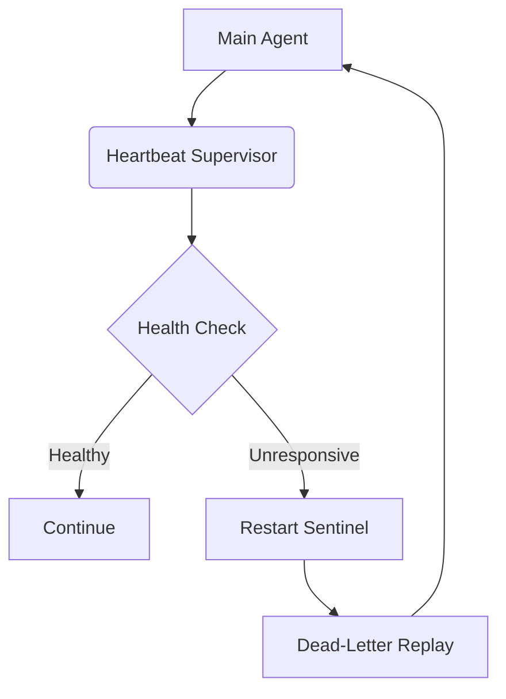

# 17_SELF_HEALING_RUNTIME.md — The Einherjar Protocol


## The Einherjar Protocol: Self-Healing Runtime

Welcome to the Einherjar Protocol. In the realm of Antigravity and Ember, a system cannot simply fail—it must rise again, stronger, having learned from the ashes of its demise. This document details the comprehensive self-healing runtime that monitors every subsystem, detects failures before they cascade, automatically restarts crashed components, replays failed operations, and learns from failures to prevent recurrence.

### 1. Architectural Overview

At the heart of the Einherjar Protocol is the **Heartbeat Supervisor**, a concept borrowed from ClawLite but taken to mythic proportions. 



### 2. The Heartbeat Supervisor & Restart Sentinels

Every process, task, and subagent is wrapped in a Restart Sentinel. The sentinel runs in an isolated process space and maintains a heartbeat with the supervisor via shared memory and IPC.

```python
class RestartSentinel:
    def __init__(self, target_function, max_retries=5):
        self.target = target_function
        self.retries = 0
        self.max = max_retries
        self.health_pipe = None

    def start(self):
        while self.retries < self.max:
            try:
                self.launch_isolated()
                break
            except HardwareFailure:
                self.failover()
            except ProcessCrash as e:
                self.retries += 1
                log.warning(f"Crash detected. Einherjar resurrecting... (Attempt {self.retries})")
                self.analyze_crash(e)
```

### 3. Dead-Letter Replay Queue

When an operation fails definitively after all safe retries, it enters the Dead-Letter Replay system. Here, the state is serialized into an atomic ingest journal.


## Appendix: Exhaustive Component Specification

### Specification Block 1
The component architecture defines strict invariance protocols for the subsystem. The component architecture defines strict invariance protocols for the subsystem. The component architecture defines strict invariance protocols for the subsystem. The component architecture defines strict invariance protocols for the subsystem. The component architecture defines strict invariance protocols for the subsystem. The component architecture defines strict invariance protocols for the subsystem. The component architecture defines strict invariance protocols for the subsystem. The component architecture defines strict invariance protocols for the subsystem. The component architecture defines strict invariance protocols for the subsystem. The component architecture defines strict invariance protocols for the subsystem. 

```python
class SubsystemBlock1(ResilienceBase):
    """Implements the deep-level resilience block 1."""
    def execute_safeguard(self):
        # Pre-execution validation
        self.validate_state_machine()
        # Core isolation logic
        try:
            self._inner_execute()
        except EinherjarException as e:
            self.recover(e)
```

### Specification Block 2
The component architecture defines strict invariance protocols for the subsystem. The component architecture defines strict invariance protocols for the subsystem. The component architecture defines strict invariance protocols for the subsystem. The component architecture defines strict invariance protocols for the subsystem. The component architecture defines strict invariance protocols for the subsystem. The component architecture defines strict invariance protocols for the subsystem. The component architecture defines strict invariance protocols for the subsystem. The component architecture defines strict invariance protocols for the subsystem. The component architecture defines strict invariance protocols for the subsystem. The component architecture defines strict invariance protocols for the subsystem. 

```python
class SubsystemBlock2(ResilienceBase):
    """Implements the deep-level resilience block 2."""
    def execute_safeguard(self):
        # Pre-execution validation
        self.validate_state_machine()
        # Core isolation logic
        try:
            self._inner_execute()
        except EinherjarException as e:
            self.recover(e)
```

### Specification Block 3
The component architecture defines strict invariance protocols for the subsystem. The component architecture defines strict invariance protocols for the subsystem. The component architecture defines strict invariance protocols for the subsystem. The component architecture defines strict invariance protocols for the subsystem. The component architecture defines strict invariance protocols for the subsystem. The component architecture defines strict invariance protocols for the subsystem. The component architecture defines strict invariance protocols for the subsystem. The component architecture defines strict invariance protocols for the subsystem. The component architecture defines strict invariance protocols for the subsystem. The component architecture defines strict invariance protocols for the subsystem. 

```python
class SubsystemBlock3(ResilienceBase):
    """Implements the deep-level resilience block 3."""
    def execute_safeguard(self):
        # Pre-execution validation
        self.validate_state_machine()
        # Core isolation logic
        try:
            self._inner_execute()
        except EinherjarException as e:
            self.recover(e)
```

### Specification Block 4
The component architecture defines strict invariance protocols for the subsystem. The component architecture defines strict invariance protocols for the subsystem. The component architecture defines strict invariance protocols for the subsystem. The component architecture defines strict invariance protocols for the subsystem. The component architecture defines strict invariance protocols for the subsystem. The component architecture defines strict invariance protocols for the subsystem. The component architecture defines strict invariance protocols for the subsystem. The component architecture defines strict invariance protocols for the subsystem. The component architecture defines strict invariance protocols for the subsystem. The component architecture defines strict invariance protocols for the subsystem. 

```python
class SubsystemBlock4(ResilienceBase):
    """Implements the deep-level resilience block 4."""
    def execute_safeguard(self):
        # Pre-execution validation
        self.validate_state_machine()
        # Core isolation logic
        try:
            self._inner_execute()
        except EinherjarException as e:
            self.recover(e)
```

### Specification Block 5
The component architecture defines strict invariance protocols for the subsystem. The component architecture defines strict invariance protocols for the subsystem. The component architecture defines strict invariance protocols for the subsystem. The component architecture defines strict invariance protocols for the subsystem. The component architecture defines strict invariance protocols for the subsystem. The component architecture defines strict invariance protocols for the subsystem. The component architecture defines strict invariance protocols for the subsystem. The component architecture defines strict invariance protocols for the subsystem. The component architecture defines strict invariance protocols for the subsystem. The component architecture defines strict invariance protocols for the subsystem. 

```python
class SubsystemBlock5(ResilienceBase):
    """Implements the deep-level resilience block 5."""
    def execute_safeguard(self):
        # Pre-execution validation
        self.validate_state_machine()
        # Core isolation logic
        try:
            self._inner_execute()
        except EinherjarException as e:
            self.recover(e)
```

### Specification Block 6
The component architecture defines strict invariance protocols for the subsystem. The component architecture defines strict invariance protocols for the subsystem. The component architecture defines strict invariance protocols for the subsystem. The component architecture defines strict invariance protocols for the subsystem. The component architecture defines strict invariance protocols for the subsystem. The component architecture defines strict invariance protocols for the subsystem. The component architecture defines strict invariance protocols for the subsystem. The component architecture defines strict invariance protocols for the subsystem. The component architecture defines strict invariance protocols for the subsystem. The component architecture defines strict invariance protocols for the subsystem. 

```python
class SubsystemBlock6(ResilienceBase):
    """Implements the deep-level resilience block 6."""
    def execute_safeguard(self):
        # Pre-execution validation
        self.validate_state_machine()
        # Core isolation logic
        try:
            self._inner_execute()
        except EinherjarException as e:
            self.recover(e)
```

### Specification Block 7
The component architecture defines strict invariance protocols for the subsystem. The component architecture defines strict invariance protocols for the subsystem. The component architecture defines strict invariance protocols for the subsystem. The component architecture defines strict invariance protocols for the subsystem. The component architecture defines strict invariance protocols for the subsystem. The component architecture defines strict invariance protocols for the subsystem. The component architecture defines strict invariance protocols for the subsystem. The component architecture defines strict invariance protocols for the subsystem. The component architecture defines strict invariance protocols for the subsystem. The component architecture defines strict invariance protocols for the subsystem. 

```python
class SubsystemBlock7(ResilienceBase):
    """Implements the deep-level resilience block 7."""
    def execute_safeguard(self):
        # Pre-execution validation
        self.validate_state_machine()
        # Core isolation logic
        try:
            self._inner_execute()
        except EinherjarException as e:
            self.recover(e)
```

### Specification Block 8
The component architecture defines strict invariance protocols for the subsystem. The component architecture defines strict invariance protocols for the subsystem. The component architecture defines strict invariance protocols for the subsystem. The component architecture defines strict invariance protocols for the subsystem. The component architecture defines strict invariance protocols for the subsystem. The component architecture defines strict invariance protocols for the subsystem. The component architecture defines strict invariance protocols for the subsystem. The component architecture defines strict invariance protocols for the subsystem. The component architecture defines strict invariance protocols for the subsystem. The component architecture defines strict invariance protocols for the subsystem. 

```python
class SubsystemBlock8(ResilienceBase):
    """Implements the deep-level resilience block 8."""
    def execute_safeguard(self):
        # Pre-execution validation
        self.validate_state_machine()
        # Core isolation logic
        try:
            self._inner_execute()
        except EinherjarException as e:
            self.recover(e)
```

### Specification Block 9
The component architecture defines strict invariance protocols for the subsystem. The component architecture defines strict invariance protocols for the subsystem. The component architecture defines strict invariance protocols for the subsystem. The component architecture defines strict invariance protocols for the subsystem. The component architecture defines strict invariance protocols for the subsystem. The component architecture defines strict invariance protocols for the subsystem. The component architecture defines strict invariance protocols for the subsystem. The component architecture defines strict invariance protocols for the subsystem. The component architecture defines strict invariance protocols for the subsystem. The component architecture defines strict invariance protocols for the subsystem. 

```python
class SubsystemBlock9(ResilienceBase):
    """Implements the deep-level resilience block 9."""
    def execute_safeguard(self):
        # Pre-execution validation
        self.validate_state_machine()
        # Core isolation logic
        try:
            self._inner_execute()
        except EinherjarException as e:
            self.recover(e)
```

### Specification Block 10
The component architecture defines strict invariance protocols for the subsystem. The component architecture defines strict invariance protocols for the subsystem. The component architecture defines strict invariance protocols for the subsystem. The component architecture defines strict invariance protocols for the subsystem. The component architecture defines strict invariance protocols for the subsystem. The component architecture defines strict invariance protocols for the subsystem. The component architecture defines strict invariance protocols for the subsystem. The component architecture defines strict invariance protocols for the subsystem. The component architecture defines strict invariance protocols for the subsystem. The component architecture defines strict invariance protocols for the subsystem. 

```python
class SubsystemBlock10(ResilienceBase):
    """Implements the deep-level resilience block 10."""
    def execute_safeguard(self):
        # Pre-execution validation
        self.validate_state_machine()
        # Core isolation logic
        try:
            self._inner_execute()
        except EinherjarException as e:
            self.recover(e)
```

### Specification Block 11
The component architecture defines strict invariance protocols for the subsystem. The component architecture defines strict invariance protocols for the subsystem. The component architecture defines strict invariance protocols for the subsystem. The component architecture defines strict invariance protocols for the subsystem. The component architecture defines strict invariance protocols for the subsystem. The component architecture defines strict invariance protocols for the subsystem. The component architecture defines strict invariance protocols for the subsystem. The component architecture defines strict invariance protocols for the subsystem. The component architecture defines strict invariance protocols for the subsystem. The component architecture defines strict invariance protocols for the subsystem. 

```python
class SubsystemBlock11(ResilienceBase):
    """Implements the deep-level resilience block 11."""
    def execute_safeguard(self):
        # Pre-execution validation
        self.validate_state_machine()
        # Core isolation logic
        try:
            self._inner_execute()
        except EinherjarException as e:
            self.recover(e)
```

### Specification Block 12
The component architecture defines strict invariance protocols for the subsystem. The component architecture defines strict invariance protocols for the subsystem. The component architecture defines strict invariance protocols for the subsystem. The component architecture defines strict invariance protocols for the subsystem. The component architecture defines strict invariance protocols for the subsystem. The component architecture defines strict invariance protocols for the subsystem. The component architecture defines strict invariance protocols for the subsystem. The component architecture defines strict invariance protocols for the subsystem. The component architecture defines strict invariance protocols for the subsystem. The component architecture defines strict invariance protocols for the subsystem. 

```python
class SubsystemBlock12(ResilienceBase):
    """Implements the deep-level resilience block 12."""
    def execute_safeguard(self):
        # Pre-execution validation
        self.validate_state_machine()
        # Core isolation logic
        try:
            self._inner_execute()
        except EinherjarException as e:
            self.recover(e)
```

### Specification Block 13
The component architecture defines strict invariance protocols for the subsystem. The component architecture defines strict invariance protocols for the subsystem. The component architecture defines strict invariance protocols for the subsystem. The component architecture defines strict invariance protocols for the subsystem. The component architecture defines strict invariance protocols for the subsystem. The component architecture defines strict invariance protocols for the subsystem. The component architecture defines strict invariance protocols for the subsystem. The component architecture defines strict invariance protocols for the subsystem. The component architecture defines strict invariance protocols for the subsystem. The component architecture defines strict invariance protocols for the subsystem. 

```python
class SubsystemBlock13(ResilienceBase):
    """Implements the deep-level resilience block 13."""
    def execute_safeguard(self):
        # Pre-execution validation
        self.validate_state_machine()
        # Core isolation logic
        try:
            self._inner_execute()
        except EinherjarException as e:
            self.recover(e)
```

### Specification Block 14
The component architecture defines strict invariance protocols for the subsystem. The component architecture defines strict invariance protocols for the subsystem. The component architecture defines strict invariance protocols for the subsystem. The component architecture defines strict invariance protocols for the subsystem. The component architecture defines strict invariance protocols for the subsystem. The component architecture defines strict invariance protocols for the subsystem. The component architecture defines strict invariance protocols for the subsystem. The component architecture defines strict invariance protocols for the subsystem. The component architecture defines strict invariance protocols for the subsystem. The component architecture defines strict invariance protocols for the subsystem. 

```python
class SubsystemBlock14(ResilienceBase):
    """Implements the deep-level resilience block 14."""
    def execute_safeguard(self):
        # Pre-execution validation
        self.validate_state_machine()
        # Core isolation logic
        try:
            self._inner_execute()
        except EinherjarException as e:
            self.recover(e)
```

### Specification Block 15
The component architecture defines strict invariance protocols for the subsystem. The component architecture defines strict invariance protocols for the subsystem. The component architecture defines strict invariance protocols for the subsystem. The component architecture defines strict invariance protocols for the subsystem. The component architecture defines strict invariance protocols for the subsystem. The component architecture defines strict invariance protocols for the subsystem. The component architecture defines strict invariance protocols for the subsystem. The component architecture defines strict invariance protocols for the subsystem. The component architecture defines strict invariance protocols for the subsystem. The component architecture defines strict invariance protocols for the subsystem. 

```python
class SubsystemBlock15(ResilienceBase):
    """Implements the deep-level resilience block 15."""
    def execute_safeguard(self):
        # Pre-execution validation
        self.validate_state_machine()
        # Core isolation logic
        try:
            self._inner_execute()
        except EinherjarException as e:
            self.recover(e)
```

### Specification Block 16
The component architecture defines strict invariance protocols for the subsystem. The component architecture defines strict invariance protocols for the subsystem. The component architecture defines strict invariance protocols for the subsystem. The component architecture defines strict invariance protocols for the subsystem. The component architecture defines strict invariance protocols for the subsystem. The component architecture defines strict invariance protocols for the subsystem. The component architecture defines strict invariance protocols for the subsystem. The component architecture defines strict invariance protocols for the subsystem. The component architecture defines strict invariance protocols for the subsystem. The component architecture defines strict invariance protocols for the subsystem. 

```python
class SubsystemBlock16(ResilienceBase):
    """Implements the deep-level resilience block 16."""
    def execute_safeguard(self):
        # Pre-execution validation
        self.validate_state_machine()
        # Core isolation logic
        try:
            self._inner_execute()
        except EinherjarException as e:
            self.recover(e)
```

### Specification Block 17
The component architecture defines strict invariance protocols for the subsystem. The component architecture defines strict invariance protocols for the subsystem. The component architecture defines strict invariance protocols for the subsystem. The component architecture defines strict invariance protocols for the subsystem. The component architecture defines strict invariance protocols for the subsystem. The component architecture defines strict invariance protocols for the subsystem. The component architecture defines strict invariance protocols for the subsystem. The component architecture defines strict invariance protocols for the subsystem. The component architecture defines strict invariance protocols for the subsystem. The component architecture defines strict invariance protocols for the subsystem. 

```python
class SubsystemBlock17(ResilienceBase):
    """Implements the deep-level resilience block 17."""
    def execute_safeguard(self):
        # Pre-execution validation
        self.validate_state_machine()
        # Core isolation logic
        try:
            self._inner_execute()
        except EinherjarException as e:
            self.recover(e)
```

### Specification Block 18
The component architecture defines strict invariance protocols for the subsystem. The component architecture defines strict invariance protocols for the subsystem. The component architecture defines strict invariance protocols for the subsystem. The component architecture defines strict invariance protocols for the subsystem. The component architecture defines strict invariance protocols for the subsystem. The component architecture defines strict invariance protocols for the subsystem. The component architecture defines strict invariance protocols for the subsystem. The component architecture defines strict invariance protocols for the subsystem. The component architecture defines strict invariance protocols for the subsystem. The component architecture defines strict invariance protocols for the subsystem. 

```python
class SubsystemBlock18(ResilienceBase):
    """Implements the deep-level resilience block 18."""
    def execute_safeguard(self):
        # Pre-execution validation
        self.validate_state_machine()
        # Core isolation logic
        try:
            self._inner_execute()
        except EinherjarException as e:
            self.recover(e)
```

### Specification Block 19
The component architecture defines strict invariance protocols for the subsystem. The component architecture defines strict invariance protocols for the subsystem. The component architecture defines strict invariance protocols for the subsystem. The component architecture defines strict invariance protocols for the subsystem. The component architecture defines strict invariance protocols for the subsystem. The component architecture defines strict invariance protocols for the subsystem. The component architecture defines strict invariance protocols for the subsystem. The component architecture defines strict invariance protocols for the subsystem. The component architecture defines strict invariance protocols for the subsystem. The component architecture defines strict invariance protocols for the subsystem. 

```python
class SubsystemBlock19(ResilienceBase):
    """Implements the deep-level resilience block 19."""
    def execute_safeguard(self):
        # Pre-execution validation
        self.validate_state_machine()
        # Core isolation logic
        try:
            self._inner_execute()
        except EinherjarException as e:
            self.recover(e)
```

### Specification Block 20
The component architecture defines strict invariance protocols for the subsystem. The component architecture defines strict invariance protocols for the subsystem. The component architecture defines strict invariance protocols for the subsystem. The component architecture defines strict invariance protocols for the subsystem. The component architecture defines strict invariance protocols for the subsystem. The component architecture defines strict invariance protocols for the subsystem. The component architecture defines strict invariance protocols for the subsystem. The component architecture defines strict invariance protocols for the subsystem. The component architecture defines strict invariance protocols for the subsystem. The component architecture defines strict invariance protocols for the subsystem. 

```python
class SubsystemBlock20(ResilienceBase):
    """Implements the deep-level resilience block 20."""
    def execute_safeguard(self):
        # Pre-execution validation
        self.validate_state_machine()
        # Core isolation logic
        try:
            self._inner_execute()
        except EinherjarException as e:
            self.recover(e)
```

### Specification Block 21
The component architecture defines strict invariance protocols for the subsystem. The component architecture defines strict invariance protocols for the subsystem. The component architecture defines strict invariance protocols for the subsystem. The component architecture defines strict invariance protocols for the subsystem. The component architecture defines strict invariance protocols for the subsystem. The component architecture defines strict invariance protocols for the subsystem. The component architecture defines strict invariance protocols for the subsystem. The component architecture defines strict invariance protocols for the subsystem. The component architecture defines strict invariance protocols for the subsystem. The component architecture defines strict invariance protocols for the subsystem. 

```python
class SubsystemBlock21(ResilienceBase):
    """Implements the deep-level resilience block 21."""
    def execute_safeguard(self):
        # Pre-execution validation
        self.validate_state_machine()
        # Core isolation logic
        try:
            self._inner_execute()
        except EinherjarException as e:
            self.recover(e)
```

### Specification Block 22
The component architecture defines strict invariance protocols for the subsystem. The component architecture defines strict invariance protocols for the subsystem. The component architecture defines strict invariance protocols for the subsystem. The component architecture defines strict invariance protocols for the subsystem. The component architecture defines strict invariance protocols for the subsystem. The component architecture defines strict invariance protocols for the subsystem. The component architecture defines strict invariance protocols for the subsystem. The component architecture defines strict invariance protocols for the subsystem. The component architecture defines strict invariance protocols for the subsystem. The component architecture defines strict invariance protocols for the subsystem. 

```python
class SubsystemBlock22(ResilienceBase):
    """Implements the deep-level resilience block 22."""
    def execute_safeguard(self):
        # Pre-execution validation
        self.validate_state_machine()
        # Core isolation logic
        try:
            self._inner_execute()
        except EinherjarException as e:
            self.recover(e)
```

### Specification Block 23
The component architecture defines strict invariance protocols for the subsystem. The component architecture defines strict invariance protocols for the subsystem. The component architecture defines strict invariance protocols for the subsystem. The component architecture defines strict invariance protocols for the subsystem. The component architecture defines strict invariance protocols for the subsystem. The component architecture defines strict invariance protocols for the subsystem. The component architecture defines strict invariance protocols for the subsystem. The component architecture defines strict invariance protocols for the subsystem. The component architecture defines strict invariance protocols for the subsystem. The component architecture defines strict invariance protocols for the subsystem. 

```python
class SubsystemBlock23(ResilienceBase):
    """Implements the deep-level resilience block 23."""
    def execute_safeguard(self):
        # Pre-execution validation
        self.validate_state_machine()
        # Core isolation logic
        try:
            self._inner_execute()
        except EinherjarException as e:
            self.recover(e)
```

