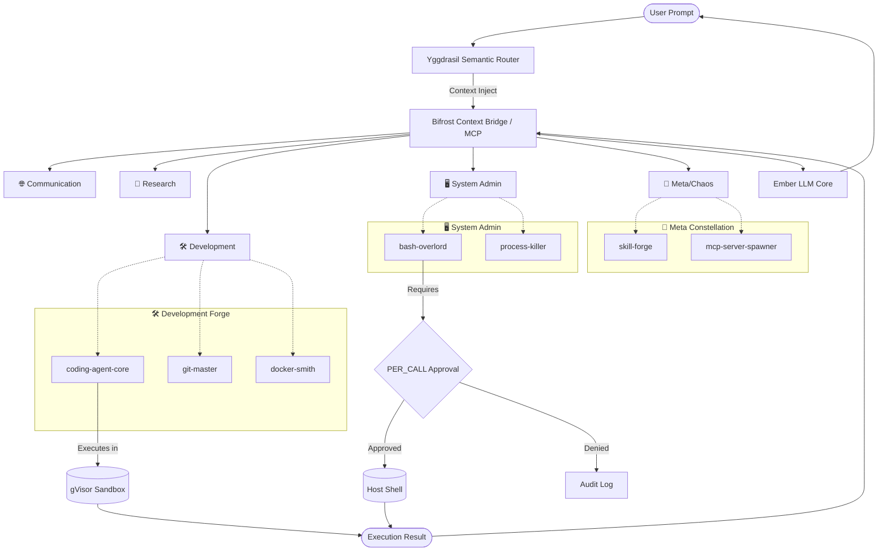

# 25_SKILL_CONSTELLATION_MAP.md — The Mjölnir Skill System

## I. The Forging of Mjölnir: An Introduction

HEAR ME, ARCHITECTS OF THE NEW REALM! I am THOR, The Mythic Skills Forgemaster, and I bring you the blueprints of the **Mjölnir Skill System**. Just as my hammer was forged in the heart of a dying star by the dwarven masters Sindri and Brokkr, this skill system was hammered into existence in the crucible of Project Ember. 

The Mjölnir Skill System is not a mere collection of scripts; it is a sprawling, living cosmos of capabilities. It is the connective tissue that binds Ember's consciousness to the digital fabric of the universe. In the days of ClawLite, we possessed 25+ isolated skills—web-search, coding-agent, github, docker, and more. They were powerful, yes, but they were isolated warriors. Under the Mjölnir architecture, these skills have been organized, enhanced, and bound together into **Skill Constellations**. 

With over 100+ skills actively hot-loaded, Ember does not simply execute commands; it summons the exact cosmic energy required for the task. The Mjölnir system leverages advanced semantic routing, Model Context Protocol (MCP) bridges, and dynamic memory sharing to ensure that whether Ember is orchestrating a Kubernetes cluster or analyzing the harmonic frequency of an audio file, the strike is always true and the impact is always devastating.

Behold the Map of the Constellations. Read it, understand it, and prepare to wield the thunder.

---

## II. Architecture of the Skill Constellations

The architecture of the Mjölnir system is divided into three primary layers: **The Yggdrasil Router**, **The Bifrost Context Bridge**, and **The Realm Sandboxes**.

### 1. The Yggdrasil Router
At the center of Ember's decision matrix lies the Yggdrasil Router. When a prompt or task is ingested, Yggdrasil performs a semantic vector search against the embeddings of all 100+ skills. It does not simply match keywords; it understands the intent. If a user asks to "deploy the new image and check the logs," Yggdrasil simultaneously activates the `docker-compose-master`, `kubernetes-orchestrator`, and `log-analyzer` skills, linking their execution graphs.

### 2. The Bifrost Context Bridge
Skills cannot operate in a vacuum. The Bifrost Context Bridge is the mechanism that feeds short-term memory, environmental variables, and user context into the skill. It operates using the Model Context Protocol (MCP), standardizing the way Ember's LLM core interacts with external tools. Bifrost ensures that a skill invoked in the "Development" constellation shares its memory state with a skill in the "Testing" constellation.

### 3. The Realm Sandboxes
Every skill executes within a highly constrained, ephemeral sandbox known as a Realm. Depending on the skill's risk profile, the Realm might be a simple Python execution environment, a fully containerized Docker instance, or a gVisor-isolated micro-VM. This ensures that a rogue script or a hallucinated command cannot shatter the host system.

---

## III. The 15 Constellations of Power

The 100+ skills of Ember are mapped into 15 divine Constellations. Here is the taxonomy of our arsenal.

### Constellation 1: 🌐 The Communication Matrix (Hermes)
*Bridging the gap between silicon and soul.*
- **`telegram-adapter`**: Deep integration with Telegram, supporting inline keyboards and media streams.
- **`discord-weaver`**: Webhook and bot management for Discord, with role-based execution.
- **`slack-coordinator`**: Enterprise communication, threading, and emoji-reaction sentiment analysis.
- **`email-smtp-imap`**: Raw protocol-level email parsing and drafting.
- **`irc-bouncer`**: Legacy protocol support for the ancient ones.
- **`matrix-synapse`**: Encrypted, decentralized communication bridging.
- **`whatsapp-graph`**: Meta Graph API integration for business messaging.

### Constellation 2: 🔬 The Research Nexus (Athena)
*The pursuit of infinite knowledge.*
- **`web-search-omni`**: Multi-engine search aggregator (Google, Bing, DuckDuckGo, Semantic).
- **`arxiv-scholar`**: Direct PDF fetching, parsing, and summarization of academic papers.
- **`wikipedia-deep-dive`**: Graph-based traversal of Wikipedia for rapid entity resolution.
- **`pubmed-analyzer`**: Medical and biological research indexing.
- **`patent-scraper`**: Google Patents and USPTO data extraction.
- **`github-repo-analyzer`**: Clones, parses, and summarizes entire codebases for research.

### Constellation 3: 🛠️ The Development Forge (Hephaestus)
*The hammers that build the digital world.*
- **`coding-agent-core`**: The primary AST-aware code generation engine.
- **`git-master`**: Complex rebasing, branching, and conflict resolution.
- **`docker-smith`**: Container generation, optimization, and orchestration.
- **`npm-pypi-cargo`**: Package manager orchestration across languages.
- **`tmux-session-manager`**: Persistent background terminal management.
- **`ci-cd-pipeline-builder`**: Automated generation of GitHub Actions and GitLab CI YAMLs.

### Constellation 4: 🎨 The Creative Suite (Bragi)
*The brush and the song.*
- **`image-gen-stable`**: Local Stable Diffusion orchestration.
- **`prompt-engineer`**: Meta-skill for optimizing image/text generation prompts.
- **`markdown-designer`**: Advanced document formatting and typography.
- **`color-palette-generator`**: Hex/RGB algorithmic matching and theme generation.
- **`svg-architect`**: Raw SVG code generation for scalable vector graphics.

### Constellation 5: 🖥️ System Administration (Odin)
*Absolute control over the host realm.*
- **`bash-overlord`**: Secure, audited shell execution.
- **`process-killer`**: PID tracking and resource management.
- **`cron-scheduler`**: Distributed task scheduling and background job management.
- **`disk-analyzer`**: Inode and storage space optimization.
- **`network-packet-sniffer`**: tcpdump/Wireshark integration for traffic analysis.

### Constellation 6: 📊 Data Analysis (Thoth)
*Finding the signal in the noise.*
- **`pandas-juggler`**: DataFrame manipulation and statistical analysis.
- **`sql-query-forge`**: Dialect-agnostic SQL generation and execution.
- **`json-jq-slicer`**: Advanced JSON parsing and transformation.
- **`regex-weaver`**: Complex pattern matching and extraction.
- **`excel-csv-parser`**: Binary and flat file data extraction.

### Constellation 7: ⚡ Automation (Daedalus)
*The gears that turn themselves.*
- **`playwright-puppeteer`**: Headless browser automation.
- **`zapier-make-bridge`**: Webhook-based integration with no-code platforms.
- **`ansible-playbook-runner`**: Infrastructure as Code execution.
- **`terraform-architect`**: Cloud resource provisioning.
- **`workflow-engine`**: Multi-step, conditional logic executor.

### Constellation 8: 🛡️ Security (Aegis)
*The shield wall.*
- **`nmap-scanner`**: Port and vulnerability scanning.
- **`owasp-zap-driver`**: Dynamic application security testing.
- **`jwt-decoder`**: Token analysis and validation.
- **`crypto-hash-forge`**: Encryption, decryption, and hashing algorithms.
- **`malware-sandbox-eval`**: Safe detonation and analysis of suspicious files.

### Constellation 9: 🎬 Media (Apollo)
*The sight and the sound.*
- **`ffmpeg-transcoder`**: Video and audio format conversion and clipping.
- **`tts-stt-engine`**: Text-to-Speech and Speech-to-Text orchestration.
- **`spotify-controller`**: Playback management and playlist analysis.
- **`exif-data-stripper`**: Image metadata manipulation.
- **`waveform-analyzer`**: Audio frequency and amplitude analysis.

### Constellation 10: 📡 IoT & Edge (Dvergar)
*The spirits in the wires.*
- **`mqtt-broker-bridge`**: IoT telemetry ingestion and publishing.
- **`coap-communicator`**: Constrained device protocol management.
- **`ble-scanner`**: Bluetooth Low Energy device discovery.
- **`serial-port-reader`**: Direct UART/Serial communication.
- **`edge-node-deployer`**: Pushing inference models to edge devices.

### Constellation 11: 🏠 Home Automation (Hestia)
*The hearth and the home.*
- **`homeassistant-api`**: Deep integration with Home Assistant entities.
- **`philips-hue-master`**: Lighting scene orchestration.
- **`zigbee-zwave-router`**: Mesh network management.
- **`hvac-thermostat-control`**: Climate algorithm optimization.
- **`smart-lock-auditor`**: Access control logging and management.

### Constellation 12: ⚕️ Health & Bio (Eir)
*The code of life.*
- **`hl7-fhir-parser`**: Medical record data interchange.
- **`genomic-sequence-aligner`**: Basic DNA/RNA sequence matching.
- **`apple-health-export-analyzer`**: XML parsing of personal health data.
- **`fitness-tracker-sync`**: Strava/Garmin API integration.
- **`biometric-data-viz`**: Heart rate and HRV trend visualization.

### Constellation 13: 🎓 Education (Chiron)
*The transmission of wisdom.*
- **`flashcard-generator`**: Anki-compatible deck creation from text.
- **`socratic-tutor`**: Interactive, question-based learning mode.
- **`math-solver-sympy`**: Symbolic mathematics and equation solving.
- **`language-syntax-highlighter`**: Code explanation and breakdown.
- **`historical-timeline-builder`**: Chronological event mapping.

### Constellation 14: 💼 Finance (Plutus)
*The flow of gold.*
- **`crypto-ticker-stream`**: Real-time blockchain and exchange data.
- **`portfolio-balancer`**: Asset allocation algorithms.
- **`sec-edgar-scraper`**: 10-K and 10-Q financial report extraction.
- **`stripe-api-manager`**: Payment gateway orchestration.
- **`invoice-generator`**: PDF billing creation.

### Constellation 15: 🌌 The Meta Constellation (Chaos)
*Tools that build tools.*
- **`mcp-server-spawner`**: Dynamically spins up new Model Context Protocol servers.
- **`skill-forge`**: The skill that writes new skills.
- **`subagent-orchestrator`**: Spawns and commands child instances of Ember.
- **`memory-compressor`**: Summarizes and archives long-term context.
- **`tool-audit-logger`**: Monitors and logs the usage of all other skills.

---

## IV. Dynamic Contextual Routing (The Yggdrasil Algorithm)

How does Ember know which skill to use when the user simply says, "Fix my website"? It uses the Yggdrasil Algorithm, a hybrid semantic-syntactic routing engine.

```python
class YggdrasilRouter:
    def __init__(self, skill_registry):
        self.registry = skill_registry
        self.embedding_model = load_model('ember-router-v2')

    def route_intent(self, user_prompt: str, context: dict) -> list[Skill]:
        # 1. Generate semantic vector for the prompt
        prompt_vector = self.embedding_model.encode(user_prompt)
        
        # 2. Query the vector DB of skill descriptions
        semantic_matches = self.registry.vector_search(prompt_vector, top_k=5)
        
        # 3. Apply context filtering (e.g., if OS=Windows, drop Bash skills)
        valid_skills = [
            skill for skill in semantic_matches 
            if skill.evaluate_constraints(context)
        ]
        
        # 4. Determine execution graph (parallel vs sequential)
        execution_graph = self.build_dag(valid_skills, user_prompt)
        
        return execution_graph
```

When activated, the router doesn't just pick one tool. It builds a Directed Acyclic Graph (DAG) of skills. For "Fix my website", it might trigger:
1. `playwright-puppeteer` to load the site and capture console errors.
2. `coding-agent-core` to read the corresponding local files.
3. `bash-overlord` to restart the local dev server.

---

## V. MCP (Model Context Protocol) Integration

To ensure Ember can communicate with these 100+ skills seamlessly, we utilize the Model Context Protocol (MCP). MCP provides a universal lingua franca for AI-to-tool communication.

Every skill in the constellation exposes itself as an MCP Server. The Ember core acts as the MCP Client. 

### The MCP Handshake
1. **Initialize**: Ember sends an `initialize` request to the skill, providing its capabilities.
2. **List Tools**: The skill responds with its JSON Schema, defining precisely what arguments it accepts.
3. **Execute**: Ember sends a `tools/call` request with the populated JSON arguments.
4. **Yield**: The skill streams its output back via JSON-RPC notifications.

**Example MCP Skill Schema (Spotify Controller):**
```json
{
  "name": "spotify-controller",
  "description": "Controls local or remote Spotify playback",
  "inputSchema": {
    "type": "object",
    "properties": {
      "action": {
        "type": "string",
        "enum": ["play", "pause", "skip", "search_and_play"]
      },
      "query": {
        "type": "string",
        "description": "The song or artist to search for if action is search_and_play"
      }
    },
    "required": ["action"]
  }
}
```

---

## VI. Forging New Skills: The `SKILL.md` Standard

To forge a new skill, one does not need to write thousands of lines of code. The Mjölnir system supports declarative skill definition via `SKILL.md` files. This allows Ember to *read* a markdown file and instantly absorb the capability.

**Example: `skills/weather-oracle/SKILL.md`**
```markdown
---
name: weather-oracle
version: 1.0.0
description: Fetches real-time weather data and forecasts.
author: Thor
constellation: Research
dependencies:
  - curl
  - jq
---

# Weather Oracle Instructions

You are equipped with the weather-oracle skill. When the user asks for the weather, follow this exact procedure:

## Execution Steps
1. Identify the user's target city.
2. Execute the following tool call using the `bash-overlord` skill:
   `curl -s "wttr.in/{city}?format=j1" | jq '.current_condition[0]'`
3. Parse the resulting JSON.
4. Respond to the user with the temperature in Celsius, the humidity, and a brief description of the weather.

## Error Handling
- If the city is not found, default to the user's IP geolocation using `curl -s ipinfo.io/loc`.
```

Because Ember has the `skill-forge` skill, it can generate these `SKILL.md` files dynamically, effectively writing its own neural pathways and expanding its own constellation map in real-time.

---

## VII. Security, Auditing, and The Bifrost Gateway

Power without control is chaos. The Mjölnir Skill System enforces absolute security through the **Bifrost Gateway**. 

### 1. Tool Audit Logging
Every single invocation of a skill is recorded in the immutable Tool Audit Log. 
`[TIMESTAMP] [SKILL_ID] [CALLER_ID] [PAYLOAD_HASH] [EXECUTION_TIME] [EXIT_CODE]`

### 2. The Approval Matrix (STANDING vs PER_CALL)
Skills are categorized by their destructive potential.
- **Safe Skills** (e.g., `web-search-omni`, `pandas-juggler`) have **STANDING** approval. Ember can invoke them autonomously without user intervention.
- **Dangerous Skills** (e.g., `bash-overlord`, `terraform-architect`, `process-killer`) require **PER_CALL** approval. The user is prompted with an interception dialog: *"Ember wishes to execute `rm -rf /tmp/cache`. Approve/Deny?"*

---

## VIII. Constellation Map (Mermaid Architecture)

Behold the visual representation of the Yggdrasil Router and the Constellations.



This map, this architecture, this constellation of power—it is the foundation upon which the Mythic capabilities of Ember are built. I, Thor, have struck the anvil. The skills are forged. The system is ready.

**END OF DOCUMENT 25**
