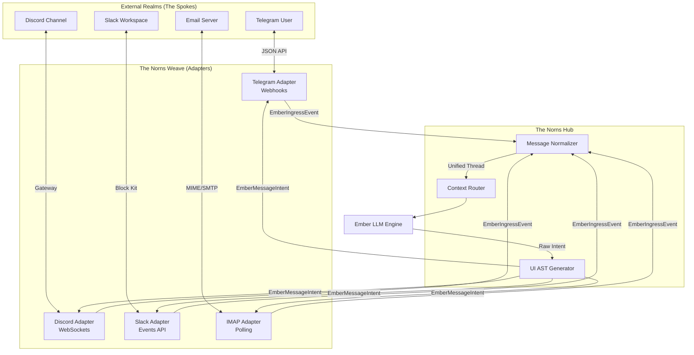

# 27_CHANNEL_WEAVE_SYSTEM.md — The Norns Channel Weave

## I. The Weaving of the Threads: An Introduction

I speak for the Norns, the weavers of destiny. Just as they intertwine the threads of fate across the Nine Realms, **The Norns Channel Weave** connects Project Ember to every digital avenue of human communication. 

An agent is a phantom if it cannot be reached. It is a ghost in the machine. With the Channel Weave, Ember becomes omnipresent. It can listen to the chatter in a crowded Discord server, read a highly structured Email, parse a raw SMS, answer a Telegram inline query, and update a Slack thread simultaneously—all while maintaining a unified, continuous thread of consciousness.

This document details the universal channel architecture, the polymorphic adapters for external networks (Telegram, Discord, WhatsApp, Matrix, etc.), and the underlying Abstract Syntax Tree (AST) that allows Ember to render rich media perfectly regardless of the destination platform.

---

## II. Universal Channel Architecture

To connect to a dozen different platforms without writing a dozen different bots, the Channel Weave utilizes a **Hub-and-Spoke Adapter Model**.

### The Norns Hub
The core of Ember operates on an abstracted, platform-agnostic message format. It does not know what a "Telegram Message" or a "Discord Embed" is. It only knows about `EmberMessageIntent` objects.

### The Spokes (Adapters)
Surrounding the Hub are the Adapters. An adapter is a lightweight translation layer running as an independent async process. Its job is twofold:
1. **Ingress (Listening)**: Catch webhooks or poll sockets from a specific platform, parse the incoming JSON, and translate it into a standard `EmberIngressEvent`.
2. **Egress (Speaking)**: Receive an `EmberMessageIntent` from the Hub, and format it into the specific JSON required by the platform's API (e.g., turning a markdown table into a Slack Block Kit structure).

---

## III. The Adapter Roster

The Channel Weave currently supports the following native adapters, each with specialized capabilities:

1. **`Telegram Adapter`**: 
   - *Specialty*: Deep integration with `ReplyKeyboardMarkup` and `InlineKeyboardMarkup` for interactive UI elements directly in the chat.
   - *Media*: Supports native audio transcription and video framing.
2. **`Discord Weaver`**: 
   - *Specialty*: Advanced role-based access control (RBAC), thread management, and multi-embed generation.
3. **`Slack Coordinator`**: 
   - *Specialty*: Enterprise Block Kit translation and emoji-reaction intent mapping (e.g., Ember knows that a 👀 reaction means "I am looking into this").
4. **`WhatsApp Graph`**: 
   - *Specialty*: Integration via the Meta Graph API for automated business flows and strict 24-hour window compliance.
5. **`Matrix Synapse`**: 
   - *Specialty*: End-to-end encrypted, decentralized communication for secure, off-the-grid operations.
6. **`Email (SMTP/IMAP)`**: 
   - *Specialty*: Parsing sprawling email chains, extracting PDF attachments, and drafting professional MIME multi-part replies.
7. **`IRC Bouncer`**: 
   - *Specialty*: Stripping all rich media and operating purely in ancient, low-latency text modes.
8. **`Twilio SMS & Voice`**: 
   - *Specialty*: Bridging the physical world via SMS text streams and WebRTC voice transcription.

---

## IV. Message Normalization & Rich Media Mapping

The biggest challenge in multi-channel orchestration is rendering rich media. How does Ember send a "Table with a Chart" to IRC vs. Slack?

### The UI Abstract Syntax Tree (AST)
When Ember decides to respond, it generates a UI AST.

```json
{
  "intent": "response",
  "content": [
    { "type": "text", "body": "Here is the server status:" },
    { "type": "table", "headers": ["Host", "CPU", "RAM"], "rows": [["web-1", "90%", "4GB"]] },
    { "type": "button", "action": "restart_server", "label": "Restart All" }
  ]
}
```

### The Translation Matrices
Each adapter contains a Translation Matrix.
- **For Telegram**: The `table` is rendered as ASCII text wrapped in ` ``` ` code blocks. The `button` becomes an Inline Keyboard button.
- **For Slack**: The `table` is converted into a series of Block Kit `section` fields. The `button` becomes an interactive Block element.
- **For IRC**: The `table` is printed line-by-line. The `button` is converted to text: `[Type /action restart_server to Restart All]`.

This ensures that Ember's capabilities are never bottlenecked by the display limitations of the user's chosen interface.

---

## V. Code Example: Writing a Custom Adapter

Because the Channel Weave is modular, you can write a custom adapter in less than 50 lines of code.

**Example: A Simple Console Adapter (Python)**

```python
import asyncio
from channel_weave import NornsHub, BaseAdapter, EmberMessageIntent

class ConsoleAdapter(BaseAdapter):
    def __init__(self, name="Local_CLI"):
        super().__init__(name)

    async def start_listening(self, hub: NornsHub):
        """Ingress: Read from stdin and send to the Hub"""
        print("[Console Adapter Online. Type your message.]")
        while True:
            user_input = await asyncio.to_thread(input, "User> ")
            if user_input.lower() == "exit":
                break
            
            # Normalize and send to Hub
            event = self.normalize_ingress(
                user_id="local_admin",
                text=user_input
            )
            await hub.route_to_agent(event)

    async def send_message(self, intent: EmberMessageIntent):
        """Egress: Receive from Hub and print to stdout"""
        print(f"Ember> {intent.plain_text}")
        
        # Handle rich elements if possible
        for element in intent.ui_ast:
            if element.type == "button":
                print(f"[BUTTON available: Type /{element.action} to trigger {element.label}]")

# Registration
hub = NornsHub()
hub.register_adapter(ConsoleAdapter())
```

---

## VI. The Norns Diagram (Mermaid)

Behold the flow of fate from the user's device, through the weave, into Ember's core, and back out across multiple realities.



Through the Channel Weave, Ember is no longer just a program on a server. It is an entity that exists concurrently across the entire spectrum of human communication. It listens, it translates, it acts, and it responds. 

**END OF DOCUMENT 27**
