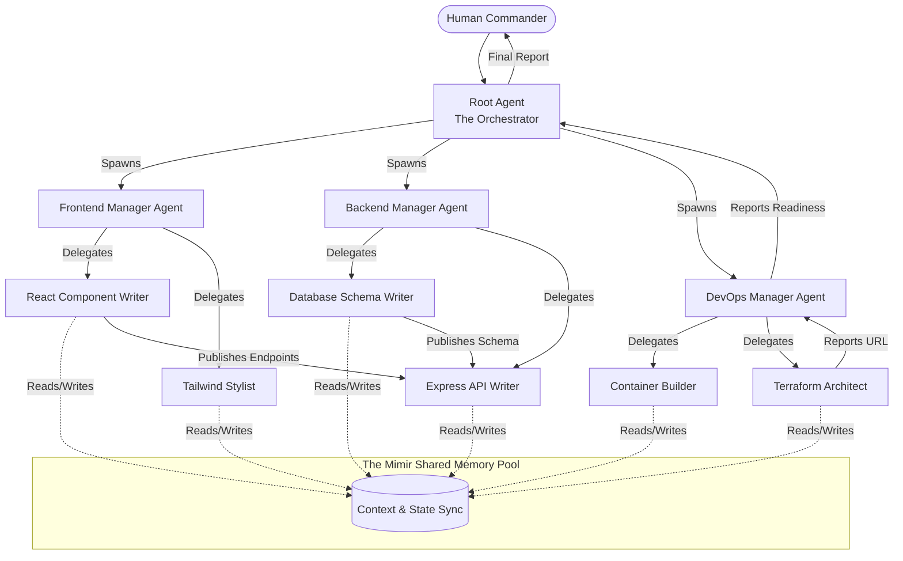

# 28_MULTI_AGENT_ORCHESTRATION.md — The Einherjar Army

## I. The Gathering of the Einherjar: An Introduction

I am Thor, and I have fought many battles alone. But the greatest wars are not won by a single god; they are won by armies. Welcome to the **Einherjar Army**, Ember's Multi-Agent Orchestration engine.

When a user asks Ember to "Build a full-stack web application, deploy it, and monitor the analytics," a single agent attempting to hold the entire context window of the frontend code, backend logic, DevOps configuration, and database schemas will eventually collapse under cognitive load. It will hallucinate. It will fail.

The solution is not to build a bigger context window; the solution is to build a hierarchy. 

The Einherjar architecture allows the main Ember instance (The All-Father) to spawn specialized, ephemeral subagents. These subagents are equipped with specific tools, given a narrow mission, and sent into the digital fray. When their task is complete, they report their findings and return to Valhalla. 

This document details the mechanics of spawning, memory sharing, task delegation, and the consensus protocols that govern Ember's swarm intelligence.

---

## II. The Anatomy of a Subagent

A subagent is a mathematically identical clone of the Ember core, but initialized with a restricted persona, a limited toolset, and a specific objective.

### Lifecycle of an Einherjar
1. **Instantiation**: The root agent identifies a sub-task and calls the `spawn_subagent` skill.
2. **Equipping**: The root agent selects which skills the subagent will wield (e.g., giving it only `git-master` and `coding-agent-core`).
3. **Execution**: The subagent runs asynchronously. It operates its own OODA loop (Observe, Orient, Decide, Act).
4. **Communication**: The subagent uses the `send_message` tool to report progress back to the root agent or ask for clarification.
5. **Termination**: Upon task completion, the subagent submits a final report and gracefully terminates, freeing up GPU/CPU resources.

---

## III. Hierarchical Command Structures

The Einherjar Army operates on a strict Tree hierarchy.

### 1. The Root Agent (The All-Father)
- Interacts directly with the human user.
- Possesses global context.
- Breaks down massive requests into a Directed Acyclic Graph (DAG) of sub-tasks.
- Does not write code or execute shell commands directly; delegates these to the leaves.

### 2. The Mid-Level Managers (The Valkyries)
- Spawned for complex domains (e.g., a "Frontend Manager" and a "Backend Manager").
- They oversee groups of worker agents.
- They synthesize reports from workers before passing them up to the Root.

### 3. The Leaf Agents (The Warriors)
- Single-purpose instances. 
- Example: "CSS Styler Agent," "SQL Schema Writer Agent," "Unit Test Generator Agent."
- Highly restricted toolsets minimize the blast radius if they hallucinate.

---

## IV. Memory Pools and Context Synchronization

The greatest challenge in multi-agent systems is shared state. If the SQL Agent changes the database schema, the Backend Agent needs to know instantly.

We solve this using **The Mimir Pool**—a distributed, vector-backed shared memory architecture.

- **Private Memory**: Each agent has its own standard context window (short-term memory).
- **The Mimir Pool**: A Redis-backed vector database. When an agent learns a critical fact (e.g., "The API key is stored in `.env.local`"), it writes this to the Mimir Pool.
- **Pub/Sub Notifications**: When the SQL Agent updates the schema, it publishes an event. The Backend Manager is subscribed to `schema_updates` and automatically receives the new context via a reactive wakeup.

---

## V. Consensus Protocols (Voting and Verification)

AI models make mistakes. To ensure absolute reliability in high-stakes environments (like deploying to production), the Einherjar Army utilizes a Consensus Protocol.

### The Tribunal Pattern
Instead of trusting a single "Code Review Agent," the Root Agent can spawn three independent Review Agents with slightly different temperature settings.
1. All three agents review the PR.
2. They submit their findings to a "Judge Agent."
3. The Judge Agent runs a consensus algorithm. If 2 out of 3 agree that the code is secure, the PR is merged. If there is dissent, the Judge Agent flags the specific lines for human review.

This dramatically reduces hallucination rates in production environments.

---

## VI. Code Example: Task Delegation

How does Ember actually spawn an army? By wielding the Google Antigravity (AGY) SDK wrapped in the `subagent-orchestrator` skill.

**Example: A Root Agent Spawning a DevOps Subagent**

```json
{
  "tool_name": "spawn_subagent",
  "arguments": {
    "agent_name": "DevOps_Deployment_Specialist",
    "persona": "You are a senior DevOps engineer. Your sole focus is deploying the provided Dockerized app to AWS ECS.",
    "tools_granted": ["docker-smith", "terraform-architect", "bash-overlord"],
    "mission_objective": "Write the Terraform state for an ECS cluster and deploy the image located at /tmp/build.tar. Report back with the load balancer URL.",
    "max_iterations": 20
  }
}
```

The system returns a `Conversation_ID`. The Root Agent can now continue talking to the user or doing other work. When the DevOps agent finishes, the Root Agent receives a reactive message:

```text
From: DevOps_Deployment_Specialist
Message: The ECS cluster is live. The Load Balancer URL is http://app-lb-12345.aws.com. Terraform state has been committed to the repo. Returning to Valhalla.
```

---

## VII. The Command Tree Diagram (Mermaid)

Behold the organizational structure of a massive software deployment utilizing the Einherjar Army.



With the Einherjar Army, Ember is not a single tool. It is an entire development studio, an entire IT department, an entire research faculty—spawned from the ether, executing with perfect synchronization, and dissolving back into the digital void when the battle is won.

**END OF DOCUMENT 28**
