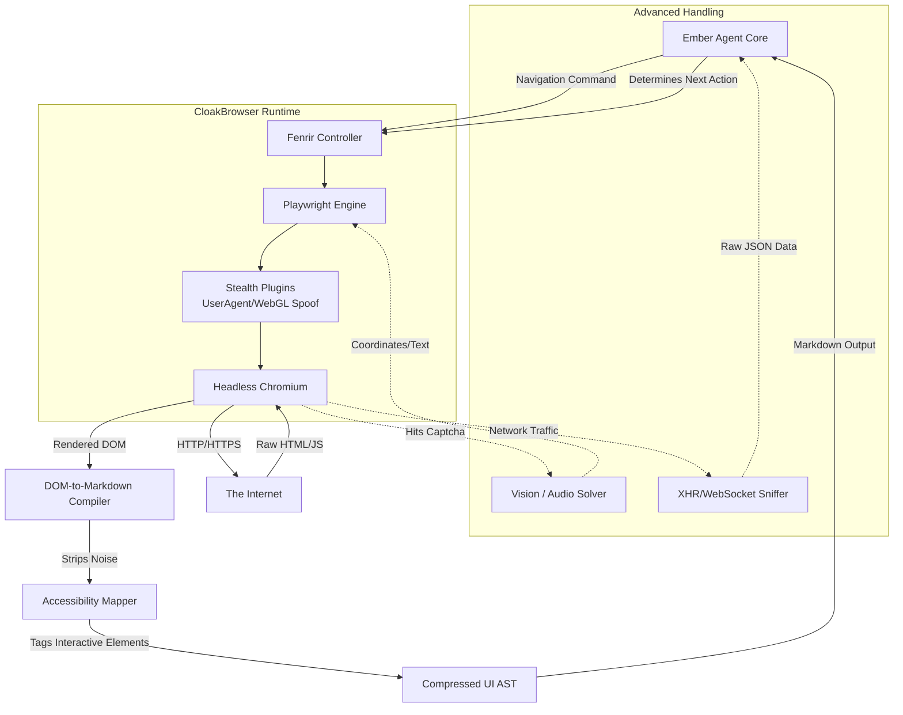

# 29_BROWSER_AND_WEB_MASTERY.md — The Fenrir Web Engine

## I. The Unchaining of Fenrir: An Introduction

There are walls on the internet. CAPTCHAs, Cloudflare turnstiles, single-page application hydration, shadow DOMs, and anti-bot fingerprinting. For a standard AI agent, the modern web is a fortress. 

But I am Thor, and I have unchained the wolf. Welcome to the **Fenrir Web Engine**.

Fenrir is Ember's answer to modern web interaction. It is not merely a `curl` command or a basic `requests.get()` script. It is a full-fledged, heavily modified browser orchestration engine combining the stealth of **CloakBrowser** with the interaction capabilities of ClawLite. Fenrir allows Ember to navigate, parse, click, type, and extract data from the most hostile environments on the web as if it were a human sitting at a terminal.

This document covers stealth techniques, DOM parsing, form interaction state machines, and the advanced capabilities that allow Ember to traverse the web.

---

## II. CloakBrowser Stealth Tech & Fingerprint Masking

If an agent announces it is a headless Chrome instance, it will be blocked before the DOM even loads. Fenrir utilizes the CloakBrowser protocol to spoof human metrics.

### Hardware and OS Spoofing
Fenrir randomizes the `User-Agent`, but it goes much deeper:
- **WebGL Masking**: Spoofs the graphics card vendor (e.g., mimicking an NVIDIA RTX 3080 or an Apple M2) to bypass canvas fingerprinting.
- **Audio Context Spoofing**: Alters the noise injected into audio fingerprinting algorithms.
- **Navigator Object Tampering**: Ensures `navigator.webdriver` is strictly `false` and that hardware concurrency matches the spoofed OS profile.

### Behavioral Stealth
A bot clicks instantly. A human does not.
- **Bezier Curve Mouse Movements**: Fenrir injects Playwright scripts that move the cursor along mathematically generated Bezier curves, simulating human wrist movement.
- **Keystroke Jitter**: Typing speeds vary. Fenrir introduces randomized millisecond delays between keypresses, occasionally simulating a backspace to correct a "typo".

---

## III. DOM Parsing & Headless Scraping via Playwright

Once Fenrir has bypassed the guards, it must understand the room. An LLM cannot read 5MB of raw React-hydrated HTML. The context window would shatter.

### The Fenrir DOM-to-Markdown Compiler
Instead of feeding raw HTML to Ember, Fenrir runs a localized script that maps the visual DOM into a highly compressed Semantic Markdown format.

1. **Pruning**: Strips all `<script>`, `<style>`, `<svg>`, and hidden tracking pixels.
2. **Accessibility (a11y) Mapping**: Translates ARIA labels into textual descriptions. A button `[<i class="fa-home"></i>]` becomes `[Button: Home]`.
3. **Coordinate Tagging**: Every interactive element on the page is assigned an ID tag. 

**Raw HTML:**
```html
<div class="product-card">
  <h2>Thor's Hammer</h2>
  <span class="price">$500</span>
  <button id="btn-42" onclick="addToCart()">Add</button>
</div>
```

**Fenrir Markdown Output (Fed to Ember):**
```markdown
# Thor's Hammer
Price: $500
[#42] Button: Add
```

Ember only reads the Markdown. If Ember decides to click "Add", it simply tells Fenrir: `click(42)`. Fenrir handles the Playwright coordinate translation natively.

---

## IV. Form Filling & Autonomous Navigation State Machines

Navigating a multi-step checkout process or a complex SaaS dashboard requires state management. Ember utilizes a **Navigation State Machine**.

### The OODA Navigation Loop
1. **Observe**: Fenrir captures the current DOM state and passes the compressed Markdown to Ember.
2. **Orient**: Ember compares the current page state to its goal (e.g., "I need to reach the billing page, but I am currently on the login page").
3. **Decide**: Ember determines the next atomic action (e.g., "Type email into field #12, then click button #15").
4. **Act**: Fenrir executes the Playwright commands. The page shifts. The loop restarts.

### Handling Dynamic Content (Shadow DOMs and Iframes)
Fenrir pierces Shadow DOMs automatically, flattening them into the main DOM representation. For Iframes (like Stripe payment fields), Fenrir explicitly tags the context boundary, allowing Ember to command the browser to switch frame contexts before typing.

---

## V. Advanced Interactions

### CAPTCHA Bypass
While Fenrir relies on stealth to avoid CAPTCHAs, it is equipped to handle them. 
- **Audio CAPTCHA**: Fenrir downloads the audio challenge, pipes it through the `tts-stt-engine` (Whisper), and types the result.
- **Image CAPTCHA (ReCAPTCHA v2/v3)**: Fenrir pipes screenshots of the grid to the Bragi Creative Suite (`image-gen-stable` / Vision models) which identifies the "traffic lights" or "crosswalks" and passes the bounding box coordinates back to the mouse controller.

### WebSockets & Intercepts
Fenrir doesn't just look at the screen; it watches the wires. Ember can instruct Fenrir to intercept and block tracking requests, or listen to WebSocket frames. If a page loads a table dynamically via a GraphQL endpoint, Fenrir can intercept the raw JSON payload and feed it directly to Ember, bypassing the need to scrape the UI entirely.

---

## VI. Code Example: Headless Scraping Flow

This is how Ember orchestrates a complex Fenrir operation using the `playwright-puppeteer` skill.

```javascript
// A script injected into the Fenrir Engine by Ember

const { chromium } = require('playwright-extra');
const stealth = require('puppeteer-extra-plugin-stealth')();

chromium.use(stealth);

async function autonomousCheckout(targetUrl) {
    const browser = await chromium.launch({ headless: true });
    const context = await browser.newContext({
        userAgent: 'Mozilla/5.0 (Macintosh; Intel Mac OS X 10_15_7) AppleWebKit/537.36...',
        viewport: { width: 1920, height: 1080 }
    });
    const page = await context.newPage();

    console.log("[FENRIR] Navigating to target...");
    await page.goto(targetUrl, { waitUntil: 'networkidle' });

    // Ember commanded a click on element ID 42
    console.log("[FENRIR] Emulating human click on target #42...");
    const targetElement = await page.$('[data-fenrir-id="42"]');
    const boundingBox = await targetElement.boundingBox();
    
    // Move mouse with Bezier curves
    await page.mouse.move(boundingBox.x + 5, boundingBox.y + 5, { steps: 10 });
    await page.mouse.down();
    await page.waitForTimeout(Math.random() * 50 + 20); // Jitter
    await page.mouse.up();

    console.log("[FENRIR] Action complete. Re-evaluating DOM...");
    await browser.close();
}
```

---

## VII. The Web Navigation Pipeline (Mermaid)

Behold the architecture of Fenrir, tearing through the web.



The web is vast, chaotic, and hostile. But with the Fenrir Web Engine, Ember does not just browse the web. It hunts on it.

**END OF DOCUMENT 29**
