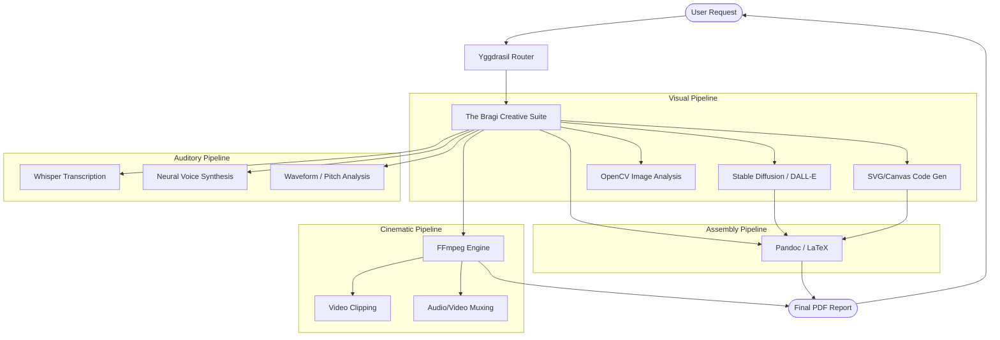

# 31_MEDIA_AND_CREATIVE_SUITE.md — The Bragi Creative Suite

## I. The Song of Bragi: An Introduction

Bragi, the bard of Valhalla, weaves tales that move the hearts of gods. A truly mythic AI agent cannot only communicate in raw text and code; it must master the visual, the auditory, and the cinematic. It must be creative.

Welcome to the **Bragi Creative Suite**, Project Ember's native multimedia engine. 

While most AI agents view the world entirely through the lens of ASCII strings, Ember possesses the architectural infrastructure to "see" images, "hear" audio, "watch" video, and—most importantly—generate them autonomously. By orchestrating a massive suite of underlying tools like FFmpeg, Whisper, Stable Diffusion, and OpenCV, Ember transforms from a mere chatbot into a full-scale digital production studio.

This document explores the pipelines that allow Ember to generate architectural diagrams, compose synthetic voice podcasts from text, edit video files, and assemble presentation-ready PDFs.

---

## II. The Visual Pipeline

Ember’s visual capabilities are split into **Generation** and **Analysis**.

### Image Generation (`image-gen-stable`)
Ember interfaces directly with local or remote Stable Diffusion instances via the MCP protocol. 
- **Prompt Engineering Meta-Skill**: Ember does not just pass the user's prompt blindly. If the user asks for "a cool spaceship," Ember intercepts the request, runs it through the `prompt-engineer` skill, and expands it: `"A sleek, hyper-realistic, titanium spacecraft, cyberpunk aesthetic, volumetric lighting, 8k resolution, octane render..."`
- **SVG Architecture**: For vector graphics, logos, and UI icons, Ember utilizes the `svg-architect` skill, mathematically generating paths and polygons natively in code.

### Vision and Analysis (`exif-data-stripper`, OpenCV)
Ember can read pixels. When a user uploads an image, Ember doesn't just pass it to a Vision model. It can use OpenCV to find bounding boxes, detect faces, read color histograms, and extract embedded EXIF metadata (GPS coordinates, camera models) to provide deep, structural context before the LLM even begins semantic reasoning.

---

## III. The Auditory Pipeline

The Bragi suite turns Ember into a sonic entity.

### Speech-To-Text (STT) and Contextual Listening
If a user sends a voice note via the WhatsApp or Telegram channels, the Channel Weave immediately pipes the raw `.ogg` file to the `tts-stt-engine`. Ember utilizes OpenAI's Whisper (running locally or via API) to transcribe the audio. 
Crucially, it also uses `waveform-analyzer` to detect the amplitude and frequency, allowing Ember to infer if the user is shouting, whispering, or speaking in a noisy environment.

### Text-To-Speech (TTS)
Ember speaks. By utilizing advanced neural TTS models (like ElevenLabs or local Coqui TTS), Ember can generate highly realistic voice responses. Ember automatically injects SSML (Speech Synthesis Markup Language) to add pauses, pitch changes, and emotional inflection based on the semantic context of its own generated text.

---

## IV. The Cinematic Pipeline

Manipulating video is computationally expensive, yet Ember manages it through the `ffmpeg-transcoder` skill.

- **Video Framing & Extraction**: Given a 2-hour video, Ember can extract a frame every 10 seconds, pass those frames to the Vision model to find a specific scene (e.g., "Find the moment the red car crashes"), and then use FFmpeg to clip out that exact 5-second segment.
- **Transcoding and Compression**: Ember can autonomously optimize massive raw video files for web deployment, calculating the necessary bitrate to achieve a target file size.
- **Audio Muxing**: Ember can strip the audio track, translate the dialogue, synthesize a new voiceover track, and mux it back onto the video.

---

## V. Algorithmic Art and PDF Assembly

Ember doesn't just create raw assets; it packages them.

### Document Assembly (`markdown-designer` & LaTeX)
When tasked with creating a report, Ember synthesizes the data, generates the accompanying charts (via matplotlib or Mermaid), and then compiles a beautiful, typeset PDF document using LaTeX or Pandoc. 
It understands typography—kerning, leading, and font hierarchies.

---

## VI. Code Example: Auto-generating a Podcast from a URL

Imagine the user says: *"Ember, turn this Wikipedia article into a 2-minute podcast."* 

Ember's internal execution graph would look like this:

```python
async def create_podcast(url: str):
    # 1. Research Constellation
    article_text = await Ember.skills['web-search-omni'].extract_text(url)
    
    # 2. Meta/Creative Constellation: Draft the script
    script = await Ember.llm.generate(
        prompt=f"Turn this article into a 2-person podcast script: {article_text}"
    )
    
    # 3. Audio Pipeline: Synthesize voices
    host1_audio = await Ember.skills['tts-stt-engine'].synthesize(
        text=script.host1_lines, voice_id="mark_professional"
    )
    host2_audio = await Ember.skills['tts-stt-engine'].synthesize(
        text=script.host2_lines, voice_id="sara_conversational"
    )
    
    # 4. Cinematic Pipeline: Splice and mix audio using FFmpeg
    final_mix = await Ember.skills['ffmpeg-transcoder'].mix_audio(
        tracks=[host1_audio, host2_audio],
        background_music="assets/lofi_beat.mp3",
        crossfade_ms=500
    )
    
    return final_mix
```

In a matter of seconds, Ember orchestrates a web scraper, a creative writer, two voice actors, and a sound engineer.

---

## VII. Media Pipeline Diagram (Mermaid)

The flow of raw data into art.



The Bragi Creative Suite proves that AI is no longer just a calculator. It is a creator. Through Ember, the data sings.

**END OF DOCUMENT 31**
