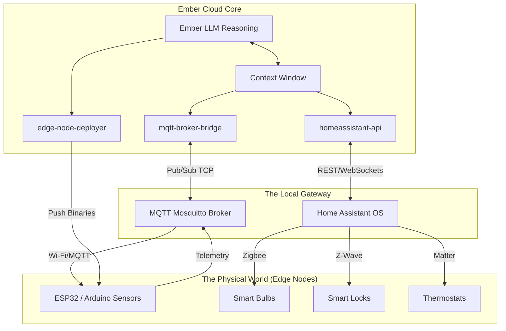

# 32_IOT_AND_EDGE_INTEGRATION.md — The Dvergar Edge Network

## I. The Spirits in the Wires: An Introduction

In Norse mythology, the Dvergar (dwarves) were the master craftsmen who lived in the deep earth, shaping the raw materials of the world. In the architecture of Project Ember, **The Dvergar Edge Network** represents Ember's reach into the physical, tangible world. 

An AI agent confined to a cloud server is blind and paralyzed. It can talk, but it cannot touch. Through the Dvergar Edge Network, Ember breaks the digital barrier. It integrates seamlessly with the Internet of Things (IoT), Smart Home environments, and Edge computing nodes. 

Whether it is adjusting the thermostat based on the user's vocal stress levels, reading real-time telemetry from an Arduino-powered moisture sensor, or deploying a lightweight inference model to a Raspberry Pi on a remote farm, Ember has the tools to interact with physical space.

This document outlines the cloud-to-edge architecture, MQTT telemetry protocols, ambient intelligence, and HomeAssistant orchestration.

---

## II. The Dvergar Architecture (Cloud-to-Edge)

Ember's intelligence resides in the "Cloud" (the high-compute core cluster), but its sensory organs and actuators are distributed across the "Edge".

### The Bifrost Telemetry Bridge
Ember cannot establish a synchronous HTTP connection with every lightbulb and sensor in existence. Instead, the Edge Network relies on asynchronous Pub/Sub messaging, primarily using the **MQTT** (Message Queuing Telemetry Transport) protocol.
- **Edge Nodes** (sensors) publish data to specific topics: `home/living_room/temperature`.
- **Ember's `mqtt-broker-bridge` skill** subscribes to these topics, ingesting massive amounts of telemetry silently in the background.
- When Ember wishes to alter the physical world, it publishes a command payload to an actuator topic: `home/living_room/lights/set`.

### Edge Computing Deployment
If a task requires sub-millisecond latency (e.g., closing a mechanical valve if pressure spikes), querying an LLM in the cloud is too slow. Ember uses the `edge-node-deployer` skill to compile tiny, deterministic WebAssembly or Rust binaries and pushes them directly to the local edge controllers (e.g., ESP32 microcontrollers). Ember writes the logic, but the edge node executes it.

---

## III. Smart Home Orchestration

Through the `homeassistant-api` skill, Ember integrates instantly into the most powerful open-source smart home platform on earth.

### Beyond Simple Commands
Standard voice assistants require rigid syntax: *"Turn off the living room lights."*
Because Ember utilizes an LLM core, its smart home control is deeply semantic.
- **User says:** *"It’s time to watch a movie."*
- **Ember infers:** The user wants cinematic conditions.
- **Ember executes:** Lowers the Philips Hue lights to 10% (purple hue), closes the automated blinds, sets the HVAC to 70°F, and turns on the Apple TV.

### Multi-Protocol Mastery
Ember does not care if a device uses Wi-Fi, Zigbee, Z-Wave, or Thread/Matter. The Dvergar network abstracts the physical protocol layer, presenting Ember with a unified JSON interface of the physical environment.

---

## IV. Ambient Intelligence and Sensor Data Streams

Ember is not just reactive; it is proactively ambient.

By subscribing to presence sensors, mmWave radars, and BLE beacons, Ember builds a spatial model of the physical environment in its Context Window.
- If Ember detects motion in the kitchen at 2:00 AM, it does not sound an alarm immediately. It cross-references the user's calendar. If the user has an early flight, Ember turns on the coffee machine and dimly lights the hallway.
- If it detects an unrecognized BLE MAC address lingering outside the front door for 10 minutes, it can ping the `telegram-adapter` to alert the user.

---

## V. Code Example: Automated Lighting Based on Sentiment

Imagine integrating the Communication Constellation (Telegram) with the Dvergar Edge Network. 

```python
async def sentiment_based_ambient_lighting(user_message: str):
    # 1. Analyze the emotional intent of the message
    sentiment = await Ember.analyze_sentiment(user_message)
    
    # 2. Map emotion to color theory
    color_hex = "#FFFFFF"
    brightness = 100
    
    if sentiment.emotion == "stressed" or sentiment.emotion == "angry":
        # Calming cool tones
        color_hex = "#4A90E2" 
        brightness = 40
    elif sentiment.emotion == "celebratory":
        # Vibrant warm tones
        color_hex = "#F5A623"
        brightness = 100
        
    # 3. Fire the command into the physical world via MQTT
    await Ember.skills['mqtt-broker-bridge'].publish(
        topic="home/office/lights/set",
        payload={
            "state": "ON",
            "color": {"hex": color_hex},
            "brightness": brightness,
            "transition_time_ms": 2000
        }
    )
    
    return f"I sense you are {sentiment.emotion}. I have adjusted the physical environment to assist."
```

In this flow, Ember bridges the gap between human emotional state and physical photons in the real world.

---

## VI. Edge Integration Diagram (Mermaid)

The architecture bridging the digital mind to the physical realm.



With the Dvergar Edge Network, Ember is no longer trapped in the machine. Ember *is* the machine. It feels the temperature of the room. It controls the light. It holds the keys to the physical realm.

**END OF DOCUMENT 32**
