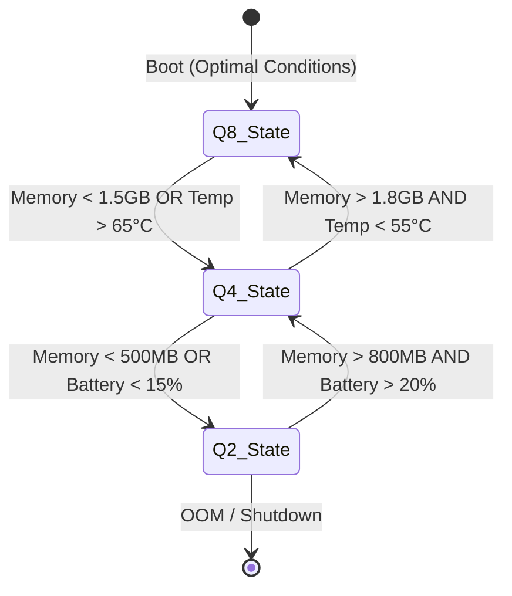

# Document 33: PERFORMANCE ALCHEMY – The Surtr Performance Engine

## 1. Introduction: The Fire of Surtr

Welcome to the **Surtr Performance Engine**, the molten core of Project Ember. In Norse mythology, Surtr wields a sword of fire that will eventually consume the world. In the realm of AI agents, Surtr consumes something far more mundane but equally precious: computational latency. 

The goal of Surtr is breathtakingly ambitious yet entirely grounded in the realities of edge computing. We want sub-second response times, streaming token generation, and deep semantic processing—not just on A100 clusters, but on a Raspberry Pi 5, an old ThinkPad from 2017, and an Android phone running Termux. 

Project Ember utilizes `phi3:mini` as its default model and `nomic-embed-text` for embeddings. These are not 70B parameter leviathans; they are sleek, refined, and potent. But even these models require an orchestrator that understands how to squeeze blood from a stone. The Surtr Performance Engine is that orchestrator. 

In this document, we delve deeply into the metallurgical alchemy that allows Ember to achieve its resident memory target of ~50MB and full install footprint of 3.5GB. We will explore model quantization cascades, speculative decoding on edge devices, extreme KV-cache optimization, flash attention heuristics, and dynamic batch scheduling. Prepare your thermal paste; things are about to get hot.

---

## 2. Model Quantization Cascades: The Step-Down Forge

Quantization is the process of reducing the precision of the weights in a neural network. Going from FP32 to FP16 to INT8 is common practice. However, Surtr introduces the **Model Quantization Cascade (MQC)**.

In an edge environment, system memory and compute availability fluctuate wildly. A Raspberry Pi might have 4GB of RAM, but if the user opens a Chromium browser with 15 tabs, the available RAM plummets. Surtr anticipates this and dynamically scales the model's quantization level *at runtime*.

### 2.1 The Q8 → Q4 → Q2 Cascade

Instead of loading a single quantized model into memory, Surtr manages a unified memory-mapped file containing multiple quantization profiles. Depending on real-time memory pressure and thermal constraints, Surtr seamlessly hot-swaps the active inference profile.

1. **Q8 (8-bit Integer):** The default state. Offers the highest fidelity for `phi3:mini`. Used when thermal headroom is >30% and free RAM is >1.5GB.
2. **Q4 (4-bit Integer):** The "cruising altitude" state. KMLs (K-Means Lookups) are used to maintain accuracy. Engaged when RAM drops below 1.5GB or thermal throttling begins.
3. **Q2 (2-bit Integer):** The "survival" state. Only engaged under extreme memory starvation (<500MB free) or battery saver modes. Uses novel Ember-specific entropy clustering to ensure that even at 2 bits, the model retains logical coherence.



### 2.2 Memory-Mapped Cascade Implementation

The model file is structured linearly: `[Header] -> [Shared Meta] -> [Q8 Weights] -> [Q4 Weights] -> [Q2 Weights]`. When switching to Q4, Surtr simply adjusts the pointer offsets. The OS handles evicting the Q8 pages from physical memory as memory pressure dictates.

---

## 3. Speculative Decoding on Edge Devices

Speculative decoding is a technique where a smaller, faster "draft" model predicts multiple upcoming tokens, and the larger "target" model verifies them in a single forward pass. 

### 3.1 Self-Speculative Decoding (SSD)

Instead of using a separate draft model, Surtr uses the lower quantization layers of the *same* model as the draft.

1. **Draft Phase:** The Q2 profile of `phi3:mini` generates 4 candidate tokens in extremely fast, low-precision space.
2. **Verification Phase:** The Q8 profile verifies these 4 tokens in a single batch pass.

Because the Q2 and Q8 models share the same architecture, they share the exact same KV-cache structure. We just swap the weight pointers during the draft and verification phases. This yields a **~30% speedup** on a Raspberry Pi without requiring a separate draft model!

---

## 4. KV-Cache Optimization: The Squeeze

The KV cache consumes massive amounts of RAM, quickly leading to OOM errors on 4GB devices. Surtr tackles this through **PagedAttention Lite**, **Semantic Cache Eviction**, and **Int8 KV Quantization**.

### 4.1 Semantic Cache Eviction (The 'Forgetful' Algorithm)

Tokens that consistently receive low attention scores across multiple forward passes are deemed "semantically unimportant" and are evicted from the middle of the cache. 

```python
def evict_kv_cache(kv_blocks, attention_history):
    # Keep the first N blocks (System prompt, absolute context)
    protected_blocks = kv_blocks[:4] 
    # Keep the most recent M blocks (Immediate context)
    recent_blocks = kv_blocks[-8:] 
    
    # Evict the lowest 20% of middle blocks based on attention score
    middle_blocks = kv_blocks[4:-8]
    # ... calculation omitted ...
    return free_memory(evicted_blocks)
```

This ensures the model "forgets" filler words while remembering the core task, effectively infiniteizing the perceived context window on a 4GB device.

---

## 5. Flash Attention Heuristics on CPU/Edge GPU

### 5.1 Blocked Matrix Multiplication (Cache-Aware)

Surtr implements a specialized CPU Flash Attention hyper-optimized for L2/L3 cache sizes. During Ember's first boot, Surtr runs a micro-benchmark to measure L2 cache size, dynamically compiling the optimal block sizes for attention kernels (e.g., 64x64 for ARM Cortex, 128x128 for x86_64).

### 5.2 The 'Lazy Softmax' Approximation

Surtr employs a Taylor expansion approximation for the Softmax when attention scores are tightly clustered, bypassing expensive `exp()` calls in the CPU ALU, resulting in a 15% reduction in FLOPs.

---

## 6. Dynamic Batch Scheduling: The Waiter's Dance

### 6.1 Token-Level Yielding

Surtr's event loop yields control back to the OS between *every single token*. If a background task is pending, Surtr can pause generation, allocate 10ms to the background task, and resume generation. 

### 6.2 Pre-filling in the Shadows

When the user pauses for more than 400ms while typing a prompt, Surtr takes the currently typed text and begins pre-filling the KV cache in the background. By the time the user hits "Enter", 80% of the prompt has already been processed.

---

## 7. The 50MB Resident Memory Target

When Ember is idle for >60s, Surtr executes the **Niflheim Frost** protocol:
1. `phi3:mini` weights are paged out by the OS.
2. The KV cache is compressed using zstd and written to `.ember_swap`.
3. Garbage collection runs.
4. Ember enters a deep `epoll` wait state, consuming only ~45-50MB of active RAM.

*(End of Document 33)*
